# Kloudbean Internal-Linking Map

The wiring diagram for the whole content operation. It shows every idea (the 100 live
articles plus the planned topics), how they link up/down/across, which pages are the
natural hubs, which are orphans, and where the silos bridge into each other. Follow this
to wire links without re-deciding each time.

Grounded in `content-studio/SILO-PLAN-AND-ROADMAP.md` (the finalized 11-silo taxonomy and
topic names, used verbatim) and the actual `content-studio/` folders (a slug is **LIVE**
only if its folder exists; everything else from the plan is **NEW**, planned, not written).

**Legend:** **LIVE** = folder exists today · **NEW** = planned, no folder yet ·
**PILLAR** = live silo hub · **CREATE-PILLAR** = hub that does not exist yet (write first) ·
`*` prefix on a slug = NEW. Example anchor form: `https://www.kloudbean.com/blog/<slug>/`.

Totals: **100 LIVE articles** mapped (each in exactly one silo), **132 NEW topics** mapped
(124 plan-named spokes + 6 new pillars + 2 example UAE/India geo-replication rows).

---

## 1. Bird's-eye graph

Pillars point down to their spokes (solid). Dashed edges are the defined cross-silo bridges.
Navy nodes are live pillars, green nodes are pillars still to create, dashed-purple nodes are
NEW spokes. Each silo shows the pillar plus a representative set of spokes; the rest are in
the per-silo tables below.

```mermaid
graph TD

  subgraph S1["Silo 1 · Deploy AI / vibe-coded apps"]
    s1p[["deploy-ai-built-app-to-production · PILLAR"]]
    s1a["deploy-lovable-app-to-your-own-server"]
    s1b["deploy-bolt-new-app"]
    s1c["deploy-cursor-app"]
    s1d["move-lovable-app-off-vercel"]
    s1n("* connect-a-database-to-your-lovable-app · NEW")
    s1more["(+18 more · see S1 table)"]
    s1p --> s1a
    s1p --> s1b
    s1p --> s1c
    s1p --> s1d
    s1p --> s1n
    s1p --> s1more
  end

  subgraph S2["Silo 2 · Deployment fundamentals + frameworks"]
    s2p(["* how-to-deploy-any-app · CREATE-PILLAR"])
    s2a["deploy-node-app-to-managed-cloud"]
    s2b["deploy-nextjs-app-to-your-own-server"]
    s2c["deploy-django-app"]
    s2d["ci-cd-auto-deploy-from-github"]
    s2e["environment-variables-done-right"]
    s2n("* deploy-express-app · NEW")
    s2more["(+24 more · see S2 table)"]
    s2p --> s2a
    s2p --> s2b
    s2p --> s2c
    s2p --> s2d
    s2p --> s2e
    s2p --> s2n
    s2p --> s2more
  end

  subgraph S3["Silo 3 · Managed databases + storage"]
    s3p[["add-managed-database-to-your-app · PILLAR"]]
    s3a["managed-postgresql-hosting"]
    s3b["managed-mysql-hosting"]
    s3c["managed-redis-hosting"]
    s3d["mysql-vs-postgresql"]
    s3bk["server-backups-guide"]
    s3n("* managed-mongodb-hosting · NEW")
    s3more["(+15 more · see S3 table)"]
    s3p --> s3a
    s3p --> s3b
    s3p --> s3c
    s3p --> s3d
    s3p --> s3bk
    s3p --> s3n
    s3p --> s3more
  end

  subgraph S4["Silo 4 · Comparisons / alternatives / vs"]
    s4p(["* best-managed-cloud-hosting · CREATE-PILLAR"])
    s4a["cloudways-alternatives"]
    s4b["kloudbean-vs-cloudways"]
    s4c["vercel-alternative-for-full-stack-apps"]
    s4d["digitalocean-vs-kloudbean"]
    s4e["heroku-alternative-for-modern-apps"]
    s4n("* supabase-alternative · NEW")
    s4more["(+24 more · see S4 table)"]
    s4p --> s4a
    s4p --> s4b
    s4p --> s4c
    s4p --> s4d
    s4p --> s4e
    s4p --> s4n
    s4p --> s4more
  end

  subgraph S5["Silo 5 · WordPress + WooCommerce"]
    s5p(["* managed-wordpress-hosting · CREATE-PILLAR"])
    s5a["speed-up-wordpress"]
    s5b["secure-wordpress-hosting"]
    s5c["agency-wordpress-hosting"]
    s5d["wordpress-multisite-hosting"]
    s5n("* woocommerce-hosting · NEW")
    s5more["(+18 more · see S5 table)"]
    s5p --> s5a
    s5p --> s5b
    s5p --> s5c
    s5p --> s5d
    s5p --> s5n
    s5p --> s5more
  end

  subgraph S6["Silo 6 · Agency / multi-app / white-label"]
    s6p[["hosting-for-agencies-playbook · PILLAR"]]
    s6a["how-agencies-host-20-client-apps"]
    s6b["white-label-hosting-for-agencies"]
    s6c["host-multiple-apps-one-server"]
    s6n("* subuser-and-uac-guide · NEW")
    s6more["(+7 more · see S6 table)"]
    s6p --> s6a
    s6p --> s6b
    s6p --> s6c
    s6p --> s6n
    s6p --> s6more
  end

  subgraph S7["Silo 7 · Self-hosted tools"]
    s7p[["best-self-hosted-tools · PILLAR"]]
    s7a["self-host-supabase"]
    s7b["self-host-n8n"]
    s7c["self-host-ghost"]
    s7d["self-host-gitlab"]
    s7n("* self-host-penpot · NEW")
    s7more["(+14 more · see S7 table)"]
    s7p --> s7a
    s7p --> s7b
    s7p --> s7c
    s7p --> s7d
    s7p --> s7n
    s7p --> s7more
  end

  subgraph S8["Silo 8 · Infra concepts"]
    s8p(["* how-cloud-hosting-works · CREATE-PILLAR"])
    s8a["what-is-a-vpc"]
    s8b["cloud-load-balancer-explained"]
    s8c["autoscaling-explained"]
    s8r["data-residency-explained"]
    s8n("* dns-explained · NEW")
    s8more["(+13 more · see S8 table)"]
    s8p --> s8a
    s8p --> s8b
    s8p --> s8c
    s8p --> s8r
    s8p --> s8n
    s8p --> s8more
  end

  subgraph S9["Silo 9 · Security + compliance"]
    s9p(["* secure-compliant-hosting · CREATE-PILLAR"])
    s9a["gdpr-compliant-hosting"]
    s9b["pci-compliant-hosting"]
    s9c["security-headers-guide"]
    s9d["what-a-waf-does"]
    s9n("* hipaa-compliant-hosting · NEW")
    s9more["(+14 more · see S9 table)"]
    s9p --> s9a
    s9p --> s9b
    s9p --> s9c
    s9p --> s9d
    s9p --> s9n
    s9p --> s9more
  end

  subgraph S10["Silo 10 · Pricing / cost / free"]
    s10p[["cloud-hosting-pricing-explained · PILLAR"]]
    s10a["cost-of-running-a-side-project"]
    s10b["how-to-cut-your-cloud-bill"]
    s10c["free-app-hosting-options"]
    s10d["the-real-cost-of-unmanaged-vps"]
    s10n("* predictable-vs-metered-billing · NEW")
    s10more["(+10 more · see S10 table)"]
    s10p --> s10a
    s10p --> s10b
    s10p --> s10c
    s10p --> s10d
    s10p --> s10n
    s10p --> s10more
  end

  subgraph S11["Silo 11 · Geo wedge: Saudi / KSA"]
    s11p(["* cloud-hosting-saudi-arabia · CREATE-PILLAR"])
    s11a("* managed-hosting-ksa · NEW")
    s11b("* gcp-dammam-region-guide · NEW")
    s11c("* data-residency-saudi-arabia · NEW")
    s11d("* pdpl-compliance-hosting · NEW")
    s11more["(+6 more incl. UAE/India · see S11 table)"]
    s11p --> s11a
    s11p --> s11b
    s11p --> s11c
    s11p --> s11d
    s11p --> s11more
  end

  %% cross-silo bridges (dashed)
  s1p -. needs a DB .-> s3p
  s2p -. needs a DB .-> s3p
  s7p -. needs a DB .-> s3p
  s3bk -. data safety .-> s9p
  s1p -. pick a host .-> s4p
  s2p -. pick a host .-> s4p
  s4p -. close on price .-> s10p
  s5p -. agencies run WP .-> s6p
  s5p -. harden WP .-> s9p
  s8r -. in-Kingdom residency .-> s11p
  s9p -. PDPL / NCA .-> s11p
  s5p -. Arabic WP / KSA ecomm .-> s11p

  classDef pillar fill:#000f27,color:#ffffff,stroke:#000f27,stroke-width:1px;
  classDef createpillar fill:#e9fbef,color:#000f27,stroke:#40b75f,stroke-width:2px;
  classDef newnode fill:#f3f0ff,color:#000f27,stroke:#4F1AF3,stroke-width:1px,stroke-dasharray:4 3;

  class s1p,s3p,s6p,s7p,s10p pillar;
  class s2p,s4p,s5p,s8p,s9p,s11p createpillar;
  class s1n,s2n,s3n,s4n,s5n,s6n,s7n,s8n,s9n,s10n,s11a,s11b,s11c,s11d newnode;
```

---

## 2. The 6 internal-linking rules

Apply all six to every article. Together they build the authority mesh Google's topical model
and AI-citation engines reward.

1. **Spoke -> Pillar (up).** Every article links to its silo pillar with descriptive anchor text. Non-negotiable. This alone fixes today's 8 orphans.
2. **Pillar -> Spokes (down).** Each pillar is a real hub that links to all its spokes, not a stub.
3. **Spoke <-> Spoke (across).** Each article links to 2-4 siblings in the same silo.
4. **Cross-silo bridges, defined not random.** deploy (S1/S2) -> `add-managed-database-to-your-app` (S3) -> `server-backups-guide` -> security (S9); any hosting page -> its one comparison (S4) -> pricing (S10); WordPress (S5) -> agency (S6) and security (S9); anything region-relevant -> the KSA pillar (S11).
5. **One money-page link per top-of-funnel article.** Exactly one contextual link to a bottom-of-funnel page (a S4 comparison or a "managed X" pillar), chosen for relevance, never stuffed.
6. **Feed the natural hubs.** The graph already elected them (see section 4). New articles on those topics link to them; the hubs link back down to relevant new spokes.

**Anchor text:** vary it, describe the destination, use the target's keyword phrasing, never "click here".

---

## 3. Per-silo link tables

Up-link = the silo pillar. Across-links = real sibling slugs. Money-page = the single
bottom-of-funnel target. `*slug` and the NEW tag mark planned pages; everything else is LIVE.

### Silo 1 — Deploy AI / vibe-coded apps · Pillar: `deploy-ai-built-app-to-production` (LIVE)

| Article | Up-link | Across-links | Money-page |
|---|---|---|---|
| deploy-ai-built-app-to-production **(LIVE, PILLAR)** | — (hub) | deploy-lovable-app-to-your-own-server, deploy-bolt-new-app, environment-variables-done-right | railway-alternative-for-vibe-coded-apps |
| deploy-lovable-app-to-your-own-server **(LIVE)** | pillar | move-lovable-app-off-vercel, lovable-self-hosted-alternative, deploy-bolt-new-app | vercel-alternative-for-full-stack-apps |
| deploy-bolt-new-app **(LIVE)** | pillar | deploy-cursor-app, deploy-v0-app, deploy-lovable-app-to-your-own-server | netlify-alternative-for-full-stack-apps |
| deploy-cursor-app **(LIVE)** | pillar | deploy-windsurf-app, deploy-claude-code-app, deploy-bolt-new-app | railway-alternative-for-vibe-coded-apps |
| deploy-v0-app **(LIVE)** | pillar | deploy-lovable-app-to-your-own-server, deploy-bolt-new-app, deploy-cursor-app | vercel-alternative-for-full-stack-apps |
| deploy-replit-app **(LIVE)** | pillar | deploy-cursor-app, deploy-windsurf-app, deploy-claude-code-app | render-alternative-for-vibe-coded-apps |
| deploy-windsurf-app **(LIVE)** | pillar | deploy-cursor-app, deploy-replit-app, deploy-claude-code-app | railway-alternative-for-vibe-coded-apps |
| deploy-claude-code-app **(LIVE)** | pillar | deploy-cursor-app, deploy-windsurf-app, deploy-replit-app | render-alternative-for-vibe-coded-apps |
| move-lovable-app-off-vercel **(LIVE)** | pillar | move-lovable-app-off-netlify, deploy-lovable-app-to-your-own-server, lovable-self-hosted-alternative | vercel-alternative-for-full-stack-apps |
| move-lovable-app-off-netlify **(LIVE)** | pillar | move-lovable-app-off-vercel, deploy-lovable-app-to-your-own-server, lovable-self-hosted-alternative | netlify-alternative-for-full-stack-apps |
| lovable-self-hosted-alternative **(LIVE)** | pillar | deploy-lovable-app-to-your-own-server, move-lovable-app-off-vercel, lovable-on-managed-aws | vercel-alternative-for-full-stack-apps |
| lovable-on-managed-aws **(LIVE)** | pillar | deploy-lovable-app-to-your-own-server, lovable-self-hosted-alternative, deploy-ai-built-app-to-production | cloudways-alternatives |
| *deploy-chatgpt-canvas-app **(NEW)** | pillar | deploy-cursor-app, deploy-v0-app, *deploy-gemini-built-app | render-alternative-for-vibe-coded-apps |
| *deploy-gemini-built-app **(NEW)** | pillar | *deploy-chatgpt-canvas-app, deploy-cursor-app, deploy-bolt-new-app | vercel-alternative-for-full-stack-apps |
| *deploy-base44-app **(NEW)** | pillar | deploy-lovable-app-to-your-own-server, deploy-bolt-new-app, *deploy-a-vibe-coded-saas | railway-alternative-for-vibe-coded-apps |
| *connect-a-database-to-your-lovable-app **(NEW)** | pillar | add-managed-database-to-your-app, deploy-lovable-app-to-your-own-server, *add-authentication-to-an-ai-built-app | managed-postgresql-hosting |
| *add-authentication-to-an-ai-built-app **(NEW)** | pillar | *connect-a-database-to-your-lovable-app, *ai-built-app-security-checklist, deploy-ai-built-app-to-production | supabase-alternative **(NEW)** |
| *why-my-ai-app-works-locally-but-not-in-production **(NEW)** | pillar | fix-503-after-deploying-your-app, environment-variables-done-right, *from-prototype-to-production-checklist | render-alternative-for-vibe-coded-apps |
| *ai-built-app-security-checklist **(NEW)** | pillar | *add-authentication-to-an-ai-built-app, security-headers-guide, deploy-ai-built-app-to-production | secure-compliant-hosting **(NEW)** |
| *ai-built-app-is-slow-fix **(NEW)** | pillar | managed-redis-hosting, *from-prototype-to-production-checklist, deploy-ai-built-app-to-production | railway-alternative-for-vibe-coded-apps |
| *from-prototype-to-production-checklist **(NEW)** | pillar | deploy-ai-built-app-to-production, *why-my-ai-app-works-locally-but-not-in-production, *ai-built-app-security-checklist | cloudways-alternatives |
| *move-app-off-replit **(NEW)** | pillar | deploy-replit-app, *move-app-off-bolt-hosting, move-lovable-app-off-vercel | render-alternative-for-vibe-coded-apps |
| *move-app-off-bolt-hosting **(NEW)** | pillar | deploy-bolt-new-app, *move-app-off-replit, move-lovable-app-off-netlify | netlify-alternative-for-full-stack-apps |
| *deploy-a-vibe-coded-saas **(NEW)** | pillar | deploy-ai-built-app-to-production, host-app-api-and-database-on-one-server, *from-prototype-to-production-checklist | railway-alternative-for-vibe-coded-apps |

### Silo 2 — Deployment fundamentals + frameworks · Pillar: `*how-to-deploy-any-app` (NEW, CREATE-PILLAR)

| Article | Up-link | Across-links | Money-page |
|---|---|---|---|
| *how-to-deploy-any-app **(NEW, CREATE-PILLAR)** | — (hub) | deploy-node-app-to-managed-cloud, deploy-django-app, deploy-laravel-app | best-managed-cloud-hosting **(NEW)** |
| deploy-node-app-to-managed-cloud **(LIVE)** | pillar | deploy-nextjs-app-to-your-own-server, deploy-vue-app, ci-cd-auto-deploy-from-github | heroku-alternative-for-modern-apps |
| deploy-nextjs-app-to-your-own-server **(LIVE)** | pillar | deploy-fullstack-react-app-to-production, deploy-node-app-to-managed-cloud, deploy-astro-app | vercel-alternative-for-full-stack-apps |
| deploy-fullstack-react-app-to-production **(LIVE)** | pillar | deploy-nextjs-app-to-your-own-server, deploy-vue-app, host-app-api-and-database-on-one-server | vercel-alternative-for-full-stack-apps |
| deploy-astro-app **(LIVE)** | pillar | deploy-nextjs-app-to-your-own-server, deploy-vue-app, custom-domain-and-ssl-for-your-app | netlify-alternative-for-full-stack-apps |
| deploy-django-app **(LIVE)** | pillar | deploy-flask-app, deploy-fastapi-app, environment-variables-done-right | heroku-alternative-for-modern-apps |
| deploy-fastapi-app **(LIVE)** | pillar | deploy-flask-app, deploy-django-app, ci-cd-auto-deploy-from-github | render-alternative-for-vibe-coded-apps |
| deploy-flask-app **(LIVE)** | pillar | deploy-django-app, deploy-fastapi-app, fix-503-after-deploying-your-app | heroku-alternative-for-modern-apps |
| deploy-golang-app **(LIVE)** | pillar | deploy-node-app-to-managed-cloud, deploy-rails-app, host-app-api-and-database-on-one-server | render-alternative-for-vibe-coded-apps |
| deploy-laravel-app **(LIVE)** | pillar | deploy-node-app-to-managed-cloud, deploy-django-app, custom-domain-and-ssl-for-your-app | cloudways-alternatives |
| deploy-rails-app **(LIVE)** | pillar | deploy-django-app, deploy-node-app-to-managed-cloud, environment-variables-done-right | heroku-alternative-for-modern-apps |
| deploy-vue-app **(LIVE)** | pillar | deploy-fullstack-react-app-to-production, deploy-astro-app, deploy-nextjs-app-to-your-own-server | netlify-alternative-for-full-stack-apps |
| ci-cd-auto-deploy-from-github **(LIVE)** | pillar | environment-variables-done-right, deploy-node-app-to-managed-cloud, custom-domain-and-ssl-for-your-app | add-managed-database-to-your-app |
| custom-domain-and-ssl-for-your-app **(LIVE)** | pillar | ci-cd-auto-deploy-from-github, fix-ssl-certificate-errors, environment-variables-done-right | best-managed-cloud-hosting **(NEW)** |
| environment-variables-done-right **(LIVE)** | pillar | ci-cd-auto-deploy-from-github, add-managed-database-to-your-app, fix-503-after-deploying-your-app | add-managed-database-to-your-app |
| fix-503-after-deploying-your-app **(LIVE)** | pillar | environment-variables-done-right, deploy-node-app-to-managed-cloud, host-app-api-and-database-on-one-server | render-alternative-for-vibe-coded-apps |
| host-app-api-and-database-on-one-server **(LIVE)** | pillar | add-managed-database-to-your-app, deploy-node-app-to-managed-cloud, environment-variables-done-right | add-managed-database-to-your-app |
| *deploy-express-app **(NEW)** | pillar | deploy-node-app-to-managed-cloud, *deploy-nestjs-app, *deploy-fastify-app | heroku-alternative-for-modern-apps |
| *deploy-nestjs-app **(NEW)** | pillar | *deploy-express-app, deploy-node-app-to-managed-cloud, *deploy-fastify-app | heroku-alternative-for-modern-apps |
| *deploy-nuxt-app **(NEW)** | pillar | deploy-vue-app, *deploy-sveltekit-app, deploy-nextjs-app-to-your-own-server | vercel-alternative-for-full-stack-apps |
| *deploy-sveltekit-app **(NEW)** | pillar | *deploy-nuxt-app, *deploy-remix-app, deploy-nextjs-app-to-your-own-server | netlify-alternative-for-full-stack-apps |
| *deploy-remix-app **(NEW)** | pillar | deploy-nextjs-app-to-your-own-server, *deploy-sveltekit-app, deploy-fullstack-react-app-to-production | vercel-alternative-for-full-stack-apps |
| *deploy-fastify-app **(NEW)** | pillar | *deploy-express-app, *deploy-nestjs-app, deploy-node-app-to-managed-cloud | heroku-alternative-for-modern-apps |
| *deploy-spring-boot-app **(NEW)** | pillar | *deploy-symfony-app, deploy-node-app-to-managed-cloud, host-app-api-and-database-on-one-server | best-managed-cloud-hosting **(NEW)** |
| *deploy-symfony-app **(NEW)** | pillar | deploy-laravel-app, *deploy-spring-boot-app, custom-domain-and-ssl-for-your-app | cloudways-alternatives |
| *deploy-strapi-app **(NEW)** | pillar | *deploy-nestjs-app, deploy-node-app-to-managed-cloud, add-managed-database-to-your-app | supabase-alternative **(NEW)** |
| *deploy-static-site **(NEW)** | pillar | deploy-astro-app, custom-domain-and-ssl-for-your-app, deploy-vue-app | netlify-alternative-for-full-stack-apps |
| *pm2-vs-systemd **(NEW)** | pillar | deploy-node-app-to-managed-cloud, *nginx-reverse-proxy-for-node, fix-503-after-deploying-your-app | best-managed-cloud-hosting **(NEW)** |
| *gunicorn-vs-uvicorn **(NEW)** | pillar | deploy-django-app, deploy-fastapi-app, deploy-flask-app | render-alternative-for-vibe-coded-apps |
| *nginx-reverse-proxy-for-node **(NEW)** | pillar | *pm2-vs-systemd, deploy-node-app-to-managed-cloud, custom-domain-and-ssl-for-your-app | best-managed-cloud-hosting **(NEW)** |
| *run-a-cron-job-without-ssh **(NEW)** | pillar | ci-cd-auto-deploy-from-github, environment-variables-done-right, host-app-api-and-database-on-one-server | best-managed-cloud-hosting **(NEW)** |

### Silo 3 — Managed databases + storage · Pillar: `add-managed-database-to-your-app` (LIVE)

| Article | Up-link | Across-links | Money-page |
|---|---|---|---|
| add-managed-database-to-your-app **(LIVE, PILLAR)** | — (hub) | managed-postgresql-hosting, managed-mysql-hosting, server-backups-guide | digitalocean-vs-kloudbean |
| managed-postgresql-hosting **(LIVE)** | pillar | managed-mysql-hosting, mysql-vs-postgresql, database-read-replicas-scaling | digitalocean-vs-kloudbean |
| managed-mysql-hosting **(LIVE)** | pillar | managed-postgresql-hosting, mysql-vs-postgresql, managed-database-vs-self-managed | digitalocean-vs-kloudbean |
| managed-redis-hosting **(LIVE)** | pillar | add-managed-database-to-your-app, managed-postgresql-hosting, server-backups-guide | digitalocean-vs-kloudbean |
| mysql-vs-postgresql **(LIVE)** | pillar | managed-mysql-hosting, managed-postgresql-hosting, managed-database-vs-self-managed | managed-postgresql-hosting |
| managed-database-vs-self-managed **(LIVE)** | pillar | server-backups-guide, database-read-replicas-scaling, managed-postgresql-hosting | managed-vs-unmanaged-hosting |
| database-read-replicas-scaling **(LIVE)** | pillar | managed-postgresql-hosting, managed-database-vs-self-managed, managed-redis-hosting | managed-postgresql-hosting |
| s3-compatible-object-storage **(LIVE)** | pillar | zero-egress-object-storage, server-backups-guide, add-managed-database-to-your-app | digitalocean-vs-kloudbean |
| zero-egress-object-storage **(LIVE)** | pillar | s3-compatible-object-storage, server-backups-guide, add-managed-database-to-your-app | digitalocean-vs-kloudbean |
| server-backups-guide **(LIVE)** | pillar | add-managed-database-to-your-app, managed-database-vs-self-managed, s3-compatible-object-storage | managed-vs-unmanaged-hosting |
| *managed-mariadb-hosting **(NEW)** | pillar | managed-mysql-hosting, mysql-vs-postgresql, add-managed-database-to-your-app | planetscale-alternative **(NEW)** |
| *managed-mongodb-hosting **(NEW)** | pillar | managed-postgresql-hosting, add-managed-database-to-your-app, *when-to-use-redis-vs-postgres | digitalocean-vs-kloudbean |
| *managed-elasticsearch-hosting **(NEW)** | pillar | managed-redis-hosting, add-managed-database-to-your-app, database-read-replicas-scaling | digitalocean-vs-kloudbean |
| *gcs-object-storage-buckets **(NEW)** | pillar | s3-compatible-object-storage, zero-egress-object-storage, *store-user-uploads-in-object-storage | digitalocean-vs-kloudbean |
| *connect-prisma-to-a-managed-database **(NEW)** | pillar | *connect-drizzle-to-postgres, managed-postgresql-hosting, environment-variables-done-right | managed-postgresql-hosting |
| *connect-drizzle-to-postgres **(NEW)** | pillar | *connect-prisma-to-a-managed-database, managed-postgresql-hosting, *database-connection-pooling | managed-postgresql-hosting |
| *database-connection-pooling **(NEW)** | pillar | managed-postgresql-hosting, database-read-replicas-scaling, *connect-prisma-to-a-managed-database | managed-postgresql-hosting |
| *pgvector-for-ai-apps **(NEW)** | pillar | managed-postgresql-hosting, *connect-prisma-to-a-managed-database, add-managed-database-to-your-app | supabase-alternative **(NEW)** |
| *redis-caching-patterns **(NEW)** | pillar | managed-redis-hosting, *when-to-use-redis-vs-postgres, database-read-replicas-scaling | managed-redis-hosting |
| *when-to-use-redis-vs-postgres **(NEW)** | pillar | managed-redis-hosting, mysql-vs-postgresql, *redis-caching-patterns | managed-postgresql-hosting |
| *store-user-uploads-in-object-storage **(NEW)** | pillar | s3-compatible-object-storage, zero-egress-object-storage, *gcs-object-storage-buckets | digitalocean-vs-kloudbean |
| *database-migration-pg_dump-mysqldump **(NEW)** | pillar | managed-postgresql-hosting, managed-mysql-hosting, server-backups-guide | how-to-migrate-hosting-zero-downtime |

### Silo 4 — Comparisons / alternatives / vs · Pillar: `*best-managed-cloud-hosting` (NEW, CREATE-PILLAR)

Money-page for this silo is pricing: comparisons close into `cloud-hosting-pricing-explained` (and `https://www.kloudbean.com/pricing/`).

| Article | Up-link | Across-links | Money-page |
|---|---|---|---|
| *best-managed-cloud-hosting **(NEW, CREATE-PILLAR)** | — (hub) | cloudways-alternatives, kloudbean-vs-cloudways, managed-vs-unmanaged-hosting | cloud-hosting-pricing-explained |
| cloudways-alternatives **(LIVE)** | pillar | kloudbean-vs-cloudways, digitalocean-vs-kloudbean, managed-vs-unmanaged-hosting | cloud-hosting-pricing-explained |
| kloudbean-vs-cloudways **(LIVE)** | pillar | cloudways-alternatives, digitalocean-vs-kloudbean, managed-cloud-hosting-myths | cloud-hosting-pricing-explained |
| kloudbean-vs-kinsta **(LIVE)** | pillar | kloudbean-vs-wp-engine, cloudways-alternatives, managed-cloud-hosting-myths | cloud-hosting-pricing-explained |
| kloudbean-vs-wp-engine **(LIVE)** | pillar | kloudbean-vs-kinsta, cloudways-alternatives, kloudbean-vs-cloudways | cloud-hosting-pricing-explained |
| fly-io-alternative **(LIVE)** | pillar | render-alternative-for-vibe-coded-apps, railway-alternative-for-vibe-coded-apps, heroku-alternative-for-modern-apps | cloud-hosting-pricing-explained |
| vercel-alternative-for-full-stack-apps **(LIVE)** | pillar | netlify-alternative-for-full-stack-apps, railway-alternative-for-vibe-coded-apps, render-alternative-for-vibe-coded-apps | cloud-hosting-pricing-explained |
| netlify-alternative-for-full-stack-apps **(LIVE)** | pillar | vercel-alternative-for-full-stack-apps, render-alternative-for-vibe-coded-apps, railway-alternative-for-vibe-coded-apps | cloud-hosting-pricing-explained |
| railway-alternative-for-vibe-coded-apps **(LIVE)** | pillar | render-alternative-for-vibe-coded-apps, heroku-alternative-for-modern-apps, fly-io-alternative | cloud-hosting-pricing-explained |
| render-alternative-for-vibe-coded-apps **(LIVE)** | pillar | railway-alternative-for-vibe-coded-apps, heroku-alternative-for-modern-apps, fly-io-alternative | cloud-hosting-pricing-explained |
| heroku-alternative-for-modern-apps **(LIVE)** | pillar | railway-alternative-for-vibe-coded-apps, render-alternative-for-vibe-coded-apps, fly-io-alternative | cloud-hosting-pricing-explained |
| digitalocean-vs-kloudbean **(LIVE)** | pillar | kloudbean-vs-cloudways, cloudways-alternatives, managed-vs-unmanaged-hosting | cloud-hosting-pricing-explained |
| managed-vs-unmanaged-hosting **(LIVE)** | pillar | managed-cloud-hosting-myths, reseller-hosting-vs-managed-cloud, the-real-cost-of-unmanaged-vps | cloud-hosting-pricing-explained |
| reseller-hosting-vs-managed-cloud **(LIVE)** | pillar | managed-vs-unmanaged-hosting, single-tenant-vs-multi-tenant, white-label-hosting-for-agencies | cloud-hosting-pricing-explained |
| single-tenant-vs-multi-tenant **(LIVE)** | pillar | reseller-hosting-vs-managed-cloud, managed-vs-unmanaged-hosting, managed-cloud-hosting-myths | cloud-hosting-pricing-explained |
| managed-cloud-hosting-myths **(LIVE)** | pillar | managed-vs-unmanaged-hosting, kloudbean-vs-cloudways, cloudways-alternatives | cloud-hosting-pricing-explained |
| how-to-migrate-hosting-zero-downtime **(LIVE)** | pillar | managed-vs-unmanaged-hosting, kloudbean-vs-cloudways, heroku-alternative-for-modern-apps | cloud-hosting-pricing-explained |
| *firebase-alternative **(NEW)** | pillar | *supabase-alternative, *aws-amplify-alternative, *planetscale-alternative | cloud-hosting-pricing-explained |
| *supabase-alternative **(NEW)** | pillar | *firebase-alternative, *planetscale-alternative, managed-postgresql-hosting | cloud-hosting-pricing-explained |
| *aws-amplify-alternative **(NEW)** | pillar | *firebase-alternative, *supabase-alternative, vercel-alternative-for-full-stack-apps | cloud-hosting-pricing-explained |
| *planetscale-alternative **(NEW)** | pillar | *supabase-alternative, managed-mysql-hosting, *best-vercel-alternative-for-databases | cloud-hosting-pricing-explained |
| *digitalocean-app-platform-alternative **(NEW)** | pillar | digitalocean-vs-kloudbean, render-alternative-for-vibe-coded-apps, heroku-alternative-for-modern-apps | cloud-hosting-pricing-explained |
| *linode-vs-kloudbean **(NEW)** | pillar | *vultr-vs-kloudbean, digitalocean-vs-kloudbean, *hetzner-vs-kloudbean | cloud-hosting-pricing-explained |
| *vultr-vs-kloudbean **(NEW)** | pillar | *linode-vs-kloudbean, digitalocean-vs-kloudbean, *hetzner-vs-kloudbean | cloud-hosting-pricing-explained |
| *aws-lightsail-vs-kloudbean **(NEW)** | pillar | *gcp-vs-kloudbean, digitalocean-vs-kloudbean, *linode-vs-kloudbean | cloud-hosting-pricing-explained |
| *gcp-vs-kloudbean **(NEW)** | pillar | *aws-lightsail-vs-kloudbean, *linode-vs-kloudbean, digitalocean-vs-kloudbean | cloud-hosting-pricing-explained |
| *hetzner-vs-kloudbean **(NEW)** | pillar | *linode-vs-kloudbean, *vultr-vs-kloudbean, the-real-cost-of-unmanaged-vps | cloud-hosting-pricing-explained |
| *namecheap-shared-hosting-alternative **(NEW)** | pillar | *godaddy-alternative-for-developers, managed-vs-unmanaged-hosting, cloudways-alternatives | cloud-hosting-pricing-explained |
| *godaddy-alternative-for-developers **(NEW)** | pillar | *namecheap-shared-hosting-alternative, managed-vs-unmanaged-hosting, cloudways-alternatives | cloud-hosting-pricing-explained |
| *best-heroku-alternative-2026 **(NEW)** | pillar | heroku-alternative-for-modern-apps, railway-alternative-for-vibe-coded-apps, render-alternative-for-vibe-coded-apps | cloud-hosting-pricing-explained |
| *best-vercel-alternative-for-databases **(NEW)** | pillar | vercel-alternative-for-full-stack-apps, *supabase-alternative, managed-postgresql-hosting | cloud-hosting-pricing-explained |

### Silo 5 — WordPress + WooCommerce · Pillar: `*managed-wordpress-hosting` (NEW, CREATE-PILLAR)

| Article | Up-link | Across-links | Money-page |
|---|---|---|---|
| *managed-wordpress-hosting **(NEW, CREATE-PILLAR)** | — (hub) | speed-up-wordpress, secure-wordpress-hosting, scalable-wordpress-hosting | kloudbean-vs-kinsta |
| agency-wordpress-hosting **(LIVE)** | pillar | white-label-hosting-for-agencies, hosting-for-agencies-playbook, wordpress-multisite-hosting | kloudbean-vs-kinsta |
| enterprise-wordpress-hosting **(LIVE)** | pillar | scalable-wordpress-hosting, secure-wordpress-hosting, headless-wordpress-hosting | kloudbean-vs-wp-engine |
| scalable-wordpress-hosting **(LIVE)** | pillar | enterprise-wordpress-hosting, speed-up-wordpress, wordpress-multisite-hosting | kloudbean-vs-wp-engine |
| secure-wordpress-hosting **(LIVE)** | pillar | fix-error-establishing-database-connection-wordpress, speed-up-wordpress, enterprise-wordpress-hosting | kloudbean-vs-kinsta |
| headless-wordpress-hosting **(LIVE)** | pillar | wp-rest-api-guide, enterprise-wordpress-hosting, scalable-wordpress-hosting | kloudbean-vs-wp-engine |
| speed-up-wordpress **(LIVE)** | pillar | how-to-clear-wordpress-cache, scalable-wordpress-hosting, secure-wordpress-hosting | kloudbean-vs-kinsta |
| how-to-clear-wordpress-cache **(LIVE)** | pillar | speed-up-wordpress, fix-error-establishing-database-connection-wordpress, wordpress-cli-guide | kloudbean-vs-kinsta |
| fix-error-establishing-database-connection-wordpress **(LIVE)** | pillar | how-to-clear-wordpress-cache, secure-wordpress-hosting, wordpress-cli-guide | kloudbean-vs-kinsta |
| wordpress-cli-guide **(LIVE)** | pillar | wp-rest-api-guide, how-to-clear-wordpress-cache, wordpress-multisite-hosting | kloudbean-vs-wp-engine |
| wordpress-multisite-hosting **(LIVE)** | pillar | agency-wordpress-hosting, scalable-wordpress-hosting, wordpress-cli-guide | kloudbean-vs-kinsta |
| wp-rest-api-guide **(LIVE)** | pillar | headless-wordpress-hosting, wordpress-cli-guide, enterprise-wordpress-hosting | kloudbean-vs-wp-engine |
| *woocommerce-hosting **(NEW)** | pillar | speed-up-wordpress, *woocommerce-speed-optimization, scalable-wordpress-hosting | kloudbean-vs-kinsta |
| *migrate-wordpress-to-kloudbean **(NEW)** | pillar | *move-wordpress-off-wp-engine, *move-wordpress-off-kinsta, how-to-migrate-hosting-zero-downtime | kloudbean-vs-wp-engine |
| *wordpress-staging-guide **(NEW)** | pillar | *wordpress-backup-and-restore, wordpress-cli-guide, speed-up-wordpress | kloudbean-vs-kinsta |
| *wordpress-backup-and-restore **(NEW)** | pillar | *wordpress-staging-guide, server-backups-guide, fix-error-establishing-database-connection-wordpress | kloudbean-vs-kinsta |
| *move-wordpress-off-wp-engine **(NEW)** | pillar | *move-wordpress-off-kinsta, *migrate-wordpress-to-kloudbean, kloudbean-vs-wp-engine | kloudbean-vs-wp-engine |
| *move-wordpress-off-kinsta **(NEW)** | pillar | *move-wordpress-off-wp-engine, *migrate-wordpress-to-kloudbean, kloudbean-vs-kinsta | kloudbean-vs-kinsta |
| *wordpress-redis-object-cache **(NEW)** | pillar | how-to-clear-wordpress-cache, speed-up-wordpress, managed-redis-hosting | kloudbean-vs-kinsta |
| *fix-wordpress-white-screen-of-death **(NEW)** | pillar | fix-error-establishing-database-connection-wordpress, *wordpress-php-version-guide, how-to-clear-wordpress-cache | kloudbean-vs-kinsta |
| *wordpress-php-version-guide **(NEW)** | pillar | *fix-wordpress-white-screen-of-death, speed-up-wordpress, wordpress-cli-guide | kloudbean-vs-kinsta |
| *wordpress-two-factor-auth **(NEW)** | pillar | secure-wordpress-hosting, *wordpress-staging-guide, fix-error-establishing-database-connection-wordpress | kloudbean-vs-kinsta |
| *wordpress-cdn-setup **(NEW)** | pillar | speed-up-wordpress, how-to-clear-wordpress-cache, scalable-wordpress-hosting | kloudbean-vs-kinsta |
| *woocommerce-speed-optimization **(NEW)** | pillar | *woocommerce-hosting, speed-up-wordpress, *wordpress-redis-object-cache | kloudbean-vs-kinsta |

### Silo 6 — Agency / multi-app / white-label · Pillar: `hosting-for-agencies-playbook` (LIVE)

| Article | Up-link | Across-links | Money-page |
|---|---|---|---|
| hosting-for-agencies-playbook **(LIVE, PILLAR)** | — (hub) | how-agencies-host-20-client-apps, white-label-hosting-for-agencies, host-multiple-apps-one-server | cloudways-alternatives |
| how-agencies-host-20-client-apps **(LIVE)** | pillar | host-multiple-apps-one-server, white-label-hosting-for-agencies, hosting-for-agencies-playbook | cloudways-alternatives |
| white-label-hosting-for-agencies **(LIVE)** | pillar | reseller-hosting-vs-managed-cloud, how-agencies-host-20-client-apps, agency-wordpress-hosting | reseller-hosting-vs-managed-cloud |
| host-multiple-apps-one-server **(LIVE)** | pillar | how-agencies-host-20-client-apps, host-app-api-and-database-on-one-server, hosting-for-agencies-playbook | cloudways-alternatives |
| *client-billing-and-markup-for-hosting **(NEW)** | pillar | *wordpress-maintenance-retainer-plans, reseller-hosting-vs-managed-cloud, white-label-hosting-for-agencies | cloud-hosting-pricing-explained |
| *agency-onboarding-checklist **(NEW)** | pillar | *agency-client-offboarding, *agency-migration-service-guide, how-agencies-host-20-client-apps | cloudways-alternatives |
| *wordpress-maintenance-retainer-plans **(NEW)** | pillar | *client-billing-and-markup-for-hosting, agency-wordpress-hosting, *multi-client-backup-strategy | kloudbean-vs-kinsta |
| *agency-migration-service-guide **(NEW)** | pillar | *agency-onboarding-checklist, how-to-migrate-hosting-zero-downtime, *migrate-wordpress-to-kloudbean | how-to-migrate-hosting-zero-downtime |
| *multi-client-backup-strategy **(NEW)** | pillar | server-backups-guide, *wordpress-maintenance-retainer-plans, how-agencies-host-20-client-apps | cloudways-alternatives |
| *subuser-and-uac-guide **(NEW)** | pillar | *agency-onboarding-checklist, white-label-hosting-for-agencies, *two-factor-and-social-login | cloudways-alternatives |
| *agency-client-offboarding **(NEW)** | pillar | *agency-onboarding-checklist, *multi-client-backup-strategy, *agency-migration-service-guide | cloudways-alternatives |
| *reselling-managed-cloud-vs-reseller-hosting **(NEW)** | pillar | reseller-hosting-vs-managed-cloud, white-label-hosting-for-agencies, single-tenant-vs-multi-tenant | reseller-hosting-vs-managed-cloud |

### Silo 7 — Self-hosted tools · Pillar: `best-self-hosted-tools` (LIVE)

| Article | Up-link | Across-links | Money-page |
|---|---|---|---|
| best-self-hosted-tools **(LIVE, PILLAR)** | — (hub) | self-host-supabase, self-host-n8n, self-host-gitlab | add-managed-database-to-your-app |
| self-host-supabase **(LIVE)** | pillar | self-host-n8n, self-host-langflow, add-managed-database-to-your-app | supabase-alternative **(NEW)** |
| self-host-n8n **(LIVE)** | pillar | self-host-langflow, self-host-supabase, best-self-hosted-tools | add-managed-database-to-your-app |
| self-host-ollama-open-webui **(LIVE)** | pillar | self-host-langflow, self-host-n8n, best-self-hosted-tools | add-managed-database-to-your-app |
| self-host-ghost **(LIVE)** | pillar | self-host-nextcloud, best-self-hosted-tools, self-host-gitlab | add-managed-database-to-your-app |
| self-host-gitlab **(LIVE)** | pillar | self-host-nextcloud, ci-cd-auto-deploy-from-github, best-self-hosted-tools | add-managed-database-to-your-app |
| self-host-nextcloud **(LIVE)** | pillar | self-host-ghost, self-host-gitlab, s3-compatible-object-storage | add-managed-database-to-your-app |
| self-host-langflow **(LIVE)** | pillar | self-host-n8n, self-host-ollama-open-webui, self-host-supabase | add-managed-database-to-your-app |
| *self-host-penpot **(NEW)** | pillar | *self-host-postiz, best-self-hosted-tools, self-host-nextcloud | add-managed-database-to-your-app |
| *self-host-postiz **(NEW)** | pillar | *self-host-penpot, self-host-n8n, *self-host-listmonk | add-managed-database-to-your-app |
| *self-host-metabase **(NEW)** | pillar | *self-host-baserow, *self-host-plausible-analytics, add-managed-database-to-your-app | managed-postgresql-hosting |
| *self-host-plausible-analytics **(NEW)** | pillar | *self-host-uptime-kuma, *self-host-metabase, best-self-hosted-tools | add-managed-database-to-your-app |
| *self-host-appwrite **(NEW)** | pillar | self-host-supabase, *self-host-directus, add-managed-database-to-your-app | supabase-alternative **(NEW)** |
| *self-host-directus **(NEW)** | pillar | *self-host-strapi, *self-host-appwrite, add-managed-database-to-your-app | supabase-alternative **(NEW)** |
| *self-host-strapi **(NEW)** | pillar | *self-host-directus, self-host-supabase, *deploy-strapi-app | add-managed-database-to-your-app |
| *self-host-mattermost **(NEW)** | pillar | self-host-gitlab, self-host-nextcloud, best-self-hosted-tools | add-managed-database-to-your-app |
| *self-host-vaultwarden **(NEW)** | pillar | *self-host-uptime-kuma, self-host-nextcloud, *secrets-management-guide | add-managed-database-to-your-app |
| *self-host-uptime-kuma **(NEW)** | pillar | *self-host-plausible-analytics, *uptime-monitoring-guide, best-self-hosted-tools | add-managed-database-to-your-app |
| *self-host-listmonk **(NEW)** | pillar | *self-host-postiz, self-host-ghost, best-self-hosted-tools | add-managed-database-to-your-app |
| *self-host-baserow **(NEW)** | pillar | *self-host-metabase, *self-host-directus, add-managed-database-to-your-app | supabase-alternative **(NEW)** |

### Silo 8 — Infra concepts · Pillar: `*how-cloud-hosting-works` (NEW, CREATE-PILLAR)

| Article | Up-link | Across-links | Money-page |
|---|---|---|---|
| *how-cloud-hosting-works **(NEW, CREATE-PILLAR)** | — (hub) | what-is-a-vpc, cloud-load-balancer-explained, *what-is-a-managed-server | best-managed-cloud-hosting **(NEW)** |
| what-is-a-vpc **(LIVE)** | pillar | cloud-load-balancer-explained, data-residency-explained, *private-networking-guide | digitalocean-vs-kloudbean |
| cloud-load-balancer-explained **(LIVE)** | pillar | autoscaling-explained, *health-checks-explained, what-is-a-vpc | digitalocean-vs-kloudbean |
| autoscaling-explained **(LIVE)** | pillar | cloud-load-balancer-explained, *vertical-vs-horizontal-scaling, cloud-sla-explained | digitalocean-vs-kloudbean |
| data-residency-explained **(LIVE)** | pillar | what-is-a-vpc, cloud-sla-explained, gdpr-compliant-hosting | digitalocean-vs-kloudbean |
| cloud-sla-explained **(LIVE)** | pillar | *uptime-monitoring-guide, ddos-protection-explained, autoscaling-explained | digitalocean-vs-kloudbean |
| ddos-protection-explained **(LIVE)** | pillar | what-a-waf-does, cloud-sla-explained, security-headers-guide | digitalocean-vs-kloudbean |
| docker-container-hosting **(LIVE)** | pillar | discord-bot-hosting, host-app-api-and-database-on-one-server, *what-is-a-managed-server | digitalocean-vs-kloudbean |
| discord-bot-hosting **(LIVE)** | pillar | docker-container-hosting, *run-a-cron-job-without-ssh, host-multiple-apps-one-server | render-alternative-for-vibe-coded-apps |
| *cdn-explained **(NEW)** | pillar | *what-is-edge-caching, *dns-explained, cloud-load-balancer-explained | digitalocean-vs-kloudbean |
| *dns-explained **(NEW)** | pillar | *cdn-explained, custom-domain-and-ssl-for-your-app, *reverse-proxy-explained | digitalocean-vs-kloudbean |
| *reverse-proxy-explained **(NEW)** | pillar | *nginx-reverse-proxy-for-node, cloud-load-balancer-explained, *cdn-explained | digitalocean-vs-kloudbean |
| *what-is-a-managed-server **(NEW)** | pillar | managed-vs-unmanaged-hosting, *how-cloud-hosting-works, docker-container-hosting | managed-vs-unmanaged-hosting |
| *vertical-vs-horizontal-scaling **(NEW)** | pillar | autoscaling-explained, database-read-replicas-scaling, cloud-load-balancer-explained | digitalocean-vs-kloudbean |
| *uptime-monitoring-guide **(NEW)** | pillar | cloud-sla-explained, *health-checks-explained, *self-host-uptime-kuma | digitalocean-vs-kloudbean |
| *blue-green-vs-rolling-deploys **(NEW)** | pillar | ci-cd-auto-deploy-from-github, *health-checks-explained, how-to-migrate-hosting-zero-downtime | best-managed-cloud-hosting **(NEW)** |
| *health-checks-explained **(NEW)** | pillar | cloud-load-balancer-explained, *uptime-monitoring-guide, *blue-green-vs-rolling-deploys | digitalocean-vs-kloudbean |
| *private-networking-guide **(NEW)** | pillar | what-is-a-vpc, host-app-api-and-database-on-one-server, data-residency-explained | digitalocean-vs-kloudbean |
| *what-is-edge-caching **(NEW)** | pillar | *cdn-explained, speed-up-wordpress, *dns-explained | digitalocean-vs-kloudbean |

### Silo 9 — Security + compliance · Pillar: `*secure-compliant-hosting` (NEW, CREATE-PILLAR)

| Article | Up-link | Across-links | Money-page |
|---|---|---|---|
| *secure-compliant-hosting **(NEW, CREATE-PILLAR)** | — (hub) | gdpr-compliant-hosting, security-headers-guide, *audit-trail-for-compliance | kloudbean-vs-cloudways |
| gdpr-compliant-hosting **(LIVE)** | pillar | data-residency-explained, pci-compliant-hosting, soc2-compliant-hosting | kloudbean-vs-cloudways |
| pci-compliant-hosting **(LIVE)** | pillar | gdpr-compliant-hosting, soc2-compliant-hosting, security-headers-guide | kloudbean-vs-cloudways |
| soc2-compliant-hosting **(LIVE)** | pillar | gdpr-compliant-hosting, pci-compliant-hosting, *audit-trail-for-compliance | kloudbean-vs-cloudways |
| what-a-waf-does **(LIVE)** | pillar | security-headers-guide, ddos-protection-explained, *ip-allowlisting-guide | kloudbean-vs-cloudways |
| security-headers-guide **(LIVE)** | pillar | what-a-waf-does, fix-ssl-certificate-errors, *ssl-tls-explained | kloudbean-vs-cloudways |
| container-security-scanning **(LIVE)** | pillar | docker-container-hosting, what-a-waf-does, *security-audit-checklist | kloudbean-vs-cloudways |
| fix-ssl-certificate-errors **(LIVE)** | pillar | custom-domain-and-ssl-for-your-app, *ssl-tls-explained, security-headers-guide | kloudbean-vs-cloudways |
| *hipaa-compliant-hosting **(NEW)** | pillar | gdpr-compliant-hosting, *iso-27001-hosting, soc2-compliant-hosting | kloudbean-vs-cloudways |
| *iso-27001-hosting **(NEW)** | pillar | soc2-compliant-hosting, *hipaa-compliant-hosting, *audit-trail-for-compliance | kloudbean-vs-cloudways |
| *pdpl-compliant-hosting **(NEW)** | pillar | data-residency-explained, gdpr-compliant-hosting, cloud-hosting-saudi-arabia **(NEW)** | cloudways-alternatives |
| *ssl-tls-explained **(NEW)** | pillar | fix-ssl-certificate-errors, custom-domain-and-ssl-for-your-app, security-headers-guide | kloudbean-vs-cloudways |
| *fail2ban-and-shorewall-guide **(NEW)** | pillar | what-a-waf-does, ddos-protection-explained, *ip-allowlisting-guide | kloudbean-vs-cloudways |
| *secrets-management-guide **(NEW)** | pillar | environment-variables-done-right, *self-host-vaultwarden, *security-audit-checklist | kloudbean-vs-cloudways |
| *ip-allowlisting-guide **(NEW)** | pillar | *fail2ban-and-shorewall-guide, what-a-waf-does, *basic-auth-gate-guide | kloudbean-vs-cloudways |
| *two-factor-and-social-login **(NEW)** | pillar | *wordpress-two-factor-auth, *subuser-and-uac-guide, security-headers-guide | kloudbean-vs-cloudways |
| *data-encryption-at-rest-and-in-transit **(NEW)** | pillar | *ssl-tls-explained, data-residency-explained, gdpr-compliant-hosting | kloudbean-vs-cloudways |
| *security-audit-checklist **(NEW)** | pillar | *secrets-management-guide, security-headers-guide, container-security-scanning | kloudbean-vs-cloudways |
| *audit-trail-for-compliance **(NEW)** | pillar | soc2-compliant-hosting, *iso-27001-hosting, *secure-compliant-hosting | kloudbean-vs-cloudways |
| *basic-auth-gate-guide **(NEW)** | pillar | *ip-allowlisting-guide, security-headers-guide, custom-domain-and-ssl-for-your-app | kloudbean-vs-cloudways |

### Silo 10 — Pricing / cost / free · Pillar: `cloud-hosting-pricing-explained` (LIVE)

| Article | Up-link | Across-links | Money-page |
|---|---|---|---|
| cloud-hosting-pricing-explained **(LIVE, PILLAR)** | — (hub) | how-to-cut-your-cloud-bill, the-real-cost-of-unmanaged-vps, cost-of-running-a-side-project | digitalocean-vs-kloudbean |
| cost-of-running-a-side-project **(LIVE)** | pillar | free-app-hosting-options, how-to-cut-your-cloud-bill, free-tier-vs-cheap-vps | digitalocean-vs-kloudbean |
| how-to-cut-your-cloud-bill **(LIVE)** | pillar | the-real-cost-of-unmanaged-vps, cut-saas-bill-4000-to-100, cost-of-running-a-side-project | kloudbean-vs-cloudways |
| the-real-cost-of-unmanaged-vps **(LIVE)** | pillar | managed-vs-unmanaged-hosting, how-to-cut-your-cloud-bill, cloud-hosting-pricing-explained | managed-vs-unmanaged-hosting |
| free-app-hosting-options **(LIVE)** | pillar | is-free-hosting-worth-it, free-tier-vs-cheap-vps, cost-of-running-a-side-project | digitalocean-vs-kloudbean |
| is-free-hosting-worth-it **(LIVE)** | pillar | free-app-hosting-options, free-tier-vs-cheap-vps, the-real-cost-of-unmanaged-vps | digitalocean-vs-kloudbean |
| free-tier-vs-cheap-vps **(LIVE)** | pillar | free-app-hosting-options, is-free-hosting-worth-it, the-real-cost-of-unmanaged-vps | digitalocean-vs-kloudbean |
| cut-saas-bill-4000-to-100 **(LIVE)** | pillar | how-to-cut-your-cloud-bill, best-self-hosted-tools, the-real-cost-of-unmanaged-vps | cloudways-alternatives |
| *true-cost-of-serverless **(NEW)** | pillar | *predictable-vs-metered-billing, the-real-cost-of-unmanaged-vps, *hidden-cloud-fees-to-watch | digitalocean-vs-kloudbean |
| *reserved-vs-on-demand-pricing **(NEW)** | pillar | *predictable-vs-metered-billing, cloud-hosting-pricing-explained, *when-to-upgrade-your-server | digitalocean-vs-kloudbean |
| *saas-vs-self-host-cost-breakdown **(NEW)** | pillar | cut-saas-bill-4000-to-100, best-self-hosted-tools, *hidden-cloud-fees-to-watch | cloudways-alternatives |
| *when-to-upgrade-your-server **(NEW)** | pillar | *vertical-vs-horizontal-scaling, autoscaling-explained, cloud-hosting-pricing-explained | digitalocean-vs-kloudbean |
| *hidden-cloud-fees-to-watch **(NEW)** | pillar | *true-cost-of-serverless, zero-egress-object-storage, how-to-cut-your-cloud-bill | digitalocean-vs-kloudbean |
| *cloud-cost-monitoring-guide **(NEW)** | pillar | *hidden-cloud-fees-to-watch, how-to-cut-your-cloud-bill, *cost-per-visitor-math | digitalocean-vs-kloudbean |
| *cost-per-visitor-math **(NEW)** | pillar | cost-of-running-a-side-project, *cloud-cost-monitoring-guide, *predictable-vs-metered-billing | digitalocean-vs-kloudbean |
| *predictable-vs-metered-billing **(NEW)** | pillar | *true-cost-of-serverless, *reserved-vs-on-demand-pricing, cloud-hosting-pricing-explained | kloudbean-vs-cloudways |

### Silo 11 — Geo wedge: Saudi / KSA · Pillar: `*cloud-hosting-saudi-arabia` (NEW, CREATE-PILLAR)

All NEW (silo has 0 live articles today). Across-links are within-silo unless bridging out.

| Article | Up-link | Across-links | Money-page |
|---|---|---|---|
| *cloud-hosting-saudi-arabia **(NEW, CREATE-PILLAR)** | — (hub) | *managed-hosting-ksa, *gcp-dammam-region-guide, *data-residency-saudi-arabia | cloudways-alternatives |
| *managed-hosting-ksa **(NEW)** | pillar | *cloud-hosting-saudi-arabia, *low-latency-hosting-riyadh-jeddah, *hosting-for-saudi-ecommerce | cloudways-alternatives |
| *gcp-dammam-region-guide **(NEW)** | pillar | *data-residency-saudi-arabia, *low-latency-hosting-riyadh-jeddah, data-residency-explained | digitalocean-vs-kloudbean |
| *data-residency-saudi-arabia **(NEW)** | pillar | data-residency-explained, *pdpl-compliance-hosting, *gcp-dammam-region-guide | cloudways-alternatives |
| *pdpl-compliance-hosting **(NEW)** | pillar | *nca-ecc-compliant-hosting, *data-residency-saudi-arabia, gdpr-compliant-hosting | cloudways-alternatives |
| *nca-ecc-compliant-hosting **(NEW)** | pillar | *pdpl-compliance-hosting, soc2-compliant-hosting, *data-residency-saudi-arabia | cloudways-alternatives |
| *saudi-foreign-investor-hosting **(NEW)** | pillar | *saudi-vision-2030-cloud, *managed-hosting-ksa, *nca-ecc-compliant-hosting | cloudways-alternatives |
| *saudi-vision-2030-cloud **(NEW)** | pillar | *saudi-foreign-investor-hosting, *gcp-dammam-region-guide, *managed-hosting-ksa | cloudways-alternatives |
| *arabic-wordpress-hosting **(NEW)** | pillar | *hosting-for-saudi-ecommerce, speed-up-wordpress, managed-wordpress-hosting **(NEW)** | kloudbean-vs-kinsta |
| *hosting-for-saudi-ecommerce **(NEW)** | pillar | *arabic-wordpress-hosting, *low-latency-hosting-riyadh-jeddah, woocommerce-hosting **(NEW)** | kloudbean-vs-kinsta |
| *low-latency-hosting-riyadh-jeddah **(NEW)** | pillar | *gcp-dammam-region-guide, *managed-hosting-ksa, cloud-load-balancer-explained | digitalocean-vs-kloudbean |
| *hosting-uae-data-residency **(NEW, geo-replication)** | pillar | *data-residency-saudi-arabia, data-residency-explained, *managed-hosting-ksa | cloudways-alternatives |
| *hosting-india-data-residency **(NEW, geo-replication)** | pillar | *data-residency-saudi-arabia, data-residency-explained, *low-latency-hosting-riyadh-jeddah | cloudways-alternatives |

> Note: the plan names both `pdpl-compliant-hosting` (Silo 9) and `pdpl-compliance-hosting` (Silo 11). They are almost certainly the same page. Recommendation: write ONE PDPL page (home it in S11, bridge from S9) and drop the duplicate slug before publishing. UAE and India pages are the plan's "replicate the wedge" note, shown here as example slugs (not yet named in the plan).

---

## 4. Natural hubs (feed these deliberately)

The link graph already elected these. Every new article on the topic should link UP into the
matching hub, and each hub should link back DOWN to relevant new spokes. Counts are current
measured inbound links.

| Hub (LIVE) | Inbound | Silo | Feed it from |
|---|---|---|---|
| add-managed-database-to-your-app | 39 | S3 (pillar) | every deploy guide (S1/S2), self-hosted tools (S7), ORM/DB spokes (S3) |
| server-backups-guide | 32 | S3 | every DB page (S3), security (S9), agency backup strategy (S6) |
| environment-variables-done-right | 31 | S2 | every deploy guide (S1/S2), secrets-management (S9), connect-DB spokes (S3) |
| deploy-ai-built-app-to-production | 30 | S1 (pillar) | all deploy-`<tool>` guides (S1), from-prototype-to-production (S1) |
| ci-cd-auto-deploy-from-github | 28 | S2 | deploy guides (S2), blue-green/health-checks (S8), self-host-gitlab (S7) |
| s3-compatible-object-storage | 27 | S3 | storage/uploads spokes (S3), backups (S3), self-host-nextcloud (S7) |
| host-app-api-and-database-on-one-server | 23 | S2 | fullstack deploy guides (S1/S2), multi-app/agency (S6) |
| managed-postgresql-hosting | 22 | S3 | Postgres ORM spokes, *pgvector-for-ai-apps, database-read-replicas-scaling (S3), *supabase-alternative (S4) |
| managed-redis-hosting | 21 | S3 | caching spokes (S3), slow-app fix (S1), WP object cache (S5) |
| fix-503-after-deploying-your-app | 21 | S2 | works-locally-not-in-prod (S1), deploy guides (S2), health-checks (S8) |

Rule of thumb: a new spoke that touches one of these topics gets a contextual UP-link to the
hub in its body, and the hub's "related" block gets a DOWN-link to the new spoke when it ships.

---

## 5. Orphans to fix (0 inbound links today)

All 8 are resolved by rules 1-3 (add an UP-link to the pillar, plus 2-4 sibling ACROSS-links).
No new pages required, just wiring.

| Orphan (LIVE) | Silo | Add UP-link to | Add ACROSS-links to (siblings that should also link back) |
|---|---|---|---|
| deploy-bolt-new-app | S1 | deploy-ai-built-app-to-production | deploy-cursor-app, deploy-v0-app, deploy-lovable-app-to-your-own-server |
| deploy-claude-code-app | S1 | deploy-ai-built-app-to-production | deploy-cursor-app, deploy-windsurf-app, deploy-replit-app |
| deploy-replit-app | S1 | deploy-ai-built-app-to-production | deploy-cursor-app, deploy-windsurf-app, deploy-claude-code-app |
| deploy-windsurf-app | S1 | deploy-ai-built-app-to-production | deploy-cursor-app, deploy-replit-app, deploy-claude-code-app |
| lovable-on-managed-aws | S1 | deploy-ai-built-app-to-production | deploy-lovable-app-to-your-own-server, lovable-self-hosted-alternative, deploy-ai-built-app-to-production |
| deploy-golang-app | S2 | *how-to-deploy-any-app (interim: deploy-node-app-to-managed-cloud until the pillar ships) | deploy-node-app-to-managed-cloud, deploy-rails-app, host-app-api-and-database-on-one-server |
| deploy-laravel-app | S2 | *how-to-deploy-any-app (interim: deploy-node-app-to-managed-cloud) | deploy-node-app-to-managed-cloud, deploy-django-app, custom-domain-and-ssl-for-your-app |
| deploy-rails-app | S2 | *how-to-deploy-any-app (interim: deploy-node-app-to-managed-cloud) | deploy-django-app, deploy-node-app-to-managed-cloud, environment-variables-done-right |

The 5 S1 orphans are fixed the moment the pillar and its siblings link across (rules 1-3). The
3 S2 orphans need the same, but since their pillar `how-to-deploy-any-app` is still NEW, link
them UP to a strong live sibling (`deploy-node-app-to-managed-cloud`) now, then repoint to the
pillar when it ships.

---

## 6. Cross-silo bridge map

Keep links between silos intentional. These are the only sanctioned join points (rule 4).

| From (source) | To (target hub) | Silo hop | Why the reader crosses |
|---|---|---|---|
| any deploy guide | add-managed-database-to-your-app | S1/S2 -> S3 | the app needs a real, persistent database |
| add-managed-database-to-your-app | server-backups-guide | S3 -> S3 | once there's data, it has to be backed up |
| server-backups-guide | *secure-compliant-hosting | S3 -> S9 | backups are step one of a security/compliance story |
| any hosting/deploy page | *best-managed-cloud-hosting | S1/S2/S5/S8 -> S4 | reader is choosing a host; send to the one comparison |
| any comparison (S4) | cloud-hosting-pricing-explained | S4 -> S10 | comparison decided; close on predictable pricing |
| *managed-wordpress-hosting | hosting-for-agencies-playbook | S5 -> S6 | agencies run WordPress at scale (high LTV) |
| secure-wordpress-hosting / *managed-wordpress-hosting | *secure-compliant-hosting | S5 -> S9 | WordPress hardening ladders into the security hub |
| self-hosted tool guides | add-managed-database-to-your-app | S7 -> S3 | most self-hosted tools need a managed DB beside them |
| data-residency-explained | *cloud-hosting-saudi-arabia | S8 -> S11 | residency question routes to the in-Kingdom wedge |
| *pdpl-compliant-hosting / *secure-compliant-hosting | *cloud-hosting-saudi-arabia | S9 -> S11 | PDPL / NCA compliance is the KSA buyer's trigger |
| *arabic-wordpress-hosting / *hosting-for-saudi-ecommerce | *cloud-hosting-saudi-arabia | S5/S11 -> S11 | region-specific WordPress and ecommerce feed the KSA pillar |

---

## 7. Money pages (conversion targets)

Every top-of-funnel article funnels exactly ONE contextual link to a bottom-of-funnel page.
Pick the most relevant from this set (LIVE preferred so links wire today; NEW targets ship as
the S4 buildout lands).

**Comparison / "vs" / alternative pages (S4 and S11 region-framed):**
- LIVE: cloudways-alternatives · kloudbean-vs-cloudways · kloudbean-vs-kinsta · kloudbean-vs-wp-engine · digitalocean-vs-kloudbean · fly-io-alternative · vercel-alternative-for-full-stack-apps · netlify-alternative-for-full-stack-apps · railway-alternative-for-vibe-coded-apps · render-alternative-for-vibe-coded-apps · heroku-alternative-for-modern-apps · how-to-migrate-hosting-zero-downtime
- NEW: firebase-alternative · supabase-alternative · aws-amplify-alternative · planetscale-alternative · digitalocean-app-platform-alternative · linode-vs-kloudbean · vultr-vs-kloudbean · aws-lightsail-vs-kloudbean · gcp-vs-kloudbean · hetzner-vs-kloudbean · namecheap-shared-hosting-alternative · godaddy-alternative-for-developers · best-heroku-alternative-2026 · best-vercel-alternative-for-databases

**High-intent "managed X hosting" pillars:**
- LIVE: add-managed-database-to-your-app · managed-postgresql-hosting · managed-mysql-hosting · managed-redis-hosting
- NEW: managed-wordpress-hosting · managed-mariadb-hosting · managed-mongodb-hosting · managed-elasticsearch-hosting

**Pricing / decision stage:**
- LIVE: cloud-hosting-pricing-explained
- External: `https://www.kloudbean.com/pricing/` and `https://www.kloudbean.com/`

**Routing shorthand by silo:** S1/S2 -> the matching tool/framework *alternative* (e.g. `deploy-v0-app` -> [Vercel alternative for full-stack apps](https://www.kloudbean.com/blog/vercel-alternative-for-full-stack-apps/)); S3 -> a managed-X pillar or DB comparison; S4 -> `cloud-hosting-pricing-explained`; S5 -> `kloudbean-vs-kinsta` / `kloudbean-vs-wp-engine`; S6 -> `cloudways-alternatives` / `reseller-hosting-vs-managed-cloud`; S7 -> `add-managed-database-to-your-app` (or the tool's alternative); S8 -> `digitalocean-vs-kloudbean` / `best-managed-cloud-hosting`; S9 -> `kloudbean-vs-cloudways`; S10 -> `digitalocean-vs-kloudbean` / `kloudbean-vs-cloudways`; S11 -> a region-framed comparison + `managed-wordpress-hosting`.

---

*Reference map only. It reflects the finalized 11-silo plan and the 100 live folders at time of
writing. When a NEW page ships (folder created), flip its rows from NEW to LIVE and add the
DOWN-links from its pillar and any natural hub it belongs to.*
