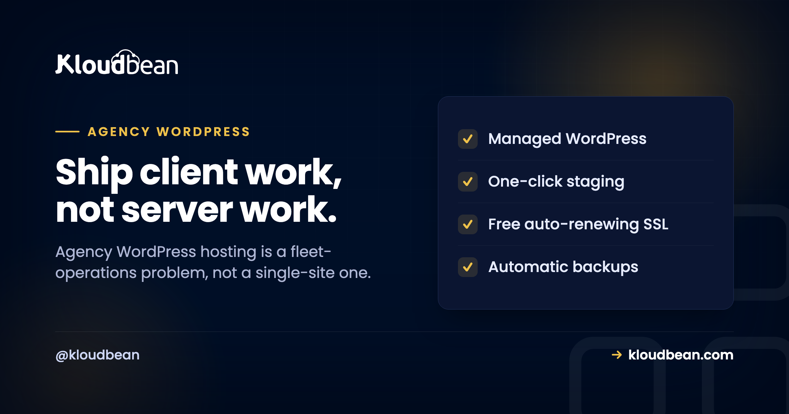

# Agency WordPress Hosting: The Operations Playbook for a Client Fleet

It's 5:12 on a Friday. A client texts that their contact form is dead. You open a browser, pick the wrong login, close it, find the right one, and start hunting for which of your thirty sites this even is. Running one WordPress site is easy. Running a fleet of them for paying clients is a different job, and most hosting is quietly built for the first one.

Good agency WordPress hosting is built for the second job: many client sites, one place to run them, and guardrails so a busy Tuesday for one client never turns into an outage for another. This is the operations playbook I wish more agencies read before they signed. Not a feature checklist. The actual jobs you do every week, and how to make each one boring.

> **The short version:** Treat it as fleet operations, not hosting. Isolate clients so one busy site can't drag down the rest, stage every change before it touches a live site, hand out scoped access with subusers and UAC instead of a shared master login, and keep migrations clean on the way in and the way out. Kloudbean puts the whole fleet in one console with staging, per-client backups, and free migration help.

## Why agency WordPress hosting is a fleet problem, not a site problem

Here is what changes when you go from one site to forty. The work stops being about any single site being fast. It becomes about the fleet staying sane. Different clients, different plugins, different update cadences, different people who need to poke at them. The failure modes shift too.

One client installs a heavy plugin and pegs the CPU. If that client shares a box with five others, all six get slow, and now you're explaining a problem one client caused to five who didn't. A junior updates a plugin straight on production because there was no staging handy. A freelancer you gave "quick access" three months ago still has the keys to everything. And when you win a big client, onboarding their existing site turns into a weekend of copying files by hand. None of these are WordPress problems. They're operations problems, and the host either helps or gets in the way.

<!-- Inline SVG in the HTML version: one agency console managing three isolated client sites, each with staging-to-live flow and scoped access. -->

## Job 1: Isolate clients so one can't sink the rest

This is the one agencies underrate until it bites. On cheap shared hosting, everybody lives in the same pool. So the moment one client runs a runaway import, a badly written cron, or just gets a genuine traffic spike, the neighbors feel it. You get to explain a slowdown you didn't cause.

The fix is blast-radius control. Give your heavier clients their own server so their bad day stays theirs. Lighter clients can share a box comfortably, each as its own isolated application with its own database and its own resources. You decide the grouping based on what each client actually needs, and you can move a client to their own server later without re-platforming them. If you want the deeper trade-off, the piece on [single-tenant versus multi-tenant](https://www.kloudbean.com/blog/single-tenant-vs-multi-tenant/) lays it out. And when a single client's site genuinely outgrows one server, scaling it is the same job as scaling any [high-traffic WordPress site](https://www.kloudbean.com/blog/scalable-wordpress-hosting/).

## Job 2: Stage every change before it touches a live site

Nobody plans to break a client site. It happens because the plugin update looked routine and there was no safe place to try it. So make the safe place the default. Clone the site to **staging**, run the update or the redesign there, click through the pages that matter (checkout, contact form, the one weird template), then push it live once it holds up.

Kloudbean gives you one-click staging for WordPress (and Laravel, for the client work that isn't WordPress). The rule that saves weekends: if it's going on a live client site, it goes through staging first. Every time. The one occasion you skip it "because it's tiny" is the one that takes down a store on a Friday.

<!-- ADD IMAGE: the staging screen for a client site, mid push-to-live, with the create-staging or push-to-live control visible. -->

## Job 3: Hand out scoped access, not the master key

Your team needs access. Your clients sometimes need a peek. Freelancers need in for a fortnight and then out. The wrong answer is one shared admin login in a shared password note, because that's how a departed contractor keeps access to everything and how a junior deletes the wrong thing.

The right answer is **subusers with User Access Control**. Give each person permissions scoped to exactly what their job needs, per resource and per action. A developer can deploy to one client's app without being able to touch the others. A client can see their own site and nothing else. A freelancer gets access to one project, and you revoke it cleanly when the invoice clears. Two more tools worth knowing: a **Basic Auth gate** in front of a staging site so a client preview isn't crawlable or public, and **IP access control** (allow or deny by address or CIDR) for locking admin down to your office and VPN.

<!-- ADD IMAGE: the subusers and User Access Control screen showing a team member granted access to one client site only. -->

## Job 4: Keep your brand in front, not your host's

Your client hired you. They shouldn't be squinting at some other company's logo to figure out where their site lives. Keeping the relationship yours is partly a white-label question, and there's a fuller guide on [white-label hosting for agencies](https://www.kloudbean.com/blog/white-label-hosting-for-agencies/) if that's the route you want.

But a lot of "looking like the agency, not the vendor" is really access design. When a client only ever sees their own site through a scoped login, and everything routine (backups, SSL, updates) just happens without a third party emailing them, the vendor stays invisible and you stay the point of contact. That's the practical version of white-labeling most agencies actually need day to day.

## Job 5: Onboard and offboard without the weekend

Winning a client shouldn't cost you a Saturday. Migrating their existing WordPress site in should be a supported process, not a "download the files and good luck" email. Kloudbean includes **free migration assistance**, which is the difference between onboarding a client in an afternoon and dreading it.

And here's the part agencies forget to check until they want to leave a host: offboarding. Your clients' sites, databases, and uploads are theirs. You should be able to export them in standard formats and move on with no drama and no hostage situation. If a client parts ways with you, handing over a clean, portable site is professional. A host that makes that hard is making your reputation its captive. For the messy real-world version, see [migrating hosting with zero downtime](https://www.kloudbean.com/blog/how-to-migrate-hosting-zero-downtime/).

## Job 6: Give the non-WordPress work a home too

Agencies almost never stay purely WordPress. A client needs a Node app for a booking widget. Another wants a small Python API, or a static landing page for a campaign, or a standalone database behind a custom tool. A WordPress-only host pushes all of that onto yet another vendor and yet another invoice.

Because Kloudbean runs the whole stack (PHP for the WordPress and WooCommerce work, plus Node, Python, Ruby, Java, static sites, and six managed database engines), that work sits in the same console as your WordPress fleet. One login, one bill, one place your team already knows. If you're weighing the model itself, [reseller hosting versus managed cloud](https://www.kloudbean.com/blog/reseller-hosting-vs-managed-cloud/) is the honest comparison, and [how agencies host 20 client apps](https://www.kloudbean.com/blog/how-agencies-host-20-client-apps/) shows the shape at scale.

## The agency operations matrix

Same jobs, laid out so you can see what each one is really protecting you from:

| The job | What breaks without it | What handles it |
| --- | --- | --- |
| **Isolate clients** | One client's spike slows five others | Own server for heavy clients; isolated apps for the rest |
| **Stage changes** | A routine update takes a live site down | One-click staging for WordPress and Laravel |
| **Scope access** | Shared logins; a contractor keeps the keys | Subusers plus UAC, Basic Auth gate, IP allow/deny |
| **Restore fast** | "We have a backup somewhere" during an outage | Automatic per-site backups you can actually restore |
| **Grow per client** | A migration every time a client gets bigger | Resize a single client's server, no re-platform |
| **Onboard / offboard** | A lost weekend per new client | Free migration in; clean standard export out |
| **Non-WP work** | Another vendor, another bill | Node, Python, static, and managed databases in one console |

## Where agencies actually get burned

After enough client sites, the same few mistakes show up again and again. Worth naming them so you can dodge them.

- **The shared master login.** It feels efficient right up until someone leaves, or fat-fingers the wrong client. Scoped subusers cost you five minutes to set up and save you an incident.
- **Staging skipped under deadline.** The update that "obviously won't break anything" is exactly the one that does. If staging is a chore, people skip it. If it's one click, they don't.
- **Media stuck on local disk.** Uploads written to one server's disk quietly become a problem the day you move hosts or add a second node. Offloading media to [object storage](https://www.kloudbean.com/blog/s3-compatible-object-storage/) keeps it portable and shared.
- **The reseller trap.** Reselling someone's shared plans looks like a tidy markup until support tickets and noisy-neighbor slowdowns become your problem to explain. Managed cloud you actually control ages better. The [hosting for agencies playbook](https://www.kloudbean.com/blog/hosting-for-agencies-playbook/) goes deeper here.

## The honest boundary

One caveat, the same for any managed WordPress hosting. These are Linux stacks. The platform keeps the servers, the WordPress stack, SSL, and backups healthy and patched, while your client sites, their content, and their data stay yours and your clients'. Packaging that upkeep into recurring revenue is [WordPress maintenance retainer plans](https://www.kloudbean.com/blog/wordpress-maintenance-retainer-plans/). You're outsourcing the operations so your team spends its hours on client work instead of server work. That's the trade, and for an agency it's usually a good one.

**One roster, one console, zero login juggling.** Run your whole client fleet from one place at [kloudbean.com](https://www.kloudbean.com/): staging, scoped access, and room to grow. Plans on [pricing](https://www.kloudbean.com/pricing/).

One console for every client · Per-site staging · Subusers and UAC · Automatic backups · Free migration · Free trial

## FAQ

**What is agency WordPress hosting?**
It's hosting built for running many client WordPress sites at once, rather than one site well. In practice that means one console for the whole fleet, staging on every site, scoped team and client access, per-site backups with fast restore, per-client scaling, and room to host non-WordPress client work alongside it. The problem it solves is operational, not technical.

**How do I manage multiple client WordPress sites from one dashboard?**
Put every client site in a single console so you have one login instead of one per client. From there you provision servers, add each client site as its own application, and see health, backups, and staging for all of them in one place. That unified view is the baseline that makes roles, backups, and scaling manageable across a roster.

**How do I give a client or freelancer access to just their site?**
Use subusers with User Access Control. You create a subuser and scope their permissions to a single client's resources, per resource and per action, so a freelancer can work on one project without seeing the rest of your fleet. When the work ends, you revoke that access cleanly. A Basic Auth gate and IP allow or deny rules add another layer for previews and admin.

**Should every client site have staging?**
Yes, on every site, not just the premium ones. Agencies push changes constantly, and testing a plugin update or redesign on staging before it hits production is what prevents the broken-site call. If staging is an upsell or a manual chore, teams skip it under deadline pressure, which is exactly when things break.

**How do agencies stop one client's traffic spike from affecting others?**
By controlling the blast radius. Give heavier or higher-traffic clients their own server so their busy days stay contained, and group lighter clients together as isolated applications with their own databases. Because you can resize or move a client later, you match resources to each client without re-platforming them when they grow.

**Can I host non-WordPress client projects on the same platform?**
Yes. Beyond WordPress and WooCommerce, agencies often need a Node app, a Python API, a static microsite, or a standalone database for a client. Kloudbean runs those in the same console as your WordPress sites, with six managed database engines and object storage available, so that work stays alongside the fleet instead of on another vendor.

**Is reseller hosting or managed cloud better for an agency?**
It depends on how much control you want. Reselling shared plans is simple but you inherit noisy-neighbor slowdowns and support limits you can't fix. Managed cloud you control gives you isolation, staging, and scoped access you can actually stand behind. The comparison on reseller hosting versus managed cloud walks through where each one fits.

**How do I migrate existing client sites in without a painful weekend?**
Use the free migration assistance rather than copying files by hand. A supported migration moves the site, database, and uploads for you, so onboarding a new client is an afternoon, not a Saturday. And because your sites export in standard formats, offboarding a client later is just as clean.

---

*Kloudbean · Ship client work, not server work.*
