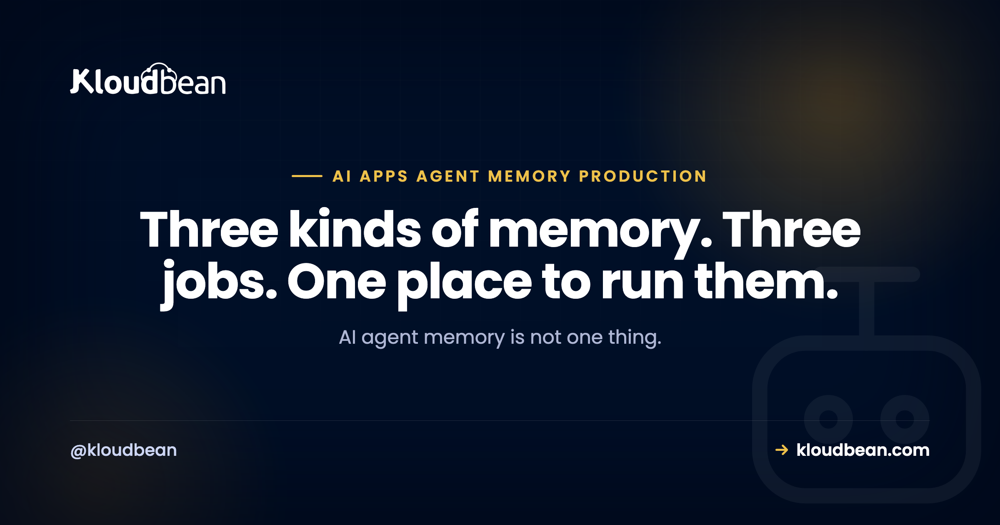

# AI Agent Memory in Production: Postgres, Redis, Vector Search, or All Three?

You gave your AI agent "memory" and moved on. Maybe Cursor or Lovable scaffolded it, maybe you wired the OpenAI or Anthropic SDK yourself, and in testing it remembers things just fine. Then real users show up and the questions pile up: why does it forget who someone is between sessions, why is every reply getting slower and more expensive, and how do you delete a person's history when they ask you to? AI agent memory is the part builders wave at and rarely finish.

Here's the thing most tutorials skip. "Memory" isn't one feature you bolt on. It's three different jobs, and they want three different homes. Cache the current conversation somewhere fast. Keep the durable record somewhere safe. Search old chats and documents by meaning somewhere built for that. Pick one store and force it to do all three and you get an agent that's slow, forgetful, or eye-wateringly expensive. This page is the decision guide: what each kind of memory is, where it belongs, and how to work out which ones you actually need.

> **The short version:** AI agent memory splits into three jobs. Short-term context (the last few turns) fits in the prompt window and caches nicely in Redis. Durable history and user preferences are your record of truth and belong in Postgres. Long-term recall across past chats and documents needs embeddings and vector search, which pgvector handles right inside Postgres. Most real agents end up using all three, each doing one job. The classic mistake is picking a single store and making it do everything.

## What AI agent memory actually means

An agent has no memory of its own. The model is stateless: it only knows what's in the prompt you send this turn. So "memory" is really you, the developer, deciding what to put back into the prompt each time, and where you keep that information between requests. That's the whole trick. Everything else is detail.

Once you see memory as "what do I feed the model, and where do I store it in the meantime," the three kinds fall out naturally. There's what happened seconds ago in this conversation. There's what you know about this user across every conversation. And there's the pile of past text you might need to pull a relevant fact from later. Different lifespans, different access patterns, different stores. Trying to serve all three from one place is where agents go wrong, and it's why the honest answer for a real app is usually "all three, each doing its job."

## The three kinds of memory, and the store each one wants

Short answer first, then the detail. Short-term memory is the working context of the current chat, and it lives in Redis (or just in the prompt you assemble). Durable memory is the full history plus user preferences, and it lives in Postgres. Long-term memory is semantic recall over lots of old text, and it lives in a vector index like pgvector. Here they are side by side.

| Kind of memory | What it holds | Where it lives | Lifespan | You need it when |
| --- | --- | --- | --- | --- |
| Short-term (working context) | The last few turns of this conversation | Redis, or the prompt window itself | Minutes to hours (TTL) | Always. It's the current chat. |
| Durable history and preferences | Every message, account settings, facts the user told you | Postgres (record of truth) | Until the user deletes it | The moment you have logins and sessions. |
| Long-term semantic recall | Embeddings of past chats and documents | pgvector, inside Postgres | Kept, re-embedded as needed | The agent must recall by meaning across lots of text. |

The picture below is the mental model worth keeping. One agent, three stores, each feeding a different slice of the prompt before the model ever gets called.

<!-- ADD IMAGE: the three-stores-one-agent diagram (Redis short-term, Postgres durable, pgvector long-term, each feeding the agent, which assembles the prompt and calls the model). -->

## Short-term memory: the working set you cache in Redis

Short-term memory is the easy one, and it's the only kind every agent needs on day one. It's the recent back-and-forth of the conversation you're in right now, the stuff the model needs to answer coherently this turn. For a short chat you can hold it in the prompt itself. Once conversations run long or a user has several open at once, you want it in Redis: fast to read, fast to write, and easy to expire.

Why Redis and not Postgres for this? Because it's hot, small, and disposable. You read it on every single turn, you don't need it to survive forever, and a TTL is exactly the right tool. Set a key per conversation, push each turn onto it, and let it age out after a few hours or days of silence. If the user comes back next week, you don't rebuild the working set from Redis, you rebuild it from the durable copy in Postgres. Redis is the fast layer in front, never the source of truth. [Managed Redis hosting](https://www.kloudbean.com/blog/managed-redis-hosting/) covers the setup and why TTLs keep it cheap.

One caution: don't treat Redis as your only home for chat. It's memory-resident and it's meant to be evictable. If a node restarts or a key expires and that was the only copy, the conversation is gone. Keep the durable record in Postgres and let Redis be the accelerator. That split is the whole point.

## Durable memory: history and preferences live in Postgres

Durable memory is your record of truth, and it belongs in a real database that outlives every deploy. This is the full message history, plus the things you actually know about a user: their name, their plan, the preferences they set, the facts they've told the agent to remember. When someone returns after a week, this is what makes the agent feel like it knows them. Postgres is the sensible default.

The most common data-loss mistake here is the one AI builders scaffold by accident: starting on a local SQLite file or an in-memory array. It works right up until your first redeploy wipes the file, and every conversation and preference goes with it. A managed database lives outside the app process, so shipping new code never touches your data. If that pattern is new to you, the [last mile of vibe coding](https://www.kloudbean.com/blog/last-mile-of-vibe-coding/) explains why builders leave this gap, and [adding a managed database to your app](https://www.kloudbean.com/blog/add-managed-database-to-your-app/) is the fix.

A workable schema is not complicated. One table for messages, one for the durable facts you want the agent to always have on hand:

```sql
create table messages (
  id               bigserial primary key,
  user_id          uuid not null,
  conversation_id  uuid not null,
  role             text not null,   -- user | assistant | system
  content          text not null,
  created_at       timestamptz not null default now()
);
create index on messages (conversation_id, created_at);

-- durable facts the agent should always know about a user
create table user_memory (
  user_id     uuid primary key,
  preferences jsonb not null default '{}',
  updated_at  timestamptz not null default now()
);
```

Two things this buys you. First, when you assemble a prompt you can load the last N turns from here if Redis is cold, so nothing is ever truly lost. Second, and this matters more than people expect, it gives you one place to delete everything about a user when they ask. More on that below, because it's a section, not a footnote.

## Long-term recall: embeddings and vector search with pgvector

Long-term memory is the one people reach for too early and then over-build. It answers a specific question: "somewhere in this user's hundreds of past messages, or in my pile of documents, is there something relevant to what they just asked?" You can't stuff all of that into the prompt, and keyword search misses anything phrased differently. So you embed the text into vectors and search by meaning. That's semantic recall, and it's what vector search is for.

You probably don't need a separate vector database to do it. The `pgvector` extension stores embeddings right alongside your normal Postgres rows, so your memories, your history, and your app data share one database and one backup. You add a vector column, index it, and query for the nearest matches to the new message:

```sql
create extension if not exists vector;

create table memory_chunks (
  id         bigserial primary key,
  user_id    uuid not null,
  content    text not null,
  embedding  vector(1536),          -- dimension depends on your embedding model
  created_at timestamptz not null default now()
);

-- pull the 5 memories closest in meaning to the new message
select content
from memory_chunks
where user_id = $1
order by embedding <=> $2         -- $2 is the query embedding
limit 5;
```

That `<=>` is pgvector's distance operator, and the `vector(1536)` dimension is just an example (match it to whatever model produces your embeddings). The deeper walkthrough, including indexing and when to reach for a dedicated vector store instead, is in [pgvector for AI apps](https://www.kloudbean.com/blog/pgvector-for-ai-apps/). One practical note: enabling the extension depends on your Postgres version and setup, so check it's available before you design around it.

Here's my one firm opinion for this whole page. Most agents do not need a dedicated vector database on day one. pgvector inside the Postgres you already run is enough for a very long time, and one database is far less to operate, back up, and reason about than three. Add a specialised vector product when your scale genuinely demands it, which is later than the hype suggests, not on launch day.

## So which of the three do you actually need?

Be honest about the app in front of you rather than copying a reference architecture. Short-term context is non-negotiable, every agent needs it. Durable history and preferences arrive the moment you have accounts and want the agent to remember people between sessions. Long-term semantic recall only earns its place when the agent has to search across a lot of past text or your own documents. Plenty of good agents run happily on the first two.

- **A single-session tool with no login** (a one-off assistant, a form filler): short-term context is often all you need. Keep it in the prompt window and move on.
- **An agent with user accounts** that should recognise returning users and honour their settings: add durable Postgres memory. This is the big one for most products.
- **A support bot or research assistant** answering from your knowledge base or a long history: now you need long-term recall with vector search on top of the other two.

If you're building a conversational product specifically, the request path, streaming, and cost pieces live in [how to host an AI chatbot in production](https://www.kloudbean.com/blog/host-ai-chatbot-in-production/). Memory is one layer of that larger picture, and it's the layer that decides whether the thing feels smart or feels like it has amnesia.

## Expiry, retention, and the right to be forgotten

Memory you never delete isn't a feature, it's a liability that grows every day. So decide up front how long each kind lives. Short-term context should expire on a TTL, that's automatic in Redis. Durable history and embeddings should have a retention policy: how long do you keep old conversations, and do you prune or archive them? And you must be able to delete a specific user's memory entirely when they ask, because in many places that's a legal right, not a nice-to-have.

This is where keeping memory in three stores becomes a design task, not just a diagram. A deletion request has to reach all of them. Miss one and you've told a user their data is gone while a copy quietly remains, which is exactly the kind of gap that turns into a real problem. Build the "forget this user" path early and test it:

```sql
-- Postgres: durable history, preferences, and embeddings
delete from messages      where user_id = $1;
delete from user_memory   where user_id = $1;
delete from memory_chunks where user_id = $1;

-- Redis: drop the short-term working set for that user
--   DEL agent:ctx:{user_id}
```

Two more things people forget. Backups hold copies too, so your retention story should say how deletions age out of backups (usually as old backups roll off, which is fine if you document it). And if you send user text to a model provider, check what they retain on their side, because that's memory you don't directly control. Write the retention rules down. Future you, and your users, will be glad you did.

## The anti-pattern that quietly runs up your bill

Here's the one to burn into memory: sending the entire conversation transcript to the model on every single turn. It's the default an AI builder scaffolds, it works in a demo, and it gets more expensive with every message. Models charge per token, so a chat that started cheap costs more each turn as the transcript grows, because you're re-sending the whole thing every time. Latency climbs with it, and eventually you slam into the model's context limit and the request just fails.

The fix is to assemble a smart context instead of dumping everything. Send the recent turns verbatim, a short rolling summary of the older conversation, and only the handful of long-term memories that are actually relevant to the new message. That's the three stores doing their jobs together:

```python
context = [
  system_prompt,
  *durable_facts(user_id),          # Postgres: name, plan, saved preferences
  *semantic_recall(user_id, msg),   # pgvector: top-k memories that match by meaning
  *recent_turns(user_id, n=10),     # Redis: the last few messages, verbatim
  new_message,
]
```

Notice what this does to cost and quality at the same time. You send a roughly constant number of tokens per turn instead of an ever-growing pile, so spend stays predictable no matter how long the conversation runs. And the model gets a tighter, more relevant prompt, which usually improves the answer rather than hurting it. More history is not more intelligence. The right history is.

## Where Kloudbean fits

The reason memory gets fiddly is that the three stores usually live in three different places: one provider for Postgres, another for Redis, a separate thing for vectors, and a console to learn for each. Kloudbean puts them in one dashboard. You run an always-on Node or Python app (no cold starts, so the agent is always warm), add a managed Postgres and a managed Redis, get automatic backups and free SSL, and deploy from Git on every push. Postgres can carry your durable history and, where `pgvector` is available for your setup, your embeddings too, which keeps memory in one database instead of three. You lock the database down by whitelisting your app server's IP, so only your app can reach it and everything else is refused.

The honest boundary, because it builds trust: managed means the platform handles the server, the stack, SSL, backups, and patching. The memory logic is yours: what you store, how long you keep it, and honouring a deletion request when a user asks. Kloudbean makes the stores easy to run. It can't decide your retention policy or delete a record you never wired up. Full network isolation in a private VPC is an Enterprise capability; on a standard plan, the IP allow-list is how you keep the database off the open internet.

## Give your agent's memory a home that stays put

**Run your agent on an always-on server with managed Postgres and Redis, automatic backups, and free SSL, all in one dashboard and deployed straight from Git.** Keep short-term context, durable history, and (where available) pgvector embeddings without juggling three providers. Start free at [kloudbean.com](https://www.kloudbean.com/); see plans on [pricing](https://www.kloudbean.com/pricing/).

Managed Postgres + pgvector · Managed Redis · Always-on Node and Python · Automatic backups · Free SSL · Git deploy · IP allow-listing

## FAQ

**What is AI agent memory?**
It's how a stateless model appears to remember things. The model only knows what's in the prompt you send this turn, so memory is really you deciding what to put back into the prompt each time and where you store that information between requests. In practice it splits into short-term context, durable history and preferences, and long-term semantic recall.

**What are the different types of AI agent memory?**
Three. Short-term (working context) is the recent turns of the current chat, cached in Redis or held in the prompt. Durable memory is the full history plus user preferences, stored in Postgres as your record of truth. Long-term memory is semantic recall over old chats and documents, done with embeddings and vector search like pgvector.

**Do I need a vector database for my AI agent?**
Only if the agent has to recall by meaning across a lot of past text or your own documents. Even then you usually don't need a separate product. The pgvector extension keeps embeddings inside Postgres alongside your normal data, so it's one database to run. Add a dedicated vector store later only if your scale demands it.

**Should I use Redis or Postgres for chat history?**
Both, for different jobs. Postgres is the durable record of truth that survives deploys and holds the full history. Redis is the fast, expiring layer that caches the current conversation so you're not hitting the database on every turn. Keep the source of truth in Postgres and treat Redis as the accelerator in front of it.

**How do I delete a user's AI memory when they ask?**
Build a single deletion path that reaches every store: remove their rows from Postgres (messages, preferences, and embeddings), and drop their working-set keys from Redis. Miss one store and a copy of their data quietly survives. Also decide how deletions age out of backups, and check what your model provider retains on their side.

**Why is my AI agent getting slower and more expensive over time?**
Almost always because you're sending the whole conversation transcript to the model on every turn. Models charge per token, so cost and latency grow as the transcript grows, and eventually you hit the context limit. Send recent turns, a short summary, and only the relevant retrieved memories instead of everything.

**How much conversation history should I send to the model?**
A roughly constant amount, not the full transcript. A good shape is the last several turns verbatim, a rolling summary of older messages, and a handful of long-term memories that actually match the new message. This keeps token spend predictable and usually improves answers, because the model gets a tighter, more relevant prompt.

**Where should I store AI agent conversation history?**
In a managed database that lives outside your app, so a redeploy never wipes it. Postgres is a solid default: store the role, content, timestamp, user id, and conversation id per message. Avoid SQLite or in-memory storage in production, since both vanish on redeploy and take the history with them.

**Is pgvector good enough for AI agent memory?**
For most agents, yes, and for a long time. pgvector adds vector search to the Postgres you already run, so your embeddings, history, and app data share one database and one backup. Enabling it depends on your Postgres version and setup, so check availability. Reach for a specialised vector store only when scale genuinely forces it.

**Do I need all three memory stores to launch?**
No. Every agent needs short-term context. Durable Postgres memory arrives when you have accounts and want to remember users between sessions. Long-term vector recall only matters when the agent searches across lots of past text or documents. Plenty of solid agents ship on just the first two and add the third when the need is real.

---

*Kloudbean · Three kinds of memory. Three jobs. One place to run them.*
