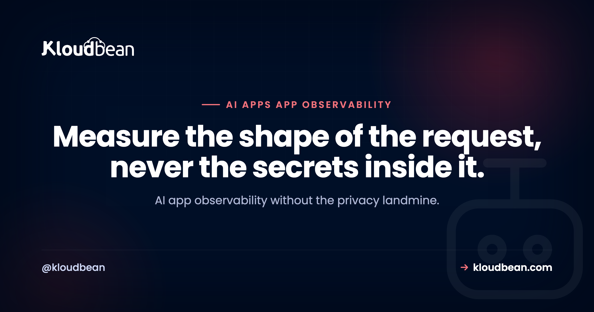

# AI App Observability: What to Measure, and How to Log Without Storing People's Prompts

Your AI app has real users now. It calls a model on every request, the bill is creeping up, someone just reported a slow reply, and you open your logs to find almost nothing useful. That gap is what AI app observability fills. It's how you see what your app is doing, where the time and the money go, and where it breaks, without turning your log store into a pile of other people's private conversations.

Most monitoring advice was written for ordinary web apps. An LLM app is a different animal. The slow part is usually the model, not your code. The cost is per token, not per server. And the payload is often personal. So the plan is easy to say and easy to get wrong: measure the metadata, not the message.

> **The short version:** You can't debug or control cost for what you can't see, and raw prompts are radioactive to store. So measure the shape of each request: time to first token, total latency, tokens in and out, cost, model and version, route, cache and retrieval signals, plus error and 429 rates. Log that metadata, redact or drop the prompt text, keep full traces to a tiny opt-in sample, and set retention short.

## What AI app observability is, and why generic monitoring misses

AI app observability is the practice of instrumenting an app that calls a language model so you can answer three questions from data: is it working, what is it costing, and where is it slow or failing. It rests on the same three pillars as any system, logs, metrics, and traces, but each pillar points at something an LLM app actually cares about.

- **Logs** are the per-request record. For an AI app that means one structured line per model call carrying its metadata (tokens, latency, model, status). Not the prompt.
- **Metrics** are the aggregates you watch over time and alert on: cost per hour, p95 time to first token, the 429 rate, the error rate.
- **Traces** are the path of a single request across your app, retrieval, the model, and any tools, stitched together by one id so you can see which hop ate the time.

This is not the same job as uptime monitoring. Uptime answers "is it up." Observability answers "what is it doing, and why." You want both, and they're separate. For the availability side (health checks, the 99.9% math, load-balancer probes) see [uptime monitoring](https://www.kloudbean.com/blog/uptime-monitoring/). This page is about behaviour and cost: how you monitor an AI application once it's already serving traffic.

<!-- ADD IMAGE: a metrics panel for one AI feature, p95 time to first token and total latency over the last 24 hours, with a cost line on the same timeline. -->

## The signals that actually matter for an AI app

A generic dashboard of CPU, memory, and request count tells you almost nothing about an AI feature. The server can look bored while the feature is slow, expensive, and quietly failing. These are the signals that carry real information, and the decision each one drives.

| Signal | What it tells you | The call it drives |
| --- | --- | --- |
| Time to first token (TTFT) | How long until the first word appears | If it climbs, the model or your streaming is slow; it's the delay users feel |
| Total completion time | How long the full answer takes | Sizing timeouts, spotting long-running calls |
| Tokens in / tokens out | The size of every call | Trim the context, cap max output, explain the cost |
| Cost per request | Tokens turned into money | The one number to watch per feature and per user |
| Model and version | Which model answered | Line up a quality or latency shift with a model swap |
| Route or feature | Which part of your app called the model | Find the feature burning the budget |
| Cache hit / miss | Whether you're paying for repeat answers | Prove caching works, or go fix it |
| Retrieval hit quality (RAG) | Whether retrieval returned anything useful | Tell a bad answer apart from bad context |
| Error / timeout / refusal rate | How often calls fail or the model declines | Separate broken from merely unhappy |
| Provider 429 rate | How often you hit the provider's rate limit | Back off, batch, or ask for a higher limit |

A few of these deserve more than a table row.

**Split latency in two.** Time to first token is how long until the first word shows up. Total completion time is how long until the last. If you stream, TTFT is the number your users feel. A six-second answer that starts rendering in 400ms feels quick; the same answer delivered in one lump at second six feels broken. Track both, and track them at p95, not as an average. More on why the average lies in a minute.

**Cost is just tokens with a price on them.** You don't need a billing integration to see spend. Log tokens in and out per call, multiply by the model's rate, and you have cost per request, which rolls up to cost per feature and cost per user. That last cut is the one that catches the power user quietly running your margin into the ground.

**Refusals and 429s are LLM-specific.** A refusal is the model declining to answer, which a plain HTTP 200 will happily hide. A 429 is the provider telling you to slow down. Both are invisible to a normal error counter, and both change what you do next, so give them their own LLM metrics rather than lumping everything into "errors."

## Where to capture it

You capture at the edges and at the model call, then push the metadata down to somewhere you can query it. Assign a request id the moment a request arrives. Wrap the model call so tokens, latency, TTFT, model, and status get recorded whether it succeeds or throws. Then send that metadata to your logs and metrics store through one deliberate gate that strips anything you shouldn't keep.

<figure>
  <svg viewBox="0 0 780 440" role="img" aria-label="The observation points along an AI request. A request arrives and is assigned a request id, flows into your app, then retrieval, then the model call where tokens in and out, cost, model and version, latency, time to first token, and 429s are captured. The streamed response returns to the user. Metadata from each step flows down through a redact gate that keeps metadata only and blocks raw prompts and outputs, into a logs and metrics store you can query by request id, route, model, and user." xmlns="http://www.w3.org/2000/svg">
    <defs>
      <marker id="obar" markerWidth="9" markerHeight="9" refX="7" refY="4" orient="auto"><path d="M0,0 L8,4 L0,8 Z" fill="#4F1AF3"/></marker>
      <marker id="obarg" markerWidth="9" markerHeight="9" refX="7" refY="4" orient="auto"><path d="M0,0 L8,4 L0,8 Z" fill="#40b75f"/></marker>
    </defs>

    <rect x="16" y="60" width="120" height="66" rx="10" fill="#fff" stroke="#000f27" stroke-width="1.5"/>
    <text x="76" y="90" text-anchor="middle" font-family="Poppins,sans-serif" font-size="13" font-weight="600" fill="#000f27">Request</text>
    <text x="76" y="108" text-anchor="middle" font-family="Poppins,sans-serif" font-size="9.5" fill="#4F1AF3">assign request id</text>

    <rect x="170" y="60" width="118" height="66" rx="10" fill="#000f27"/>
    <text x="229" y="90" text-anchor="middle" font-family="Poppins,sans-serif" font-size="13" font-weight="600" fill="#fff">Your app</text>
    <text x="229" y="108" text-anchor="middle" font-family="Poppins,sans-serif" font-size="9.5" fill="#9fb0cc">route, user</text>

    <rect x="322" y="60" width="118" height="66" rx="10" fill="#f6f7fb" stroke="#40b75f" stroke-width="1.4"/>
    <text x="381" y="90" text-anchor="middle" font-family="Poppins,sans-serif" font-size="12.5" font-weight="600" fill="#000f27">Retrieval</text>
    <text x="381" y="108" text-anchor="middle" font-family="Poppins,sans-serif" font-size="9.5" fill="#5b6a86">hit quality</text>

    <rect x="474" y="52" width="150" height="82" rx="10" fill="#000f27"/>
    <text x="549" y="82" text-anchor="middle" font-family="Poppins,sans-serif" font-size="13" font-weight="600" fill="#fff">Model call</text>
    <text x="549" y="100" text-anchor="middle" font-family="Poppins,sans-serif" font-size="9.5" fill="#40b75f">the capture point</text>
    <text x="549" y="116" text-anchor="middle" font-family="Poppins,sans-serif" font-size="9.5" fill="#9fb0cc">tokens, cost, latency</text>

    <rect x="636" y="44" width="128" height="98" rx="10" fill="#f6f7fb" stroke="#4F1AF3" stroke-width="1.4"/>
    <text x="700" y="66" text-anchor="middle" font-family="Poppins,sans-serif" font-size="10" font-weight="700" letter-spacing="0.5" fill="#4F1AF3">CAPTURE</text>
    <text x="700" y="84" text-anchor="middle" font-family="Poppins,sans-serif" font-size="9.5" fill="#000f27">tokens in / out</text>
    <text x="700" y="99" text-anchor="middle" font-family="Poppins,sans-serif" font-size="9.5" fill="#000f27">cost, model + ver</text>
    <text x="700" y="114" text-anchor="middle" font-family="Poppins,sans-serif" font-size="9.5" fill="#000f27">latency, TTFT</text>
    <text x="700" y="129" text-anchor="middle" font-family="Poppins,sans-serif" font-size="9.5" fill="#000f27">429, timeout</text>

    <line x1="136" y1="93" x2="166" y2="93" stroke="#4F1AF3" stroke-width="2" marker-end="url(#obar)"/>
    <line x1="288" y1="93" x2="318" y2="93" stroke="#4F1AF3" stroke-width="2" marker-end="url(#obar)"/>
    <line x1="440" y1="93" x2="470" y2="93" stroke="#4F1AF3" stroke-width="2" marker-end="url(#obar)"/>

    <line x1="549" y1="134" x2="549" y2="150" stroke="#40b75f" stroke-width="2"/>
    <line x1="549" y1="150" x2="76" y2="150" stroke="#40b75f" stroke-width="2"/>
    <line x1="76" y1="150" x2="76" y2="130" stroke="#40b75f" stroke-width="2" marker-end="url(#obarg)"/>
    <text x="300" y="144" text-anchor="middle" font-family="Poppins,sans-serif" font-size="10" fill="#40b75f">streamed response back to the user (measure TTFT here)</text>

    <rect x="60" y="214" width="660" height="36" rx="8" fill="none" stroke="#4F1AF3" stroke-width="1.5" stroke-dasharray="7 6"/>
    <text x="390" y="237" text-anchor="middle" font-family="Poppins,sans-serif" font-size="11.5" font-weight="700" letter-spacing="0.5" fill="#4F1AF3">REDACT GATE   metadata only, no raw prompts, no raw outputs</text>

    <line x1="229" y1="126" x2="229" y2="210" stroke="#8894ad" stroke-width="1.4" marker-end="url(#obar)"/>
    <line x1="381" y1="126" x2="381" y2="210" stroke="#8894ad" stroke-width="1.4" marker-end="url(#obar)"/>
    <line x1="549" y1="134" x2="549" y2="210" stroke="#8894ad" stroke-width="1.4" marker-end="url(#obar)"/>
    <text x="470" y="196" text-anchor="middle" font-family="Poppins,sans-serif" font-size="9.5" fill="#5b6a86">reqId, route, tokens, latency, TTFT, status</text>

    <rect x="250" y="300" width="280" height="86" rx="12" fill="#f6f7fb" stroke="#40b75f" stroke-width="1.6"/>
    <text x="390" y="336" text-anchor="middle" font-family="Poppins,sans-serif" font-size="13.5" font-weight="600" fill="#000f27">Logs + metrics store</text>
    <text x="390" y="356" text-anchor="middle" font-family="Poppins,sans-serif" font-size="10" fill="#5b6a86">query by reqId, route, model, user</text>

    <line x1="390" y1="250" x2="390" y2="296" stroke="#40b75f" stroke-width="2" marker-end="url(#obarg)"/>
  </svg>
  <figcaption>Capture at the model call, then let only metadata through the redact gate. The prompt and the output never reach the store. What you can query is the shape of the request, not its contents.</figcaption>
</figure>

## The prompt is radioactive, so log metadata not content

Here is the part that separates a grown-up AI app from a liability. Prompts and model outputs routinely contain personal data: names, emails, health details, whatever a user decided to type into a text box. Store that raw and you've built a pile of sensitive data you now have to protect, explain, and eventually delete. It grows forever, it widens your blast radius if anything leaks, and it can complicate obligations like GDPR or PDPL. All for logs you almost never actually read.

So default to logging metadata, and treat raw content as the exception. The techniques stack:

- **Metadata by default.** Log the fields from the table above, not the words. You can debug the vast majority of incidents from timing, tokens, model, route, and status alone.
- **Redact or hash identifiers.** If you must keep a user id, keep it as an opaque hash, not an email. Strip obvious identifiers before anything is written.
- **Sample, don't hoard.** If you genuinely need some full traces for quality work, keep a tiny percentage, make it opt-in, and label it clearly. A small honest sample beats storing everything.
- **Short retention.** Set a window and let old data age out on its own. Data you deleted last week can't leak next month.
- **Full-content capture is a toggle, not a default.** When you truly need to see prompts to chase a bug, turn on content capture explicitly, time-box it, and turn it back off. It is a debugging mode, never the standing behaviour.

Here's my one firm opinion for this whole page: never log raw prompts by default. The debugging convenience is small and the liability is not. If a teammate wants prompts "just for now," that's the exact sentence that becomes a PII lake with no retention policy a year later.

A good log line for a model call looks like this. Notice what isn't in it.

```json
{
  "level": "info",
  "time": 1754006400000,
  "reqId": "c3f1a2",
  "userId": "u_8f21",
  "route": "chat.completion",
  "model": "gpt-4o-mini",
  "model_version": "2024-07-18",
  "tokens_in": 812,
  "tokens_out": 240,
  "ttft_ms": 430,
  "latency_ms": 2180,
  "cache": "miss",
  "status": "ok"
}
```

There's no `prompt` field and no `completion` field. You can still answer almost every question that matters: which route was slow, how many tokens went out, which user drove cost, where errors clustered. The general Node setup for lines like this (Pino, log levels, writing JSON to stdout, redaction) lives in [structured logging in Node.js](https://www.kloudbean.com/blog/structured-logging-nodejs/), so this page won't re-teach it. What follows is which fields to keep, hash, or drop for an AI app specifically.

| Field | Keep, hash, or drop | Why |
| --- | --- | --- |
| request id | Keep | Ties every hop of one request together |
| user id | Hash, or keep as an opaque id | Group by user for cost without exposing who |
| route / feature | Keep | Attribute latency and spend |
| model + version | Keep | Correlate changes with a model swap |
| tokens in / out | Keep | Cost and context sizing |
| latency + TTFT | Keep | The numbers users feel |
| status / error code | Keep | Broken versus slow |
| retrieved doc ids | Keep the ids, not the text | Debug retrieval without storing content |
| the prompt text | Drop by default | Personal data, high liability, rarely needed |
| the model output | Drop by default | Same risk as the prompt |
| raw IP address | Hash or drop | Personal data under most privacy regimes |

If you want the shorter version of this discipline aimed at one app type, [hosting an AI chatbot in production](https://www.kloudbean.com/blog/host-ai-chatbot-in-production/) has a section on it. This is the long version. And when you log who called the model, log the caller and the route, never the key itself; [deploying an AI agent without exposing API keys](https://www.kloudbean.com/blog/deploy-ai-agent-without-exposing-api-keys/) covers keeping the credential out of both your client and your logs.

<!-- ADD IMAGE: a single structured log line expanded in a console, showing reqId, route, model, tokens_in, tokens_out, ttft_ms, and status, with no prompt field present. -->

## One request id, from your app to the model and back

A single AI request rarely touches just the model. It hits your app, maybe a retrieval step, the model call, sometimes a tool or a second model. When it's slow or wrong, you need to know which of those hops was the culprit. That's tracing, and the trick is boring and powerful: assign one request id at the edge and attach it to every log line and every downstream call.

Do that and one filter reconstructs the whole request in order. You can see retrieval took 120ms, the model call took 1.9s, TTFT was 430ms, and a tool call timed out and got retried. Without the shared id you're guessing, correlating timestamps by eye across three systems at 2am. With it, tracing LLM requests is a single query.

The mechanics of generating and propagating the id (middleware, a child logger, honoring an incoming header) are the same as any Node service, so I'll point you at [structured logging in Node.js](https://www.kloudbean.com/blog/structured-logging-nodejs/) rather than repeat the Pino code. The AI-specific part is what you attach to that id at each hop: retrieval score and count, the model and version, token counts, TTFT, and the final status. Log the timings per hop, not just one total, or you'll know the request was slow without knowing where.

## From signals to alerts that actually matter

A dashboard nobody watches is not monitoring. The point of all this instrumentation is to get told when something is wrong, before a user tells you. Alert on the handful of things that actually hurt:

- **A spend spike.** Cost per hour jumps well past its normal band. Could be abuse, a retry loop, or a runaway agent. This is the alert that saves you real money. Seeing the spike is one job; capping it is another, and [rate limiting and cost control for AI APIs](https://www.kloudbean.com/blog/rate-limit-and-cost-control-for-ai-apis/) covers the budgets and kill switch that stop it.
- **A climbing 429 rate.** You're hitting the provider's ceiling and requests are starting to fail. Back off or raise the limit.
- **A TTFT regression.** Your p95 time to first token is meaningfully worse than its baseline. Users are feeling it right now.
- **An error-rate jump.** 500s, timeouts you caused, retrieval returning nothing. Something you own just broke.

The most useful distinction here is slow versus broken. Slow usually means model latency, which is often not your fault and not something a page at 3am will fix; alert on it only when it regresses against its own baseline, not on an absolute number. Broken means your code or config: a timeout you set too low, a bad deploy, retrieval pointing at the wrong index, a spend cap you never wired up. For triaging the broken side, [why AI apps fail in production](https://www.kloudbean.com/blog/why-ai-apps-fail-in-production/) walks the common failure paths. This page is about seeing them coming; that one is about fixing them. And route the pure availability alerts (is the process even answering) through your [uptime monitoring](https://www.kloudbean.com/blog/uptime-monitoring/) instead of your model dashboard, so a provider being slow doesn't look like your app being down.

<!-- ADD IMAGE: an alert firing on a climbing provider 429 rate next to a flat internal error rate, showing slow versus broken at a glance. -->

## Where this usually breaks

Three failure modes show up again and again, and all three are self-inflicted.

The first is logging full prompts "just for now." It always starts as a temporary debugging convenience and quietly turns into a PII lake with no retention window, no access controls, and no plan. A common mistake we see is a team discovering months of raw user prompts in a log aggregator that half the company can read. Nobody decided to do that. It accreted, one "just for now" at a time.

The second is the mean hiding the p95. If you average latency, one fast path can bury a genuinely painful tail. Ninety percent of requests at 300ms and ten percent at nine seconds average out to something that looks fine on a chart, while a tenth of your users sit there watching a spinner. Track percentiles, or your dashboard is lying to you politely.

The third is the dashboard nobody set an alert on. A screen you go and look at after a customer complains is a nice screen, not monitoring. If a signal matters, it needs a threshold and a place to page. If it doesn't warrant an alert, ask why you're paying to collect it.

## Where Kloudbean fits

Observability is code you write, and it needs somewhere to run that doesn't fight you. On Kloudbean your app runs as an always-on process (Node or Python), so a request id can follow one request through one long-lived process instead of scattering across short-lived functions that spin up and vanish. Write your structured log lines to stdout, the twelve-factor way, and the platform captures them. You read them in the console next to your deployment history and live build logs, all in one dashboard. When you want to keep aggregated metrics or your own event log, add a [managed Postgres](https://www.kloudbean.com/blog/managed-postgresql-hosting/) on the same platform and write to it from your app. Lock that database down by whitelisting your app server's IP so only your app can reach it.

Let me be straight about the boundary. Kloudbean gives you the always-on process, the log stream, and a database to put data in if you want one. It is not a built-in APM that reads your mind. The instrumentation itself, deciding what to measure and what to never log, is your code. If you want charts and long-term dashboards, external tools plug in the normal way, and that stays your choice. Enterprise engagements can add more on top (an immutable, searchable, account-wide audit trail with CSV export, managed monitoring alert policies, and longer log retention), but treat those as an Enterprise conversation, not a checkbox on a standard plan.

The line worth stating plainly: managed covers the server, the stack, SSL, backups, and patching. What you measure, what you decide to log, your prompts, and your users' data stay yours. That last part is the whole point of good observability, and it's yours to own. If you're still mapping out everything an AI builder leaves for you to finish, [the last mile of vibe coding](https://www.kloudbean.com/blog/last-mile-of-vibe-coding/) is the wider checklist this page fits into.

## See what your AI app is doing, without hoarding prompts

**Run your AI app on an always-on server that streams your logs to the console, with a managed Postgres for the metrics you choose to keep.** Instrument once, watch cost and latency without collecting a single raw prompt you'd rather not be holding. Start free at [kloudbean.com](https://www.kloudbean.com/); see plans on [pricing](https://www.kloudbean.com/pricing/).

Always-on Node and Python · Streamed logs in the console · Live build logs · Managed Postgres for your own metrics · Automatic backups · Free SSL · Git deploy · IP allow-listing

## FAQ

**What is AI app observability?**
It's instrumenting an app that calls a language model so you can answer three questions from data: is it working, what is it costing, and where is it slow or failing. It uses the usual pillars (logs, metrics, traces) but aims them at LLM-specific signals like tokens, cost per request, time to first token, and refusal and 429 rates. The goal is to see behaviour and spend, not just whether the server is up.

**What should I log in an AI app?**
Log the metadata of each model call: a request id, the route or feature, the model and version, tokens in and out, latency, time to first token, cache hit or miss, and the status. That is enough to debug and to track cost. Do not log the raw prompt or the model output by default, because they usually contain personal data.

**Should I log user prompts and model outputs?**
Not by default. Prompts and outputs often carry personal or sensitive information, so storing them raw creates a data-protection risk and a growing liability. Keep metadata instead. If you truly need content for quality work, make it an explicit, time-boxed, opt-in sample with a short retention window, never the standing behaviour.

**What is time to first token, and why does it matter?**
Time to first token (TTFT) is how long it takes for the first word of a response to appear. When you stream replies, TTFT is the delay users actually feel, even if the full answer takes several more seconds. Track it at p95 rather than as an average, since a slow tail is exactly what frustrates people and an average hides it.

**How do I track token usage and cost per request?**
Record tokens in and tokens out on every model call, then multiply by the model's published rate to get cost per request. Roll that up by feature and by user. You do not need a billing integration for this; the token counts come back with the API response, and turning them into money is simple arithmetic you log alongside the request.

**How do I trace an LLM request across my app?**
Assign one request id when the request arrives and attach it to every log line and every downstream call: retrieval, the model, any tools. Then filtering on that id reconstructs the whole request in order, so you can see which hop was slow or failed. The Node mechanics are the same as any service; the AI part is logging per-hop timings and token counts.

**How do I keep prompts out of my logs?**
Default your logger to record fields, not free text, so the prompt is never captured unless you opt in. Redact or hash identifiers before writing, drop the prompt and output fields, and set a short retention window. Treat full-content capture as a debugging toggle you switch on briefly and switch back off, not a permanent setting.

**What is the difference between LLM observability and uptime monitoring?**
Uptime monitoring answers whether your app is reachable and responding, using health checks and probes. LLM observability answers what your app is doing once it responds: how fast, how expensive, how often the model fails or refuses. A provider can be slow while your app is perfectly up, so you need both, watched separately.

**If I can only measure one thing, what should it be?**
Cost per request, broken down by user. It surfaces abuse, runaway retries, and the quiet power user eroding your margin, and it forces you to log tokens and route along the way, which are the fields you need for everything else too. If you instrument nothing else first, instrument the money.

---

*Kloudbean Engineering · Measure the shape of the request, never the secrets inside it.*
