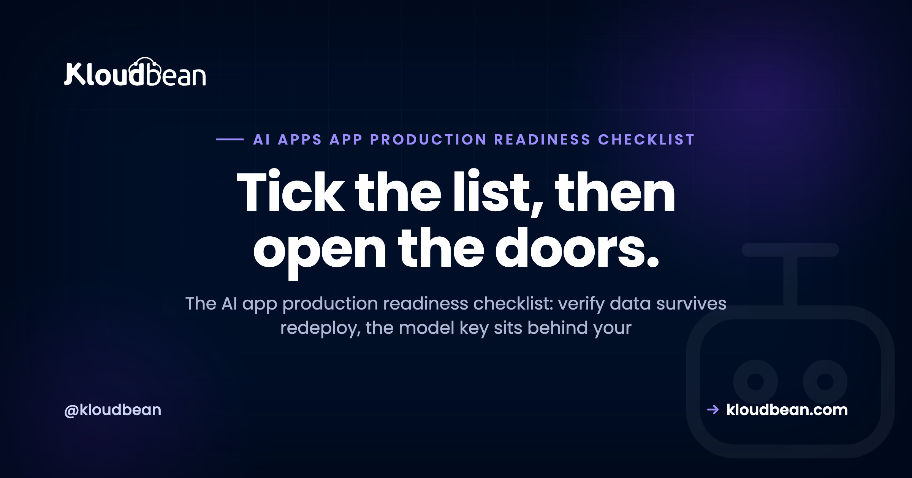
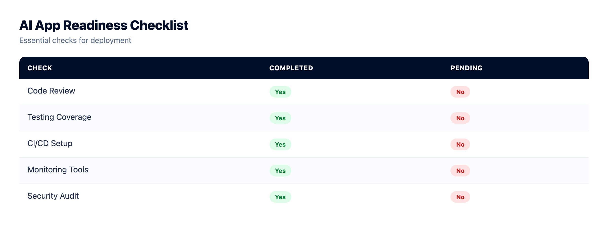
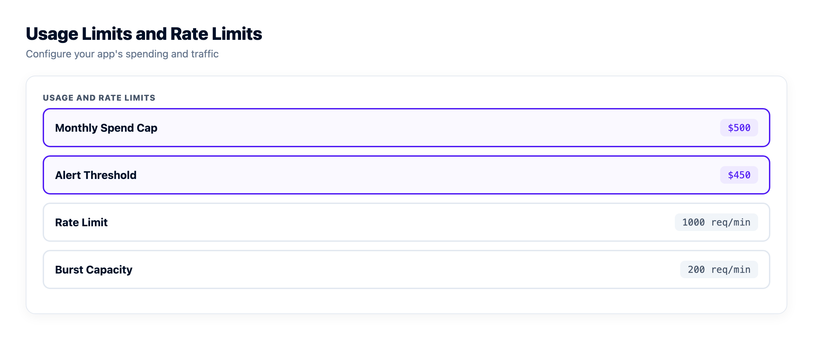
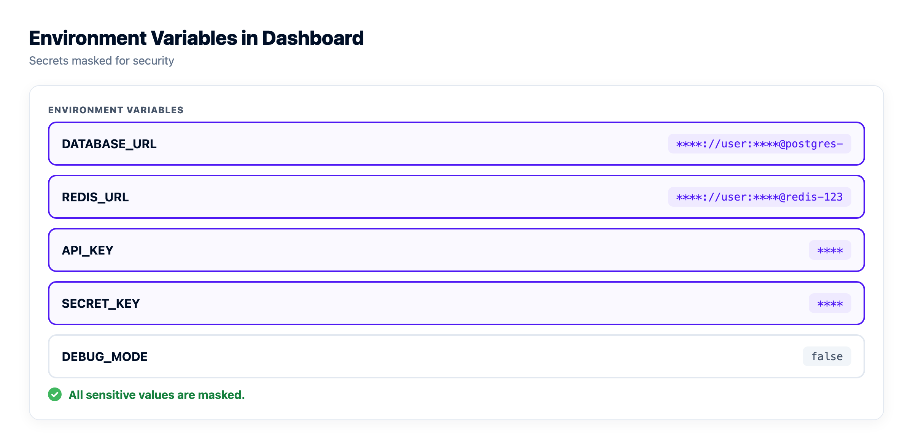
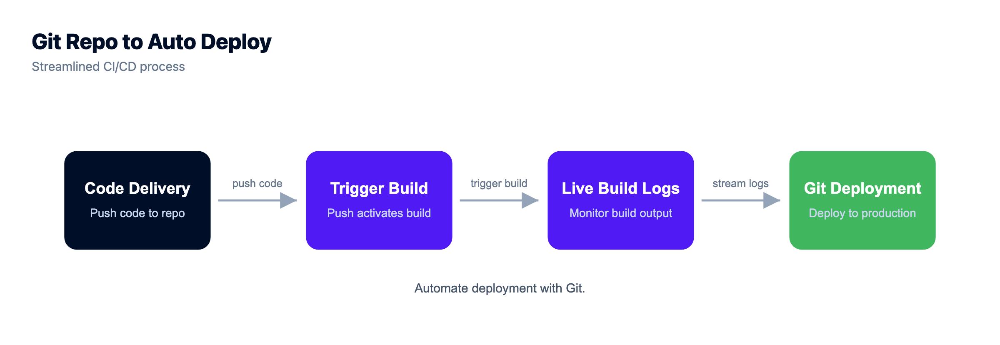

# The AI App Production Readiness Checklist: What to Verify Before Real Users Arrive

You shipped something built in Lovable, Cursor, or straight from the OpenAI SDK. It answers on localhost. Now you want real people using it. This AI app production readiness checklist is the list to run before you open the doors. It isn't another essay on why production is hard (that's the [flagship on the last mile of vibe coding](https://www.kloudbean.com/blog/last-mile-of-vibe-coding/)). It's the specific things to verify so your first real user doesn't become your first incident.

Most of it has nothing to do with your app's features. Those you already finished. It's the plumbing an AI app needs that a demo quietly skips: a key that isn't sitting in the browser, a store that survives a redeploy, and a spend cap so one script can't drain your budget while you sleep.

> **The short version.** Run this checklist across eight areas: data and persistence, the model call, cost and abuse control, memory, secrets, observability, reliability, and (only if you're regulated) data residency. The three that prevent the worst disasters are the key behind your backend, a hard spend cap, and a real database instead of SQLite. Everything else lowers risk. Scale how far you go to the stakes.

## How to use this AI app production readiness checklist

Work through the groups below, but know they aren't equal. This is the do-this companion to [the last mile of vibe coding](https://www.kloudbean.com/blog/last-mile-of-vibe-coding/), the longer read on why an AI app in production behaves nothing like the same app on your laptop. Read that for the why. Use this for the what. And for the full architecture these checks map onto, see [the AI app reference architecture](https://www.kloudbean.com/blog/ai-app-reference-architecture/).

Two things this page deliberately does not cover, so it stays a checklist and not a book. The general app baseline (a real domain, TLS, error pages, the boring but vital things any web app needs) lives in [the prototype to production checklist](https://www.kloudbean.com/blog/from-prototype-to-production-checklist/). Go there for the general list. This page is what's *different* about an AI app. And for a security-only deep pass, run [the AI-built app security checklist](https://www.kloudbean.com/blog/ai-built-app-security-checklist/) alongside it.

Tick top to bottom. The early groups (data, the model call, cost control) are the ones that lose data or money on day one. Short on time? Do those first, then come back for the rest.

## The checklist at a glance

Here's the whole thing in one view. Each group has a deep guide that teaches the how, linked in its section below. This table is the scan; the sections are the detail.

| Group | The check, in one line | Where the depth lives |
| --- | --- | --- |
| **Data and persistence** | State and vectors survive a redeploy; connections are pooled | Managed database, pgvector, pooling |
| **The model call** | Key on the server, stream the reply, handle 429s | API-key safety, LLM streaming |
| **Cost and abuse control** | Auth plus rate limits plus a hard spend cap | Rate limiting and cost control |
| **Memory and history** | History in the database, Redis for the fast layer | Agent memory, managed Redis |
| **Secrets and config** | Env vars in the dashboard, nothing in the repo | Secrets, environment variables |
| **Observability and privacy** | Log metadata not prompts; watch tokens, cost, 429s | AI app observability |
| **Reliability and ops** | Always-on, health check, backups, staging, Git deploy | Off serverless, 503 recovery |
| **Data residency** (if regulated) | Data in-region; deletion reaches every store | Saudi hosting, PDPL for AI |

## Data and persistence: does it survive a redeploy?

If one thing on this page loses you a week of users, it's this one. Start here.

- ☐ **Your data lives in a managed database, not SQLite or an in-memory array.** On most hosts the app's disk is wiped on redeploy, and a SQLite file goes with it. This is the single most common way an AI app loses its first signups. The fix, with framework examples, is in [add a managed database to your app](https://www.kloudbean.com/blog/add-managed-database-to-your-app/) and [managed PostgreSQL hosting](https://www.kloudbean.com/blog/managed-postgresql-hosting/).
- ☐ **Your vector store is persisted, not rebuilt in memory on boot.** If you do retrieval, those embeddings need a durable home. The `pgvector` extension keeps them in Postgres next to your normal data, so it's one database instead of two systems to run. See [pgvector for AI apps](https://www.kloudbean.com/blog/pgvector-for-ai-apps/), and for schema choices, [production database design for AI apps](https://www.kloudbean.com/blog/production-database-design-for-ai-apps/).
- ☐ **Connection pooling sits in front of the database.** Every request opens a connection, and an AI app under load hits the connection ceiling sooner than people expect. [Database connection pooling](https://www.kloudbean.com/blog/database-connection-pooling/) explains why that limit bites early.

## The model call: the key, the stream, the failure path

This is the part that's genuinely new versus a normal web app. Get it right and most AI-specific pain disappears.

- ☐ **The API key sits on the server, behind your own backend.** The browser calls your endpoint; your endpoint calls the provider. A key that ships to the client is public the moment you deploy. The pattern to copy is in [deploy an AI agent without exposing your API keys](https://www.kloudbean.com/blog/deploy-ai-agent-without-exposing-api-keys/).
- ☐ **You stream the response.** A model can take several seconds to write a long answer, and a frozen screen reads as broken. Stream tokens as they arrive, and watch for a buffering proxy that silently breaks streaming in production while it looked fine locally. See [LLM streaming in production](https://www.kloudbean.com/blog/llm-streaming-in-production/).
- ☐ **Timeouts, retries with backoff, and a fallback for provider 429s and outages.** Providers rate-limit you, and they have bad days. Decide now what your app does when the model returns a 429 or times out (retry, queue, degrade gracefully, or show a clear message), not mid-incident. More on the ways these apps fall over: [why AI apps fail in production](https://www.kloudbean.com/blog/why-ai-apps-fail-in-production/).

## Cost and abuse control: so one script can't drain your budget

Your model endpoint spends real money on every call. Treat it like a payment route, because that's effectively what it is.

- ☐ **Auth on every route that calls the model.** No anonymous access to the endpoint that costs you money. This is the big one.
- ☐ **Per-user and global rate limits.** A Redis-backed counter caps how fast one user, and everyone together, can hit the model.
- ☐ **A hard spend cap at the provider, and a kill switch.** Set the monthly limit so the worst case is a stopped feature, not a four-figure surprise. Keep a switch you can flip fast. The full pattern is in [rate limiting and cost control for AI APIs](https://www.kloudbean.com/blog/rate-limit-and-cost-control-for-ai-apis/).

## Memory and history: it remembers after a restart

An agent that forgets everything on restart feels broken to the person mid-conversation with it.

- ☐ **Conversation history and agent memory live in the database.** In-memory state vanishes the moment the process restarts, which in production is often (a deploy, a crash, a scale event). Durable patterns are in [AI agent memory in production](https://www.kloudbean.com/blog/ai-agent-memory-production/).
- ☐ **Redis handles the fast, short-lived layer.** Sessions, recent context, rate-limit counters, cached answers. Postgres stays the durable record; Redis is the speed in front of it. See [managed Redis hosting](https://www.kloudbean.com/blog/managed-redis-hosting/). Set TTLs so it stays small.

Both of those are one-click engines on Kloudbean (two of seven, alongside MySQL, MariaDB, Memcached, Elasticsearch, and MongoDB), which matters here for a dull reason: the durable layer and the fast layer end up as two tiles behind one login rather than two vendors, two bills, and two consoles to remember the passwords for.

## Secrets and config: nothing sensitive in the repo

- ☐ **Secrets live in environment variables set in the dashboard, not in code.** Per-environment values, what belongs in an env var and what doesn't, all covered in [environment variables done right](https://www.kloudbean.com/blog/environment-variables-done-right/). Worth checking your host actually lets you edit them from a screen; Kloudbean exposes Node and Python runtime config and env vars in the console with no SSH, which is what turns rotating a key into a config change instead of a commit.
- ☐ **Nothing sensitive is committed. Check git history too, since a deleted file still lives in old commits.** A key that was ever committed is compromised, even after you delete it. Bots scan public repos for exactly this within minutes.
- ☐ **You have a rotation plan.** You can swap a key without a code change and a redeploy. If rotating a secret means editing code, that's backwards. [Secrets management](https://www.kloudbean.com/blog/secrets-management/) covers the how.

## Observability and privacy: you can see what it's doing

You need to debug and watch spend without turning your logs into a liability.

- ☐ **You log metadata, not raw prompts.** Timing, token counts, the model, the user id, status codes. Prompts routinely carry personal data, and storing them by default creates data-handling obligations you didn't plan for.
- ☐ **You watch the signals that actually matter for an AI app:** time-to-first-token, tokens in and out, cost per request, and error and 429 rates. Those tell you slow versus broken versus expensive. Full setup in [AI app observability](https://www.kloudbean.com/blog/ai-app-observability/).
- ☐ **You set a retention window** so logs and any stored content age out on their own instead of piling up forever.

## Reliability and ops: it stays up and ships cleanly

This group is decided by what you deployed onto more than by anything you write. A persistent process has no cold start to engineer around, and automatic backups plus a Git pipeline with live build logs are either included or they're your weekend. Those all come with the app on Kloudbean, and staging environments are available for WordPress and Laravel.

- ☐ **The app is always-on, so there's no cold start on the first request.** A model call is slow enough without also waiting for the process to wake up. Why serverless hurts a steady, connection-heavy AI backend: [move your AI app off serverless](https://www.kloudbean.com/blog/move-ai-app-off-serverless/).
- ☐ **A health check endpoint** that a monitor or load balancer can poll to ask "are you alive?" and get a straight answer.
- ☐ **Automatic backups, and you've tested a restore.** A backup you've never restored is a hope, not a backup.
- ☐ **A staging environment** where you test a change before it touches real users.
- ☐ **You deploy from Git, repeatably**, and you know your 503 playbook for when a deploy goes sideways: [fix a 503 after deploying your app](https://www.kloudbean.com/blog/fix-503-after-deploying-your-app/).

<!-- ADD IMAGE: connecting a Git repo for automatic deploys (Code Delivery then Git Deployment), with live build logs streaming -->

## Data residency and compliance: only if you serve a regulated market

Skip this group if you're a hobby project or your users genuinely don't care where the data sits. But if you serve a regulated market (Saudi Arabia, healthcare, finance, government), it jumps to the top of the list, above almost everything else.

- ☐ **Data is stored in-region.** For a Saudi audience that means in-Kingdom. The residency and latency case is in [hosting AI apps in Saudi Arabia](https://www.kloudbean.com/blog/hosting-ai-apps-saudi-arabia/).
- ☐ **Deletion reaches every store.** A delete request has to clear the database, the vector store, object storage, logs, caches, and backups. Clearing the main table alone leaves copies behind, which is a real compliance gap. Background in [Saudi PDPL for AI apps](https://www.kloudbean.com/blog/saudi-pdpl-for-ai-apps/).

Region is the one item on this page that's genuinely painful to retrofit, because it's a provisioning decision rather than a code change. Kloudbean can provision in any region its seven clouds offer, in-Kingdom included via Google Cloud's Dammam region, which is what puts managed databases and Saudi data residency in the same dashboard. It's aligned with frameworks like GDPR and the NCA controls and supports the technical half of your compliance work. It does not make your organisation compliant. That half stays yours and no vendor can take it.

## How far down do you need to go?

Not every app needs every item, and pretending otherwise just makes you ignore the whole list. So scale the depth to the stakes.

<!-- ADD IMAGE: the readiness-by-stakes staircase (weekend demo, internal tool, funded or regulated SaaS) showing what each tier adds -->

**A weekend project or a solo demo** with a handful of friendly users: do the three that prevent disasters and stop there. Key behind your backend, a hard spend cap, and a real database instead of SQLite. You don't need staging and full observability for something ten people touch.

**An internal tool or an early launch** with real, if few, users: add auth on model routes, rate limits, secrets in env vars, always-on hosting, and backups you've tested. Now you're protecting data and money, which is a bigger job than uptime alone.

**A funded SaaS, a public launch, or anything regulated:** the whole list, plus observability you actually watch, a staging environment, and the residency and compliance group. This is the tier where an outage or a leak has a real bill attached.

If you only do three things before launch, do these: put the model key behind your backend, set a hard spend cap, and move off SQLite. Those three prevent the most common and most expensive AI-app disasters. That's the firm opinion of this whole page.

And the anti-pattern to avoid at all costs: treating a demo as production because it "works." It works in the sense that it responds when you type. It also has the key in the frontend, an in-memory store that resets on the next restart, and no cap on spend. "It responds" and "it's ready for strangers" are different claims. The gap between them is this checklist.

## What skipping each group actually costs you

A checklist is easy to nod at and easier to defer. So here's the invoice on each group, in the currency it gets paid in and roughly when it lands.

| What you skipped | What it costs | When you find out |
|---|---|---|
| Data in SQLite or memory | Every signup and conversation, gone, unrecoverably | The first redeploy. Often within a week. |
| Key in the frontend | Your provider balance, spent by strangers | Minutes, if the repo is public. Bots watch for this. |
| No spend cap | One runaway retry loop turns into a four-figure invoice | When the bill closes, which is far too late. |
| No auth on model routes | Same as no spend cap, but faster and repeatable | Whenever somebody finds the endpoint. |
| No streaming | Users abandoning a frozen screen mid-answer | Never explicitly. It hides inside your churn number. |
| No retries or fallback | Your app looks broken every time the provider has a bad hour | The first provider incident. There will be one. |
| Raw prompts in logs | A growing pile of personal data with obligations attached | When someone asks you to delete it, or when it leaks. |
| Cold starts | The slowest request is the first one any new user makes | Every single first impression. |
| Untested backups | You learn the backup was unusable at the exact wrong moment | Mid-incident, with everyone watching. |
| No staging | Your users are the test environment | On the deploy you were most confident about. |
| Wrong region, regulated market | A rebuild rather than a fix | During procurement or an audit, when you can least afford it. |

Read the third column and a split appears. Some of these bills arrive because of a decision inside your repo. Others arrive because of the shape of the thing you deployed onto, and no amount of careful code changes them. That's why the platform came up in the memory, secrets, ops, and residency groups above instead of waiting until now: those are the four where the host genuinely moves the number.

Now the part no host fixes, and ours is squarely included. Rows two through seven are code and configuration in your repo. Nobody provisions a retry with backoff on your behalf, decides your rate limit, sets your provider's spend cap, or chooses not to log the prompt. If your key is in a bundled JavaScript file, it's public on every platform in existence, and the most managed server on earth will serve it cheerfully. Backups we take; testing the restore is still a thing you have to actually do. Two scope notes while we're being exact: private networking and a VPC are part of the Enterprise package, so on a standard plan IP allow-listing on the database is your access model, and an account-wide immutable audit trail is Enterprise as well. And one thing people assume wrongly: if you'd rather self-host an open model than call a provider API, GPU servers are available and you can run your own model on one. DeepSeek installs one-click and support will install another model on request. You still choose and own the model; we run the box it sits on.

<!-- cta:start -->
**Take it off localhost for good.**

Run the app as an always-on process with managed databases, Redis, object storage, and automatic backups beside it. Deploy from Git with live build logs, and keep the infrastructure someone else's problem.

- Managed databases
- Always-on processes
- Object storage
- Automatic backups
- Free SSL
- Git deploy
- Free migration

[Start free](https://console.kloudbean.com/register) · [See plans](https://www.kloudbean.com/pricing/)
<!-- cta:end -->

## FAQ

**Is my AI app production ready?**
It's ready when the AI-specific basics hold: your data and vector store survive a redeploy, the model key sits behind your backend, every model route has auth and a spend cap, memory is in a database, secrets are in env vars, and the app is always-on with tested backups. If any of those is missing, you have a demo that happens to respond, not a production app.

**What's the minimum before launching an AI app?**
Three things prevent the worst outcomes: put the model key behind your own backend (never in the browser), set a hard spend cap at the provider, and store data in a managed database instead of SQLite. Those stop a leaked key, a runaway bill, and data loss on redeploy. Add auth on model routes and tested backups next.

**Do I need all of this for a side project?**
No. Scale the checklist to the stakes. A weekend project with a few friendly users needs the three essentials (key on the server, spend cap, real database) and little else. Save observability, staging, and the compliance group for when real users and real money are involved.

**What's different about an AI app checklist versus a normal web app?**
The general baseline (database, secrets, HTTPS, backups, deploys) is the same, and it lives in the prototype to production checklist. What's specific to AI: a model key that must stay server-side, streaming the response, provider 429s and timeouts, a hard spend cap because every call costs money, a persisted vector store, and logging that avoids storing raw prompts.

**Where should my AI app's API key live?**
On the server, behind your own backend, loaded from an environment variable. The browser calls your endpoint, and your endpoint calls the provider. A key shipped to the client is visible to anyone who opens dev tools, and it's effectively public the moment you deploy.

**How do I stop my AI app's costs from spiraling?**
Require auth on every route that calls the model, add per-user and global rate limits, and set a hard spend cap in the provider dashboard with a kill switch you can hit fast. An open, unauthenticated model endpoint is the most common way an AI app runs up a surprise bill overnight.

**Does my vector store need to survive a restart?**
Yes, if you rely on it. Embeddings rebuilt in memory on boot disappear on the next restart and cost time and money to regenerate. Persist them, for example with pgvector inside Postgres, so retrieval keeps working across deploys without a rebuild.

**Do I need Redis for an AI app?**
Not strictly, but it earns its place fast. Redis holds sessions, rate-limit counters, recent context, and cached answers so identical questions don't pay for a fresh model call. Keep the durable record in Postgres and use Redis as the fast layer in front, with TTLs so it stays small.

**How do I handle data residency for an AI app?**
Store data in the region your users or regulator require, and make sure a deletion request reaches every store: the database, the vector store, object storage, logs, caches, and backups. For a Saudi audience that means in-Kingdom hosting aligned with the PDPL. Data left behind in one or two stores is a common gap.

---

*Kloudbean · Tick the list, then open the doors.*
