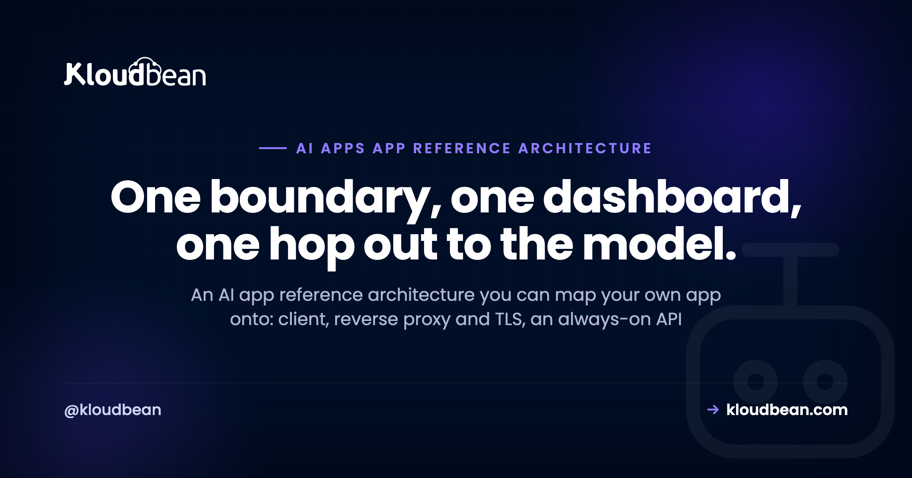

# A Reference Architecture for Production AI Apps

Every production AI app ends up needing the same handful of parts, whether it's a chatbot, an autonomous agent, a RAG tool, or a full AI SaaS. Most teams discover those parts one outage at a time. This is an AI app reference architecture: a single generalized shape you can hold in your head and map your own project onto, no matter how you built it. One diagram, then every box explained. What it is, why it's there, and what breaks the day you leave it out.

There's nothing exotic in here. A production AI app is a small distributed system with one unusual hop, a call to a model you don't run, and a few rules about who's allowed to talk to what. Get the shape right and the thing scales, survives redeploys, and won't hand a stranger your model bill. Get it wrong and you're up at 2am debugging cold starts and data that vanished on the last deploy.

> **The short version:** A production AI app is a client that talks only to your always-on API. That API holds the model key and the security gate, makes one server-side call to a model provider, and reads and writes a managed database (with pgvector for retrieval), Redis for the fast layer, a job queue for slow work, and object storage for files. Everything you own sits behind your domain and SSL, with observability watching all of it.

## The AI app reference architecture, in one diagram

Here's the whole thing on one canvas. Read it once before the details, because every section below is just a zoom into one box.

<!-- ARCHITECTURE DIAGRAM (rendered as an inline SVG in the .html): the full generalized production AI app topology. Outside the boundary: the client (browser or app) on the left and the model provider on the right (the one external hop). Inside a boundary box labelled "what you own and run, one dashboard, domain + SSL": a reverse proxy with TLS, an always-on API that holds the model key and the auth/limits/spend-cap gate, a queue + worker for slow work, Postgres + pgvector as the system of record, Redis for cache and limits, object storage for files, and an observability sink for logs, metrics and traces. Arrows: client to API, API one hop out to the model and streamed back, API read/write to the stores, telemetry to observability. Brand colours navy #000f27, purple #4F1AF3, green #40b75f. -->

Two boxes sit outside your control: the client (a browser or app) and the model provider. Everything else is yours, and the point of drawing a boundary around it is that it can, and probably should, live in one place. The client only ever talks to your API. Your API makes exactly one call out to the model, server-side, and streams the answer back. That single external hop is the whole reason the rest of the architecture exists. You need somewhere trusted to hold the key, count the requests, and remember what happened.

This is the generalized version. A chatbot is one instance of it (see the [chatbot version of this](https://www.kloudbean.com/blog/host-ai-chatbot-in-production/) for that request path in detail). An agent, a RAG search tool, and an AI SaaS backend are others. The boxes are the same. What changes is which ones you lean on. If you want the argument behind all of it, the [last mile of vibe coding](https://www.kloudbean.com/blog/last-mile-of-vibe-coding/) is the bigger picture, and this page is the architecture it points at.

<!-- ADD IMAGE: an always-on Node or Python app running in one dashboard, with its domain and running status visible. -->

## Every box, and what breaks without it

Before we zoom in, the whole reference in one table. This is the part worth bookmarking. Each row is a component, its job, the failure you invite by skipping it, and where to go deeper.

| Component | Its role | What breaks without it | Go deeper |
| --- | --- | --- | --- |
| Client / frontend | The UI the user touches; sends requests to your API | If it calls the model directly, your key is public and anyone can spend it | [Hide your API keys](https://www.kloudbean.com/blog/deploy-ai-agent-without-exposing-api-keys/) |
| Reverse proxy + TLS | Terminates HTTPS, routes traffic, one public front door | No SSL, no clean routing, streams stall behind buffering | [Reverse proxy explained](https://www.kloudbean.com/blog/reverse-proxy-explained/) |
| Always-on API | Holds the key, enforces auth and limits, orchestrates every call | Cold starts, dropped streams, no safe home for the key | [Off serverless](https://www.kloudbean.com/blog/move-ai-app-off-serverless/) |
| Model provider | The one external hop; generates the output | No timeout or fallback means one slow provider hangs your app | [Stream LLM output](https://www.kloudbean.com/blog/llm-streaming-in-production/) |
| Managed relational DB | System of record: users, conversations, app state | Redeploys wipe in-app storage and you lose everything | [Managed Postgres](https://www.kloudbean.com/blog/managed-postgresql-hosting/) |
| Vector store | Stores embeddings for retrieval, usually inside Postgres | No grounded answers; RAG has nowhere to search | [pgvector for AI apps](https://www.kloudbean.com/blog/pgvector-for-ai-apps/) |
| Cache / fast layer | Sessions, rate-limit counters, cached answers | Every request hits Postgres or the model; limits can't count | [Managed Redis](https://www.kloudbean.com/blog/managed-redis-hosting/) |
| Background jobs + worker | Runs slow or async work off the request path | Long jobs block requests and time out; indexing stalls the app | [Background jobs](https://www.kloudbean.com/blog/nodejs-background-jobs-bullmq/) |
| Object storage | User uploads, source documents, generated files | Files on local disk vanish on redeploy and don't scale | [Object storage](https://www.kloudbean.com/blog/store-user-uploads-in-object-storage/) |
| Observability | Logs, metrics, traces (metadata, not raw prompts) | You're blind when the app is slow, failing, or expensive | [AI app observability](https://www.kloudbean.com/blog/ai-app-observability/) |
| Security + cost gate | Auth, rate limits, and a spend cap around the model | One script runs up an unbounded bill overnight | [Rate limits + cost](https://www.kloudbean.com/blog/rate-limit-and-cost-control-for-ai-apis/) |
| Residency boundary (optional) | Keeps regulated data in-region, minds the one crossing | Data leaves the jurisdiction you promised it wouldn't | [In-region hosting](https://www.kloudbean.com/blog/hosting-ai-apps-saudi-arabia/) |

Notice how many rows are storage and safety, not model cleverness. That's the real lesson of running these in production. The model is one hop. The other boxes are what make it survive contact with actual users.

## The client and the edge

The client is whatever the user touches: a web page, a mobile app, a browser extension. It has exactly one rule in this architecture, and it's the rule people break first. The client never calls the model directly. Not once. The moment your frontend holds the model key, that key is public, because anyone can open dev tools and read it. Everything the client needs, it asks your API for. Keeping the key server-side is the entire game, and [deploying an AI agent without exposing API keys](https://www.kloudbean.com/blog/deploy-ai-agent-without-exposing-api-keys/) is the deep dive.

In front of your app sits a reverse proxy that terminates TLS, so users get HTTPS and a real domain instead of a raw preview URL. It routes traffic to your app, and it's where you'd bolt on a CDN later. Skip it and you've got no clean front door, no SSL, and streaming responses that stall the first time a buffering layer gets in the way. If the term is fuzzy, [reverse proxy explained](https://www.kloudbean.com/blog/reverse-proxy-explained/) covers it. Can you skip this on day one? Not really. But you rarely build it yourself; you just want SSL and a domain from the first deploy, and most hosts hand you that.

## The heart: an always-on API that holds the key

This is the box everything else plugs into, and it's the one people get wrong by trying to make it clever infrastructure when it should just be a normal, boring, always-on server. It holds the model key. It checks who's asking. It counts requests. It decides how much context to send, calls the model, streams the reply back, and writes down what happened. If a request touches money or data, it goes through here.

The word that matters is always-on. Your API must not scale to zero, because an AI app is sensitive to cold starts in a way a static site isn't. The first request after an idle period waits for the process to wake and rebuild its database connections, and that delay lands exactly when a new user is deciding whether you're worth their time. A warm process also keeps its connection pool ready and can hold a streaming connection open without the platform trying to freeze it mid-answer. That's why the reference puts a real server at the center, not a function. If you're on serverless today, [moving your AI app off serverless](https://www.kloudbean.com/blog/move-ai-app-off-serverless/) walks the migration.

The model provider is the one external dependency, so you treat it like one. Every call gets a timeout, so one slow response can't hang a request forever. Add a retry for the odd blip, and a fallback (a cheaper or secondary model) so a provider outage degrades your app instead of taking it down. Stream the tokens through your server to the client rather than buffering the whole answer. The mechanics of that live in [LLM streaming in production](https://www.kloudbean.com/blog/llm-streaming-in-production/), and a slow or flaky provider (timeouts, rate limits, malformed output) is one of the most common reasons these apps fall over once real traffic arrives.

```js
// every model call, wrapped
const reply = await withTimeout(
  () => model.stream(prompt),
  15_000,                        // don't let one slow call hang a request
).catch(() => fallbackModel.stream(prompt));  // degrade, don't 500
```

Wrapped around that call is the gate, and it isn't optional. Auth on every route that can reach the model. Per-user and global rate limits so one client can't flood you. A hard spend cap at the provider so the worst case is a paused service, not a five-figure surprise. The classic horror story is the open, unauthenticated endpoint that relays every request to the model on your key. Someone finds it, scripts it overnight, and you wake up to a bill shaped like a typo. [Rate limiting and cost control for AI APIs](https://www.kloudbean.com/blog/rate-limit-and-cost-control-for-ai-apis/) is the whole playbook.

## State: the data that has to survive a redeploy

Everything the app needs to remember lives outside the app process, in managed data services. This is the single biggest thing AI builders scaffold wrong. They reach for SQLite or an in-memory array, it works beautifully in dev, and the first production redeploy wipes it. State that matters can't live inside the thing you redeploy ten times a day.

The relational database is your system of record: users, sessions, conversations, jobs, whatever your app's truth is. Postgres is the sane default. It survives redeploys because it lives outside the app, and it's boring in the best way. Design the schema for how AI apps actually read and write, and put a connection pool in front of it, because every request that opens a fresh connection exhausts the limit faster than you'd guess.

If your app answers from your own documents, you need vector search, and here's my firm opinion: you almost certainly don't need a separate vector database to start. The pgvector extension stores embeddings right inside the Postgres you already run, which keeps your whole retrieval story in one database instead of two. Add a dedicated vector product later, if scale ever truly demands it. Most teams never do. See [pgvector for AI apps](https://www.kloudbean.com/blog/pgvector-for-ai-apps/) for how to turn it on and index your documents.

Redis is the fast, short-lived layer. Sessions, rate-limit counters, cached answers so an identical question doesn't pay for a fresh model call. It's not your system of record; it's the scratchpad in front of it. Set TTLs so it stays small. [Managed Redis hosting](https://www.kloudbean.com/blog/managed-redis-hosting/) covers the setup.

Object storage is for files: user uploads, the source documents your RAG pipeline indexes, generated images or exports. Files don't belong on the app server's local disk, because that disk is ephemeral, vanishes on redeploy, and doesn't scale past one machine. Push them to S3-style object storage instead, which [storing user uploads in object storage](https://www.kloudbean.com/blog/store-user-uploads-in-object-storage/) walks through.

<!-- ADD IMAGE: the managed database list showing PostgreSQL and Redis side by side, with the IP allow-list field in view. -->

## Getting slow work off the request path

Some work is too slow to do while a user waits. Indexing a big document for retrieval, a long multi-step generation, a batch export, sending email. If you do it inside the request, the request either times out or holds a connection hostage for 40 seconds. So you don't. You push the job onto a queue, return right away, and let a separate worker process drain the queue in the background.

The queue is usually Redis-backed (BullMQ in Node, for instance), and the worker is just another always-on process sitting next to your API. The user gets an instant acknowledgement, the heavy work happens off to the side, and one slow job never blocks the fast path. [Background jobs in Node.js with BullMQ](https://www.kloudbean.com/blog/nodejs-background-jobs-bullmq/) shows the pattern. This is also the one box I'd happily skip on day one. Add the queue the moment real work starts blocking requests, not before.

<!-- ADD IMAGE: a background worker process running next to the web app, plus a scheduled cron entry. -->

## Seeing what's actually happening

When the app is slow, failing, or expensive, you need to see why, and you can't debug what you don't measure. Observability is the sink that collects logs, metrics, and traces from your API and its stores. Which routes are slow, how many tokens went out, where errors cluster, what a request did on its way through.

One rule is specific to AI apps: log the metadata, not the message. Timing, token counts, the model used, user id, status codes, errors. Skip or redact the raw prompts and replies by default, because they routinely carry personal data, and hoarding all of it just grows your database and your risk. [AI app observability](https://www.kloudbean.com/blog/ai-app-observability/) goes deeper on what to capture and what to leave alone.

## Start smaller than the full diagram

Don't build all twelve boxes for a launch. That's over-engineering, and it's its own kind of failure. The minimum viable version of this architecture is four boxes: a client, an always-on API that holds the key, a managed database, and the model call. That's a real, shippable AI app. It has a safe place for the key, it survives redeploys, and it won't cold-start on your first user.

Then you add pieces as the app earns them. Need retrieval? Turn on pgvector in the Postgres you already have. Repeated questions, or limits to enforce? Add Redis. Uploads? Object storage. Work that blocks requests? The queue and a worker. Regulated data? The residency boundary below. My honest take: most AI apps need this whole shape eventually, except the job queue, which you should add the moment slow work starts blocking the request and not a day sooner. And you very rarely need a separate vector database. pgvector is enough until you're genuinely big. When the shape is in place and you're ready to ship, run the [AI app production readiness checklist](https://www.kloudbean.com/blog/ai-app-production-readiness-checklist/) before you open the doors.

## The anti-pattern that fights this shape

The architecture that fights every one of these needs is the one a lot of AI apps ship by accident: a serverless function for the API, plus a scattering of separate cloud services glued together across three dashboards. It looks modern. It fights you at every turn.

Cold starts hit the first user, right when it matters. Functions can't hold a connection pool, so your database chokes under load. There's nowhere for a long stream to live, and nowhere for a background worker to run, because the function is gone the moment it returns. Each service bills and breaks separately, and you're the integration layer holding it together. Serverless is genuinely good for spiky, stateless, occasional work. A stateful, connection-heavy, streaming AI backend is close to its worst case, which is why [moving off serverless](https://www.kloudbean.com/blog/move-ai-app-off-serverless/) is one of the most common production fixes for AI apps that outgrew the demo.

## When your data has to stay in one country

One optional overlay matters if you're in a regulated market: data residency. Some sectors and countries require that user data stays inside a specific jurisdiction. On this diagram, that means the entire boundary box, the API and every store, runs in-region, and you think hard about the one arrow that leaves: the call to the model provider. Either use a model hosted in-region, or send only what's necessary across that boundary, or keep sensitive fields out of the prompt entirely.

This is a real architectural decision, not a checkbox. It shapes where you host and which model you can call. If you're serving Saudi Arabia specifically, [hosting AI apps in Saudi Arabia](https://www.kloudbean.com/blog/hosting-ai-apps-saudi-arabia/) covers the in-Kingdom residency angle and what being aligned with local rules actually means in practice.

<!-- ADD IMAGE: a region picker showing an in-region data centre option for data that must stay in-country. -->

## Where Kloudbean fits

The reason this architecture is painful to run is rarely any single box. It's that they usually live in different places: one host for the app, another for the database, a third for the cache and queue, object storage somewhere else, and a separate console to learn for each. The whole appeal of drawing that boundary is being able to run everything inside it in one place. That's the shape Kloudbean is built around. One dashboard for the always-on server (Node or Python, no cold starts), managed databases including PostgreSQL with the pgvector extension where your plan supports it, managed Redis, object storage with no egress fees on the built-in buckets, automatic backups, free SSL, Git deploy on every push, cron jobs and a background worker, staging, and your environment variables managed right there in the console.

You lock a managed database down by whitelisting your app server's IP, so only your app can reach it and everything else is refused. If you need data in a specific region, Kloudbean can provision there, including in-Kingdom on Google Cloud's Dammam region, aligned with (not certified for) local data-protection expectations. The model is the one piece you choose and own. Call a hosted API like OpenAI if that suits you, or self-host an open model on a GPU server when you want it inside your own infrastructure. Which route makes sense, and what a self-hosted model actually costs to run, is its own decision, worked through in [self-host an LLM](https://www.kloudbean.com/blog/self-host-an-llm/).

The honest line, because it's what builds trust: managed means the platform handles the server, the stack, SSL, backups, and patching. Your app's code, your prompts, and your data stay yours. Full network isolation in a private VPC is an Enterprise capability, not a default; on a standard plan, the IP allow-list is how you keep a database off the open internet. Kloudbean makes the running easy. It doesn't make a leaky endpoint safe or a bad prompt smart.

**Run the whole architecture in one place, not five.** Launch an always-on Node or Python API, add managed PostgreSQL with pgvector and managed Redis, object storage, a background worker, automatic backups, and free SSL, all in one dashboard and deployed straight from Git. No cold starts, so your first user never waits. Start free at [kloudbean.com](https://www.kloudbean.com/); see plans on [pricing](https://www.kloudbean.com/pricing/).

Always-on (no cold starts) · Managed Postgres + pgvector · Managed Redis · Object storage · Background workers + cron · Automatic backups · Free SSL · Git deploy · IP allow-listing

## FAQ

**What is the architecture of an AI app?**
A production AI app is a client that talks only to your always-on API. That API holds the model key, enforces auth and rate limits, calls the model provider once server-side, and streams the reply back. Behind it sit a managed database for state, pgvector for retrieval, Redis for the fast layer, a queue and worker for slow work, object storage for files, and observability across all of it.

**What are the main components of a production AI app?**
Client, reverse proxy with TLS, an always-on API, the model provider, a managed relational database, a vector store (usually pgvector inside Postgres), Redis, a background job queue with a worker, object storage, observability, and a security and cost gate. A regulated app adds a data-residency boundary. Not every app needs all of them on day one.

**Do I need a separate vector database for my AI app?**
Usually not. The pgvector extension stores embeddings inside the Postgres you already run, which keeps retrieval in one database instead of two. That is enough for most apps well past launch. Add a dedicated vector product only if your scale genuinely outgrows Postgres, which is rarer than the hype suggests.

**Do I need a message queue for my AI app?**
Only once real work starts blocking requests. Indexing large documents, long multi-step generations, batch jobs, and email are all better pushed onto a queue so a worker handles them in the background. If your app just calls a model and returns quickly, you can skip the queue at launch and add it the moment a slow task starts holding up requests.

**Can I run an AI app on serverless?**
You can, but it fights the shape an AI app wants. Serverless functions cold-start on the first request, cannot hold a database connection pool, and have nowhere to keep a long stream or a background worker. For a stateful, streaming, connection-heavy AI backend, an always-on server is the better fit. Serverless suits spiky, stateless, occasional work.

**Where should an AI app store its data?**
In managed services that live outside the app process, so redeploys never wipe them. Use a managed relational database like Postgres for your system of record, Redis for sessions and rate limits, and object storage for files and uploads. Avoid SQLite or in-memory storage in production, since both disappear on the next deploy.

**Does the frontend ever call the model directly?**
No. If the browser calls the model, your API key is exposed to anyone who opens developer tools, and they can spend your budget freely. The client always talks to your backend, and only your backend holds the key and calls the model. That single rule prevents the most common and most expensive AI app mistake.

**What is the minimum architecture to launch an AI app?**
Four boxes: a client, an always-on API that holds the key, a managed database, and the model call. That is a real, shippable app with a safe place for the key and state that survives redeploys. You add retrieval, Redis, object storage, and a queue later, as the app actually needs them.

**How is a RAG app different from this architecture?**
It is the same architecture with the retrieval path switched on. A RAG app adds a vector store (pgvector in Postgres is usually enough) and an indexing step, often run as a background job, that turns your documents into embeddings. The model call then includes retrieved context. Everything else, the always-on API, the gate, the database, stays the same.

**Do I need Redis for an AI app?**
Not strictly, but it earns its place quickly. Redis holds sessions, rate-limit counters, and cached answers so repeated questions do not pay for a fresh model call, and it is the natural backing for a job queue. Your relational database stays the durable record; Redis is the fast layer in front of it. Add it when you need limits or caching.

---

*Kloudbean · One boundary, one dashboard, one hop out to the model.*
