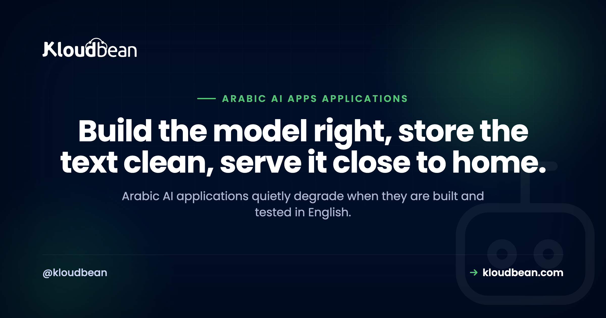

# Building Arabic AI Applications: What Actually Breaks, and How to Get It Right

You shipped an app that works great in English. Then a user in Riyadh types a question in Arabic and things get weird. The answers read stiff. The bill creeps up. A phone number lands in the wrong spot. Some text saves as question marks. Most Arabic AI applications don't fail because Arabic is exotic. They fail because the whole thing was built, demoed, and QA'd in English, and Arabic was quietly assumed to behave the same way. It doesn't, in a handful of specific, fixable places.

This is a field guide to those places. Tokenization and cost. Which Arabic your users actually speak. Right-to-left streaming. Storing the text. Retrieval that matches. For each one, what breaks and what to do about it. The WordPress and CMS side of Arabic (fonts, RTL themes, the display bug) has its own guide, so here we stay on the AI engineering.

<div class="tldr">
<strong>The short version</strong>
<p>Arabic AI apps break in five predictable spots. Arabic often uses more tokens per word, so measure your real token counts instead of assuming English costs. Test models on the dialect your users type, not textbook Modern Standard Arabic. Handle right-to-left and mixed Arabic-and-Latin text in the UI, especially while streaming. Store text as Unicode end to end (Postgres is UTF-8; MySQL needs utf8mb4). And normalize Arabic before you embed it, or retrieval misses.</p>
</div>

## Why Arabic AI applications quietly degrade when built in English

Arabic is a first-class market. Saudi Arabia is investing hard in digital services, and the wider region has a huge, young, online population that expects software to speak its language properly. So "we support Arabic" is a real product requirement now, not a nice-to-have.

The trouble is that support is often skin deep. A model gets billed as multilingual. A translation file gets an `ar` column. Someone flips the layout direction, and the box gets ticked. Nobody tested it with the messy, mixed, dialectal Arabic that real people actually type. So it degrades quietly, in places that never showed up in an English demo.

Here's the map. Every row is a spot where an app built in English drifts in Arabic, the symptom you'll notice, and the fix. The rest of this guide is these rows in detail.

| Where it degrades | The symptom you notice | The fix |
| --- | --- | --- |
| Tokenization and cost | Arabic uses more tokens per word, so requests cost more, prompts fill the context window sooner, and long replies truncate early | Measure real token counts on your own Arabic strings, then budget and trim for them |
| Model and dialect | A model strong in Modern Standard Arabic answers real Gulf or Egyptian chat stiffly, or gets it wrong | Evaluate models on the dialect your users actually type, not clean MSA |
| Right-to-left UI | Mixed Arabic, Latin, and numbers jump around, and streaming text reflows as it arrives | Set direction to RTL, isolate embedded Latin and digit runs, let each message pick its own direction |
| Storing the text | Arabic saves as `?????` or `أخ` mojibake | Use a Unicode charset end to end (Postgres is UTF-8 already; MySQL and MariaDB need `utf8mb4`), and set the connection charset too |
| Retrieval and embeddings | Arabic queries miss stored Arabic text that clearly matches | Normalize diacritics, alef, hamza, and taa marbuta at index and query time; pick embeddings with real Arabic coverage |
| Latency | Slow first response for users in the Gulf | Host in-region, physically close to your readers |

<div class="note">
<b>The anti-pattern:</b> build and QA the whole app in English, add an "Arabic mode" that nobody tested with real dialect or mixed bidi text, then ship it and wonder why the answers feel robotic and the UI mangles a phone number. Arabic isn't a translation layer you bolt on at the end. Test it the way your users will use it, early.
</div>

## Arabic often costs more tokens, so measure before you assume

Language models don't read words. They read tokens, which are chunks of text the tokenizer learned from its training data. Most popular tokenizers saw far more English than Arabic, and Arabic script (connected letters, rich word forms, optional diacritics) tends to break into more, smaller pieces. So the same idea, expressed in Arabic, often lands as more tokens than its English equivalent.

That has three practical consequences, and they all cost you something:

- You pay per token, so a mostly-Arabic workload can cost more per request than the English version you tested.
- Your prompt and history eat the context window faster, so you fit less conversation or fewer retrieved chunks before you hit the ceiling.
- Long Arabic replies reach `max_tokens` and truncate sooner than English testing led you to expect.

How much more? Don't trust a fixed number you read online, including a number you'd read here. The exact ratio depends on the model and its tokenizer, and it shifts between model families. So measure it on your own strings.

```python
import tiktoken

enc = tiktoken.get_encoding("o200k_base")  # match this to your model's encoder

english = enc.encode("where is the nearest restaurant")
arabic  = enc.encode("أين أقرب مطعم")

print(len(english), len(arabic))  # measure. do not assume they are equal.
```

<figure>
<svg viewBox="0 0 780 420" role="img" aria-label="A schematic comparison of tokenization. The English word restaurant splits into a few tokens, while the Arabic word for restaurant splits into more, smaller tokens in common tokenizers. Exact counts vary by model and should be measured." xmlns="http://www.w3.org/2000/svg">
<defs>
<marker id="ah" markerWidth="9" markerHeight="9" refX="7" refY="4" orient="auto"><path d="M0,0 L8,4 L0,8 Z" fill="#4F1AF3"/></marker>
</defs>
<text x="40" y="52" font-family="Poppins,sans-serif" font-size="21" font-weight="700" fill="#000f27">The same word, more tokens in Arabic</text>
<text x="40" y="78" font-family="Poppins,sans-serif" font-size="13" fill="#5b6a86">Schematic. Counts are illustrative, not exact. Measure your own.</text>

<text x="40" y="176" font-family="Poppins,sans-serif" font-size="14" font-weight="600" fill="#5b6a86">English</text>
<rect x="40" y="150" width="150" height="54" rx="10" fill="#fff" stroke="#000f27" stroke-width="1.6"/>
<text x="115" y="184" text-anchor="middle" font-family="Poppins,sans-serif" font-size="18" fill="#000f27">restaurant</text>
<line x1="196" y1="177" x2="250" y2="177" stroke="#4F1AF3" stroke-width="2" marker-end="url(#ah)"/>
<rect x="258" y="157" width="96" height="40" rx="8" fill="#eafaf0" stroke="#40b75f" stroke-width="1.6"/>
<rect x="362" y="157" width="96" height="40" rx="8" fill="#eafaf0" stroke="#40b75f" stroke-width="1.6"/>
<text x="484" y="182" font-family="Poppins,sans-serif" font-size="15" font-weight="600" fill="#40b75f">fewer tokens</text>

<text x="40" y="316" font-family="Poppins,sans-serif" font-size="14" font-weight="600" fill="#5b6a86">Arabic</text>
<rect x="40" y="290" width="150" height="54" rx="10" fill="#fff" stroke="#000f27" stroke-width="1.6"/>
<text x="115" y="326" text-anchor="middle" font-family="Poppins,sans-serif" font-size="22" fill="#000f27">مطعم</text>
<line x1="196" y1="317" x2="250" y2="317" stroke="#4F1AF3" stroke-width="2" marker-end="url(#ah)"/>
<rect x="258" y="297" width="52" height="40" rx="8" fill="#efe9ff" stroke="#4F1AF3" stroke-width="1.6"/>
<rect x="316" y="297" width="52" height="40" rx="8" fill="#efe9ff" stroke="#4F1AF3" stroke-width="1.6"/>
<rect x="374" y="297" width="52" height="40" rx="8" fill="#efe9ff" stroke="#4F1AF3" stroke-width="1.6"/>
<rect x="432" y="297" width="52" height="40" rx="8" fill="#efe9ff" stroke="#4F1AF3" stroke-width="1.6"/>
<rect x="490" y="297" width="52" height="40" rx="8" fill="#efe9ff" stroke="#4F1AF3" stroke-width="1.6"/>
<text x="556" y="322" font-family="Poppins,sans-serif" font-size="15" font-weight="600" fill="#4F1AF3">more tokens</text>
</svg>
<figcaption>The same word ("restaurant") often splits into more subword tokens in Arabic than in English in common tokenizers. That means more cost per request and a context window that fills sooner. The block counts here are illustrative, so measure your own with your model's tokenizer.</figcaption>
</figure>

Once you can see your real numbers, the fixes are ordinary. Trim the history you send. Set `max_tokens` deliberately for Arabic replies. Don't pad prompts with instructions the model already follows. If you're wiring up streaming and cost control for a chat app in general, [how to host an AI chatbot in production](https://www.kloudbean.com/blog/host-ai-chatbot-in-production/) covers the money side of it.

<!-- ADD IMAGE: a token counter or tokenizer output comparing the same sentence in English and Arabic, with the Arabic token count clearly higher. -->

## Which Arabic do your users actually speak?

There isn't one spoken Arabic. Modern Standard Arabic (MSA, or al-fusha) is the formal written standard: news, official documents, subtitles. Almost nobody chats in it. Day to day, people write in regional dialects that differ a lot in vocabulary, spelling, and grammar. A model that scores well on MSA can still stumble on how your users actually type.

| Variety | What it is | Where you meet it | How to test it |
| --- | --- | --- | --- |
| Modern Standard Arabic (MSA) | The formal written standard | Documents, news, formal prompts | Necessary, but don't stop here |
| Gulf (Khaleeji) | Everyday speech across Saudi Arabia and the Gulf | Saudi consumer chat and support | Collect real user phrasings and test on those |
| Egyptian | Widely understood thanks to film and TV | Broad, pan-Arab consumer audiences | Test if you serve Egypt or a general audience |
| Levantine | Spoken across Syria, Lebanon, Jordan, Palestine | Consumer apps in the Levant | Test with local phrasing, not MSA |
| Maghrebi (Darija) | North African varieties with distinct vocabulary | Morocco, Algeria, Tunisia | Test explicitly; often the hardest for MSA-tuned models |

My one firm opinion for this page: test in the dialect your users actually type, not textbook MSA. A demo that shines on clean, formal Arabic can fall apart the moment a real person types Gulf chat with an English word dropped in the middle and no diacritics anywhere. Build a small evaluation set of real, messy, user-style prompts in your target dialect, and judge models on that. It's the highest-leverage thing you can do for Arabic quality, and it costs you an afternoon.

Which model is best for Arabic? I won't hand you a winner, because the honest answer is "whichever does best on your dialect and your task, measured today." The field moves fast, both the big multilingual models and the Arabic-focused ones. Run your eval set across a few candidates and let your own numbers pick. Any guide that names a permanent champion is guessing.

## Streaming into a right-to-left chat UI

Right-to-left is more than flipping the layout. The hard part is bidi: a single line that mixes Arabic (right-to-left) with Latin words, URLs, or numbers (left-to-right). The Unicode Bidirectional Algorithm decides the visual order, and if you don't help it, an English product name or a phone number can jump to the wrong end of the line or split its punctuation off.

Two things fix most of it:

- **Set the direction.** Put `dir="rtl"` on the chat container, or `dir="auto"` on each message so it picks direction from its first strong character. That renders a mostly-Arabic or mostly-English message correctly without you guessing per message.
- **Isolate the embedded runs.** Wrap Latin words, URLs, and numbers in a `<bdi>` element (or use the Unicode isolate characters), so the bidi algorithm treats each as a self-contained chunk and stops it bleeding into the Arabic around it. A phone number inside `<bdi>` stays put.

Streaming adds a twist. When you append tokens one at a time into an RTL bubble, the browser recomputes the line layout on every update. So a half-finished Latin word or a partial number can visibly jump as the next token arrives, then settle once it's complete. It looks janky even though the final text is correct. Smooth it by buffering to a natural boundary (a word, or a space) before you paint, and by isolating embedded LTR runs so a completed number doesn't reorder the whole line. The general streaming transport (SSE versus WebSockets, proxy buffering, reconnects) is its own subject, covered in [LLM streaming in production](https://www.kloudbean.com/blog/llm-streaming-in-production/). What's Arabic-specific is the direction and the bidi handling layered on top.

One more digit gotcha: Arabic content might use Western digits (0 to 9) or Eastern Arabic-Indic digits (the ٠ to ٩ set), sometimes both on one screen. Pick a convention, render it consistently, and remember that prices and phone numbers are exactly where a bidi slip is most visible to a user.

<!-- ADD IMAGE: a chat bubble showing Arabic text with an embedded Latin brand word and a phone number, rendered correctly with bidi isolation next to a broken version where the number jumps. -->

## Storing Arabic text without turning it into question marks

This one is old, boring, and still bites people constantly. If Arabic saves as `?????` or `ال` mojibake, it's almost never the model or the framework. It's a character-set mismatch somewhere in the database path.

The rule is one word: Unicode, end to end. Postgres uses UTF-8 by default, so Arabic stores correctly out of the box, nothing special to do. MySQL and MariaDB are where people get burned, because the charset historically labelled `utf8` there is really three-byte `utf8mb3`, and the old `latin1` default mangles Arabic outright. You want `utf8mb4`, real full UTF-8, on the database, the table, and the column.

And here's the part that catches even careful people: set the connection charset too, not just the column. If your app connects and negotiates `latin1` for the session, it can corrupt text on the way in even when the column itself is `utf8mb4`.

```js
// MySQL / MariaDB: set the connection charset, not only the column
const pool = mysql.createPool({
  host: process.env.DB_HOST,
  user: process.env.DB_USER,
  password: process.env.DB_PASSWORD,
  database: process.env.DB_NAME,
  charset: "utf8mb4",
});
```

That's the whole AI-app version of the story. The CMS version, WordPress specifically, plus fonts, RTL themes, and the same `utf8mb4` bug in `wp-config`, is covered in depth in [Arabic WordPress hosting](https://www.kloudbean.com/blog/arabic-wordpress-hosting/). On Postgres you mostly get this for free.

<!-- ADD IMAGE: the Kloudbean console launching a managed Postgres or MySQL database, with a note that Postgres is UTF-8 and MySQL uses utf8mb4 so Arabic stores cleanly. -->

## Arabic retrieval: normalize before you embed

If your app answers from your own documents (a knowledge base, product docs, past tickets), you're doing retrieval, and Arabic adds a step English lets you skip: normalization.

Arabic text carries a lot of surface variation for the same word. Writers include or drop the short-vowel diacritics (tashkeel). The alef appears in several forms (أ, إ, آ, ا) that people type interchangeably. Hamza sits in different places. Taa marbuta (ة) and haa (ه) get swapped, as do alef maqsura (ى) and yaa (ي). A human reads these as the same word. A naive vector search or keyword index sees different strings, so a query misses text that obviously matches.

The fix is to normalize both sides. Run your documents through a normalizer before you embed and index them, and run the incoming query through the exact same function, so they meet in one normalized space.

```python
import re, unicodedata

def normalize_ar(text: str) -> str:
    text = unicodedata.normalize("NFKC", text)
    text = re.sub(r"[\u064B-\u065F\u0670]", "", text)  # strip tashkeel / diacritics
    text = re.sub(r"[إأآا]", "ا", text)                 # unify the alef forms
    text = text.replace("ى", "ي").replace("ة", "ه")     # alef maqsura, taa marbuta
    return text.strip()

# apply the SAME function when indexing documents and when handling a query
```

Two more things move Arabic retrieval quality. First, the embedding model: some have strong Arabic coverage, some are English-first with Arabic bolted on, and it shows in how tightly related Arabic phrases cluster. Test retrieval on real Arabic queries, the same way you tested the chat model. Second, chunking: Arabic packs meaning densely, so chunk on meaning (sentences, headings) rather than a blind character count that can slice through a word.

Normalization has a tradeoff worth naming. Aggressive stripping can merge words a diacritic genuinely distinguishes, so for most retrieval it helps recall more than it hurts, but don't apply it to text you show back to the user. Normalize for matching, keep the original for display. The vector mechanics (storing embeddings, indexes, similarity search) live in [pgvector for AI apps](https://www.kloudbean.com/blog/pgvector-for-ai-apps/), and a full Arabic-and-Saudi retrieval build, residency included, is in [Saudi-hosted RAG](https://www.kloudbean.com/blog/saudi-hosted-rag/). This section is the Arabic-language layer that sits on top of both.

## Hosting close to your Arabic-speaking users

None of the above matters if the first response takes two seconds because your server sits a continent away. For an Arabic-speaking audience in the Gulf, physical distance is latency you can't code around. A request from Riyadh to a European region carries a real round-trip floor on every hop. Serve the same user from inside the region and that floor mostly disappears.

So host close to your users. For a Saudi audience that means an in-Kingdom region, which also helps with data residency if you hold personal data on people in Saudi Arabia. The full latency and hosting story is the pillar, [hosting AI apps in Saudi Arabia](https://www.kloudbean.com/blog/hosting-ai-apps-saudi-arabia/), with the city-level detail in [low-latency hosting for Riyadh and Jeddah](https://www.kloudbean.com/blog/low-latency-hosting-riyadh-jeddah/). No need to re-run it here. If you got here from the broader picture of what AI builders leave for you to finish, that's [the last mile of vibe coding](https://www.kloudbean.com/blog/last-mile-of-vibe-coding/).

## Where Kloudbean fits

Most of this guide is model and app work that's yours no matter where you host. What a host controls is where the app runs, how fast it reaches your users, and whether your Arabic text is stored and served cleanly. That's the part Kloudbean handles, in one dashboard.

You run an always-on Node or Python app, so there's no cold-start lag on that first Arabic message. You add a managed database that stores Arabic correctly (Postgres on UTF-8, or MySQL and MariaDB on `utf8mb4`), and turn on `pgvector` for your embeddings where your plan supports it. Managed Redis, object storage, automatic backups, free SSL, and Git deploys round it out. You can provision on Google Cloud's Dammam region (`me-central2`), physically inside Saudi Arabia, for low latency to Saudi users and in-Kingdom residency. That residency point is real leverage: Kloudbean is one of the few managed-cloud platforms delivering managed databases with in-Kingdom data sovereignty. You lock the database down by whitelisting your app server's IP, so only your app can reach it.

The honest boundary: Kloudbean hosts your app and your data. It doesn't provide the Arabic model, translation, or NLP itself. If you self-host an open model, Kloudbean offers a GPU server to run it on, though the model you pick and tune stays yours. The dialect quality, the token budget, the normalization, and the bidi handling are yours to build. The platform's job is to keep the app up and the Arabic text intact, close to your readers. Managed means the server, stack, SSL, backups, and patching are handled; your code, prompts, and data stay yours. Full network isolation in a private VPC is an Enterprise capability, so on a standard plan the IP allow-list is how you keep the database off the open internet. On compliance, the platform is built to align with and support the common frameworks, while the app-level obligations stay with you. No software makes an organization "certified" on its own.

<!-- ADD IMAGE: the Kloudbean Add Server screen with Google Cloud Dammam (me-central2) Saudi Arabia selected, for low latency to Saudi users. -->

---

**Ship an Arabic AI app that stays up, loads fast for Gulf users, and stores every character intact.**

Run it on an always-on server with a managed database that speaks Unicode, deploy straight from Git, and provision inside Saudi Arabia when you need to. Start free at [kloudbean.com](https://www.kloudbean.com/); see plans on [pricing](https://www.kloudbean.com/pricing/).

Always-on Node and Python · Managed PostgreSQL and MySQL with Unicode storage · pgvector embeddings · Managed Redis · In-Kingdom GCP Dammam region · Free SSL · Git deploy · IP allow-listing

## FAQ

**Why does my AI app work in English but not Arabic?**
Usually because it was built and tested in English, and Arabic hits problems English never surfaced. The common culprits are more tokens per request (higher cost, earlier truncation), a model tuned for formal Arabic that fumbles real dialect, a right-to-left UI that mangles mixed text and numbers, a database charset that saves Arabic as question marks, and retrieval that misses because the text was never normalized. Each one is fixable once you know to look for it.

**Does Arabic cost more tokens than English?**
Often, yes. Common tokenizers were trained on far more English, so Arabic script tends to split into more, smaller tokens, which means more tokens for the same meaning. That raises cost per request, fills the context window faster, and truncates long replies sooner. Don't trust a fixed multiplier, though. Measure your own strings with your model's tokenizer, because it varies by model.

**How do I store Arabic text in a database?**
Use a Unicode charset from end to end. Postgres is UTF-8 by default, so Arabic stores correctly with no extra work. On MySQL or MariaDB, use utf8mb4 (not the older three-byte utf8, and never latin1) on the database, table, and column. Set the connection charset to utf8mb4 as well, not just the column, or text can still get corrupted on the way in.

**Which language model is best for Arabic?**
There's no single winner, and any article claiming one is guessing. The right model is the one that performs best on your dialect and your task, measured now, because the field changes fast. Build a small evaluation set of real, messy, user-style prompts in your target dialect and run a few candidate models against it. Let your own results decide rather than a leaderboard built on formal Arabic.

**What is the difference between Modern Standard Arabic and dialects for AI apps?**
Modern Standard Arabic (MSA) is the formal written standard used in news and documents. It isn't how people chat. Everyday speech is regional: Gulf, Egyptian, Levantine, and Maghrebi varieties differ a lot in words and spelling. A model can be strong in MSA and weak in a dialect, so if your users type dialect, evaluate on dialect. Testing only on clean MSA is how an app ends up feeling stiff in real use.

**How do I stop right-to-left chat text from jumping around while it streams?**
Set the text direction (dir to rtl on the container, or auto per message), and isolate embedded Latin words, URLs, and numbers with a bdi element so the bidi algorithm doesn't reorder them. While streaming, the browser recomputes the line on each token, so a half-finished number can visibly jump. Buffer to a word boundary before painting, keep those runs isolated, and it settles.

**How do I improve Arabic retrieval accuracy in a RAG app?**
Normalize Arabic before you embed and index it, and normalize the query the same way, so they match in one space. Strip diacritics, unify the alef and hamza forms, and fold taa marbuta and alef maqsura. Then pick an embedding model with genuine Arabic coverage and test retrieval on real Arabic queries. Keep the original text for display and normalize only the copy you match against.

**Should I host my Arabic AI application in Saudi Arabia?**
If your users are in the Kingdom, hosting in-region cuts the round-trip latency that distance forces on every request, so the first response feels quick. It also helps with data residency if you hold personal data on Saudi users, which comes up often in procurement. Residency stays a shared responsibility you own at the app level. An in-Kingdom region like Dammam is the direct win for a Saudi audience.

**Can Kloudbean run my Arabic AI application?**
Yes, for the hosting layer. Kloudbean runs your always-on Node or Python app, with managed databases that store Arabic correctly (Postgres on UTF-8, MySQL on utf8mb4), pgvector for embeddings, managed Redis, free SSL, and Git deploy, and it can provision inside Saudi Arabia on the Dammam region. It doesn't provide the Arabic model, translation, or NLP. Those stay yours. The platform keeps the app up and the text intact.

---

*Kloudbean · Build the model right, store the text clean, serve it close to home.*
