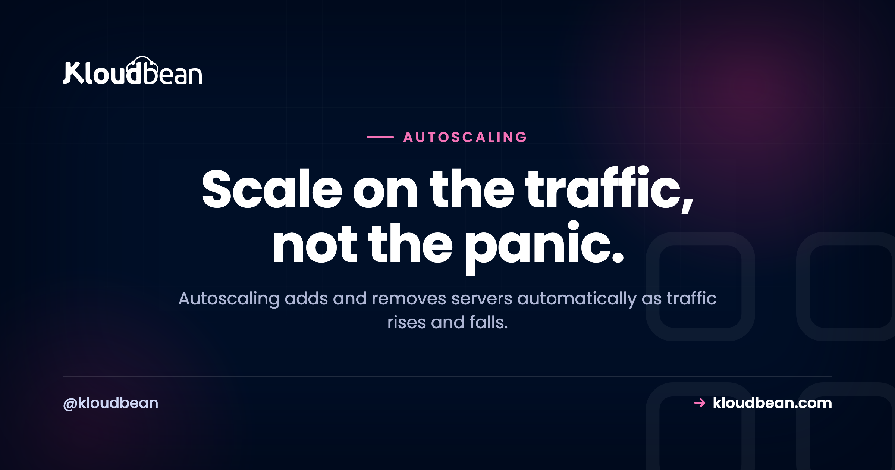
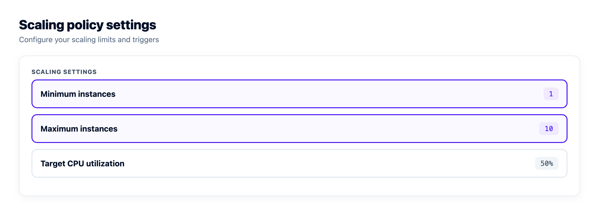
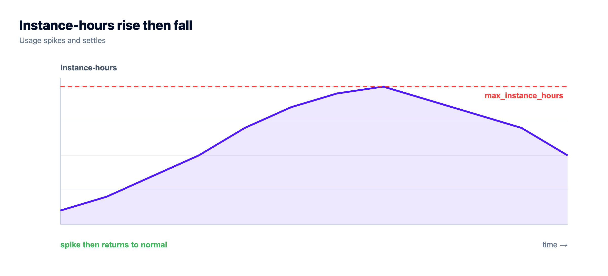

# Autoscaling: Do You Actually Need It? A Decision Guide

Autoscaling sounds like the obviously-correct, grown-up way to run infrastructure: servers that appear when traffic surges and vanish when it calms, so you never over-pay and never fall over. For the right workload, it genuinely is that good.

But for a lot of projects, autoscaling solves a problem they don't have. It's extra machinery chasing a spike that never comes, plus a bill that can bite when the spike does. So before you switch it on, let's work out whether you need it, what your app must look like for it to work, and where it goes wrong.

> **Short version:** Autoscaling adds servers when a metric like CPU crosses a threshold and removes them when load falls, so capacity tracks real traffic. It's a genuine win for spiky, unpredictable load. But most apps have steady traffic and do fine on one right-sized server, plus maybe a node or two behind a load balancer. And it only works if your app is stateless, so that's the real first job.

## What autoscaling actually is

So what is autoscaling, exactly? Your infrastructure **adds and removes servers automatically** based on live load. You set the rules once: when average CPU across the group climbs over, say, 70%, add a node; when it falls back under 30%, remove one. It's horizontal scaling (more servers behind a load balancer) with the "when" handled for you instead of you clicking a button at 2am. The interesting question is whether you need it, and that's most of this guide.

Here's the shape of it over one busy afternoon. Load climbs and crosses the trigger, nodes get added one at a time, then the extras retire as traffic fades. Your instance count follows the graph.

```
Load
  |                 __--''--__                      peak
  |              _-'          '-_
  |. . . . . . _/. . . . . . . . .\_ . . . . . . .  scale-out threshold
  |         _-'                     '-_
  |______-''                           ''--_______  time ->
            ^ crosses up: scale out     ^ drops below: scale in

Servers running:   1  --+->  2  --+->  3   ...   3  --->  2  --->  1
                        (add as load rises)          (remove as it falls)
```
*Metric-driven scaling: as load crosses the scale-out threshold, servers are added one at a time; as it falls back, the extra servers are removed. Capacity chases the traffic curve instead of sitting fixed.*

## Horizontal vs vertical scaling, and where autoscaling sits

There are two ways to give an app more room. **Vertical scaling** means a bigger box: more CPU and RAM on the same server. **Horizontal scaling** means more boxes: several servers sharing the work behind a load balancer. Autoscaling is just automated horizontal scaling, the machine adding and removing those boxes on a rule.

They aren't rivals. They're rungs. You start vertical because it's trivial: resize the server, no code changes. You go horizontal when one box isn't big enough or safe enough alone. And you automate that step only once your traffic swings enough to make doing it by hand a chore.

| | Vertical (bigger box) | Horizontal (more boxes) | Autoscaling (auto horizontal) |
| --- | --- | --- | --- |
| **What changes** | More CPU and RAM on one server | More servers behind a balancer | Servers added and removed on a rule |
| **Complexity** | Lowest, just a resize | Medium, needs a stateless app | Highest: policy, cooldowns, limits |
| **App changes** | None | Must be stateless | Stateless, plus a tuned policy |
| **Best for** | Growing but steady load | Redundancy and higher steady load | Spiky, unpredictable load |
| **Ceiling** | The biggest box you can buy | Add nodes as needed | Nodes added automatically up to a max |

The honest path: right-size first. Add a fixed node behind [a load balancer](https://www.kloudbean.com/blog/cloud-load-balancer-explained/) when you need redundancy or headroom. Reach for autoscaling last, and only if the traffic calls for it.

## What actually triggers a scale-out (and a scale-in)

The rule that drives autoscaling is a **scaling policy**, simpler than it sounds. You pick a metric and set thresholds and limits. A typical one reads: add a node when average CPU stays above 70% for five minutes, remove one when it sits below 30% for ten. CPU is the common trigger, but request rate per node, memory, or queue depth all work, depending on what your app runs out of first.

Two numbers matter more than people expect. The **minimum** keeps a floor of servers running so you're never scaled to nothing. The **maximum** caps how far it grows, your protection against a runaway bill. Between them sits a **cooldown**, a short wait after each change so the group settles before the policy fires again. Skip it and you get flapping: nodes added and removed every couple of minutes as the metric bounces around the threshold. Worse than doing nothing.

There's an asymmetry too. Scale-out happens fast, because falling over is expensive. Scale-in is deliberately lazy, making sure the quiet is real before handing capacity back. You'd rather pay for one extra node for ten minutes than drop it right before the next wave.



## When autoscaling is genuinely worth it

Autoscaling earns its complexity when your traffic is **variable and hard to predict**:

- **Spiky traffic.** Sudden surges (a product launch, a campaign email, a Hacker News front page) that would flatten a fixed setup but only last a few hours.
- **Big daily or seasonal swings.** Peak load is many times the trough, so a server sized for the peak burns money overnight and one sized for the trough dies at lunchtime.
- **Real viral potential.** If a single post could multiply your traffic while you sleep, autoscaling is insurance against your own success becoming an outage.

If your traffic graph looks like a mountain range instead of a flat line, autoscaling matches capacity to reality. That's large consumer apps, ticketing, live-event sites, retail during a sale.

## When you don't need autoscaling (which is most of the time)

Be honest about your traffic, because this describes most projects:

- **Steady load.** If traffic is roughly flat day to day, one right-sized server (or a fixed pair behind a balancer) is simpler and cheaper. Autoscaling adds machinery for a variance that isn't there.
- **Small scale.** A site that fits comfortably on one server has nothing to scale out to yet. Plenty of busy apps [run happily on a single server](https://www.kloudbean.com/blog/host-app-api-and-database-on-one-server/) for a long time.
- **Predictable peaks.** If you know the big day is coming, scale up by hand the night before and back down after. Far less machinery than a policy, and perfectly adequate.

I'll say it plainly: reaching for autoscaling on a small or steady app is one of the most common over-engineering mistakes I see. It feels responsible. It's usually just complexity, and a bigger blast radius the day the automation misbehaves. Size it once, resize occasionally, get back to building.

## What your app has to look like first

This is the part people skip, and it's the actual gate. Autoscaling only works if your app is built to run across servers that appear and disappear without warning:


- **A stateless app.** Any server can handle any request, because servers get created and destroyed on the fly. Nothing important lives only on one machine's local disk or memory.
- **Shared session and storage.** Sessions in a shared store like [managed Redis](https://www.kloudbean.com/blog/managed-redis-hosting/), uploads in object storage. A new node then has everything it needs the moment it boots.
- **A load balancer with health checks** in front, to route traffic to the live set of nodes and notice the instant the group changes.

If your app isn't stateless, autoscaling causes bugs rather than fixing them: users randomly logged out, uploads that vanish, carts that empty themselves. Getting the app stateless is the real work. Do it once and [running across several servers](https://www.kloudbean.com/blog/deploy-node-app-to-managed-cloud/) stops being scary. The automation on top is the easy 10%.



## Autoscaling vs simply scaling up

The alternative to autoscaling isn't "fall over." It's usually "use a bigger server." Vertical scaling is far simpler, and enough for a huge range of apps.


The sensible progression is a ladder, and most projects never climb past the second rung:

1. Size one server well and run on it.
2. Resize it up (more CPU and RAM) as you grow.
3. Add a fixed second node behind a balancer for redundancy and headroom.
4. Only then autoscale, if your traffic is variable enough to justify the machinery.

Autoscaling is the top rung, not the first. Treating it as the default is how small teams end up debugging scaling policies instead of shipping features.

## Where autoscaling goes wrong

Even when you genuinely need it, know the sharp edges. This is where I see it bite:

- **A stateful app breaks under it.** The big one. If sessions or uploads live on a single node, adding and removing nodes scatters your users' state. Autoscaling doesn't create the bug, it exposes one that was always there.
- **New nodes lag a sudden spike.** Booting and warming a node takes real time, so autoscaling handles a sustained climb far better than a one-second wall of traffic. Keep headroom, or pre-warm before a known event.
- **The bill can run away.** A real flood, or a runaway loop hammering your own API, can scale you into a nasty invoice. That's what the maximum is for. Set it, and [know how the meter runs](https://www.kloudbean.com/blog/cloud-hosting-pricing-explained/).
- **The database usually doesn't scale this way.** You can autoscale the stateless web tier easily. A database is stateful and scales through bigger instances and [read replicas](https://www.kloudbean.com/blog/database-read-replicas-scaling/), not by spinning copies up and down. Autoscale the web tier into a database that can't keep up and you've just moved the bottleneck.
- **More moving parts, more to break.** A policy, a cooldown, health checks, metrics, limits. Each is one more thing to misconfigure. Flapping nodes and phantom scale events are real, and harder to debug than a box that's simply busy.

The most common mistake we see isn't a bad policy. It's reaching for autoscaling before right-sizing, on an app that isn't even stateless yet. That's effort spent automating instability. Get the app clean and the server sized first, then automate scaling only once the traffic proves it needs it.


## So: do you need autoscaling?

Turn it on if your traffic is genuinely spiky or unpredictable *and* your app is already stateless, with shared sessions and storage behind a load balancer. Skip it, with a clear conscience, if your traffic is steady, small, or predictable enough to handle by hand. Not stateless yet? That's your first job regardless of how you scale.

Here's how this maps to Kloudbean, honestly. For everyday scaling, every account can **resize a server** (vertical) and run a **fixed set of nodes behind the built-in Flexible Load Balancer** (manual horizontal). That covers the first three rungs of the ladder, which is all most apps ever need. Fully automatic autoscaling, the kind that adds and removes nodes on its own, along with Kubernetes and custom architectures, is an **enterprise and custom-setup capability** on Kloudbean, not a switch a standard account flips. So match the tool to the traffic: right-size, add a balanced node when you grow, and reach for true autoscaling only when spiky traffic and a stateless app both call for it. Scaling a specific stack? [Scaling WordPress](https://www.kloudbean.com/blog/scalable-wordpress-hosting/) and keeping nodes private inside [a VPC](https://www.kloudbean.com/blog/what-is-a-vpc/) are the usual next reads.

<!-- cta:start -->
**When the standard shape is not enough.**

For workloads that need orchestration, private networking, or a custom architecture, Kloudbean operates it as an Enterprise engagement, acting like your in-house infrastructure team.

- Kubernetes (Enterprise)
- Autoscaling (Enterprise)
- Private networking (Enterprise)
- Audit trail (Enterprise)
- Custom architecture
- In-Kingdom available

[Start free](https://console.kloudbean.com/register) · [Talk to a cloud expert](https://calendly.com/kloudbean)
<!-- cta:end -->

## FAQ

**What is autoscaling?**
Autoscaling automatically adds and removes servers based on live load. You set a policy (add a node when CPU stays above 70%, remove one below 30%), and capacity grows during a surge and shrinks when things calm down. It's automated horizontal scaling behind a load balancer.

**What's the difference between horizontal and vertical scaling?**
Vertical scaling means a bigger server (more CPU and RAM), with no code changes. Horizontal scaling means more servers behind a load balancer, which needs a stateless app. Autoscaling is automated horizontal scaling. Most apps should scale vertically first.

**Do I need autoscaling?**
Only if your traffic is genuinely variable: spiky surges, big day and night swings, or real viral potential. If it's steady, small, or predictable enough to scale up for by hand, you don't. For most projects, right-sizing occasionally is simpler and cheaper.

**What triggers autoscaling to add or remove a server?**
A scaling policy. You pick a metric (usually average CPU or request rate), set a threshold to add a node and a lower one to remove one, and set minimum and maximum counts. A cooldown stops it flapping. Scale-out is quick; scale-in is deliberately slow.

**What does an app need to support autoscaling?**
It has to be stateless: any server can handle any request, with sessions in a shared store like Redis and uploads in object storage, behind a load balancer with health checks. Making the app stateless is the real work; the autoscaling on top is the easy part.

**Does autoscaling scale my database too?**
Not the same way. The stateless web tier autoscales easily, but a database is stateful and scales through bigger instances and read replicas, not by spinning copies up and down. Autoscale the web tier without planning database capacity and you just move the bottleneck.

**Can autoscaling cause a surprise bill?**
It can. A real flood of traffic, or a runaway process, can scale you into a large invoice. That's what the maximum instance limit is for: set it so scale-out has a ceiling, and watch usage.

**Does Kloudbean autoscale my app automatically?**
On a standard account, no, and that's deliberate. Every account can resize a server (vertical) and run a fixed set of nodes behind the built-in Flexible Load Balancer (manual horizontal), which covers what most apps need. True autoscaling, along with Kubernetes and custom architectures, is available as an enterprise and custom-setup capability, not a toggle on a standard plan.

---

*Kloudbean · Scale on the traffic, not the panic.*
