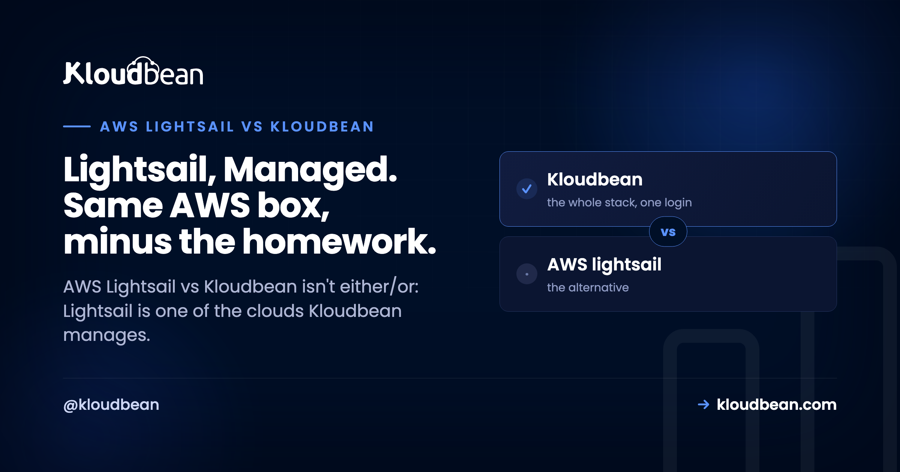
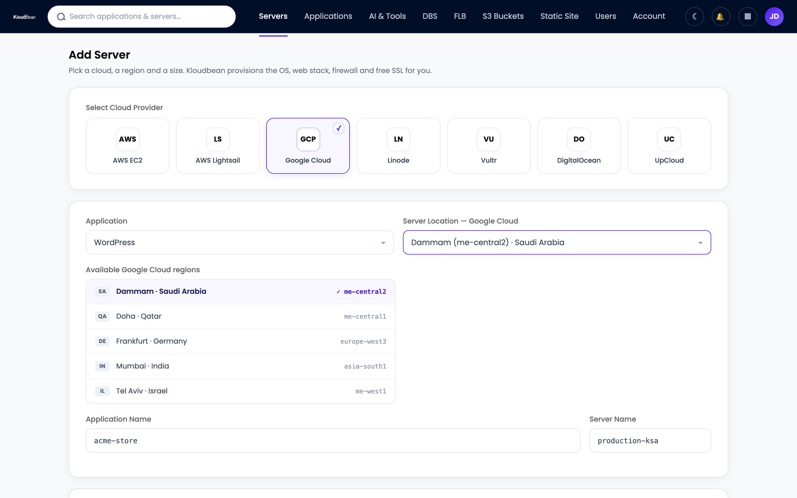
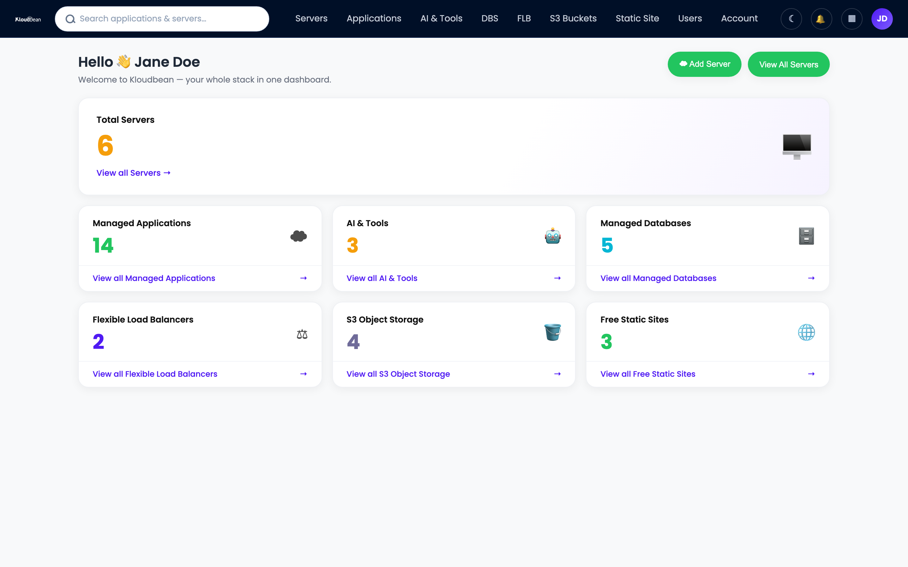

# AWS Lightsail vs Kloudbean: Raw VPS or a Managed Stack?

*By Kloudbean · Lightsail, Managed. Same AWS box, minus the homework.*



Search AWS Lightsail vs Kloudbean and you'll get a wall of head-to-head tables that quietly miss the point. These two aren't the same kind of thing. Lightsail is a cloud, a simplified VPS from AWS. Kloudbean is a management layer that runs on top of a cloud, and Lightsail happens to be one of the seven it supports. So the real question isn't which company wins. It's whether you want a raw Lightsail box you patch and babysit yourself, or that same box with a managed stack handling the boring parts.

> **Short answer**
>
> AWS Lightsail vs Kloudbean isn't a fair fight, because they solve different jobs. Lightsail gives you a simple, predictably priced Linux VPS inside AWS. Kloudbean is a managed layer that can provision and run a full stack on Lightsail (or six other clouds) from one dashboard, so the OS, web stack, SSL, firewall, backups, and deploys are handled while you keep your app. Want the cheapest box and you enjoy running servers? Raw Lightsail is great. Want to ship without becoming a part-time sysadmin? Let Kloudbean manage Lightsail for you.

## Hold on, is this even a fair comparison?

Most "X vs Y" hosting pieces pit two networks against each other. This one can't do that cleanly, because Kloudbean isn't a cloud. It's the layer that turns a bare virtual machine into a managed stack. And AWS Lightsail is literally one of Kloudbean's seven supported clouds, sitting right next to AWS, Google Cloud, Linode, Vultr, DigitalOcean, and UpCloud.

So a truer title would be "raw Lightsail vs Lightsail managed by Kloudbean." Same AWS hardware underneath. Different amount of work landing on you. That reframes the whole decision away from "whose cloud is better" and toward the question that actually matters: who does the ops? It's the same reframe we walked through for a droplet in [DigitalOcean vs Kloudbean](https://www.kloudbean.com/blog/digitalocean-vs-kloudbean/), just with Amazon's simple VPS in the base.

## What AWS Lightsail actually is

Let's give Lightsail its due, because it earned it. Lightsail is AWS's simplified VPS. You get fixed monthly bundles that roll compute, storage, and a data transfer allowance into one predictable price, a console that's far friendlier than raw EC2, and one-click blueprints for common setups like WordPress, LAMP, or Node.js. If EC2's pricing dials and IAM knobs make your eyes glaze over, Lightsail is AWS with the sharp edges filed down. It's simple, the pricing is predictable, and it rides on Amazon's network. That's a genuinely good starting point, and I won't pretend otherwise.

But "managed" has a ceiling here, and it's worth being precise about where. Is Lightsail managed? At the infrastructure level, sort of. Amazon keeps the hardware and the hypervisor healthy. At the stack level, not really. Lightsail hands you a running VM and maybe a blueprint, then it steps back. From that moment on, a long list of jobs is yours.

- OS patching and version upgrades, forever, not just on day one.
- Web server and runtime config (nginx, PHP-FPM, Node, whatever your app needs).
- Security hardening beyond the basics: firewall rules, fail2ban, locking down SSH.
- SSL certificates and the renewal that everyone forgets until the site throws a warning.
- A real backup routine. Snapshots exist, but remembering to take them, and testing that they restore, is on you.
- Every scaling decision, by hand.

A fresh Lightsail instance is a bare Linux box. The first hour looks less like building your product and more like a chore list:

```bash
# a new Lightsail instance is an empty Linux box. rough first hour:
sudo apt update && sudo apt upgrade -y
sudo ufw allow OpenSSH
sudo ufw allow 'Nginx Full'
sudo ufw enable
sudo apt install -y nginx php-fpm mysql-server
sudo certbot --nginx -d yourdomain.com   # and set a reminder to renew it
```

If server work is your thing, that's satisfying. If it isn't, it's a wall between you and a running app. That gap, between "here's a VM" and "here's a healthy production stack," is the whole story of this comparison.

> **Diagram: Who owns the stack, layer by layer.** A single vertical tower, identical for raw Lightsail and for Kloudbean, from an AWS Lightsail VM at the base up through OS and security patching, web server and runtime stack, SSL and renewal, firewall and hardening, automatic backups, deploy pipeline and monitoring, and your app, code and data at the top. On raw Lightsail, everything above the VM is yours. With Kloudbean managing it, the operations layers are handled and your job shrinks to the top box: your app and your data.

## AWS Lightsail vs Kloudbean: who owns what

Neither column below is wrong. The left is what you sign up for with a raw Lightsail instance, and plenty of developers run it well and enjoy it. The right is what a managed layer folds into the plan. Same job, different owner. Here's the same Lightsail box run two ways.

| The job | Raw AWS Lightsail | Kloudbean managing Lightsail |
| --- | --- | --- |
| OS + security patching | You, indefinitely | Handled |
| Web stack setup | You install and tune it | Provisioned for you |
| SSL + renewal | You run certbot, and remember to renew | Free SSL, auto-renewed |
| Firewall + hardening | You configure it | Shorewall + Fail2ban baseline |
| Backups | Snapshots exist, the discipline is on you | Automatic backups |
| Managed databases | Install and secure yourself | One-click: MySQL, MariaDB, PostgreSQL, Redis, Memcached, Elasticsearch, MongoDB |
| Object storage | Wire up S3 as a separate thing | Built-in S3-compatible buckets, plus managed GCS |
| Load balancing | Lightsail load balancer, configured by you | Built-in Flexible Load Balancer, on when you need it |
| Deploys | SSH, scripts, or your own CI | Connect a Git repo, build and deploy on push, live logs |
| Dashboard scope | One VM (or a few) per AWS account | Servers, apps, databases, storage, load balancers, one login |
| Cloud choice | AWS only | 7 clouds, move without relearning |
| Best for | Hands-on folks who want the cheapest box | Teams who'd rather ship than administer |

Notice there are no prices or region counts in that table. Those change, and Lightsail's bundle prices are their own thing. The point isn't the sticker. It's which of those two lists you want to own.


*Adding a server in Kloudbean. Pick your cloud (AWS Lightsail sits right there among the seven providers) and a region, then Kloudbean provisions the OS, stack, firewall, and free SSL. Same Lightsail box underneath, managed for you.*

<!-- ADD IMAGE: The AWS Lightsail bundle picker in the AWS console, next to Kloudbean's Add Server screen, so readers see both sides fairly. -->

## Does Kloudbean actually run on AWS Lightsail?

Yes. When you add a server, choose AWS Lightsail as the cloud provider, pick a size and a region, and Kloudbean builds a managed stack on that Lightsail instance. You're renting the same Amazon box you'd get by going direct. The difference is what shows up on top of it.

What does "managed" mean here, concretely? Kloudbean runs the server, the web stack, SSL, patching, and backups. You own your application code and your data. That boundary is the important bit, so I'll be blunt about it: this is not a black box that hides your app from you. It's your app, on a standard Linux server, that someone else keeps healthy. If you want the longer version, we spell it out in [what a managed server actually is](https://www.kloudbean.com/blog/what-is-a-managed-server/).


*One dashboard for the whole stack: servers, applications, managed databases, object storage, and load balancers, whatever cloud they sit on. This is the Lightsail control panel experience most people actually wanted.*

## What the managed layer adds on top of Lightsail

Provisioning is the part everyone compares, and it matters least six months in. What you get with the managed layer is a set of things that would otherwise be separate chores or separate products. All of this rides on the same Lightsail instance:

- **Managed databases, one click.** MySQL, MariaDB, PostgreSQL, Redis, Memcached, Elasticsearch, or MongoDB, with backups and controlled access, instead of installing and securing a database engine by hand. Here's [how to add one to your app](https://www.kloudbean.com/blog/add-managed-database-to-your-app/).
- **Built-in object storage.** S3-compatible buckets with public or private access, plus managed Google Cloud Storage, managed from the same dashboard.
- **A built-in load balancer.** The Flexible Load Balancer is available on every account. It's off by default, and you enable it when traffic asks for it.
- **Managed CI/CD from Git.** Connect a repo, and every push builds and deploys, with the build logs streaming live in the console. No hand-rolled deploy script.
- **Staging, backups, and team controls.** Staging sites for WordPress and Laravel, automatic backups (more in the [backups guide](https://www.kloudbean.com/blog/server-backups-guide/)), free auto-renewing SSL, a Shorewall and Fail2ban baseline, plus subusers and per-resource User Access Control.

And it isn't just a PHP or WordPress box. You can run WordPress, WooCommerce, Laravel, Magento, Drupal, and Joomla on PHP; Express, React, Vue, and Angular on Node; Flask, Django, and FastAPI on Python; plus Ruby, Java, free static sites, and one-click apps like n8n and Supabase. So "run WordPress on Lightsail" and "run Laravel or Node on Lightsail" both point at the same managed setup. If WordPress is your whole world, the [managed WordPress hosting](https://www.kloudbean.com/blog/managed-wordpress-hosting/) angle covers it in depth.

There's one more thing a raw Lightsail box can't give you: you're not married to AWS. Because Kloudbean runs on seven clouds, you can start on Lightsail today and move the same setup to DigitalOcean, Google Cloud, Linode, Vultr, or UpCloud later, behind one console, without relearning everything. You keep Lightsail if you love it. You keep the exit if you don't. That's a big part of what makes a real [managed cloud host](https://www.kloudbean.com/blog/best-managed-cloud-hosting/) worth the money.

<!-- ADD IMAGE: A simple diagram or screenshot of an app, a managed database, and object storage all running on one Lightsail-backed server. -->

## When raw Lightsail is enough, and when the managed layer pays off

This is a real decision, not a setup for a sales pitch, so here's the honest split.

Raw Lightsail is the right call when you're comfortable on the Linux command line, you want the cheapest predictable box, and running the server is part of the project or you simply enjoy it. A single low-traffic site you personally tend to? Raw Lightsail is plenty. If your time is cheaper than your budget, going direct is a fine, honest answer, and you don't need a managed layer at all.

The managed layer pays off when your time is worth more than the sysadmin toil, when you're running something that can't casually go down, when you want databases, storage, and load balancing without stitching them together yourself, or when you deployed something out of Cursor, Lovable, or Bolt and the last thing you want is to learn nginx just to get it live.

Here's where I'll take a side. The trap almost nobody warns you about isn't choosing Lightsail. It's choosing Lightsail and then treating it like it's managed. Set up once, patched never, "I'll sort out backups later." I've watched that story end the same way more than once: an SSL cert that expired on a Sunday, a disk full of logs nobody rotated, a snapshot nobody ever tested restoring. Boring failures, every one, and invisible right up until they aren't. If the server is just where your product happens to live, paying so you never think about the patch cadence is usually the better trade. We argue that at more length in [managed vs unmanaged hosting](https://www.kloudbean.com/blog/managed-vs-unmanaged-hosting/), where the real cost of an unmanaged box gets its own math.

## The honest limits

Kloudbean runs Linux web stacks: PHP, Node, Python, Ruby, Java, and their databases, with frameworks like WordPress, Laravel, Django, React, and Vue. It isn't for Windows, .NET, or IIS. "Managed" means Kloudbean runs the server, stack, SSL, patching, and backups, while you keep your application and your data. And a fair word on scaling: autoscaling and Kubernetes are enterprise and custom options, not something that quietly kicks in on a standard plan. On a standard server you resize when you need more, so don't expect your app to scale itself automatically. Compliance is shared too: the platform provides the infrastructure controls, and you own the app-level side.

Because it's standard Linux and standard code underneath, none of this locks you in. You can move to a raw Lightsail box you manage yourself, or to any other host, whenever you want. The exit door is part of the design.

---

**Keep Lightsail's simple box. Drop the sysadmin homework.**

Run a managed stack on AWS Lightsail (or six other clouds) at [kloudbean.com](https://www.kloudbean.com/). One dashboard, one-click managed databases, a built-in load balancer, automatic backups, free SSL, simple Git deploy, free migration, and a free trial. Standard plans start from $8/mo, with custom Enterprise pricing on request. Check current numbers on [pricing](https://www.kloudbean.com/pricing/).

## FAQ

**Is AWS Lightsail managed?**
Partly. At the infrastructure level, AWS keeps the hardware and hypervisor healthy. At the stack level, no: once your instance is running, OS patching, web server config, security hardening, SSL renewal, and backups are all your responsibility. That's the gap a managed layer like Kloudbean fills.

**Can I run WordPress on AWS Lightsail?**
Yes. Lightsail has a WordPress blueprint that gets a site running quickly, and you can also run WordPress on a Lightsail box managed by Kloudbean. With the managed route you get free auto-renewing SSL, automatic backups, staging, and a managed database without setting each one up by hand.

**What is the difference between AWS Lightsail and Kloudbean?**
Lightsail is a cloud, a simplified VPS from AWS. Kloudbean is a management layer that runs on top of a cloud, and Lightsail is one of the seven clouds it supports. So they're not direct rivals. The real comparison is running Lightsail raw and doing the ops yourself versus having Kloudbean manage the stack on that same Lightsail box.

**Does Kloudbean run on AWS Lightsail?**
Yes. When you add a server, pick AWS Lightsail as the cloud provider, choose a size and region, and Kloudbean provisions a managed stack on that Lightsail instance. You get Amazon's box underneath with Kloudbean's managed experience (one-click deploy, managed databases, free SSL, automatic backups) on top.

**Is AWS Lightsail cheaper than Kloudbean?**
On sticker price, usually, because with raw Lightsail you supply the setup and maintenance labor yourself. A managed plan costs a bit more and does that work for you. The right answer depends on whether your time or your budget is tighter, and on how much you enjoy running servers. Standard Kloudbean plans start from $8/mo, so verify current pricing on the pricing page.

**Is Kloudbean an AWS Lightsail alternative?**
It's more of a layer on top than a straight alternative, since Kloudbean can manage Lightsail itself. If you're looking for a Lightsail alternative because you want the box managed for you, or you want the freedom to move across seven clouds, that's exactly what the managed layer provides.

**Can I run Laravel or Node on Lightsail with Kloudbean?**
Yes. Kloudbean supports PHP frameworks like Laravel, Node runtimes like Express with React, Vue, or Angular, Python with Flask, Django, and FastAPI, plus Ruby and Java. You deploy from a Git repo and it builds on every push, whatever cloud the server runs on, Lightsail included.

**When should I use a managed layer instead of raw Lightsail?**
Use a managed layer when your time is worth more than the sysadmin toil, when the app can't casually go down, or when you want databases, storage, and load balancing without assembling them yourself. Stick with raw Lightsail when you're comfortable administering a server, want the cheapest box, and will actually keep up with patching and backups.

**Can I move off Lightsail later without relearning everything?**
Yes. Because Kloudbean runs on seven clouds, you can start on Lightsail and later move the same managed setup to DigitalOcean, Google Cloud, Linode, Vultr, or UpCloud from one console. And since it's standard Linux and standard code, you're never locked in.

**Does Kloudbean auto-scale my Lightsail app?**
Not on a standard plan. Autoscaling and Kubernetes are enterprise and custom options, so a normal server doesn't scale itself automatically. On standard plans you resize the server when you need more capacity, or talk to the team about a custom setup for heavier workloads.

*By Kloudbean · Lightsail, Managed.*
