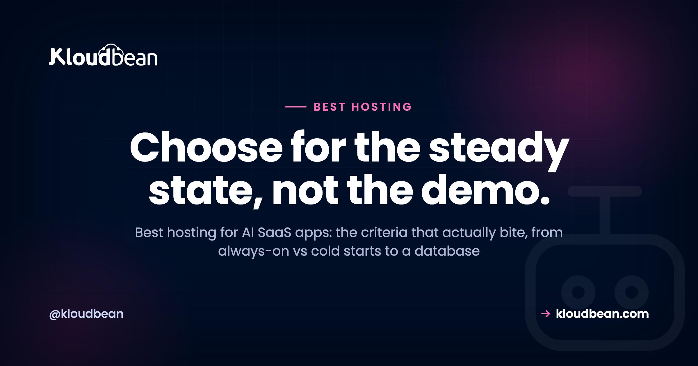

# Best Hosting for AI SaaS Apps: What Actually Matters

You've got an AI SaaS. A RAG app, an agent, a tool that wraps a model and charges for it. It runs fine on your laptop. Now you need to pick hosting for it, and every provider's landing page swears it's the one. This is a buyer's guide to the best hosting for an AI SaaS, built around the criteria that actually bite once real users show up, not the ones that photograph well on a pricing page.

The trap is choosing on the sticker price or the logo you recognise, then discovering the thing you needed was somewhere in the fine print. So we'll do it the other way round. First the criteria, and why each one hurts if you get it wrong. Then the three real ways to host an AI SaaS, compared fairly. Then a plain decision tree for which fits you. If you want the wider map of what breaks between a working preview and a real product, the [last mile of vibe coding](https://www.kloudbean.com/blog/last-mile-of-vibe-coding/) covers that; this page stays in the buyer's-guide lane.

> **The short version:** The best hosting for an AI SaaS keeps your app always-on so no paying user eats a cold start, keeps your data in a managed database that survives every redeploy, and keeps the database, vector search, cache, and files close together so you're not paying egress between vendors or juggling five bills. Match it to your stage: serverless for the frontend and spiky work, a DIY VPS if you enjoy running servers, managed cloud once the SaaS is steady.

## What actually matters when you pick AI SaaS hosting

Here's the honest answer up front: the criteria that decide whether an AI SaaS is happy in production are always-on behaviour, a database that outlives your deploys, a place for vector search, a fast layer, somewhere real for files, a sane story on data-transfer cost, safe secrets, background jobs, backups, and how many separate consoles you end up signing into. Feature checklists rarely mention most of that. Your users feel all of it.

Read the table below as a shopping list. For each row, the middle column is the part nobody warns you about, and the right column is the question to ask a provider before you commit. If a host can't answer one cleanly, that's your signal.

| What to check | Why it bites | The question to ask |
| --- | --- | --- |
| Always-on vs cold starts | A host that sleeps makes the first request after idle slow, right when a new user is judging you | Does my app stay warm, or scale to zero between requests? |
| Managed database | SQLite or in-memory data gets wiped on redeploy, and your users go with it | Does the database run outside my app process and survive deploys? |
| Vector search | RAG and semantic search need embeddings stored somewhere queryable | Can I run pgvector in Postgres, or do I need a separate vector product? |
| A fast layer (Redis) | Sessions, rate limits, and caching need millisecond reads, not a round trip to Postgres | Is managed Redis available next to my app? |
| Object storage | Uploads and generated files can't live on the app's disk, which vanishes on redeploy | Is there S3-compatible storage, and how is data-transfer-out priced? |
| Egress / data transfer | Moving bytes between separate vendors is metered and adds up quietly | What do I pay to move data out, and between my own services? |
| Secrets handling | A leaked API key on a paid model is a direct hit to your wallet | Where do env vars live, and do they ever reach the browser? |
| Background jobs | Embedding a document or sending a batch can't finish inside a web request | Can I run a worker process beside the app? |
| Backups | The day you need a restore, you find out if backups were real | Are backups automatic, and have I tested a restore? |
| Consoles and bills | Every extra vendor is another dashboard, another invoice, another 2am login | How many separate products am I actually signing up for? |

## Always-on vs cold starts, the criterion that bites first

An AI SaaS wants an always-on process. That's the single criterion I'd weight highest, because it's the one your users feel on their very first click. A host that scales to zero saves money while nobody's around, then charges a cold-start tax: the first request after an idle period has to wake the process up, reopen database connections, and only then start working. For a landing-page visitor deciding whether to trust you, that pause is expensive in a way no invoice shows.

AI workloads make it worse than average. Model calls are already slow, so you have no spare latency budget to donate to a cold start. Streaming a reply wants a stable process on the other end, not one that might spin down mid-response. And every wake-up rebuilds the connection pool to your database, which is exactly the wrong time to be doing it. If you're hosting anything conversational, the request path in [how to host an AI chatbot in production](https://www.kloudbean.com/blog/host-ai-chatbot-in-production/) shows why a warm process matters even more there.

Serverless isn't wrong, to be clear. It's a good fit for spiky, occasional work and for the frontend. It's just a poor default for a steady backend that holds sessions and talks to a database on every request. More on that split in the comparison below.

Practically, this is why the managed-cloud shape suits an AI backend. On Kloudbean your Node or Python app runs as a long-lived process on a server you sized yourself, so there's nothing to wake up, and PM2 lets you run a second process beside the web app for the queue worker you'll need by week three.

## A database that survives every redeploy, and where vector search lives

Your data belongs in a managed database that runs outside the app. This is the most common way an AI SaaS loses real user data, and it's entirely avoidable. AI builders love to scaffold a project on SQLite or an in-memory array because it's the fastest thing that works on a laptop. It keeps working right up to your first redeploy, when the file the app was writing to gets replaced along with the code, and every account, conversation, and upload disappears. A managed database lives in its own place, so shipping new code only ever changes code. Start with [adding a managed database to your app](https://www.kloudbean.com/blog/add-managed-database-to-your-app/), and if this pattern already caught you, [why AI apps fail in production](https://www.kloudbean.com/blog/why-ai-apps-fail-in-production/) walks through the whole failure class.

Then there's the AI-specific bit: vector search. If your SaaS does retrieval, semantic search, or a recommendation feature, you need somewhere to store and query embeddings. The good news is you probably don't need a separate vector database on day one. The `pgvector` extension stores embeddings right inside Postgres, next to your normal data, which keeps the stack to one database instead of two. Check that pgvector is available on the plan you're considering, since not every managed Postgres enables it. When it's there, one database covers both your app tables and your vectors, and that's one fewer console, one fewer bill, and one fewer thing to keep in sync.

Check how the host launches that database, because it decides how much of this is your problem. Kloudbean runs seven managed engines as their own service next to the app (Postgres, MySQL, MariaDB, MongoDB, Redis, Memcached, Elasticsearch), each with automatic backups, and you lock one down by whitelisting your app server's IP so nothing else can connect. A redeploy touches the app and never the data, which is the whole point.

<!-- ADD IMAGE: launch-database console screenshot (one-click managed Postgres), src -> ../assets/console/launch-database.png -->

## The supporting cast: a fast layer, files, jobs, secrets, backups

Around the database sit four pieces most AI SaaS apps need, and they're worth checking for before you pick a host rather than after.

- **A fast layer.** Redis is where sessions live, where rate-limit counters tick, and where you cache repeated answers so an identical prompt doesn't pay for a fresh model call. It's the difference between a snappy app and one that hammers Postgres for work it shouldn't. [Managed Redis hosting](https://www.kloudbean.com/blog/managed-redis-hosting/) covers the setup.
- **Object storage.** User uploads, generated images, PDFs, and export files go in S3-compatible object storage, never on the app server's disk. That disk is temporary and gets wiped on redeploy, same as an SQLite file. Storage also raises the egress question, which we'll get to.
- **Background jobs.** Ingesting a document, building embeddings, or sending a batch of email can't finish inside the few seconds a web request should take. That work belongs in a queue with a worker running beside the app. An always-on host makes this simple, because you can run a persistent worker process; a scale-to-zero one fights you on it.
- **Secrets and backups.** Your model keys belong in server-side environment variables that never reach the browser, and your database needs automatic backups you've actually tested restoring. Both are boring until the day they're the only thing that matters.

## The costs that hide: egress and how many consoles you juggle

Two line items almost nobody prices at signup, and both can dwarf the monthly sticker: egress, and operational sprawl. Egress is data-transfer-out, and most clouds meter it per gigabyte. It's easy to ignore until your SaaS serves files, streams a lot of model output, or shuffles data between services that happen to live on different providers. Every byte crossing a provider boundary can be billable.

Which leads straight to the anti-pattern I see most: the five-vendor AI SaaS. App on one platform, Postgres on another, a vector database on a third, Redis on a fourth, file storage on a fifth. It feels modular and clever. It bills like a taxi meter with the engine running. Every service is a separate console to learn, a separate invoice to reconcile, and a separate status page to check when something's slow, and a request that hops between them can pay egress for the privilege. Debugging one slow endpoint means five browser tabs. The convenience you bought at signup becomes the tax you pay every month and every incident.

You don't fix that by buying the cheapest of each. You fix it by keeping the pieces close, ideally in one place, so data moves over a local network instead of the public internet, and so there's one dashboard and one bill. That's a real, checkable advantage, not a vibe. Some object storage doesn't meter egress at all, which quietly removes one of the scariest variable costs from the equation. Kloudbean's own built-in S3-compatible buckets are in that group: data-transfer-out isn't metered on them. Read that narrowly, since it's about those buckets, not a platform-wide promise about every byte your app ever sends.

## The three ways to host an AI SaaS, compared

Strip away the brand names and there are three real approaches. Here's each one honestly, including who it genuinely suits.

| Approach | Best at | Where it strains for an AI SaaS | Who it suits |
| --- | --- | --- | --- |
| Serverless / PaaS | Frontends, edge functions, spiky or occasional traffic | Cold starts, execution-time limits on long AI calls, and you still bolt the DB, vectors, Redis, and files on elsewhere | Frontend-heavy apps; early prototypes; teams that want zero server management |
| DIY VPS | Full control, lowest sticker price, run anything you like | You own patching, security, the database install, pooling, monitoring, backups, and the pager | Teams with ops skill and time, or a need for total control |
| Managed cloud | The whole stack in one place, always-on, managed data services | Less low-level control than a raw box; you work within the platform's shape | A steady AI SaaS that wants one dashboard and predictable ops |

On the serverless and PaaS side, the tools are genuinely good at what they're for. Vercel is built for frontends and edge functions and deploys them with very little fuss. Netlify sits in the same lane, strong on static sites and functions. Render and Railway both make a first backend deploy quick behind a friendly dashboard, with add-on databases a click away. Where they strain for an AI SaaS is the same story each time: the backend scales to zero, function execution has time limits that fight long model calls and streaming, and the moment you need a durable database, vector search, Redis, and file storage, you're assembling them across services and back to several bills with egress between them.

The DIY VPS is the honest opposite. You rent a raw box, you get the cheapest headline price and total control, and some engineers genuinely enjoy running their own server. The catch is that everything becomes your job: OS patching, firewall rules, installing and tuning Postgres, connection pooling, SSL renewal, monitoring, backups, and being the person who gets paged at 2am. It's a real, ongoing job, not a one-time setup. Great if that's the work you want. Rough if you'd rather build the product.

Managed cloud is the middle path, and for a steady AI SaaS it's usually the right one: the app, database, cache, and storage in a single dashboard, running always-on, with the operational chores handled for you. You trade some low-level control for a lot less to juggle. That's the category Kloudbean sits in, alongside the other managed platforms.

## A decision framework: which one fits you

You can settle this with one honest question about what you're actually hosting, then one about how much of the running you want to own. The tree below is the short version.

<!-- ADD IMAGE: bespoke decision-tree SVG (What are you hosting? -> frontend goes serverless/PaaS; a stateful AI SaaS backend -> run ops yourself = DIY VPS, or manage it for me = managed cloud). Brand navy/purple/green. -->

And here's my one firm opinion for this whole page: once your AI SaaS has steady traffic, it wants an always-on managed setup, not serverless. Serverless earns its keep for the frontend and for spiky, bursty jobs. But a SaaS backend that holds sessions, hits a database on every request, streams model output, and runs background workers is the steady, connection-heavy case that serverless fights hardest and a managed always-on box handles most naturally. Start managed and always-on for the core, and reach for serverless at the edges where it shines. Not the other way round.

## The smallest setup that actually holds up

Whatever you pick, you need less than the five-vendor stack implies. Here's the minimum an AI SaaS can run on without setting a trap for itself, roughly in the order you'd add each piece.

1. **One always-on app server** holding your Node or Python process. Not scale-to-zero. This is the piece your first paying user judges.
2. **One managed database, living outside the app.** Postgres if you want `pgvector` to carry embeddings in the same place. MySQL or MariaDB are fine if your framework leans that way.
3. **Object storage for anything a user uploads.** The app server's disk isn't storage. It's scratch space that gets replaced.
4. **Redis, once sessions or rate limits exist.** Not before. Adding it early just gives you another thing to monitor.
5. **Automatic backups plus one restore you have personally done.** An untested backup is a hope, not a plan.

That's a short list and it carries most AI products a long way. On Kloudbean it's a handful of tiles behind one login: a server, one of the seven managed database engines, an S3-compatible bucket, Redis when you want it, with automatic backups and free SSL already on, Git deploys with live build logs, and free migration on servers above 4GB. The same list elsewhere is the same list, just spread over more invoices and more status pages. And a note on ambition: autoscaling and Kubernetes are Enterprise territory here, not a standard-plan toggle, so on a standard plan you grow by resizing the server up, which is self-serve.

Then the part hosting genuinely can't close, ours included. An endpoint that hands back another tenant's rows is your authorisation logic. A prompt-injection hole is your prompt design. A model bill that triples overnight is your missing rate limit. A query with no index will be slow on every provider on earth. Managed covers the server, stack, SSL, backups, and patching; the application and its data stay yours. Any host that pitches itself as the fix for that shorter list is selling, and you should read the rest of their page more slowly.

<!-- cta:start -->
**Prototype to production, without the babysitting.**

Move the whole thing onto a managed server you own: always-on processes, a managed database for real data, object storage for uploads, and Git deploys with live build logs.

- Managed databases
- Always-on processes
- Object storage
- Automatic backups
- Free SSL
- Git deploy
- Free migration

[Start free](https://console.kloudbean.com/register) · [See plans](https://www.kloudbean.com/pricing/)
<!-- cta:end -->

## FAQ

**What is the best hosting for an AI SaaS app?**
The one that keeps your app always-on, keeps your data in a managed database that survives redeploys, and keeps the database, vector search, cache, and files close together so you don't pay egress between vendors or juggle several bills. For a steady SaaS that usually points to managed cloud. Serverless suits the frontend and spiky work, and a DIY VPS suits teams who want full control and enjoy running servers.

**Is serverless good for an AI SaaS?**
It's great for the frontend and for spiky, occasional traffic, and less good as the default for a steady backend. Serverless scales to zero, so the first request after idle pays a cold-start delay, and function time limits fight long model calls and streaming. You also still need a durable database, Redis, and file storage bolted on elsewhere. Use it at the edges, not for the stateful core.

**Do I need a VPS or managed cloud for an AI SaaS?**
A DIY VPS gives you the cheapest sticker price and total control, but you own patching, security, the database, pooling, backups, and monitoring. Managed cloud handles those chores and puts the pieces in one dashboard, for less low-level control. Pick the VPS if you have ops skill and want control, and managed cloud if you'd rather spend your time on the product.

**Where should an AI SaaS store its database?**
In a managed database that runs outside your app process, so a redeploy only changes code and never touches your data. Postgres is a strong default. Avoid SQLite or in-memory storage in production, because both get wiped on the next deploy and take every account and record with them.

**Do I need a separate vector database for an AI SaaS?**
Usually not to start. The pgvector extension stores embeddings inside Postgres alongside your normal data, so one database covers both your app tables and your vectors. Check that pgvector is enabled on your plan. Add a dedicated vector store later only if scale genuinely demands it.

**What is egress and why does it matter for AI SaaS hosting?**
Egress is data-transfer-out, and most clouds meter it per gigabyte. It matters because an AI SaaS that serves files or streams a lot of output, or spreads its services across different providers, can rack up transfer charges quietly. Keeping your services close together, and using object storage that isn't metered for egress, removes a big variable cost.

**How much does it cost to host an AI SaaS?**
Most of the bill is usually the model API, priced per token, so it scales with usage. The infrastructure underneath, the server, database, cache, and storage, is a smaller and more predictable monthly cost, especially on flat pricing rather than usage-metered stacks. The costs that surprise people are egress and the sprawl of several separate vendor invoices.

**Can I host an AI SaaS built with Lovable, Bolt, or Cursor?**
Yes. The code these tools generate is normal Node or Python; it just needs a real home instead of a preview URL. Put it on an always-on host with a managed database, keep your keys in server-side environment variables, and give it a domain with SSL. The gaps AI builders leave are mapped in the last mile of vibe coding.

**How many separate services does an AI SaaS actually need?**
Fewer than the five-vendor sprawl suggests. Most need an app server, a managed database (with pgvector for retrieval), Redis for the fast layer, and object storage for files. That's it for a long time. Keeping those together in one platform means one console and one bill instead of a stack glued across providers.

**When should I move off serverless for my AI SaaS?**
When traffic goes from bursty to steady, when cold starts start hurting real users, or when connection limits and function timeouts get in the way of database work and long model calls. That's the point where an always-on managed setup is simpler and often cheaper than fighting the serverless model.

---

*Kloudbean · Choose for the steady state, not the demo.*
