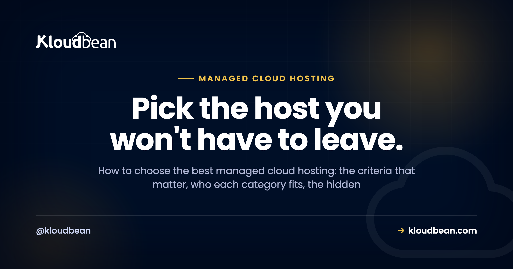

# Best Managed Cloud Hosting: A Buyer's Decision Framework

Search "best managed cloud hosting" and you'll get twenty listicles ranking the same ten brands, usually by whoever pays the biggest affiliate commission. That's not a decision framework. It's a leaderboard for a race you haven't defined.

The best managed cloud hosting isn't a single product. It's the one that fits your stack, your growth, and how much of the server you want to touch. So this page skips the rankings and hands you the framework instead: what "managed" actually covers, the criteria that separate a host you'll keep from one you'll flee in a year, who each category genuinely fits, and the costs and red flags nobody puts in the pricing table. We land on where Kloudbean fits, honestly, at the end. Read the middle first.

> **The short answer:** Managed cloud hosting is cloud infrastructure where the provider runs the server layer for you (provisioning, the stack, security patching, SSL, backups, monitoring) while you keep ownership of your app and data. The best one fits your stack, avoids lock-in, includes managed databases and real backups, hardens the server by default, and prices predictably instead of by surprise.

## What "managed cloud hosting" actually means (and what it doesn't)

Strip away the marketing and there are two layers to any hosting: the **server layer** (the operating system, the web stack, the firewall, SSL, patching, backups, the process that keeps your app alive) and the **app layer** (your code, your data, your users, your business logic). Managed cloud hosting means a provider owns the server layer so you can spend your time on the app layer. Unmanaged means the server layer is yours, all of it, forever.

Here's the distinction people miss: "managed" is a spectrum, not a checkbox. Some hosts manage the OS but leave you the stack. Some manage everything up to your application and hand you a deploy button. The word on the pricing page tells you almost nothing. What tells you something is a clear, written answer to one question: where does your job stop and theirs start? A host that can draw that line crisply is managing something real. A host that gets vague is selling you a VPS with a nicer logo.

And "cloud" matters too. Managed cloud hosting runs on real cloud infrastructure (the big providers' compute) rather than an oversold shared box. That's what gives you room to resize, add servers, and pick a region near your users. If you want the deeper split, [managed vs unmanaged hosting](https://www.kloudbean.com/blog/managed-vs-unmanaged-hosting/) takes it apart line by line.

## The two questions that decide everything

Before criteria, get oriented. Almost every hosting decision collapses onto two axes: how much operational work you're willing to do yourself, and how much control and ownership you want to keep. Plot the categories on those axes and the whole market makes sense at a glance.

<!-- Inline SVG in the HTML version: a 2x2 positioning chart. X-axis = ops work you do yourself (little to a lot). Y-axis = control & ownership you keep (low to high). Top-left quadrant highlighted green as "the sweet spot" where Managed cloud sits. Raw/unmanaged VPS top-right, Hyperscaler-direct mid-right, PaaS/serverless lower-left, Shared hosting bottom-left. -->

The chart carries the whole argument. Shared hosting is cheap but you own little and hit ceilings fast. A raw VPS gives you total ownership and hands you total responsibility with it. PaaS and serverless start fast but the backend is the platform's product, and the bill and the lock-in grow with you. Going direct to a hyperscaler is enormously powerful and quietly assumes you employ people to drive it. Managed cloud aims for the corner most teams actually want: your app and data are yours, on real cloud infrastructure, with the server chores handled. Now let's make that concrete.

## The criteria that separate the best managed cloud hosting

These are the things I'd weigh, roughly in the order they bite. Not every one matters to every team, so read them against your own situation rather than as a scorecard.

### The responsibility split, in writing

This is criterion zero, the one that predicts the most regret. A good managed host can tell you exactly what they handle and what stays yours. Patching, firewall, SSL, backups, monitoring on their side; your code, your data, your access rules on yours. When that line is fuzzy, you find out where it really sits during your first incident, which is the worst possible time. Ask for it plainly before you commit.

### Cloud choice and lock-in

Being able to pick your cloud provider (and move between them) is worth more than it looks on day one. It matters for latency (put the server near your users), for cost (providers price differently), and for resilience (a host that only resells one cloud can't help you when that cloud's region has a bad week). More importantly, it's insurance against the thing that quietly traps you: an architecture so wedded to one vendor's proprietary services that leaving means a rewrite. Favor hosting that runs standard Linux and standard databases you could pick up and move. That portability is the difference between a host you choose to stay with and one you're stuck with.

### Managed databases

Your app's data is the part you least want to hand-administer and least want to lose. A serious managed host offers managed database engines (provisioned, secured, backed up, one click) rather than making you install and babysit a database on the app server. Check which engines they run, whether backups are automatic, and whether the database can sit off the public internet. This is often where "managed" gets thin, so it's a good test of how real theirs is. The full picture is in [adding a managed database to your app](https://www.kloudbean.com/blog/add-managed-database-to-your-app/).

### Backups you can actually restore

Everyone says they do backups. Fewer can show you a restore. The questions that matter: are backups automatic, are they kept off the box they're backing up (a backup on the same disk is not a backup), and can you actually restore one without a support ticket and a prayer? An untested backup is a rumor. If a host is casual about this, treat it as a red flag, because data loss is the one mistake you can't walk back.

### A security baseline that's on by default

Security you have to remember to turn on is security you'll forget. Look for hardening that ships with the server: a firewall, brute-force banning, free auto-renewing SSL, isolation between sites, and the database kept off the public internet. Extra layers (an edge network, a WAF, add-on scanning) are nice, but the baseline is what protects you on a random Tuesday when you're not thinking about it. A host that hardens by default has done this before.

### Support that owns the server layer

When something breaks at the server level, you want the people who run the server to fix it, not a queue that tells you to contact your developer. The value of managed hosting is precisely this: the server layer is someone else's job, and when it wobbles, they're on it. Judge support on whether it's technical and whether it actually owns the infrastructure, not on a badge. I'd take responsive, competent support that owns the stack over a wall of logos any day.

### Predictable pricing

The best-sounding price and the best price are often different numbers. Flat, predictable pricing lets you plan; metered pricing that spikes with a traffic burst or a busy month does not. This is where a lot of "cheap" hosting turns expensive, and it deserves its own look, which we gave it in [cloud hosting pricing explained](https://www.kloudbean.com/blog/cloud-hosting-pricing-explained/). The short version: know what a normal month costs, and know what a good month (lots of traffic) costs, before you sign anything.

### Migration help

The friction of moving is what keeps people on hosting they've outgrown. A host confident in its product will help you move in, often for free, with minimal downtime. Weigh that on the way in, because you'll want the same courtesy if you ever move on. A provider that makes leaving hard is telling you something.

## The categories of host, and who each one fits

With the criteria in hand, here's the honest fit for each category. There's no universally "best" one. There's the best one for your situation.

| Category | Best for | Watch out for |
|---|---|---|
| **Shared hosting** | Brochure sites, tiny blogs, the tightest budgets | Noisy neighbors, no root, hard performance ceilings |
| **Unmanaged VPS** | Engineers who want full control and to run their own ops | You own patching, security, backups, and the 2 a.m. page |
| **PaaS / serverless** | Front ends, prototypes, spiky or event-driven workloads | Cost at scale, lock-in, cold starts, a backend that isn't yours |
| **Managed cloud** | Products, agencies, and teams that want ownership without ops | You still own app-layer decisions (code, access, data model) |
| **Hyperscaler, direct** | Large orgs with a dedicated DevOps or platform team | Steep console, real staffing cost, surprise bills |

A useful gut check: if hosting is a cost center you want to think about as little as possible while still owning your app, managed cloud is built for you. If hosting *is* your craft and you enjoy it, an unmanaged VPS will make you happy. If you're shipping a weekend prototype and want a URL in ten minutes, a PaaS is the right first step, and you can graduate later. For the deeper unmanaged math, [the real cost of an unmanaged VPS](https://www.kloudbean.com/blog/the-real-cost-of-unmanaged-vps/) is worth a read before you pick "cheap."

## The costs nobody quotes you upfront

The sticker price is the beginning of the conversation, not the end. A few line items reliably surprise people, and the pattern is that they scale with your success, which is exactly when you can least afford a surprise.

**Egress.** Moving data out of many clouds costs money per gigabyte, and it's easy to ignore until you serve a lot of images or video. **Add-ons.** The base plan looks cheap until backups, monitoring, a CDN, and email are each a separate line. **Per-seat and per-project fees.** Some platforms charge by team member or by app, so growing your team or shipping a second project raises the bill without adding a single user to your product. **Scaling steps.** Metered platforms can jump sharply right when traffic is good news.

The anti-pattern to avoid: choosing on the headline monthly number alone. I've watched teams pick the cheapest tier, then pay triple once real usage arrived, and the "expensive" flat option would have been cheaper all along. Price the busy month, not the quiet one. And if a host bundles the things others charge extra for (backups, SSL, a load balancer, staging), count that as real savings, not a rounding error.

## Red flags when you're evaluating

Fast ways to thin the field. Any one of these should make you look harder, and a couple together should make you walk.

- **A vague responsibility split.** If they can't tell you where their job ends, you'll learn it during an outage.
- **Backups that aren't included or aren't restorable on your own.** Data loss is unrecoverable. This one isn't negotiable.
- **Single-cloud lock-in with proprietary glue.** If leaving means a rewrite, you don't own your architecture, they do.
- **Metered pricing with no ceiling.** Fine if you model it. Dangerous if you don't.
- **Support that punts server problems back to you.** That's the one thing you're paying a managed host to own.
- **No clear migration path in or out.** Easy in, impossible out, is a trap with a friendly face.

If you're comparing specific providers, the honest comparisons do this legwork: [Cloudways alternatives](https://www.kloudbean.com/blog/cloudways-alternatives/), [DigitalOcean vs Kloudbean](https://www.kloudbean.com/blog/digitalocean-vs-kloudbean/), and the myths worth ignoring in [managed cloud hosting myths](https://www.kloudbean.com/blog/managed-cloud-hosting-myths/).

## A criteria checklist you can screenshot

Everything above, condensed to a scorecard. Run any candidate host down the middle column and see how many "what good looks like" boxes it actually ticks.

| What to evaluate | Why it matters | What good looks like |
|---|---|---|
| Responsibility split | Predicts your worst-day experience | Named and documented, not vague |
| Cloud choice | Latency, cost, no lock-in | Multiple providers and regions |
| Managed databases | The data you least want to babysit | One-click, backed up, off the public internet |
| Backups + restore | Data loss is permanent | Automatic, off-box, self-serve restore |
| Security baseline | Protects you when you're not looking | Firewall + brute-force ban + free SSL by default |
| Support | Server problems must be theirs | Technical, responsive, owns the stack |
| Pricing model | Plan-ability, no nasty months | Flat and predictable, few metered surprises |
| Migration | Friction to arrive and to leave | Assisted, low-downtime, both directions |

## How Kloudbean performs against the checklist

Now the part where I'm allowed to have a horse in the race, held to the same checklist. Kloudbean is managed cloud hosting built around one idea: run your whole stack from a single dashboard, on infrastructure you own, without becoming your own sysadmin.

On **cloud choice**, you launch on any of seven providers: AWS, Amazon Lightsail, Google Cloud, DigitalOcean, Vultr, Akamai Linode, and UpCloud. Pick on price, pick on where your users are, and you're never captive to one vendor's bad week.

On **managed databases**, there are seven engines a click away: MySQL, MariaDB, PostgreSQL, Redis, Memcached, Elasticsearch, and MongoDB, each provisioned, secured, and backed up, kept off the public internet so scanners never see them.

On **security baseline**, every server ships hardened: a Shorewall firewall and Fail2ban brute-force banning configured automatically, free auto-renewing SSL, site isolation, and subusers with User Access Control so you grant exactly the access each person needs. For teams that want another layer, BitNinja is available as an added security option on the higher tiers. It's a real layer, not a headline; the baseline is what protects you by default.

<!-- ADD IMAGE: the UAC / subusers screen granting a teammate scoped, per-resource access without handing over the whole account. -->

On **the whole-stack story**, the single dashboard also runs a built-in Flexible Load Balancer (available on every account, enable it when you need it), S3-compatible and Google Cloud Storage object storage, static site hosting, and managed Git deploys with live build logs. Fewer vendors, one login, one bill.

<!-- ADD IMAGE: the Backups tab showing automatic backups with a restore point selected and the one-click restore action. -->

On **backups**, automatic backups are included, with daily automated backups and disaster recovery on the higher plans, and the data stays yours to export whenever you like. On **support**, you get responsive managed support that owns the server layer, so a server-level problem is genuinely their job, not a hand-off back to you. On **migration**, free migration assistance moves you in with minimal downtime, and because it's standard Linux and standard databases underneath, nothing traps you if you ever want to move on.

On **pricing**, standard plans start from $8/mo, which keeps a first project honest, and Enterprise is custom (contact sales) rather than a mystery number I'll invent here. Check the current figures on the [pricing page](https://www.kloudbean.com/pricing/) before you plan around them. For enterprises and government teams, the platform also offers the heavier machinery, Kubernetes, autoscaling, private VPC networking, and an immutable audit trail, as managed or custom setups, effectively acting as an in-house infrastructure team.

Run Kloudbean down the checklist and it ticks the boxes that matter for a team that wants to own its app without running a server. It won't be the right pick for someone who wants a pure serverless event platform, or who needs a Windows and .NET stack. That's the honest edge of the fit. If you want the head-to-heads, see [Kloudbean vs Cloudways](https://www.kloudbean.com/blog/kloudbean-vs-cloudways/) and, when you're choosing whether to resell, [reseller hosting vs managed cloud](https://www.kloudbean.com/blog/reseller-hosting-vs-managed-cloud/). And once you've picked a host, [how to deploy an app](https://www.kloudbean.com/blog/how-to-deploy-any-app/) gets you live.

## What this hosting model still leaves to you

Two caveats, because a buyer's guide that only flatters one option isn't a guide. Managed cloud is Linux territory: Node, PHP, Python, Ruby, Java, Go, and the frameworks on top, plus WordPress and the usual databases. It isn't the home for a Windows-only, IIS-and-SQL-Server application as-is. And "managed" is a division of labor, not a magic wand: the platform runs the server layer, you still own your application, your access decisions, and your data model. On compliance, treat it as shared responsibility. The platform provides infrastructure controls and continues to mature its posture; your application-level compliance is still yours to own, and no honest host should hand you a "certified and done" story for your app.

---

**Own your app. Skip the sysadmin job.** Kloudbean is managed cloud hosting for people who want the whole stack in one dashboard on infrastructure they own. Start at [kloudbean.com](https://www.kloudbean.com/); check current plans on [pricing](https://www.kloudbean.com/pricing/).

Seven clouds · Seven managed databases · Built-in load balancer · Automatic backups · Firewall + free SSL by default · Free migration · Free trial

## FAQ

**What is the best managed cloud hosting?**
There's no single winner, because "best" depends on your stack, your growth, and how much of the server you want to touch. The best managed cloud hosting for you is the one that fits your framework, lets you pick your cloud (so you're not locked in), includes managed databases and restorable backups, hardens the server by default, and prices predictably. Score candidates against those criteria rather than trusting a ranked list.

**What's the difference between managed and unmanaged cloud hosting?**
Managed means the provider owns the server layer: the OS, the stack, patching, firewall, SSL, backups, and keeping your app alive. Unmanaged means all of that is yours. Unmanaged is cheaper on the invoice and far more expensive in your time and risk. Managed cloud is the middle: you keep ownership of your app and data while the server chores are handled for you.

**Is managed cloud hosting worth the money?**
If your time is worth more than the price difference, yes, and for most teams it is. The real cost of an unmanaged server isn't the monthly fee, it's the hours spent patching, configuring, and firefighting, plus the risk of getting security or backups wrong. Managed hosting converts that unpredictable time-and-risk into a predictable bill. If hosting is your craft and you enjoy running it, unmanaged can be worth it instead.

**How much does managed cloud hosting cost?**
It varies widely by provider and server size. On Kloudbean, standard plans start from $8/mo, with Enterprise priced custom through sales. The number to plan around isn't the sticker price, it's the cost of a busy month once you add backups, a CDN, and scaling. Always confirm current pricing on the provider's pricing page before you commit.

**Does managed cloud hosting lock me in?**
It can, if the platform ties you to proprietary services that make leaving a rewrite. To avoid it, favor hosting that runs standard Linux and standard databases, and that lets you choose (and move between) cloud providers. Kloudbean runs seven clouds and standard stacks specifically so nothing traps you. A host that makes leaving hard is telling you something.

**Which cloud providers can I use?**
That depends on the host. Many managed platforms resell a single cloud. Kloudbean supports seven: AWS, Amazon Lightsail, Google Cloud, DigitalOcean, Vultr, Akamai Linode, and UpCloud, so you can choose on price and on proximity to your users. Multi-cloud choice also protects you if one provider's region has a bad day.

**Do managed hosts handle backups and security for me?**
A good one handles the server-layer parts: automatic backups, a firewall, brute-force banning, free SSL, and isolation, ideally on by default. You still own the app layer: your code, your access rules, your data. Check that backups are automatic, kept off the box, and restorable by you, and that the security baseline ships turned on rather than as an add-on you have to remember.

**Managed cloud hosting vs a PaaS like Heroku or Render, which should I pick?**
A PaaS is fastest to a first URL and great for front ends and prototypes, but the backend is the platform's product and the pricing and lock-in grow with you. Managed cloud gives you ownership of your app and data on real infrastructure, with the server handled. Start on a PaaS if you want speed today; move to managed cloud when you want to own the thing and control the bill.

**Can I run my whole stack on one managed host?**
Yes, and consolidating usually saves money and headaches. On a platform like Kloudbean, one dashboard runs your servers, apps, managed databases, object storage, a load balancer, and static sites, with one login and one bill. Fewer vendors means fewer places for something to fall through the cracks, and it's simpler to reason about than a stack scattered across five services.

**How do I migrate to a managed cloud host without downtime?**
Plan the cutover: set up the new environment, sync your data, test on the new host, then switch DNS once it's verified. Many managed hosts, Kloudbean included, offer free migration assistance to do this with minimal downtime. The key is testing on the destination before you flip the domain, so users never hit a half-migrated site.

---

*Kloudbean · Pick the host you won't have to leave.*
