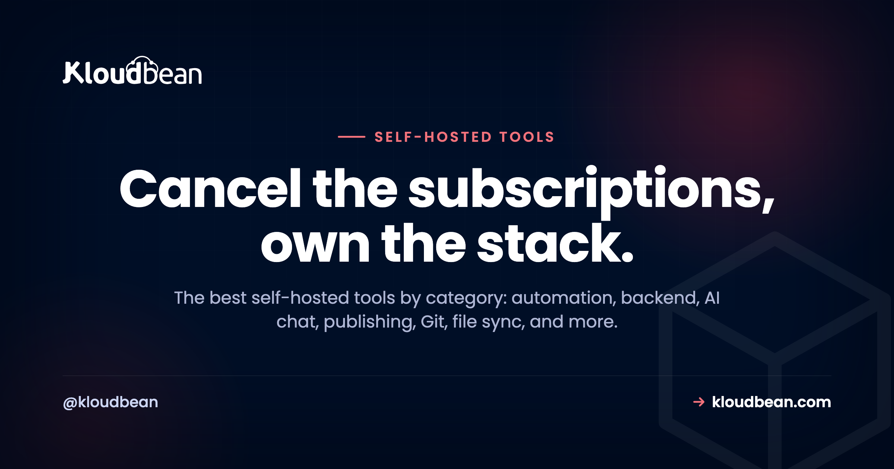

# The Best Self-Hosted Tools, Sorted by What They Replace

Add up your monthly software bills. The automation tool. The database service. The analytics. The status page. The AI chat. Each one felt small at signup. Together they're a number that makes you wince.

Most of those tools are open source, which means you can run them yourself. This is the hub for the best self-hosted tools worth owning, grouped by the SaaS bill each one kills. For every tool: what it replaces, roughly how much server it wants, and whether it's a one-click install on Kloudbean or something you run as a normal app. No ranking theater. Pick the category that annoys your wallet most and start there.

> **The short version:** The best self-hosted tools cover automation (n8n), a full backend (Supabase), private AI chat (Ollama plus Open WebUI), LLM building (Langflow), publishing (Ghost), Git and DevOps (GitLab), file sync (Nextcloud), and design (Penpot), plus lighter picks like Plausible, Uptime Kuma, and Vaultwarden. Most are light enough to share one server. GitLab and local AI are the two that want their own box.

## What self-hosting actually buys you, and what it costs

Let's be straight about the trade before the list. Self-hosting buys data ownership and a flat bill instead of per-seat creep. It also kills lock-in, because the data lives in a database you can export any time. The cost is ops: someone has to run the server and update the apps. That's the part managed hosting softens, since the platform keeps the machine, the stack, and SSL healthy while you look after the app on top. So the real question per tool isn't "can I self-host it," it's "is this one light enough to be worth owning?" For most of this list, yes. For a couple, only if you mean it.

```
How heavy is it?  Light tools share a box. Heavy ones want their own.

LIGHT  (~300 MB to 1 GB)        MEDIUM (~1 to 2 GB)          HEAVY (~4 to 8 GB+)
Uptime Kuma · Vaultwarden       Langflow · Supabase          GitLab
n8n · Ghost · Plausible         Nextcloud · Metabase         Local AI (Ollama)
  |------------------ several cohabit on one server ------------|  give it its own box
```

## The best self-hosted tools, by category

Grouped by the job, with the honest RAM note and whether Kloudbean installs it in a click.

### Automation: n8n, instead of Zapier or Make

n8n is a visual automation builder. Connect apps, move data, trigger workflows on a schedule or a webhook. The hosted automation tools bill per task or per run, which punishes you exactly when a workflow gets useful. Self-hosted n8n runs unlimited workflows for the price of the server, and it's light (around 1 GB of RAM to start). It's also a one-click app on Kloudbean, so this is the easiest first win on the list. Own it because your automations often touch data you'd rather not pipe through someone else's cloud. [Full n8n guide](https://www.kloudbean.com/blog/self-host-n8n/).

### A whole backend: Supabase, instead of Firebase

Supabase hands you a Postgres database, auth, file storage, and instant APIs. It's the backend for an app, in one package. Self-hosting keeps your users' data in a database you control and can see into. Budget around 2 GB, since it's several services running together. Supabase is a one-click app on Kloudbean too. Own it because your app's data *is* the app, and renting it back later is the trap. [Full Supabase guide](https://www.kloudbean.com/blog/self-host-supabase/).

### Private AI chat: Ollama plus Open WebUI, instead of a ChatGPT plan

Ollama runs open models locally, and Open WebUI gives you a clean chat interface on top. Together they're a private assistant where your prompts never leave your server. This is the exception on weight: models want real memory, and a GPU helps for speed. Open WebUI is a one-click app on Kloudbean; the model behind it wants the bigger machine. Own it because not every prompt should go to a third party. [Full Ollama and Open WebUI guide](https://www.kloudbean.com/blog/self-host-ollama-open-webui/).

<!-- ADD IMAGE: Your own list of self-hosted apps running side by side, each on its own subdomain. Author screenshot from your dashboard. -->

### LLM and agent building: Langflow

Langflow is a visual, low-code builder for LLM apps, RAG pipelines, and agents. You wire nodes into a flow and publish it as an API your app calls. It's light itself, roughly 2 GB, because it orchestrates the model rather than running it. Langflow isn't one-click on Kloudbean; you run it as a normal Python app on a managed server, pointed at a managed Postgres (with pgvector for embeddings). Own it because the prompts, documents, and provider keys flowing through your AI pipeline stay yours. [Full Langflow guide](https://www.kloudbean.com/blog/self-host-langflow/).

### Publishing and newsletters: Ghost, instead of Substack or Medium

Ghost is a fast, clean publishing platform with memberships and newsletters built in. Hosted Ghost(Pro) and newsletter platforms take a cut or charge by subscriber count, so success taxes you. Self-hosted Ghost is yours, ad-free, on your domain, at a flat cost no matter how big the list gets. It's light, around 1 GB. You run it as an app on a managed server. Own it because your audience shouldn't live on a platform that can change the rules. [Full Ghost guide](https://www.kloudbean.com/blog/self-host-ghost/).

### Git and DevOps: GitLab, instead of per-seat Git hosting

Repos, merge requests, CI/CD, and a container registry, all in one. The paid cloud tiers bill per developer, so a growing team keeps paying more. A self-managed GitLab costs the same at 5 seats or 50. Fair warning: this is the heavy one. Give it around 8 GB of RAM and its own box. It runs as an app on a managed server, not a one-click. Own it because for a lot of teams the repository *is* the company. [Full GitLab guide](https://www.kloudbean.com/blog/self-host-gitlab/).

### Your own cloud drive: Nextcloud, instead of Google Drive or Dropbox

Nextcloud is file sync, sharing, calendar, and docs on your server. Instead of paying per user for storage you don't control, you get a private Drive. Around 2 GB plus disk for the files, run as an app on a managed server. Own it because "where exactly are our files?" deserves a simple answer. [Full Nextcloud guide](https://www.kloudbean.com/blog/self-host-nextcloud/).

### Design and prototyping: Penpot, instead of Figma

Penpot is an open-source design and prototyping tool, and unlike most of this list it is built for designers and developers together. It runs on open web standards (SVG and CSS) and hands developers real code rather than a screenshot, so the design-to-code handoff gets shorter. Proprietary design tools bill per editor, so a growing team pays more just to draw; a self-hosted Penpot serves everyone from one server. Fair warning, it is heavier than the light picks (several services plus Postgres and Redis, so give it real memory), but it is a one-click app on Kloudbean, so you skip the Docker Compose file. Own it because your design files are IP. [Full Penpot guide](https://www.kloudbean.com/blog/self-host-penpot/).

### Three more worth knowing

A few more earn a mention, and all run as normal apps on a server:

- **Plausible** for privacy-friendly web analytics, instead of Google Analytics. No cookie banner, no shipping visitor behavior to an ad company. Light, around 1 GB.
- **Uptime Kuma** for monitoring and a status page, instead of a paid monitor. It watches your sites and pings you when something's down. Tiny, a few hundred MB.
- **Vaultwarden** for passwords, a lightweight, Bitwarden-compatible server. Small footprint, and your vault stays on your own box. It's the highest-trust thing on this list, so read the [full Vaultwarden guide](https://www.kloudbean.com/blog/self-host-vaultwarden/) before you move real passwords in, because backups here are existential.

## One-click or server-based? The honest map

This is the bit people get wrong reading a generic roundup. On Kloudbean, four of these install in a click; the rest you run as ordinary apps on a managed server. Same server, same flat bill, different setup path. Here's the accurate breakdown, plus what each replaces and what it weighs.

| Tool | Replaces | Rough RAM | On Kloudbean |
| --- | --- | --- | --- |
| **n8n** | Zapier / Make | ~1 GB | One-click app |
| **Supabase** | Firebase | ~2 GB | One-click app |
| **Open WebUI + Ollama** | ChatGPT plan | Model-hungry | One-click (Open WebUI) |
| **Langflow** | LLM-app SaaS | ~2 GB | Server-based app |
| **Ghost** | Substack / Medium | ~1 GB | Server-based app |
| **GitLab** | Per-seat Git hosting | ~8 GB | Server-based app |
| **Nextcloud** | Google Drive / Dropbox | ~2 GB + disk | Server-based app |
| **[Penpot](https://www.kloudbean.com/blog/self-host-penpot/)** | Figma | ~2 GB+ | One-click app |
| **Plausible** | Google Analytics | ~1 GB | Server-based app |
| **Uptime Kuma** | Paid status page | A few hundred MB | Server-based app |
| **[Vaultwarden](https://www.kloudbean.com/blog/self-host-vaultwarden/)** | Password manager SaaS | Tiny | Server-based app |

## Where to run these self-hosted tools (the one-server trick)

You don't spin up ten servers. That's what makes this practical instead of expensive. Most of these tools are light, so several live happily on **one** server as separate applications, each with its own domain, sharing the same box and the same flat bill.


Add an application, point a subdomain at it, and it runs beside the others. `n8n.yourdomain.com`, `analytics.yourdomain.com`, `files.yourdomain.com`. One server, one bill, many tools. The full playbook lives in [hosting multiple apps on one server](https://www.kloudbean.com/blog/host-multiple-apps-one-server/). The only two that really want their own space are GitLab (RAM-hungry) and local AI models (memory-hungry). Everything else cohabits fine.

<!-- ADD IMAGE: A before-and-after: a stack of monthly SaaS invoices on one side, a single flat server bill on the other. Author graphic. -->

## What you're actually signing up for

Self-hosting isn't magic, and pretending otherwise sets people up to fail. You get a real Linux server. The platform keeps the OS, web stack, free SSL, and server-level backups healthy. You own the apps: installing them, updating them now and then, and backing up their data. The platform looks after the machine; you look after what runs on it. In exchange the subscriptions stop and adding the next tool doesn't add a new bill. Most of this list is close to set-and-forget. GitLab and the AI models ask for more. And if cost is what pulled you in, we walked a real example in [cutting a SaaS bill from thousands to almost nothing](https://www.kloudbean.com/blog/cut-saas-bill-4000-to-100/).

## Where people get it wrong

Three mistakes we see often enough to call out:

- **Cramming GitLab onto a tiny box.** It wants around 8 GB. Put it on a 1 GB server and it thrashes, then falls over during CI. Right-size it, or give it its own machine.
- **Owning the app but not the backups.** Self-hosting means the app's data is your responsibility. Turn on [automatic backups](https://www.kloudbean.com/blog/server-backups-guide/) and, once, actually test a restore. Nobody regrets this.
- **Starting with the heaviest tool.** People pick GitLab or local AI first, hit the ops wall, and give up on self-hosting entirely. Start light. Earn the confidence, then move the big ones.

## Where to start

Pick the one bill that annoys you most and self-host that first. Automation, analytics, and monitoring are the quickest wins, since they're light and fast to stand up. None of this is all-or-nothing. Move one tool this month, another when you're ready. My honest advice? Start with n8n. It's one click, it's genuinely useful within an hour, and it proves the whole model to you before you commit anything heavier.

**One server. Many tools. No creeping subscriptions.** Start with a small managed server, add one-click apps like n8n and Supabase, and run the rest beside them. Begin free at [kloudbean.com](https://www.kloudbean.com/), see plans on [pricing](https://www.kloudbean.com/pricing/).

One-click apps · Host many on one server · Private networking · Automatic backups · Free SSL · Free trial

## FAQ

**What are the best self-hosted tools to start with?**
The light, high-value ones: n8n for automation, Plausible for analytics, and Uptime Kuma for monitoring. They stand up fast, ask little of a server, and prove the model before you take on anything heavy like GitLab or a local AI model.

**Can I really run several self-hosted tools on one server?**
Yes. Most of these tools are lightweight, so a single well-sized server runs several as separate applications, each on its own subdomain. GitLab and local AI models are the main ones that prefer their own space.

**Which of these are one-click on Kloudbean?**
n8n, Supabase, Open WebUI, and Penpot install in a click. The others (Langflow, Ghost, GitLab, Nextcloud, Plausible, Uptime Kuma, Vaultwarden) run as ordinary apps on a managed server. Same server, same flat bill, a slightly different setup path.

**Do I actually save money self-hosting?**
Usually, once you're past a tool or two, or a small team. The subscriptions stop and you pay a flat server price instead of per-seat or per-usage fees. For a single tiny tool, a free SaaS tier can still be cheaper. The savings grow as you consolidate.

**Is self-hosting hard to maintain?**
It varies by tool. Analytics, monitoring, and automation are close to set-and-forget. GitLab and self-hosted AI need more attention. Managed hosting keeps the server itself healthy; you handle each app's own updates and backups.

**What kind of server do I need?**
For the light tools, a server of 2 to 4 GB can host several at once. Add more memory, or a second server, only for the heavy ones like GitLab or local AI models. You can start small and resize as you add tools.

**Are these self-hosted alternatives to SaaS as good as the originals?**
For most use, yes. n8n, Supabase, Ghost, and Nextcloud are mature and widely run in production. You trade a polished managed experience for control, a flat cost, and your data staying put. The gap is smaller than people expect.

**Who is responsible for backups when I self-host?**
You own the app data, so backing it up is on you. The platform provides automatic server-level backups, and you should turn them on and test a restore. Treat a backup you've never restored as a backup you don't have.

**When should I not self-host a tool?**
When it's a single tiny need a free SaaS tier already covers, or when the tool is heavy and you have no appetite for ops. If you'd never update it or back it up, a managed SaaS is the safer call. Self-host the things you want to own.

**What's the easiest self-hosted tool to try first?**
n8n. It's a one-click app, useful within an hour, and light on the server. It's the cleanest way to see whether self-hosting fits how you work before you move anything bigger.

---

*By Kloudbean · Cancel the subscriptions, own the stack.*
