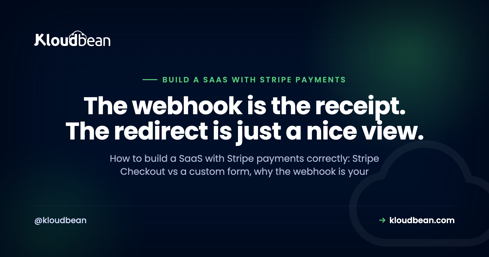

# Build a SaaS With Stripe Payments: Webhooks, State, and the Parts That Break

By Kloudbean Engineering · The webhook is the receipt. The redirect is just a nice view.

If you're about to build a SaaS with Stripe payments for the first time, the charge itself is not the hard part. Stripe makes taking money genuinely easy. What breaks, weeks later and usually in production, is *state*: your app's idea of who is paying, for what, and until when. This guide is about getting that architecture right. Stripe subscription billing, Stripe webhooks, and the handful of decisions that decide whether your billing is correct or quietly wrong.

> **The short version.** Use Stripe Checkout so card data never touches your server. Treat the webhook as the only source of truth for access, never the browser redirect. Verify signatures against the raw request body, make every handler idempotent because Stripe retries, store the customer and subscription IDs on your user row, and act on subscription status rather than on a single payment.

## The payment works. Your state is what goes wrong

Here is the shape of nearly every billing bug I've seen in a young SaaS. Someone pays. Stripe is happy. The money is real. And the app still says "upgrade to Pro." Or the reverse: someone cancelled two months ago and still has access, because nothing in the codebase ever listens for a cancellation.

Both bugs have the same root cause. The app treated payment as an *event that happened in the browser* instead of a *fact that lives in your database*. The browser is an unreliable narrator. Tabs get closed. Networks drop mid-redirect. Users hit back. Mobile Safari decides to reload. If your only signal that a payment succeeded is that the user's browser made it back to your success page, you will lose real customers' access and you'll find out through a support email.

So the mental model to hold for the rest of this: Stripe owns the money, your database owns entitlement, and webhooks are the wire between them. Everything below is a consequence of that one sentence.

## Stripe Checkout or your own payment form

First decision, and it's less about design than most people assume. Stripe Checkout is a hosted page Stripe runs. You create a session server-side and send the user there. Stripe Elements gives you Stripe-hosted input fields you can style inside your own page. Building a fully custom form that posts raw card numbers to your backend is a third option and it is the wrong one.

The real argument isn't developer effort, it's scope. With Checkout or Elements, the card number goes from the user's browser to Stripe. It doesn't pass through your server, your logs, or your database. That materially reduces your PCI scope, because you're no longer a system that handles cardholder data. Handle raw card details yourself and you've just volunteered for an entire compliance workload that has nothing to do with your product. Talk to someone qualified about what applies to your business, but the engineering conclusion is uncontroversial: let Stripe hold the card.

| | Stripe Checkout | Stripe Elements | Fully custom form |
| --- | --- | --- | --- |
| Who receives card data | Stripe | Stripe | You |
| Effect on your PCI scope | Reduced | Reduced | Greatly expanded |
| Build time | An afternoon | Days | Weeks, plus audits |
| Design control | Limited, configurable | Close to full | Total |
| You get for free | Wallets, tax collection, 3DS, localisation | 3DS, card validation | Nothing |
| When it wins | Almost every new SaaS | Checkout inside your own flow matters | Realistically never |

Start with Checkout. You can move to Elements later once you know your funnel well enough to have an opinion about it. The switch is a front-end change; the webhook architecture underneath, which is the part that takes real thought, doesn't move.

<!-- ADD IMAGE: a Stripe Checkout session in test mode, side by side with the Stripe dashboard showing the resulting customer and subscription objects. -->

## Stripe or a merchant of record

Worth pausing here, because Stripe isn't automatically the right answer. Stripe is a payment processor: you are the merchant, so sales tax and VAT registration and remittance across jurisdictions are your problem. A merchant of record like Paddle or Lemon Squeezy sells to your customer on your behalf and takes that tax burden on, in exchange for less control and a thicker layer of abstraction between you and the payment.

If you're a solo founder selling a $19/month tool to customers in twenty countries and the thought of EU VAT thresholds makes you want to lie down, a merchant of record is a legitimately good trade. If you want direct control over the billing model, metered usage, custom invoicing, and the raw API surface, choose Stripe. Check current fees on each provider's own pricing page rather than any blog post, including this one, because rates differ by country and change.

The rest of this guide assumes Stripe. Most of the architecture, especially webhooks-as-truth and idempotency, applies to either.

## Why the webhook is the source of truth

When a Checkout session completes, two things happen independently. Stripe redirects the user's browser to your `success_url`. And Stripe sends an HTTP POST to your webhook endpoint. Those are separate channels, and only one of them is reliable.

The redirect depends on the user's browser cooperating. The webhook is Stripe's server calling yours, with retries if you don't answer. If your endpoint is down, Stripe keeps trying for a good while. That's the channel you build on.

My position, stated plainly: the webhook is the only thing allowed to grant, change, or revoke access, and your database is the ledger. The success page is a UI courtesy. It should say "thanks, setting up your account" and poll or refresh until the state your webhook wrote shows up. It should never itself be what makes the user paid.

### The anti-pattern: provisioning in the success handler

This is the mistake to name explicitly, because it's the intuitive first implementation and it's broken in both directions.

```js
// DON'T DO THIS
app.get('/success', async (req, res) => {
  await db.users.update(req.user.id, { plan: 'pro' });  // ouch
  res.render('welcome');
});
```

Two failures fall out of it immediately. Anyone who visits `/success` directly, or shares the URL, gets a free upgrade. And any real customer whose browser never arrives, because they closed the tab the second their card was accepted, pays you and gets nothing. You've built a page that gives access to people who didn't pay and withholds it from people who did.

Even the "safer" version, where you look up the session ID from the query string and verify it with Stripe before provisioning, still has the second problem. Closed tab, no provisioning. Do the verification if you like it for a snappier UI, but the webhook must be able to do the whole job on its own.

## Verifying the signature with the raw request body

Your webhook endpoint is a public URL, so anyone can POST to it. Signature verification is what makes it trustworthy: Stripe signs each request with your endpoint's signing secret and puts the signature in a `stripe-signature` header. You recompute it and compare.

The classic failure here trips up almost everyone once. Signature verification runs over the *exact bytes* Stripe sent. If a JSON body parser has already run, it parsed those bytes into an object, and re-serialising that object gives you subtly different bytes: key order, whitespace, unicode escaping. The signature then fails for every single event, and the error message just says the payload doesn't match, which sends people hunting for a wrong secret when the real culprit is `app.use(express.json())` sitting three lines too early.

```js
// server.js
const express = require('express');
const Stripe = require('stripe');

const app = express();
const stripe = new Stripe(process.env.STRIPE_SECRET_KEY);

// This route must be registered BEFORE express.json(),
// and it needs the raw bytes, not a parsed object.
app.post(
  '/webhooks/stripe',
  express.raw({ type: 'application/json' }),
  (req, res) => {
    let event;
    try {
      event = stripe.webhooks.constructEvent(
        req.body,                           // a Buffer, untouched
        req.headers['stripe-signature'],
        process.env.STRIPE_WEBHOOK_SECRET
      );
    } catch (err) {
      console.error('stripe signature check failed:', err.message);
      return res.status(400).send('invalid signature');
    }

    // Acknowledge fast, then do the work.
    res.status(200).json({ received: true });
    handleEvent(event).catch((e) => console.error('handler failed', e));
  }
);

// Every other route can parse JSON normally.
app.use(express.json());
```

Two details in there that matter. Register the raw route before the JSON parser, or reach for the framework's per-route raw-body escape hatch (Next.js route handlers, FastAPI's `await request.body()`, Django's `request.body`, Rails' `request.raw_post`). And answer Stripe quickly. If your handler does slow work before responding, Stripe times out, marks the delivery failed, and retries, which is exactly how you end up provisioning the same subscription twice.

Both secrets here belong in environment variables, never in the repo. The signing secret is different per endpoint, and the one the Stripe CLI prints for local forwarding is not the one your production endpoint uses. If you're fuzzy on that split, [environment variables done right](https://www.kloudbean.com/blog/environment-variables-done-right/) and [secrets management](https://www.kloudbean.com/blog/secrets-management/) cover it properly.

## Idempotency, because Stripe retries

Stripe will deliver the same event more than once. Not as an edge case, as normal operation: a timeout, a deploy mid-request, a 500 from your app, a network blip. Your handler has to be safe to run twice with the same input.

The cheapest reliable trick is a table of event IDs with a unique constraint, and letting the database arbitrate.

```sql
CREATE TABLE processed_stripe_events (
  event_id    TEXT PRIMARY KEY,
  event_type  TEXT NOT NULL,
  handled_at  TIMESTAMPTZ NOT NULL DEFAULT now()
);
```

```js
async function handleEvent(event) {
  // Claim the event. If the insert conflicts, we've already done this one.
  const claim = await db.query(
    `INSERT INTO processed_stripe_events (event_id, event_type)
     VALUES ($1, $2)
     ON CONFLICT (event_id) DO NOTHING
     RETURNING event_id`,
    [event.id, event.type]
  );
  if (claim.rowCount === 0) return;   // duplicate delivery, Stripe is retrying

  switch (event.type) {
    case 'checkout.session.completed':      return onCheckoutCompleted(event);
    case 'customer.subscription.updated':   return onSubscriptionChanged(event);
    case 'customer.subscription.deleted':   return onSubscriptionEnded(event);
    case 'invoice.payment_failed':          return onPaymentFailed(event);
    default:                                return;   // ignore the rest, on purpose
  }
}
```

Write your state updates so replaying them is harmless anyway. "Set status to active and period end to X" is safe to run five times. "Add 30 days of credit" is not. Prefer setting absolute values over incrementing, and where you can't, the event-ID guard is your seatbelt.

One more thing that saves you later: events can arrive out of order. A `customer.subscription.updated` from Stripe's retry queue can land after a newer one you already processed. Store the subscription object's timestamp and ignore anything older than what you've already written.

<!-- ADD IMAGE: the Stripe dashboard webhook log showing one event with several delivery attempts, including a failed one and a successful retry. -->

## What to store in your own database

You need enough local state to answer "can this user use this feature" without calling Stripe's API on every request. Calling Stripe in your auth middleware is slow, rate-limited, and turns a Stripe incident into your outage.

```sql
ALTER TABLE users
  ADD COLUMN stripe_customer_id      TEXT UNIQUE,
  ADD COLUMN stripe_subscription_id  TEXT UNIQUE,
  ADD COLUMN plan                    TEXT,
  ADD COLUMN subscription_status     TEXT NOT NULL DEFAULT 'none',
  ADD COLUMN current_period_end      TIMESTAMPTZ;
```

The customer ID is the important one, and create it early. Make the Stripe customer when the user signs up, before they ever pay, and store the ID immediately. Then every future event has an obvious home: you look up the user by `stripe_customer_id` and you're done. Teams that skip this end up matching by email, which breaks the first time someone pays with a different address than they registered with.

Pass your own user ID through Checkout too, as `client_reference_id` or in `metadata`, so the completed-session event can find the user even if something went sideways with the customer record. Belt and braces, and it costs you one line.

Keep this state in your primary relational database next to your users, not in a cache or a JSON file on disk. It's the record of who paid you. If you don't already have a durable database wired in, [adding a managed database to your app](https://www.kloudbean.com/blog/add-managed-database-to-your-app/) walks through it, and [managed PostgreSQL](https://www.kloudbean.com/blog/managed-postgresql-hosting/) is the sane default for this kind of data.

## The subscription lifecycle, and what your app does in each state

A subscription is a state machine, and most first implementations model exactly one transition: nothing to paid. Then reality shows up. Cards expire. Banks decline renewals. Trials end. People cancel at period end and expect to keep access until then.

Here's the mapping I'd write down before touching code, because deciding it in a hurry during a support ticket goes badly.

| Stripe status | What actually happened | What your app should do |
| --- | --- | --- |
| `trialing` | In a free trial, no payment yet | Full access. Show days remaining and whether a card is on file. |
| `active` | Paid and current | Full access. The boring, happy path. |
| `past_due` | A renewal failed, Stripe is retrying | Keep access, warn in-app, prompt to update the card. Don't lock them out on day one. |
| `unpaid` | Retries exhausted | Restrict paid features, keep the data, make recovery one click. |
| `canceled` | Subscription is over | Downgrade to free. Never delete their data on this signal. |
| `incomplete` | First payment needs an extra step, often 3DS | No paid access yet. Send them back to finish authentication. |
| cancel at period end | Cancelled, still paid up | `active` until `current_period_end`. Access continues, renewal doesn't. |

The events worth subscribing to are a short list: `checkout.session.completed`, `customer.subscription.created`, `customer.subscription.updated`, `customer.subscription.deleted`, `invoice.paid`, and `invoice.payment_failed`. Subscribe to those, ignore the rest deliberately, and add more when a real need appears rather than handling all of Stripe's event catalogue for fun.

An opinion, since it comes up: don't cut access the instant a renewal fails. `past_due` usually means an expired card, not a customer who left. A warning banner and a link to Stripe's customer portal recovers people that a hard lockout loses. And send the dunning emails; Stripe can do that for you.

## Testing it with the Stripe CLI

You can't test webhooks by clicking around your local app, because Stripe can't reach `localhost`. The Stripe CLI solves this by tunnelling events to your machine, and it's the single biggest quality-of-life tool in this whole stack.

```bash
stripe login

# Forward live test-mode events to your local endpoint.
stripe listen --forward-to localhost:3000/webhooks/stripe
# Ready! Your webhook signing secret is whsec_xxxxxxxx (^C to quit)

# In another terminal, fire specific events at it.
stripe trigger checkout.session.completed
stripe trigger invoice.payment_failed
stripe trigger customer.subscription.deleted
```

Take the `whsec_` value that `stripe listen` prints and put it in your local `STRIPE_WEBHOOK_SECRET`. It's specific to that CLI session, so it will differ from the secret Stripe shows for your deployed endpoint. Mixing the two up is the second most common cause of signature failures, right behind the raw-body problem.

Things worth actually testing before you launch, not after: a duplicate delivery (run the same trigger twice and confirm nothing double-provisions), a failed renewal, a cancellation, and the closed-tab case. That last one is easy to simulate. Complete a test checkout, then close the tab before the redirect finishes. If the user ends up with access anyway, your architecture is right.

<!-- ADD IMAGE: a terminal running stripe listen with forwarded events scrolling, next to your app log showing each event handled once. -->

## What your webhook endpoint needs from the infrastructure under it

Now the boring requirement that most billing tutorials skip, and it's the one that decides whether any of the above holds up in production.

Your webhook endpoint has to be publicly reachable over HTTPS with a valid certificate, because Stripe won't post to a broken or self-signed one. It has to be listening whenever Stripe retries, which may be hours after the original attempt, so a process that has scaled to zero and needs a cold start is working against you here. And the subscription state it writes has to live in a database you genuinely back up, because losing the record of who paid for what is one of the few kinds of data loss you cannot reconstruct: Stripe knows the payments, but it doesn't know your app's mapping of those payments to accounts and entitlements unless you kept it. Those three requirements, taken together, describe a fairly ordinary always-on server with a real certificate and a backed-up database, which is what a managed platform gives you: [Kloudbean](https://www.kloudbean.com/) runs persistent app processes with free SSL and managed PostgreSQL or MySQL with automatic backups, and keeps your Stripe secret key and webhook signing secret in the runtime config instead of your repo. If you're rolling your own, [the server backups guide](https://www.kloudbean.com/blog/server-backups-guide/) is the part not to skip.

## The order I'd build it in

Concretely, if you're starting tomorrow morning:

1. Create products and prices in the Stripe dashboard, in test mode.
2. Add the Stripe customer at signup, store `stripe_customer_id` on the user.
3. Add a server-side endpoint that creates a Checkout session and redirects.
4. Build the raw-body webhook route with signature verification. Log every event, handle none yet.
5. Add the idempotency table and the event claim.
6. Handle `checkout.session.completed` and write subscription state.
7. Gate features on `subscription_status`, never on a redirect.
8. Handle updates, cancellations, and failed payments.
9. Wire up Stripe's customer portal so you don't build billing UI.
10. Switch to live keys, register the production webhook endpoint, and test one real payment on your own card.

That's roughly a week of part-time work, and most of it is steps 4 to 8. If you're taking a prototype to paid for the first time, [turning a prototype into a paid product](https://www.kloudbean.com/blog/turn-your-ai-prototype-into-a-paid-product/) and [launching a micro SaaS](https://www.kloudbean.com/blog/how-to-launch-a-micro-saas/) cover the parts of the journey either side of billing.

<!-- ADD IMAGE: your users table in a database client, showing the stripe_customer_id, subscription_status, and current_period_end columns populated after a test checkout. -->

The one idea to keep, if you keep nothing else: money lives at Stripe, truth lives in your database, and the webhook is the only bridge you trust.

---

**Your webhook needs to be awake when Stripe retries.** Persistent app processes, free SSL, and a managed database with automatic backups. See [kloudbean.com](https://www.kloudbean.com/) and [pricing](https://www.kloudbean.com/pricing/).

## FAQ

**Do I need webhooks to accept Stripe payments?**
For a one-off payment you can technically get away without them. For subscriptions you cannot. Renewals, failed payments, cancellations, and trial endings all happen without any browser involved, so a webhook is the only way your app learns about them. Even for one-off charges, the webhook is what covers the user who closes the tab before your success page loads.

**Why does my Stripe webhook signature verification keep failing?**
Almost always because a body parser ran before your webhook handler and turned the raw bytes into an object. Signature verification needs the exact bytes Stripe sent. In Express, register the webhook route with express.raw before app.use(express.json()). The second most common cause is using the signing secret from the Stripe CLI against your deployed endpoint, or the reverse. Each endpoint has its own secret.

**Should I use Stripe Checkout or build my own payment form?**
Use Checkout for a first version. Card data goes straight to Stripe rather than through your server, which reduces your PCI scope, and you get wallets, 3D Secure, and localisation without writing any of it. Stripe Elements is the middle ground when you need the payment step inside your own page. Posting raw card numbers to your own backend is a large compliance burden for no product benefit.

**Does using Stripe make me PCI compliant?**
No. Compliance is assessed against your business, and no hosting provider can confer it on you either. What Checkout and Elements do is keep cardholder data out of your systems, which reduces the scope of what applies to you. The obligations that remain depend on your business, your volume, and your setup. Treat that as a question for a qualified advisor rather than something to settle from a blog post.

**How do I stop Stripe webhook retries from provisioning twice?**
Make the handler idempotent. Store each event ID in a table with a unique constraint and insert it before doing any work, using ON CONFLICT DO NOTHING. If the insert claims nothing, you have already processed that event and can return early. Also prefer writing absolute state, such as setting a status and a period end, over incrementing counters or granting credit.

**Which Stripe events should I listen to for subscription billing?**
A short list covers most SaaS: checkout.session.completed, customer.subscription.created, customer.subscription.updated, customer.subscription.deleted, invoice.paid, and invoice.payment_failed. Subscribe to those, ignore everything else deliberately, and add more only when a specific feature needs them. Handling every event Stripe offers adds code you have to maintain for no gain.

**What should I do when a subscription goes past_due?**
Keep access for now and tell the user. A past_due status usually means an expired or declined card rather than a customer who wants to leave, and Stripe will retry on a schedule. Show an in-app warning, link to the Stripe customer portal so they can update the card, and let Stripe send dunning emails. Restrict paid features once retries are exhausted and the status becomes unpaid.

**Is Stripe or a merchant of record like Paddle better for a small SaaS?**
It depends on which problem you would rather own. A merchant of record sells on your behalf and handles sales tax and VAT registration and remittance, which is real relief for a solo founder selling internationally. Stripe gives you direct control, a richer API, and the lowest layer of abstraction, at the cost of owning your own tax obligations. Compare current fees on each provider's pricing page.

**How do I test Stripe webhooks locally?**
Install the Stripe CLI, run stripe login, then stripe listen with a forward-to flag pointing at your local endpoint. Put the whsec value it prints into your local environment. Then use stripe trigger to fire specific events. Test duplicate deliveries, a failed renewal, a cancellation, and closing the tab before the redirect completes.

---

*Kloudbean Engineering · Stripe holds the money. Your database holds the truth. Keep those jobs separate.*
