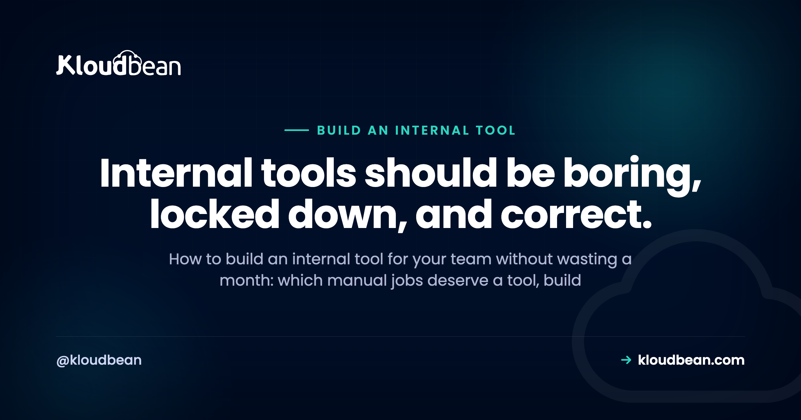

# Build an Internal Tool for Your Team: Buy, Build, or Skip It

By Kloudbean Engineering · Internal tools should be boring, locked down, and correct.

Someone on your team does the same fiddly job every week. Pulling numbers into a spreadsheet, flipping order statuses one at a time, updating a client status page by hand, cleaning up bad data rows. At some point the obvious thought lands: we should just build an internal tool for your team and stop doing this manually. It's usually the right instinct. It's also where a lot of small companies and agencies quietly lose a month, because they start with the UI framework instead of the two questions that actually decide the shape of an internal dashboard: where does the data live, and who is allowed in.

> **The short answer.** Build an internal tool when the manual job repeats, has clear rules, and touches data you already control. Use a no-code builder like Retool, Appsmith or Budibase when the tool is mostly forms over a database and speed matters. Write a custom app when the logic is genuinely complex or the data is sensitive. Then host it privately, with real access control.

## First, does the job actually deserve a tool?

Not every annoying task is a software problem. Some are a process problem wearing a costume, and building a dashboard on top of a broken process just makes the mess faster.

A manual job is worth turning into a tool when it hits most of these: it repeats on a schedule or per customer, the rules are stable enough to write down, more than one person does it (or one person is a bottleneck), the source data already lives somewhere queryable, and mistakes have a cost. Order refunds, onboarding checklists, content moderation queues, client reporting, bulk data fixes. Those are good candidates.

It's usually not worth it when the task happens twice a year, when the rules change every time you do it, or when the real fix is upstream. If your team spends four hours a week correcting bad records, a tool that corrects them faster is second best. Validating the input that creates them is the fix.

One filter saves a lot of grief: write the tool's job as a single sentence before you write any code. If you can't, the scope isn't ready. Tools that start as let's build an ops dashboard grow forever. Tools that start as let Mark refund an order and log who did it ship in a week.

<!-- ADD IMAGE: the spreadsheet or manual workflow the tool replaces, with the repetitive step circled. -->

## Build vs buy an internal tool, honestly

Four different approaches are all correct here, and the deciding factor is how complex the logic is and how sensitive the data is, not which tool markets itself better.

**Retool** is the shortest path to a real admin panel over a real database. You point it at Postgres or an API, drag tables and forms, write small bits of JavaScript and SQL, and you have something usable in an afternoon. Its strength is that it assumes you already have a proper database and just want a UI over it.

**Appsmith** and **Budibase** cover similar ground and are both open source, which matters if you'd rather run the builder on your own server than send queries through a vendor. Appsmith leans developer-ish, with more scripting. Budibase is friendlier for the person who wants forms and tables without much code, and it will happily generate a small database for you if you don't have one.

**Airtable** isn't a builder in the same sense, and that's the point. It's a spreadsheet that behaves like a database, with views, forms and automations. For a team tracking work that used to live in a shared sheet, it's often the whole answer. It stops being the answer once you need real relational integrity, row-level permissions, or thousands of writes.

**A plain custom app**, meaning a small Django, Rails, Laravel or Express project, wins when the logic is the hard part. Multi-step approvals, calculations you'll be audited on, integrations that need retries and idempotency, or data you'd rather not route through a third-party builder at all. It's slower on day one and cheaper to change on day two hundred.

| | No-code / low-code builder | Custom app |
|---|---|---|
| Time to something usable | Hours to days | Days to weeks |
| Best fit | Forms and tables over existing data | Complex rules, workflows, integrations |
| Who can maintain it | Anyone technical enough to write SQL | Whoever writes your product code |
| Data sensitivity | Fine for internal ops data | Better when data is regulated or confidential |
| Custom logic | Possible, gets awkward past a point | Whatever you can write, it's just code |
| Where it breaks down | Vendor lock-in, version control, testing | Nobody maintains it after the author leaves |
| Real cost | Per-seat pricing as the team grows | Engineering time, forever |

My rule of thumb after watching a lot of these get built: if you can describe the tool as a list of screens with tables and forms on them, buy or use a builder. If you can only describe it as a set of rules, write it. And if you're arguing about the frontend framework on day one, you've already picked wrong, because nobody has ever quit over an ugly internal dashboard.

## The data layer is the real decision

An internal tool is mostly a window onto data. So the question of where that data lives outranks every UI decision you'll make.

Three shapes come up. The tool reads your **production database** directly, which is fast to build and the most dangerous. It reads a **replica or a reporting copy**, which is safer for anything read-heavy and keeps a runaway query from slowing your app. Or it gets its **own small database** and talks to your product through an API, which is the cleanest and the most work.

If your tool needs to write, be deliberate. Don't hand it a superuser connection and hope. Give it a dedicated database user with permission only on the tables it touches, and route writes through your application's own logic so validation and side effects still happen. A tool that flips a row directly and skips the code that sends the confirmation email hasn't automated the job, it's created a new class of bug.

Two practical details: internal tools open a connection per user action, so on Postgres, [connection pooling](https://www.kloudbean.com/blog/database-connection-pooling/) stops a five-person dashboard from exhausting your connection limit, and [wiring a managed database in properly](https://www.kloudbean.com/blog/add-managed-database-to-your-app/) is a one-time job that saves the recurring one. If you're picking an engine now, [managed PostgreSQL](https://www.kloudbean.com/blog/managed-postgresql-hosting/) is the boring correct default, because internal tools grow relational joins fast.

<!-- ADD IMAGE: a simple flow of tool to database, showing whether it reads production, a replica, or its own store. -->

## Who's allowed in, and what they can do

Teams underestimate this part. An internal tool almost always has more power than the product itself: it sees every customer, edits records the UI would never allow, and exports things nobody should export. Treat it as a privileged system from the first commit.

Three layers, and you want all three:

- **Network level.** Restrict who can even reach the URL. IP allow-listing for your office or VPN ranges, or a simple auth gate in front of the whole app, means a stranger never gets as far as your login form. A [Basic Auth gate](https://www.kloudbean.com/blog/basic-auth-gate-guide/) is unglamorous and effective for exactly this.
- **Identity level.** Real accounts, not a shared password in a group chat. Single sign-on with your existing Google or GitHub accounts if you can, so access dies with offboarding. Multi-factor on anything that can move money or read personal data.
- **Permission level.** Roles that map to what people actually do. Support sees and edits orders. Finance exports. Only two people can delete. Read-only should be the default role, and most people should stay in it.

Then log everything that changes data: who, what, when, old value, new value. Not out of distrust, but because in six months someone will ask why a customer's plan changed and the answer needs to be a row in a table, not a guess. Keep the tool's credentials out of the repo too, using the same [secrets handling](https://www.kloudbean.com/blog/secrets-management/) you'd use in production. Internal tools are where hard-coded database passwords go to live forever.

## The anti-pattern that keeps biting small teams

Two of them, actually, and they usually travel together.

The first: putting the admin panel on a public URL and treating the URL itself as the security. Something like `tools.yourcompany.com/internal-admin-9f2`, no auth gate, no IP restriction, just a link people bookmark. Scanners find those. They crawl certificate transparency logs and brute-force subdomains, so they never need to guess your slug. An unguessable URL is not access control.

The second: letting the tool write straight to the production database with a full-access user and no record of who did what. It works beautifully until someone runs a bulk update with a wrong filter, and you find there's no audit trail, no recently tested restore point, and no way to tell which changes were intentional. That's when people learn that [backups you've actually restored from](https://www.kloudbean.com/blog/server-backups-guide/) are the difference between a bad hour and a bad quarter.

Both are what happens when a quick script never gets promoted to real software, even though people now depend on it daily.

## Where an internal tool actually lives

The hosting constraint is specific. An internal tool has to be reachable by your team from wherever they work, but not open to the public. It needs to stay running, because a dashboard that sleeps and cold-starts is a dashboard people stop trusting. And it needs a database next to it that gets backed up without anyone remembering to.

That rules out the tempting options. Someone's laptop is not a host. A free tier that spins down is fine for a side project and wrong for the thing your support team opens at 9am. A static host can't run a backend that queries a database. You need a small always-on server, private by default, with a managed database beside it.

That combination is what **Kloudbean** covers from one dashboard: a managed server for the app, a managed database next to it, IP Access Control to allow only your team's addresses, a Basic Auth gate in front of the app, subusers with per-action permissions so your ops people don't get infrastructure access, plus automatic backups and free SSL, from $8/mo.

If you're weighing that against running your own box, the tradeoffs are the same ones in [whether you need a VPS at all](https://www.kloudbean.com/blog/do-i-need-a-vps-for-my-saas/). For an internal tool specifically, the deciding factor is usually that nobody on a five-person team wants to own OS patching for a dashboard that three people use.

<!-- ADD IMAGE: the IP allow-list or auth gate configured for the internal tool, with real addresses blurred. -->

## A build path that gets it done in a week

Order matters here. Most stalled internal tools stalled because someone started at step four.

1. **Write the one sentence.** What the tool lets whom do. If it needs an *and*, you have two tools. Ship one.
2. **Find the data.** Which tables, which API, whether you're reading production or a copy. Decide read-only or read-write now, not later.
3. **Pick the approach.** Builder if it's screens and forms, custom app if it's rules. Prototype in a builder for an hour first; sometimes that is the whole answer.
4. **Set up access before features.** Auth gate, IP restriction, roles, one admin account. Do it while there's nothing to protect, because you won't come back to it once the tool is useful.
5. **Build the narrowest version.** One screen. One action. Real data. Then watch the person who does the job manually use it.
6. **Add the audit log.** Every write records the user and the change. A small table and a decorator, and the feature you'll be most grateful for.
7. **Deploy it somewhere permanent** with the database managed and backups on. Then delete the spreadsheet, deliberately, so people stop using both.

Resist the urge to make it pretty until it's correct. Internal tools earn their keep through accuracy and access control. A plain table with correct data and a clear record of who changed what beats a beautiful dashboard that occasionally lies. Ugly and trustworthy wins.

**An internal tool needs a private, always-on home.** Managed server, managed database, IP allow-listing, automatic backups, free SSL, one dashboard. See [kloudbean.com](https://www.kloudbean.com/) and [pricing](https://www.kloudbean.com/pricing/).

## FAQ

**How do I build an internal tool for my team?**
Start by writing in one sentence what the tool lets whom do. Then decide where its data lives, pick a no-code builder if the tool is forms and tables or a custom app if the logic is complex, set up authentication and access restrictions before you build features, ship the narrowest working version, add an audit log of every write, and host it on an always-on server that is not open to the public.

**Should I build or buy an internal tool?**
Buy or use a builder when you can describe the tool as a set of screens with tables and forms over data you already have. Build a custom app when the difficulty is in the rules, the workflow, or the integrations, or when the data is sensitive enough that you would rather not route it through a third-party platform. Cost matters too: builders charge per seat as your team grows, custom apps charge in engineering time forever.

**Is Retool worth it for a small team?**
Often yes, if you already have a proper database and want an admin panel over it quickly. Retool is strongest when the job is querying, displaying and editing existing records, and you can drop into SQL or JavaScript for the awkward bits. It becomes less attractive when your logic grows past what fits in small scripts, or when per-seat pricing starts outrunning the value for a wide internal audience.

**What is the difference between Appsmith, Budibase and Airtable?**
Appsmith and Budibase are open-source app builders you can self-host, which means your queries stay on infrastructure you control. Appsmith suits developers who want scripting; Budibase suits people who want forms and tables with less code and can generate a simple database for you. Airtable is a spreadsheet-database hybrid with views, forms and automations, ideal for structured tracking, and it runs out of room when you need relational integrity or fine-grained permissions.

**Should an internal admin panel be on the public internet?**
No. Put it behind a network restriction such as IP allow-listing for your office or VPN ranges, or an auth gate in front of the whole application, so a stranger never reaches the login form. A secret or unguessable URL is not protection. Automated scanners discover hostnames through certificate transparency logs and subdomain enumeration, so obscurity buys you very little time.

**Can my internal tool connect straight to the production database?**
It can, and for read-only reporting that is often fine, ideally against a replica so a heavy query cannot slow your app. For writes, be careful. Use a dedicated database user limited to the tables the tool needs, route changes through your application logic so validation and side effects still run, and log every write. A tool that updates rows directly and skips your app code creates bugs that look like data corruption.

**Where should I host an internal tool?**
On a small always-on server with a managed database beside it, restricted to your team. Avoid free tiers that spin down, because a dashboard that cold-starts stops being trusted, and avoid running it on someone's laptop. You want the process kept alive, HTTPS on a real domain, automatic database backups, and network-level access rules so the tool is reachable by staff but not by the public.

Kloudbean Engineering · The hard parts of an internal tool are access control and data correctness. The UI is the easy bit.
