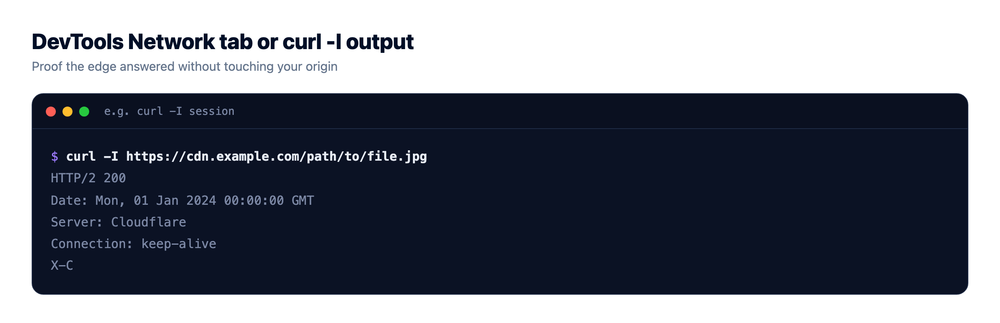
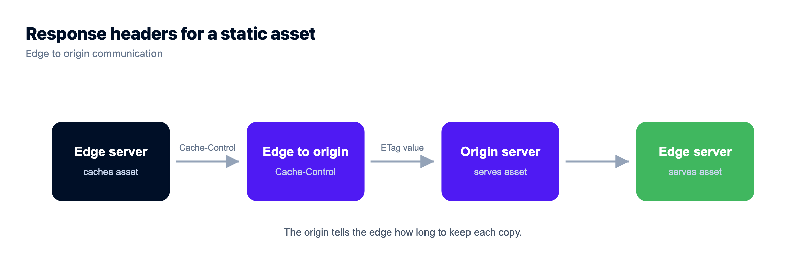
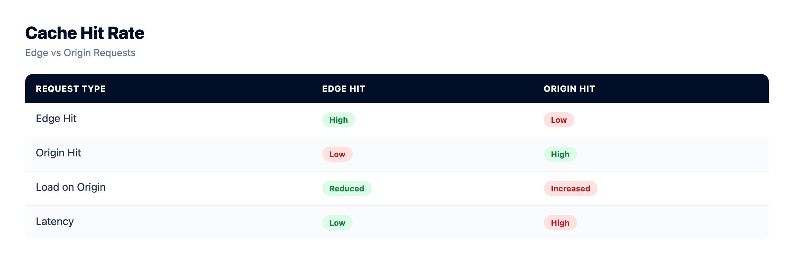

# CDN Explained: What a Content Delivery Network Actually Does

Your server can be blisteringly fast and your site can still feel slow in Sydney, in Sao Paulo, in Mumbai. The reason is physics. Data moving through fiber covers roughly 200,000 kilometers a second, so a request that has to cross an ocean and come back burns tens of milliseconds before your code runs a single line.

A CDN is how you stop paying that tax on every visit. This is CDN explained without the fog: what a content delivery network really is, how edge caching works underneath, what it genuinely speeds up, and the honest cases where it does nothing at all. If you run a WordPress site, a React app, a Laravel store, or a plain static site, this is the layer that decides how fast you feel to someone far away.

> **The short answer**
> A CDN, or content delivery network, is a global network of edge servers that cache copies of your static content close to your users. When someone visits, the nearest edge server answers instead of your origin, so images, scripts, and pages load faster and your server does less work. It speeds up cacheable content, not dynamic or per-user responses.

## What is a CDN?

A CDN, a content delivery network, is a fleet of servers spread across the world whose one job is to keep copies of your content close to the people asking for it. Each location is called a point of presence, or PoP. Instead of every visitor reaching all the way back to your one server, they hit the nearest edge server, which already holds a cached copy and hands it straight back.

Your own server, the one running your app and your database, is the **origin**. The CDN sits in front of it. On a good day, most visitors never touch your origin at all, because the edge answers on its behalf. That's the whole trick.

<!-- SVG: CDN edge map. Visitor -> nearest edge PoP; cache HIT (green) returns the cached copy; cache MISS (purple dashed) pulls from the distant origin, which then fills the edge. Two generic PoPs imply the global network. Brand navy/purple/green. -->

_Figure: the nearest edge answers most requests from cache. On a miss, it fetches once from the distant origin, caches the copy, and every visitor after that gets the fast path._

## How does a CDN work? Cache hits, misses, and the origin pull

The mechanics are simpler than the marketing makes them sound. Edge caching comes down to two outcomes for every request.

**Cache hit.** The nearest edge already has a fresh copy of what you asked for, so it returns it right away. No trip to your origin. This is the fast path, and once the cache warms up it's most of your traffic.

**Cache miss.** The edge doesn't have it, or the copy it had has expired. So the edge fetches the content from your origin once, hands it to that visitor, and keeps a copy for the next person. The first visitor pays the full distance. Everyone after them gets the hit.

You can watch this happen in about ten seconds. Most CDNs stamp a response header you can read. A value of `X-Cache: HIT` means the edge served it; `MISS` means it had to go back to origin. Run `curl -I` against the same asset twice and you'll usually see a miss, then a hit.



## TTL and cache headers: who decides how long a copy lives?

The origin stays in charge. It sends cache headers telling the edge how long a copy may live before checking back. That lifetime is the TTL, time to live, a number of seconds.

```
# The origin sends cache headers that tell the CDN what to do
Cache-Control: public, max-age=3600, s-maxage=86400

#   max-age    how long a browser keeps its own copy (seconds)
#   s-maxage   how long the shared CDN edge keeps the copy
#   public     safe to cache and reuse for everyone

# A validator lets the edge re-check cheaply instead of re-downloading
ETag: "a1b2c3d4"
#   the edge asks "still good?"; origin replies 304 Not Modified if unchanged

# Who answered the request? Read the response header:
#   X-Cache: HIT    served straight from the edge
#   X-Cache: MISS   the edge had to fetch from your origin first
```

Set the TTL too short and the edge keeps re-fetching, so you throw away most of the benefit. Set it too long and visitors see stale content after you ship a change. The clean fix for that second problem is fingerprinting: build your files with a hash in the name, like `app.9f2c1.js`, so a new build gets a new URL. Then you can cache those assets almost forever, and the short-lived HTML that points to them is the only thing that needs to expire quickly.



## What a CDN speeds up, and what it can't

A CDN is a caching layer. It's excellent at content that's the same for everyone and changes rarely. It does nothing for content that's unique to each request.

Static assets are the sweet spot: images, CSS, JavaScript bundles, fonts, video. Public pages that look identical for every visitor cache well too, with a sensible TTL. But a logged-in dashboard, a shopping cart, a live price, an account page? Those are different for every user, so the edge can't reuse one copy. They fall through to your origin every time.

| Content type | Example | Cacheable at the edge? |
| --- | --- | --- |
| Static asset | image, CSS, JS bundle, font, video | Yes, easily. Long TTL |
| Public HTML page | a blog post, a landing page, same for all | Yes, with a shorter TTL |
| Per-user HTML | a logged-in dashboard or profile | No, it differs per visitor |
| Dynamic API / JSON | cart contents, live prices, search | Rarely, and only for seconds |
| Authenticated response | account settings, private data | No, always hits the origin |

The classic mistake is caching HTML that has no business being cached. Cache a logged-in page too aggressively and the edge can hand User B a copy of User A's account page. That isn't a speed win, it's a data leak. Personalized responses belong at the origin, and you keep the edge off them with a header like `Cache-Control: private, no-store`. I've seen this exact bug ship to production more than once, and it's always because someone put a blanket cache rule on `/` without thinking about who's logged in.



## CDN vs load balancer: not the same job

People blur these two together constantly, so let's split them apart. A CDN caches content at the edge and serves it from near the visitor. A load balancer spreads live requests across several backend servers for scale and redundancy. One is about distance and caching. The other is about capacity and survival.

They're happy running together: a CDN out front serving cached assets, and a load balancer behind it spreading the dynamic requests that actually reach your app. If that second half is new to you, here's [how a cloud load balancer works](https://www.kloudbean.com/blog/cloud-load-balancer-explained/), and the wider picture of [how cloud hosting works](https://www.kloudbean.com/blog/how-cloud-hosting-works/) from DNS to database shows where both of them sit in the path.

## Do I need a CDN?

Straight answer: it depends on where your users are and what you serve.

You want one if your audience is spread across regions, or your site is heavy on static assets like images and video, or you get sharp traffic spikes a single origin would struggle to absorb. A global storefront or a media-heavy publication feels the difference on the first page load. A CDN also blunts a lot of junk traffic at the edge before it reaches you, which is why it overlaps with [how DDoS protection works](https://www.kloudbean.com/blog/ddos-protection-explained/).

You probably don't need one yet if your users sit in one region, close to your server, and your traffic is steady. If everyone's in Germany and your server is in Frankfurt, a CDN is a small tiebreaker, not a transformation. Put your origin in the right region first. That's usually free, and it matters more than people expect. Where your server physically lives is its own decision, covered in [data residency, explained](https://www.kloudbean.com/blog/data-residency-explained/).

## The honest limit: a CDN won't fix a slow origin

This is the line I repeat most, so I'll say it plainly. A CDN makes a far static asset fast. It does not make a far database fast.

If your pages are slow because a query takes two seconds, or your server is undersized, or your app makes thirty round trips to the database to render one page, the edge can't rescue you. Every uncacheable request still travels to your origin and waits on your slow code. Caching hides distance. It doesn't hide bad performance. Fix the origin first, then let the CDN make the fast thing global. In that order. If your slow origin is WordPress, start with [speeding up WordPress](https://www.kloudbean.com/blog/speed-up-wordpress/) before you reach for the edge.

## How the edge fits on Kloudbean

Kloudbean doesn't ask you to bolt a separate CDN onto your stack by hand. Cloudflare Enterprise edge caching is available as a paid add-on on any site, and it's included for Enterprise accounts. Route your domain through it and your static content serves from Cloudflare's global edge, close to your visitors, while your origin keeps the dynamic work.

<!-- IMAGE: ../assets/console/cloudflare.png : enabling Cloudflare Enterprise edge caching for a site in the Kloudbean console. -->

The philosophy matches the rest of the platform: servers, managed databases, object storage, and the edge in front of them, from one dashboard instead of four vendors and four bills. Standard plans start from $8/mo, and Enterprise is custom pricing, so check the [pricing page](https://www.kloudbean.com/pricing/) for current numbers. If you're weighing hosts, [what makes the best managed cloud hosting](https://www.kloudbean.com/blog/best-managed-cloud-hosting/) lays out what actually matters.

<!-- IMAGE: ../assets/console-real/shots/dashboard.png : the Kloudbean dashboard showing servers, applications, databases, and storage in one place. -->

<!-- cta:start -->
**One dashboard for the whole stack.**

Servers, managed databases, object storage, and a built-in load balancer live behind one login, on the cloud and region you pick. The stack, SSL, patching, and backups are handled for you.

- Seven cloud providers
- Managed databases
- Object storage
- Automatic backups
- Free SSL
- Git deploy
- Free migration assistance

[Start free](https://console.kloudbean.com/register) · [See plans](https://www.kloudbean.com/pricing/)
<!-- cta:end -->

## FAQ

**What is a CDN in simple terms?**
A CDN, or content delivery network, is a group of servers spread around the world that keep cached copies of your content close to your visitors. When someone loads your site, the nearest edge server hands back the copy it already has instead of making the request travel all the way to your one origin server. The result is faster loads for people far from where your site is hosted, and less work for your own server.

**How does a CDN actually work?**
Every request ends in one of two outcomes. On a cache hit, the nearest edge server already has a fresh copy and returns it immediately, with no trip to your origin. On a cache miss, the edge fetches the content from your origin once, serves it, and stores a copy so the next visitor gets a hit. Cache headers from your origin decide how long each copy is allowed to live before the edge checks back.

**What is the difference between a CDN and my web host or origin server?**
Your origin server, provided by your web host, is where your app and database actually run and where content is created. A CDN sits in front of it and only stores cached copies of content it has already seen. The origin is the source of truth. The CDN is a fast, distributed copy of the cacheable parts, kept close to users so most requests never reach the origin at all.

**Does a CDN speed up a dynamic or logged-in site?**
Only the cacheable parts. Static assets like images, CSS, and scripts get faster everywhere. But pages that differ per user, such as a logged-in dashboard, a cart, or an account page, cannot be safely cached and still travel to your origin every time. A CDN is powerful for public, unchanging content and largely irrelevant for personalized responses.

**Do I need a CDN for a small website?**
Often not yet. If your visitors are mostly in one region and sit close to your server, and your traffic is modest, a CDN is a minor tiebreaker rather than a transformation. Putting your origin in the right region usually helps more and costs nothing. Reach for a CDN when your audience is global, your site is heavy on images or video, or you face sharp traffic spikes.

**What is edge caching?**
Edge caching means storing copies of your content on servers at the edge of the network, in many locations worldwide, so each visitor is served from the one nearest them. The edge is simply the layer closest to users, as opposed to your central origin. It's the mechanism a CDN uses to cut the physical distance a request has to travel, which is what actually reduces load time.

**What is the difference between a CDN and a load balancer?**
A CDN caches content at global edge locations and serves it from near each visitor, which is about distance and speed. A load balancer spreads live requests across several backend servers, which is about capacity and redundancy. They solve different problems and often work together: a CDN handling cached assets out front, and a load balancer distributing the dynamic requests that reach your app behind it.

**Will a CDN fix my slow website?**
Only if the slowness comes from distance to static content. A CDN makes a far static asset fast, but it cannot make a slow database or an undersized server fast. If your pages are slow because of heavy queries or inefficient code, every uncacheable request still hits your origin and waits. Fix the origin performance first, then use the CDN to make the fast content global.

**What are cache hits and cache misses?**
A cache hit is when the edge server already has a fresh copy of what was requested and can return it without contacting your origin. A cache miss is when it does not, so it fetches from the origin, serves the visitor, and stores a copy for next time. A high hit ratio means most traffic is served from the edge, which is the whole point. You can often see which happened in an X-Cache response header.

**Does Kloudbean include a CDN?**
Kloudbean offers Cloudflare Enterprise edge caching as a paid add-on on any site, and it is included for Enterprise accounts. You route your domain through it and your static content serves from Cloudflare's global edge, while your origin on Kloudbean keeps handling the dynamic work. Servers, databases, storage, and the edge are all managed from one dashboard rather than separate vendors.

_By Kloudbean Edge · Cache it close, and the distance stops mattering._
