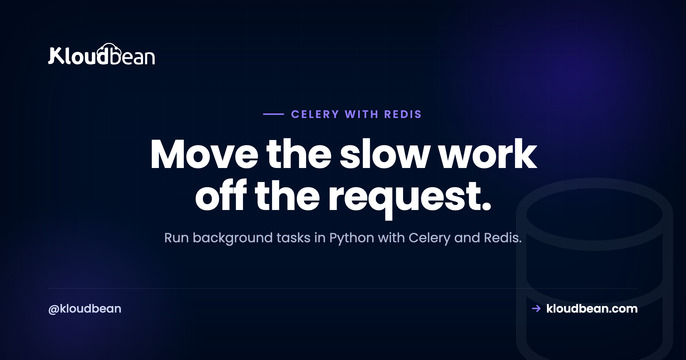
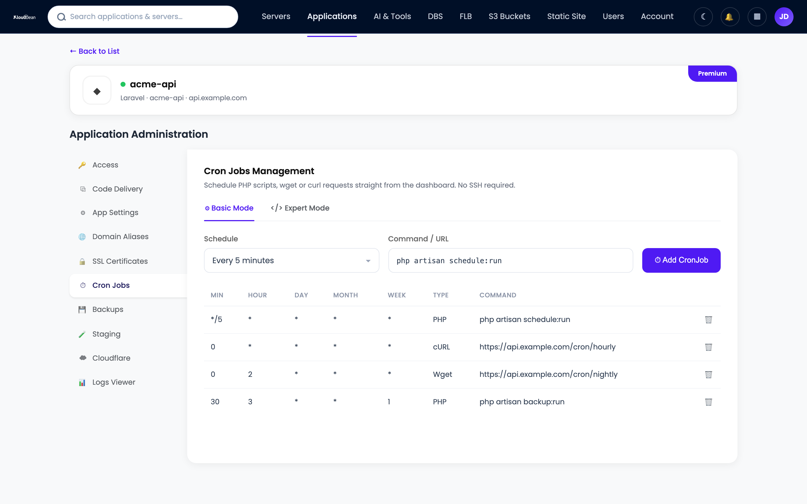

# Celery with Redis: Background Tasks in Python, Built for Production

_Python task queues_



You shipped a Flask, Django, or FastAPI app and it works. Then someone signs up and the request hangs for six seconds while you send a welcome email, resize an avatar, and call a payment API. That's your cue to add a task queue. This is a hands-on walkthrough of **Celery with Redis**: how to move slow work off the request, define Celery background tasks, run a worker, schedule jobs with Celery Beat, and keep the whole thing standing under real traffic. Real Python, real deploy steps, and the sharp edges nobody mentions until 2am.

> **The short version**
>
> Point `CELERY_BROKER_URL` at a `redis://` URL to use Redis as your Celery broker. Define work with the `@celery_app.task` decorator, enqueue it with `.delay()`, and run a separate worker process (`celery -A app worker`). Add **Celery Beat** for periodic jobs. Make every task idempotent, turn on retries with backoff and `acks_late`, and you've got a queue that survives production. On Kloudbean, Redis is a one-click managed engine locked to your app server's IP, and your Python app plus its worker run on the same server.

## The HTTP request is the wrong place for slow work

A request should do one job: respond fast. When you send an email inside the request handler, the browser waits on your SMTP provider. When you resize an uploaded image inline, the request waits on CPU. When you call Stripe or a shipping API, you're now at the mercy of someone else's latency, and their bad afternoon becomes yours.

None of that work belongs on the request path. Leave it there and things break in a predictable order:

- **Slow responses.** A 200ms page turns into a 4-second page because it's blocking on an email nobody's even reading yet.
- **Timeouts.** Most app servers kill a request after 30 seconds. Gunicorn's default is exactly that, and when it fires the user gets a `504` and a half-finished operation.
- **Cascading failure.** If the third-party API stalls, every request that touches it stalls too. Your worker processes fill up waiting, and the whole site goes down with one slow dependency.
- **No second chance.** The email provider blips for two seconds, the send throws, and your user never gets their receipt. Inline code rarely retries.

The fix is old and boring and it works. Hand the slow work to a queue and return right away. The user gets a response in milliseconds. A separate process does the real work a moment later, retries if it fails, and no one's browser is held hostage while it happens.

<!-- ADD IMAGE: App log showing a request that blew past the 30s worker timeout and returned a 504, the exact failure this article prevents. -->

## Celery with Redis: how the pieces fit together

Celery is a task queue for Python. You write ordinary functions, mark them as tasks, and Celery arranges for them to run outside the request in a separate worker process. It needs somewhere to hold the messages while they wait for a worker. That place is the broker.

Redis is the broker. When your app calls a task, Celery serializes the call (the task name plus its arguments) and pushes it into a Redis list. Your worker is watching that list, pops the next job, and runs it. Redis is quick, it's a single dependency you probably already run for caching, and it can double as a result backend if you ever need to read a task's return value.

So Redis plays up to two roles here:

- **Broker (required).** The queue itself. This is `CELERY_BROKER_URL`. No broker, no Celery.
- **Result backend (optional).** Stores the state and return value of each task. This is `CELERY_RESULT_BACKEND`. Skip it unless you actually read results back.

_Diagram: the web app calls `.delay()`, the job lands in the Redis broker, and a Celery worker pulls it and runs it. All of it stays on the same server, off the public internet. An optional result backend stores the return value._

## Your first Celery task

Here's a small, complete setup. One file, `app.py`, holds the Celery instance and a task. Notice that the broker and backend both come from the environment, never from a value typed into the code.

```python
# app.py
import os
from celery import Celery

celery_app = Celery(
    "app",
    broker=os.environ["CELERY_BROKER_URL"],
    backend=os.environ.get("CELERY_RESULT_BACKEND"),
)

# sensible production defaults (explained further down)
celery_app.conf.update(
    task_acks_late=True,              # ack a job only after it finishes
    task_reject_on_worker_lost=True,  # requeue if the worker dies mid-task
    worker_prefetch_multiplier=1,     # don't let one worker hoard messages
    broker_transport_options={"visibility_timeout": 3600},
)


@celery_app.task(bind=True, max_retries=5)
def send_welcome_email(self, user_id):
    user = get_user(user_id)          # re-fetch by id; don't pass the object
    try:
        mailer.send(to=user.email, template="welcome")
    except TransientError as exc:
        # back off: 2s, 4s, 8s, 16s, 32s
        raise self.retry(exc=exc, countdown=2 ** self.request.retries)
```

A few things earn their keep in that snippet. `bind=True` gives you `self`, which is how you reach `self.retry()` and the current retry count. `max_retries=5` caps the attempts so a permanently broken send doesn't loop forever. And the task takes a `user_id`, not a `user` object, which matters more than it looks (more on that later).

Enqueue it from your view or route. Both of these return immediately:

```python
# inside your Flask / Django / FastAPI handler
send_welcome_email.delay(user.id)

# the same call, with options
send_welcome_email.apply_async(
    args=[user.id],
    countdown=10,        # wait 10 seconds before running
    queue="emails",      # route to a named queue
)
```

`.delay(user.id)` is the shorthand you'll use most. `.apply_async()` is the same thing with the dials exposed: delay the start, pick a queue, set a priority, add an expiry. Call one of them and the job is in Redis. Your handler returns, the user sees their page, and a worker takes it from there.

## Run the Celery worker

The task won't run on its own. Something has to consume the queue, and that something is the worker. Start it from the same directory as your code:

```bash
# one worker process, four child processes running tasks in parallel
celery -A app worker --loglevel=info --concurrency=4
```

`-A app` tells Celery which module holds your `celery_app` instance. `--concurrency=4` runs four child processes, so four tasks can run at once. On boot you'll see the banner, the broker line pointing at your Redis, and the list of registered tasks. If your task isn't in that list, the worker can't run it, and that's usually an import problem worth fixing before anything else.

> **Web app and worker are two separate processes.** Your app server (gunicorn, uvicorn) handles requests and enqueues jobs. The worker runs them. They never share memory, only the broker URL. So the worker has to be running for anything to happen. If nobody starts it, jobs just pile up in Redis and go nowhere.

<!-- ADD IMAGE: Terminal screenshot of the Celery worker booting: the startup banner, the broker line, the registered task list, and four ready processes. -->

## Celery Beat: periodic tasks on a schedule

Plenty of work isn't triggered by a user at all. Nightly cleanups, a sync every five minutes, a Monday report. Celery Beat is the built-in scheduler for that. It's important to be clear about what Beat does: it doesn't run tasks, it enqueues them on a timer, and your normal worker picks them up. Same queue, same workers.

```python
# app.py (add to the config)
from celery.schedules import crontab

celery_app.conf.beat_schedule = {
    "nightly-cleanup": {
        "task": "app.cleanup_expired_sessions",
        "schedule": crontab(hour=3, minute=0),   # 03:00 every day
    },
    "sync-orders": {
        "task": "app.sync_orders",
        "schedule": 300.0,                        # every 300 seconds
    },
}
```

Then run Beat as its own process, alongside the worker:

```bash
# the scheduler. run exactly one of these, ever.
celery -A app beat --loglevel=info
```

Run one Beat process and only one. Start two and every scheduled job fires twice. For something simple, like hitting one endpoint each night, you don't strictly need Beat at all. Kloudbean lets you schedule [cron jobs](https://www.kloudbean.com/blog/environment-variables-done-right/) from the dashboard with no SSH, and a UI cron that runs a management command is often the lighter choice. Reach for Beat when the schedule lives in your codebase and belongs with your tasks.

## Redis vs RabbitMQ: which Celery broker should you use?

Celery supports a few brokers, and people love to argue about them. Here's the honest shape of the choice:

| Broker | Best for | The tradeoff |
| --- | --- | --- |
| **Redis** | Almost everyone. Simple, fast, one dependency, doubles as cache and result backend. | You tune `visibility_timeout` yourself, and it's a data store pressed into broker duty rather than a purpose-built one. |
| **RabbitMQ** | Complex routing, strict delivery guarantees, priority queues, very high fan-out. | Another service to run, monitor, and learn. Heavier than most apps ever need. |
| **Amazon SQS** | Teams already deep in AWS who want zero broker to operate. | No result backend, some Celery features unsupported, and polling adds latency. |

My take after wiring up a lot of these: Redis is the pragmatic default, and the bar to move off it is higher than the internet suggests. You'd switch to RabbitMQ when you genuinely need advanced routing or delivery semantics Redis can't give you, and most apps never get there. Redis is also one of Kloudbean's [managed database engines](https://www.kloudbean.com/blog/managed-redis-hosting/), so it's a one-click launch rather than a server you babysit. If you're already using it for [caching](https://www.kloudbean.com/blog/redis-caching-guide/), your broker is effectively free infrastructure you already run.

## Make your tasks production-safe

Getting a task to run is the easy 80%. The other 20% is what keeps you out of an incident. A queue introduces at-least-once delivery, retries, crashes, and duplicates, and your code has to expect all of it.

### 1. Assume every task runs twice

This is the one rule I'd tattoo on a junior engineer. A worker can die after doing the work but before acking the message, so Redis hands the job to another worker and it runs again. Retries do the same. So make every task idempotent: running it twice should land the same result as running it once. Charge a card? Use an idempotency key so the second attempt is a no-op. Send an email? Track a "sent" flag. Update a row? Write the final value, don't increment. Design for the double, and duplicates stop being scary.

### 2. Retry transient failures with backoff

Networks blip. APIs rate-limit. Retrying is right, but retrying instantly in a tight loop just hammers a service that's already struggling. Back off exponentially. The manual style is the `self.retry(countdown=...)` you saw earlier. The declarative style is cleaner when you don't need custom logic:

```python
@celery_app.task(
    autoretry_for=(TransientError,),   # retry on these exceptions
    retry_backoff=True,                # 1s, 2s, 4s, 8s ...
    retry_backoff_max=600,             # cap the wait at 10 minutes
    retry_jitter=True,                 # spread retries out
    max_retries=5,
    acks_late=True,
)
def charge_card(order_id):
    order = get_order(order_id)
    payments.charge(order.customer, order.total, key=order.idempotency_key)
```

### 3. acks_late and the visibility timeout

By default Celery acknowledges a message the moment a worker picks it up. If that worker then crashes, the job is gone. Set `task_acks_late=True` and the ack waits until the task finishes, so a crash puts the job back on the queue. It pairs with idempotency, because a redelivered job might have partly run.

With Redis there's a catch worth knowing. Redis has no native "in-flight" concept, so Celery uses a **visibility timeout**: if a job isn't acked within that window (default 1 hour), Redis assumes the worker is dead and redelivers it. If a legit task runs longer than the timeout, you get a duplicate. Set `visibility_timeout` comfortably higher than your slowest task and this quietly goes away.

### 4. Set concurrency to match the work

The default prefork pool runs CPU-bound work well, and `--concurrency` should roughly track your core count for that. For IO-bound tasks that spend their life waiting on the network (most email and API work), a thread or gevent pool lets one process handle far more:

```bash
# IO-bound: hundreds of green threads on one process
celery -A app worker --pool=gevent --concurrency=200
```

### 5. Pass IDs, not objects

Everything you pass to a task gets serialized into Redis and sits there until a worker reads it. Pass a whole user record or an uploaded file and you've bloated the broker and pinned a stale copy of the data. Pass the `user_id` and re-fetch inside the task. The payload stays tiny and the task always reads current data. This is why the example took `user_id`, not `user`.

### 6. Watch what's happening

A queue you can't see is a queue you can't trust. **Flower** is the usual answer, a small web dashboard that shows active workers, task rates, and which jobs succeeded, failed, or retried. Run it next to your worker (`celery -A app flower`) and put it behind auth. Beyond that, watch queue length in Redis. A number that only climbs means your workers can't keep up, and it's the earliest warning you'll get.

<!-- ADD IMAGE: Flower dashboard showing active workers, task throughput, and a mix of succeeded and retried tasks. -->

## Deploy Celery and Redis on Kloudbean

Here's the part the tutorials skip: where does this actually run? On Kloudbean it's one server with a managed Redis beside your Python app, so the broker sits right next to your app, locked to your app server's IP, and the worker runs a hop away from the queue.

1. **Launch a managed Redis.** Open the DBS section and hit Launch Database. Redis is one of the managed engines, so it's provisioned, secured, backed up, and reachable only from your whitelisted app server's IP in a minute or two.


2. **Set the broker URL as an environment variable.** Open Runtime Configuration then Environment Variables and add your Redis connection. Both the app and the worker read the same value.

```bash
# broker (required): Redis DB 0
CELERY_BROKER_URL=redis://:sup3r-secret@10.0.0.6:6379/0

# result backend (optional): Redis DB 1, kept separate from the broker
CELERY_RESULT_BACKEND=redis://:sup3r-secret@10.0.0.6:6379/1
```


That `10.0.0.6` is an internal address, and the password rides in the URL. Because it's an env var, you rotate it without touching code. There's a fuller treatment in [environment variables done right](https://www.kloudbean.com/blog/environment-variables-done-right/).

3. **Deploy your Python app and start the worker.** Push your [Django](https://www.kloudbean.com/blog/deploy-django-app/) or [FastAPI](https://www.kloudbean.com/blog/deploy-fastapi-app/) app, then run the worker as a long-running process on the server (`celery -A app worker --loglevel=info --concurrency=4`). The worker is a persistent process, not a request handler, so it needs to stay up and restart if it dies. Keep it running under a process supervisor rather than a bare terminal.
4. **Add a schedule.** For codebase-owned schedules, run `celery -A app beat` as its own process. For a simple recurring job, the dashboard cron works with no SSH.



<!-- ADD IMAGE: The worker running as a supervised long-lived process on the server, with its logs streaming. -->

## Keep Redis and your tasks secure

A broker holds your pending work, and sometimes that work carries sensitive arguments. Lock it down:

- **Never expose Redis to the internet.** Keep port `6379` off the public internet. An open Redis is one of the most scanned, most trivially compromised things you can leave running. On Kloudbean you lock it to your app server's IP with IP allow-listing, so it's reachable by your app, not by the world.
- **Keep the password in the URL, and the URL in the environment.** The credential lives in `CELERY_BROKER_URL` as an env var, never committed to Git. Rotating it is a config change.
- **Separate your databases.** Use a different Redis DB number for the broker and for caching (the `/0` and `/1` above) so a cache flush never wipes queued jobs.
- **Don't queue secrets as arguments.** Pass an id and look up the sensitive data inside the task. Task arguments sit in the broker in plain form, so the less they carry, the better.

## Where this fits in your stack

A task queue rarely travels alone. The worker writes to a database, so a [managed PostgreSQL](https://www.kloudbean.com/blog/managed-postgresql-hosting/) usually sits next to Redis. The same Redis often caches your hot reads. And if part of your platform is a Node service instead of Python, the pattern is identical for a [Node app](https://www.kloudbean.com/blog/deploy-node-app-to-managed-cloud/) with a queue like BullMQ, also backed by Redis. One dashboard, one server, one bill, and the slow work living where it belongs.

---

**Move the slow work off the request.**

Launch managed Redis as your Celery broker, deploy your Python app beside it, and run your worker on the same server. Start free at [kloudbean.com](https://www.kloudbean.com/); plans on [pricing](https://www.kloudbean.com/pricing/).

One-click managed Redis · Automatic backups · Free migration assistance · Free trial · Simple Git deploy

## FAQ

### Can I use Redis as a Celery broker?

Yes, and it's the most common setup. Set `CELERY_BROKER_URL` to a `redis://` URL and Celery uses Redis as the message queue. It's fast, it's a single dependency, and the same Redis can also serve as your result backend and your cache.

### Redis or RabbitMQ for Celery?

Use Redis unless you have a concrete reason not to. Redis is simpler to run and covers the vast majority of workloads. RabbitMQ makes sense when you need advanced routing, priorities, or stricter delivery guarantees, and most apps never reach that point.

### What is Celery Beat?

Celery Beat is the periodic task scheduler. It enqueues tasks on a schedule you define (like a cron entry), then your regular workers run them. Beat only schedules, it doesn't execute, and you should run exactly one Beat process to avoid duplicate triggers.

### How do I run a Celery worker in production?

Run it as a long-lived process separate from your web app, for example `celery -A app worker --loglevel=info --concurrency=4`, and keep it alive under a process supervisor so it restarts on failure. On Kloudbean the worker runs on the same managed server as your app, reading the same broker URL.

### Do I need a Celery result backend?

Only if you read task results. If tasks just do work (send email, resize an image, call an API) you can skip the backend entirely and run leaner. Add `CELERY_RESULT_BACKEND` when you need to fetch a return value or poll a task's status.

### How do I retry a failed Celery task?

Bind the task with `bind=True` and call `self.retry(exc=exc, countdown=...)`, or use the declarative options `autoretry_for` and `retry_backoff`. Set `max_retries` so a permanently broken task stops eventually, and back off exponentially so you don't hammer a struggling service.

### What does acks_late do?

With `task_acks_late=True`, Celery acknowledges a message only after the task finishes rather than when it starts. If a worker crashes mid-task, the job returns to the queue and runs again. Pair it with idempotent tasks, since a redelivered job may have already partly run.

### Why should Celery tasks be idempotent?

Because a queue delivers at least once, not exactly once. Crashes, retries, and visibility timeouts can all cause a task to run more than once. If running a task twice produces the same result as running it once, duplicates are harmless. Assume the double will happen and write for it.

### Can I use Celery with Django, FastAPI, or Flask?

Yes. Celery is a plain pip library and works with all three. You define tasks the same way, enqueue them from your views or routes, and run the worker as a separate process. Django has first-class Celery integration, and FastAPI and Flask wire up in a few lines.

### Can I use Kloudbean's cron instead of Celery Beat?

For simple schedules, yes. The dashboard lets you schedule cron jobs without SSH, which is handy for running a management command on a timer. Use Celery Beat when the schedule belongs in your codebase alongside the tasks, and reach for UI cron when you just need one job to fire periodically.

_By Kloudbean Engineering · Move the slow work off the request._
