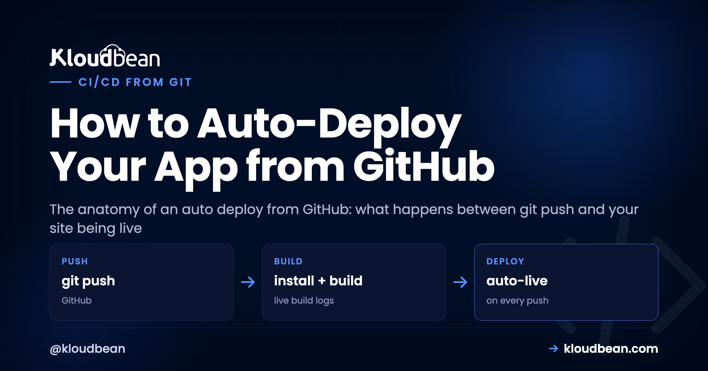

# How to Auto-Deploy Your App from GitHub (CI/CD)

You built something in Lovable, Bolt, or Cursor, shipped it once, and now every little fix means clicking through a deploy by hand. That gets old fast. The fix is to auto deploy from GitHub: wire the repo up once so a single `git push` builds and ships the app for you. This piece is the anatomy of that pipeline, stage by stage, from the moment you push to the moment the new version answers a request. And because knowing how it breaks matters as much as knowing how it runs, I'll flag exactly where each stage fails and how to read it.

> **The short version.** An auto deploy from GitHub is a chain reaction on the server: you push a branch, a webhook fires, the server pulls the code, installs dependencies, runs your build, then restarts the app process on the new version. Set your Build and Start commands once, do a single manual deploy to prove they work, then switch on automated deployment. After that, `git push` is the deploy. Most failures aren't code bugs, they're a missing env var or a build step that never had a chance to run.

## What actually happens between git push and live

People treat push-to-deploy as a black box. Code goes in one end, a live site comes out the other, and when it breaks the whole thing feels like magic that stopped working. It isn't magic. It's a short, ordered sequence, and every stage has one job. Once you can name the stages, a failed deploy stops being a mystery and becomes "which box lit up red."

Here's the whole chain. A push lands on your deploy branch. A webhook tells the server. The server pulls the new commit, runs your install step, runs your build, and restarts the app on the fresh code. Then it's live. Six moving parts, one trigger.

<!-- DIAGRAM: the deploy pipeline as a horizontal flow — git push, webhook, pull, install, build, restart, live — with failure callouts under the relevant stage: install (lockfile out of sync / wrong Node), build (a real error stops the pipeline, live app stays up), restart (won't boot, usually a missing env var, that's the 503), pull (wrong branch or bad credentials, nothing ships). Caption: a broken build stops the pipeline, it doesn't ship a half-built site over the working one. -->

## The pipeline, stage by stage (and where each one breaks)

Same seven stages, in a table you can keep next to the build log. When a deploy fails, find the last green stage and read the one after it.

| Stage | What runs | Where it breaks |
| --- | --- | --- |
| Push | You push a commit to the deploy branch | You pushed a different branch than the one linked. |
| Webhook | GitHub pings the server that new code exists | Repo disconnected, or the push went somewhere else. |
| Pull | Server fetches the exact commit you pushed | Wrong branch or a credential that expired. |
| Install | Your install command runs (`npm ci`, `pip install`) | Lockfile out of sync, or the Node version doesn't match. |
| Build | Your build command compiles the app | A real code or config error. The pipeline stops here. |
| Restart | The app process swaps to the new version | Won't boot. Usually a missing env var or an unrun migration. |
| Live | The new version answers requests | You're done. Check the log if behavior looks off. |

Two of those stages deserve a closer look, because they cause most of the pain. The build stage is where a genuine mistake surfaces, and it's the stage I actually want to fail loudly. A build that errors should halt the deploy right there. It should never quietly ship a half-compiled bundle on top of the version that was working. The restart stage is where a build that passed still leaves you with a dead app, and the reason is almost never the code you just wrote.

## Manual deploys vs auto deploy from GitHub

I'll be blunt about this one, because I think the answer is clear for almost everyone building an app today. Dragging a build folder up over FTP, or SSHing in to `git pull` and restart by hand, is a habit worth dropping. Not because it can't work, but because it's you doing, every single time, a job a machine does identically and never forgets a step of.

| | Manual / FTP-style deploy | Auto deploy from GitHub |
| --- | --- | --- |
| Trigger | You, remembering to do it | A `git push` |
| Build step | Whatever you ran locally (or forgot to) | Same commands on the server, every time |
| Consistency | Drifts with your mood and memory | Identical on every deploy |
| Bad build | Might ship half-uploaded files | Stops the pipeline, live app untouched |
| Record of what shipped | In your head | Build & Deployment History, with logs |

The consistency is the real prize. Every deploy runs the same install and build on the same machine, so the "works on my laptop, broke on the server" gap shrinks to almost nothing. You stop shipping the wrong branch. You stop forgetting the build. The cost of a one-line fix drops to a commit and a push, which means you actually ship the small fixes instead of hoarding them for a scary batch deploy later.

## Set up auto deploy from GitHub on Kloudbean

The setup is short because it's the same Git deployment you'd do manually, with one toggle at the end. In the [Kloudbean](https://www.kloudbean.com/) console, open your app and go to **Application Administration → Deploy Code**. That's the Git Deployment screen where the whole pipeline lives.


Connect GitHub over OAuth, paste your **Git Repository URL**, pick the branch, and **Clone Repository**. Then set the fields that the pipeline actually runs on every deploy:

- **App Directory:** the folder holding your `package.json` (or equivalent).
- **Port:** the assigned port. Your app must listen on `process.env.PORT`.
- **Install / Build / Start:** for a Node app that's usually `npm ci`, then `npm run build`, then `npm start`. These are the exact commands the install, build, and restart stages will run.

Now the part people skip and regret: **do one manual deploy first.** Hit **Pull & Deploy** and watch the live build log stream in the console. Confirm the app comes up on its temporary URL and works. Automating a deploy that has never succeeded once just automates a failure and hides it behind a toggle. Prove the commands are right by hand, then make them automatic.

Once that manual deploy is green, switch on **automated deployment** for the branch. That's it. From now on, every push to that branch runs the whole pipeline: pull, install, build, restart. Your loop collapses back to writing code, committing, and pushing, which is exactly where it should be. If you'd rather trigger the same build-and-ship over SSH, `sudo adm` runs the deploy utility from the command line.

<!-- ADD IMAGE: the Build & Deployment History list showing a green deploy above a failed one, with timestamps and commit messages -->

## Where the pipeline breaks, and how to read it

Here's the thing worth internalizing, and it comes straight from watching a lot of these fail: the most common broken auto deploy isn't a code bug at all. It's a missing environment variable. The build passes cleanly because the build didn't need the variable. Then the app tries to boot, reaches for `DATABASE_URL` or an API key that exists on your laptop but was never set on the server, and the process dies before it can serve a request. Green build, dead app, a 503 in the browser. If you set up nothing else carefully, get your [environment variables done right](https://www.kloudbean.com/blog/environment-variables-done-right/) before you trust the automation.

### Read the build log first, always

Every deploy streams a live build log, and finished deploys are kept in **Build & Deployment History** with their logs attached. Don't guess at a failure. Open the log and find the last thing that ran. If it died during install, it's dependencies. If it died during build, it's your code or config. If the build finished and the app still won't answer, the process failed to boot, and the real reason is in the app's own error log:

```
/home/admin/hosted-sites/<app_system_user>/app-logs/app.error.log
```

Nine times in ten that file names the exact variable it wanted, or the exact line it choked on. The full walkthrough of that failure is in [fixing a 503 after deploying](https://www.kloudbean.com/blog/fix-503-after-deploying-your-app/).

### The migration that didn't run

This is the sneaky one, because the code is fine. You add a column, your new code expects it, you push, the build passes, the app boots, and then it throws the first time it queries the table because the database was never migrated. The fix is to make the migration part of the deploy, so schema and code ship as one unit. Add your migration to the build or start step, for example `npx prisma migrate deploy`, so every automated deploy applies pending migrations before the new version serves traffic. Pair it with a [managed database on the same server](https://www.kloudbean.com/blog/add-managed-database-to-your-app/) and the whole change travels together.

### Rolling back when a bad one slips through

A failed build doesn't take your site down, and that's by design. The deploy doesn't complete, so the currently-running version keeps serving while you fix things. But sometimes a deploy succeeds and the change itself is bad. Because every deploy maps to a commit, rollback is just redeploying the last good commit, or pushing a revert. You're always one action from the previous working state, and knowing that is what makes leaning on the automation reasonable instead of nerve-wracking.

> **A branch strategy that keeps this calm.** Point `main` at production and only merge when you mean to ship. Run a second app on the same server from a `staging` branch, with its own subdomain and its own database and env vars, and push there first. Feature branches stay unlinked until they're ready to merge. Nothing reaches real users until you've clicked around the staging copy. It costs nothing extra, because staging is just [another app on the server you already own](https://www.kloudbean.com/blog/host-multiple-apps-one-server/).

## Is this really CI/CD, or just the CD half?

Fair question, and the honest answer is that this is continuous deployment: build and ship on push. It is not, by itself, a full continuous-integration system with test matrices and approval gates. That distinction matters, so don't let anyone sell you the toggle as more than it is. What you do get is the deployment half that the polished platforms are famous for, running on a Linux server you own.

If you want real CI on top, layer it. Keep GitHub Actions (or your CI of choice) running your tests, linting, and type-checks on every pull request, and require them to pass before a merge. Then let the server deploy whatever lands on the branch. Actions guards what gets into `main`; the server ships what's there. For lighter needs, just run your test command as part of the build step so a failing test fails the build and stops the deploy. Either way you're not choosing between simple push-to-deploy and having tests. You stack them. That's how a continuous deployment server and a CI pipeline are meant to fit together for a vibe-coded app or a serious one.

<!-- ADD IMAGE: a live build log mid-deploy, paused on the install or build step, so readers see what "reading the pipeline" looks like -->

## The honest scope

Automated deployment on Kloudbean runs on your **Linux** server: it pulls your branch, runs your install and build commands, and swaps the app to the new version on each push, with the log streaming as it goes. It handles PHP, Node, Python, Ruby, and Java stacks, not Windows or .NET. "Managed" means the platform runs the server, stack, SSL, and backups while you own the app code and its build configuration. Within that scope, git push to deploy is the whole point: the same developer experience the per-app platforms rent you, on infrastructure that's actually yours. If you're just getting the app onto a server in the first place, start with the [deploy an AI-built app guide](https://www.kloudbean.com/blog/deploy-ai-built-app-to-production/) or the Node-specific [managed cloud walkthrough](https://www.kloudbean.com/blog/deploy-node-app-to-managed-cloud/).

**Push. Build. Live.** Wire up auto deploy from GitHub at [kloudbean.com](https://www.kloudbean.com/) with a free trial and your first migration done for you. Add a custom domain and free SSL from the [domain and SSL guide](https://www.kloudbean.com/blog/custom-domain-and-ssl-for-your-app/), and check server sizes on [pricing](https://www.kloudbean.com/pricing/).

## FAQ

**How do I make my app deploy automatically on every push?**
Connect your repo in Deploy Code over GitHub OAuth, set your Install, Build, and Start commands, and complete one successful manual deploy to confirm they work. Then enable automated deployment for your branch. After that, each push to that branch makes the server pull, install, build, and restart the app on the new version automatically.

**Is this real CI/CD?**
It's the continuous-deployment half: build and ship on push. For continuous integration (running tests and gating merges), pair it with GitHub Actions on your pull requests, or run tests inside your build command so a failing test fails the build. Together they give you a full pipeline on a continuous deployment server you own.

**What's the most common reason an auto deploy fails?**
A missing environment variable, more often than a code bug. The build passes because it doesn't need the variable, then the app can't boot because a value it reads at startup (like a database URL or API key) was never set on the server. The app error log usually names the exact key. Set it and redeploy.

**Does a failed build take my site down?**
No. If the build fails, the deploy doesn't complete and your currently-running version keeps serving. You read the build log in Build & Deployment History, find the stage that broke, fix it, and push again. A broken build stops the pipeline instead of shipping over the working app.

**How do I roll back a bad deploy?**
Because each deploy maps to a commit, redeploy the previous working commit or push a revert. You're one action from the last good version, which is what makes relying on git push to deploy comfortable rather than risky.

**How do I avoid breaking production?**
Use a branch strategy: deploy `main` to production and only merge when you mean to ship, and run a `staging` branch to a preview app (another application on the same server) with its own database and env vars, so you test changes before they reach real users.

By Kloudbean · Managed multi-cloud hosting. Build. Deploy. Scale — Faster Than Ever.
