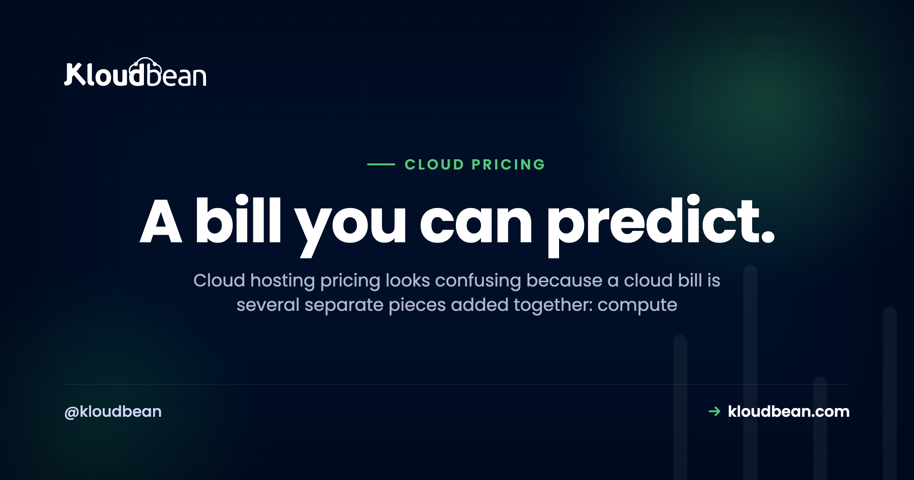
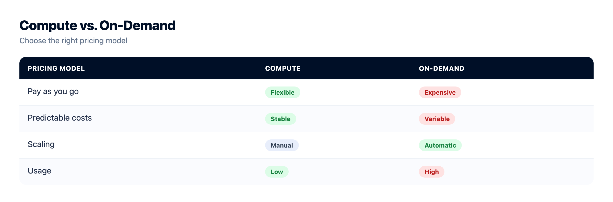
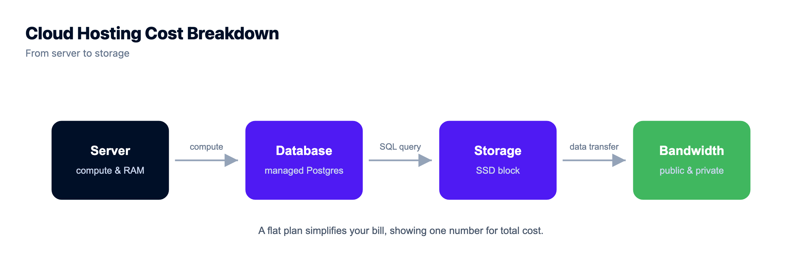

# Cloud Hosting Pricing, Explained: What You're Actually Paying For

Cloud hosting pricing has a reputation for being confusing, and that reputation is earned. But the confusion is about packaging, not math. A cloud bill isn't one number. It's a handful of separate charges stacked together, and the moment you can name each one, the whole invoice turns readable.

So this is a plain-English decode: how cloud hosting is priced, why the total so often lands higher than the sticker, and how to read a pricing page without getting fooled. Every figure here is illustrative, picked to show the shape of a bill, not to quote anyone. Prices move around by provider and region. The shape doesn't.

> **The short version.** A cloud bill is compute + storage + bandwidth (egress) + managed add-ons, sometimes plus support. Compute (the server) is the biggest and most predictable line. Egress, the data served out to your users, is the one that surprises people, because it grows with your traffic. Flat plans trade a little flexibility for a number you can budget. Metered plans flex with usage, and wander.

## Why the bill beats the sticker

Almost every price you see advertised is the compute rate. The server. That number is real, and it's usually the honest majority of your cost. But it's the floor, not the total. Around it sit the lines nobody puts in the big font: the storage your app sits on, the data you serve back out, the managed database you didn't want to run yourself, the backups. None of them are hidden, exactly. They're just quiet. And quiet is enough to make an invoice feel like a surprise.

Fix that and the mystery evaporates. You only need to know the pieces, roughly what drives each one, and which one moves when your app gets popular. Let's name them.

## How cloud hosting pricing actually works: three models

Before the line items, know which *shape* of pricing you're standing in. Almost everything sorts into three models, and the model matters more than the rate.

- **Flat / predictable.** A set monthly price for a defined server and a bundle of included resources. The number is the number. Easy to budget, and it doesn't twitch when you get a good day of traffic.
- **Metered / pay-as-you-go.** You're billed for what you use: compute-hours, gigabytes stored, gigabytes transferred, sometimes per request. Flexible, and genuinely fair when usage is low. The catch is that the bill is only knowable after the month happens.
- **Per-seat SaaS.** Common on managed platforms and tools layered on top of hosting. You pay per user or per seat. Fine until the team grows, or until you're paying for five seats and using two.

| | Flat / predictable | Metered / pay-as-you-go | Per-seat SaaS |
|---|---|---|---|
| **Bills by** | A monthly plan | Actual usage | Users / seats |
| **Bill varies?** | No, steady | Yes, with usage | Steps up per seat |
| **Easy to budget?** | Yes | Hard until the month ends | Medium |
| **Best for** | Steady, known workloads | Spiky or unknown scale | Team tools |
| **Watch out for** | Paying for a little headroom | Egress and request spikes | Idle seats |

Here's the same workload drawn two ways over time. Flat is the line you can plan around. Metered is honest about usage, but it wanders, and the peaks tend to arrive exactly when your app is doing well.

<!-- Flat-vs-metered line chart in the HTML: a flat green line you can budget, versus a jagged purple sawtooth (metered) that spikes above it whenever traffic spikes. Axes are monthly cost against time/traffic. -->

## The line items on a cloud bill, one at a time

Whichever model you're on, the same underlying things get charged. There are really only four that matter, plus support.

### Compute: the main lever

Compute is the server itself, its CPU cores and memory. It's usually the biggest line, and it's the one you control most directly by picking a size. Bigger box, bigger number. The good news is it's **predictable**: choose a size, know the rate, and it doesn't move unless you resize. A traffic spike doesn't change it. Get this line right first, because it sets the bulk of your bill on purpose.


### Storage: usually small, occasionally not

Storage comes in two flavours. **Disk** attached to the server (OS, your app, working files) is a modest line that scales with how much you provision. **Object storage** (buckets for media, uploads, backups) is cheap per gigabyte and scales with how much you keep. For most apps this is a few dollars, a rounding error next to compute. It only grows into something you notice if you're hoarding media or large datasets, and even then it climbs gently. If you serve a lot of files, [S3-compatible object storage](https://www.kloudbean.com/blog/s3-compatible-object-storage/) is the piece doing that work.



### Bandwidth (egress): the line that surprises people

This is the one that catches everyone. **Egress** is data leaving your hosting: every page served, image loaded, video streamed, file downloaded. Data coming *in* is usually free. Data going *out* is often metered, and because it scales with your *traffic*, it can quietly balloon precisely when your app gets popular. A media-heavy site can watch egress dwarf its storage. The mental model is short:

```
egress cost  ≈  (GB served out)  ×  (per-GB rate)
so:  more traffic  →  bigger number, and you find out at month-end
```

That's the whole trap in one line. A low per-GB rate feels harmless right up until the gigabytes pile up. On a flat plan, a bandwidth allowance is bundled and the surprise mostly disappears. On a metered plan, this is the line to watch like a hawk.

### Requests: the serverless twist

On serverless and function platforms, you're also billed per **request** (and per millisecond of execution). It sounds almost free per unit, and it is, until a chatty front end or a crawler multiplies your request count by a thousand. Same lesson as egress: the per-unit rate isn't the bill. The *volume* is.

### Managed add-ons: paying to not do it yourself

Beyond the raw server, you pay for the managed services you bolt on:

- **Managed databases.** A [PostgreSQL](https://www.kloudbean.com/blog/managed-postgresql-hosting/), MySQL, or Redis priced by size, with patching and backups folded in.
- **Load balancer.** For spreading traffic across servers once you scale out.
- **Backups.** Automated, off-server copies you can actually restore.

Each line is you paying to *not* build and babysit that thing. On managed hosting, a lot of this (SSL, patching, base backups) is folded into the plan rather than billed à la carte. That's what "managed" buys, and it's why comparing a managed plan to a bare server on price alone is a category error. One number includes the work. The other doesn't. There's a fuller version of that argument in [managed vs unmanaged hosting](https://www.kloudbean.com/blog/managed-vs-unmanaged-hosting/) and [the real cost of an unmanaged VPS](https://www.kloudbean.com/blog/the-real-cost-of-unmanaged-vps/).


## Why metered bills are so hard to predict

Here's the uncomfortable part. The two lines that scale with success, egress and requests, are exactly the two you can't forecast, because you can't forecast a good week. You can size compute for what you're running. You cannot size traffic for a post that does numbers. So a metered bill isn't unpredictable because the provider is shady. It's unpredictable because *your own growth* is the input, and growth is lumpy.

That's not an argument against metered pricing. It's an argument for knowing which model you're on before the app takes off, and for reading the transfer line before you sign up rather than after the invoice.


## How to read a pricing page without getting fooled

Five minutes with a pricing page, in this order, and you'll know your real number before you commit:

- **Find the model first.** Flat plan, or metered? That single fact tells you whether the headline price is your bill or just the start of it.
- **Read past the big number.** The hero price is almost always compute. Scroll to storage, transfer, and add-ons.
- **Hunt for the transfer / egress line.** It's the most-skipped and most-surprising line on the page. If it's metered, estimate it against your expected traffic, not your current traffic.
- **Check what's included.** SSL, backups, and support are sometimes bundled and sometimes billed. A slightly higher plan that includes them can beat a cheaper one that doesn't.
- **Use the calculator, then add a buffer.** Many providers offer a cost calculator. Great. Fill in a busy month, not a quiet one.

## An illustrative monthly breakdown

To make the shape concrete, here's what the pieces look like for a small production app. These aren't quotes, and they're deliberately qualitative, just to show which line dominates:

| Line item | What to expect (illustrative) |
|---|---|
| Compute (small server) | The bulk of the bill |
| Disk storage | Small, usually a few dollars |
| Managed database (small) | Similar order to compute |
| Object storage (media) | Small, grows with what you keep |
| Bandwidth (egress) | Variable on metered; bundled on flat |
| **Where the money is** | **Compute + any database** |

As a rough example, a small app often lands in the low tens of dollars a month, with compute and a database as the bulk and everything else as trim. Your numbers will differ. The pattern won't: size compute deliberately, keep an eye on egress, and the rest is noise. If you're pricing a hobby build specifically, [what a side project really costs](https://www.kloudbean.com/blog/cost-of-running-a-side-project/) runs the same math for smaller stakes.

## Flat or metered? My honest take

I'll take a side here, because "it depends" is a cop-out. For a steady small-to-mid workload, a predictable flat plan beats metered almost every time, and not because it's cheaper on a spreadsheet. It's because you can *budget* it. A number you can plan around is worth more than a slightly lower number you can't. You stop refreshing a usage dashboard. You stop rationing traffic. You just build.

Metered earns its place when scale is genuinely spiky or unknown: a launch you can't size, a batch job that runs twice a month, an app that might get ten users or ten thousand. There, paying only for what you use is the honest deal. But for the workhorse app that hums along at a known size? Flat. Every time. The peace of a predictable invoice is a real feature, and it's underrated.



## How Kloudbean keeps the bill readable

This is where the decoding pays off, whoever you host with. Kloudbean leans hard into the predictable side: a flat plan for the server, with the whole stack (app, managed database, object storage, load balancer, static sites) living on one dashboard and one bill instead of scattered across a dozen metered line items you reconcile at month-end. SSL is free. Backups, patching, and a Shorewall plus Fail2ban baseline are handled, so they're not separate invoices or separate chores. You still own the app and the data, and it's a Linux stack underneath, so nothing's locked in a box you can't open.

You also see the compute rate before you provision, which is the whole point of this article: know the number, then click. And the parts that scale with success sit on a plan rather than a meter, so a good traffic day is good news, not an anxious glance at a dashboard. If your goal is trimming an existing bill rather than sizing a new one, [how to cut your cloud bill](https://www.kloudbean.com/blog/how-to-cut-your-cloud-bill/) is the practical companion, and if you're weighing free options first, [free app hosting options](https://www.kloudbean.com/blog/free-app-hosting-options/) and [is free hosting worth it](https://www.kloudbean.com/blog/is-free-hosting-worth-it/) come at cost from the other end.

<!-- cta:start -->
**Prototype to production, without the babysitting.**

Run the app as an always-on process with managed databases, Redis, object storage, and automatic backups beside it. Deploy from Git with live build logs, and keep the infrastructure someone else's problem.

- Managed databases
- Always-on processes
- Object storage
- Automatic backups
- Free SSL
- Git deploy
- Free migration

[Start free](https://console.kloudbean.com/register) · [See plans](https://www.kloudbean.com/pricing/)
<!-- cta:end -->

## FAQ

**What do you actually pay for in cloud hosting?**
Four things, added together, sometimes plus support: compute (the server's CPU and RAM), storage (disk and object storage), bandwidth or egress (data served out to users), and managed add-ons (databases, load balancers, backups). Compute is usually the biggest and most predictable line. Egress is the one most likely to surprise you, because it grows with traffic.

**Why is my cloud bill higher than the advertised price?**
Because the advertised price is almost always just the compute rate. The server. Around it sit storage, managed add-ons like databases and backups, and especially egress (bandwidth served out), which scales with your traffic and is easy to overlook. Read past the headline number to the transfer and add-on lines and the total stops being a shock.

**What is egress, and why does it wreck cost estimates?**
Egress is data leaving your hosting: pages, images, video, and downloads served to users. It's often metered while data coming in is free, and because it grows with traffic, it can become a large, variable part of the bill exactly as your app gets popular. You can size compute for a known workload, but you can't size a good week of traffic, which is why egress breaks naive estimates.

**What's the difference between metered and flat cloud pricing?**
Metered (pay-as-you-go) bills you for actual usage: compute-hours, gigabytes stored, gigabytes transferred, sometimes per request. It's flexible but variable and only knowable after the month. Flat (plan-based) charges a set monthly price for a defined server and included resources, which is predictable and easy to budget. Metered suits spiky workloads; flat suits steady ones.

**Is flat or pay-as-you-go pricing cheaper?**
Neither wins on price alone, and that's the point. For a steady, known workload, a flat plan is usually the better deal because you can budget it and a busy day doesn't move the number. Pay-as-you-go can be cheaper for genuinely low or spiky usage, but it trades predictability for that flexibility. Pick the model that matches how your traffic behaves, not the lowest per-unit rate.

**How do I estimate my cloud hosting cost before committing?**
Start with the server size, since that's most of the bill. Add a managed database if you need one, estimate your storage, then check how bandwidth/egress is billed against a busy month, not a quiet one. Use the provider's cost calculator if there is one, and add a buffer. A five-minute sketch turns cloud pricing confusion into a number you can plan around.

**What is per-seat or per-user pricing?**
It's a model common on managed platforms and tools layered over hosting, where you pay per user or seat rather than per server or per gigabyte. It's predictable per person but climbs with team size, and the classic waste is paying for seats nobody uses. Audit your seat count the same way you'd audit an egress line.

**Does managed hosting cost more than a raw server?**
On the sticker, yes, because a managed plan folds in work a raw server leaves to you: setup, patching, SSL, backups, and monitoring. Comparing the two on price alone is misleading, since one number includes those hours and the other doesn't. Add the value of your time to the raw-server side and the gap usually closes or flips.

**How can I avoid surprise cloud bills?**
Prefer a predictable model for steady workloads, read the egress and add-on lines before you sign up, and set billing alerts if you're on a metered plan. Keeping the whole stack on one plan and one dashboard, rather than a dozen metered services, also removes most of the month-end reconciliation where surprises hide.

---

*By Kloudbean · A bill you can predict.*
