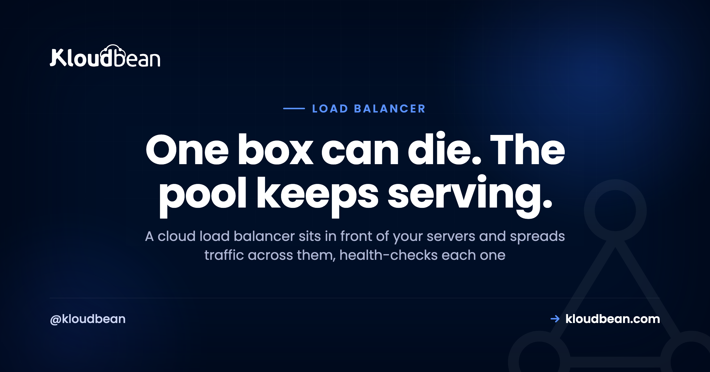

# What Is a Cloud Load Balancer? A Plain-English Explainer

It's 2am. One of your two web servers just locked up. No alert wakes you, no user notices a thing, because traffic quietly shifted to the server that's still healthy. That's a cloud load balancer earning its keep.

The idea is old and simple. A load balancer sits in front of several servers and hands each incoming request to one that's ready to answer. To a visitor it's invisible. They type your domain, they get your site, and they never know which of your servers actually did the work. Let's take it apart, because the details are where load balancers either save you or bite you.

> **Short version:** A cloud load balancer sits in front of your backend servers and spreads incoming requests across them. It runs health checks and stops routing traffic to any server that goes quiet, and it usually terminates SSL too. The payoff: one server can fail and your site stays up, and you can add servers to handle more traffic instead of buying one ever-bigger box.

## What a cloud load balancer actually does

It's a piece of infrastructure that sits **in front of** your servers and distributes incoming traffic across them. Visitors connect to the load balancer at your domain. It forwards each request to one of your **backend servers**, the machines actually running your app. People call that group of backends a "pool," and each server in it a "node." Instead of one machine carrying everything, two or three or ten share the work.

That's the whole concept. Everything below is detail about how it chooses, how it survives a failure, and when the added moving parts are worth it.

```
                          -> [ Server A ]  healthy
[ Visitors ] -> [ Load balancer ] --X-> [ Server B ]  DOWN, removed
   (SSL ends here, health checks)  -> [ Server C ]  healthy
```
*The balancer fans each request to a healthy node. Server B failed its health check, so it's pulled from rotation until it recovers. Visitors never notice.*

## The real win: one box can die and nobody notices

Capacity gets the headlines, but survival is the underrated part. A load balancer runs a **health check** against each backend on a schedule, often a quick request to a path like `/health` every few seconds. Miss a few in a row and that node gets pulled from the pool automatically. When it starts answering again, it's added back.

So the load balancer is the piece that takes you from "one box that can die" to "a pool that survives a node failure." That's the shift. A single server is a single point of failure, and the day it falls over, you're down. Put two behind a balancer and a dead node becomes a shrug instead of an outage.

## How it picks which server: round-robin, least-connections, and friends

Simpler than most people expect. The common default is **round-robin**: request one to A, two to B, three to C, then back to A. **Least-connections** sends the next request to whichever node has the fewest active connections, which helps when some requests run long and others finish instantly. There's also IP hash, which pins a given client to the same node.

Honestly, round-robin is fine for the large majority of apps. Don't agonize over the algorithm. The health check matters far more than the distribution rule. You'll also see "Layer 4" versus "Layer 7" balancers, which is just whether it routes on raw TCP connections or actually understands HTTP. For a normal web app, an HTTP-aware (Layer 7) balancer is the default and you rarely think about the distinction.

## SSL termination: the balancer's other job

Most load balancers also handle **SSL termination**, meaning the HTTPS connection ends at the balancer. It holds the certificate, decrypts the request, and passes it to a backend over the private network. That's one place to manage and renew certificates instead of copying them onto every node. If you need encryption all the way to the backend, the balancer can re-encrypt on the way in, but for most setups terminating at the edge is clean and fast.

<!-- ADD IMAGE: A health-check status view, each backend node listed with its pass or fail state and the last check time. -->

## The session gotcha that logs everyone out

This one bites people, so read it twice. Say a visitor logs in and their session gets stored **on Server A**. Their next request lands on **Server B**, which knows nothing about that session, so they suddenly look logged out. You get random, hard-to-reproduce logouts that only show up under load. Miserable to debug.

Two clean fixes. **Sticky sessions**, where the balancer keeps pinning a visitor to the same node. Or, better, a **shared session store** like [managed Redis](https://www.kloudbean.com/blog/managed-redis-hosting/) that every node reads from, so it stops mattering which server handles a request. The shared store is the robust answer because any node can serve any visitor. Same rule for uploads: write them to object storage, not a node's local disk, or they'll vanish the moment a request lands elsewhere. Making the app stateless like this is the prerequisite for running behind a balancer at all.

| | One server | Load-balanced pool |
| --- | --- | --- |
| **A server crashes** | Site goes down | Traffic reroutes, site stays up |
| **Handling more traffic** | Resize the one box, until you hit a ceiling | Add another node to the pool |
| **Shipping a deploy** | A downtime window | Roll one node at a time, zero downtime |
| **Sessions** | Simple, in-process | Need a shared store or sticky sessions |
| **Monthly cost** | One server | Balancer plus two or more servers |

## Do you actually need one yet?

Usually not, if you're small, and I'd rather say that plainly than sell you complexity. A single well-sized server handles a surprising amount of traffic before it breaks a sweat. Adding a balancer before you need it is moving parts and a bit of extra cost for a problem you don't have.

Reach for one when a single server genuinely isn't enough. Either you've outgrown the biggest sensible box, or you need redundancy so one node dying doesn't take you offline. Both are real reasons. "It sounds professional" is not. Until you hit one of them, a single server that you resize as you grow is simpler and cheaper.

## Load balancer vs CDN: not the same thing

People blur these constantly. A **CDN** caches your content at locations around the world and serves it from near each visitor, which is great for static files and global speed. A load balancer distributes live, dynamic requests across your backend servers, which is about scale and redundancy. Different layers, different jobs. They often run together: a CDN out front for cached assets, a load balancer behind it spreading the requests that actually hit your app.

## How it works on Kloudbean

Kloudbean's **Flexible Load Balancer (FLB)** is built into every account. It's off by default, but it isn't a separate product or a tier you have to buy up into. You enable it when you need it. You get virtual load balancers with application pools, SSL management at the balancer, and access logs so you can see what's flowing through.


The division of labour is honest: the platform runs the balancer and watches your nodes with health checks, and you own the app and [keep it ready to run across several servers](https://www.kloudbean.com/blog/deploy-node-app-to-managed-cloud/) with shared sessions and shared uploads. Add a second node when one isn't enough, and you've turned a single point of failure into something that survives a bad night. If you're weighing this against automatic scaling, read [autoscaling: do you actually need it](https://www.kloudbean.com/blog/autoscaling-explained/). For deeper cuts, see [scaling WordPress](https://www.kloudbean.com/blog/scalable-wordpress-hosting/), [scaling the database with read replicas](https://www.kloudbean.com/blog/database-read-replicas-scaling/), and keeping backends private inside [a VPC](https://www.kloudbean.com/blog/what-is-a-vpc/).

---

**Turn one box that can die into a pool that survives.** Enable a built-in load balancer in front of your app the day one server isn't enough. Health checks, SSL management, and access logs handled, on servers and databases you own. Start free at [kloudbean.com](https://www.kloudbean.com/) · compare plans on [pricing](https://www.kloudbean.com/pricing/).

Built-in Flexible Load Balancer · Health checks · SSL management · Access logs · 7 clouds · Free trial

## FAQ

**What is a cloud load balancer?**
It's infrastructure that sits in front of your servers and distributes incoming traffic across them. Visitors connect to the load balancer at your domain, and it forwards each request to one of your backend servers. That spreads the work so several servers share the load, and it lets your site survive a single server failing.

**When do I need a load balancer?**
When one server isn't enough. Either you've outgrown the largest sensible single server and need to spread traffic across several, or you need redundancy so a server failure doesn't take your site offline. Small and medium sites on one well-sized server usually don't need one yet. Add it when the scale or uptime need is real.

**How does a load balancer handle a server failure?**
Through health checks. The balancer pings each backend on a schedule, and if one stops responding it gets pulled from rotation automatically. Traffic goes only to the healthy nodes until the failed one recovers, then it rejoins the pool. That's what keeps your site up through a server dying, and it's the main reason to use a balancer beyond raw scale.

**What's the difference between round-robin and least-connections?**
Round-robin sends requests to each node in turn: A, B, C, then back to A. Least-connections sends the next request to whichever node has the fewest active connections, which balances better when some requests run long and others finish fast. Round-robin is fine for most apps. The health check matters more than the algorithm.

**Do load balancers cause login problems?**
They can, if sessions live on individual servers. A visitor logged in on one node may appear logged out when routed to another. The fix is sticky sessions, which pin a visitor to one node, or better, a shared session store like Redis that every node reads from. Sort this out before you go load-balanced.

**Does a load balancer handle SSL?**
Usually, yes. Most load balancers terminate SSL, meaning the HTTPS connection ends at the balancer, which holds the certificate and passes requests to your backends over the private network. That gives you one place to manage and renew certificates instead of copying them to every node. Kloudbean's Flexible Load Balancer includes SSL management.

**What's the difference between a load balancer and a CDN?**
A CDN caches content at global locations and serves it from near each visitor, mainly speeding up static files. A load balancer distributes live requests across your backend servers for scale and redundancy. They solve different problems and often work together: a CDN for cached content out front, a load balancer spreading the dynamic requests behind it.

**How much does a cloud load balancer cost?**
The balancer itself is a modest, predictable line on your bill, on top of the backends it fronts. The bigger cost of going load-balanced is the extra server or servers, since a balancer implies more than one backend. That's the price of redundancy and horizontal scale, and it's usually money well spent once you genuinely need it.

---

*Kloudbean · One box can die. The pool keeps serving.*
