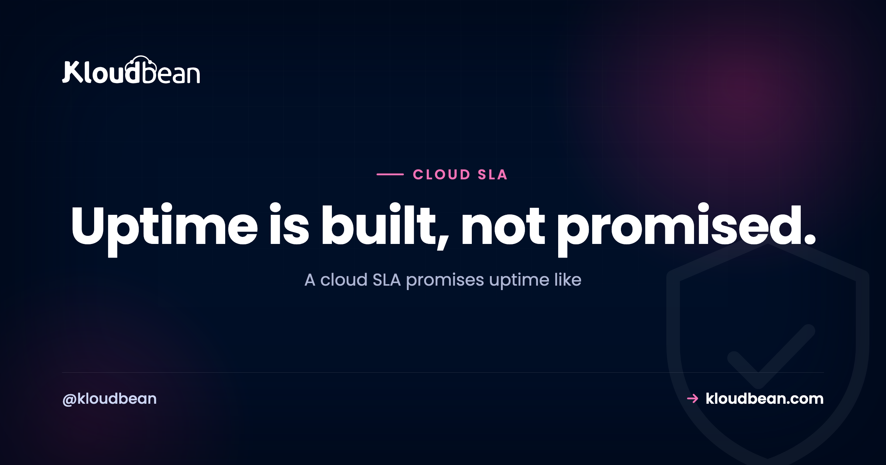

# Cloud SLA, Decoded: What "99.9% Uptime" Actually Buys You

Every host slaps it on the pricing page. "99.9% uptime!" It reads like a promise of near perfection. But a cloud SLA is a legal document, not a comfort blanket, and 99.9% is not 100%. That missing tenth of a percent is a real, countable number of hours your site can sit dark while the provider still keeps its word.

So let's decode a cloud SLA in plain English. The nines in actual hours. What a service credit really pays. And why the number on the sales page is the floor, not the guarantee. By the end you'll read any uptime SLA the way a procurement lawyer does: as a specific, checkable amount of allowed downtime with a refund attached.

> **The short version:** A cloud SLA is a promise (we'll be up X% of the time) plus a penalty (a service credit if we miss). 99.9% uptime allows about 8.77 hours of downtime a year and still counts as kept. The credit refunds a slice of your bill, not your lost sales. And the SLA covers the provider's infrastructure, not your single server or your bad deploy. Real uptime comes from running redundant servers behind a load balancer, not from a bigger number on the page.

## What a cloud SLA actually is

Strip away the marketing and a cloud SLA (service level agreement) is two things bolted together. A **promise**: we'll keep this available X% of the time. And a **penalty**: if we don't, here's what you get back. Drop the penalty and you don't have an SLA. You have a slogan. The penalty is what turns a soothing percentage into something the provider is actually on the hook for.

So the first question about any SLA isn't "how many nines?" It's "what happens the day you miss?" If the answer is vague, the number is decoration. Honestly, an SLA is closer to a refund policy than a force field. It doesn't stop the outage. It tells you what the provider owes you after one.

## The nines, in real hours

Here's the part the sales page never spells out. Each uptime percentage maps to a hard amount of downtime that's still "within SLA." Climb the staircase below. Every extra nine cuts the allowed downtime by roughly ten times.

```
The nines staircase (downtime still allowed per year)

  more nines  ^                                    ____________
              |                              99.999%  ~5.26 min
              |                         ____________
              |                   99.99%  ~52.6 min
              |               ____________
              |          99.95%  ~4.38 hrs
              |     ____________
              | 99.9%  ~8.77 hrs
              |____________
                99%  ~3.65 days
              +-------------------------------------------------->
              each step up = ~10x less downtime, and ~10x more cost
```

Same numbers, in a table you can scan:

| Uptime | Downtime / year | Downtime / month |
| --- | --- | --- |
| **99%** (two nines) | ~3.65 days | ~7.3 hours |
| **99.9%** (three nines) | ~8.77 hours | ~43.8 minutes |
| **99.95%** | ~4.38 hours | ~21.9 minutes |
| **99.99%** (four nines) | ~52.6 minutes | ~4.4 minutes |
| **99.999%** (five nines) | ~5.26 minutes | ~26 seconds |

Look at the second row again. **99.9% uptime allows almost nine hours of downtime a year**, and the host has still met its promise. That's a full working day where your site could be unreachable, entirely "within SLA." Jump to 99.99% and the yearly allowance drops to under an hour. One extra nine, a wildly different experience for your users.

<!-- ADD IMAGE: a real provider SLA page with the uptime percentage and the exclusions clause highlighted -->

## What even counts as "down"?

This is where the fine print earns its keep, and where two SLAs with the same number can mean very different things. Check three clauses before you trust any percentage.

- **What counts as downtime.** Plenty of SLAs exclude *scheduled maintenance* entirely. So a planned four-hour outage at 2am might not dent the number at all, even though your site was flat on its back.
- **What's excluded outright.** Force majeure, network problems outside the provider's control, and anything caused by your own config usually don't count. Fair enough, but know it's there.
- **How it's measured.** Over what window? Measured from where? Who decides an outage happened? A 99.99% that excludes maintenance and is measured generously can feel worse in practice than a plainly stated 99.9%.

The percentage alone tells you almost nothing. The definitions wrapped around it tell you everything.

## What a service credit actually pays

Now the part that surprises people the first time they file a claim. When a host misses its SLA, the penalty is almost always a **service credit**: a percentage of *your hosting bill* knocked off next month. It is not compensation for *your* lost revenue.

Do the math on that. Say an outage during a launch costs you a few thousand dollars in sales. The SLA credit might be 10% of a hosting bill that runs, what, a few tens of dollars a month? You get pocket change back on a bill, not the sale. That's standard across the whole industry, and it completely reframes what an SLA is for. It's the provider putting *their* fee at risk to signal confidence. It was never an insurance policy on your business.

And there's a trap inside the trap: credits are rarely automatic. Most SLAs make *you* notice the outage and file a claim within a tight window, sometimes just a handful of days. Miss the window and the credit evaporates, no matter how badly the provider fell short. If uptime matters to you, monitor it yourself. Don't wait for the provider to volunteer that they missed.

<!-- ADD IMAGE: a mocked invoice showing an SLA service credit as a small percentage of the monthly bill -->

## Uptime SLA vs real reliability (they're not the same thing)

Here's the shift in thinking that matters most, and the one the sales page will never make for you. A provider's uptime SLA usually covers *their* infrastructure being available. But your users don't experience "the infrastructure." They experience your whole app. And a flawless infrastructure SLA does nothing for you if your **single server** reboots, or your one database falls over, or you ship a bad deploy at 4pm on a Friday.

I'll say it plainly: most outages I've watched teams live through weren't the provider missing its SLA. They were a single server with no plan B. The way you actually raise real-world uptime is architecture. Run more than one server behind a [load balancer](https://www.kloudbean.com/blog/cloud-load-balancer-explained/), so when one node dies, traffic keeps flowing to the others. Keep [tested backups](https://www.kloudbean.com/blog/server-backups-guide/) so a bad day is a restore, not a rebuild.


So a headline SLA number and your app's actual availability are two different measurements. The provider promises a floor for one layer. Redundancy is how you build a reliable app on top of it. If you're weighing whether to run this yourself, that tradeoff is the whole story in [managed vs unmanaged hosting](https://www.kloudbean.com/blog/managed-vs-unmanaged-hosting/). And if a shaky SLA is what's pushing you to shop around, switching hosts is a logistics job, not a trap: see [how to migrate with zero downtime](https://www.kloudbean.com/blog/how-to-migrate-hosting-zero-downtime/) and the [managed cloud hosting myths](https://www.kloudbean.com/blog/managed-cloud-hosting-myths/) that keep people stuck.

<!-- ADD IMAGE: an uptime monitoring graph with an outage dip, a recovery, and the SLA threshold line marked -->

## A real example: the EC2 SLA

People search "EC2 SLA" for a reason. They've learned to read the document, not the ad. As AWS commonly documents it, the EC2 service targets around **99.99% at the region level** when you run across multiple availability zones. And notice the condition: the strong commitment assumes *you* spread your workload for redundancy. Run everything in one zone and the promise you actually qualify for is lower.

That's the whole lesson in one example. The best uptime numbers are earned jointly. The provider offers a strong SLA *if* you architect for it. (Always read the current SLA document for exact terms. These figures shift and carry conditions.)

## How many nines do you actually need?

Don't chase five nines by reflex. Each extra nine costs real money, real engineering, and real ongoing effort. Most apps don't need it. Match the target to the stakes:

- **A blog or brochure site.** 99.9% is plenty. A rare hour offline is annoying, not expensive.
- **A store or SaaS product.** Aim for 99.95% to 99.99%. Downtime here loses sales and frustrates paying users, so the redundancy pays for itself.
- **Payments, health, anything safety-critical.** You're in four-to-five-nines territory, with the architecture and budget to match.

The honest move is to price the extra nine against what an hour of downtime actually costs *you*. If an hour down costs pennies, paying heavily for 99.999% is waste. If it costs a fortune, skimping on redundancy is the real risk. This is the same math as [the real cost of an unmanaged VPS](https://www.kloudbean.com/blog/the-real-cost-of-unmanaged-vps/): the sticker number rarely tells you the true bill.

## Where people get SLAs wrong

Four mistakes come up again and again. They're all avoidable once you've read this far:

- **Reading the number, skipping the definitions.** A big percentage with generous exclusions is worth less than a modest one measured honestly.
- **Treating the SLA as insurance.** It refunds a fraction of your fee, not your losses. Plan for outages on your side regardless.
- **Trusting a single server under a great SLA.** The provider can hit 99.99% while *your* box reboots. The SLA covers their layer, not your architecture.
- **Never claiming the credit.** No monitoring, no proof, no claim, no refund. The SLA only protects the people paying attention.

## Where Kloudbean fits

Kloudbean's uptime foundation is straightforward, and I want to be careful not to oversell it. Your servers run on tier-1 cloud infrastructure across **seven providers**: AWS, AWS Lightsail, Google Cloud, Linode, Vultr, DigitalOcean, and UpCloud. That's the same hardware and network the biggest names on the internet run on, which is a strong floor to build from.

But the floor was never the whole point of this article. The reliability you actually feel comes from what you build on top. On Kloudbean that means the **Flexible Load Balancer is built into every account**, so running redundant servers is a feature you switch on, not a project you assemble. It means automatic backups you can restore. It means one dashboard for the servers, the databases, and the balancer, so the redundancy is easy enough that you'll actually set it up. We won't quote you a magic number on a banner. We'd rather give you the parts that make a good SLA turn into an app that's genuinely, dependably up.

---

**Read the nines. Then build above them.** Run redundant servers behind a built-in load balancer, on tier-1 cloud infrastructure, all from one dashboard. Start free at [kloudbean.com](https://www.kloudbean.com/); plans on [pricing](https://www.kloudbean.com/pricing/).

Seven clouds · Built-in load balancer · Automatic backups · Free migration · Free trial

## FAQ

**What does 99.9% uptime actually mean?**
It means the service can be down for about 8.77 hours a year, roughly 43.8 minutes a month, and still meet its promise. 99.9% sounds like near-perfection, but that missing 0.1% is real, allowed downtime. Moving up to 99.99% cuts the yearly allowance to under an hour. That's a big gap hiding behind one extra nine.

**What is a cloud SLA?**
A cloud SLA (service level agreement) is a promise of availability, for example 99.9%, combined with a penalty if the provider misses it. The penalty is what makes it a commitment rather than a slogan. So the key question about any SLA is what happens when they fall short, not just how many nines the banner advertises.

**Does an SLA pay me back for lost revenue during an outage?**
Almost never. The penalty is typically a service credit: a percentage of your hosting bill applied to next month, not compensation for your lost sales. An SLA is the provider putting their own fee at risk to signal confidence. It isn't insurance on your business, so plan for outages on your side too.

**What's the difference between an uptime SLA and real reliability?**
An uptime SLA usually covers the provider's infrastructure being available. Real reliability is whether your whole app stays up, which depends on your architecture. A single server or one database can go down regardless of the SLA. You raise real reliability by running multiple servers behind a load balancer and keeping tested backups.

**What should I check in an SLA besides the percentage?**
Three things. What counts as downtime (many SLAs exclude scheduled maintenance), what's excluded outright (force majeure, your own config), and how it's measured (over what window and by whom). A high number with generous exclusions can feel worse than a plainly stated lower one.

**What does 99.99% uptime allow in real terms?**
About 52.6 minutes of downtime per year, or roughly 4.4 minutes per month. It's a meaningful step up from 99.9%, and reaching it usually means running redundant servers across zones so no single failure takes you offline. The stronger the target, the more architecture it takes to hold.

**How many nines does my app need?**
Match it to the cost of an hour offline. A blog or brochure site is fine at 99.9%. A store or SaaS app usually wants 99.95% to 99.99% because downtime loses sales. Payments and safety-critical systems push toward four or five nines. Chasing five nines for a low-stakes site is money wasted.

**Does Kloudbean publish a specific uptime SLA percentage?**
Your servers run on tier-1 cloud infrastructure across seven providers, which is a strong uptime foundation, and the Flexible Load Balancer is built into every account so you can run redundant servers. For the exact SLA terms that apply to your plan, check with Kloudbean rather than relying on a banner number, because the reliability you feel comes mostly from the redundancy you architect on top.

---

*By Kloudbean · Uptime is built, not promised.*
