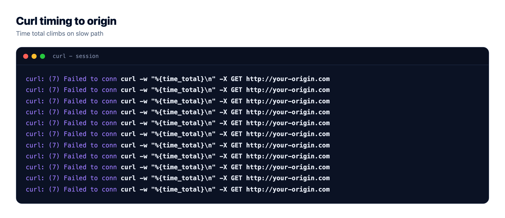
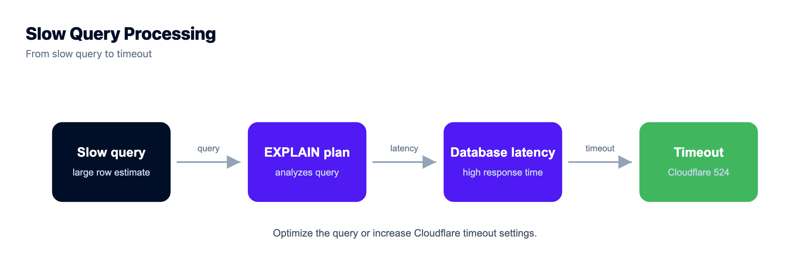
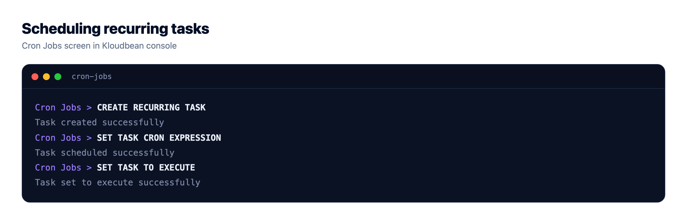

# Error 524, A Timeout Occurred: Why Your Origin Went Quiet
*By Kloudbean Engineering · The handshake worked, then your app went quiet.*

Error 524 says a timeout occurred, and that wording sends most people off to check whether their site is down. It isn't. A 524 is proof that Cloudflare reached your server just fine. The TCP connection opened, the handshake completed, and then your application sat there without sending a response back in time. So this is not a connectivity problem. It's a speed problem, on one specific path through your own app. Find that path and the 524 goes with it.

> **What does a timeout occurred error code 524 mean?**
> Cloudflare opened a TCP connection to your origin, sent its request, and your application did not return a response before Cloudflare's read timeout expired. Cloudflare's documentation puts that default at 100 seconds on the standard proxy, and only Enterprise plans can raise it. A 524 error is not about reachability the way a 522 is. The connection worked. Your app was too slow on that one request. The usual culprit is a slow database query or a long synchronous task sitting on the request path, and the real fix is to move that work into a background job so the request can answer immediately.

## What a 524 is actually telling you

Read the sequence and the diagnosis falls out of it. Cloudflare accepted a visitor, opened a connection to your origin, and sent the HTTP request. All of that worked. Then it started a clock and waited for the first byte of your response. When that clock hit 100 seconds with nothing coming back, Cloudflare stopped waiting and returned a 524 to the visitor instead.

That's the whole story. The connection is healthy. Your app is not answering. So a cloudflare error 524 never points at DNS, at your firewall, or at a dropped packet. It points at one thing: something on that request took too long. Usually you can even name the endpoint, because 524s tend to cluster on the exact paths that do heavy work.

The number itself tells you the layer. A code in the 52x range is Cloudflare talking about the leg between its edge and your origin. And 524 specifically is the one that means "I connected, I asked, you never replied." Keep that framing and you skip every dead end below.

## Error 524 versus 522, 504, and 523: which timeout is yours

These four get mixed up constantly because they all feel like "the site is broken" to a visitor. They are not the same failure, and the fix for one does nothing for the others. Here is the split.

| Code | What Cloudflare saw | What it means | First place to look |
|---|---|---|---|
| [522](https://www.kloudbean.com/blog/cloudflare-error-522-connection-timed-out/) | The connection never completed | Packets dropped, handshake failed | Firewall, security group, listen backlog |
| [523](https://www.kloudbean.com/blog/cloudflare-error-523-origin-is-unreachable/) | The origin address could not be routed | Cloudflare had nowhere to send the packets | Wrong or dead origin IP, DNS record |
| 524 | Connected fine, no response in time | Your app answered too slowly | Slow queries, long synchronous work |
| [504](https://www.kloudbean.com/blog/fix-504-gateway-timeout/) | A proxy in the chain gave up waiting | A different clock, often your own nginx | Upstream and proxy read timeouts |

The 522 versus 524 line is the one worth memorising, because it's the most common confusion. 522 means the connection failed, so nothing ever answered. 524 means the connection succeeded and then the response was too slow. If you fix a slow query on a 522, you've wasted an afternoon, because the request never reached your code. The [522 guide](https://www.kloudbean.com/blog/cloudflare-error-522-connection-timed-out/) covers the handshake side in detail.

And 504 catches people out because it can come from a proxy you own, not from Cloudflare at all. If nginx sits in front of your app and the app is slow, nginx returns 504 on its own `proxy_read_timeout`, well before Cloudflare's 100-second clock ever runs out. Same slow app, different messenger. The [504 guide](https://www.kloudbean.com/blog/fix-504-gateway-timeout/) untangles which proxy fired.

## Prove it in one command

Before you change anything, confirm where the slowness lives. The test is to ask your origin directly, bypassing Cloudflare entirely, with a timer running. This single command settles the argument:

```bash
curl -o /dev/null -s -w "%{time_total}s -> %{http_code}\n" \
  --resolve example.com:443:ORIGIN_IP https://example.com/slow-path
```

Swap `ORIGIN_IP` for your server's real address and `/slow-path` for the URL that throws the 524. The `--resolve` flag sends the request straight to your origin with the correct Host header and SNI, so you're testing the same thing Cloudflare tests, minus the edge. The output is the total time and the status code. Now read it.



| Direct curl result | What it means | Next step |
|---|---|---|
| Slow direct, near or over 100s | It's your app, not Cloudflare | Profile that path, check the database |
| Fast direct, slow through Cloudflare | Something differs at the edge on that path | Check a WAF rule, a redirect loop, or a large uncached body |
| Hangs and never returns | The path never completes at all | A code bug or a stuck dependency, not a tuning issue |

Nine times out of ten it's slow direct, which is good news: the problem is entirely in your hands, and you already know which endpoint. If it's fast direct and slow through Cloudflare, the difference is something the edge adds on that specific path, so look there rather than at your app.

## What makes an origin go quiet

Once you know it's the app, the cause is almost always one of these, roughly in the order I see them. They share a shape: something on the request path takes longer than it should, and everything behind it waits.

| Cause | What it looks like | The fix |
|---|---|---|
| A slow query on the request path | One endpoint times out, others are fine; database CPU spikes | Add an index, cache the result, or move it off the path |
| A long synchronous task | Predictable 524 on a report, export, or PDF action | Return a job id, build it in a worker |
| An external API call with no timeout | Your 524s track a third party's bad days | Set a client timeout, make the call async |
| Worker or thread pool exhausted | 524s cluster under load, fine when quiet | More workers, faster handlers, or a queue |
| An upstream your app calls hangs | The whole app stalls behind one dependency | Timeouts and circuit breakers on every call |

The slow query is the classic. A page that runs a report over a table that grew past a million rows was fast in staging and is now sitting at 40 seconds in production, and nobody noticed until it crossed 100. Find what's actually running:

```sql
-- Postgres: what is running right now, and for how long?
SELECT pid, now() - query_start AS runtime, state, query
FROM pg_stat_activity
WHERE state = 'active'
ORDER BY runtime DESC;
```

If a query has been active for tens of seconds, that's your 524. Index it, or cache the result, or, if it's genuinely heavy work, take it off the request path entirely. That last option is the one that actually fixes this class of bug for good.



The worker-exhaustion case is sneakier, because there's nothing wrong with any single request. You have, say, four workers, and four slow requests arrive. Now request five has to wait for a worker to free up, and if that wait plus its own runtime crosses 100 seconds, it 524s while doing nothing at all. That's why 524s often appear only under load and vanish when traffic drops. It looks intermittent. It's really a capacity ceiling.

## The real fix: get the slow work off the request path

Here's my honest opinion, and it's the one thing I'd want you to take from this page. That 100-second limit is not a knob to crank. On standard plans you can't raise it anyway, and even on Enterprise, where you can, a request that needs more than 100 seconds is a design smell, not a configuration gap. HTTP requests are meant to be short. If real work takes minutes, it shouldn't be happening inside a request at all.

The pattern that retires this whole bug class: accept the work, answer immediately, and do the slow part somewhere else. The request returns a 202 with a job id in milliseconds. A background worker picks the job up and runs it. The client polls that job id, or you fire a webhook when it's done.

```js
// Before: the request does the slow work and holds the connection open
app.post('/reports', async (req, res) => {
  const report = await buildHugeReport(req.body); // 3 minutes
  res.json(report);                               // Cloudflare gave up at 100s
});

// After: accept the job, answer now, run the work elsewhere
app.post('/reports', async (req, res) => {
  const job = await queue.add('build-report', req.body);
  res.status(202).json({ jobId: job.id });        // returns in milliseconds
});
```

<!-- DIAGRAM: Two timelines. Blocking request: handshake OK at t=0, Cloudflare waits while the app runs a slow query, at 100s the read timeout expires and 524 is returned. Background job: handshake OK at t=0, app returns 202 plus a job id in under a second, a worker runs the slow job separately, the client polls the job id or a webhook fires when done. Same work, different shape: the timeout only existed because the request stayed open. -->

This is a bigger change than flipping a setting, and it's worth it. For the mechanics, [background jobs with BullMQ](https://www.kloudbean.com/blog/nodejs-background-jobs-bullmq/) walks through a real queue and worker, [running a long task without hitting a timeout](https://www.kloudbean.com/blog/deploy-long-running-ai-task-without-timeout/) covers the return-immediately pattern end to end, and [splitting an app into API, worker, and database](https://www.kloudbean.com/blog/run-ai-app-api-worker-database/) shows the architecture it leads to. The shape is the same whether the slow thing is a report, a video encode, or an AI call.



## Fixes that cannot work (skip these)

The 524 error attracts bad advice, mostly because the fixes are quick to try and satisfying to click. None of them touch a slow origin response.

**Purging the cache, Development Mode, Rocket Loader.** These change how Cloudflare handles content it already has, or how it delivers assets to the browser. Your problem is that Cloudflare never got a response to cache or deliver. Toggling any of them is motion, not progress. Development Mode in particular just bypasses the cache, which makes a slow origin slower, not faster.

**Raising the timeout.** On standard plans it isn't yours to raise. And where it can be raised, you're hiding the symptom, not fixing it. A request that needed 110 seconds today will need 130 next quarter as your data grows, and you'll be back here having bought a few months. Worse, every one of those slow requests is holding a worker hostage the whole time, so you've made your capacity ceiling lower while feeling like you solved something.

**Rebooting and hoping.** A restart clears a stuck worker pool and buys quiet for an hour, which is exactly enough to convince you it's fixed. Then load returns and so does the 524. If a reboot helps even briefly, that's a strong hint you have a capacity or a slow-path problem, so go and measure it rather than scheduling a nightly restart.

## Where this stops being a code problem

Let me be straight about the boundary here, because a 524 is mostly your code's problem and no host can pretend otherwise. Managed hosting covers the server, the stack, TLS, backups, and patching. Your application code, your queries, your DNS, and your Cloudflare configuration stay yours. A 524 is almost always a slow path inside your own app. What a good platform gives you is the ability to find and fix it faster.

That's mostly about visibility. On Kloudbean, application and server logs sit next to server health metrics, CPU, memory, and load, in one dashboard, which matters here because the intermittent 524 is a capacity story you can only read with load history. You line up the spike in 524s with the spike in load and the picture is obvious. Managed databases (MySQL, MariaDB, PostgreSQL, Redis, and more) give you a place to tune the slow query instead of guessing, and cron jobs run from the UI without SSH, which is handy for the scheduled side of moving work off the request path.

One thing to be clear about: the background-job fix is your application design. You write the worker and the queue. Kloudbean runs the servers, the managed database, and the cron, and it won't magically move your work into the background or autoscale a standard app for you. What it removes is the server and stack maintenance around all of it, so you spend your time on the slow query rather than on the box it runs on. Seven cloud providers, one dashboard, free SSL, staging for WordPress and Laravel, automatic backups, and free migration assistance if you're moving something already running.


## If you are debugging more than one thing

If you're not sure which number you actually have, start at the [Cloudflare 5xx error codes](https://www.kloudbean.com/blog/cloudflare-5xx-error-codes/) overview. The nearest neighbours are [522 connection timed out](https://www.kloudbean.com/blog/cloudflare-error-522-connection-timed-out/) for the handshake that never completes, [523 origin is unreachable](https://www.kloudbean.com/blog/cloudflare-error-523-origin-is-unreachable/) when Cloudflare can't route to your address, and [525 SSL handshake failed](https://www.kloudbean.com/blog/cloudflare-error-525-ssl-handshake-failed/) when the connection works and TLS does not. For the same slow-response family from a different angle, [504 Gateway Timeout](https://www.kloudbean.com/blog/fix-504-gateway-timeout/). And for the fix itself, [running a long task without a timeout](https://www.kloudbean.com/blog/deploy-long-running-ai-task-without-timeout/) and [background jobs with BullMQ](https://www.kloudbean.com/blog/nodejs-background-jobs-bullmq/).

<!-- cta:start -->
**Fewer mysteries on the next deploy.**

Build logs stream live in the console, deployment history keeps what happened, and the logs viewer separates app errors from web requests, so a failed start is a five-minute read rather than a guessing game.

- Live build logs
- Deployment history
- Logs viewer
- Managed process restarts
- Automatic backups
- Git deploy

[Start free](https://console.kloudbean.com/register) · [See plans](https://www.kloudbean.com/pricing/)
<!-- cta:end -->

## FAQ

**What does Cloudflare error 524 mean?**
It means Cloudflare opened a TCP connection to your origin server and sent its request, but your application did not return a response before Cloudflare's read timeout expired. The connection itself worked, so a 524 is never a firewall or routing problem. It's a speed problem: something on that request took too long, usually a slow query or a long synchronous task on the request path.

**What is the difference between error 524 and error 522?**
522 means the connection never completed, so nothing on your server ever answered, which points at packet filtering, a security group, or a full listen backlog. 524 means the connection completed fine and then the response was too slow. If you chase a slow query on a 522 you'll waste your time, because the request never reached your code in the first place.

**How long does Cloudflare wait before returning a 524?**
Cloudflare's documentation puts the default read timeout at 100 seconds on the standard proxy. If your origin sends no response within that window, Cloudflare stops waiting and returns a 524 to the visitor. Only Enterprise plans can raise the limit, and raising it is rarely the right move, since a request that needs more than 100 seconds usually should not be a single HTTP request.

**Can I increase the Cloudflare 524 timeout?**
On standard plans, no. The 100-second proxy read timeout is fixed. Enterprise plans can raise it, but that hides the symptom rather than fixing it, because slow requests keep holding workers open and the underlying work only gets slower as your data grows. The durable fix is to move long work into a background job and return a response immediately.

**Why do I get a 524 on one page but the rest of the site is fine?**
Because that page does heavy work the others don't. A report, an export, a big search, or an external API call with no timeout will sit on the request path far longer than a normal page render. 524s cluster on exactly those endpoints. Run the slow endpoint directly with a curl timer and you'll usually see it crawl past several seconds while the rest of the site answers instantly.

**How do I test whether my origin is the slow part?**
Ask your origin directly, bypassing Cloudflare, with a timer. Use curl with the --resolve flag so the request goes straight to your server IP with the correct Host header, and print the total time and status code. If it's slow direct, the problem is your app and you already know the endpoint. If it's fast direct but slow through Cloudflare, look at what the edge adds on that path.

**Does purging the cache or turning on Development Mode fix a 524?**
No. Those settings change how Cloudflare handles content it already has or how it delivers assets to the browser. A 524 happens because Cloudflare never received a response to cache or deliver. Development Mode actually bypasses the cache, which makes a slow origin slower. None of these touch the real cause, which is a slow response from your application.

**Is a 524 error a problem with Cloudflare or my server?**
It's your server, almost always. Cloudflare is only reporting that it connected and waited and got nothing back in time. The slow path lives in your application code, your database, or a dependency your app calls. Cloudflare configuration can occasionally add latency on a specific path, which is why the direct curl test is worth running, but the usual answer is a slow origin.

**How do I stop long requests from causing 524?**
Take the long work off the request path. Return a 202 with a job id straight away, run the actual work in a background worker or queue, and let the client poll the job id or receive a webhook when it finishes. This keeps every HTTP request short, which is what they're meant to be, and the 524 disappears because Cloudflare is never left waiting.

*Kloudbean Engineering · If a request needs 100 seconds, it shouldn't be a request.*
