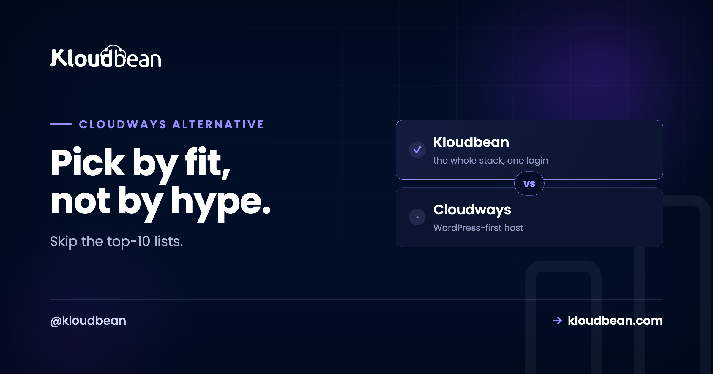

# Cloudways Alternatives: How to Pick One That Actually Fits

Most Cloudways alternatives lists are the same dozen logos in a shuffled order. Not helpful. If you're shopping around, you probably liked Cloudways fine, and then something shifted.

Maybe you want a different cloud. Maybe your project grew past WordPress into a Node API and a Python service. Maybe you're tired of bolting on a database, object storage, and a load balancer from three separate places. So this guide skips the ranked-logo routine. It names the real reasons people leave, hands you a short framework to judge any alternative against, and then shows where each kind of option genuinely fits. You'll notice I land on Kloudbean. I'll also tell you exactly when it isn't the answer.

> **Short answer:** There's no single best Cloudways alternative, only the best for your reason for leaving. Want more cloud choice and your whole stack in one place? A superset platform like Kloudbean runs on seven providers. Outgrowing PHP? You want something multi-language. Happy owning a VPS? A control panel. Want zero server ops? A PaaS. Match the tool to the trigger, not to the logo.

## Why people actually go looking for a Cloudways alternative

People rarely leave because a host is bad. They leave because the job changed. Four triggers come up again and again, and naming yours is the whole game.

- **You outgrew PHP-only.** The site is still WordPress, but now there's a Node API next to it, or a Python service, or you want to run something like n8n or a Supabase backend. A PHP-shaped host starts to feel tight.
- **You want to choose the cloud.** You've got AWS credits burning a hole, or you need a specific region for latency or data residency, or you just prefer one provider's pricing. Being handed the cloud rubs you the wrong way.
- **You're tired of add-ons.** Database in one product, object storage in another, a load balancer somewhere else, each with its own bill and login. You want fewer moving parts, not more.
- **You need real controls.** A compliance review is coming, or the team grew and you need per-person permissions and an audit log of who changed what.

Here's the honest bit, from someone who reads migration tickets: the most common mistake is switching hosts to fix a problem a bigger server would have fixed. Migrating means moving files and databases, re-pointing DNS, re-issuing certificates, and testing that nothing quietly broke. That's real hours. Do it for a reason you can say out loud, not because a spec sheet made you itchy.

## How to evaluate a Cloudways alternative: five criteria that matter

Before you look at a single logo, decide what you're actually grading on. These five sort the field faster than any feature list.

- **Cloud choice.** Are you locked to one provider, or can you pick (and switch)?
- **Beyond PHP and WordPress.** Will it run Node, Python, Ruby, Java, static sites, and app-style workloads, or is it PHP-shaped at heart?
- **How much lives in one dashboard.** Are managed databases, object storage, and load balancing built in, or are they separate accounts you glue together?
- **Who runs the server.** Is it fully managed (someone else patches the box), or do you still own and maintain the VPS?
- **Enterprise controls.** Team permissions, an audit trail, private networking, custom setups. Do you need them, and does the option have them?

Score each candidate on those five and the "best" alternative usually picks itself. Here's how the four broad categories tend to land (a rough scorecard, not gospel):

| Criteria | Full-stack platform | Premium WP host | DIY VPS panel | Hands-off PaaS |
| --- | --- | --- | --- | --- |
| Choose your cloud provider | Strong | No | Strong | Partial |
| Beyond PHP / WordPress | Strong | Partial | Partial | Strong |
| DB + storage + LB in one place | Strong | Partial | No | Partial |
| Server fully managed for you | Strong | Strong | No | Strong |
| Enterprise controls (audit, k8s) | Strong | Partial | No | Partial |

## The landscape, honestly, by category

### Full-stack managed platforms (the superset option)

This is where Kloudbean sits, and it's the category built for "my needs grew." You get managed hosting across **seven clouds** (AWS, AWS Lightsail, Google Cloud, Linode, Vultr, DigitalOcean, UpCloud), plus apps in many languages, six managed databases, object storage, and a load balancer, all under one login. Provisioning starts with picking the provider:

The reason this category answers "I outgrew PHP" is simple. It doesn't assume PHP. You can run WordPress and WooCommerce (Kloudbean does both, since launch), and also a Node.js or Python service, a Java workload, a static frontend, or a one-click app like n8n or Supabase, next to each other. More on that fit in the [Kloudbean vs Cloudways head-to-head](https://www.kloudbean.com/blog/kloudbean-vs-cloudways/).

### Premium managed WordPress (Kinsta, WP Engine)

If the honest job is "WordPress, on a polished host, with white-glove support," this category is genuinely great, and I won't pretend otherwise. The dashboards are clean, the WordPress tooling is mature, support tends to be excellent. The catch is scope. It's usually one cloud, often plan-tiered, and it gets narrow the moment you add a non-WordPress app. If that's your situation, read [Kloudbean vs Kinsta](https://www.kloudbean.com/blog/kloudbean-vs-kinsta/) and [Kloudbean vs WP Engine](https://www.kloudbean.com/blog/kloudbean-vs-wp-engine/) before you decide.

### Bring-your-own-VPS control panels

These make managing your own server far less painful. You point the panel at a VPS you rent (DigitalOcean, Vultr, Linode, wherever) and it sets up the stack nicely. But be clear-eyed: this is semi-managed. You still own the box, its patching, and its 2am problems. Some of these panels lean toward Laravel and PHP, some are WordPress-focused, others aim at general multi-app management. Great if you like control. Not the move if you wanted the server to be someone else's job. The [managed vs unmanaged breakdown](https://www.kloudbean.com/blog/managed-vs-unmanaged-hosting/) spells out that tradeoff, and [Laravel Forge vs Kloudbean](https://www.kloudbean.com/blog/laravel-forge-vs-kloudbean/) is a named head-to-head in this exact category.

### Hands-off PaaS (DigitalOcean App Platform, Render, Railway)

Push code, it builds and runs, you never see a server. Lovely for small apps and quick launches. The tradeoffs are real though: less visibility into the box underneath, occasional trouble when you need to reason about it, and costs that can climb as certain workloads scale. It's a different model from Cloudways, not a like-for-like swap. Worth it when zero server ops is the priority.

<!-- ADD IMAGE: your current setup spread across separate tabs (host, database, storage, CDN) next to one consolidated dashboard -->

## Best for, and the catch, at a glance

| Category | Best for | The catch |
| --- | --- | --- |
| **Full-stack platform** (Kloudbean) | Teams past WordPress-only who want cloud choice and the whole stack in one dashboard | Linux-based stacks; Windows Server on higher tiers |
| **Premium WordPress** (Kinsta, WP Engine) | WordPress-first teams who want a polished experience and strong support | Usually one cloud and plan tiers; narrow if you add non-WP apps |
| **BYO-VPS panel** | People happy owning a VPS who just want a friendly control panel | Semi-managed: you still patch and own the server |
| **Hands-off PaaS** (DO App Platform, Render, Railway) | Developers who want zero server ops for smaller apps | Less control; cost can climb as you scale |

## Where Kloudbean lands, and the one edge nobody can fake

Every host can claim to be "the best." Cloud count is checkable. Kloudbean runs on seven providers, and those seven are every cloud Cloudways offers (DigitalOcean, Vultr, Linode, AWS, Google Cloud) plus AWS Lightsail and UpCloud. It's a strict superset. That's not marketing, it's arithmetic.

The rest of the pitch is breadth in one login. Six managed databases (MySQL, MariaDB, PostgreSQL, Redis, Elasticsearch, MongoDB). S3-compatible object storage and managed Google Cloud Storage buckets. A built-in Flexible Load Balancer you can switch on from any account, no separate product:

Add managed CI/CD that builds and deploys on every Git push with live build logs, staging for WordPress and Laravel, subusers with granular access control, and, for enterprise and government teams, an immutable audit trail plus Kubernetes and custom architectures. It's one dashboard for servers, apps, [managed databases](https://www.kloudbean.com/blog/add-managed-database-to-your-app/), [object storage](https://www.kloudbean.com/blog/s3-compatible-object-storage/), [load balancing](https://www.kloudbean.com/blog/cloud-load-balancer-explained/), and private networking. That's the "fewer moving parts" answer to the add-on fatigue that sends people looking in the first place.

<!-- ADD IMAGE: the Git deployment view with live build logs streaming during a push -->

## A fair word on Cloudways

Cloudways earned its reputation. It's mature, it has a big and helpful community, years of WordPress and PHP polish, and it's backed by DigitalOcean. If a fleet of WordPress and PHP sites is the entire job and you don't want to think about anything past that, staying put is a perfectly rational call. That's the honest nod. The pivot is just as honest: the moment your stack stops being PHP-shaped, or you want cloud choice, or you're done juggling add-ons, a broader platform stops being a nice-to-have.

## When you should not switch at all

Try to finish this sentence: "I'm leaving Cloudways because ______." Can't do it cleanly? Then don't leave yet. A comparison article is a terrible reason to eat a migration. If you can finish it (a specific cloud, a stack that grew past WordPress, one console for the whole thing) then you've found your reason, and that's exactly the move Kloudbean is built for. When you're ready, our [zero-downtime migration guide](https://www.kloudbean.com/blog/how-to-migrate-hosting-zero-downtime/) walks the path, and free migration assistance can do the heavy lifting.

---

**Outgrew PHP-only? Get the whole stack in one place.** Run WordPress and apps in any language, six managed databases, object storage, and a load balancer across seven clouds. Start free at [kloudbean.com](https://www.kloudbean.com/), see options on [pricing](https://www.kloudbean.com/pricing/).

7 clouds · One dashboard for your whole stack · 6 managed databases · Built-in load balancer · Free migration · Free trial

## FAQ

**What's the best Cloudways alternative?**
There isn't one universal winner. There's the best for your reason for leaving. For cloud choice plus your whole stack in one dashboard, Kloudbean is a strong fit. For premium WordPress, Kinsta or WP Engine. For running your own VPS with a friendly control panel, a bring-your-own-VPS panel. For zero server ops on a smaller app, a PaaS like DigitalOcean App Platform. Name your trigger and the pick narrows fast.

**Why do people leave Cloudways?**
Usually because the job changed, not because the host is bad. The common triggers are outgrowing PHP-only into apps in other languages, wanting to choose the underlying cloud, getting tired of gluing together separate database and storage and load-balancer products, and needing team permissions or an audit trail for compliance.

**Which Cloudways alternative gives the most cloud choice?**
Kloudbean runs on seven providers: AWS, AWS Lightsail, Google Cloud, Linode, Vultr, DigitalOcean, and UpCloud. That's every cloud Cloudways offers plus Lightsail and UpCloud, so it's a strict superset. Control-panel options also let you pick, since they sit on whatever VPS you rent.

**Are server control panels the same as managed hosting?**
Not quite. They're control panels for servers you own, which makes them semi-managed. They configure the stack for you, but you still bring the VPS and stay responsible for patching and uptime. Fully managed platforms like Kloudbean take the whole server off your plate.

**Is DigitalOcean App Platform a good Cloudways alternative?**
It's good if you want a hands-off platform where you push code and never touch a server. Just know it's a different model. You trade visibility and fine control for convenience, and some workloads get pricey as they scale. It isn't a like-for-like swap for a managed-hosting layer.

**Is Kloudbean cheaper than Cloudways?**
Neither is universally cheaper. Both are managed layers priced on the server size you pick plus the management on top, so it depends on your configuration and which built-ins (databases, storage, load balancing) you'd otherwise buy separately. Compare the exact setup you need on each rather than headline rates.

**Can I run more than WordPress on a Cloudways alternative?**
On a full-stack platform, yes. Kloudbean runs Node.js, Python (Django, Flask, FastAPI), Ruby, Java, static sites, and one-click apps like n8n and Supabase, alongside WordPress and Laravel. WordPress-focused hosts and WordPress control panels are narrower by design.

**How hard is it to migrate off Cloudways?**
It's a logistics task, not a lock-in trap. You move files and the database, set your environment variables, attach the database, re-point DNS, and re-issue SSL. For a non-WordPress app it's basically a redeploy. Kloudbean offers free migration assistance if you'd rather not do the first move yourself.

**If I switch to Kloudbean, can I still run WordPress?**
Yes. Kloudbean has done managed WordPress and WooCommerce since launch, with staging for WordPress and Laravel. You're not giving up WordPress to gain the rest of the stack, you're adding room to grow around it.

---

*Kloudbean · Pick by fit, not by hype.*
