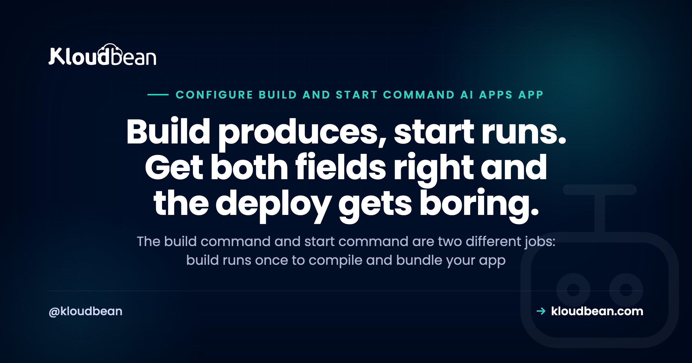

# Build Command vs Start Command: Getting an AI-Generated App to Run

You built something with Lovable, Bolt, Cursor, or v0, and it runs fine on your laptop. Now you're staring at a host's add-application screen, and there are two fields you've never had to think about: a build command and a start command. Guess wrong and the deploy fails. Or worse, it looks like it worked, then falls over the moment a real user shows up.

The mental model that fixes most of this is short. Build and start are two different jobs. The build command runs once, when you deploy. The start command runs every time your app boots. Almost every failed deploy of an AI-generated app is one of those two set wrong. Sort out which job each field is doing and the rest gets easy.

> **The short version:** The build command runs once at deploy time and turns your source into something runnable (installs packages, compiles TypeScript, bundles the frontend into a `dist/` or `build/` folder). The start command runs every time the app boots and launches the server that answers requests. Build produces, start runs. Most AI-app deploy failures are one of these two: a dev command left in the start field, or no build step, so start has nothing to run.

## Build command and start command: two jobs, not one

Think of a deploy as two phases that happen at different times, for different reasons.

The **build command** runs once, at deploy time. Its job is to turn your source code into something a server can actually run. Usually that means installing your packages, compiling TypeScript down to JavaScript, and bundling your frontend into a folder of static files, often called `dist/` or `build/`. When the build finishes you have an artifact: a ready-to-run version of your app. Then the build machine's work is done.

The **start command** runs every single time your app boots. Not just on deploy. On every restart, every crash-and-recover, every time the platform moves your app to a new machine. Its job is to launch the long-running process that listens for requests and serves traffic. For a Node app that's usually something like `node dist/server.js`. For Python it might be `gunicorn` or `uvicorn`.

So build produces, start runs. Build is a one-time setup step. Start is the thing that stays alive. If you remember nothing else, remember this: a build command that installs and compiles is not interchangeable with a start command that runs a server. They're different fields because they're different jobs.

<!-- ADD IMAGE: the add-application settings showing the Build Command and Start Command fields filled in. Swap for src -> images/build-start-fields.png -->

## What runs when

Here's the split in one table.

| Phase | When it runs | What it does | A typical command |
| --- | --- | --- | --- |
| Build | Once, at deploy time | Installs packages, compiles, bundles the frontend into `dist/` or `build/` | `npm run build` |
| Start | Every time the app boots | Launches the server that listens on a port and answers requests | `node dist/server.js` |

Two things fall out of this that trip people up. First, anything slow or heavy (installing hundreds of packages, compiling a big TypeScript project) belongs in the build, so it happens once instead of on every boot. Second, your start command can only run what the build produced. If the build didn't create `dist/`, then `node dist/server.js` has nothing to point at, and the app dies on boot.

## The mistake almost every AI-generated app makes: a dev server in production

This is the single most common misconfiguration, and it's worth spelling out, because it fools people while they watch it work.

AI builders scaffold your project with a dev command. Open `package.json` and you'll see a `dev` script: `next dev`, `vite`, or `nodemon`. Python projects get `flask run --debug` or `uvicorn main:app --reload`. That command is great for your laptop. It watches your files, reloads on every save, prints friendly errors. So when you deploy and the start field is empty, the natural move is to paste in the command you know works: `npm run dev`. And it runs. The app comes up. Looks done.

It isn't. A dev server and a production server are built for opposite goals. The dev server optimizes for your feedback loop: it watches the filesystem for changes, runs a single process, skips production caching, and leaves debug output on. A production server optimizes for serving lots of real requests fast and staying up. Run the dev server in production and it's slow, single-process, and busy watching files that will never change. Some frameworks print a warning telling you not to. It'll handle you clicking around. It will not handle real traffic.

My firm opinion, said plainly: never use a dev server as your production start command, even though it appears to work. `npm run dev` in production is borrowed time. It survives the demo and falls over under the first real load, usually at the worst possible moment. Use the production start command instead. For most Node apps that's `npm start` wired to `node dist/server.js`, or `next start` for Next.js. The `npm start vs npm run build` confusion is really this same split: `build` prepares, `start` serves.

<!-- ADD IMAGE: a side-by-side of a dev script versus a production start command in package.json, dev highlighted as wrong for the start field. -->

## When the build never happened, start has nothing to run

The second big failure is the mirror image. Your start command is correct, but there's no build, or the wrong one, so start points at files that don't exist yet.

You've seen the symptoms. `Error: Cannot find module '/app/dist/server.js'`, because the TypeScript was never compiled and `dist/` is empty. Or the site loads to a blank white page because the frontend was never bundled, so there's no `index.html` to serve. The start command did exactly what you asked. You told it to run something the build should have created and didn't.

So `what build command should I use` is the right question to ask early, not after three failed deploys. If your project has a `build` script in `package.json`, that's almost always your answer. A TypeScript backend needs `tsc` (or `npm run build`) so `node dist/server.js` has a `dist/` to run. A React or Vue frontend needs `vite build` or `npm run build` so there are static files to serve. Skip the build and you've handed start an empty folder. This is one flavour of the wider [local versus production gap](https://www.kloudbean.com/blog/why-my-ai-app-works-locally-but-not-in-production/), where things your laptop did quietly just stop happening on the server.

## Build and start commands, framework by framework

There's no universal pair, because the right commands depend on your framework and whether you're using TypeScript. But the common shapes are predictable. Treat this as a starting point, then check the `scripts` block in your own `package.json`, because AI builders and starter templates sometimes rename things.

| Framework | Typical build command | Typical production start command |
| --- | --- | --- |
| Next.js | `next build` (often `npm run build`) | `next start` (or `npm start`) |
| Vite / React SPA | `vite build` (outputs `dist/`) | serve the static `dist/` folder; there's no Node server of its own |
| Express / Node API | none, or `tsc` if using TypeScript | `node server.js`, or `node dist/server.js` when compiled |
| NestJS | `nest build` (outputs `dist/`) | `node dist/main.js` (or `npm run start:prod`) |
| Django | `pip install -r requirements.txt`, then collectstatic and migrate | `gunicorn myproject.wsgi` |
| FastAPI | `pip install -r requirements.txt` | `uvicorn main:app --host 0.0.0.0 --port $PORT` |

One nuance worth calling out: a pure Vite or React single-page app has no server of its own. The build produces static files, and "start" just means serving that folder. If your host expects a long-running process, you either run a tiny static server or deploy it as a static site instead of a Node app.

A typical `package.json` makes the three roles obvious:

```json
{
  "scripts": {
    "dev": "nodemon src/server.ts",
    "build": "tsc",
    "start": "node dist/server.js"
  }
}
```

`dev` is for your laptop. `build` compiles once. `start` runs the compiled server. Your host's build field should call the `build` script, and your start field should call `start`. A few correct production start commands, for reference:

```bash
# Node, running compiled TypeScript
node dist/server.js

# Django, served by gunicorn (not manage.py runserver)
gunicorn myproject.wsgi --bind 0.0.0.0:$PORT

# FastAPI, served by uvicorn (no --reload in production)
uvicorn main:app --host 0.0.0.0 --port $PORT
```

<!-- ADD IMAGE: the scripts block of a real package.json, with dev, build, and start labelled by which deploy field each one belongs in. -->

## Read the build log before you change anything

When a deploy fails, don't start randomly editing fields. Read the build log. It's the most useful thing on the screen, and it tells you exactly which phase broke.

A build log runs top to bottom through the phases: fetch your code, install dependencies, run the build command, then hand off to start. The line where it stops is the phase that failed. If it dies during install, it's a dependency or a runtime version problem, not your build command. If it dies during the build with a compile error, your code or your build command is the issue. If the build finishes clean and the app dies seconds after start, the build was fine and your problem is the start command or the port.

That one read saves you from the classic mistake: editing the start command over and over while the log plainly shows the install step failing. If the failure is a version mismatch during install (modern syntax the server's runtime doesn't recognize), that's a runtime pin, and [Node version management](https://www.kloudbean.com/blog/node-version-management/) covers it. Fix the phase that actually broke, not the one you happened to be looking at.

<!-- ADD IMAGE: a build log with the failing phase highlighted, showing install versus compile versus bundle. -->

## The port gotcha: start has to listen where the platform tells it

Even with a correct build and a real production start command, one more thing quietly breaks deploys: the port.

A hosting platform decides which port your app should listen on and passes it in, almost always through a `PORT` environment variable. Your app has to read that variable and bind to it. If your code hardcodes `3000` because that's what it used locally, and the platform routes traffic to a different port, the platform's health check knocks and nobody answers. The deploy then looks broken: the build passed, the process is running, but every request returns a 503. If that's what you're seeing, [fixing a 503 after deploying](https://www.kloudbean.com/blog/fix-503-after-deploying-your-app/) walks the whole checklist.

For a Node app, reading the port is one line:

```js
const port = process.env.PORT || 3000;
app.listen(port, "0.0.0.0", () => {
  console.log("listening on " + port);
});
```

Two details matter. Read `process.env.PORT` instead of hardcoding, and bind to `0.0.0.0` rather than `localhost`, so the app accepts connections from outside its own container. The anti-pattern to avoid is hardcoding a port because it worked on your machine. It's the same trap as leaving `npm run dev` in the start field: fine locally, broken in production.

## Setting the build and start command on Kloudbean

On Kloudbean these aren't hidden away. When you add a Node or Python application, the app settings have a field for the build command and a field for the start command, plus the Node version and the port. You fill them in with the values your project actually needs (`npm run build` and `node dist/server.js`, say), pick your runtime version, and connect your Git repo. From then on it deploys on every push, streams the build log so you can see which phase ran, and gives you free SSL. The Git flow itself is covered in [CI/CD auto-deploy from GitHub](https://www.kloudbean.com/blog/ci-cd-auto-deploy-from-github/), and the wider path from AI preview to live app is in [deploy an AI-built app to production](https://www.kloudbean.com/blog/deploy-ai-built-app-to-production/).

The honest boundary: managed means the platform runs the server, the stack, SSL, backups, and patching. Your build command, your start command, and your code stay yours to set and own. Kloudbean makes the deploy repeatable. It can't guess that your start command should be `node dist/server.js` and not `npm run dev`. That part is the two fields we just walked through, and now you know what goes in them. For the bigger picture of everything AI builders leave you to wire up, [the last mile of vibe coding](https://www.kloudbean.com/blog/last-mile-of-vibe-coding/) is the map, and [why AI apps fail in production](https://www.kloudbean.com/blog/why-ai-apps-fail-in-production/) collects the usual suspects.

<!-- ADD IMAGE: the Git deployment view after a successful push, build log on screen. Swap for src -> images/git-deploy.png -->

## Get the two commands right, then deploy from Git

**Set your build command, start command, and Node version once, connect Git, and let every push deploy itself.** Kloudbean puts those fields in plain sight when you add a Node or Python app, streams the build log so you can see which phase ran, and ships free SSL on your domain. Start free at [kloudbean.com](https://www.kloudbean.com/); see plans on [pricing](https://www.kloudbean.com/pricing/).

Set build + start command · Pick your Node version · Git deploy on every push · Live build logs · Free SSL

## FAQ

**What is the difference between a build command and a start command?**
The build command runs once, at deploy time, and turns your source into something runnable: it installs packages, compiles TypeScript, and bundles your frontend into a dist/ or build/ folder. The start command runs every time the app boots and launches the server that answers requests. Build produces the artifact, start runs it.

**What build command should I use?**
Usually the build script already in your package.json, so npm run build is the safe answer for most Node projects. A TypeScript backend needs tsc so dist/ exists. A React or Vue frontend needs vite build or npm run build to produce static files. Python apps often need pip install, plus collectstatic for Django. Check your own scripts before guessing.

**What start command should I use for a Node app?**
The command that launches your compiled server, not your dev script. For most Node apps that is npm start wired to node dist/server.js, or node server.js if you are not compiling TypeScript. For Next.js it is next start. The start command for a Node app should never be npm run dev in production.

**Can I use npm run dev in production?**
No. It will appear to work, which is exactly why people leave it there, but a dev server is slow, single-process, watches the filesystem, and is not built to serve real traffic. It survives a demo and falls over under load. Use the production start command such as npm start or next start instead.

**Why does my app build but not start?**
The build succeeded, so the failure is in the start command or the environment it runs in. Common causes: the start command points at a file the build never created, the app hardcodes a port instead of reading process.env.PORT, or a required environment variable is missing. Read the logs from the moment start ran, not the build phase.

**What is the difference between npm start and npm run build?**
npm run build prepares your app by compiling and bundling, and it runs once at deploy. npm start launches the finished app and runs on every boot. They are not interchangeable. Running build does not start a server, and running start does not compile your code.

**Why does my app say cannot find module dist/server.js?**
Because dist/server.js was never created. Your start command expects compiled output, but the build step that produces dist/ either did not run or failed. Set the build command (tsc or npm run build) so the compiled files exist before start goes looking for them.

**Do I always need a build command?**
No. A plain JavaScript Node app with no compile or bundling step can start straight from source, so its build is just npm install. You need a build when something has to be produced first: TypeScript compiled to JavaScript, or a frontend bundled into static files. If in doubt, check whether your project has a build script.

**Why does my app deploy but return a 503?**
Often the port. The platform tells your app which port to listen on through a PORT variable, and if your code binds to a hardcoded port instead, the health check gets no answer and every request returns 503. Read process.env.PORT and bind to 0.0.0.0. A missing start process or a crash on boot can cause it too.

---

*Kloudbean · Build produces, start runs. Get both fields right and the deploy gets boring.*
