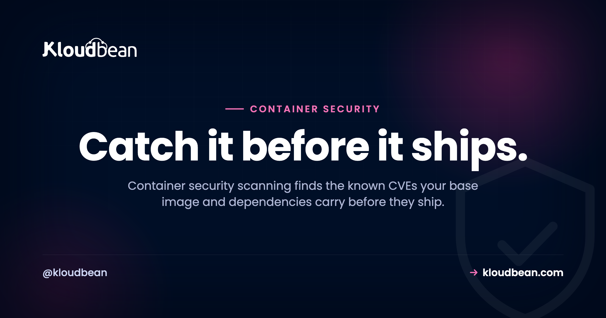

# Container Security Scanning: Catch CVEs Before You Ship

Your container builds. It runs. The health check is green. None of that tells you whether it's safe to put on the internet. A container image is mostly other people's code: a **base image** full of operating-system packages, plus every library your app pulled in. Any of those can carry a **known vulnerability** that was disclosed and cataloged months ago, sitting in your image right now.

**Container security scanning** is how you find that stuff before it ships, instead of after someone's poking at it. This walks through what a scan actually inspects, the tools people reach for, how to wire one into your build so a bad image can't get out, and where scanning quietly stops helping. That last part matters. A clean scan is not the same as a safe container, and I'd rather you know that up front.

> **Short version:** A container image inherits known CVEs from its base image and dependencies, no matter how clean your own code is. A scanner (Trivy, Grype, Docker Scout, Snyk) cross-checks every package against public vulnerability databases and lists what's exploitable. Run it inside your build, fail the build on critical and high findings, then shrink the attack surface with a minimal base image and a non-root user. Scanning finds *known* flaws only, so treat it as ongoing hygiene rather than a one-time gate.

## Why "it builds and runs" says nothing about safety

Here's the uncomfortable bit. Most of the vulnerabilities in your image have nothing to do with the code you wrote. They came free with the base image you picked, and the packages that base image drags along.

Say your Dockerfile starts with `FROM node:20`. That full image is built on Debian and ships with hundreds of OS packages: a shell, TLS libraries, compression tools, package managers, half of which your app never touches. Every one of those has a version, and any version can have a disclosed flaw. Switch to `node:20-slim` and you drop a big chunk of that. Switch to a distroless or Alpine base and you drop most of the rest. Same app, wildly different vulnerability count, purely from the base you chose.

Then there's time. An image that scanned perfectly clean the day you built it is not clean forever, because new CVEs get published constantly. Log4Shell (that's `CVE-2021-44228`, the Log4j remote-code-execution flaw that ate everyone's December) was a normal, trusted library right up until the day it wasn't. Your image didn't change. The world's knowledge about it did.

The most common mistake we see is a service humming along on a base image that's a year out of date. It built fine a year ago, so nobody touched it. Meanwhile a pile of CVEs got disclosed in the exact packages baked into that layer. The container still runs great. It's also a soft target. Scanning is how you find out before an attacker does.

```
git push -> docker build -> scan image (Trivy / Grype / Scout) -> gate: critical or high?
                                                                    |- none found        -> deploy
                                                                    |- CVE-2021-44228    -> fail the build
```
*Scan the image the moment it's built, before anything reaches production. A critical finding turns the build red and never ships.*

## What container security scanning actually inspects

A scanner takes your built image apart and checks three layers against public CVE databases. Knowing which layer a finding came from tells you how to fix it.

- **The base image.** The OS layer you started `FROM`. This is usually where the surprising, high-count findings live, because a full base pulls in packages you don't even use.
- **OS packages.** The system libraries installed in the image (through `apt`, `apk`, `yum`). Each has a version, and each version maps to a list of known flaws.
- **Your application dependencies.** The libraries your app installs (npm, pip, Composer, Go modules, Gems). They get checked against the same databases your OS packages do.

Most scanners also emit a **software bill of materials** (an SBOM): a full inventory of everything inside the image. That's useful on its own. When the next Log4Shell drops, an SBOM lets you answer "are we affected?" in seconds instead of grepping through Dockerfiles all afternoon.

## The tools you'll actually use

You don't build a scanner. You pick one off the shelf and run it. The open-source options are genuinely good, so most teams never need to pay for this.

| Tool | What it is | Good when |
| --- | --- | --- |
| **Trivy** | Open-source scanner from Aqua. Single binary, scans images, filesystems, and IaC. | You want one fast tool that covers almost everything. A sane default. |
| **Grype** | Open-source from Anchore. Pairs with Syft for SBOMs. | You care about SBOM generation and want quick image scans. |
| **Docker Scout** | Built into recent Docker CLI and Desktop. | You're already in Docker and want `docker scout cves` with zero setup. |
| **Snyk** | Commercial, deep dependency analysis and fix suggestions. | You want managed policies, dashboards, and auto-fix pull requests. |
| **Clair** | Open-source, designed to scan images sitting in a registry. | You want registry-side scanning as images are pushed. |

Honestly, start with Trivy. It's one binary, it needs no server, and `trivy image myapp:latest` gives you a real answer in a few seconds. You can graduate to something heavier if you outgrow it, but most projects don't.

## Wire it into the build: scan on push, fail on critical

A scan you run by hand once a quarter is a scan you'll forget. The value shows up when it runs automatically on every build, right after the image is created and before it's pushed or deployed. Locally it's one line:

```bash
# scan a built image
trivy image myapp:latest
```

In CI you want it to actually stop a bad image, not just print a scary list. The trick is a non-zero exit code, which turns the build red:

```bash
# fail the build on critical or high, ignore unfixable noise
trivy image --exit-code 1 --severity CRITICAL,HIGH --ignore-unfixed myapp:latest
```

That `--exit-code 1` is the whole game. Without it, CI stays green and the report scrolls past unread. With it, a critical CVE blocks the pipeline, and someone has to look. Set the threshold where your team can actually live: blocking on `CRITICAL,HIGH` is a common, sensible line. Block on everything down to `LOW` and you'll get alert fatigue by Friday, then start ignoring the tool entirely, which is worse than not having it.

<!-- ADD IMAGE: your CI build log showing the scan step running and the build going red on a CRITICAL finding -->

Where does the scan step live? Wherever your build runs. If you deploy from Git with a managed pipeline, it's a build command like any other, and the output streams into your build log next to the install and compile steps. Kloudbean's managed CI/CD works that way, with live build logs, so a failing scan is something you watch go red rather than something you find in an email later. One scope note before you plan around it: containers aren't part of the standard plan here, they come in under premium and enterprise customisation, so a container pipeline is a conversation rather than a checkbox. More on that flow in [CI/CD auto-deploy from GitHub](https://www.kloudbean.com/blog/ci-cd-auto-deploy-from-github/), and on running containers themselves in [Docker container hosting](https://www.kloudbean.com/blog/docker-container-hosting/).


## Reading the results without losing your mind

Your first scan of a fat base image can spit out a hundred findings. Don't panic, and definitely don't chase a literal zero. Read the output like a triage nurse.

- **Severity.** Findings are ranked critical, high, medium, low. Work criticals and highs first. A low-severity flaw in a library you barely call can wait.
- **Fixable versus not.** Many findings say "fixed in version X", which means a bump clears them. Some have no fix yet. Those you note and watch. The `--ignore-unfixed` flag hides the ones you can't act on so the list stays honest.
- **Reachability.** A CVE in a code path your app never executes is lower risk than one in your request handler. Raw count is a bad metric. What's genuinely reachable is the real question.

A healthy place to land is "no known critical or high vulnerabilities, and here's why the remaining lows are acceptable." That's a defensible position. "Zero findings on every scan forever" is not a real thing, and anyone promising it is selling you something.

<!-- ADD IMAGE: a real Trivy or Grype scan table, package, installed version, fixed version, and severity, sorted by CRITICAL -->


## Fixing findings: four moves that actually move the number

Almost every fix is one of these, roughly in order of leverage.

1. **Update the base image.** Pull the latest patched tag. This single move often clears a whole batch of OS-level findings at once.
2. **Go minimal.** Swap a full base for slim, Alpine, or distroless. You can't have a vulnerability in a package that isn't there. This is the highest-leverage habit you can build, and it makes your images smaller and faster to pull too.
3. **Bump your dependencies.** Update the app libraries flagged with fixable issues to their patched versions.
4. **Don't run as root.** This doesn't lower the CVE count, but it limits the blast radius if one gets exploited. A container running as root that gets popped is a much worse day than one running as an unprivileged user.

Here's a small hardened Dockerfile that does three of those at once: a slim base, a multi-stage build so build tools don't ship in the final image, and a non-root user.

```dockerfile
# smaller base = fewer packages = fewer CVEs
FROM node:20-slim AS build
WORKDIR /app
COPY package*.json ./
RUN npm ci
COPY . .
RUN npm run build

FROM node:20-slim
WORKDIR /app
COPY --from=build /app/dist ./dist
COPY --from=build /app/node_modules ./node_modules
# create and switch to a non-root user
RUN useradd -r -u 10001 appuser
USER appuser
CMD ["node", "dist/server.js"]
```

One distinction that trips teams up here: the packages inside your image are not the packages on your host. A managed platform patches the server's OS, and Kloudbean does that on its servers, but nothing outside your build touches the Debian or Alpine packages baked into your image. Those only change when you rebuild. So a patched host and a patched image are two separate claims, and only one of them is somebody else's job.

Rebuild, re-scan, confirm the criticals are gone. Bake that loop into the pipeline and staying clean becomes routine instead of a fire drill. If you want to go further, pin the base image by digest (`node:20-slim@sha256:...`) so a rebuild can't silently pull a different image than the one you scanned.

<!-- ADD IMAGE: before and after, the same app scanned on a full base image versus a slim or distroless base, side by side -->

## Where scanning stops (the honest part)

Two limits, and I won't pretend they aren't there.

First, scanning finds *known* vulnerabilities, the ones already disclosed and given a CVE. It cannot find a flaw nobody has discovered yet. So it's a strong layer, not a force field. Second, a clean scan today isn't clean tomorrow, because new CVEs are published every week. That's exactly why re-scanning on a schedule, and keeping base images current, matter more than any single pass. Think patching, not a box you tick once.

Scanning also isn't the whole of container security. It won't catch a hard-coded secret in your app logic (some tools flag obvious ones, but don't rely on it), a misconfigured volume mount, or a container you accidentally gave far more privileges than it needs. Pair scanning with secure code, least privilege, and the layers in front of your app, like [security headers](https://www.kloudbean.com/blog/security-headers-guide/) and [a web application firewall](https://www.kloudbean.com/blog/what-a-waf-does/). A green scan is a floor, not a ceiling.

## What skipping this actually costs you

Not a moral argument. A cost one, because the bill for ignoring image scanning always arrives, just later and in a worse currency.

**You pay in emergency rebuilds.** A critical CVE you'd have caught in a two-second build step becomes an unplanned Friday: rebuild, retest, redeploy, under time pressure, on the version of the app you happened to have in production rather than the one you were working on.

**You pay in drift.** Base images left alone for a year don't take one small upgrade to fix, they take a big one, because the runtime moved, a library's API changed, and now the security fix is a migration project. Teams that scan on every build never accumulate that debt in the first place.

**You pay in questionnaires.** Sell to anyone with a security team and you'll be asked how you manage vulnerabilities in your images. A scan on every build that blocks criticals is a two-line answer. Having nothing to point at is where a deal slows down.

**You pay in blast radius.** An exploited package in a root container reaches further than the same package in an unprivileged one, and that's decided by one line in a Dockerfile.

Where a platform can help is narrower than the marketing in this space suggests, so here's the split plainly. Kloudbean gives you managed CI/CD from Git with live build logs, which is where the scan step naturally lives; a managed and patched host OS and stack; Shorewall and Fail2ban on the box by default; free SSL; automatic backups. Container workloads themselves sit under premium and enterprise customisation rather than the standard plan, and image scanning is not a button we ship. Nor is a managed WAF, whatever a comparison table somewhere tells you.

And the part no host closes, ours very much included: choosing a lean current base image, keeping your dependencies bumped, dropping root in your Dockerfile, and deciding what severity blocks a build. Those are four decisions inside your repository. A platform can run them for you on a schedule. It cannot make them for you, and a provider claiming to secure your image is describing a machine that doesn't exist. Same division of labour as [managed versus unmanaged hosting](https://www.kloudbean.com/blog/managed-vs-unmanaged-hosting/) generally.

**Fix it while it's still cheap.** Ship from Git on a managed pipeline, drop your scan step into the build, and read the results in the live build log at [kloudbean.com](https://www.kloudbean.com/). Managed CI/CD from Git · Live build logs · Managed OS patching · Shorewall + Fail2ban · Automatic backups · Free trial. Plans on [pricing](https://www.kloudbean.com/pricing/).

## FAQ

**What is container security scanning?**
It's a tool that takes a built container image apart and reports its known security vulnerabilities, cross-referencing every OS package and application dependency against public databases of disclosed flaws (CVEs). It turns "I hope this image is safe" into a concrete list: what's vulnerable, at what severity, and how to fix it. Best run inside your build, before the image ships.

**Why does my container have vulnerabilities if my own code is fine?**
Because your image is built on a base image that brings an operating system and a pile of system packages, and your app pulls in third-party dependencies, none of which you wrote. CVEs get disclosed in those constantly, so an image can carry known issues purely from what it inherited. A full base like node:20 can ship hundreds of OS packages you never use.

**What's the difference between Trivy, Grype, and Docker Scout?**
All three scan images against CVE databases. Trivy is a single open-source binary that also scans filesystems and infrastructure code, which makes it a strong default. Grype is open-source too and pairs with Syft for SBOMs. Docker Scout is built into recent Docker CLI and Desktop, so it needs no setup if you're already using Docker. For most teams, Trivy is the easiest place to start.

**Where should container scanning run in my pipeline?**
The highest-value point is inside your build or CI, right after the image is created and before it's pushed or deployed, so a critical finding blocks the release. Use a non-zero exit code (for example trivy with --exit-code 1) so the build actually fails. Also scan images in your registry and re-scan on a schedule, since new CVEs are disclosed after an image is built.

**How do I fix the vulnerabilities a scan reports?**
Usually four moves: update the base image to its latest patched tag (that clears many OS findings at once), switch to a smaller base like slim or distroless so there are fewer packages to be vulnerable, bump the flagged application dependencies to patched versions, and run the container as a non-root user to limit the damage if something is exploited. Then rebuild and re-scan to confirm the criticals are gone.

**Does a clean scan mean my container is completely secure?**
No. Scanning finds known, disclosed vulnerabilities. It can't detect a flaw nobody has discovered yet, and a clean result today can change tomorrow as new CVEs are published. It also won't catch every hard-coded secret or misconfiguration. Treat it as ongoing hygiene (re-scan, keep base images current) alongside secure coding, least privilege, and the layers in front of your app.

**Do smaller base images really reduce vulnerabilities?**
Yes, and it's the highest-leverage change you can make. A vulnerability can only exist in a package that's present, so a slim, Alpine, or distroless base with far fewer packages has a far smaller attack surface than a full base image. Smaller images also pull and start faster, so it's a security and performance win at once.

**Does Kloudbean scan my container images for me?**
Kloudbean doesn't include a built-in image scanner. What it provides is the natural place to run one: managed CI/CD from Git with live build logs, so you add a scan step (Trivy, Grype, Docker Scout) to your build and watch it execute. The server's OS and stack are managed and patched, and Shorewall plus Fail2ban form a baseline, while you keep control of your base image and dependency choices.

---

*By Kloudbean · Catch it before it ships.*
