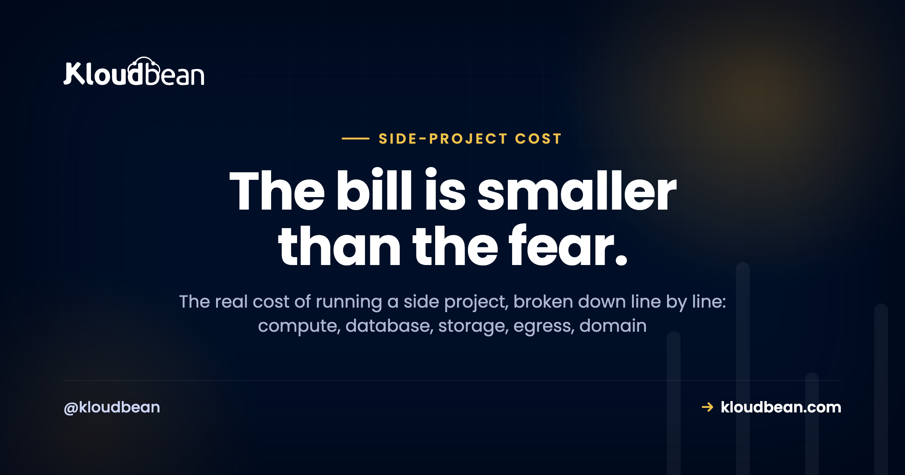

# The Real Cost of Running a Side Project

You built a thing. A weekend SaaS, a Discord bot, a small Django API, an app Lovable or Bolt spat out on a Tuesday night. Now you want it online, and a small voice asks the question that kills more side projects than bad code ever does: is this going to cost me a fortune?

Short answer: no. The cost of running a side project is usually tiny, and the fear is almost always bigger than the bill. But "tiny" isn't "free," and the free option has a bite you should see coming. So let's put honest, illustrative numbers on every line, including the one nobody sends you an invoice for. Every figure here is a rough example, not a quote. Prices move, and yours will differ.

> **The short version.** For most side projects the bill is small. Often nothing while you build on free tiers, then a few dollars a month once you want it always-on with your own domain. Compute is the biggest cash line, a domain is roughly a dollar a month billed yearly, and a small database adds a few dollars only if you need one. The cost that actually stings is your time. Aim for a bill so small and predictable you never babysit it. All numbers below are illustrative.

## So what's the honest number?

For a typical side project, somewhere between free and about the price of a couple of coffees a month. A small always-on server, maybe a small database, plus a domain, lands in the low single digits to low teens of dollars a month once it's real. That's it. The scary five-figure cloud bills you've read about come from large production systems, badly configured autoscaling, or a viral moment with no caps. They don't come from a personal project serving a few hundred people. Your side project probably costs less to run than one streaming subscription.

So why does the fear persist? Because pricing pages are confusing on purpose, and because the loudest cost stories online are the disasters. Nobody writes a viral thread about the app that quietly cost four dollars a month for two years.

<!-- ADD IMAGE: a simple side project running (the app dashboard, or your own hosting bill showing a small monthly figure). Blur any account details. -->

## The "$0" that isn't free: the free-tier trap

Free tiers are great, and I'd never tell you to skip them while you're still building. Static front end? Host it free, custom domain and SSL included, and enjoy it. A free app tier or a small free database is perfect for the phase where the only visitors are you and three friends.

But free has fine print. Two parts of it catch people out.

- **It sleeps.** Most free app tiers idle your app after a few minutes of no traffic. The next visitor triggers a cold start and waits several seconds for the thing to wake up. Fine for a demo. Rough when a real user or a Show HN link finally arrives and the first impression is a spinner.
- **It bites later.** Free tiers cap resources, and the jump to the first paid tier is often steep, not gentle. Or the bill that was zero starts metering bandwidth once you get popular, exactly when you can least afford a surprise. And some free platforms make leaving painful, so the real cost shows up as a migration you didn't budget for.

None of that makes free bad. It makes free a phase, not a destination. There's a fuller take in [is free hosting worth it](https://www.kloudbean.com/blog/is-free-hosting-worth-it/) and a head to head in [free tier vs cheap VPS](https://www.kloudbean.com/blog/free-tier-vs-cheap-vps/).

## Where the cost of running a side project actually goes

Picture the whole bill as a stack. A few small cash lines at the bottom, and one big block on top that no provider prints. (See the cost-stack diagram in the HTML version: compute, database, storage and domain are small, while "your time" is the largest block.)

Here's each cash line, one at a time, with rough example ranges.

| Line item | Rough example | What drives it |
| --- | --- | --- |
| **Compute (server)** | a few dollars a month | The size you pick. Start small, resize later. The biggest and most controllable line. |
| **Database** | $0 to a few dollars | Free if you run it on the same server; a few dollars for a small managed one with backups. |
| **Storage + egress** | usually near $0 | Object storage for files is cheap; egress only bites if you serve lots of media. |
| **Domain** | ~$1 a month | Billed yearly, roughly ten to fifteen dollars a year. Separate from hosting. |
| **SSL certificate** | $0 | Free with Let's Encrypt and included on most decent hosts. Never pay for a basic cert. |
| **Email, monitoring, CDN** | $0 for a while | Sending email, error tracking, a CDN. All have free tiers sized for exactly this. |

Add the real lines together and a live side project sits in the single digits to low teens per month. That's the number to keep in your head. Not the horror stories.

### Is the database really a separate cost?

Only if your app stores data, and even then it's small. You've got two sane options. Run the database on the same small server as the app to keep the bill at zero extra, which is totally fine for a side project. Or launch a small managed database so patching and backups are handled for you. That second option costs a few dollars, and for data you'd be sad to lose, it's cheap insurance.

Kloudbean runs six managed engines if you go that route: PostgreSQL, MySQL, MariaDB, Redis, Elasticsearch, and MongoDB. If your project is stateless or just calls an external API, skip it. That line disappears. More on the choice in [adding a managed database to your app](https://www.kloudbean.com/blog/add-managed-database-to-your-app/).

### Will bandwidth blow up the bill?

For most side projects, no. Egress (the charge for data leaving your server) only turns into a real number when you serve a lot of media, big downloads, or a genuinely busy site. If that's you, the fix is to put a CDN in front so files get cached at the edge and hit your origin far less, and to keep large files in [object storage](https://www.kloudbean.com/blog/s3-compatible-object-storage/) instead of bloating the server. For a normal app serving pages and JSON, bandwidth barely registers.

## The line item nobody sends you: your time

This is the big translucent block in that diagram, and it's the one that actually decides whether your side project is cheap. A raw server for a few dollars looks unbeatable until you count the evenings. Setup. Patching. The SSL renewal that silently failed. The 11pm "why is it down" session. None of that is on a pricing page, but it's the most expensive part of the whole thing.

Honestly? For a side project, the goal was never $0. It's a bill so small and so predictable you forget it exists, plus a setup you never have to nurse. Chasing a true zero usually means paying in weekends instead of dollars, and your weekends are worth a lot more than three dollars a month. If you want to see that math laid out in full, we did it in [the real cost of an unmanaged VPS](https://www.kloudbean.com/blog/the-real-cost-of-unmanaged-vps/).

<!-- ADD IMAGE: a simple sketch or photo showing time as the real cost (a late-night laptop, or a small chart of hours spent vs dollars saved). -->

## A setup that stays cheap (and boring)

Cheap and boring is the goal. Boring means it doesn't wake you up. Here's a shape that stays small as the project grows.

- **One small always-on server.** No cold starts, no waking a sleeping app. Run the app and a small database on the same box to start. Resize only when you measure an actual reason to, not "just in case."
- **Free SSL.** Certificates are automatic and free. That line stays at zero forever.
- **Free static hosting for a front end.** If your project is a static site or a SPA, host it free with a custom domain and SSL, and point it at your API.
- **Files in object storage.** Uploads and media go to S3-compatible [object storage](https://www.kloudbean.com/blog/s3-compatible-object-storage/), not onto the server disk, so the server stays small.
- **Automatic backups.** So a bad deploy or a fat-fingered delete isn't a catastrophe. See the [server backups guide](https://www.kloudbean.com/blog/server-backups-guide/).

On Kloudbean that's all one dashboard and one predictable bill. The server, the database, storage, SSL, and backups sit together instead of scattered across four accounts you'll forget about. There's a free trial to start, and free migration help if you're moving something over. Most side projects, honestly, never outgrow this.

<!-- ADD IMAGE: the add-server screen showing small sizes and their prices, so readers see the cheap options up front. Console screenshot: add-server.png fits here. -->

## When it's actually worth paying more

When the project stops being just for you. The moment real users depend on it, or it starts earning, the small step from a sleepy free tier to an always-on server pays for itself in one avoided bad first impression. That's not spending for the sake of it. It's matching a still-small cost to the fact that the thing now matters. And a managed setup earns its few extra dollars the day you'd rather improve the project than patch its operating system. If you're weighing hosting styles, [managed vs unmanaged hosting](https://www.kloudbean.com/blog/managed-vs-unmanaged-hosting/) and [cloud hosting pricing explained](https://www.kloudbean.com/blog/cloud-hosting-pricing-explained/) both go deeper.

---

**Ship it without the bill anxiety.** Run your side project always-on on one small server, app and database together, with free SSL and automatic backups, on a single dashboard and one predictable bill. Start free at [kloudbean.com](https://www.kloudbean.com/); sizes and plans on [pricing](https://www.kloudbean.com/pricing/).

Always-on server · Managed databases · Free SSL · Automatic backups · Free migration · Free trial

## FAQ

**How much does it cost to run a side project?**
For most small projects, very little. Often free while you build on free tiers, then commonly single digits to low teens of dollars a month once you want it always-on with your own domain. The big cloud bills people fear come from large-scale systems, not a personal project serving a manageable audience. These are illustrative ranges, not a quote.

**Can I host a side project for free?**
Early on, usually yes. Free app tiers, free static hosting for a front end, and small free databases can carry a project while you build or show a few people. The trade-off is that free tiers sleep when idle (so the first visitor after a lull hits a cold start) and cap resources. That's fine until real users need it fast and always-on.

**What's the catch with free hosting tiers?**
Two things. They sleep, so your app cold-starts and the first visitor waits several seconds. And they bite later, either by metering bandwidth as you get popular, by jumping steeply to the first paid tier, or by making it painful to migrate off. Free is a great building phase, not a forever home.

**Where does the money actually go?**
Mostly the server (the biggest and most controllable line), then a domain (small, billed yearly), and possibly a small database if your app stores data. SSL is free, and email, monitoring, and a CDN usually sit on free tiers at this scale. Unless you serve a lot of media, that's the whole bill.

**Do I need to pay for a database?**
Only if your app stores data, and even then it's small. Run it on the same small server to spend nothing extra, or use a small managed database for a few dollars to get backups and patching handled. Stateless projects, or ones that only call external APIs, may need no database at all.

**Is bandwidth (egress) going to surprise me?**
Rarely, for a normal app. Egress only becomes a real cost when you serve heavy media, big downloads, or a busy site. If that's you, put a CDN in front so files cache at the edge, and keep large files in object storage rather than on the server. For pages and JSON, bandwidth barely registers.

**How do I keep a side project cheap as it grows?**
Start small and resize only when you measure a reason to. Cache so a small server does more. Keep media in cheap object storage instead of bloating the server. Watch bandwidth if you serve a lot of files. Do those and the bill grows slowly and predictably. Most side projects never outgrow a small, cheap setup.

**Is a cheap unmanaged VPS cheaper than managed hosting for a side project?**
On the sticker, yes. Once you count your own time for setup, patching, backups, and the occasional late-night fix, often no. For a hobby box or a learning project the admin can be the point. For something you want to stay up without babysitting, a managed setup usually wins on real cost.

**When should I upgrade from a free tier?**
When it stops being just for you, when real users rely on it or it starts earning. At that point the small step to an always-on server (no cold starts, your own domain, reliability) is easily worth it. Until then, free or very cheap is the sensible choice.

---

By Kloudbean · The bill is smaller than the fear.
