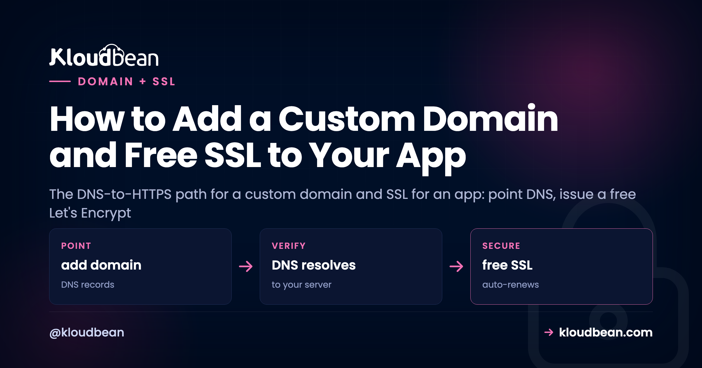
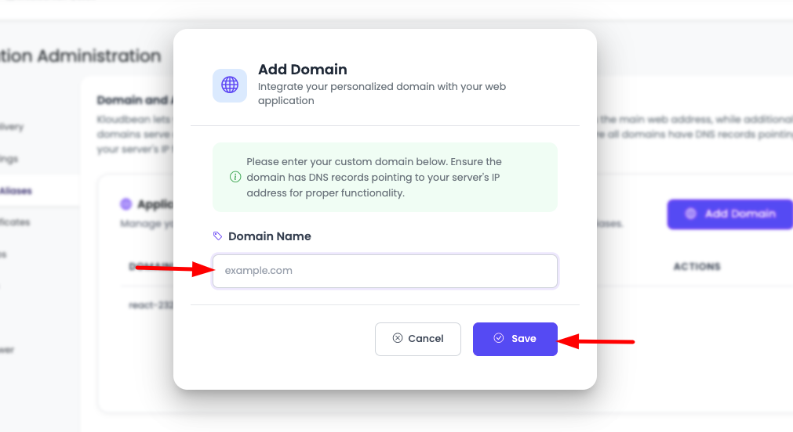
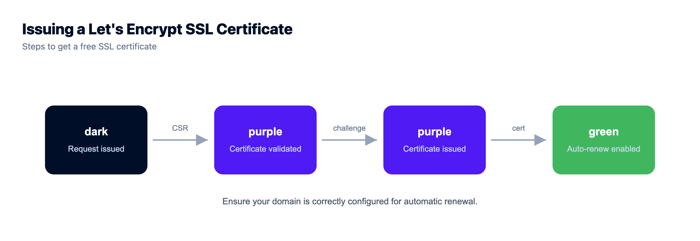

# How to Add a Custom Domain and Free SSL to Your App

Your app works. It's just living at a temporary address like `something.kloudbeansite.com`, which is fine for a demo and wrong for anything real. Adding a custom domain and SSL for an app is the step that turns a project into a product: your own name in the address bar, and the padlock next to it. This is the path from a bare domain name to a live HTTPS site, told as the four stages it actually moves through, with the specific thing that trips people up at each one. Because the order matters more than anything else, and getting it wrong is exactly why a certificate sometimes just won't issue.

> **The short version.** To put a custom domain and free SSL on your app: add the domain in the console, point DNS at your server (an A record for the apex, a CNAME for `www`), wait for DNS to propagate, then issue a free Let's Encrypt certificate and force HTTPS. Order is everything. The certificate can only issue after DNS resolves to your server, which is why "my SSL won't issue" is almost always "my DNS hasn't propagated yet."

## How the custom domain and SSL flow actually works

Most guides hand you a checklist and skip the one idea that prevents the frustration: this is a pipeline with a required order. Each stage depends on the one before it finishing. Skip ahead, and the stage you jumped to fails, not because you did it wrong, but because its prerequisite wasn't done yet. Here's the whole path, and the gotcha waiting at each step.

<!-- DIAGRAM: the DNS-to-SSL flow in five stages (add DNS records, DNS propagates, ACME challenge validates, certificate issued, HTTPS live and auto-renews), with a gotcha at each: www vs apex (add both, redirect one); the wait is real (minutes to hours); the #1 reason a cert won't issue is DNS not pointing at the server yet; check for a CAA record blocking Let's Encrypt; mixed content means load every asset over https. Caption: point DNS first, the certificate can only issue once the name resolves to your server. -->

## Stage 1: point your domain at the server

Two things happen here, in two different places, and mixing them up is where confusion starts. In your hosting console you *tell the server which domains to answer for*. At your registrar you *tell the internet where those domains live*. Both are needed. Neither does the other's job.

On [Kloudbean](https://www.kloudbean.com/), open your app and find **Domain Aliases**. Add your domain there, and decide up front whether you want the apex (`yourdomain.com`), the `www` subdomain, or both. Most people add both and redirect one to the other. Adding the domain here doesn't route any traffic yet. It just means the server will respond correctly when traffic for that name arrives.

Then, to actually point the domain to your app, create DNS records at your registrar (Namecheap, Cloudflare, GoDaddy, wherever the domain lives):

| Type | Host | Value | What it does |
| --- | --- | --- | --- |
| A | `@` | your server's IP (e.g. `203.0.113.42`) | Points the apex, `yourdomain.com`, at the server. |
| CNAME | `www` | `yourdomain.com` | Points `www` at the apex, so both resolve. |

That's the whole DNS for a web app in most cases: one A record and one CNAME. The A record maps a name straight to an IPv4 address; if your server has IPv6, an `AAAA` record does the same for it. A CNAME maps a name to *another name* rather than an IP, which is why `www` can follow the apex around if the underlying IP ever changes.

## Stage 2: let DNS propagate (the honest wait)

You saved the records. The domain still doesn't load your app. Don't panic, and don't start changing things. DNS changes take time to spread across the internet's resolvers. Sometimes it's a couple of minutes. Sometimes it's a few hours. That window is baked into how DNS works, and no host or registrar can make a global change instant. This is genuinely out of everyone's hands, including ours, so anyone promising instant propagation is bluffing.

If you know in advance you'll be changing records, lowering the record's **TTL** (time to live) a day beforehand shortens the cache window and speeds the eventual switch. Otherwise, the move is simply to wait, then check whether the name now resolves to your server's IP with any DNS lookup tool before you go looking for a problem that isn't there.

## Stage 3: issue the free SSL certificate

Once the domain resolves to your server, secure it. Kloudbean issues free **Let's Encrypt** certificates: you request one for your domain in the console and it's installed for you. Let's Encrypt is the certificate authority a huge share of the web already runs on, so "free" here doesn't mean second-rate. It means the padlock and encrypted connections at no cost.

Here's why the order in that diagram is non-negotiable, and it's the single most common support pattern I've seen around SSL: issuing a certificate proves you control the domain, and Let's Encrypt proves it by checking that the domain points where it should (the ACME challenge). If DNS hasn't propagated, that check can't pass, and issuance fails. So when someone says "my SSL certificate won't issue," the honest first answer, nine times out of ten, is "your DNS isn't pointing at the server yet." Confirm the domain resolves to your IP, then request the certificate again. If it resolves fine and issuance still fails, look for a **CAA record** on the domain, an older DNS record that restricts which authorities may issue certs and can quietly lock Let's Encrypt out. A deeper walkthrough of the failure cases lives in [fixing SSL certificate errors](https://www.kloudbean.com/blog/fix-ssl-certificate-errors/).

## Stage 4: force HTTPS and let it renew itself

With the certificate installed, your site answers on `https://`. One thing left: make sure everyone lands there. Redirect `http://` to `https://` so nobody hits the insecure version, and search engines treat the secure URL as canonical. Most setups flip this with a single toggle.

After that, renewal is not your job. Let's Encrypt certificates are short-lived by design, and on a managed platform they renew automatically before they expire. You set this up once and stop thinking about it. That's a real difference from running a bare VPS, where renewal is a cron job you write, babysit, and get paged about when it silently fails.

## Don't pay for a basic SSL certificate

Time for an opinion, because people still get talked into this. For a normal web app, a paid "basic" SSL certificate buys you nothing a free Let's Encrypt certificate doesn't already give you. The encryption is identical. The padlock is identical. Browsers don't rank one above the other. What you'd pay for is a domain-validated certificate that does exactly what the free one does, plus an annual renewal chore.

| | Paid "basic" (DV) certificate | Free Let's Encrypt |
| --- | --- | --- |
| Encryption strength | Standard TLS | Identical standard TLS |
| Browser padlock | Yes | Yes, the same one |
| Cost | An annual fee | Free |
| Renewal | You remember and re-buy | Automatic, before expiry |

There are narrow cases for paid certificates: an OV or EV certificate that validates your organization's legal identity, or a wildcard covering unlimited subdomains under one cert. If you have that need, buy it deliberately. For "I just want my app on HTTPS," the free certificate is the right call, full stop.

## Where custom domain and SSL setups actually break

Almost every problem here is one of four, and none is a dead end. It's the ordinary friction of DNS and certificates, and it clears with the right record and a little patience. If DNS and the certificate are both fine and the *app* is what started misbehaving on the new address, that's a separate class of problem: [why an app breaks after you add a custom domain](https://www.kloudbean.com/blog/why-ai-app-breaks-after-custom-domain/) covers the hard-coded URLs, CORS origins, and OAuth callbacks still pointing at the old one.

- **The domain won't load.** Almost always propagation. Confirm the A record points to the correct server IP, then give it time.
- **The certificate won't issue.** DNS hasn't propagated so the ACME challenge can't confirm control, or a CAA record is blocking Let's Encrypt. Confirm the domain resolves to your server, check for a CAA record, then request again.
- **The padlock shows a warning.** That's mixed content: your HTTPS page is pulling an image, script, or stylesheet over `http://`. Find the hard-coded `http://` reference and make it `https://` (or protocol-relative). It often pairs with tightening up your [security headers](https://www.kloudbean.com/blog/security-headers-guide/).
- **www works but the apex doesn't** (or the reverse). You only set up one. Add the DNS record for the other and include it in Domain Aliases.

<!-- ADD IMAGE: the SSL screen showing a free Let's Encrypt certificate issued and active, with auto-renew on -->

> **Running Cloudflare in front?** Two settings save a lot of head-scratching. While you issue your server's Let's Encrypt certificate, temporarily set the DNS record to "DNS only" (grey cloud) so the domain-control check reaches your server directly, then re-enable proxying. And set Cloudflare's SSL mode to "Full (strict)" so it validates your server's real certificate, never "Flexible," which leaves the hop between Cloudflare and your server unencrypted. Not using Cloudflare? A plain A record at your registrar is all you need. Ignore this.

## What this does not cover

On Kloudbean, adding a domain and issuing a free Let's Encrypt certificate are console operations on your **Linux** server, and renewal is automatic. Two honest notes. Propagation time is inherent to DNS, so a short wait after you change records is normal, not a red flag. And your DNS records live at your registrar, not in the hosting console: the console tells the server which domains to answer for and handles the certificate, but the actual A and CNAME records are managed wherever the domain is registered. Get those two right and HTTPS for your deployed app is a few calm steps. If you built in a tool like Lovable, the whole deploy-then-domain path is in [deploying a Lovable app to your own server](https://www.kloudbean.com/blog/deploy-lovable-app-to-your-own-server/), and once the domain's live you'll want [auto-deploy from GitHub](https://www.kloudbean.com/blog/ci-cd-auto-deploy-from-github/) so updates ship on every push.

<!-- cta:start -->
**Patched, firewalled, and backed up.**

The platform keeps the server, stack, SSL, and patching current, with automatic backups running. Application-level security stays yours, and that split is deliberate rather than hidden.

- Shorewall firewall
- Fail2ban
- OS patching handled
- Free SSL
- IP access control
- Automatic backups

[Start free](https://console.kloudbean.com/register) · [See plans](https://www.kloudbean.com/pricing/)
<!-- cta:end -->

## FAQ

**How do I put my app on my own domain?**
Add the domain under Domain Aliases in your hosting console, then create a DNS A record at your registrar pointing the domain to your server's IP address (and a CNAME for `www`). Once DNS propagates, the domain serves your app. Then issue an SSL certificate for HTTPS.

**Is the SSL certificate really free?**
Yes. Kloudbean issues free Let's Encrypt certificates, the same authority much of the web uses, and renews them automatically. Free here means no cost for the padlock and encryption, not a lesser certificate. For a standard app there's no reason to buy a basic paid one.

**Why won't my SSL certificate issue?**
Almost always because DNS hasn't propagated yet, so the domain-control check can't confirm your domain points to the server. Verify the domain resolves to your server's IP first. If it does and issuance still fails, check for a CAA record on the domain that may be blocking Let's Encrypt, then request again.

**How long does DNS take to propagate?**
Anywhere from a few minutes to a few hours, occasionally longer. It's inherent to how DNS spreads across the internet and isn't something a host or registrar can make instant. Point the records, then give it time before you troubleshoot.

**Should I use www or the bare domain?**
Either is fine. Just pick one as primary and redirect the other to it so your site isn't split across two addresses. Add both in Domain Aliases, choose a canonical one, and redirect the other.

**My padlock shows Not Secure even with a certificate. Why?**
That's usually mixed content: the page loads over HTTPS but pulls an asset (an image, script, or stylesheet) over plain `http://`. Find the hard-coded `http://` reference in your code and switch it to `https://`, and the warning clears.

By Kloudbean · Managed multi-cloud hosting. Build. Deploy. Scale. Faster Than Ever.
