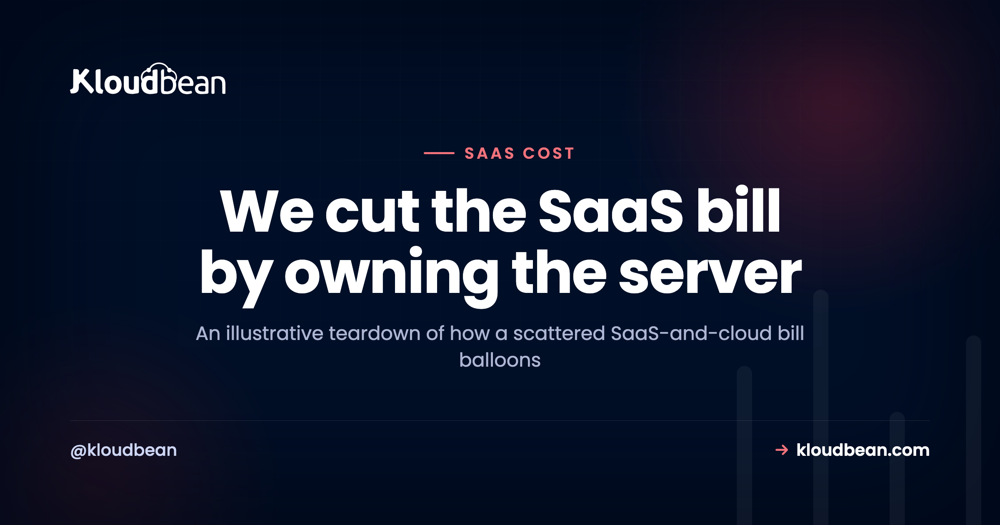

# How One Team Cut a $4,000 Hosting Bill to $100

The bill never arrives as one shock. It creeps. A plan bump here because you added a teammate. A database tier upgrade there because you crossed a row limit. A second project on its own plan. An add-on for logs, another for preview environments, a usage overage in a month that went well. Each charge looked reasonable the day it appeared. Then one afternoon you total them up and the number is genuinely startling. This is a teardown of how that happens, and the honest way to cut a SaaS hosting bill by consolidating the pieces onto one server you own. Fair warning up front: the numbers here are an illustrative worked example, not a real customer's invoice.

> **The short version.** Big hosting bills are rarely one big charge. They're a metered, per-seat, per-project stack that crept up one reasonable line at a time. The lever that changes the math is consolidating hosting, databases, and multiple projects onto one flat-rate server you own. It won't cancel the genuine third-party SaaS you actually use (email, analytics, auth), and it won't help much if you're tiny. For a growing team paying three kinds of multiplier on the same infrastructure, it turns a bill that scales with everything into one flat number you control. The figures below are illustrative.

> **Read the numbers as a worked example.** No named customer, no real invoice, no promised price. These are realistic, publicly-typical pricing shapes assembled to show *where the money hides* and why consolidation collapses it. Your figure depends entirely on your traffic and stack.

## An illustrative $4,000 bill, drawn to scale

First, the picture. On the left is the scattered infrastructure stack, each metered line drawn to its size. On the right is what replaces it: one flat-rate server. Same app, same traffic, wildly different bill. The genuine third-party SaaS sits outside this chart on purpose, because it doesn't move.

<!-- DIAGRAM: an illustrative before/after cost bar comparison (not a usage curve). BEFORE = a tall stacked bar of separate metered infra line items summing to about $3,460/mo: serverless/edge (seats + usage) $1,300, projects 2 & 3 (own plans) $700, managed Postgres (tier creep) $480, logs + metrics/APM $360, object storage + egress $240, preview/staging add-on $200, managed Redis $180. AFTER = one short green bar of about $100/mo for a single flat-rate server. Footnote: illustrative; third-party SaaS (email, analytics, auth) is separate and unchanged on both sides. -->

## The $4,000, line by line

Saying "$4,000 on hosting" hides the truth. Laid out honestly, an illustrative bill like this splits into infrastructure you're renting in an expensive shape, plus genuine services you'd pay for anywhere:

| Line item | How it bills | Illustrative $/mo |
| --- | --- | --- |
| Serverless / edge platform | Per seat, times the team, plus usage overages | $1,300 |
| Projects 2 & 3 | Each app on its own paid plan | $700 |
| Managed Postgres | Started free, climbed tiers on rows and connections | $480 |
| Logs + metrics / APM | Retention and host-based pricing | $360 |
| Object storage + egress | Storage plus per-GB bandwidth out | $240 |
| Preview / staging | Paid add-on per environment | $200 |
| Managed Redis | Separate metered cache tier | $180 |
| **Infrastructure subtotal** | **The part that consolidates** | **$3,460** |
| Third-party SaaS | Email, analytics, auth, error tracking (stays) | ~$540 |

That last row matters, because it's the part consolidation won't erase. Add it to the infrastructure and you're near the $4,000 headline. But roughly $3,460 of it is infrastructure rented in the most expensive possible shape, and that's the part we can collapse.

## Where the money actually hides: three multipliers

Here's the grounded pattern, and it's the thing that surprises people most when they audit a crept-up bill: the biggest number is rarely the raw compute. It's the multipliers stacking on top of it. Modern platforms are priced to grow with your success in three directions at once.

- **Per seat.** Each teammate adds cost, whether or not they ever touch infrastructure. Stop paying per-seat hosting and one whole axis disappears.
- **Per project.** Each app is its own plan, so shipping a second and third thing multiplies the base cost instead of sharing it.
- **Per usage.** Requests, function invocations, bandwidth, database rows and connections, build minutes. Every good month costs more.

The usage axis is the sneaky one, and egress is its worst line, because you get billed for being popular. Worth knowing which storage bills you for that and which doesn't: Kloudbean's built-in S3-compatible buckets don't meter data transfer out at all, so serving images and downloads from there removes a variable line rather than shrinking it. Managed Google Cloud Storage buckets are a different product on a dedicated cloud project, and those do bill both egress and ingress.

None of these is a scam. They're rational ways for a platform to charge. But stacked together, your bill scales with your team size, your ambition, and your traffic simultaneously. That's three multipliers on one base, and a team growing on all three axes feels it fast.

## How consolidating cuts the SaaS hosting bill

The move that changes the math is collapsing the *infrastructure* portion (hosting, database, and the per-project multiplication) onto a single server you own at a flat monthly price. Flat-rate app hosting removes the multipliers, not just the price. On a managed server it looks like this:

- **One server, flat price,** no matter how many requests arrive or how many teammates log in to deploy. No per-seat tax on infrastructure.
- **The database sits next to the app** on the same box, a managed Postgres or MySQL you launch from **DBS → Launch Database**, not a separately metered service climbing tiers.
- **Several apps on one server.** The second and third project become additional applications on the server you already pay for, each with its own domain and database, not three separate plans.
- **Staging is just another app** on the same server, not a paid add-on per environment.

That's where the pile collapses. When hosting stops being per-seat, the database stops being a metered tier, and three projects stop being three plans, the infrastructure line goes from "scales with everything" to "one predictable number." In this example, a single well-sized server in the low hundreds a month replaced the whole infrastructure stack, and because the traffic fit comfortably on one box, the effective figure landed near $100. The roughly $540 of genuine third-party SaaS didn't move, because it never should.

## What consolidation honestly won't fix

It's a lever, not magic, so here's the straight talk:

- **Real third-party SaaS stays.** Email delivery, analytics, an external auth provider, error tracking. If you use them, you keep paying for them. Moving servers doesn't touch those subscriptions.
- **Traffic still has to fit.** The price is flat because it's a fixed-size server. If your traffic genuinely needs a bigger box or a load balancer, you size up and the number rises. Still predictable, not frozen at $100 forever.
- **At tiny scale, flat can cost more.** One low-traffic app can be cheaper on a hobby or free tier than on any always-on server. Consolidation pays off when you have several things, a team, or enough usage that metered pricing has turned against you.
- **You now own a server.** Managed means the OS, stack, SSL, and backups are handled. The application is still yours to maintain. A fair trade, not a free lunch.

So don't migrate a single sleepy app for the drama of it. The math only bites once the metered stack has grown teeth.

## The common mistake

The most common mistake is expecting the flat server to swallow the whole bill, then feeling cheated when the email and analytics invoices keep arriving. That's not a failure of consolidation; those were never infrastructure. Separate the two piles cleanly and the win is obvious and honest, rather than overpromised.

The other one is watching only the big, obvious line (the compute plan) while the quiet meters do the damage. Egress fees, per-connection database charges, and log retention rarely show up as a single scary number. They bleed. When we help teams audit, the surprise is almost never the server; it's the sum of the small metered things nobody was watching. Consolidation helps precisely because it turns that scatter of meters into one flat line you can actually see.

## But isn't one server riskier?

Fair objection, so let's meet it head-on. Spreading your stack across many managed platforms does buy a kind of resilience: if one service has a bad day, the others don't. Consolidating concentrates that. But the trade is more even than it looks. A managed server comes with backups, monitoring, and a process manager that restarts your app if it falls over. And the multi-platform setup has its own hidden fragility: more vendors means more separate outages that can hit you, more billing relationships to manage, and more places for a misconfiguration to hide. If uptime is genuinely critical, you don't abandon consolidation, you scale it deliberately with a load balancer and more than one instance, which a managed server supports without re-architecting your app. For most small teams, one well-backed-up server is more reliable than a sprawl of tiers nobody is actively watching. Concentration isn't automatically risk; unmanaged sprawl carries its own.

Two things make that trade practical rather than theoretical. Backups run automatically, and you can also take an on-demand one before a risky deploy, which is the moment you actually want a restore point. And the load balancer is built in on any Kloudbean account rather than being a separate product you go and buy, so the day one box stops being enough, you put a second behind an FLB and keep the same flat-price shape. That's the honest version of "scale later": a decision you can defer, not one you have to design around now.

## Why predictable beats cheapest

Here's my actual opinion, after watching a lot of these bills. The goal isn't the lowest possible number. It's a number you can forecast. A flat server costs the same in a quiet month and a viral one, so you can budget it, and a launch that goes well doesn't arrive with a usage-overage hangover. For a small team, a bill you can predict at the start of the month and recognize at the end of it is worth more than shaving off the last few dollars. Cheapest is a trap when "cheapest" also means "unknowable until the invoice lands."

<!-- ADD IMAGE: a simple before/after of the monthly total: a long itemized invoice with many line items next to a one-line flat server charge (mocked or anonymized, no real vendor names or account data) -->

## Run the teardown on your own bill

You don't need a $4,000 bill for this to matter. Pull up your last invoice and sort every line into two piles:

1. **Infrastructure you're renting:** hosting, database, per-project plans, preview environments, logs, bandwidth. This is the pile a flat server can collapse.
2. **Genuine third-party services:** email, analytics, auth, error tracking you'd keep on any host. This pile stays, so leave it alone.

Add up pile one. If it's a meaningful number, and if you're running more than one app, on a team, with real traffic, it usually is, the case makes itself. If it's small, you've just confirmed you're fine where you are, which is also a useful answer. Either way you now know your real infrastructure spend as a single figure, which is more than most teams can say before they do this. The [cut your cloud bill guide](https://www.kloudbean.com/blog/how-to-cut-your-cloud-bill/) goes deeper on the exercise, and [cloud hosting pricing explained](https://www.kloudbean.com/blog/cloud-hosting-pricing-explained/) unpacks the metered shapes.

<!-- ADD IMAGE: the "two piles" worksheet: invoice lines sorted into "infrastructure (consolidates)" and "third-party SaaS (stays)" columns -->

## How the consolidation actually happens

The practical path is undramatic, which is the point. You launch a managed server, deploy each app from its Git repo, move each app's database onto a managed instance on that server, port the environment variables, and cut each domain over with SSL. Apps that lived on three platforms now live on one, behind their own domains, sharing a server you pay for once. Do it one app at a time so nothing goes dark, and decommission each old plan only after its app is confirmed live on the new box. The [deploy walkthrough](https://www.kloudbean.com/blog/deploy-ai-built-app-to-production/) covers the steps, running the whole stack on [one server](https://www.kloudbean.com/blog/host-app-api-and-database-on-one-server/) explains the architecture, and the agencies who do this at scale describe the same pattern in [hosting 20 client apps](https://www.kloudbean.com/blog/how-agencies-host-20-client-apps/).

## Should you actually do this? Read your own two piles against these

You've got pile one totalled by now. Run it past these six cues and the answer usually falls out in a couple of minutes.

- **Pile one is small and you run one app.** Stay where you are. An always-on server loses to a hobby tier at that size, and switching costs you a weekend for nothing.
- **You pay per seat for people who never deploy.** Consolidate. That axis is the purest waste on the invoice, and it's the one that grows every time you hire.
- **Two or more apps, each on its own plan.** Biggest single win available. They become applications on one server, each with its own domain and database.
- **A metered database tier is your second-biggest line.** Move it next to the app. This is the change that most often surprises people with how much it takes off.
- **Bandwidth or egress keeps spiking.** Check what's actually serving your files. Kloudbean's built-in S3-compatible object storage doesn't meter data transfer out, so a media-heavy app can lose a whole recurring line by moving assets there. Note the scope: that applies to the built-in storage, not to managed Google Cloud Storage buckets, which do bill egress and ingress.
- **A good month frightens you.** Flat wins on predictability even at roughly equal price. That's a real reason, not a soft one.

One scope note before you plan a move. Kloudbean runs Linux stacks: Node, PHP, Python, Go, Ruby, Java, .NET on the Linux-supported versions, and frameworks like React, Next.js, Vue, Laravel, Django, and WordPress. Windows Server sits on premium and enterprise plans, so if you need IIS specifically, raise it before you scope the migration rather than after.

And the part no host fixes, ours very much included. If your bill is high because one endpoint runs an N+1 query on every page load, or because a background job re-processes the same rows every night, moving it to a flat server just relocates the problem behind a fixed price. It'll be cheaper. It'll still be wrong. Same with the third-party SaaS in pile two: nobody's hosting plan cancels your email or analytics subscription. Consolidation is a pricing-shape fix, and it's a good one, but it doesn't touch application decisions. Those stay yours on every platform. If an unmanaged box still looks cheaper on paper, the [real cost of an unmanaged VPS](https://www.kloudbean.com/blog/the-real-cost-of-unmanaged-vps/) is the honest comparison, and side projects have their own math in [the cost of running a side project](https://www.kloudbean.com/blog/cost-of-running-a-side-project/).

**A bill you own, not one that owns you.** See what a flat, owned server would cost you on [pricing](https://www.kloudbean.com/pricing/), or start free at [kloudbean.com](https://www.kloudbean.com/) with your first migration done for you.

## FAQ

**Can I really cut my hosting bill from $4,000 to $100?**
The numbers here are illustrative, not a guarantee. Your figure depends on your traffic and stack. The real mechanism is consolidating hosting, databases, and multiple per-project plans onto one flat-rate server, which removes the per-seat, per-project, and much of the usage-based cost. How far it drops depends on how much of your bill was that kind of infrastructure.

**Will consolidating cancel all my subscriptions?**
No. Genuine third-party SaaS stays: transactional email, analytics, external auth, error tracking. Consolidation collapses the infrastructure you rent (hosting, database, per-project plans, preview environments), not services you'd use on any host.

**Does one server really host several apps?**
Yes. Each app runs as its own application on the server, with its own domain and database, so a second or third project doesn't need a separate plan. It shares the server you already pay for.

**When is consolidation not worth it?**
When you run a single low-traffic app whose current bill is tiny. A hobby or free tier can beat an always-on server at very small scale. The savings appear when you have several apps, a team, or enough usage that metered pricing has turned expensive.

**Is a flat server always the cheapest option?**
Not always the absolute cheapest, but usually the most predictable. It costs the same in quiet and busy months, so you can budget it, and for a growing team that predictability is often worth more than the lowest possible line item.

**What actually made the bill so high in the first place?**
Usually the multipliers, not the compute. Per-seat pricing, per-project plans, and usage meters (bandwidth, database connections, log retention) stack on top of each other, so the bill grows with team size, number of apps, and traffic at the same time. Consolidation removes the per-seat and per-project multipliers and folds the rest into one flat server.

By Kloudbean · Managed multi-cloud hosting. Build. Deploy. Scale. Faster Than Ever.
