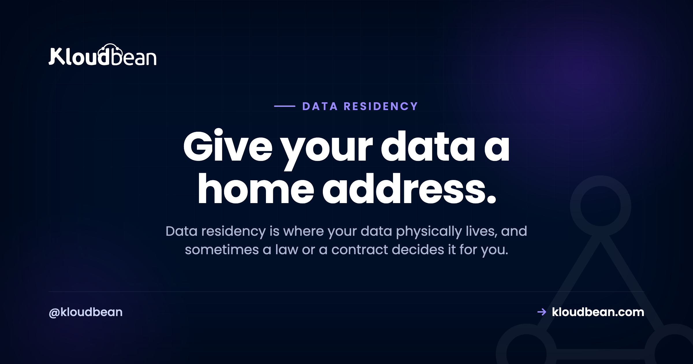
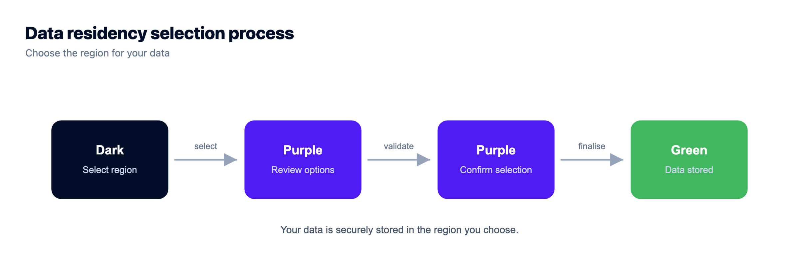
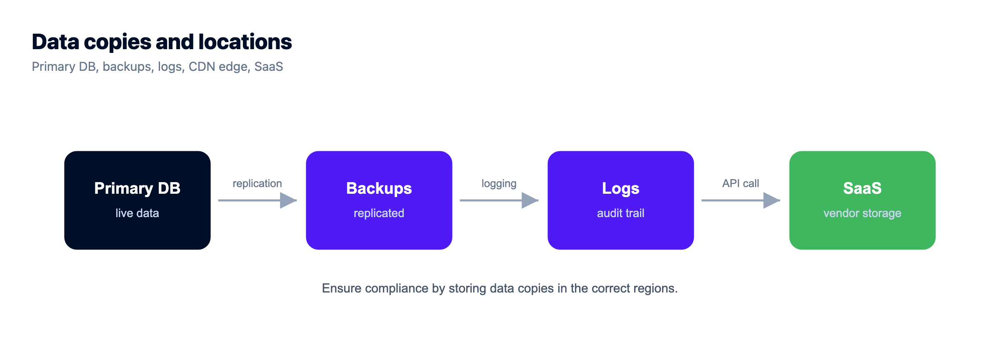
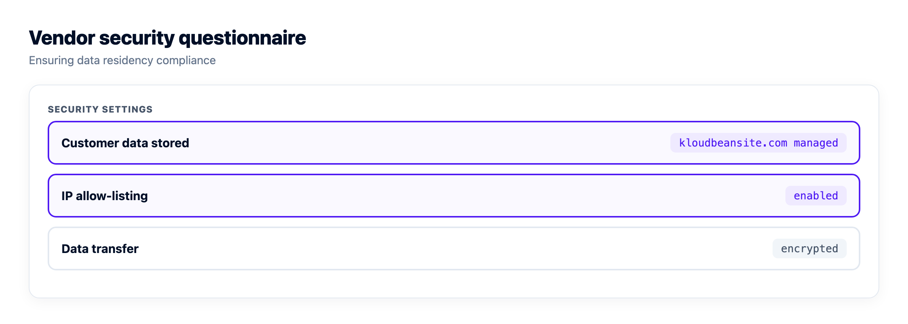

# Data Residency Explained: Where Your Data Lives, and Why It's the Law

Your data lives somewhere physical. Not "the cloud." A specific building, in a specific country, under that country's laws. Data residency is the practice of deciding where on purpose, before an auditor or an enterprise customer decides it for you.

People treat this like a lawyer's problem. It's mostly an engineering choice you make once, at the moment you provision a server. Get it right early and it's a shrug. Get it wrong and you're migrating a live database under a deadline while a security team waits on the call.

> **Short answer:** Data residency is where your data physically sits. Data sovereignty is whose laws apply once it sits there. You control residency by choosing the cloud region your servers and database run in, so pick that region deliberately before you launch. Moving data after a contract or an audit demands it is the expensive way to learn this.

## Residency vs sovereignty: two words, one decision

**Data residency** is the physical location of your data. Which country, which data centre, which set of walls the actual bytes sit behind. **Data sovereignty** is the consequence: whichever country holds the data, its laws reach that data. Store bytes in Frankfurt and you've opted into EU rules for them. Store them in Virginia and you've opted into US ones.

The two move together, so you don't really decide them separately. Pick the location and you've picked the legal regime by the same click. That's why "where should our data live?" is a bigger question than it sounds. You're not choosing a postcode. You're choosing whose courts, regulators, and disclosure laws get a say.

## Why data residency actually matters

Three forces push on this, and they carry very different weight.

The heavy one is **law**. Some rules expect certain data to stay inside a region, or to be properly protected when it leaves. If you hold personal data on people in the EU, the GDPR cares where that data goes. Get it wrong and the downside is a fine, not a bad review.

Next is **trust**, and it closes or kills deals. Enterprise buyers and government bodies routinely ask where their data will live before they sign, and plenty of them require it stay in-country. "I'm not sure" is a losing answer in a procurement review. "Frankfurt, and here's the region" moves the meeting along.

Last, and lightest, is **latency**. Data near your users loads quicker. Real, but it rarely decides anything on its own. If law and contracts are quiet, latency becomes the tiebreaker. If they're not, it doesn't get a vote.

## What "on purpose" looks like, and what sprawl looks like

The whole game is keeping your data where you meant to put it, instead of letting it scatter by default. Here's the difference.

```
CHOSEN ON PURPOSE                         SCATTERED BY DEFAULT
┌─ Region: eu-central (Frankfurt) ─┐      App server ....... us-east
│  App server        (in-region)   │      Database ......... eu-west
│  Managed database  (private net) │      Backups .......... ap-south
│  Backups           (same region) │      Where does it live?  (?)
└──────────────────────────────────┘
One region. You know the answer.         Three regions. Which law applies?
```

*Residency isn't just the primary database. It's every copy: the app, the backups, the logs. The goal is one deliberate answer to "where does our data live?", not three accidental ones.*

## The one lever you actually control: pick the region

Here's the good news buried under all the legalese. The thing you control is simple and it's mostly one decision. When you launch a server or a managed database, you choose the cloud and the region it runs in. That choice pins where the data lives.

On Kloudbean you're picking across seven clouds: AWS, AWS Lightsail, Google Cloud, Linode, Vultr, DigitalOcean, and UpCloud, each with its own regions. Choose an EU region and your app server and database run in the EU. The managed database is locked down with IP allow-listing so only your app server can reach it rather than the open internet, so it isn't exposed for any scanner to find. On Enterprise plans it can go further onto a [private network (VPC)](https://www.kloudbean.com/blog/what-is-a-vpc/). You're not filing a ticket and hoping. You're clicking a region at launch.


Same move for the database. A managed engine launches into the region and network you choose, and it's backed up for you from there.




## The copies people forget: backups, logs, the CDN, and your SaaS

This is where residency quietly goes wrong, and it's the part thin guides skip. You lock your primary database to a region, feel done, and forget that your data has been quietly copying itself somewhere else the whole time. Four copies catch people out.

- **Backups.** A backup is a full copy of your data. If backups land in a different region than the primary, your data now lives in two places, and the second one might be somewhere you didn't intend. Ask your provider, us included, which region the backup copy actually lands in, and get it in writing rather than assuming it matches the primary. It's a one-line question that saves an awkward answer later. There's more on getting this right in the [server backups guide](https://www.kloudbean.com/blog/server-backups-guide/).
- **Logs and analytics.** Request logs, error traces, and product analytics carry personal data more often than people admit. IP addresses, emails, user IDs. And they frequently ship straight to a third party sitting in another country. That's data leaving your region through a side door.
- **The CDN edge.** A CDN caches copies of your content at edge locations around the world. For public, static assets, fine, that's the whole point. But if you cache authenticated or personal responses, you've scattered copies of personal data across dozens of countries without meaning to. Know exactly what you let the edge cache. This applies to the Cloudflare add-on on a Kloudbean account exactly as it does anywhere else: turning on edge caching is a speed decision that quietly becomes a residency decision the moment a cached response contains someone's name.
- **Third-party SaaS.** Every service you forward data to has its own residency. A payment processor, an email sender, an analytics tool, an LLM API. Your residency is only as tight as the vendors you hand data to, so their locations are your locations too.

None of these are exotic. They're the default plumbing of a normal app. The mistake isn't using them. It's not knowing they hold copies. Map the copies before someone asks you to.



## A decision you can make in five minutes

You don't need a workshop for this. Walk down the list, stop at the first row that fits, and you have your region. Law and contracts decide it when they apply. Everything else is a tiebreaker.

| Your situation | Where to host | Why |
| --- | --- | --- |
| Personal data of EU residents | An EU region (say, Frankfurt) | Cleanest defensible default under GDPR; keep processing there too |
| A contract or customer names a country | That country, full stop | The clause outranks everything else on this list |
| Health, finance, or public-sector data | The region the sector's rules require | Localisation rules beat convenience; confirm the specifics with counsel |
| Global consumer app, nothing sensitive | The region nearest most users | Optimise for latency and trust; you're free to move as you grow |

Notice how rarely you get to the bottom row. Most real decisions stop at row one or two. A single contract clause tends to end the conversation before latency ever comes up. And a country's own privacy law sits on top of the region you pick, which is why [hosting in South Korea is a PIPA question as much as a latency one](https://www.kloudbean.com/blog/hosting-in-south-korea/).

## A worked example

Say you run a small SaaS product, and you're about to close a deal with a German company. Walk the list. You'll store personal data on EU residents, so GDPR is in play. And the customer's contract says data stays in the EU. That clause ends it. You don't even reach the sector or the latency rows.

So you provision your server and managed database in an EU region, keep processing there, and when their security team asks where the data lives, you say "Frankfurt" and move on. Notice the speed. The moment a contract named a location, every other consideration fell away. That crisp answer does more for a security review than a page of policy ever will.

Frankfurt is an easy one. The harder version of this conversation is when the clause names somewhere less obvious, and that's where breadth of regions stops being a spec-sheet item. Across its seven clouds Kloudbean can provision into 80-plus data centres, with in-country hosting available in around 35 countries, from Dammam and Dubai to São Paulo, Sydney, Seoul, and Johannesburg. Whether you can say yes to a clause is often just a question of whether anyone runs a region there.



## What it costs to fix this after the fact

The reason to spend five minutes on the region at launch is that the retrofit is genuinely expensive, in ways that don't show up as a line on an invoice.

You pay first in **calendar time**. Moving a live database between regions means a dump, a restore, a cutover window, and a period where you're either read-only or accepting write loss. That's a maintenance window negotiated with the customer who asked the question, which is a bad first impression to make while you're still selling to them.

You pay again in **chasing copies**. The primary is the easy part. The backups, the log pipeline, the analytics vendor, the CDN cache, the queue that briefly persists payloads: each one needs finding, checking, and often replacing, and every miss is the same finding coming back at the next review.

You pay in **paperwork**. Sub-processor lists, data processing agreements, and privacy notices all name locations. Change the location and those documents are wrong until someone updates and re-signs them.

And you pay in **deal momentum**, which is usually the worst of it. A security questionnaire that stalls for three weeks on one row is three weeks the deal isn't closing. Compare that with the version where you already know the answer and type one word.

Almost none of that is avoided by picking a good host. It's avoided by picking a region on purpose, once, before anything is in it. What a host owes you is the ability to make that choice cleanly, and on Kloudbean that means picking cloud and region when you launch a server, a managed database, or an [object storage bucket](https://www.kloudbean.com/blog/s3-compatible-object-storage/), with the database locked down by IP allow-listing so only your app server can reach it.

Where every host stops, ours included: the region is the only part of this that's a hosting decision. Nobody's platform can tell you which of your log fields count as personal data, decide your lawful basis, set your retention period, or negotiate the clause in your contract. Compliance is shared, and honestly the smaller share sits with the infrastructure. Storing EU data in an EU region doesn't make you GDPR-compliant. It clears the one obstacle that's actually about location, and hands you back the rest.

For the deeper regulatory angle, go to [GDPR-compliant hosting](https://www.kloudbean.com/blog/gdpr-compliant-hosting/), [SOC 2 hosting](https://www.kloudbean.com/blog/soc2-compliant-hosting/), and [PCI-compliant hosting](https://www.kloudbean.com/blog/pci-compliant-hosting/). If you're buying for a regulated org, [enterprise hosting](https://www.kloudbean.com/blog/enterprise-wordpress-hosting/) covers the audit-trail and access side. And treat this article as a plain-English map, not legal advice. For a high-stakes case, confirm the details with someone qualified.

<!-- cta:start -->
**Ship the app, not the infrastructure.**

Servers, managed databases, object storage, and a built-in load balancer live behind one login, on the cloud and region you pick. The stack, SSL, patching, and backups are handled for you.

- Seven cloud providers
- Managed databases
- Object storage
- Automatic backups
- Free SSL
- Git deploy
- Free migration assistance

[Start free](https://console.kloudbean.com/register) · [See plans](https://www.kloudbean.com/pricing/)
<!-- cta:end -->

## FAQ

**What is data residency?**
Data residency is where your data physically sits: which country and data centre hold the actual bytes. It matters because whichever country holds the data, its laws apply to it. You set your residency by choosing the cloud region your servers and database run in.

**What's the difference between data residency and data sovereignty?**
Residency is the physical location of the data. Sovereignty is the legal consequence: the laws of the country where the data lives govern that data. They move together, so when you pick a region you're also picking whose rules apply. You don't choose them separately.

**Does choosing the right region make me GDPR compliant?**
No. Region choice clears the one obstacle that's actually about location, which is a real and necessary step, but it's one input to compliance, not the whole thing. You still own what data you collect, your lawful basis, retention, and user disclosures. Storing EU data in the EU is the floor, not the finish line.

**Where should I store data for EU customers?**
If you hold personal data on people in the EU, an EU region is the cleanest defensible default, and you should keep processing there too. Transfers out of the EU are possible but carry extra requirements. When the case is high-stakes or unclear, confirm the specifics with a qualified professional.

**Do backups and logs count for data residency?**
Yes, and this trips people up. A backup is a full copy of your data, so if it lands in another region your data now lives in two places. Logs and analytics often carry personal data like IPs and emails and frequently ship to a third party abroad. Check where both actually go.

**Does using a CDN break data residency?**
Not for public, static assets, since caching those at the edge is the normal, safe use. It becomes a problem if you cache authenticated or personal responses, because then copies of personal data spread across edge locations worldwide. Be deliberate about what you allow the CDN to cache.

**Do I need to store data in multiple regions?**
Usually not. Unless a law or contract requires data to live in more than one place, one deliberately chosen region covers most apps. For speed to distant users, a CDN can cache public content near them without moving your primary database. Multi-region storage is a requirement to satisfy, not a default to reach for.

**How do I set data residency on Kloudbean?**
You pick the cloud and region when you launch a server, a managed database, or an object storage bucket, across seven providers. That single choice pins where your data lives, and the database stays locked to your app server's IP. It's a one-time decision at launch, not a support ticket you file later in a panic.

---

*Kloudbean · Give your data a home address.*
