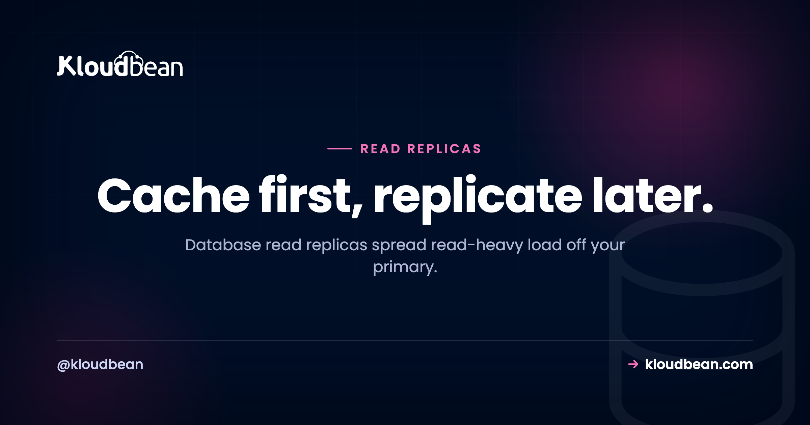

# Database Read Replicas: When You Actually Need One (and What to Try First)

It's a busy Tuesday. Your database CPU is pinned at 100%, the app is crawling, and Slack is filling up. You open the slow query log expecting one monster query. Instead it's thousands of small reads, the same SELECTs over and over.

That specific shape of problem, read-heavy load flattening a single database, is what **database read replicas** were built for. But here's the part most guides skip: a replica is often not the first thing you should reach for, and it comes with a catch that trips up teams who add one in a panic. So let's do this properly. What a replica is, the gotcha, the cheaper fixes to try first, and how to tell when a replica is genuinely the right move.

> **Short answer:** A read replica is a synced copy of your database that serves reads while the primary handles writes. It's the standard next step for read-heavy load, but it isn't free of gotchas: replication lag means a replica can be a few milliseconds behind, so route "read your own writes" queries to the primary. Try indexing, caching, and a bigger instance first. Add replicas when the reads that remain still overwhelm one database.

## What a read replica actually is

Picture one database doing all the work: every write and every read. A read replica splits that. You keep the **primary** for writes (inserts, updates, deletes) and stand up one or more **replicas** that hold a synced, read-only copy of the same data. Reads (your SELECTs) go to the replicas. Writes stay on the primary. Data flows one direction only: the primary receives a change, then streams it out to the replicas.

Because most apps read far more than they write, often by a wide margin, moving reads off the primary can relieve it dramatically. The primary stops fighting a flood of SELECTs and gets to focus on the writes only it can handle. That's the whole idea, and it's one of the oldest scaling patterns in the book for a reason.

<figure>
  <svg viewBox="0 0 720 360" width="100%" role="img" aria-labelledby="replica-title" xmlns="http://www.w3.org/2000/svg">
    <title id="replica-title">Writes go to the primary; the primary replicates to read-only replicas that serve reads</title>
    <rect x="0" y="0" width="720" height="360" fill="#ffffff"></rect>
    <rect x="24" y="150" width="150" height="80" rx="14" fill="#000f27"></rect>
    <text x="99" y="196" text-anchor="middle" fill="#ffffff" font-family="Poppins,sans-serif" font-size="16" font-weight="600">Your app</text>
    <rect x="300" y="40" width="180" height="86" rx="14" fill="#ffffff" stroke="#4F1AF3" stroke-width="2.5"></rect>
    <text x="390" y="78" text-anchor="middle" fill="#000f27" font-family="Poppins,sans-serif" font-size="15" font-weight="600">Primary</text>
    <text x="390" y="100" text-anchor="middle" fill="#4F1AF3" font-family="Poppins,sans-serif" font-size="12.5" font-weight="600">writes</text>
    <rect x="300" y="238" width="180" height="80" rx="14" fill="#ffffff" stroke="#40b75f" stroke-width="2.5"></rect>
    <text x="390" y="272" text-anchor="middle" fill="#000f27" font-family="Poppins,sans-serif" font-size="15" font-weight="600">Replica 1</text>
    <text x="390" y="293" text-anchor="middle" fill="#2f9d4e" font-family="Poppins,sans-serif" font-size="12.5" font-weight="600">reads</text>
    <rect x="516" y="238" width="180" height="80" rx="14" fill="#ffffff" stroke="#40b75f" stroke-width="2.5"></rect>
    <text x="606" y="272" text-anchor="middle" fill="#000f27" font-family="Poppins,sans-serif" font-size="15" font-weight="600">Replica 2</text>
    <text x="606" y="293" text-anchor="middle" fill="#2f9d4e" font-family="Poppins,sans-serif" font-size="12.5" font-weight="600">reads</text>
    <path d="M176 172 C 240 150, 260 110, 298 92" stroke="#4F1AF3" stroke-width="3" fill="none" marker-end="url(#w)"></path>
    <text x="196" y="126" fill="#4F1AF3" font-family="Poppins,sans-serif" font-size="12.5" font-weight="600">writes</text>
    <path d="M176 208 C 240 250, 260 270, 298 278" stroke="#40b75f" stroke-width="3" fill="none" marker-end="url(#r)"></path>
    <path d="M176 214 C 320 340, 470 320, 560 320" stroke="#40b75f" stroke-width="3" fill="none" marker-end="url(#r)"></path>
    <text x="196" y="252" fill="#2f9d4e" font-family="Poppins,sans-serif" font-size="12.5" font-weight="600">reads</text>
    <path d="M372 128 V 236" stroke="#5b6a86" stroke-width="2" stroke-dasharray="6 5" fill="none" marker-end="url(#rep)"></path>
    <path d="M420 128 C 470 180, 560 190, 590 236" stroke="#5b6a86" stroke-width="2" stroke-dasharray="6 5" fill="none" marker-end="url(#rep)"></path>
    <text x="486" y="172" fill="#5b6a86" font-family="Poppins,sans-serif" font-size="12">replication (async, ms of lag)</text>
    <defs>
      <marker id="w" markerWidth="10" markerHeight="10" refX="7" refY="3" orient="auto"><path d="M0 0 L7 3 L0 6 Z" fill="#4F1AF3"></path></marker>
      <marker id="r" markerWidth="10" markerHeight="10" refX="7" refY="3" orient="auto"><path d="M0 0 L7 3 L0 6 Z" fill="#40b75f"></path></marker>
      <marker id="rep" markerWidth="9" markerHeight="9" refX="6" refY="3" orient="auto"><path d="M0 0 L6 3 L0 6 Z" fill="#5b6a86"></path></marker>
    </defs>
  </svg>
  <figcaption>Writes go to the primary, which replicates asynchronously to read-only replicas. The app sends reads to the replicas and writes to the primary.</figcaption>
</figure>

## The catch nobody warns you about: replication lag

This is the one thing you have to internalize before you add a replica, because it's where they surprise people. Replication is usually **asynchronous**, which means there's a small delay, **replication lag**, between a write landing on the primary and showing up on a replica. Normally it's milliseconds. Under heavy write load it can stretch.

The practical failure looks like this. A user updates their profile name, the write hits the primary, then the very next page load reads from a replica that hasn't caught up yet, and they see their old name for a second. The bug report reads: "I saved my changes but it shows the old value." It's not a bug in your code. It's the replica being briefly stale, which is called eventual consistency.

You design around it, and it's not hard once you know the move. Reads that must reflect a change the same user just made ("read your own writes") go to the **primary** for that moment. Everything else (listings, search, dashboards, other people's content) reads from a replica, where a few milliseconds of staleness is completely fine. Here's the shape in code:

```python
# two connections: writes vs reads
primary = connect(DATABASE_URL)          # the primary
replica = connect(REPLICA_DATABASE_URL)  # a read replica

# a write always goes to the primary
primary.execute("UPDATE users SET name = 'Ada' WHERE id = 42")

# a normal read: slightly stale is fine, use the replica
replica.query("SELECT * FROM posts ORDER BY created_at DESC LIMIT 20")

# read-your-own-writes: read from the PRIMARY right after writing
primary.query("SELECT name FROM users WHERE id = 42")
```

Most frameworks give you this read/write split without hand-rolling connection logic. A quick reference:

| Stack | How it splits reads and writes |
| --- | --- |
| Laravel | `read` and `write` hosts in `config/database.php` |
| Rails (ActiveRecord) | `connects_to` with writing/reading roles, `connected_to` to pick |
| Django | Multiple entries in `DATABASES` plus a database router |
| Prisma | The `@prisma/extension-read-replicas` extension |
| Raw Node / pg | Two pools; route by whether the query writes |

<!-- ADD IMAGE: your read/write routing in one glance: writes to primary, reads to replica, and the read-your-own-writes exception -->

## Try the cheaper levers first

Now the opinion I'll stand behind: most "the database is slow" incidents are not a read-replica problem, and reaching for a replica first is a common way to add cost and complexity without fixing the real cause. Walk the ladder in order, cheapest first.

- **Index the queries.** A missing index is the single most common reason a database falls over as a table grows. Run `EXPLAIN` on your slow queries and add indexes on the columns you filter and join on. This is free and often the entire fix.
- **Cache the hot reads.** A lot of read load is the same handful of queries repeated: the homepage, a popular product, a dashboard. Put those results in [Redis](https://www.kloudbean.com/blog/managed-redis-hosting/) and they never touch the database again. Caching frequently relieves a database more cheaply than a whole extra copy of it.
- **Resize the instance.** More CPU and RAM is the simplest move of all, and on a managed database it's a resize rather than a migration. A bigger primary buys you a lot of runway before you need to split reads off at all.

So the sensible order is: index, then cache, then resize, and only then reach for a read replica when the reads that *remain* still overwhelm the primary. Replicas are powerful. They're also a bigger, more permanent hammer than a cache, so swing the small tools first.

<!-- ADD IMAGE: a database CPU graph before and after caching the hot reads, showing the drop -->

## When a replica is genuinely the right call

You've indexed, you're caching, you've sized the instance up, and the database is *still* pegged on reads. That's the moment. The clean signal is: high CPU, the load is overwhelmingly SELECTs, the hot ones are already cached, and a single instance can't keep up. When that's your diagnosis, a replica (or a few) is the textbook fix, and it scales further than caching alone because it adds real read capacity rather than just avoiding repeat work. Read-heavy products (content sites, analytics dashboards, anything with far more viewing than editing) are the natural fit.

## When replicas won't help

Replicas scale reads, so they're the wrong tool if reads aren't your bottleneck. Three cases where they don't help, and one where they actively mislead:

- **Write-heavy load.** If the primary is straining on writes, replicas do nothing for it. Every write still goes to the one primary. For heavy writes you optimize the writes, resize the primary, batch inserts, or at large scale look at sharding.
- **Unoptimized queries.** A few slow, unindexed queries don't get faster on a replica, you just spread the slowness across more machines. Fix the queries first.
- **A missing cache.** If you haven't cached the obvious repeat reads, a replica is an expensive way to skip the cheap fix.
- **Backups and durability.** A replica is not a backup. It faithfully copies your data, including the row you just deleted by mistake. You still need real, restorable [backups](https://www.kloudbean.com/blog/server-backups-guide/).

## Read replicas vs high-availability failover

These two get conflated constantly, so pin the distinction. A read replica exists to *share read load*, a performance goal. High-availability (HA) failover exists to *survive a failure*, an uptime goal, using a standby that takes over if the primary dies. They can overlap (a replica is sometimes promoted to primary in a failure, and many managed setups offer both), but they solve different problems. When you're planning, name which one you actually need: more read capacity, more uptime, or both. A healthy pattern for a serious app is a standby for safety plus one or more replicas for load. They complement each other rather than compete.


## How this maps to a managed stack

In practice, Kloudbean covers the early, cheaper part of that ladder: managed [PostgreSQL](https://www.kloudbean.com/blog/managed-postgresql-hosting/), [MySQL](https://www.kloudbean.com/blog/managed-mysql-hosting/), MariaDB, Redis, Elasticsearch, and MongoDB, all with automatic backups and IP allow-listing so only your app server can connect (a [private network (VPC)](https://www.kloudbean.com/blog/what-is-a-vpc/) is available on Enterprise plans). A bigger instance is a resize, not a migration. Managed Redis is right there for the caching layer that defers replicas in the first place. Read replicas are the standard next step for read scaling once you've spent those levers, and they're a concept that sits on top of exactly this kind of managed foundation, so scale in the sane order and check the current options for your engine when you reach that stage.

Worth separating one thing: scaling the *database* is a different axis from scaling the *app tier*. If your app servers are the bottleneck rather than the database, a built-in [Flexible Load Balancer](https://www.kloudbean.com/blog/cloud-load-balancer-explained/) spreads traffic across multiple app nodes. If you're still deciding how much to manage yourself, the [managed vs self-managed](https://www.kloudbean.com/blog/managed-database-vs-self-managed/) comparison is a good companion, and the broader picture of wiring a database into your app lives in [adding a managed database to your app](https://www.kloudbean.com/blog/add-managed-database-to-your-app/).

---

**Scale your database the sane way, in order.** Start with a managed database that's easy to index, cache, and resize as you grow. Kloudbean runs six managed engines with automatic backups and IP allow-listing, plus managed Redis for the caching that comes first. Start free at [kloudbean.com](https://www.kloudbean.com/) or see [pricing](https://www.kloudbean.com/pricing/).

Managed databases · Automatic backups · Managed Redis · Resize on demand · Free trial

## FAQ

**What is a database read replica?**
It's a synced, read-only copy of your database that serves read queries while writes go to the main database, called the primary. Because most applications read far more than they write, routing reads to one or more replicas relieves the primary and lets the database handle much more traffic without slowing down.

**When should I add a read replica?**
When your database CPU is high, the load is overwhelmingly read queries, the hot reads are already cached, and a single instance can't keep up. If the bottleneck is writes, unindexed queries, or a missing cache, a replica won't help, so confirm it's specifically read load first.

**What is replication lag, and why does it matter?**
Replication lag is the small delay, usually milliseconds, between a write reaching the primary and appearing on a replica. It matters because a user who writes data and immediately reads it from a replica might briefly see the old value. Route read-your-own-writes cases to the primary and send everything else to a replica, where slight staleness is fine.

**Should I use a read replica or a cache?**
Try caching first, it's usually cheaper. A lot of read load is the same queries repeated, and caching those results in something like Redis keeps them off the database entirely. The typical order is optimize queries, add caching, resize the instance, then add read replicas if the remaining reads still overwhelm the primary.

**How do I split reads and writes in my app?**
Point writes at the primary connection and reads at a replica connection. Most frameworks support this directly: Laravel has read and write hosts in its database config, Rails uses connects_to with writing and reading roles, Django uses multiple DATABASES with a router, and Prisma has a read-replicas extension. Keep read-your-own-writes queries on the primary.

**Do read replicas help with write-heavy workloads?**
No. Every write still goes to the single primary, so replicas do nothing for a write bottleneck. For heavy writes you optimize the write path, batch inserts, resize the primary, or at large scale consider sharding. Replicas only add read capacity.

**How many read replicas do I need?**
Start with one and measure. A single replica often halves the read pressure on the primary, which is plenty for most apps. Add more only if reads still saturate what you have. More replicas add read capacity but also more total lag surface and cost, so scale them to real demand rather than guessing high.

**Are read replicas the same as high availability?**
No. Read replicas share read load for performance; high-availability failover keeps the database up if the primary fails, using a standby that takes over. They serve different goals but can overlap, and many managed setups offer both. Decide whether you need more read capacity, more uptime, or both.

**Is a read replica a backup?**
No, and this trips people up. A replica copies everything the primary does, including mistakes, so a bad delete or a corrupted row replicates straight over. Replicas protect against read overload, not data loss. You still need real, restorable backups kept separately.

**Does Kloudbean support read replicas?**
Kloudbean runs managed PostgreSQL, MySQL, MariaDB, Redis, Elasticsearch, and MongoDB with automatic backups and IP allow-listing that lets only your app server connect, a resize when you need a bigger instance, and managed Redis for the caching that usually comes before replicas. Read replicas are the standard next step for read scaling in general, so scale in that order (index, cache, resize) and check the current options for your database engine when you reach the replica stage.

---

*By Kloudbean · Managed multi-cloud hosting. Cache first, replicate later.*
