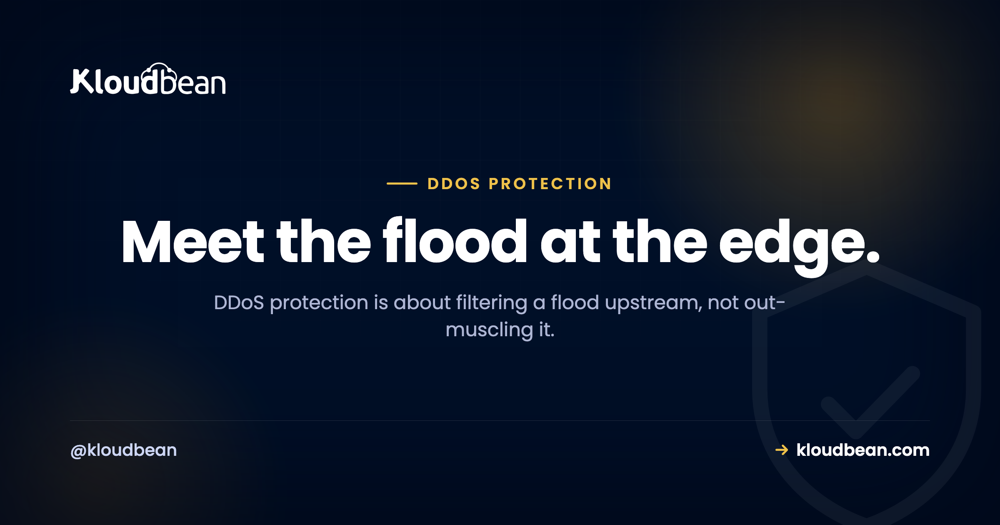
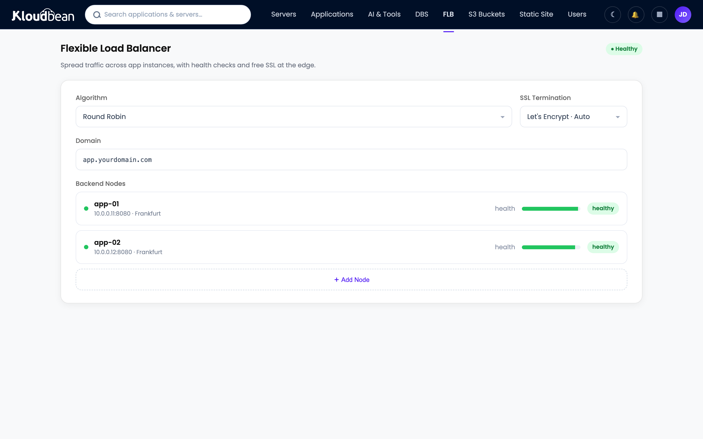

# DDoS Protection Explained: How the Flood Works and How You Stop It

A DDoS attack doesn't break in. It piles up. Thousands of machines send your site traffic all at once until real visitors can't get a connection, and your app looks dead even though nothing was hacked. DDoS protection is the set of layers that soak up that flood before it ever reaches you.

Most of the advice out there is either doom ("nothing can stop it") or snake oil ("just buy our box"). The truth sits in the middle, and it's genuinely actionable once you understand where the flood gets filtered. So let's take it apart.

> **Short answer:** A DDoS attack floods your server from many sources at once to exhaust it, so real users can't get through. You don't stop it by buying a bigger server; you filter it upstream, at an edge network that absorbs volumetric floods and screens layer-7 requests, with a firewall and Fail2ban mopping up smaller abuse. Put that edge in front before you're attacked, not during.

## What a DDoS attack actually is

DDoS stands for distributed denial of service. Break that down. "Denial of service" means making something unavailable. "Distributed" means the attack comes from many machines at once, usually a botnet of hijacked devices scattered across the world. Point all of them at one target, and the combined traffic swamps it.

The goal isn't to steal anything. It's to exhaust a resource: your bandwidth, your CPU, your database connections, your app's ability to answer requests. Once that resource is spent on junk, there's nothing left for real visitors. Your site isn't broken. It's just too busy drowning to say hello.

One distinction worth keeping straight. A plain **DoS** comes from a single source, so you can usually just block that one address. A **DDoS** comes from thousands, which is exactly what makes it hard. You can't block your way out of a flood coming from ten thousand different IPs by hand. That's the whole problem in one sentence.

## The two shapes a DDoS takes

Attacks split into two broad families, and they're stopped in completely different ways. Knowing which one you're looking at is half the battle.

| | Volumetric (Layer 3-4) | Application-layer (Layer 7) |
| --- | --- | --- |
| What it targets | Your network pipe, raw bandwidth | Your app: CPU, database, request handling |
| What it looks like | Obvious junk, enormous volume | Real-looking HTTP requests |
| Typical example | UDP or SYN flood, DNS amplification | Thousands of GET /search or login POSTs |
| Why it hurts | Sheer size clogs the connection | Blends in; even modest volume can exhaust the app |
| How it's stopped | Absorbed and scrubbed at the edge by huge capacity | Rate limits and a WAF spotting the pattern |

Volumetric attacks are the loud ones you see in headlines, measured in gigabits or terabits per second. Application-layer attacks are quieter and, honestly, trickier. They mimic real users, so a firewall waving traffic through can't tell the difference. A flood of legit-looking requests to an expensive endpoint (a search, a login, a report) can take down an app on far less traffic than a volumetric attack needs. Sneaky is worse than loud here.

<!-- ADD IMAGE: a traffic graph, a normal baseline then a sharp wall of requests when the attack starts -->

## How the defense actually works: filter at the edge

Here's the mental model that fixes most confusion. You don't fight a flood at your front door. You fight it far upstream, at an edge network with capacity vastly larger than any single server, and only clean traffic is allowed to continue to your origin.

```
bots + a few real users        EDGE NETWORK (CDN + WAF)        origin server
  o o o (mostly junk)   ─────▶  absorbs volumetric floods
  o o o                         WAF filters layer-7      ──clean──▶  your app
  o o o                         rate-limits abusive IPs               (real requests)
                                junk dropped here  (x)
Behind it, on the server: a Shorewall firewall + Fail2ban catch the smaller abuse.
The origin never tries to eat the flood. That's the edge's job.
```

*The flood meets an edge network far bigger than your server. Junk is dropped upstream; only clean traffic reaches the origin.*

## The layers that actually stop a flood

Real DDoS protection is a stack, not a switch. Each layer catches something the others miss, so you want them working together.

- **An edge / CDN network.** This is the load-bearing layer for big attacks. It sits in front of your site with capacity far larger than any single origin, so it absorbs and scrubs volumetric floods before they reach you. It's the only thing that meaningfully answers a terabit-scale attack, because your server never could. It also hides your origin IP so attackers can't route around it. On Kloudbean this layer is the Cloudflare Enterprise add-on, paid on standard plans and included for Enterprise accounts, which is worth knowing now rather than during an incident: it's a thing you switch on, so switch it on early.
- **Rate limiting.** A cap on how many requests one source can make in a window. Cheap and effective against crude layer-7 abuse, where a single IP or a small set hammers your login or search. It won't stop a wide botnet on its own, but it takes the easy attacks off the table.
- **A WAF.** A web application firewall inspects HTTP requests and blocks the ones that match attack or abuse patterns. This is your main tool against the sneaky layer-7 floods that look like real traffic. If you want the full picture of what a WAF does and doesn't do, [this guide breaks it down](https://www.kloudbean.com/blog/what-a-waf-does/).
- **A firewall and Fail2ban on the server.** The last, closest layer. A firewall closes ports you don't use, and Fail2ban watches your logs and bans addresses that keep misbehaving, like a script trying passwords over and over. This won't stop a big flood, and it isn't meant to. It's excellent against smaller, persistent abuse. Kloudbean ships Shorewall and Fail2ban on every server automatically, which is the one layer here you don't have to remember, and the layer people most often forget when they build a box themselves. More on hardening the origin in [secure hosting](https://www.kloudbean.com/blog/secure-wordpress-hosting/) and the [security headers guide](https://www.kloudbean.com/blog/security-headers-guide/).

A quick clarification, because people mix these up. A [load balancer](https://www.kloudbean.com/blog/cloud-load-balancer-explained/) spreads traffic across app instances for performance and availability. It is not DDoS mitigation on its own, though it's part of how traffic reaches your origin. Don't count on it to filter a flood.



<!-- ADD IMAGE: an edge or WAF dashboard showing blocked requests climbing while origin traffic stays flat -->

## The mistake worth avoiding

Three mistakes come up again and again. They're worth naming, because each one feels reasonable and each one fails at the worst possible moment.

**"A bigger server will absorb it."** This is the expensive one. You cannot out-muscle a flood from attackers who add machines for free. A large volumetric attack is an edge and upstream-capacity problem, and no single origin server has that capacity, period. Upgrading the box costs more and still falls over. My blunt take: your origin should never try to eat a flood. That's not its job. Being fair about what the layer below does help with: running on tier-1 cloud capacity (Kloudbean provisions on seven of them, so you're on AWS, GCP, DigitalOcean and the like whichever you pick) means the network under your server isn't the weak link. It still isn't the thing that stops a flood. It just isn't the thing that snaps first.

**"We're too small to be a target."** Automated attacks don't check your follower count. Small sites get hit for extortion, by competitors, by people renting a cheap botnet for an afternoon, or as collateral when they share infrastructure with a real target. "Beneath notice" is the complacency that leaves you with zero protection when your turn comes.

**"We'll deal with it if it happens."** The worst time to add an edge is during the attack. Pointing your DNS at a new edge takes time to propagate while you're already down, and you're making config decisions in a panic. Put the edge up before you need it. That single choice, made on a calm afternoon, is the biggest lever you have.


## If you're being attacked right now

Landed here mid-attack? A few calm moves, in order.

- **Contact your host and enable the edge.** If you have an edge or CDN in front, turn on its stricter "under attack" mode. If your host runs the mitigation, this is the moment their edge earns its keep, so open a ticket fast.
- **Make sure traffic actually flows through the edge.** If your origin IP is exposed and attackers found it, they can bypass the edge entirely. Confirm the edge is fronting the site and the origin isn't reachable directly.
- **Tighten rate limits temporarily.** Clamp down on requests per IP to choke abusive sources, and loosen it again once things calm.
- **Don't panic-upgrade the server.** It won't win the flooding contest, and you'll just pay more for a box that still falls over. The help is upstream, not behind you.

<!-- ADD IMAGE: toggling an "under attack" mode or a stricter rate-limit rule during an incident -->

## The cheapest version of this that actually holds

You don't need an enterprise security programme to stop being an easy target. There's a minimum setup, and it's short. Three things, in this order, and it's the order that matters.

1. **An edge in front, switched on before you need it.** This is the load-bearing piece and the only one that answers a volumetric flood. Turn it on during a calm week, confirm traffic actually flows through it, and forget about it.
2. **Your origin IP not published anywhere.** An edge you can route around is decoration. If your origin answers directly on its own address, someone will find it in DNS history and go straight there. This costs nothing to get right and is the most commonly skipped step on the list.
3. **A firewall and Fail2ban running on the box.** Not for floods. For the constant low-grade background noise, the SSH probes, the password spraying, the endpoint someone is grinding at. Set it once.

That's it. Everything past that is refinement: rate limits tuned to your endpoints, a WAF rule for whatever pattern shows up in your logs, an "under attack" mode you know where to find. Worth having, not worth blocking on.

If it helps to know where that lands on Kloudbean specifically: step three is already done, since Shorewall and Fail2ban run on every server from launch. Step one is the Cloudflare add-on, paid on standard plans and included with Enterprise. Step two is on you either way, because no host can stop you pointing a spare DNS record straight at your own origin.

And the honest limit, which you should be suspicious of any provider not stating. Nobody stops every DDoS attack. A large enough volumetric flood is an edge and upstream-capacity problem, and no origin server, ours included, absorbs one no matter how big you size it. What a host can do is give you a real edge to hide behind and a hardened box underneath. What no host can do is make that decision for you on a quiet afternoon, which is the day the decision is cheap. Whether you'd rather run that stack yourself is the wider [managed vs unmanaged](https://www.kloudbean.com/blog/managed-vs-unmanaged-hosting/) question, and it gets loud on the day you're under fire.

---

**Put the edge up before the flood.** Front your app with Cloudflare's edge, run on tier-1 cloud capacity, and let the built-in firewall and Fail2ban handle the small stuff, all from one dashboard. Start at [kloudbean.com](https://www.kloudbean.com/); see plans on [pricing](https://www.kloudbean.com/pricing/).

Cloudflare edge add-on · Tier-1 cloud capacity · Shorewall firewall + Fail2ban · Free SSL · Free trial

## FAQ

**What is a DDoS attack?**
A DDoS (distributed denial of service) attack floods a target with traffic from many machines at once, usually a botnet, to exhaust its resources so real users can't get through. The aim isn't to steal data; it's to make you unavailable. Your site isn't broken, it's just too swamped to answer.

**What's the difference between DoS and DDoS?**
A DoS attack comes from a single source, so you can often just block that one address. A DDoS comes from thousands of sources at once, which is what makes it hard, since you can't block ten thousand IPs by hand. The "distributed" part is the entire problem.

**What are the main types of DDoS attacks?**
Two broad families. Volumetric (layer 3-4) attacks clog your network pipe with sheer volume, like UDP or SYN floods. Application-layer (layer 7) attacks send real-looking HTTP requests to expensive endpoints and can take you down on far less traffic. Volumetric is loud; layer 7 is sneaky and often harder to stop.

**Can you actually stop a DDoS attack?**
You can't guarantee one never happens, but modern mitigation absorbs and filters the vast majority before they cause harm. Large edge networks soak up enormous floods and drop attack traffic while letting real visitors through. Nobody honest promises absolute immunity, but the typical attack is handled so well the target barely notices.

**Will a bigger server protect me from DDoS?**
No, and it's a costly mistake. You can't out-muscle attackers who add machines for free. Real protection happens at the edge, upstream, where capacity dwarfs any single server. Your origin's size is almost irrelevant to a volumetric flood; the layer in front of it is what matters.

**Does a DDoS attack mean I've been hacked?**
Usually not. A DDoS is a flood of traffic meant to make you unavailable, not unauthorized access to your systems or data. It's a crowd blocking your door, not a burglar inside. Your data is typically untouched and the damage is downtime. Occasionally attackers use a flood as a distraction, so keep your other defenses up.

**Do small websites get DDoSed?**
Yes, regularly. Small sites are hit for extortion, by competitors, by people renting cheap botnets, or as collateral when they share infrastructure with a real target. Automated attacks don't check your size first, so "too small to target" is exactly the assumption that leaves you unprotected.

**Is a firewall enough to stop a DDoS?**
Not on its own. A server firewall and a tool like Fail2ban are great against smaller, persistent abuse and brute-force attempts, but they sit on the origin and can't absorb a large flood. Stopping volumetric attacks needs an edge network upstream with far more capacity than any single server has.

**How do I protect my site from DDoS on Kloudbean?**
Front your app with the Cloudflare Enterprise add-on, which absorbs volumetric floods and runs a WAF for layer-7 patterns, on top of tier-1 cloud capacity. Every server also ships with a Shorewall firewall and Fail2ban for smaller abuse automatically. Set the edge up before an attack, not during one.

---

*Kloudbean · Meet the flood at the edge.*
