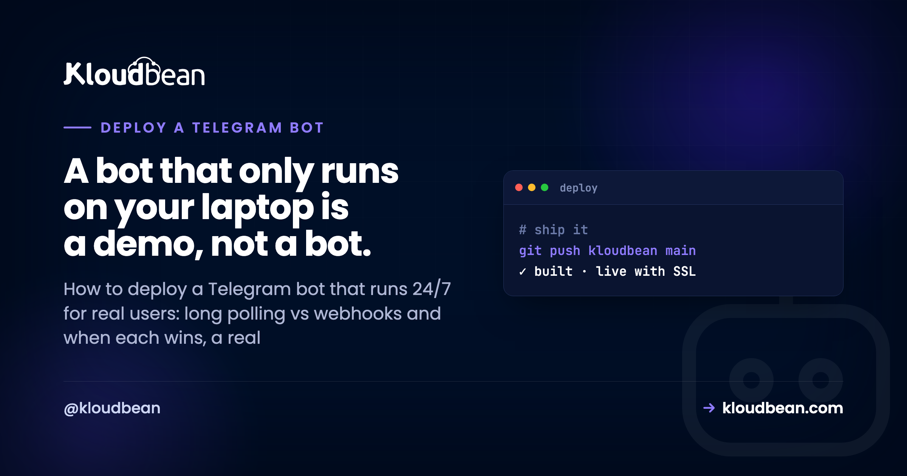
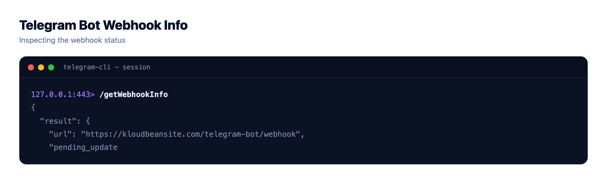
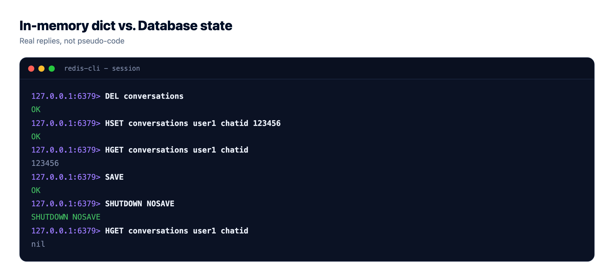
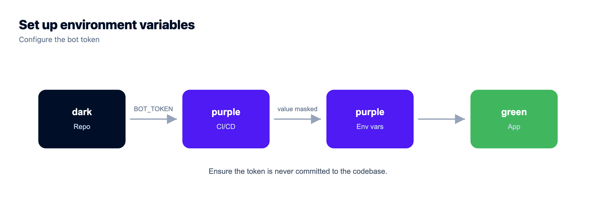

# Deploy a Telegram Bot: Polling, Webhooks and Staying Online 24/7

By Kloudbean Engineering · A bot that only runs on your laptop is a demo, not a bot.

Your bot works. You typed `/start`, it answered, and for about ten minutes that felt like magic. Then you closed the terminal and it died. To deploy a Telegram bot for actual users you have to answer one architectural question first, long polling or webhooks, and then solve four unglamorous problems: an always-on process, a token that isn't in your repo, state that survives a restart, and something that restarts the bot when it crashes at 3am. This is the field guide for python-telegram-bot, aiogram, Telegraf and grammY, in that order of "things that will bite you."

> **The short answer.** To deploy a Telegram bot, run it as a persistent process rather than a serverless function. Use long polling first, since it needs no public URL and no certificate. Switch to webhooks when you need instant delivery at higher volume, which requires a public HTTPS endpoint with a valid cert. Keep the token in an environment variable and state in a real database.

## What it actually takes to deploy a Telegram bot

Strip out the framework talk and Telegram bot hosting comes down to five requirements. Everything else in this article is detail on one of them.

- **A process that stays running.** Your bot is a loop, or an HTTP server, that must be alive when a user types. Not warmed up on demand. Alive.
- **A delivery mechanism.** Either your bot asks Telegram for updates (polling) or Telegram pushes them to you (webhooks). Pick one on purpose.
- **A public HTTPS endpoint with a valid certificate, if and only if you chose webhooks.** Telegram will not post updates to plain HTTP, and it will not accept a broken chain.
- **Durable state.** Anything you want to remember between restarts belongs in a database, not a variable.
- **Supervision.** Processes die. Networks blip. Something needs to bring the bot back without you noticing.

Notice how short that list is. You don't need Kubernetes, a load balancer, or a queue to run a bot with a few thousand users. Most bots are one small process and one small database.

## Long polling vs webhooks: the one decision that shapes everything

This is the fork in the road, and it's genuinely Telegram-specific. The Bot API gives you two ways to receive updates and they imply completely different hosting.

With **long polling**, your bot calls `getUpdates` in a loop. Telegram holds the request open until there's something to send or the timeout expires. Your bot is a client, making outbound calls only. It can sit behind NAT, on a machine with no domain, with no inbound port open at all. That's why it just works on your laptop.

With **webhooks**, you register a URL and Telegram sends each update to it as an HTTPS POST. Now your bot is a server. It needs a public hostname, a certificate Telegram trusts, and a route that answers fast. In exchange you get push delivery with no polling overhead, and a shape that scales cleanly because you're just handling HTTP requests.

| | Long polling | Webhooks |
|---|---|---|
| Who initiates | Your bot calls Telegram | Telegram calls your bot |
| Public URL needed | No | Yes, HTTPS with a valid cert |
| Works behind NAT or a firewall | Yes | No, inbound must reach you |
| Setup cost | Almost none | Domain, cert, route, secret token |
| Scaling shape | One consumer per bot token | Ordinary HTTP, easy to add capacity |
| Multiple instances | Conflict, only one may poll | Fine behind a balancer |
| Wins when | You are shipping, iterating, or under moderate load | High message volume, latency matters, or you already run a web app |

**An opinion, since you're going to ask:** use long polling until something forces you off it. Most bots never need webhooks. Polling is fewer moving parts, the same code runs locally and in production, and the failure mode is obvious: the process is down. Webhooks add a domain, a certificate, a public route, and a class of silent failures where Telegram delivers to a URL that quietly 500s and a user tells you about it. Earn your way onto webhooks with a real reason: volume where polling round-trips add up, a latency requirement, or an existing web app where adding a route beats running a second process.



## Switching to webhooks without breaking your bot

When you do move, it's two API calls and one rule. Register the URL, then stop polling. You cannot do both: if a webhook is set and you call `getUpdates`, Telegram replies `409 Conflict` and tells you the webhook is active. That error message is the most common "my bot went silent" cause after a half-finished migration.

```bash
# register the endpoint. path segment is random, not guessable.
curl -X POST "https://api.telegram.org/bot$BOT_TOKEN/setWebhook" \
  -d "url=https://bot.example.com/tg/$WEBHOOK_PATH" \
  -d "secret_token=$WEBHOOK_SECRET" \
  -d "allowed_updates=[\"message\",\"callback_query\"]"

# check what Telegram thinks is happening
curl "https://api.telegram.org/bot$BOT_TOKEN/getWebhookInfo"

# going back to polling? drop the webhook first.
curl -X POST "https://api.telegram.org/bot$BOT_TOKEN/deleteWebhook"
```

Two details worth internalising. `secret_token` makes Telegram send an `X-Telegram-Bot-Api-Secret-Token` header with every update, and your handler should reject any request that doesn't match. Without it, anyone who guesses your URL can feed your bot fake updates. And `getWebhookInfo` is your first debugging stop, because it reports `last_error_message` and `pending_update_count`, which together tell you whether Telegram is failing to reach you or your handler is failing to answer.

Your handler must answer quickly. Telegram retries slow deliveries, so a webhook that does a 30 second API call inline earns duplicate updates and a growing backlog. Acknowledge with a 200, then do the slow work. A tiny job queue in Redis is the usual fix, and [managed Redis](https://www.kloudbean.com/blog/managed-redis-hosting/) saves you running one yourself.



## Why a bot wants an always-on process

Here is the part that trips up people coming from web deploys. A web app can scale to zero because nothing happens between requests. A polling bot is the opposite: the loop *is* the app. Kill it and you're not slow, you're absent. Telegram queues updates for a while, so a short restart is survivable, but a process that gets suspended after fifteen minutes of quiet is not a bot, it's a bot-shaped outage.

Cold starts hurt in a subtler way. Bots are conversational, so a boot delay before your framework even parses the update reads as a broken bot, especially in multi-step flows where every answer waits again.

To be fair, plenty of bots are fine without a dedicated server. A webhook-only bot that just replies to single commands, holds no in-memory state, and calls no slow APIs is a genuinely good fit for a serverless function or a free tier. If your bot is a stateless "reply to /price with a number" thing, deploy it that way and enjoy the simplicity. Honest advice, even though it isn't the answer this article is set up to give.

What pushes you onto a persistent server is any of these being true:

- You poll, so you need a long-lived outbound connection that nothing suspends.
- You hold in-memory context, a cache, a rate limiter, or an open connection pool between updates.
- You run background work: scheduled digests, reminders, a job worker, a queue consumer.
- You need replies that feel instant, with no boot penalty on the first message after a quiet spell.

## Get the bot token out of your code, today

The single most common bot mistake is a token hard-coded in `bot.py` and pushed to GitHub. A Telegram bot token is a complete credential. Anyone holding it can read your bot's messages and send as your bot. Scanners find them fast, and public repos get scraped constantly.

Read it from the environment, always, and let the app crash loudly if it's missing. A bot that starts with an empty token and fails mysteriously later is worse than one that refuses to boot.

```
# python-telegram-bot / aiogram
import os
TOKEN = os.environ["BOT_TOKEN"]   # KeyError at boot beats a silent 401

# Telegraf / grammY
const token = process.env.BOT_TOKEN;
if (!token) throw new Error('BOT_TOKEN is not set');
```

Keep `.env` in `.gitignore`, and set the real value in your host's environment or runtime config rather than a file you might commit by accident. If a token has ever touched a repo, revoke it in BotFather with `/revoke` and take the new one. Rotating is thirty seconds of work. The patterns are covered properly in [environment variables done right](https://www.kloudbean.com/blog/environment-variables-done-right/) and [secrets management](https://www.kloudbean.com/blog/secrets-management/).

## A Python dict is not a database

The anti-pattern I see most in bot code, after the committed token, is this:

```python
user_state = {}   # chat_id -> step in the conversation

async def on_message(update, context):
    step = user_state.get(update.effective_chat.id, 0)
    user_state[update.effective_chat.id] = step + 1
```

It works in testing and loses every conversation on every restart. Worse, it fails quietly. Nobody gets an error. Users just land back at step one, or the bot answers as if it's never met them, and you get a vague report that it's "sometimes weird."

Put anything you'd be annoyed to lose in a real datastore. Postgres or MySQL for users, subscriptions, and history. Redis for in-flight conversation steps and rate limits, where TTL expiry is exactly the behaviour you want. Both survive a restart, and the managed versions come with automatic backups so a bad migration isn't fatal. Wiring it up is the same job as any other app, walked through in [adding a managed database to your app](https://www.kloudbean.com/blog/add-managed-database-to-your-app/).

One design note: make your handlers idempotent. Telegram retries webhook deliveries, and a duplicate that charges twice or sends two confirmations is a support ticket. Store the `update_id` you last processed and skip repeats.



## Keep the process alive after it crashes

Your bot will crash. A malformed update, an upstream timeout, a network partition mid-poll. What matters is whether it returns in two seconds or stays down until you check your phone.

For Node bots, PM2 is the pragmatic choice. It restarts on exit, survives a reboot once you've saved the process list, and gives you logs in one place.

```bash
# Node: Telegraf, grammY
pm2 start bot.js --name tg-bot --time --max-memory-restart 300M

# Python works too, via the interpreter flag
pm2 start bot.py --name tg-bot --interpreter python3 --time

pm2 save          # survive a server reboot
pm2 logs tg-bot   # what did it say before it died
pm2 restart tg-bot --update-env   # after changing env vars
```

That `--update-env` flag matters more than it looks. A plain `pm2 restart` reuses the old environment, so a token or database URL you just changed won't be picked up, and you'll debug the wrong thing for twenty minutes. Details on the rest of PM2 are in [the PM2 process manager guide](https://www.kloudbean.com/blog/pm2-process-manager-guide/). If you prefer systemd for a Python bot, use `Restart=always` with a `RestartSec` of a few seconds; the mechanism differs, the requirement doesn't.

Add one restart guard: cap automatic restarts so a bot that crashes on boot doesn't spin in a tight loop hammering the Telegram API. And log the update that killed it, otherwise you're guessing.

## What this means for where you host it

Read back the requirements and the hosting shape writes itself: a process that never sleeps, a valid HTTPS endpoint if you chose webhooks, a database that outlives a restart, and a supervisor. That's a small managed server, not a function platform, and it's the setup [deploying a Node app to a managed cloud](https://www.kloudbean.com/blog/deploy-node-app-to-managed-cloud/) describes. On Kloudbean it lines up directly: a persistent Node or Python process under PM2 with no spin-down, free SSL so your webhook URL presents a certificate Telegram accepts, managed PostgreSQL, MySQL or Redis with automatic backups beside it, the token set as runtime config in the UI instead of a file, Git deploys from GitHub, and flat pricing from $8/mo. Same reasoning applies if you're running [a Discord bot](https://www.kloudbean.com/blog/discord-bot-hosting/), which needs a persistent gateway connection for the same underlying reason.

<!-- ADD IMAGE: the environment variables screen with BOT_TOKEN set, value masked -->

## When your bot goes quiet: a short triage list

Bots fail in repeatable ways. Work down this list before rewriting code.

- **Is the process running?** `pm2 list` or `systemctl status`. Half of all bot outages end here.
- **409 Conflict on getUpdates.** Either a webhook is still set, or a second copy of the bot is polling the same token. Local dev instances are the usual culprit. Use a separate test bot for development.
- **Webhook set but nothing arriving.** Check `getWebhookInfo` for `last_error_message`. Certificate problems and 502s from a stopped app both show up there.
- **401 Unauthorized.** The token is wrong, empty, or revoked. Check the environment your process actually loaded, not the file you edited.
- **Replies stopped mid-conversation.** Classic in-memory state loss after a restart. Check your uptime against when it broke.
- **429 Too Many Requests.** You're over Telegram's rate limits. Respect the `retry_after` value and queue your sends instead of looping.

<!-- cta:start -->
**Take it off localhost for good.**

Move the whole thing onto a managed server you own: always-on processes, a managed database for real data, object storage for uploads, and Git deploys with live build logs.

- Managed databases
- Always-on processes
- Object storage
- Automatic backups
- Free SSL
- Git deploy
- Free migration

[Start free](https://console.kloudbean.com/register) · [See plans](https://www.kloudbean.com/pricing/)
<!-- cta:end -->

## FAQ

### How do I deploy a Telegram bot so it runs 24/7?

Put the bot on a server that stays on, run it as a supervised process with PM2 or systemd so it restarts after a crash, read the token from an environment variable, and store state in a database rather than memory. Start with long polling, which needs no public URL. Add a webhook later only if volume or latency requires it.

### Should I use webhooks or long polling for my Telegram bot?

Use long polling unless you have a concrete reason not to. It needs no domain, no certificate, and no inbound port, and the same code runs locally and in production. Webhooks are better at high message volume and when latency matters, but they require a public HTTPS endpoint with a valid certificate and a handler that responds fast.

### Can I host a Telegram bot on a serverless function?

Yes, for a webhook bot that is stateless and replies quickly. It is a reasonable fit for simple command bots. It does not work for long polling, which needs a persistent outbound connection, and it suits bots poorly when they hold in-memory context, run scheduled jobs, or must answer without a cold start delay.

### Why does my Telegram bot stop working when I close my laptop?

Because the bot is the process you were running. Closing the terminal or sleeping the machine ends it, and with long polling nothing is asking Telegram for updates any more. Telegram holds updates briefly then moves on. The fix is to run the same code on an always-on server under a process manager.

### Do I need a domain and SSL certificate for a Telegram bot?

Only for webhooks. Telegram will not deliver updates over plain HTTP and rejects certificates it cannot validate, so a webhook endpoint needs a real hostname and a trusted certificate. With long polling you need neither, since your bot only makes outbound calls to the Telegram API.

### Where should I store my Telegram bot token?

In an environment variable or your host's runtime configuration, never in source code. Keep .env files out of version control. If a token has ever been committed or shared, revoke it in BotFather and use the new one. Treat it as a full credential, because anyone with it can act as your bot.

### How do I keep conversation state between messages?

Store it outside the process. Redis suits in-flight conversation steps and rate limits because keys can expire on their own. Postgres or MySQL suits users, settings and history. A dictionary in memory looks fine in testing and silently loses every conversation on restart, which is the hardest bot bug to diagnose.

### What does 409 Conflict mean on the Telegram Bot API?

It means two things are trying to receive updates for the same token. Either a webhook is registered while your code calls getUpdates, or a second copy of the bot is polling, often a forgotten local instance. Delete the webhook before polling, and use a separate test bot for development.

### How much server do I need for a Telegram bot?

Less than most people expect. A small instance handles a bot with a modest user base comfortably, since most bots are IO bound on API calls rather than CPU bound. Size up when you add heavy work like media processing or model calls. Adding a managed database matters more than adding CPU.

Kloudbean Engineering · Poll until you have a reason not to. Then make the process, the token, and the state boring.
