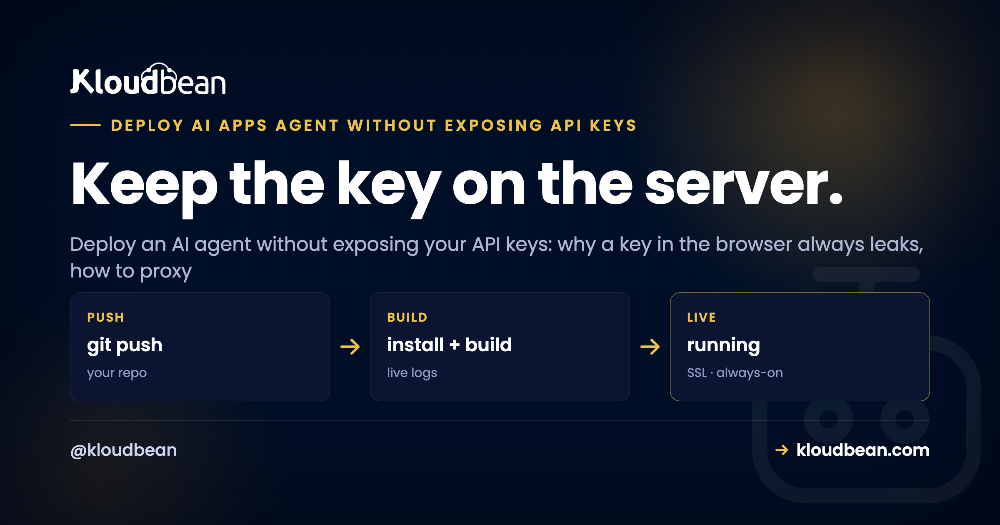
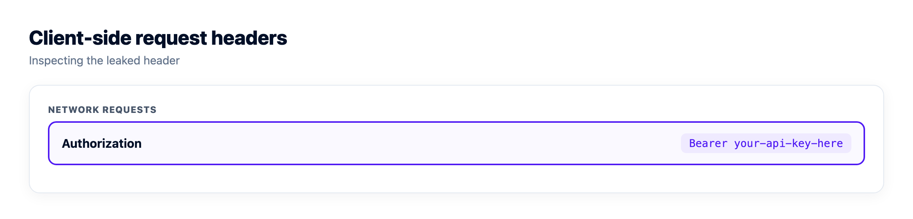

# How to Deploy an AI Agent Without Exposing Your API Keys

You built an AI agent over a weekend, wired it to OpenAI or Anthropic, shipped it, and it worked. Then the bill arrived, or the provider emailed to say your key was disabled. Someone found it. This is the most common way a new AI app gets burned, and it's almost always the same two mistakes: the key went to the browser, or it got committed to Git. Both are avoidable. This page is how to deploy an AI agent without exposing your API keys, and how to make sure a leak that does happen can't be turned into a bill.

None of this is exotic. It's the plumbing your AI builder skipped, the same last mile that trips up every [vibe-coded app heading to production](https://www.kloudbean.com/blog/last-mile-of-vibe-coding/). Get the key placement right and you close the door most attackers walk through.

> **Short answer:** Never let your provider API key reach the browser or your Git repo. Put the model call behind your own backend: the browser talks to your server, your server holds the key in an environment variable and calls the provider. Then assume a key can still leak, so add per-user auth, quotas, rate limits, and a spend cap, rotate any exposed key immediately, and log who called what.

## The one rule that stops most key leaks

Here it is, and it's the whole article in a sentence: the API key lives on the server, and nowhere a user can reach it. If your frontend code can read the key, so can anyone who opens your app. That's not a small risk you can manage with obfuscation. It's a certainty.

So the model provider is never called from the browser. The browser calls *your* backend, and your backend, running on a server you control, adds the key and calls the provider. The key sits in an environment variable on that server, not in the code, not in the repo, not in the shipped JavaScript. Everything else below is about doing that cleanly and surviving the day a key gets out anyway.

## Why a key in the browser is always leaked

People hear "don't put the key in the frontend" and assume it means "hide it well." It doesn't. There is no hiding it. Anything the browser can send, a user can read, because the browser runs on their machine, not yours.

Open any site's developer tools, click the Network tab, and you see every request the page makes, headers and all. If your agent calls the provider directly, that request carries `Authorization: Bearer sk-...` in plain sight. No exploit needed. Right-click, copy, done. And even if the key never appears in a live request, build tools bake it into the JavaScript bundle they ship, so it's sitting in a file anyone can download and search. Minifying or base64-encoding it changes nothing; the running code has to decode it, so the browser has to hold the real value.

This is the one opinion I'll plant a flag on: a key in the browser is not a smaller risk than a key in Git. It's the same risk. Treat any client-side key as already public, because within hours of going live, it usually is.

## A real leaked-key path, and how to close it

Here's the exact shape I see most, in a Next.js or Vite app. A developer stores the key as `NEXT_PUBLIC_OPENAI_API_KEY` (or `VITE_OPENAI_API_KEY`) and calls the provider straight from a React component. It works in development, so it ships.

The trap is the prefix. Next.js deliberately exposes any variable starting with `NEXT_PUBLIC_` to the browser, and Vite does the same with `VITE_`. That's by design, for values that are safe to be public. An API key is not one of those. The build inlines the real key into the client bundle, and now it's public property.

```js
// LEAKS: this runs in the browser, key and all
const res = await fetch("https://api.openai.com/v1/chat/completions", {
  method: "POST",
  headers: {
    "Authorization": `Bearer ${process.env.NEXT_PUBLIC_OPENAI_API_KEY}`,
    "Content-Type": "application/json",
  },
  body: JSON.stringify({ model: "gpt-4o-mini", messages }),
});
```

To close it: drop the `NEXT_PUBLIC_` / `VITE_` prefix so the key stops shipping to the client, move the provider call to a server route, and have the browser call that route instead. The frontend now sends a plain request to `/api/chat` and never sees a key at all. That's the fix, and it's the next section.



## The fix: put the model behind your own backend

The pattern is a thin proxy. Your backend exposes one endpoint, holds the key, forwards the request to the provider, and returns the answer. The browser only ever talks to your server. This is why you want a real server-side runtime for your agent, Node or Python running as an always-on process, not a static frontend calling a third party.

That requirement quietly rules some hosts out. A static-site host has nowhere for the key to live, which is exactly how people end up with `NEXT_PUBLIC_` in front of a secret: the platform gave them no server, so they shipped the key to the browser. If your app is currently deployed as a static bundle, this fix starts with moving to something that runs a persistent Node or Python process. Kloudbean runs both as always-on managed apps, and the browser-to-backend hop gets free SSL, which matters here because you're now sending user prompts to your own endpoint instead of straight to a provider over their TLS.

```
BLOCKED · leaks the key
[ Browser: carries the sk-... key ] --X--> [ Model provider ]
   anyone opens DevTools and copies the key

SAFE · keeps the key on the server
[ Browser: no key ] --request--> [ Your backend ] --+ key--> [ Model provider ]
                                  Node / Python, always on
                                  holds the key (env var)
                                  checks auth, quota, and rate limit first
```
*Same call, two very different exposures. Direct from the browser, the key rides along where anyone can grab it. Through your backend, the browser never holds a key, and your server decides who gets to spend your tokens.*

In Node with Express, the whole proxy is a few lines. The key comes from `process.env`, so it never appears in the code you commit:

```js
// server.js runs on your server, never shipped to the browser
import express from "express";
const app = express();
app.use(express.json());

app.post("/api/chat", requireAuth, rateLimit, async (req, res) => {
  const r = await fetch("https://api.openai.com/v1/chat/completions", {
    method: "POST",
    headers: {
      "Authorization": `Bearer ${process.env.OPENAI_API_KEY}`, // server-side only
      "Content-Type": "application/json",
    },
    body: JSON.stringify({ model: "gpt-4o-mini", messages: req.body.messages }),
  });
  res.json(await r.json());
});

app.listen(3000, "0.0.0.0");
```

Python is the same idea with FastAPI. Read the key from the environment, forward the call, return the result:

```python
# main.py
import os, httpx
from fastapi import FastAPI, Depends

app = FastAPI()

@app.post("/api/chat")
async def chat(body: dict, user = Depends(require_auth)):
    async with httpx.AsyncClient() as client:
        r = await client.post(
            "https://api.openai.com/v1/chat/completions",
            headers={"Authorization": f"Bearer {os.environ['OPENAI_API_KEY']}"},
            json={"model": "gpt-4o-mini", "messages": body["messages"]},
        )
    return r.json()
```

Notice both endpoints already have an auth check and a rate limit wrapped around them. That's on purpose, and it's the part people skip. More on that below, because a proxy without those is its own kind of trouble.

## Keep the key in an environment variable, not in your code

Once the call is server-side, the key belongs in an environment variable, loaded at runtime. Not typed into a source file. Not sitting in a config that gets committed. The reason is simple: code goes into Git, and Git remembers. A key pasted into a file and pushed once is in the history even after you delete it, and bots scan public commits for exactly that. Providers now watch for it too, and can auto-revoke a key they spot in a public repo, which is a mercy but not a plan.

So `.env` goes in `.gitignore`, and the real values live wherever you run the app. Locally that's a `.env` file you never commit. In production you set them on the server, outside the codebase entirely. On Kloudbean that's a dashboard screen: you set `OPENAI_API_KEY` there and it's injected into the app's environment at runtime, so the value never enters the repo the Git deploy pulls from. The practical benefit isn't the screen, it's that the key and the code now live in two different places, which is what makes the next section painless. If you want the full treatment, our guides on [secrets management](https://www.kloudbean.com/blog/secrets-management/) and [environment variables done right](https://www.kloudbean.com/blog/environment-variables-done-right/) go deeper than I can here.


## When a key leaks anyway, rotate it fast

Assume it will happen. A key ends up in a screenshot, a log file, a Slack message, an old commit. Rotation is the muscle that turns a scary leak into a shrug. In your provider's dashboard you create a new key, deploy it to your server's environment variables, confirm the app is using it, then revoke the old one. The exposed key becomes worthless.

Two habits make this painless. Give each app or environment its own key, so rotating one doesn't take down the others. And never hard-code a key anywhere, so rotation is only ever an environment change and a redeploy, not a code hunt. If rotating a key means grepping your codebase, the key was in the wrong place to begin with.

Order matters in that sequence, and the step people rush is "confirm the app is using it." Revoke the old key before the new one is actually live and you've taken your own agent down. Watch the deploy finish first. Kloudbean streams live build logs in the console, which is the cheap way to know the restart picked up the new environment variable rather than assuming it did.

## A proxy with no auth is just a slower leak

Here's the mistake that catches people who did everything else right. They move the key to the backend, feel safe, and leave the `/api/chat` endpoint wide open. Now anyone who finds that URL can call your model on your dime. You didn't leak the key. You built a public relay to it, which for your bill is the same outcome.

An unauthenticated model proxy is an open invitation. So the endpoint needs gates, and there are four worth having:

- **Authentication.** The caller has to be a logged-in user of your app. No valid session, no model call. This alone stops the drive-by abuse.
- **Per-user quotas.** Even real users shouldn't be able to burn unlimited tokens. Cap requests per user per day, and one compromised account can't drain your budget.
- **Rate limits.** Limit requests per minute per user and per IP. This blunts both accidental loops and deliberate hammering.
- **A spend cap at the provider.** Set a hard monthly usage limit in your provider's billing settings. It's the backstop for when everything else fails, and the difference between a bad day and a bankrupt weekend.

Think of it as defence in layers. The proxy hides the key, auth decides who's allowed in, quotas and rate limits shape how much any one caller can do, and the spend cap catches whatever slips through.

| | Key exposed in the client | Key behind a locked-down backend |
| --- | --- | --- |
| **Where the key lives** | In the browser or the Git history | In a server-side environment variable |
| **Who can call the model** | Anyone who reads the page or repo | Only authenticated users of your app |
| **Cost of a single leak** | Unlimited spend until you notice | Capped by quotas and a spend limit |
| **Fixing a leak** | Rotate, then hunt down every copy | Rotate one env var and redeploy |
| **Who did what** | No idea, it wasn't your server | In your logs, tied to a user |

## Log who called the model, and why it matters

When something does go wrong, the first question is always "who, and how much?" You can only answer it if your backend wrote it down. Because every request now flows through your server, you're in a position to log the useful things: which user made the call, which endpoint, when, roughly how many tokens, and the outcome. Keep it to metadata, not the raw prompts and replies, unless you have a real reason and have told your users.

That log is what lets you spot one account suddenly making a thousand calls, trace a spend spike to its source, and cut off a single abuser instead of pulling the whole key. It's plain application logging, and it's yours to build into the agent. Kloudbean's account-level Audit Trail (an Enterprise feature) records who changed what in your infrastructure, which is a different and complementary record; the "who called the model" log lives in your app code, where it belongs.

## Where teams get this wrong

If I had to name the pattern that burns people, it's treating "the key isn't in the frontend anymore" as the finish line. It's the start. The full picture is small but you have to do all of it: key on the server, key in an env var and out of Git, auth on the endpoint, quotas and rate limits per user, a provider spend cap, and a log of who called what. Skip any one and you've left a gap that shows up as a bill.

Work through the broader [AI app security checklist](https://www.kloudbean.com/blog/ai-built-app-security-checklist/) before you call it done, especially if your agent takes user input and hands it to a model with real permissions. Key exposure is the most common way to get hurt, not the only one.

## Which of these can anything else take off your hands?

Nine things have to be true before an agent's key is genuinely safe. Sorting them by who owns each one is the most useful thing you can do with the list, because it tells you which items are a pull request and which are a property of where you deployed.

| The control | Who owns it | Why it lands there |
| --- | --- | --- |
| The key never runs in the browser | Your code | You decide where the `fetch` lives. No platform can relocate that call for you. |
| The key never enters Git | Both | You add `.env` to `.gitignore`; your host has to give you somewhere else to put the real value. |
| A persistent process to hold the key | Your host | Either there's an always-on server-side runtime or there isn't. A static host has no answer here. |
| An encrypted browser-to-backend hop | Your host | Your frontend now posts prompts to your own domain, so that endpoint needs SSL. |
| Authentication on the endpoint | Your code | Your session logic, your user model. Nothing external knows who your users are. |
| Per-user quotas and rate limits | Your code | Nobody writes your rate limiter. This is the row people most want to outsource and can't. |
| A hard spend cap | Your model provider | Set in OpenAI's or Anthropic's billing settings, not in any hosting dashboard. |
| Brute-force noise against the server itself | Your host | A firewall and log-watching ban list, running whether you configured them or not. |
| The agent's database not open to the internet | Both | You whitelist the app server's IP; the platform has to offer that control. |

Count the rows. Five of the nine are yours no matter where you deploy, and that's worth being blunt about: no host fixes them, ours included. A missing auth check on `/api/chat` is a missing auth check on any infrastructure on earth. Move your key to a server, feel relieved, forget the quota, and the bill still arrives. That's the failure I'd bet on before any of the others.

The host rows are the ones a deployment choice actually settles, which is why they came up earlier rather than being saved for here. Kloudbean runs Node and Python as always-on apps, holds your keys as environment variables set in the dashboard and injected at runtime, issues free SSL on the endpoint your frontend calls, and starts every server with Shorewall and Fail2ban already running. For the last row, managed databases have IP Access Control, so you whitelist your app server's address and everything else is refused.

Where that stops: managed covers the server, the stack, SSL, backups, and patching. Your agent's code, your auth, your quotas, and your data stay yours. And you don't need a private network for any of this. A VPC is part of the Enterprise package, it isn't the default on a standard plan, and an API key kept server-side behind an authenticated endpoint is safe without one. Anyone selling you network isolation as the answer to a leaked key is solving a different problem. If your agent also needs somewhere durable for chat history or user data, see [adding a managed database to your app](https://www.kloudbean.com/blog/add-managed-database-to-your-app/).

<!-- cta:start -->
**Prototype to production, without the babysitting.**

Move the whole thing onto a managed server you own: always-on processes, a managed database for real data, object storage for uploads, and Git deploys with live build logs.

- Managed databases
- Always-on processes
- Object storage
- Automatic backups
- Free SSL
- Git deploy
- Free migration

[Start free](https://console.kloudbean.com/register) · [See plans](https://www.kloudbean.com/pricing/)
<!-- cta:end -->

## FAQ

**How do I deploy an AI agent without exposing my API keys?**
Keep the provider key on your server and never in the browser or your Git repo. Put the model call behind your own backend endpoint, load the key from a server-side environment variable, and have the frontend call your endpoint instead of the provider. Then add authentication, per-user quotas, rate limits, and a provider spend cap so a leaked path can't be abused.

**Is it ever safe to call OpenAI or Anthropic directly from the browser?**
No. Anything the browser sends, a user can read in the Network tab of developer tools, and build tools bake the key into the shipped JavaScript. There is no way to hide a key that runs on someone else's machine. Always call the provider from a backend you control.

**Why does the NEXT_PUBLIC or VITE prefix leak my key?**
Those prefixes exist to expose a variable to the browser on purpose, for values that are safe to be public. Next.js ships any NEXT_PUBLIC variable and Vite ships any VITE variable into the client bundle. If you prefix an API key that way, the build inlines the real key into code anyone can download. Drop the prefix and read the key only in server-side code.

**Where should I store my AI provider API key in production?**
In an environment variable on the server that runs your backend, set outside your codebase. Keep the local .env file in .gitignore so it never gets committed, and set the real production values on your host. On Kloudbean you set them in the dashboard, so the key stays on the server and out of the repo.

**What do I do if my API key has already leaked?**
Rotate it right away. Create a new key in your provider's dashboard, deploy it to your server's environment variables, confirm the app is using it, then revoke the old one. If each app has its own key and nothing is hard-coded, rotation is just an environment change and a redeploy.

**A backend proxy hides the key, so am I done?**
Not quite. A proxy with no authentication is a public relay to your key, and anyone who finds the URL can spend your budget. Require a logged-in user on the endpoint, cap requests per user, rate-limit per user and IP, and set a spend cap at the provider. The proxy hides the key; those gates stop abuse.

**How do I stop someone from running up my AI bill?**
Put limits in front of the model. Authentication keeps strangers out, per-user quotas keep any one account from burning unlimited tokens, rate limits blunt loops and hammering, and a hard monthly spend cap in your provider's billing settings is the final backstop. Layer them; each one catches what the others miss.

**Should I log the prompts and responses my agent handles?**
Log metadata by default: the user, the endpoint, the time, rough token counts, and the outcome. That is enough to trace a spend spike or cut off one abuser. Storing raw prompts and replies is sensitive, so only do it with a real reason and clear notice to your users.

**Do I need a private network or VPC to keep my API key safe?**
No. Keeping the key on the server, in an environment variable, behind an authenticated endpoint is what protects it, and that works on a standard setup. A private network (VPC) is an Enterprise-level isolation feature for locking internal services off the public internet, not a requirement for API key safety.

**What runtime do I need to proxy the model call?**
Any server-side runtime that runs as a persistent process. Node with Express or Python with FastAPI or Flask both do the job in a few lines. The point is that the code holding the key runs on your server, not as a static frontend that ships to the browser.

---

*Kloudbean · Keep the key on the server.*
