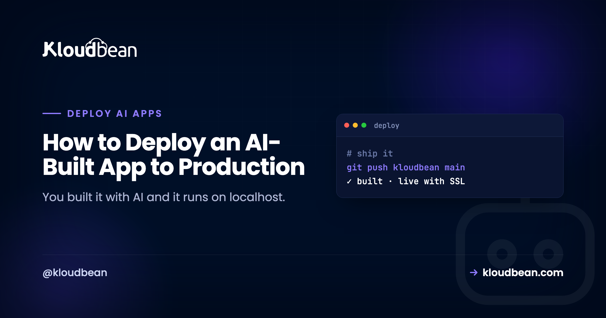
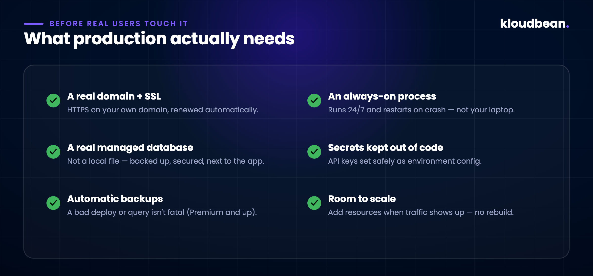
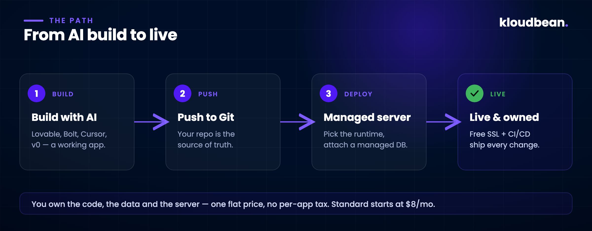

# How to Deploy an AI-Built App to Production (A Real, Step-by-Step Guide)

You described what you wanted, the AI wrote most of it, and now there's a real app on your screen. It logs in, it saves data, it looks the part. Then you hit the wall every builder hits: `npm run dev` works beautifully, and you have no idea how to put it somewhere real people can use.

That gap between "runs on my machine" and "runs for strangers on the internet" is where most AI-built apps quietly stall. Not because the code is bad. Shipping is just a different job than building, and nobody handed you that part. This guide closes it. The first half is the concepts you actually need to understand (skip it if you're impatient). The second half is the real click-path to get your app live on Kloudbean: the exact tabs, fields, and commands, not a hand-wave.

<!-- ADD IMAGE: the readiness-gap gauge. A horizontal progress bar (purple to green) from an AI preview / your laptop cap on the left to a Production ready cap on the right, with six checked checkpoints along it: secrets to env vars, a managed database, a real build, a domain with SSL, an always-on process, and backups. -->
*Diagram: the readiness gap from preview to production, drawn as a gauge with six checkpoints: secrets moved to env vars, a real managed database, a real build, a domain with SSL, an always-on process, and backups.*

## First, what the AI actually gave you

Be clear-eyed about this, because it saves you confusion later. Tools like Lovable, Bolt, Cursor, and v0 are good at producing a working application. Usually a modern stack: React or Next.js on the front, a Node API behind it, talking to a database. What they hand you is *the app*. Real, yours, often surprisingly solid.

What they don't hand you is the place it runs. On your machine, a dozen things are quietly faked: the database is a local file, the "server" is a dev process that dies when you close the terminal, there's no real domain, no HTTPS, and your API keys are sitting in a file you'd never want on the public internet. None of that knocks the tool. It's just the line where building ends and hosting begins.

## What "production" actually means

Production is a boring word for a specific checklist. Localhost skips every item on it; real users need all of them.



- **A real domain with SSL.** Your app on your own domain, over HTTPS, with the certificate renewing itself.
- **An always-on process.** Something that keeps the app running around the clock and restarts it if it crashes at 3 a.m. It's not a terminal window on your laptop. (On Kloudbean, Node apps run under PM2, which does exactly this.)
- **A real, managed database.** A proper Postgres, MySQL, MongoDB, or Redis that's backed up and secured, instead of the local file your dev setup used.
- **Secrets kept out of the code.** API keys and tokens set as environment configuration, per environment, so they're never baked into what you ship.
- **Backups.** Because a bad deploy or one wrong query shouldn't be able to erase everything.
- **Room to grow.** The ability to add resources when people show up, without re-architecting.

## The three ways people try to ship (and where each one hurts)

**Stay on the builder's platform.** The fastest button, and fine for a demo. It gets expensive and constraining the moment the app is real. You're often renting per app, the database and backend are somebody else's product, and you don't fully own the thing you made.

**Grab a raw VPS.** Cheap and yours, which is the appeal. Then you find out production was never the app. It's the *server*. You're now responsible for patches, firewalls, SSL renewals, PM2 config, Nginx, backups that actually run, and the 2 a.m. page when something falls over. That's a second job.

**Use a managed server.** You get the ownership of a VPS. Your code, your data, your box, a flat price. But the tedious, critical parts (the stack, the process manager, SSL, monitoring, backups) are set up and handled for you. That's the path this guide walks, on Kloudbean.

## Deploying it on Kloudbean, step by step

Here's the honest, real version of "deploy it." None of these steps needs a DevOps hire. But they're specific, so I'm going to show you the actual screens. Where a screenshot helps, I've marked exactly what to capture.



### 1. Launch a server

From your dashboard, click **Add Server** (or go to **Servers → Add Server**). That drops you on the provision page, where you make five choices:

- **Cloud Provider:** AWS, DigitalOcean, Linode, Vultr, and others. Pick on price and where your users are.
- **Application:** choose your framework (Node.js single- or multi-process, Next.js, React, Vue, Angular, Laravel, Django, Flask, FastAPI, WordPress, and more). This preloads the right stack.
- **Server Location:** the datacenter nearest your users.
- **Application Name + Server Name:** descriptive labels, e.g. `production-api` and `web-server-01`.
- **Server Size:** Starter through XLarge. For a Node build, give it room: 2–4 GB is the sensible floor.

Hit **Launch Now**, confirm the trial or payment, and the server provisions in roughly five minutes. A fresh Node server gives you a production stack out of the box: Node 20+, npm 10+, nvm, and MariaDB 10.6+ if you want it. So you're not installing runtimes by hand.


### 2. Add your app (and know you can add more later)

If you picked a framework during provisioning, your app is already there. Want another one (a second client project, or a tool like n8n or Supabase on the same box)? Go to **Applications → Add Application** and pick the stack. Running several apps on one server is a first-class feature here, not a hack: each app gets its own space and configuration, and you're maximizing a server you're already paying for.

Open the app and go to **Application Administration → Access**. You'll see two useful things: the default access URL (a live `*.kloudbeansite.com` address you can test on immediately) and the server's public address for pointing your own domain later.

### 3. Connect your repository

Deploys on Kloudbean come from Git, which is exactly what you want. Your repo becomes the source of truth, not a folder on your laptop. Open the **Code Delivery** tab, then **Git Deployment**:

- Pick a **Git Connection Mode:** connect GitHub with OAuth, or copy the SSH public key and add it to GitHub, GitLab, or Bitbucket.
- Paste your **Git Repository URL**, choose the branch, and click **Clone Repository**.


### 4. Set the runtime config, then deploy

Once the repo is cloned, you tell Kloudbean how to build and run it. These fields are the whole game, so get them right:

- **App Directory:** where your `package.json` lives. Root by default; change it if your app is in a subfolder.
- **Port:** the port Kloudbean assigned. Your app must listen on it (usually via `process.env.PORT`).
- **Node Version:** match your project.
- **Install Command:** `npm install` by default (`npm ci` or `--legacy-peer-deps` if you need them).
- **Build Command:** e.g. `npm run build` for a TypeScript or framework build; leave blank if there's no build step.
- **Start Command:** `npm start`, `node server.js`, or your own.

Click **Pull & Deploy**. Behind the scenes it pulls the latest code, pins your Node version, installs packages, runs the build, and deploys to the web root. That's the step that used to be an afternoon of SSH and Nginx wrangling.

<!-- ADD IMAGE: Node runtime configuration panel (App Directory, Port, Node Version, Install/Build/Start commands). -->

### 5. Add a managed database

Move your data off that local file, and do this before you have users, not after. One failure we see over and over: an app ships with a local SQLite file, the first redeploy resets the disk, and a day of real signups is just gone. So from the dashboard open **Managed database** (or **DBS** in the header) and click **Launch Database**. Postgres and MySQL are the usual fits for an AI-built app. Then grab the database credentials (there's a "Viewing Database Credentials" guide in the docs) and wire them into your app through environment variables in the next step, rather than hard-coding them.


### 6. Set your environment variables

This is where most first deploys quietly break, so do it deliberately. In **Runtime Configuration**, click **Environment Variables**. You can add keys one at a time, or use the **Paste .env Content** tab to drop your whole `.env` in and hit **Convert to Key/Value**. Set your database host, name, user, password, your API keys, and your public app URL here. Click **Save Variables**.

A concrete example of what goes in:

```
APP_URL=https://your-app.kloudbeansite.com
DB_HOST=localhost
DB_NAME=kb_yourdbname
DB_USERNAME=kb_youruser
DB_PASSWORD=your-generated-password
OPENAI_API_KEY=sk-...
```


### 7. Point your domain and turn on SSL

In the application's **Domain Aliases** section, add your custom domain (point its DNS to the server's public address you noted in step 2). Then install a free Let's Encrypt certificate so the site is served over HTTPS and renews on its own. Your app now lives at your address, not a temporary one.

### 8. Watch it build, and debug like a pro when it doesn't

Every deploy shows up under **Build & Deployment History**. Click a deployment to open live logs and watch the pull → install → build → deploy steps run. When it finishes, load your Access URL.

The **503** is the error we walk people through most often, and it's almost never a code bug. The process just isn't up, usually a missing env var or a wrong start command. Two ways to see why: open the app logs in the File Manager, or SSH in and read them at `/home/admin/hosted-sites/<app_system_user>/app-logs`. There's `app.info.log` for information and `app.error.log` for errors, and the real reason is almost always sitting right there in `app.error.log`.

<!-- ADD IMAGE: Build & Deployment History live log view (pull, install, build, deploy). -->

There's also a shortcut worth knowing: the **ADM (Application Deployment Manager)** tool. SSH into the server and run `sudo adm` (or `sudo adm <app_system_user>` to target one app), and it runs the whole build-and-deploy in a single command, logs and all. Handy once you're comfortable.

### 9. Make it deploy on every push

The last piece turns this from "a deploy" into "a workflow." Enable **automated deployment** so that every push to your branch triggers a build and ships it. The same CI/CD loop the big platforms sell, on a server you own. From here, shipping a change is just `git push`.

## The part that matters: you own it

This is the difference that shows up six months later. On a managed server, the code is yours, the data is yours, and the server is yours. There's no per-app tax that scales with your success, and no platform that owns your backend and can change the terms. If you ever want to move, you can. It's a standard Linux server running standard code, not a walled garden. That ownership is also why one server can quietly carry your app, its API, its database, and your next project too.

## When it grows

You don't need to plan for scale on day one (that's usually premature), but the path exists. When traffic climbs, you add resources or put a load balancer in front rather than rewriting anything. Kloudbean turns on server-level backups by default; if you want daily automated backups and disaster recovery, those come with the Premium and Enterprise plans. And because multi-process Node runs under PM2, your app already restarts itself and reloads without dropping requests. None of these are cliffs. They're dials you turn when you actually need to.

## Before you deploy an AI-built app

Two things worth saying plainly, because over-promising helps nobody.

Kloudbean runs **Linux** stacks: Node, PHP, Python, Ruby, Java, and frameworks like React, Next.js, Vue, Laravel, Django, and WordPress. If your AI tool generated a classic Windows/.NET app expecting IIS or SQL Server, this isn't the home for that as-is; that's a migration conversation, not a deploy. The vast majority of AI-built apps are exactly the modern stacks above, so you're almost certainly fine. Just check.

And "managed" doesn't mean "nothing to think about." The platform sets up and runs the server, the stack, PM2, SSL, and backups; you still own your application. Its logic, its security, its data. That's the right division of labor, and a good deal, but it isn't magic.

**Ship the thing.** The build was the hard, creative part, and you already did it. Deployment is a checklist: launch a server, add your app, connect Git, set the runtime, add a database and your env vars, point your domain, and turn on SSL. Do it once, and your app stops being a thing on your laptop. It starts being a thing people use, on infrastructure you own.

Start at [kloudbean.com](https://www.kloudbean.com/). There's a free trial, and the first migration is done for you. When you want to weigh sizes and plans, see [pricing](https://www.kloudbean.com/pricing/) (Standard starts at $8/mo).

## FAQ

**Can I deploy my AI-built app myself without a DevOps background?**
Yes. On Kloudbean the server-level work (the stack, PM2, SSL, monitoring, backups) is set up and handled for you. Your job is to launch a server, connect your Git repo in the Code Delivery tab, set the App Directory / Port / start command, add your environment variables, and click Pull & Deploy.

**How does my code actually get onto the server?**
Through Git. You connect GitHub, GitLab, or Bitbucket in the Code Delivery → Git Deployment tab, paste your repo URL, pick a branch, and clone it. After that, "Pull & Deploy" (or automated deployment on every push) builds and ships it.

**My deployed app shows a 503 error, what do I do?**
A 503 means the app process isn't running, usually a missing environment variable or a wrong start command. Check `app.error.log` in `/home/admin/hosted-sites/<app_system_user>/app-logs` (via File Manager or SSH), fix the config, and redeploy with Pull & Deploy.

**Where do my database credentials and API keys go?**
Into environment variables, not your code. Use Runtime Configuration → Environment Variables (there's a Paste .env tab), set your DB host/name/user/password and API keys, and Save Variables. Launch the database itself from the Managed database / DBS section.

**Can my frontend, API, and database all run on one server?**
Yes. Add multiple applications to one server from Applications → Add Application, and launch a managed database alongside them. It's simpler and cheaper than scattering them across services; you split things out later only if one part needs it.

**Will it scale if the app takes off?**
Yes. You add server resources or a load balancer when traffic grows, rather than re-architecting. Multi-process Node runs under PM2, and daily automated backups plus disaster recovery come with the higher plans.

<!-- ADD IMAGE (optional): a real screenshot of your app live on its custom domain with the SSL padlock. -->
