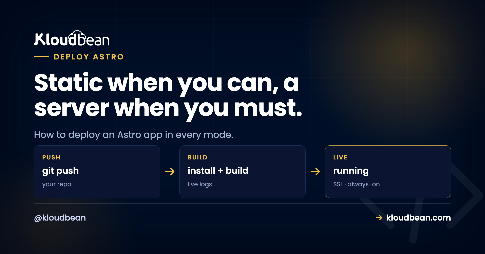

# Astro Static vs Server: Which One Are You Actually Deploying?

Astro has a trick most frameworks skip. The same codebase can build into two completely different things.

One way, you get a folder of static HTML and no server at all. The other way, you get a live server that renders pages on demand. So "how do I deploy an Astro app" has no single answer. It depends on which mode you built, and that one detail changes everything about the deploy: where it runs, what it costs, and how it scales. Get it wrong and your dynamic pages ship blank. Let's make sure you pick right.

> **Short answer:** Your `astro.config.mjs` `output` value decides the deploy. `output: 'static'` (the default) builds a `dist/` folder of files you host on object storage plus a CDN, cheap and serverless. `output: 'server'` (with an adapter like `@astrojs/node`) builds a Node app you run as a live process on a server. Hybrid keeps most pages static and renders a few per route. Ship static as files, server as a Node process, and never deploy server-rendered routes as static or they come back empty.

## The one line that decides your entire deploy

Before you think about hosts, open `astro.config.mjs` and read the `output` line. That value, not your host, decides what you're deploying.

```js
// astro.config.mjs
import { defineConfig } from 'astro/config';

export default defineConfig({
  output: 'static', // the default: prerender every page to HTML at build
});
```

Three values, three very different deploys:

- `output: 'static'` prerenders every page to HTML at build time. The result is plain files. No server runs in production.
- `output: 'server'` builds a server that renders pages per request. You also add an **adapter** (for a normal Node server, that's `@astrojs/node`) so Astro knows what kind of server to build.
- **Hybrid** is mostly static, with specific routes opted in to render on the server. In current Astro you get this by running `output: 'server'` and marking the static pages `export const prerender = true`, or the reverse. (Older Astro had a separate `hybrid` mode. Same idea, one flag moved.)

Check that line first. Everything below follows from it.

```
One config line, three deploy targets

  YOU SET (astro.config.mjs)     BUILD OUTPUT              WHERE IT RUNS
  output: 'static'  (default) -> dist/ (static HTML)    -> Object storage + CDN (no server)
  hybrid (per route)          -> dist/client + /server  -> CDN + a Node process
  output: 'server' + adapter  -> dist/server/entry.mjs  -> Always-on Node server
```

<!-- ADD IMAGE: your astro.config.mjs open in the editor with the output line highlighted -->

## The blank-page trap: shipping server routes as static

This is the number one way an Astro deploy goes wrong, and it's sneaky because it works perfectly in development.

Here's the pattern we see a lot. A site starts as a blog or a marketing page, so it's on `output: 'static'` (the default). Weeks later someone bolts on a contact form that posts to an API route, or a page that reads `Astro.request`, or a dashboard that fetches per-user data. Locally, `npm run dev` runs a full dev server, so the new dynamic bits work great. Then they build, publish the `dist/` files, and the form does nothing. The API route 404s. The "live" page shows whatever data existed at build time, frozen. Sometimes just a blank.

Why? Because a static build has no server behind it to run that code. Astro can only prerender a dynamic route to a single snapshot at build time, or skip it. There's no process in production to handle a real request. The fix is to tell Astro you need a server:

```js
// an API endpoint that must run per request
// src/pages/api/subscribe.js
export const prerender = false;

export async function POST({ request }) {
  const data = await request.formData();
  // this needs a live server to execute
  return new Response(JSON.stringify({ ok: true }));
}
```

The moment a route sets `prerender = false` (or you flip the whole project to `output: 'server'`), you're no longer deploying files. You're deploying a Node app, and it needs an adapter and a running process. Miss that step and the build might not even warn you loudly. It just quietly bakes what it can and moves on. So the rule is simple: if any route needs request-time logic, you're in server or hybrid territory, and the deploy target changes with it.

## Static vs server, head to head

| | `output: 'static'` | `output: 'server'` |
|---|---|---|
| **What the build makes** | A folder of HTML, CSS, and JS files | A Node server app |
| **Runs in production** | Nothing. Files are just served. | An always-on Node process |
| **Hosted on** | Object storage plus a CDN | A server, like any Node app |
| **Adapter needed** | None | Yes (`@astrojs/node`, etc.) |
| **Cost** | Lowest. Storage and bandwidth. | Higher. You run a server. |
| **Scaling** | Basically free. The CDN handles it. | Bigger server, or a load balancer |
| **Per-request content** | No (baked at build) | Yes (rendered live) |
| **Best for** | Blogs, docs, marketing, content | Dashboards, auth, live data, form handlers |

Static is cheaper, simpler, and scales for free, but it can't decide anything at request time. Server does the dynamic work, at the cost of a process you keep alive and pay for around the clock. Neither is "better." They're for different jobs.

## When static is all you need (and it usually is)

I'll say it plainly: most Astro sites are content, and content doesn't need a running server. Blogs, docs, marketing pages, portfolios, changelogs. If your pages look the same for every visitor and only change when you rebuild, static is the right answer. Reaching for server mode because it feels more capable is a common and expensive mistake. You'd be paying for a process to sit idle and re-render pages that never change.

Deploying the static build is refreshingly boring:

```bash
npm run build   # Astro writes your whole site into dist/
# dist/ is now plain HTML, CSS, and JS. Publish it.
```

Publish that `dist/` folder to object storage, put a CDN in front, and you're done. There's no app server to keep alive, nothing to patch, and a traffic spike is the CDN's problem, not yours. On Kloudbean this is the **free static site hosting** path: point it at your repo, set the build, publish `dist/`, then add a custom domain with free SSL. You even get built-in visit analytics without bolting on a third-party script. Connect the Git repo once and every push rebuilds and republishes.


Point the domain, let the platform issue SSL, and the site is live. Here's the deeper walkthrough on [custom domain and SSL setup](https://www.kloudbean.com/blog/custom-domain-and-ssl-for-your-app/), and on wiring up [auto-deploy from GitHub](https://www.kloudbean.com/blog/ci-cd-auto-deploy-from-github/) so you never hand-upload a build again.

<!-- ADD IMAGE: your static Astro site live in the browser with a custom domain and the SSL padlock -->

## When you actually need a server (and how to deploy it)

Server mode earns its keep when content has to be decided at request time: a logged-in view, a page reading live data, a form that processes on the backend, an API endpoint. If that's you, the good news is there's nothing Astro-specific to fear. A server-mode Astro build is a Node app, and you deploy it like any Node app.

First, add the adapter. This is the step people forget:

```bash
npx astro add node
# which installs @astrojs/node and sets your config to something like:
```

```js
// astro.config.mjs
import { defineConfig } from 'astro/config';
import node from '@astrojs/node';

export default defineConfig({
  output: 'server',
  adapter: node({ mode: 'standalone' }),
});
```

Then build and start the generated server. In standalone mode the entry point is `dist/server/entry.mjs`, and it reads `HOST` and `PORT` from the environment, so bind it to the port your platform assigns:

```bash
npm run build                         # writes dist/server + dist/client
HOST=0.0.0.0 PORT=$PORT node ./dist/server/entry.mjs
```

On Kloudbean you add it as an application on a server, set that start command, and the platform supervises the process, restarting it if it crashes. This is exactly the flow in the [deploy a Node app guide](https://www.kloudbean.com/blog/deploy-node-app-to-managed-cloud/), and it applies unchanged to server-mode Astro.


One thing to get right: the port. If you hard-code a port instead of reading `$PORT`, the process can start but never receive traffic, and you get the classic 503. If that bites you, the [503-after-deploy fix](https://www.kloudbean.com/blog/fix-503-after-deploying-your-app/) walks through it. Any secrets or config the server needs (a database URL, an API key) go in environment variables, set in the dashboard, not committed to the repo.


More on doing this safely in [environment variables done right](https://www.kloudbean.com/blog/environment-variables-done-right/). And if your server-mode app needs to persist anything, that's when you reach for a real datastore rather than a file on disk. Here's how to [add a managed database to your app](https://www.kloudbean.com/blog/add-managed-database-to-your-app/).

<!-- ADD IMAGE: your terminal running node ./dist/server/entry.mjs and the log line showing it listening on the assigned port -->

## Hybrid: static by default, dynamic only where you mark it

Hybrid is the pragmatic middle, and often the smartest pick. Most of your pages prerender to static files (fast, cheap), and you opt individual routes into server rendering. In current Astro you run `output: 'server'` and mark the pages that should stay static:

```js
// src/pages/about.astro  (a page that never changes per visitor)
export const prerender = true;

// src/pages/account.astro  (must render live, per user)
export const prerender = false;
```

You still deploy it as a Node app, because some routes need a server. But the bulk of your pages are served as static output, so you keep most of the speed while the dynamic bits stay dynamic. If you're not sure you need full SSR, this lets you keep almost everything static and opt in one route at a time. Start static, mark the one page that needs data, done.

## A word on why Astro stays light either way

Worth knowing, because it shapes what you deploy: Astro ships **zero JavaScript by default**. Pages are plain HTML unless you explicitly mark a component as an interactive "island," and only those islands send JS to the browser. So a typical Astro page is mostly HTML with a few small interactive spots, not a heavy bundle. Your `output: 'static'` build stays lean, which means less to serve and faster loads from the CDN. Server mode stays light for the same reason. There's no giant client runtime riding along either way. Content collections, if you use them, are resolved at build time and work in both modes, so they don't change the deploy target on their own.

> **Coming from Vercel or Netlify?** Those platforms auto-detect an Astro adapter and hide the server behind their own runtime, which is genuinely convenient. The tradeoff is you don't really own the process or its pricing. On Kloudbean the server-mode app is a plain Node process on a server you control, in the same dashboard as your databases, storage, and static sites. If Vue is also in your stack, the same static-vs-server split applies. Here's [deploying a Vue app](https://www.kloudbean.com/blog/deploy-vue-app/), and [a Next.js app on your own server](https://www.kloudbean.com/blog/deploy-nextjs-app-to-your-own-server/) if you're mixing frameworks.

## So which mode should you deploy?

Default to static. It's cheaper, simpler, and scales without effort, and for the content-heavy sites Astro excels at, it's everything you need. Reach for server (or hybrid) only when a page must be decided at request time. And because switching is one config line plus an adapter, you're never locked in. Start static. If a feature later needs the server, add the adapter, mark that route, redeploy. You don't have to pick perfectly up front, and you don't have to change hosts to change your mind.

---

**One project, two ways to ship. Your call.** Deploy your Astro site static or server on Kloudbean, and switch modes later without switching hosts. Start free at [kloudbean.com](https://www.kloudbean.com/), see plans on [pricing](https://www.kloudbean.com/pricing/).

Free static hosting · Custom domain + SSL · Built-in visit analytics · Node process for SSR · Git auto-deploy with live build logs · Free trial

## FAQ

**How do I deploy an Astro app?**
It depends on your `output` setting. With `output: 'static'` (the default), `npm run build` produces a `dist/` folder of static files you publish to object storage behind a CDN. With `output: 'server'`, the build produces a Node app you deploy like any Node application, running the generated entry with a start command bound to the assigned port.

**What's the difference between Astro static and server mode?**
Static prerenders every page to HTML at build time. No server runs, and you host plain files on a CDN cheaply. Server mode renders pages per request from a live Node process, which supports dynamic per-request content but means running an actual server. The `output` config line sets which one you get.

**Why are my Astro dynamic pages blank or 404 after deploying?**
Almost always because you deployed a route that needs the server as if it were static. If a page or API route reads request data or fetches live data, it needs `output: 'server'` (or `prerender = false` on that route) plus an adapter like `@astrojs/node`, then a running process. A static build has no server to execute that code, so the route ships empty or frozen at its build-time snapshot.

**Do I need an adapter to deploy Astro?**
Only for server or hybrid mode. Static needs no adapter, since the build is just files. For a Node server you add `@astrojs/node` (via `npx astro add node`), which tells Astro to build a server it can run as a process.

**Which Astro output mode should I use?**
Default to static. It's cheaper, simpler, and scales for free, and it suits the content sites Astro is built for. Use server or hybrid only when you need content decided at request time, like logged-in pages, live data, or form handlers. Hybrid keeps most pages static and renders just the dynamic routes.

**How do I deploy a server-rendered Astro app?**
Add the Node adapter, run `npm run build`, and start the generated server (in standalone mode that's `node ./dist/server/entry.mjs`) bound to the assigned `$PORT`. Deploy it as an application on a server the platform keeps running, and put any secrets in environment variables. It's the same flow as any Node app.

**Can I switch an Astro site from static to server later?**
Yes, and this is one of Astro's real strengths. It's one config change plus adding an adapter, so you can start fully static and move to hybrid or server the day a feature needs request-time rendering. You don't have to change hosts to do it.

**Where do content collections and images fit in the deploy?**
Content collections are resolved at build time, so they work the same in static and server mode and don't change your deploy target. Large images and user uploads are better kept in object storage than committed to the repo, which keeps your build lean and your files served from a CDN.

---

*By Kloudbean · Static when you can, a server when you must.*
