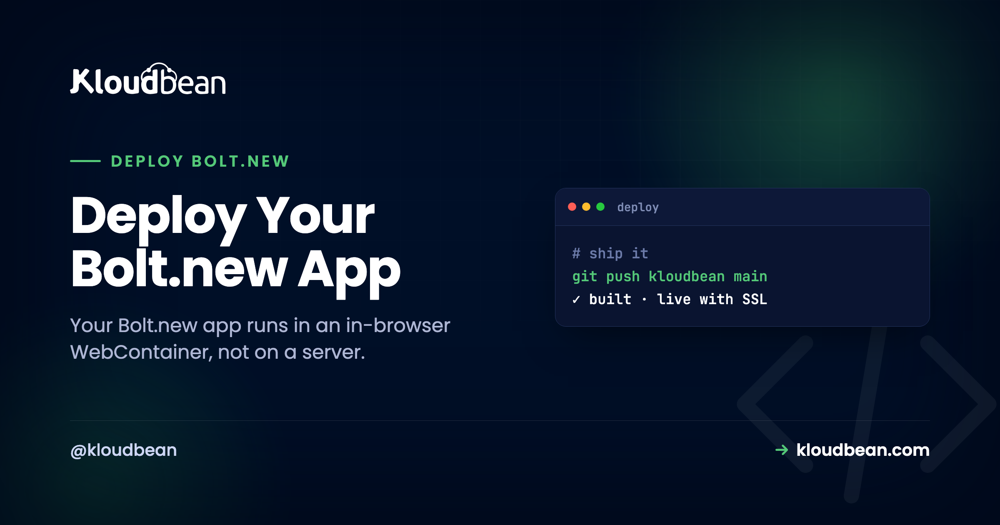

# Deploy Your Bolt.new App: Get It Out of the Browser First

Bolt.new feels like magic on the first run. You describe an app, and it appears in a browser tab: installing packages, running, previewing, all without a terminal. It looks live. So the natural next thought is "great, how do I deploy my Bolt.new app for real?" And that's where a small but important fact bites: the thing running in your Bolt tab was never on a server. It's a preview running inside your browser.

That's not a knock on Bolt. It's a fast way to build. But shipping to production starts with one move most guides skip: getting the real project out of the tab and onto hardware that stays on. Do that, and the rest is a normal Vite or Node deploy. Skip it, and you're stuck wondering why "it worked in Bolt" doesn't mean anyone else can reach it.

> **Short version:** Bolt runs your app in an in-browser WebContainer, so it's not deployed to anything. Export the project to GitHub, clone it, and run a clean `npm install` and build on your own machine to catch what the sandbox hid. Then deploy the repo to a server you own: connect Git, set the port and env vars, add a managed database, and turn on SSL and auto-deploy.

## Your app isn't running on a server. It's running in your tab.

Bolt.new runs your project in a **WebContainer**, StackBlitz's tech that boots a Node environment inside the browser tab using WebAssembly. It even runs `npm install`, pulling real packages into a filesystem that lives in the tab's memory. That's why the preview is instant: there's no remote machine to wait for, because the "machine" is the tab in front of you.

Which is brilliant for building and genuinely useless for serving real traffic. Close the tab and the process is gone. Nobody else's browser can reach it. The files were never written to a real disk. For production you need the same code running as an always-on process on a real machine, at a domain, with a database that persists. The bridge from one to the other is Git.

| In your Bolt tab | On a server you own |
| --- | --- |
| Node runs inside the browser tab | Always-on Node process |
| Files live in memory, not on disk | Real disk and a managed database |
| It stops when you close the tab | Reachable at your own domain |

*The WebContainer is a real Node runtime, just one that lives in your tab. Git is how the code crosses over to a machine that stays running.*

## Why "it worked in Bolt" isn't the same as "it's deployed"

It's worth being concrete, because this is the gap that surprises people. A working Bolt preview and a real deployment differ in ways that only show up once you try to hand someone a link.

- **It's tied to your tab.** The process runs in your browser session. Your teammate opening the same Bolt project gets their own sandbox, not your running app.
- **There's no durable storage.** The in-tab filesystem resets. Anything written to disk, including a quick SQLite file, isn't a place to keep real data.
- **There's no real database or domain.** If Bolt wired you to a hosted database, that part is real, but the app serving it still isn't. And a preview URL is not your domain with your SSL.

None of that means the code is wrong. The code is fine. It just needs a home that outlives the tab.

<!-- ADD IMAGE: Bolt.new's Connect to GitHub / export panel, pushing the project to a new repository. -->

## Step one is an evacuation: get the real project out

Before anything else, move the code somewhere permanent. Bolt.new can connect to GitHub and push your project to a repository. Do that now. (If you've only ever worked in the tab, connect GitHub from inside Bolt and export the project, or download it as a zip and push it yourself.)

That repo, not the Bolt tab, is now the source of truth for what you deploy. It's also your insurance: the code exists somewhere that isn't a browser session you might accidentally close. This one habit is the difference between "I built something in Bolt" and "I own a project I can ship anywhere."

## Do a clean install on your own machine (it catches what the sandbox hid)

Here's the step that saves you a confusing first deploy. Before you push code at a server, clone the repo fresh and build it on your own machine, exactly the way a server will. The WebContainer is forgiving in ways a real Linux box is not, and a clean build drags those differences into the light while you can still fix them calmly.

```
git clone https://github.com/you/your-bolt-app.git
cd your-bolt-app
npm install        # a fresh install, same as the server will run
npm run build      # does it actually build outside the tab?
npm run preview    # click through it before you ship anything
```

What a fresh clone tends to surface:

- **A dependency that isn't in `package.json`.** If something got pulled in during the session but never saved, a clean install fails with `Cannot find module 'x'`. Add it properly with `npm install x` and commit.
- **Case-sensitive import paths.** A real Linux server cares about case. `import Button from './button'` when the file is `Button.tsx` throws `Module not found: Can't resolve './button'` on the server even if it "worked" before. Fix the casing now.
- **A Node version assumption.** Note the Node version you build on locally so you can match it on the server.
- **Missing env vars.** Anything you typed into Bolt's UI isn't in the repo. If the build or start needs it, you'll find out here, not at 2am on the server.

If it builds clean locally, the server deploy is almost boring. That's the goal.

<!-- ADD IMAGE: Your terminal running a clean npm run build locally, surfacing a Module not found error the tab never showed. -->

## The three things the sandbox was faking

A Bolt app is usually a Vite + React project, sometimes with a small Node/Express API. Wherever it leaned on the WebContainer's conveniences, you now point it at the real thing. There are three, and they're the same three that break most first deploys.

| What the sandbox gave you | What a real server needs |
| --- | --- |
| A port the tab wired up automatically | Listen on `process.env.PORT`, not a hard-coded number |
| Secrets you typed into the Bolt UI | Environment variables set on the server |
| An in-tab or hosted dev database | A managed database with a real connection string |

The port one is worth a specific word. WebContainers map ports for you, so a hard-coded `app.listen(3000)` looks fine in Bolt. On a real server the platform assigns the port, and if your app ignores it, the deploy comes up as a `503` because nothing is listening where it's expected. Read the port from the environment:

```
const port = process.env.PORT || 3000;
app.listen(port, () => console.log(`listening on ${port}`));
```

## Deploy your Bolt.new app: connect the repo to a server you own

Repo pushed and building clean? Now it's a short path through the console, with no Nginx to configure by hand.

Sign in to the [Kloudbean](https://www.kloudbean.com/) console and click **Add Server**. Pick a **Cloud Provider**, choose **Node.js** as the application, pick the datacenter nearest your users, and give the build room with 2 to 4 GB of memory. **Launch Now** provisions it in a few minutes, stack ready. This is the always-on machine the WebContainer was standing in for.


Open the app, go to **Application Administration, Deploy Code**, connect GitHub, paste your repository URL, and pick the branch. Then set the runtime fields that actually matter:

- **App Directory:** where `package.json` lives (often the repo root).
- **Port:** the assigned port your app reads from `process.env.PORT`.
- **Node Version:** match what you built on locally.
- **Install / Build / Start:** `npm install`, `npm run build`, then `npm start` (or a small server for a static Vite build).


If your app stores data, launch a managed **Postgres** or **MySQL** from the console. It runs next to the app, gets backed up, and you reach it with a connection string you keep in environment variables, never in the repo. Already using a hosted database from Bolt and want to keep it? You can. Or bring it onto one owned server with an export and import.

Add every key the app needs under **Runtime Configuration, Environment Variables**. The **Paste .env Content** tab is the quick way: paste, **Convert to Key/Value**, **Save**. A missing variable is the top reason an app builds fine then won't start, so be thorough. More on that in [environment variables, done right](https://www.kloudbean.com/blog/environment-variables-done-right/).


Test on the temporary URL the app gets by default and click through the real flows off the WebContainer. Then add your custom domain under **Domain Aliases**, point its DNS at the server, install a free Let's Encrypt certificate, and turn on [automated deployment](https://www.kloudbean.com/blog/ci-cd-auto-deploy-from-github/) so every push rebuilds and ships with the build log streaming live.

<!-- ADD IMAGE: Your Bolt app live on its custom domain with the SSL padlock, next to the old Bolt preview tab. -->

## When the deploy comes up as a 503

A **503** means the process didn't start. In Bolt-exported apps the order of likelihood is pretty consistent:

- **Not listening on `process.env.PORT`.** The sandbox was forgiving about ports. The server isn't.
- **A missing environment variable.** The build succeeds, then the app crashes on startup looking for a key that isn't set.
- **A start command that doesn't start a long-running server.** A static Vite build needs to be served; a Node app needs its real entry point.

Read the reason straight from `/home/admin/hosted-sites/<app_system_user>/app-logs/app.error.log`, or watch it live under Build and Deployment History. The full checklist is in [fixing a 503 after deploying](https://www.kloudbean.com/blog/fix-503-after-deploying-your-app/).

## Full-stack Bolt apps: one server, not three services

Bolt is happy to generate a full-stack app: a React front end, a Node/Express API, and a database schema, all in one project. That's more than a static host can run, and it's exactly what one owned server is built for. The front end is served, the API runs as part of the same Node process (or as its own application if you'd rather split them), and the database sits on the same box, reachable over the local network. Instead of stitching a static host to a serverless API to a hosted database (three bills, three dashboards), you've got one place to look when something breaks and one server to back up. The mechanics are in [app, API, and database on one server](https://www.kloudbean.com/blog/host-app-api-and-database-on-one-server/).

## The loop after: build in Bolt, ship from Git

Once auto-deploy is on, you keep the best of both. Keep iterating in Bolt where building is fast. When a change is ready, it goes to GitHub, and the server rebuilds and ships it on its own. Want a safety net before changes hit users? Run a second application from a `staging` branch on the same server for a stable preview URL. Bolt stays the workshop. The server is the storefront.

## What you own, and what's managed

Kloudbean runs Linux web stacks: Node, plus PHP, Python, Ruby, and Java, with frameworks like React, Vue, Next.js, Laravel, and Django on top. That's what Bolt.new produces, so you're on solid ground. It isn't for Windows or .NET workloads. "Managed" means the server, stack, SSL, backups, and patching are handled, while you own and maintain the app itself. Prefer the tool-agnostic version that also covers Cursor, Lovable, and v0? That's the [deploy an AI-built app](https://www.kloudbean.com/blog/deploy-ai-built-app-to-production/) guide, and the [Lovable walkthrough](https://www.kloudbean.com/blog/deploy-lovable-app-to-your-own-server/) is a close cousin of this one.

## From preview to product

Get your Bolt.new app off the tab and onto a server you own at [kloudbean.com](https://www.kloudbean.com/). One-click databases · Automatic backups · Free migration · Free trial · Git deploy. Plans on [pricing](https://www.kloudbean.com/pricing/).

## FAQ

**Can I deploy a Bolt.new app to my own server?**
Yes. Export the project from Bolt to GitHub, then deploy that repo on Kloudbean. Bolt produces standard Vite, Node, and React code, which runs on a normal server like any other app.

**Isn't my app already live in Bolt.new?**
No. Bolt runs your app in an in-browser WebContainer, which is a sandbox for building and previewing. It stops when you close the tab and nobody else can reach it. Production needs the code running as an always-on process on a real server, with a database, a domain, and SSL.

**Why should I do a clean install before deploying?**
Because the WebContainer is more forgiving than a Linux server. A fresh git clone plus npm install and build on your machine surfaces missing dependencies, case-sensitive import paths, and missing env vars while they're easy to fix, instead of during a failed first deploy.

**What about my database?**
Give the app a real one. Launch a managed Postgres or MySQL on your server and connect through environment variables, or bring an existing hosted database over with an export and import.

**Why won't my Bolt app start after deploying?**
Most often it isn't listening on the assigned process.env.PORT, or an environment variable is missing, or the start command doesn't launch a long-running server. Check app.error.log, where the cause is usually named, then redeploy.

**Do I have to redeploy manually every time?**
No. Turn on automated deployment and every push to your branch rebuilds and ships. Your loop becomes: build in Bolt, push to GitHub, production updates itself.
