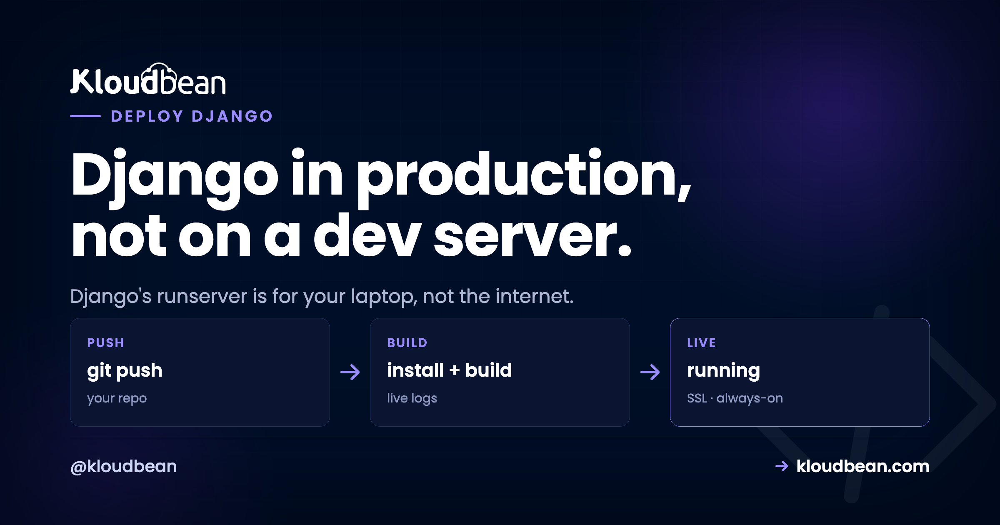

# Deploy a Django App: The Production Checklist

`python manage.py runserver` is great on your laptop. On the public internet it's the wrong tool. To deploy a Django app for production you really make two moves: swap that development server for a real one, and flip a handful of settings that are harmless in dev and genuinely dangerous once you're live.

Most Django tutorials stop at "it runs locally." This one is the other half. Two checklists, worked top to bottom: the settings that must change, then the deploy steps that put Gunicorn in front of your app. Get both right and your django production server comes up clean the first time, styling and all.

> **The gist.** Set `DEBUG=False`, read `SECRET_KEY` and the database from the environment, list your domain in `ALLOWED_HOSTS`. Then deploy: `pip install`, `collectstatic`, `migrate`, and start with `gunicorn` bound to the assigned port. That's the whole job. `runserver` never touches production.

## Why runserver stops at your laptop

Django's own docs are blunt about it: don't use `runserver` in production. It's a development server. It's single-threaded, it hasn't been through a security audit, and it isn't built to hold up under real traffic. That's not a knock on Django. The dev server exists to give you auto-reload and friendly tracebacks while you build, and it's excellent at that. It just isn't a web server.

So a production deploy has a shape. A real web server terminates HTTPS and hands requests to Gunicorn, which runs your Django code across a pool of workers, which talks to a managed database. The diagram below is that path, with the settings that have to change for prod marked on the boxes they affect.

*(Diagram: the production request path. Browser sends HTTPS to a managed web server (SSL + proxy), which forwards to Gunicorn (WSGI workers), which runs the Django app, which reads from managed Postgres. Below, what flips when you go to prod: DEBUG = False (no error page leaking your code and settings), ALLOWED_HOSTS = your domain (Django rejects any other host), SECRET_KEY + DATABASES from env (secrets live on the server, not in git), and collectstatic then WhiteNoise (or every CSS and JS file 404s). The start command that replaces runserver: `gunicorn config.wsgi:application --bind 0.0.0.0:$PORT --workers 3`.)*

## Checklist A: the settings that must change for production

These live in your Django settings and read from environment variables, so one codebase runs safely in both places with different values. Don't skip any of them.

- **`DEBUG = False`.** With `DEBUG` on, an unhandled error renders a full Django debug page to whoever hit it: your traceback, local variables, parts of settings, installed apps. Off is non-negotiable in production.
- **`SECRET_KEY` from the environment.** It signs sessions, password-reset tokens, and more. Read it from an env var, keep it stable, and never commit it.
- **`ALLOWED_HOSTS`.** Set it to your domain(s). Django refuses any request whose `Host` header isn't on the list, so an empty list means every request 400s.
- **`CSRF_TRUSTED_ORIGINS`.** Add your `https://` domain so form posts and the admin work correctly behind TLS.
- **Database from the environment.** Point `DATABASES` at your managed Postgres via env vars, not the SQLite default. SQLite is lovely in dev and wrong for a real deploy: it lives in a single file on local disk, so it doesn't survive a rebuild and can't be shared across workers.

In code that's a small, boring block near the top of your settings:

```python
# settings.py: production config comes from the environment
import os

DEBUG = os.environ.get("DEBUG", "False") == "True"
SECRET_KEY = os.environ["SECRET_KEY"]          # no default: crash loudly if unset
ALLOWED_HOSTS = os.environ.get("ALLOWED_HOSTS", "").split(",")
CSRF_TRUSTED_ORIGINS = ["https://" + h for h in ALLOWED_HOSTS if h]
```

One opinion, stated flatly: `DEBUG = True` in production isn't a tidiness problem, it's a security hole. That pretty yellow error page hands a stranger your stack trace, your settings, and enough of your internals to plan a real attack. Treat a live site running with debug on as an incident, not a to-do. You set these values on the server, never in the repo:


That keeps secrets out of version control and lets you rotate a key without a code change. The reasoning, and the mistakes people make with it, is in [environment variables, done right](https://www.kloudbean.com/blog/environment-variables-done-right/).

## Checklist B: deploy your Django app with Install, Build, Start

With settings sorted, the deploy is a short sequence. On [Kloudbean](https://www.kloudbean.com/) you connect the repo under **Application Administration → Deploy Code → Git Deployment**, then fill three fields: Install, Build, and Start.

- **Install:** `pip install -r requirements.txt`. Add `gunicorn` to that file if it isn't already there.
- **Build:** `python manage.py collectstatic --noinput`, then `python manage.py migrate`. Collectstatic gathers every static file into one folder to be served; migrate applies your schema changes so the database matches the code on every deploy.
- **Start:** `gunicorn config.wsgi:application --bind 0.0.0.0:$PORT --workers 3`. Swap `config` for the package that holds your `wsgi.py`. The `$PORT` matters: bind the port the platform assigns, not a hard-coded one, or the web server in front connects to nothing and you get a 503.

```
# the three fields, for a project package called "config"
# Install
pip install -r requirements.txt
# Build
python manage.py collectstatic --noinput && python manage.py migrate
# Start
gunicorn config.wsgi:application --bind 0.0.0.0:$PORT --workers 3
```

Hit **Pull & Deploy** and the build log streams live while it installs, collects static, migrates, and boots Gunicorn. The whole point of Checklist B is that one swap: **Gunicorn, not runserver**. Everything else is plumbing.


## The collectstatic trap: why your CSS 404s

Here's the anti-pattern that catches nearly every first Django deploy. The most common question we hear is some version of "the site works but there's no styling." Almost every time, `collectstatic` never ran, so every request for a file under `/static/` comes back 404 and the page renders as naked HTML. The app is fine. The static files just aren't where the server looks for them.

The fix is two parts. Run `collectstatic` in your Build step (above), and give Django something to actually serve those files with. The simplest option by a mile is **WhiteNoise**: `pip install whitenoise`, add its middleware, and your app serves its own static files with proper caching and no separate config. For a single app, that's the least-effort win.

<!-- ADD IMAGE: Before/after browser shot: the same page unstyled (collectstatic skipped, CSS 404s) next to it styled correctly. -->

## Static vs media: two different problems

Django splits files into two buckets, and they're handled differently. Mixing them up is the second-most-common deploy mistake.

- **Static files** ship with your app (CSS, JS, the admin's assets). They're known at build time, gathered by `collectstatic`, and served by WhiteNoise or the web server. They never change at runtime.
- **Media files** are user uploads, created while the app runs. On a single server the local media directory works. The moment you run more than one server, or you want uploads to survive a rebuild, point Django's storage at [S3-compatible object storage](https://www.kloudbean.com/blog/s3-compatible-object-storage/). Uploads then live independently of the app box, which is where they should be for anything real.

## How many Gunicorn workers?

Gunicorn runs your app in a pool of worker processes, and the default of one leaves performance on the floor. A well-worn starting point is **(2 × CPU cores) + 1**, so a 2-core server runs about 5 workers. That handles concurrent requests comfortably without swamping the box. Don't crank it to 50. Each worker is a separate process holding its own memory, and too many will exhaust a small server and make everything slower, not faster. Start with the formula, watch memory, adjust. If your app spends most of its time waiting on the network, gevent or async workers can help, but plain sync workers are the right default for most Django apps.

## Migrations, the database, and HTTPS

Run `migrate` on every deploy (it's in your Build step) so the schema never drifts behind the code. Skip it after a model change and the first request that touches the new column throws. For the database itself, launch a managed Postgres from **DBS → Launch Database** and reach it over the local network on the same box. It's backed up, and your app finds it through the `DATABASES` env var from Checklist A.


Then point your domain at the server and install a free **Let's Encrypt** certificate. Django's CSRF and secure-cookie behaviour expects HTTPS, so this isn't optional dressing. Turn on automated deployment and every push re-runs collectstatic and migrate and restarts Gunicorn. Your update loop becomes one step: push, and production catches up. More on the shared-box setup in [host your app, API, and database on one server](https://www.kloudbean.com/blog/host-app-api-and-database-on-one-server/), and on managed Postgres specifically in [managed PostgreSQL hosting](https://www.kloudbean.com/blog/managed-postgresql-hosting/).

## When it breaks: the three first-deploy errors

Django's opening-night failures are predictable, and each maps straight back to a checklist item:

- **DisallowedHost, a 400 on every page.** Your domain isn't in `ALLOWED_HOSTS`. Add it, redeploy.
- **A 500 with no detail.** That's `DEBUG = False` doing its job, which is correct. The real cause is usually a missing `SECRET_KEY` or wrong database credentials. Read the log; the traceback names it.
- **Loads but unstyled.** The collectstatic trap. Static files aren't served: either the build step didn't run `collectstatic`, or WhiteNoise isn't wired up.

The stack trace is waiting in the app error log at `/home/admin/hosted-sites/<app_system_user>/app-logs/app.error.log`. Read that before you start changing code on a hunch. The full walkthrough is in [fixing a 503 after deploying your app](https://www.kloudbean.com/blog/fix-503-after-deploying-your-app/).

## If you use Celery

Plenty of Django apps push slow work (emails, image processing, report generation) onto **Celery**. If yours does, remember Celery is its own process, separate from Gunicorn. A Celery **worker** runs the queued tasks and Celery **beat** runs the scheduled ones. Run both as persistent processes alongside the web app, pointed at a broker like [managed Redis](https://www.kloudbean.com/blog/managed-redis-hosting/). No worker running means tasks queue up and never execute, which is a genuinely confusing bug the first time it bites. Not using Celery? Skip this entirely.

## What you own, what Kloudbean runs

Django is a Python app, and Python on Linux is exactly what a managed server runs, so nothing here is a workaround. Kloudbean keeps the box healthy: the Python runtime, the web server in front of Gunicorn, SSL, firewall, and server-level backups, on whichever of its seven clouds you pick. You own the Django project: its settings, its migrations, its static and media strategy, any Celery processes. It's a Linux server running standard Python, so you can move hosts whenever you like. Building in other frameworks too? The async sibling is [deploy a FastAPI app](https://www.kloudbean.com/blog/deploy-fastapi-app/), and the minimal one is [deploy a Flask app](https://www.kloudbean.com/blog/deploy-flask-app/).

**Gunicorn, not runserver. Then relax.** Put your Django app on a server you own at [kloudbean.com](https://www.kloudbean.com/). Managed Postgres · Automatic backups · Free Let's Encrypt SSL · Git deploy · Free migration · Free trial. Server sizes are on [pricing](https://www.kloudbean.com/pricing/).

## FAQ

**Can I run Django with `manage.py runserver` in production?**
No. It's a development server and Django explicitly warns against it. In production you run Gunicorn (or another WSGI server) with the managed web server in front. Use `runserver` only on your machine.

**What settings must change before going live?**
`DEBUG = False`, a `SECRET_KEY` read from the environment, `ALLOWED_HOSTS` set to your domain, `CSRF_TRUSTED_ORIGINS` with your HTTPS domain, and a real database (Postgres) via env vars. Those five matter most.

**Is `DEBUG = True` really a security risk in production?**
Yes. With debug on, any unhandled error shows a detailed page containing your traceback, parts of your settings, and local variables. That hands an attacker a map of your app. Keep it off in production, always.

**Why is my Django site missing its CSS after deploy?**
Static files aren't being served. Run `collectstatic` in your build step, then serve the files with WhiteNoise or the web server. Broken styling after deploy almost always traces back to skipped or unserved static files.

**Where should user uploads (media) go?**
On a single server, the local media directory works. If you scale to multiple servers or want uploads to survive a rebuild, point Django's storage at S3-compatible object storage, which Django supports cleanly.

**Do I need to run migrations on every deploy?**
Yes. Run `python manage.py migrate` as part of each deploy so the schema stays in step with your code. Skip it after a model change and the app errors the moment it touches the missing column or table.

**Do I use Gunicorn or Uvicorn for Django?**
Gunicorn. Django is a WSGI app, and Gunicorn is the standard WSGI server for it. You only reach for an ASGI server like Uvicorn or Daphne if you're using Django's async views, channels, or websockets.

**Do I need Docker to deploy a Django app?**
No. A single Django app is a process behind Gunicorn, and a managed server runs it directly. Docker and Kubernetes solve orchestration problems that show up with many services at scale. For shipping one app, you can skip them.
