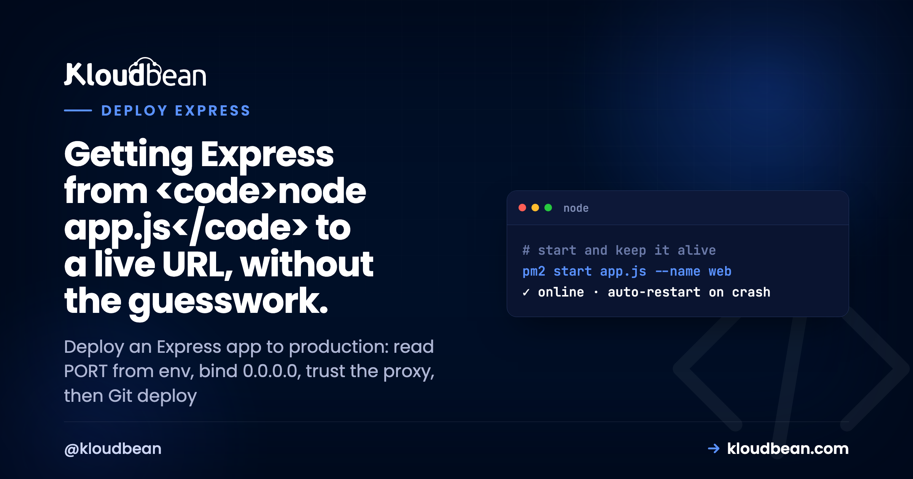

# How to Deploy an Express App to Production

*By Kloudbean Engineering · Getting Express from `node app.js` to a live URL, without the guesswork.*

Your Express app runs fine with `node app.js`. You hit `localhost:3000`, the routes answer, life is good. Then you try to deploy that Express app to production and it 502s, or it boots but nothing reaches it. Nine times out of ten the code is fine. The config isn't.

This is a practical guide to deploy Express.js to production on a server you own. First the handful of code changes that make an Express app production-ready, then the actual deploy: Git, PM2, environment variables, a domain with SSL. We'll also host an Express API next to a managed database, and fix the 502/503 that eats most people's first evening. If you want the framework-agnostic model first, the pillar covers [how to deploy any app](https://www.kloudbean.com/blog/how-to-deploy-any-app/). Here we stay specific to Express.

> **How do I deploy an Express app to production?** Read the port from `process.env.PORT`, bind to `0.0.0.0` (not localhost), turn on `trust proxy` so it behaves behind Nginx, and add a small health route. Then push to Git, let a managed server run `npm ci` and your build, keep the process alive with PM2, set your env vars and database URL in the dashboard, and attach a domain with free auto-renewing SSL. Most Express deploy failures are config, not code.

## The Express code that's fine locally and breaks in production

Express barely gets in your way locally, which is the whole appeal. That same forgiving default is why the first deploy surprises people. Four small changes cover almost all of it. None of them touch your routes or your business logic. Here's how they fit together, then we'll take each one.

*(Diagram: one Express app, two flows. DEPLOY, on every push: a git push triggers `npm ci` and a build with live logs, then PM2 reloads the process and can run one copy per CPU core with `-i max`. SERVE, every request: a browser makes an HTTPS request to Nginx on port 443, which terminates TLS and sets X-Forwarded-For, then proxies to the Express app bound to 0.0.0.0 on its port with trust proxy on, and a `/healthz` route answers 200 OK. If Nginx can't reach the app on that port, you get a 502/503, so bind 0.0.0.0 and read PORT from env.)*

### 1. Read the port from the environment

Local code says `app.listen(3000)` because 3000 was free on your machine. In production the platform assigns the port and the reverse proxy in front forwards to it. If your app ignores that and grabs 3000 anyway, the proxy connects to nothing and you get a 502. The app didn't even crash. It's just listening in the wrong place.

```js
// works on your laptop, breaks in production
app.listen(3000);

// reads the assigned port, works anywhere
const port = process.env.PORT || 3000;
app.listen(port, () => console.log(`Express listening on ${port}`));
```

That `|| 3000` keeps your local run unchanged while letting production hand you the real port. It's the single highest-value line in this whole guide.

### 2. Bind to 0.0.0.0, not localhost

A plain `app.listen(port)` already binds to all interfaces, which is what you want. The trap is a template or a habit that pins the host:

```js
// reachable only from the same loopback
app.listen(port, 'localhost');   // or '127.0.0.1'

// reachable by the proxy, health checks, containers
app.listen(port, '0.0.0.0');
```

On a single managed box Nginx is local, so `127.0.0.1` often happens to work. But bind to `0.0.0.0` and you delete a whole class of "works on my machine" surprises: health checks from another interface, a sidecar, a container network, a load balancer probe. It costs nothing and prevents a confusing outage. Just bind to all interfaces and move on. Worth knowing if you also run Fastify: it binds to `localhost` by default, so this is the first thing to change when you [deploy a Fastify app to production](https://www.kloudbean.com/blog/deploy-fastify-app/).

### 3. Trust the proxy

This one is pure Express and it bites quietly. Behind Nginx, every request arrives from `127.0.0.1`, over plain HTTP, on the internal port. Express believes what it sees. So `req.ip` is the proxy, `req.protocol` is `http`, and `req.secure` is false, even though your user is on HTTPS. That breaks secure cookies, HTTPS redirects, and rate limiters that key on IP (every request looks like it came from one address). One line fixes it:

```js
// tell Express it sits behind one reverse proxy
app.set('trust proxy', 1);
```

Now Express reads the real client IP and protocol from the `X-Forwarded-For` and `X-Forwarded-Proto` headers Nginx set. Secure cookies set correctly, `express-rate-limit` counts real IPs, and `req.protocol` reports `https`. Skip this and you'll ship a login that silently won't stay logged in behind SSL. Ask me how I know.

### 4. Add a health route

Give the platform a cheap, honest way to ask "are you up?" A tiny route that returns 200 and touches nothing slow:

```js
app.get('/healthz', (req, res) => res.status(200).send('ok'));
```

Keep it dumb on purpose. Don't hang it on a database query or a downstream API, or a brief blip there marks your whole app as unhealthy and something starts restarting a process that was fine. A health route is a liveness signal, not a full system check. If you want deeper checks, put them behind a separate path that your monitoring hits, not the one the proxy uses to decide the app is alive.

> **Coming off Heroku?** Express and Heroku grew up together, so most of this maps cleanly. Your Procfile's `web:` line becomes your Start command, and reading `process.env.PORT` works exactly the same. The migration angle, dynos versus a server you actually own, is in the [Heroku alternative for modern apps](https://www.kloudbean.com/blog/heroku-alternative-for-modern-apps/).

## How to deploy an Express app on a managed server

With those four changes in, the deploy is short. A managed server hands you the survival machinery already assembled: the Node runtime, PM2, an Nginx reverse proxy, a firewall, SSL. You bring the app. Here's the path through the Kloudbean console.

### Create the server and add your app

Click **Add Server**, pick a cloud provider (Kloudbean runs seven: AWS, Amazon Lightsail, Google Cloud, DigitalOcean, Vultr, Akamai Linode, and UpCloud), choose the **Node.js** stack, a location near your users, and a size. 2 GB is a comfortable start for a single API. If you're putting several apps on one box, or an Express API beside a front end, add each one under **Applications, Add Application** and pick its stack. Multiple apps per server is a first-class thing here, not a hack.


### Connect Git and set the runtime

Deploys come from Git, which is what you want. The repo is the source of truth, not a folder on your laptop. In **Git Deployment**, connect GitHub, paste the repository URL, choose a branch, and clone. Then fill the runtime config:

- **App Directory:** the folder holding your `package.json`.
- **Port:** the port your app reads from `process.env.PORT`. This is the number the proxy forwards to, so it has to match.
- **Node Version:** match what you built on. Node 20+ is a safe default.
- **Install / Build / Start:** usually `npm ci`, an optional `npm run build` (TypeScript, a bundled client), then `npm start` or `node app.js`.

Hit **Pull & Deploy** and the build log streams live, so you watch clone, install, build, and start scroll past instead of guessing. Turn on automated deployment and every push to that branch ships itself. That's the same continuous-deploy loop the big platforms sell, on a box you own. The details are in [CI/CD auto-deploy from GitHub](https://www.kloudbean.com/blog/ci-cd-auto-deploy-from-github/).


<!-- ADD IMAGE: the runtime config panel filled in for Express: App Directory, Port, Node version, and the Install/Build/Start commands. -->

### Let PM2 keep it alive

On the managed stack your Express app runs under PM2, so a crash doesn't become downtime. PM2 notices the process exit and restarts it in about a second, and it starts your app again after a server reboot. That's the line between a service and a terminal window you forgot to close. Kloudbean supports PM2 multi-process, so when one core stops being enough you run a copy per core behind the same port:

```
# one instance per CPU core
pm2 start app.js -i max
```

Start with a single instance. Turn on clustering when your metrics actually ask for it. One caveat that trips people the moment they cluster: in-memory state stops being shared. A sessions object, a local rate-limiter, or a cache that's just a `Map` now has one copy per instance, so a user hits instance A and their session isn't on instance B. Move that state into managed Redis and it's shared again. The full PM2 story, graceful `SIGTERM` shutdown and cluster mode in depth, lives in [deploy a Node app to managed cloud](https://www.kloudbean.com/blog/deploy-node-app-to-managed-cloud/).

<!-- ADD IMAGE: a terminal running pm2 list: the Express app online, its uptime, and restart count. -->

### Set environment variables (and NODE_ENV)

Your database URL, API keys, and any config that differs between laptop and production go in **Runtime Configuration, Environment Variables**, never in the repo. There's a **Paste .env Content** tab so you can drop the whole file in and convert it to key/value. A missing variable is the most common reason an Express app builds but won't boot, so copy them all.

Set `NODE_ENV=production` too. Express uses it to cache view templates and trim verbose error output, and it changes how installs behave. Watch this real gotcha: with `NODE_ENV=production` set, `npm ci` can skip `devDependencies`, so if your build step needs the TypeScript compiler or a bundler that's sitting in `devDependencies`, the build fails with a "command not found" that looks nothing like the real cause. Either move build-time tools into `dependencies`, or install with `npm ci --include=dev` for the build. The broader why-and-how is in [environment variables, done right](https://www.kloudbean.com/blog/environment-variables-done-right/).


### Point a domain and turn on SSL

Add your custom domain in the app's domain settings, point its DNS at the server, and install a free auto-renewing SSL certificate. Renewal is automatic, so no calendar reminder and no plain-HTTP API in 2026. A pure Express API with no browser front end still gets a domain and HTTPS. Clients call it over TLS the same way.

<!-- ADD IMAGE: the domain and SSL panel: a custom domain added and a free auto-renewing certificate issued. -->

## Hosting an Express API with a managed database

Most Express apps are an API in front of a database, so this is the part that matters. Move your data off any local file before you have users, not after. A SQLite file or a JSON store on the app server's disk works right up until your first redeploy or a second instance, and then it's gone or out of sync.

Open **Launch Database** and create a managed engine. Kloudbean runs seven: PostgreSQL, MySQL, MariaDB, Redis, Memcached, Elasticsearch, and MongoDB. It provisions on the same box or as a separate managed instance in your account, gets backed up on a schedule, and hands you credentials. Feed those into your env vars as a connection string, and read it in Express, never hardcoded:

```js
// read the connection string from the environment
const pool = new Pool({ connectionString: process.env.DATABASE_URL });
```

Two things worth getting right early. Use a **connection pool** rather than opening a socket per request, because an Express app under load will exhaust a database's connection limit fast if every handler dials its own. And lock the database down with IP allow-listing so only your app server can reach it, not the public internet. The full walkthrough, pooling, migrations on deploy, and when an external managed database still makes sense, is in [add a managed database to your app](https://www.kloudbean.com/blog/add-managed-database-to-your-app/). If your Express app also runs scheduled work, you can add cron jobs from the dashboard without a separate service or SSH.

## When it 502s or 503s after you deploy

Almost nobody nails a first deploy, and that's fine, because the failures are predictable. A **502 Bad Gateway** means Nginx reached the box but got nothing back from your app: it crashed on boot, it's listening on the wrong port, or it bound somewhere the proxy can't reach. A **503** means nothing is available to answer yet. For an Express app the causes are a short list:

- The app isn't reading `process.env.PORT`, so it listens on 3000 while the proxy forwards to another port.
- A required environment variable is missing, so it throws on startup and PM2 keeps restarting a process that can't stay up.
- The Start command doesn't actually launch the server, or points at the wrong file.
- A dependency is imported but missing from `package.json` (or got dropped as a devDependency in a production install).

Don't guess. Read the app's error log, where a Node crash writes its stack trace and usually names the exact line:

```
/home/admin/hosted-sites/<app_system_user>/app-logs/app.error.log
```

Fix the one thing it names and **Pull & Deploy** again. The full triage is in [fix the 503 after deploying your app](https://www.kloudbean.com/blog/fix-503-after-deploying-your-app/).

**A founder note, since we see this constantly:** the overwhelming majority of Express deploy failures are configuration, not code. Port, host, a missing env var, a wrong start command. Your routes are almost never the problem. So when a deploy breaks, resist the urge to reread your controllers. Check the four things above first. It's faster, and it's usually right.

---

**Your Express app, live on a server you own.** Deploy from Git, let PM2 keep it up, wire in a managed database, and get free auto-renewing SSL, without hand-rolling a single Nginx config. Start at [kloudbean.com](https://www.kloudbean.com/); sizes and plans (from $8/mo, Enterprise custom) are on [pricing](https://www.kloudbean.com/pricing/).

Seven clouds, one dashboard · Git deploy with live logs · PM2 process management · Managed databases · Free auto-renewing SSL · Free migration · Free trial

## FAQ

**How do I deploy an Express app to production?**
Make the app read `process.env.PORT`, bind to `0.0.0.0`, set `trust proxy`, and add a health route. Then push to GitHub, launch a managed Node server, deploy from the repo with your install, build, and start commands, add your env vars and a managed database, and point a domain with SSL. PM2 keeps the process alive and the reverse proxy sends HTTPS traffic to it.

**Why does my Express app work locally but 502 in production?**
A 502 means the proxy reached the server but your app answered nothing. Usually the app isn't listening on `process.env.PORT`, a required environment variable is missing so it crashed on boot, or the start command doesn't launch the server. Read `app.error.log` for the stack trace, fix that one thing, and redeploy. It's config, not your routes.

**Do I need to set process.env.PORT in Express?**
Yes. In production the platform assigns the port and the reverse proxy forwards to it, so a hardcoded `app.listen(3000)` leaves the proxy talking to nothing. Use `const port = process.env.PORT || 3000` so your local run is unchanged and production gets the real port. This single line prevents the most common first-deploy failure.

**What does app.set trust proxy do, and do I need it?**
It tells Express it's running behind a reverse proxy, so it reads the real client IP and protocol from the X-Forwarded-For and X-Forwarded-Proto headers instead of seeing every request as coming from the proxy over HTTP. You need it on managed hosting or behind any proxy, otherwise secure cookies, HTTPS detection, and IP-based rate limiting misbehave. Set it to 1 for a single proxy.

**Should I bind Express to 0.0.0.0 or localhost?**
Bind to `0.0.0.0`, which is Express's default with a plain `app.listen(port)`. Binding to localhost or 127.0.0.1 only accepts connections from the same loopback, which can break health checks, containers, and load balancer probes. There's no upside to restricting the host in a typical deploy, so leave it on all interfaces.

**How do I keep my Express app running after it crashes?**
Run it under a process manager, not in a terminal. On Kloudbean that's PM2, configured as part of the managed stack. It restarts the app in about a second if it exits and starts it again after a reboot, so one unhandled error doesn't become downtime until a human notices. You don't set it up yourself.

**Do I need Docker to deploy an Express app?**
No. A single Express app is one process, and a managed server runs it directly, restarts it on crash, and puts it behind a proxy with SSL. Docker and Kubernetes solve orchestration across many services at scale. For shipping one API, they're extra moving parts you don't need yet.

**How do I connect a database to my Express app?**
Launch a managed database (Postgres, MySQL, Redis, and more), put its connection string in an environment variable, and read it in code with `process.env.DATABASE_URL`. Use a connection pool rather than a socket per request, and lock the database to your app server's IP instead of leaving a public port open. Never commit credentials to the repo.

**How do I add a health check to an Express app?**
Add a small route like `/healthz` that returns a 200 and touches nothing slow. Keep it independent of your database, so a brief database blip doesn't mark the whole app unhealthy and trigger restarts. If you want a deeper check, expose it on a separate path that only your monitoring calls.

**Can I auto-deploy my Express app on every git push?**
Yes. Connect the repository, pick a branch, and turn on automated deployment, so each push triggers a build and ship with live logs you can watch. That turns releasing a change into a plain `git push`, and every deploy is recorded so you can see exactly what went out.
