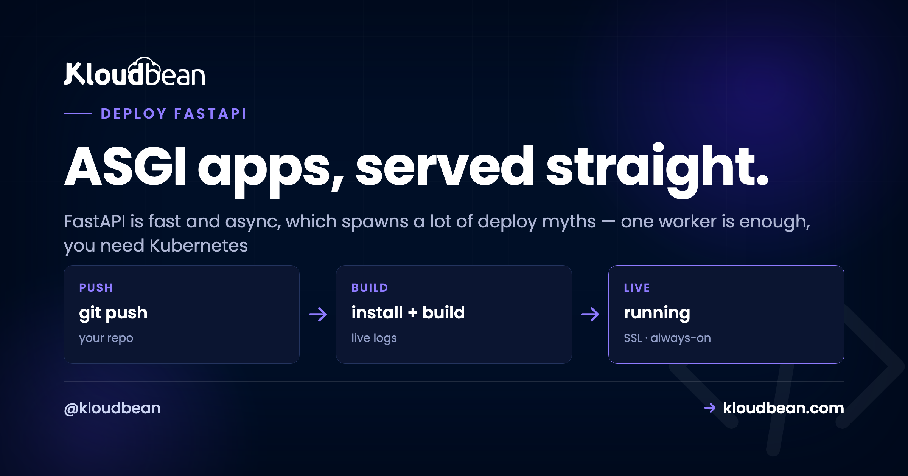

# 5 Myths About Deploying FastAPI (and What's Actually True)

Everyone has a theory about how to deploy a FastAPI app, and a surprising number of them are folklore. FastAPI is fast, modern, and async, and that reputation quietly breeds bad advice: that "async" means one process can carry the world, that Uvicorn on its own is the finish line, that you need Kubernetes to run it seriously.

None of those hold up. Believe them and you end up either over-engineering a simple API or watching it fall over the first time real traffic arrives. The root of almost every FastAPI myth is one word people don't fully unpack: **ASGI**. So before the myths, a minute on what ASGI actually changes about how you run the thing.

> **The short version.** FastAPI is an ASGI app, so you run it with Uvicorn, not Gunicorn's plain WSGI workers. In production that's `uvicorn main:app --host 0.0.0.0 --port $PORT --workers 4` (or Uvicorn workers under Gunicorn), bound to the port the platform assigns. Async handles many requests *per worker*; multiple workers use every core. One good server carries a lot. Reach for Kubernetes only when you actually have to.

## First, what ASGI actually changes

Flask and Django are **WSGI** apps. WSGI is synchronous: a worker takes one request, runs it start to finish, then takes the next. To handle ten requests at once you need ten workers. FastAPI is an **ASGI** app, and ASGI is asynchronous: a single worker runs an *event loop* that can juggle many requests at the same time, as long as each one spends part of its life waiting (on the database, an API call, the network). While request A waits, the loop serves B and C.

That single difference drives how you run it. You still want several workers to use every CPU core, but each worker now does far more than one request at a time. Picture it like this.

*(Diagram: one Uvicorn process (`uvicorn main:app --workers 3`, kept alive by the platform) fans out to three workers, one per CPU core. Inside each worker an event loop juggles several requests at once: some are awaiting the database or an API while one runs. Worker 3 shows the trap: a blocking synchronous call parks the loop, and the requests behind it wait. WSGI (Flask, Django) runs one request per worker; ASGI (FastAPI) runs many.)*

Hold that picture. Every myth below is really a misunderstanding of it.

## Myth 1: "It's async, so one worker handles everything"

**Reality:** async and multiple workers solve two different problems, and you want both.

Async lets one worker juggle many waiting requests, which is real and valuable. But a single worker still runs on a single CPU core. Give the server 4 cores, run one worker, and three sit idle while you pay for them. So you run several Uvicorn workers to spread across cores, and each worker uses async to handle many requests at once. The rule of thumb matches every other Python server: start around **(2 × cores) + 1** workers, then let async do its thing inside each one. One without the other leaves performance on the table.

## Myth 2: "Bare `uvicorn main:app` is production-ready"

**Reality:** Uvicorn is the right server. A single bare command in a terminal is not the whole production story.

Here's the anti-pattern I see most: someone ships `uvicorn main:app --reload` to production because it's what they ran locally. The `--reload` flag watches your files for changes and restarts on every edit. It's a single-process development convenience, and it has no business on a live server. Drop it.

Production wants two things around Uvicorn. First, **workers**, either `uvicorn main:app --workers 4` or the classic combo of Uvicorn worker processes under Gunicorn:

```
# option A: Uvicorn manages its own workers
uvicorn main:app --host 0.0.0.0 --port $PORT --workers 4

# option B: Gunicorn supervises Uvicorn workers (the "uvicorn gunicorn fastapi" combo)
gunicorn main:app -k uvicorn.workers.UvicornWorker --workers 4 --bind 0.0.0.0:$PORT
```

Second, **something to keep it alive**: a process manager that restarts the app if it crashes or the box reboots. On managed cloud that supervision is built in. You hand over the start command and the platform keeps it running, no init scripts to write. Note the `$PORT` in both commands. The app must bind the port the platform assigns, not a hard-coded one, or the web server in front connects to nothing and you get a 503. That single mistake causes a big share of "it deployed but won't load" tickets, same as it does for [a Node app reading the wrong port](https://www.kloudbean.com/blog/deploy-node-app-to-managed-cloud/).


## Myth 3: "It's async, so nothing ever blocks"

**Reality:** a slow, synchronous, CPU-heavy call inside an async route blocks the entire event loop. This is the bug that surprises people most, and it's Worker 3 in the diagram.

Async is cooperative. A worker serves many requests happily *as long as each one yields while it waits*. But if one request does something heavy and synchronous (a big image resize, a tight CPU loop, a library that isn't async-aware), it holds the loop, and every other request on that worker waits behind it. Async didn't fail. It got asked to do something it can't.

The version we see constantly: an `async def` route calling a plain synchronous database driver. One user in dev, feels instant. Real traffic arrives and every request lines up behind that blocking query, because a sync call parks the loop. It looks fine right up until it doesn't. Two clean fixes:

```python
# blocks the loop: synchronous driver inside an async route
@app.get("/users")
async def users():
    return db.query(User).all()      # sync call, parks the event loop

# fix 1: use a normal def route, FastAPI runs it in a threadpool
@app.get("/users")
def users():
    return db.query(User).all()      # no longer blocks the loop

# fix 2: go fully async with an async driver (asyncpg, databases)
@app.get("/users")
async def users():
    return await database.fetch_all("SELECT * FROM users")
```

Pick one shape on purpose. Fully async (an async driver like `asyncpg`, `async def` routes, awaited queries), or simple and sync (a normal driver with plain `def` routes, letting FastAPI's threadpool handle concurrency). Both are fine. What hurts is a sync driver stuck inside an async route, quietly serializing your traffic.

## Myth 4: "You need Kubernetes to run FastAPI properly"

**Reality:** for the vast majority of apps, one good server with several workers is plenty. Add a load balancer in front when you genuinely outgrow it.

FastAPI is quick, so a single modest server handles more traffic than most people expect. My opinion, plainly: Uvicorn with a few workers behind the managed web server is the sane default, and most FastAPI apps never need more than that. When you do outgrow one box, you don't leap to container orchestration. You add a second server and put a **load balancer** in front to spread requests across both.


That's real horizontal scaling without the Kubernetes tax. Kubernetes is a fine tool at large scale, and Kloudbean does offer k8s and autoscaling for enterprise setups that truly need them, but reaching for it on day one solves a problem you don't have yet. Start simple, scale the simple thing. If you want the deeper version of this argument, it's in [autoscaling, explained](https://www.kloudbean.com/blog/autoscaling-explained/) and [what a load balancer actually does](https://www.kloudbean.com/blog/cloud-load-balancer-explained/).

## Myth 5: "Deploying FastAPI is totally different from other Python apps"

**Reality:** the shape is identical to any other Python web app. Only the server type differs.

Flask and Django are WSGI apps served by Gunicorn. FastAPI is an ASGI app served by Uvicorn. That's the entire difference from a deploy standpoint. Everything else is the same familiar path, and on [Kloudbean](https://www.kloudbean.com/) it's three fields under **Application Administration → Deploy Code → Git Deployment**:

- **Install:** `pip install -r requirements.txt`.
- **Build:** usually empty for a plain API. If you generate anything at build time, it goes here.
- **Start:** `uvicorn main:app --host 0.0.0.0 --port $PORT --workers 4`.

Add your secrets and database URL under **Runtime Configuration → Environment Variables** with the **Paste .env** tab, launch a [managed Postgres or MySQL](https://www.kloudbean.com/blog/add-managed-database-to-your-app/) on the same box, point a domain, and install free Let's Encrypt SSL. Deployed a Flask app before? Then you already know this, you just swap `gunicorn app:app` for the Uvicorn command. The full WSGI walkthrough is [deploy a Flask app](https://www.kloudbean.com/blog/deploy-flask-app/), and the settings-first version is [deploy a Django app](https://www.kloudbean.com/blog/deploy-django-app/).


One nice payoff once it's live: FastAPI generates interactive API docs for free at `/docs` (Swagger UI) and `/redoc`. Deploy, and they're immediately at `yourdomain.com/docs` with zero extra setup, which makes handing an API to a frontend team genuinely pleasant.

<!-- ADD IMAGE: Browser at yourdomain.com/docs showing FastAPI's auto-generated Swagger UI, live on the deployed app. -->

None of this fights the platform. FastAPI is Python on Linux, which is exactly what a managed server runs. Kloudbean keeps the server healthy, supervises your Uvicorn workers, handles SSL, and takes server-level backups. You own the app code, the worker count, the secrets, and the data. The myths all come from treating "fast and async" as if it needed exotic hosting. It doesn't. It needs a normal server, sensibly configured, and it flies. When it does 503, that means the app isn't running, and the cause is almost always the port, a missing env var, or the start command. Read the traceback in the dashboard: **Application Administration → Logs Viewer**, then the **App Errors** tab, which is the app's own error log. **App Info** and **Web Requests Logs** are separate tabs, and there's a search box for finding one exception in a busy file. Build failures live in **Build and Deployment History** instead, streaming live while the deploy runs. The same files are on disk at `/home/admin/hosted-sites/<app_system_user>/app-logs/` (`app.error.log` and `app.info.log`) if you'd rather use a terminal or the File Manager. The checklist is [fixing a 503 after deploying](https://www.kloudbean.com/blog/fix-503-after-deploying-your-app/).

**Fast doesn't mean complicated.** Deploy your FastAPI app, Uvicorn workers and all, at [kloudbean.com](https://www.kloudbean.com/). Git deploy · Managed Postgres · Auto SSL · Load balancer when you need it · Free migration · Free trial. Sizes on [pricing](https://www.kloudbean.com/pricing/).

## FAQ

**How do I deploy a FastAPI app?**
Push it to GitHub, connect the repo, set the install command to `pip install -r requirements.txt`, and set the start command to `uvicorn main:app --host 0.0.0.0 --port $PORT --workers 4`. Add environment variables for your secrets and database, and deploy. It's the same flow as any Python app, with Uvicorn as the server.

**What is ASGI, and why does FastAPI need Uvicorn?**
ASGI is the async server interface FastAPI is built on, the async counterpart to WSGI. It lets one worker handle many requests concurrently via an event loop. Uvicorn is an ASGI server that runs it. Gunicorn's plain workers are WSGI, so you either run Uvicorn directly or run Uvicorn worker processes under Gunicorn.

**Do I run FastAPI with Uvicorn or Gunicorn?**
Uvicorn is the ASGI server that runs FastAPI. You can run multiple Uvicorn workers directly with `--workers`, or run Uvicorn worker processes managed by Gunicorn with `-k uvicorn.workers.UvicornWorker`. Both are common. Either way you want several workers to use all your CPU cores.

**How many workers should a FastAPI app use?**
A common starting point is (2 × CPU cores) + 1. Async handles concurrency within each worker; multiple workers use all the cores. Adjust based on real traffic and whether your workload is I/O-bound or CPU-bound.

**Why is my async FastAPI app slow under load?**
Usually a blocking, CPU-heavy, or non-async call inside an `async def` route is holding the event loop. Use a normal `def` route (FastAPI runs it in a threadpool) for blocking calls, and move heavy work to a background task or separate worker. A synchronous database driver in an async route is the classic culprit.

**Do I need Kubernetes to run FastAPI in production?**
No. A single well-sized server with multiple workers handles a lot, and when you outgrow it you add servers behind a load balancer. Kubernetes is useful at large scale but is unnecessary complexity for most FastAPI apps.

**Does FastAPI's interactive /docs work once deployed?**
Yes. FastAPI generates Swagger UI at `/docs` and ReDoc at `/redoc` automatically. Once your app is live they're served at your domain with no extra configuration. You can disable them in production if you'd rather not expose the schema publicly.
