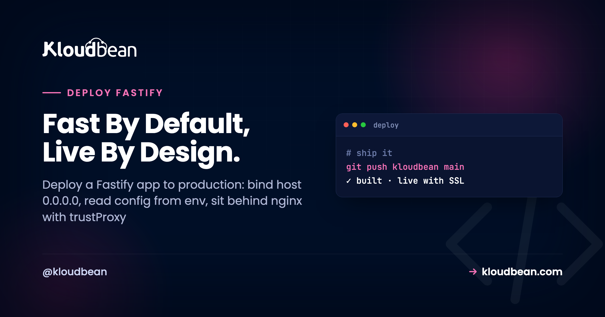

# How to Deploy a Fastify App to Production

By Kloudbean Engineering · Fast By Default, Live By Design.

So you want to deploy a Fastify app to production. Locally it flies. You run `node server.js`, hit `localhost:3000`, the routes answer in single-digit milliseconds, and Fastify earns the name. Then you ship it and get a 502, or the process boots and nothing reaches it. The code is almost never the problem. Fastify in production is a short list of things that differ from a laptop: which host it binds, where config comes from, the proxy in front, keeping the process alive, and closing without dropping requests.

> **How do I deploy a Fastify app to production?** Bind the server with `app.listen({ port: Number(process.env.PORT) || 3000, host: '0.0.0.0' })`, because Fastify defaults to localhost only and that is why it 502s behind a proxy. Read config from `process.env`, set `trustProxy: true` so it behaves behind nginx, keep the built-in pino logger writing JSON to stdout, and handle `SIGTERM` by calling `app.close()`. Then deploy from Git, run it under PM2, wire in a managed database, and attach a domain with free SSL. Most Fastify deploy failures are config, not code.

## The one line that fixes most Fastify deploys

Start with the single most common Fastify production mistake. Fastify does not bind to all network interfaces by default. It binds to `localhost` (`127.0.0.1`) only. That is a deliberate, safe default from the Fastify team, and it is the exact reason your app "works locally" then answers nothing in a container or behind a reverse proxy.

The sequence: your app boots, the log says it is listening, but it is on the loopback address, which only accepts connections from the same machine. The proxy sits one hop away, tries to connect, gets `ECONNREFUSED`, and the browser sees a 502. Nothing crashed. It is just listening where the proxy cannot reach.

```js
// works on your laptop, unreachable behind a proxy or in a container
await app.listen({ port: 3000 })              // binds to 127.0.0.1 only

// reachable by the proxy, health checks, containers
await app.listen({ port: 3000, host: '0.0.0.0' })
```

This is the big difference from Express, and it trips up people moving over. A plain `app.listen(port)` in Express binds to all interfaces. The same instinct in Fastify binds to localhost, so the habit that always worked silently breaks. If you take one thing from this guide, take the host. We cover the Express side in [deploy an Express app](https://www.kloudbean.com/blog/deploy-express-app/), and this default is the reason a Fastify migration surprises people.

*(Diagram: a single request path. A browser sends an HTTPS request on port 443 to a reverse proxy, which terminates TLS and sets X-Forwarded headers, then forwards to a Fastify app. If Fastify is bound to 127.0.0.1 the proxy is refused and the user gets a 502. If Fastify is bound to 0.0.0.0 on the assigned port it is reachable, logs JSON with pino to stdout, closes gracefully on SIGTERM, and talks to a managed database in the same account, over the local network. The fork that decides everything is which host Fastify binds.)*

<!-- ADD IMAGE: a terminal showing the Fastify boot line, Server listening at http://0.0.0.0:3000, proving it is on all interfaces and not just loopback -->

## A production-ready Fastify server, in one file

Here is a Fastify server ready to leave your laptop. It reads its port from the environment, binds all interfaces, trusts the proxy, keeps logging on, and exits loudly if it fails to start. Just the defaults turned production-safe.

```js
// server.js
const Fastify = require('fastify')

const app = Fastify({
  logger: true,        // built-in pino logger, JSON to stdout
  trustProxy: true     // correct req.ip and protocol behind a proxy
})

app.get('/healthz', async () => ({ status: 'ok' }))

const start = async () => {
  try {
    await app.listen({
      port: Number(process.env.PORT) || 3000,
      host: '0.0.0.0'
    })
  } catch (err) {
    app.log.error(err)
    process.exit(1)
  }
}
start()
```

One note on syntax, because tutorials disagree. Modern Fastify (v4 and v5) takes an options object: `listen({ port, host })`. Older guides show the positional `listen(3000, '0.0.0.0')`, which is deprecated. Copy an old snippet and that alone can be why your host setting is ignored.

### Read config from the environment, never hard-code it

Your port, database URL, and API keys belong in `process.env`, read at runtime, not in the repo. A secret committed to Git is a secret in every clone and CI log once it leaks. The `Number(process.env.PORT) || 3000` pattern matters most: production hands you a port and the proxy forwards to it, so grabbing 3000 regardless is how you end up talking past the proxy. The deeper version, with validation, is in [environment variables, done right](https://www.kloudbean.com/blog/environment-variables-done-right/).

### Turn on trustProxy so nginx does not lie to your app

Behind a proxy, every request reaches Fastify from `127.0.0.1`, over plain HTTP, on an internal port. Left alone, Fastify believes exactly that: `request.ip` is the proxy, `request.protocol` is `http`, and an IP-based rate limiter thinks all traffic comes from one address. One option fixes it.

```js
// read the real client IP and protocol from X-Forwarded-* headers
const app = Fastify({ trustProxy: true })
```

With `trustProxy` on, Fastify reads the real client from `X-Forwarded-For` and the real scheme from `X-Forwarded-Proto`. Skip it and you ship secure cookies that will not stick over HTTPS. The why behind the proxy layer, and how to wire it up, is in [nginx as a reverse proxy for Node](https://www.kloudbean.com/blog/nginx-reverse-proxy-for-node/).

### Use the pino logger Fastify already ships with

A genuine Fastify perk: it bundles pino, a fast JSON logger, exposed as `app.log`. No bolting on morgan or winston like a bare Express app. Logging is off by default, so set `logger: true` and it writes structured JSON to stdout, which is what you want in production.

```js
// production: structured JSON to stdout
const app = Fastify({ logger: true })

// development only: pretty, colorized, human-readable
const app = Fastify({
  logger: { transport: { target: 'pino-pretty' } }
})
```

Keep pino-pretty out of production. It is slower, and its whole point is a nicer terminal for a human watching live. In production, raw JSON to stdout is the right call, and the platform captures it.

> **Coming from Express?** Most of your instincts carry over: read the port from env, sit behind a proxy, keep the process alive. Three things differ. Fastify binds to localhost by default (Express binds to all interfaces), Fastify has logging built in, and Fastify sets the proxy through `trustProxy: true` at construction rather than `app.set('trust proxy')`. Learn those three and the rest is the Node deploy you already know.

## Graceful shutdown: close Fastify without dropping requests

Every deploy replaces the running version. The platform sends `SIGTERM`, waits a beat, then starts the new process. Ignore that signal and Fastify gets killed mid-request: in-flight responses drop, the database pool never closes cleanly, a half-finished write stays half-finished. Handle it and a redeploy becomes invisible.

Fastify makes this pleasant. `app.close()` returns a promise, stops accepting new connections, and runs every `onClose` hook you registered. A quiet built-in helps too: while closing, Fastify answers new requests with a 503 by default (the `return503OnClosing` option), so a load balancer routes away from a draining instance instead of hanging.

```js
// close the DB pool (and anything else) when Fastify shuts down
app.addHook('onClose', async () => {
  await pool.end()
})

// drain on SIGTERM / SIGINT, then exit
for (const signal of ['SIGINT', 'SIGTERM']) {
  process.on(signal, async () => {
    app.log.info(`${signal} received, shutting down`)
    await app.close()   // stops new requests, runs onClose hooks
    process.exit(0)
  })
}
```

Register the pool cleanup as an `onClose` hook and it runs whenever the app closes. This turns a redeploy from a burst of failed requests into a clean handover, and it is the app-side half of [zero-downtime deployments](https://www.kloudbean.com/blog/zero-downtime-deployments/).

> **Plugins and boot order.** Fastify loads plugins asynchronously through its `register` and encapsulation model, so a decorator or DB connection added in a plugin is not ready the instant the file runs. Either `await app.ready()` before using it, or just `await app.listen(...)`, which waits for the plugin tree first. If a route throws because `app.db` is undefined at boot, this ordering is usually why.

## Keeping a Fastify app alive with PM2

A Fastify process that runs once and exits is a script, not a service. In production it needs a supervisor that restarts it on a crash and after a reboot. That is PM2. One unhandled exception at 3am becomes a one-second restart instead of an outage nobody noticed until morning.

Node runs on a single thread, so one process uses one core. When one core is not enough, PM2 cluster mode runs a worker per core behind the same port, and Fastify clusters cleanly because it is stateless-friendly.

```bash
# one Fastify worker per CPU core
pm2 start server.js -i max --name my-fastify-api
```

Start single, cluster when your metrics ask. One trap the moment you cluster: anything in process memory stops being shared. An in-memory cache, a local rate limiter, a `Map` of sessions now has one copy per worker, so a user hits worker A and their session lives on worker B. Move that state into managed Redis, and keep uploads in object storage, not the app disk. On choosing a supervisor, we compared the options in [PM2 vs systemd](https://www.kloudbean.com/blog/pm2-vs-systemd/). Founder opinion: most Fastify APIs never need Kubernetes or autoscaling. A right-sized box, then a bigger one, carries you a long way.

<!-- ADD IMAGE: pm2 list output showing the Fastify app online with uptime and restart count -->

## Wiring in a managed database

Most Fastify apps are an API in front of a database, so this matters more than the framework. Move data off any local file before you have users. A SQLite file or a JSON store on the app disk works right up until your first redeploy or your second worker, then it is gone or out of sync. Create a managed engine, take its connection string, and read it from the environment.

```js
const { Pool } = require('pg')

// one shared pool, not a new connection per request
const pool = new Pool({ connectionString: process.env.DATABASE_URL })
```

Two things early. Use a connection pool, because Fastify is fast enough to open sockets faster than the database tolerates, and a handler that dials its own connection per request exhausts the limit under load. And lock the database to your app server's IP, not a public port. The full walkthrough is in [add a managed database to your app](https://www.kloudbean.com/blog/add-managed-database-to-your-app/), and sizing a pool is in [database connection pooling](https://www.kloudbean.com/blog/database-connection-pooling/).

## How to deploy a Fastify app on a managed server

Concepts done. Here is the path on [Kloudbean](https://www.kloudbean.com/), where the reverse proxy, PM2, and SSL come already assembled. Fastify is a Node framework, so it runs on the managed Node runtime like any other Node app.

Click **Add Server**, pick a cloud (Kloudbean runs seven: AWS, Amazon Lightsail, Google Cloud, DigitalOcean, Vultr, Linode, and UpCloud), choose the **Node.js** stack, a region near your users, and a size. 2 GB is a comfortable start for a single API. Running your Fastify API next to a front end or a worker? Add each under **Applications**, **Add Application**. Multiple apps per server is first-class here, not a workaround.


Now connect Git. In **Git Deployment**, link GitHub, paste the repository URL, choose a branch, and clone. Then fill the runtime config, where the earlier decisions become fields:

- **App Directory:** the folder holding your `package.json`.
- **Port:** the port your app reads from `process.env.PORT`. The proxy forwards here, so it must match.
- **Node version:** match what you built on. Node 20+ is a safe default for current Fastify.
- **Install / Build / Start:** usually `npm ci`, an optional build if you use TypeScript, then `node server.js`.

Hit **Pull & Deploy** and the build log streams live, so you watch clone, install, and boot scroll past. Turn on automated deployment and every push ships itself, with the deploy recorded. That is the continuous-deploy loop the big platforms sell, on a box you own, detailed in [CI/CD auto-deploy from GitHub](https://www.kloudbean.com/blog/ci-cd-auto-deploy-from-github/).


<!-- ADD IMAGE: the runtime configuration panel filled in for Fastify, showing App Directory, Port, Node version, and the Install and Start commands -->

Env vars go under **Runtime Configuration, Environment Variables**, with a **Paste .env Content** tab to drop the whole file in at once. A missing variable is the most common reason a Fastify app builds but will not boot, so copy them all. Then add your domain, point DNS at the server, and install a free auto-renewing SSL certificate. The proxy already terminates TLS on 443 and forwards to your Fastify port, so once DNS resolves the API is live over HTTPS.

<!-- ADD IMAGE: the live build log streaming npm ci and the Fastify boot line during a deploy -->

## Fastify vs Express: what differs at deploy time

Both are Node HTTP frameworks and both deploy the same way at a high level: read the port, sit behind a proxy, stay alive under a supervisor. The differences are small but real, and each has bitten someone on a first Fastify deploy.

| Concern | Express | Fastify |
| --- | --- | --- |
| Default listen host | `0.0.0.0` (all interfaces) | `127.0.0.1` (localhost only) |
| Start the server | `app.listen(port, '0.0.0.0')` | `app.listen({ port, host: '0.0.0.0' })` |
| Logging | add morgan or winston | built-in pino, set `logger: true` |
| Trust the proxy | `app.set('trust proxy', 1)` | `trustProxy: true` at construction |
| Plugin boot | synchronous middleware | async register, `await app.ready()` |
| Graceful close | wire `server.close()` yourself | `app.close()` promise plus `onClose` hooks |

Is Fastify worth it? On raw JSON throughput it benchmarks noticeably higher than Express, which is the reputation it earned. Honestly, most real apps are bound by the database, not the framework, so the practical win is smaller than a hello-world benchmark suggests. Pick Fastify for schema validation, the plugin model, and the built-in logger, not for a number on a chart. Deploying a TypeScript framework instead? The compile step is in [deploy a NestJS app](https://www.kloudbean.com/blog/deploy-nestjs-app/).

## A Fastify production checklist

Run this before you call it shipped.

- **Host:** `app.listen({ ..., host: '0.0.0.0' })`. The big one.
- **Port:** from `process.env.PORT`, matching your deploy config.
- **trustProxy:** `true`, so IP, protocol, and secure cookies are correct behind the proxy.
- **Logging:** `logger: true` for JSON to stdout. No pino-pretty in production.
- **Graceful shutdown:** `SIGTERM` calls `app.close()`, with an `onClose` hook that ends the DB pool.
- **Config:** secrets and the database URL in env vars, never in Git.
- **Process manager:** PM2 keeps it alive and restarts on crash.
- **Database:** managed engine, pooled connections, locked to your app server's IP.
- **State:** sessions and cache in Redis, uploads in object storage, if you cluster.
- **TLS:** a domain with auto-renewing SSL, proxy terminating on 443.

## Where Fastify deploys actually break

First deploys break in predictable places. Read the app error log before touching code, because it usually names the cause.

- **Reachable locally, 502 in prod.** Almost always the host. You bound to `127.0.0.1`. Add `host: '0.0.0.0'`.
- **Boots then exits.** A missing env var throws at startup and the supervisor keeps restarting a process that cannot stay up.
- **Wrong port.** The app listens on 3000 while the proxy forwards elsewhere. Read `process.env.PORT` and make the numbers agree.
- **Route throws at boot.** A plugin decorator or DB connection was used before `app.ready()`. Await readiness, or await listen.
- **Redeploys drop requests.** No `SIGTERM` handler, so the old process dies mid-flight. Add the `app.close()` handler above.

Where's the log? In the dashboard, under **Application Administration → Logs Viewer**, split into tabs. **App Errors** is the one you want for a crash: a 503 means the process isn't running, and that tab is where Node's stack trace lands. **App Info** carries the app's informational output, which with `logger: true` is your pino JSON, and **Web Requests Logs** is the web server's access log for every request served. Search is built in, so you can filter to the error instead of scrolling.

The same files sit on disk at a predictable path, for a terminal or the File Manager:

```
/home/admin/hosted-sites/<app_system_user>/app-logs/app.error.log
```

Fix the one thing it names and deploy again. The overwhelming majority of Fastify deploy failures are configuration, not route handlers. So when it breaks, check the host, the port, and the env vars before rereading your business logic. It is faster, and usually right.

## What you own, and what is handled

Kloudbean runs Fastify on Linux managed cloud: the Node runtime, PM2, the reverse proxy, SSL, and backups are maintained on whichever of the seven clouds you pick. It is Linux stacks, not Windows or .NET, and Fastify is a Node framework, so it fits cleanly. "Managed" means the platform keeps the server and stack healthy while you own the app: your routes, your data, your config. It is a standard Linux box running standard Node, so you can move hosts anytime, with no per-app tax as you add more.

---

**Your Fastify API, live on a server you own.** Deploy from Git, let PM2 keep it up, wire in a managed database, and get free auto-renewing SSL, without hand-rolling a proxy config. Start at [kloudbean.com](https://www.kloudbean.com/); sizes and plans (from $8/mo, Enterprise custom) are on [pricing](https://www.kloudbean.com/pricing/).

Seven clouds, one dashboard · Git deploy with live logs · PM2 process management · Seven managed databases · Free auto-renewing SSL · Free migration · Free trial

## FAQ

**How do I deploy a Fastify app to production?**
Bind the server to host 0.0.0.0 on the port from process.env.PORT, set trustProxy so it behaves behind a proxy, keep the built-in pino logger writing JSON to stdout, and handle SIGTERM by calling app.close(). Then push to GitHub, launch a managed Node server, deploy from the repo with your install and start commands, add env vars and a managed database, and point a domain with SSL. PM2 keeps the process alive and the reverse proxy sends HTTPS traffic to it.

**Why is my Fastify app unreachable or 502 in production?**
The usual cause is the host. Fastify binds to 127.0.0.1 by default, so behind a proxy or in a container the proxy cannot reach it and you get a 502 with no crash. Change the listen call to include host 0.0.0.0. If that is not it, check for a missing env var that throws on boot or a port mismatch between your app and the deploy config.

**What host should Fastify listen on in production?**
Listen on 0.0.0.0 so the server accepts connections on all interfaces, which is what a reverse proxy, a container network, and health checks need. Fastify defaults to localhost only, which is safe locally but unreachable once anything else has to connect. Use app.listen with port and host 0.0.0.0 together.

**Fastify vs Express: which is better for production?**
Both deploy the same way at a high level, so the choice is about the framework, not hosting. Fastify benchmarks higher on raw JSON throughput and ships schema validation and a pino logger built in, while Express has the larger ecosystem and more tutorials. Most real apps are database-bound, so the throughput gap matters less than the developer experience. The one deploy difference to remember is that Fastify binds to localhost by default and Express binds to all interfaces.

**How do I run Fastify behind nginx?**
Have nginx terminate TLS on 443 and forward to the port your Fastify app listens on, then set trustProxy true when you construct Fastify. That makes request.ip and request.protocol reflect the real client from the X-Forwarded headers instead of the proxy. On managed hosting the proxy is already configured, so you mainly set trustProxy and read the assigned port from the environment.

**How do I do a graceful shutdown in Fastify?**
Listen for SIGTERM and SIGINT and call app.close(), which stops accepting new connections and runs your onClose hooks. Register an onClose hook to end the database pool so nothing is left open. Fastify also answers new requests with a 503 while it is closing by default, so a load balancer can route away from a draining instance. This is what makes redeploys invisible instead of dropping in-flight requests.

**Do I need PM2 to run Fastify?**
You need some supervisor so the app restarts on a crash and comes back after a reboot, and PM2 is the common choice for Node. It also runs cluster mode, one worker per CPU core behind the same port, which Fastify handles cleanly because it is stateless-friendly. On Kloudbean PM2 is part of the managed stack, so you do not install or babysit it.

**How do I read environment variables in Fastify?**
Read them straight from process.env at runtime, for example Number(process.env.PORT) for the port and process.env.DATABASE_URL for the database. Keep a local .env file for development and out of Git, and set the same keys as real environment variables on the server in production. The code does not change, only where the values come from.

**How do I set up logging in Fastify for production?**
Fastify ships with the pino logger, so set logger true when you create the instance and it writes structured JSON to stdout. Let the platform collect stdout rather than writing your own log files, then read it from Application Administration then Logs Viewer, where App Info holds that output and App Errors holds crashes. Keep pino-pretty for local development only, because it is slower and exists to make logs readable for a human watching a terminal.

**Do I need Docker to deploy a Fastify app?**
No. A single Fastify app is one Node process, and a managed server runs it directly, restarts it on crash, and puts it behind a proxy with SSL. Docker and Kubernetes solve orchestration across many services at scale. For shipping one API they are extra moving parts you do not need yet.

---

Kloudbean · Bind the host, trust the proxy, close gracefully, and own the box it runs on.
