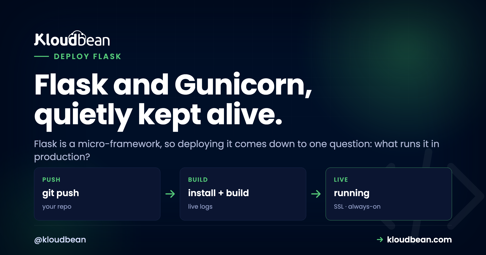

# Deploy Flask in 10 Minutes: Then the Reference You'll Keep

Flask is a micro-framework. It hands you just enough to build a web app and then gets out of your way. If you are still at the stage of staring at [the localhost URL in your terminal](https://www.kloudbean.com/blog/what-is-127-0-0-1-5000/) and wondering why nobody else can open it, start there. That minimalism is a joy while you build, and it leaves one honest question when it's time to deploy a Flask app for real: *what actually runs it?* The command you've been using won't do. Flask itself tells you so, right there in the terminal.

Run `flask run` and it prints a warning in plain English: this is a development server, don't use it in a production deployment, use a production WSGI server instead. That's the whole article in one line. The production WSGI server is **Gunicorn**. Below is the fast path to live, then a reference you'll come back to.

> **The short version.** Add `gunicorn` to `requirements.txt`, then start your Flask app with `gunicorn app:app --bind 0.0.0.0:$PORT` instead of `flask run`. Gunicorn runs a master process plus several sync workers, so it handles real concurrent traffic and restarts a worker if one dies. Bind the port the platform assigns, set your secrets as env vars, and you're done.

## Why the built-in server can't take real traffic

The server behind `flask run` is Werkzeug's development server. It's built for one job: fast feedback while you code, with the auto-reloader and a friendly debugger. It's not built to sit on the public internet. It handles concurrency poorly, it has no process supervision, and running it with `debug=True` exposes an interactive debugger that lets a visitor execute Python on your box. That last part isn't a style nit, it's a genuine remote-code-execution hole.

So my opinion is easy here: Flask's own warning is correct, so don't argue with it. Put Gunicorn in front and move on. Gunicorn is a real WSGI server. It runs a master process that binds the port and supervises a pool of worker processes, and each worker runs your app. That's what turns "it works on my machine" into something that survives strangers hitting it.

*(Diagram: Gunicorn's model. Incoming requests hit one Gunicorn master process bound to `0.0.0.0:$PORT`. The master supervises four worker processes, each handling one request at a time. Worker 3 has crashed, and the master respawns it. 4 workers = 4 requests at once; one worker = one request at a time, the classic bottleneck. On managed cloud the master is kept alive for you and a web server terminates HTTPS in front.)*

## Deploy a Flask app in 10 minutes

Assume you have an `app.py` that defines `app = Flask(__name__)` and a `requirements.txt`. Here's the whole path on [Kloudbean](https://www.kloudbean.com/):

1. **Add Gunicorn** to `requirements.txt` (one line: `gunicorn`). It's the only new dependency deploying adds.
2. **Push** the project to GitHub.
3. **Provision a small server.** Flask apps are light, so a modest box is plenty. Pick one of seven clouds and a size, and launch.
4. **Connect the repo** under Deploy Code, and set **Install** to `pip install -r requirements.txt`.
5. **Set the Start command** to `gunicorn app:app --bind 0.0.0.0:$PORT`. (What `app:app` means is two sections down.)
6. **Paste your environment variables**: `SECRET_KEY`, any API keys, a database URL if you have one.
7. **Pull & Deploy.** The platform installs your dependencies, starts Gunicorn, gives you a domain, and puts free HTTPS in front.


A basic Flask app really is a few-minutes deploy, because there's so little to it. The start command is the one line that matters:


## Reference: what `app:app` (or `wsgi:app`) means

The start command `gunicorn app:app` looks cryptic, but it's just two names split by a colon: `module:callable`. The first part is the module (the file `app.py`, minus the `.py`). The second is the WSGI object inside it. You wrote `app = Flask(__name__)`, so the object is `app`. Larger projects use the **app factory** pattern, where a function builds the app. Then you expose it in a small `wsgi.py` and point Gunicorn at that instead.

```python
# app.py (simple): the Flask object lives right here
app = Flask(__name__)
# start command:  gunicorn app:app --bind 0.0.0.0:$PORT

# wsgi.py (app factory): build the app, then expose it as "app"
from myapp import create_app
app = create_app()
# start command:  gunicorn wsgi:app --bind 0.0.0.0:$PORT
```

That's the whole rule: `gunicorn <file>:<object>`. Get it wrong and Gunicorn says it can't find your application object. Now you know exactly why, and exactly what to change.

## Reference: how many Gunicorn workers?

Gunicorn runs your app in several **worker** processes so it can handle more than one request at once. The well-worn starting formula is **(2 × CPU cores) + 1**: on a 1-core box that's 3 workers, on 2 cores it's 5. You set it with a flag, and you can add a timeout or threads while you're there:

| You want | Start command |
|---|---|
| Simple default | `gunicorn app:app --bind 0.0.0.0:$PORT` |
| Set worker count | `gunicorn app:app --workers 3 --bind 0.0.0.0:$PORT` |
| Add a timeout | `gunicorn app:app --workers 3 --timeout 60 --bind 0.0.0.0:$PORT` |
| Threads per worker | `gunicorn app:app --workers 3 --threads 2 --bind 0.0.0.0:$PORT` |

Two failure modes sit at the extremes. Leave it at a single worker and every request queues behind the one before it, which is the bottleneck the diagram warns about, and the app feels slow for no obvious reason. Crank it to 50 and each worker's own memory footprint adds up until a small box thrashes and slows down anyway. Start with the formula, watch memory, adjust from there. Reach for `--timeout` only if you have slow endpoints Gunicorn keeps killing at its default 30 seconds.

## Reference: never `flask run` in production

Worth stating flatly, because it's the number-one Flask deploy mistake: don't ship `flask run` or `app.run()` to production. Both start the development server, and `debug=True` hands visitors a debugger that runs code on your server. In production, Gunicorn is the server and debug is off. Set `FLASK_DEBUG=0` or simply don't enable it, and let Gunicorn do the serving. The moment you catch yourself thinking "I'll just run it the way I do locally," that's the mistake.

## Reference: static files, secrets, and a database

Three quick pieces that cover most real Flask apps:

- **Static files.** Files in your `static/` folder work as-is, but for production it's nicer to let something purpose-built serve them. **WhiteNoise** is the least-effort win: `pip install whitenoise`, wrap your app, and it serves static assets efficiently with caching, no extra config.
- **Secrets and config.** Flask's `SECRET_KEY` signs sessions, so set it as an environment variable and keep it stable. Change it between deploys and you log everyone out. API keys and database URLs live in the environment too, never in the repo. The full reasoning is in [environment variables, done right](https://www.kloudbean.com/blog/environment-variables-done-right/).
- **A database.** Flask ships without one on purpose. If your app stores data, launch a [managed Postgres or MySQL](https://www.kloudbean.com/blog/add-managed-database-to-your-app/) and connect with a URL you set as an env var. Your code (via SQLAlchemy or a driver) reads it and connects. Running it on the same box is covered in [host your app, API, and database on one server](https://www.kloudbean.com/blog/host-app-api-and-database-on-one-server/).


## Reference: when it won't start

Most first-deploy failures fall into a short list, and each has a clear tell in the logs:

- **"Failed to find application object" / "No module named app".** Your Start command doesn't match your file or variable. Fix the `module:object` part.
- **App starts but the URL times out.** You bound a fixed port instead of `$PORT`. This is the one we see most: someone keeps `app.run(port=5000)` or hard-codes `:5000` in the bind, the platform's router can't reach it, and the page just hangs. Bind `0.0.0.0:$PORT` and it's gone.
- **"ModuleNotFoundError" for a package you use.** It's missing from `requirements.txt`. Add it and redeploy; the build installs only what's listed.
- **"WORKER TIMEOUT", workers being killed.** A slow request is exceeding Gunicorn's default 30-second limit. Raise `--timeout`, or move the slow work to a background task.

Every one of those tells shows up in the log, and you read it from the dashboard: **Application Administration → Logs Viewer**. The logs are grouped into tabs. **App Errors** is where Gunicorn's tracebacks and worker-timeout lines land, so it's the first tab to open on a 503, because a 503 means the app isn't running. **App Info** holds the app's informational output, the "Starting gunicorn" and "Booting worker" lines included, and **Web Requests Logs** is the access log for requests the web server handled. Search is built in, which is how you find one `ModuleNotFoundError` without reading a whole file. Deploy-time failures are kept separately in **Build and Deployment History**, streaming live as the build runs. The same two files are on disk at `/home/admin/hosted-sites/<app_system_user>/app-logs/` (`app.error.log` and `app.info.log`) if you'd rather use a terminal or the File Manager. Read the log first, before changing code on a hunch. The full 503 playbook is [here](https://www.kloudbean.com/blog/fix-503-after-deploying-your-app/).

<!-- ADD IMAGE: Terminal showing Gunicorn's boot log: "Starting gunicorn", the bound address, and Booting worker lines for each worker PID. -->

## What you own, what Kloudbean runs

Flask runs on Python, and Python is right at home on a Linux server, so nothing here is a workaround. Kloudbean runs the box: it keeps Gunicorn's master alive and restarts it if it ever exits, terminates HTTPS in front, and takes server-level backups. You own the Flask app, its worker count, its secrets, and its data. Because Flask asks so little of a server, it's one of the cheapest things to run well; a small box carries it comfortably. Building an async API instead of a classic app? That's [deploy a FastAPI app](https://www.kloudbean.com/blog/deploy-fastapi-app/). Something bigger and batteries-included? [Deploy a Django app](https://www.kloudbean.com/blog/deploy-django-app/).

**A micro-framework deserves a quick deploy.** Deploy your Flask app with Gunicorn out front at [kloudbean.com](https://www.kloudbean.com/). Git deploy · Managed Postgres · Free Let's Encrypt SSL · A small server is plenty · Free migration · Free trial. Sizes on [pricing](https://www.kloudbean.com/pricing/).

## FAQ

**How do I deploy a Flask app to production?**
Add `gunicorn` to `requirements.txt`, push to GitHub, connect the repo, set Install to `pip install -r requirements.txt` and Start to `gunicorn app:app --bind 0.0.0.0:$PORT`, add your environment variables, and deploy. The platform serves it over HTTPS.

**What does `app:app` mean in the Gunicorn command?**
It's `module:object`. The first `app` is your `app.py` file; the second is the Flask object inside it (`app = Flask(__name__)`). If your file or variable is named differently, adjust it, for example `wsgi:app` for an app factory exposed in `wsgi.py`.

**What's the app factory pattern, and how do I run it with Gunicorn?**
An app factory is a `create_app()` function that builds and returns the Flask app. Expose the result in a small `wsgi.py` (`app = create_app()`) and start it with `gunicorn wsgi:app --bind 0.0.0.0:$PORT`. Gunicorn just needs a module and a WSGI callable to import.

**Why shouldn't I use `flask run` in production?**
`flask run` is a single-threaded development server not built for real traffic, and it even prints a warning saying so. Running with `debug=True` exposes a debugger that lets visitors execute code on your server. Use Gunicorn as the production server and keep debug off.

**How many Gunicorn workers should I use?**
A common starting point is (2 × CPU cores) + 1, so 3 workers on a 1-core server. Set it with `--workers`. Start there for a small app and increase only when real traffic calls for it. One worker means one request at a time, which is the usual cause of a Flask app feeling slow.

**Why does my Flask app deploy but the URL just hangs?**
Almost always because it bound a hard-coded port instead of the one the platform assigned. Bind `0.0.0.0:$PORT` in the Gunicorn command so the web server in front can reach it. A fixed port like 5000 leaves the router talking to nothing.

**Does Flask need a database?**
Only if your app stores data. Flask ships without one by design. If you need persistence, launch a managed Postgres or MySQL and connect with a connection string set as an environment variable.
