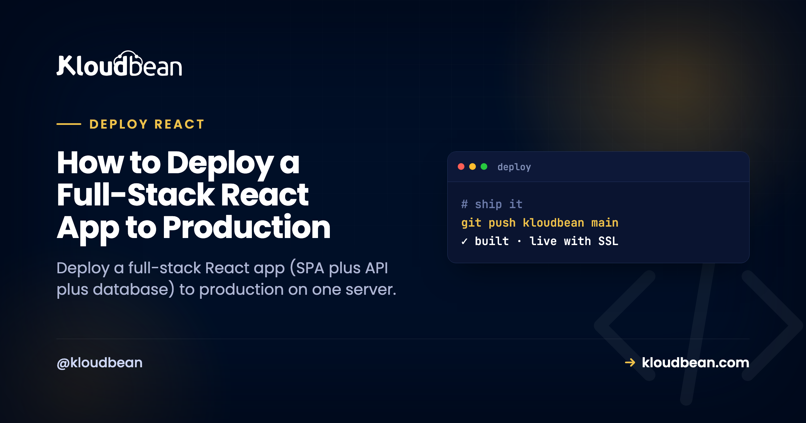

# How to Deploy a Full-Stack React App to Production

A full-stack React app is three parts: a React SPA (built with Vite or Create React App), a Node API that serves data, and a database. Deploying a full-stack React app to production isn't hard, but there's a real architecture decision hiding in it that nobody warns you about. Do you serve the built SPA from the same Node process that runs your API, or split them into two apps? That one choice shapes your domains, your CORS, and how many things you deploy. Let's make it deliberately.

And then there's the bug. The one that ships fine, works in every click-through, and 404s the first time a user refreshes the page. We'll kill that one for good.

> **The short version.** To deploy a full-stack React app, decide first: one process (your Node/Express server serves the built SPA *and* the `/api` routes, one domain, no CORS) or two apps (static SPA on `app.`, API on `api.`, sharing a database). Default to one process. Then fix the two SPA gotchas: a catch-all route so refreshing an inner page doesn't 404, and an API base URL that's relative or env-configured, never hard-coded to localhost.

## The decision: one process, or two?

Full-stack React usually gets deployed the scattered way by habit: SPA on a static host, API as serverless functions, database on a third service. Three bills, three dashboards, three things to reason about, and CORS gluing it together. For a product still finding its users, that's more moving parts than the app deserves. Both of the arrangements below put everything on one server you own, which is simpler to hold in your head and cheaper to run.

| | One process (recommended) | Two apps |
| --- | --- | --- |
| How it runs | Express serves the SPA build *and* `/api` | Static SPA + a separate API app |
| Domains | One origin, e.g. `yourapp.com` | `app.yourapp.com` + `api.yourapp.com` |
| CORS | None. Same origin. | Required, since the browser calls another origin |
| Deploys | One build, one start command | Two apps to build and run |
| Best when | Most apps, especially early | Separate teams, or you scale the SPA and API very differently |

My recommendation is unambiguous: default to one process. Serve the SPA from the same Express server that runs your API. You get one origin (so CORS never enters your life), one thing to deploy, and one place to look when something breaks. Split into two apps only when something concrete forces it, like separate teams owning the front end and back end, or wanting to scale them independently. Reaching for two apps on day one is the most common over-engineering I see in full-stack React, and it buys complexity you don't need yet.

*(Diagram: Option A, one process, has the browser load the SPA from yourapp.com, and that single Node process serves both the static SPA files and the /api routes, with the database on the same box. Same origin, so no CORS. Option B splits the SPA onto app.yourapp.com and the API onto api.yourapp.com, both on the same server sharing one database; the browser's cross-origin call now needs CORS.)*

## The one process shape, in code

If you go with one process (you should, to start), your Express server does three jobs in a specific order. Serve the static build. Handle `/api`. And for anything else, hand back `index.html` so React's router can take over. That order matters, and the last line is the fix for the bug in the next section.

```js
const express = require("express");
const path = require("path");
const app = express();

// 1. your API routes first
app.use("/api", apiRouter);

// 2. the built SPA (Vite: "dist", CRA: "build")
app.use(express.static(path.join(__dirname, "dist")));

// 3. catch-all: send index.html so client routing works
app.get("*", (req, res) =>
  res.sendFile(path.join(__dirname, "dist", "index.html"))
);

app.listen(process.env.PORT || 3000);
```

One process, one port, one origin. The SPA and the API share a domain, so the browser never makes a cross-origin call and CORS simply never comes up. That's the quiet luxury of this shape.

## The SPA gotcha that 404s on refresh

This is the bug that catches nearly everyone deploying a React SPA for the first time, and it's worth understanding, not just pasting a fix for.

A single-page app does its own routing in the browser. You click to `/dashboard` and React swaps the view without asking the server for anything. Feels great. But when a user **refreshes** on `/dashboard`, or pastes that link fresh, the browser does ask the server for `/dashboard`. And your server has no such route, because that path only ever existed in the browser. So it returns a 404. Your app looks broken, but only on refresh, which is why it sails through your click-testing and then breaks for a real user on day one.

The fix is that catch-all route above, sometimes called the SPA fallback or history-mode fallback. After your API and static files, any request the server doesn't recognize gets `index.html`. The SPA loads, reads the URL, and renders the right view. Order is everything: put the catch-all last, or it swallows your `/api` calls and hands them HTML too, which produces a different confusing bug (your data calls start returning your homepage). If you take the two-app path with a static SPA, you configure the same fallback on the static host instead of in Express.

> **Coming from a starter template?** A lot of Vite and CRA starters run the SPA and API as two dev servers with a proxy, which hides this entirely in development. The refresh-404 only appears once you deploy for real. If your app "works locally but 404s in production on refresh," this is almost always why.

<!-- ADD IMAGE: Browser on /dashboard showing a 404 after refresh, next to the same page working once the catch-all route is added. -->

## The other gotcha: where your API lives

The second thing that trips deploys is how the front end addresses the API. In development it's common to hard-code `http://localhost:3001`, and that string is worthless in production because the visitor's browser has no localhost server. The pages load, but every data call fails, and the app looks half-alive.

With the one-process shape this is easy: call **relative paths** like `/api/things`. They resolve to the same origin automatically, in dev and in production, with no config. If you must use an absolute base URL (you're splitting the apps, say), read it from a build-time variable:

```js
// relative is simplest for one process
fetch("/api/things");

// or an env-driven base URL for the split shape
const base = import.meta.env.VITE_API_URL ?? "";
fetch(`${base}/api/things`);
```

Which brings up the React-specific env var rule. Anything the browser reads is baked into the bundle at build time, and it's public. Vite exposes only variables prefixed `VITE_`; Create React App uses `REACT_APP_`. Two consequences. First, never put a secret behind those prefixes, since it ends up in the JavaScript any user can read. Second, if you set a `VITE_` value after the build already ran, it won't take effect until you rebuild. Your API keys and database URL stay unprefixed and server-side. The full model is in [environment variables, done right](https://www.kloudbean.com/blog/environment-variables-done-right/).

## Deploy your full-stack React app to production

Now the deploy, which is short once the two gotchas are handled. Here's the path on [Kloudbean](https://www.kloudbean.com/).

Click **Add Server**, pick a **Cloud Provider** (AWS, Lightsail, GCP, Linode, Vultr, DigitalOcean, or UpCloud), choose **Node.js**, pick the nearest datacenter, and give it 2-4 GB for the front-end build. **Launch Now** has a ready stack in a few minutes.

Open the app, go to **Application Administration → Deploy Code**, connect GitHub, paste the repo URL, pick the branch, and **Clone Repository**. Set the runtime:

- **App Directory:** where your server's `package.json` lives.
- **Port:** your API server listens on `process.env.PORT`.
- **Node Version:** Node 20+.
- **Install / Build / Start:** install, then a Build that compiles the React front end (for example `npm run build`, producing `dist` or `build`), then a Start that runs the server which serves that bundle and the API.


Hit **Pull & Deploy** and watch the log. Then launch the database from **DBS → Launch Database**: a managed Postgres or MySQL (six engines are available), on the same box, backed up, reached over the local network in a fraction of a millisecond instead of across the internet. Connect your API to it with an environment variable and run migrations as part of the build so the tables exist on first boot.


Set your variables under **Runtime Configuration → Environment Variables** with the **Paste .env Content** tab (unprefixed secrets for the API, `VITE_`/`REACT_APP_` for anything the browser needs at build). Add your domain under **Domain Aliases**, install free **Let's Encrypt** SSL, and turn on **automated deployment** so each push rebuilds the SPA and ships. Full picture of the stack on one box: [host your app, API, and database on one server](https://www.kloudbean.com/blog/host-app-api-and-database-on-one-server/).

### If you took the two-app path

Splitting on purpose? Add the second app from **Applications → Add Application** on the same server, put the API on `api.yourapp.com` and the SPA on `app.yourapp.com`, and point both at the shared database. Now you do need CORS: your API must send `Access-Control-Allow-Origin` for your SPA's origin, or the browser blocks every call. This is the tax for splitting, and it's the main reason one process is the easier default. Stacking apps on one box is covered in [hosting multiple apps on one server](https://www.kloudbean.com/blog/host-multiple-apps-one-server/).


## Two different failures, two different fixes

When a full-stack React deploy misbehaves, the symptom tells you where to look, so don't confuse the two.

- **A 503, nothing loads.** The API process didn't come up. Usual causes: not listening on `process.env.PORT`, a missing environment variable (often the database URL), or a Start command that doesn't launch the server. Read `app.error.log` at `/home/admin/hosted-sites/<app_system_user>/app-logs`. Details in [fixing a 503](https://www.kloudbean.com/blog/fix-503-after-deploying-your-app/).
- **The page loads but data fails, or refresh 404s.** That's not a 503 and not a server crash. It's the API base URL (still pointing at localhost) or a missing catch-all route. Both are the SPA gotchas above.

## The honest note on SEO

One thing specific to a client-rendered SPA: because the browser renders it, the initial HTML is close to empty, so it isn't server-rendered for SEO the way a Next.js page is. For app-style products, behind a login or where SEO isn't the point, that's completely fine and this setup is ideal. If search visibility of public content pages matters, server-render or pre-render those pages. That's a framework decision, not a hosting one, and a server runs a client-rendered or a server-rendered React app equally well. If SEO is central to your project, the [Next.js self-host guide](https://www.kloudbean.com/blog/deploy-nextjs-app-to-your-own-server/) covers the server-rendered path.

The rest is the usual boundary. Kloudbean runs this as a Node app on Linux, not Windows or .NET. "Managed" means the server, stack, SSL, and backups are handled; you own the app and its data, and can move hosts whenever, because it's a standard Linux box. If an AI tool generated your app, the tool-agnostic version is the [deploy an AI-built app](https://www.kloudbean.com/blog/deploy-ai-built-app-to-production/) guide.

Deploy your full-stack React app at [kloudbean.com](https://www.kloudbean.com/) with a free trial and your first migration done for you. Prefer to keep the API and database close? See [adding a managed database to your app](https://www.kloudbean.com/blog/add-managed-database-to-your-app/). Server sizes are on [pricing](https://www.kloudbean.com/pricing/).

## FAQ

**How do I deploy a React front end and Node API together?**
The simplest way is one process on one server: build the React SPA to static files and run your Node/Express API as the process that serves both those files and the `/api` routes. Deploy from your GitHub repo in Deploy Code, add a managed database, set environment variables, and point your domain. One server holds the whole stack.

**Should I serve my React app and API from one process or two?**
Default to one process. Serving the SPA from the same Express server as your API gives you a single origin (no CORS), one thing to deploy, and one place to debug. Split into two apps only when separate teams own each side, or you need to scale the front end and API very differently.

**Why does my React app 404 when I refresh on an inner page?**
Because that route only exists in the browser, and the server has no matching path. Add a catch-all route so the server returns `index.html` for any non-API, non-static request; the SPA then loads and its router handles the path. Put the catch-all after your API and static routes, never before.

**My pages load but the API calls fail. Why?**
Usually the front end is calling a hard-coded `localhost` URL left from development, or a missing base-URL variable. In production, call relative paths like `/api/...` (easiest with one process) or set the base URL via a `VITE_` or `REACT_APP_` variable to your real origin.

**Do I need to deal with CORS?**
Only if you split the SPA and API onto different origins. With one process serving both from the same domain, there's no cross-origin call, so CORS never comes up. That's a big reason to prefer the single-process shape until you have a concrete reason to split.

**Where do the front-end and API environment variables go?**
All on the server, in Runtime Configuration. API secrets like the database URL and keys are unprefixed and server-side. Front-end values use the `VITE_` or `REACT_APP_` prefix and get baked into the public bundle at build time, so never put a secret in a prefixed variable.

**Is a client-rendered React app bad for SEO?**
For app-style products behind a login, or where SEO isn't the priority, it's fine. If search visibility of content pages matters, server-render or pre-render those pages. That's a framework choice, and a managed server runs a client-rendered or server-rendered app equally well.
