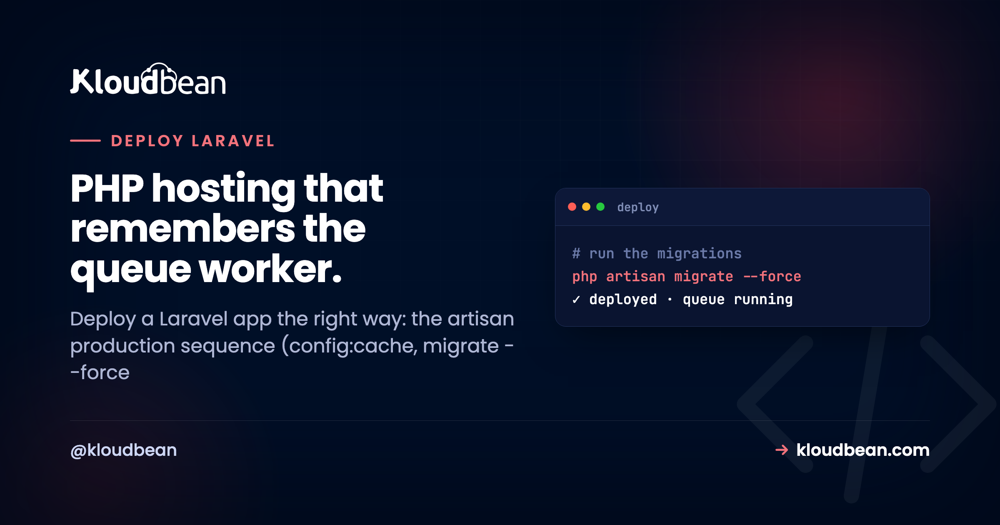

# Deploy a Laravel App the Right Way (Queues and All)

So you're ready to deploy a Laravel app to production. The tricky part isn't the web page. It's that a real Laravel app is rarely one process. It's usually three running side by side: the web app served by PHP-FPM, a **queue worker** grinding through background jobs, and a **scheduler** firing tasks on a timer.

Get the site live and forget the other two, and the bugs are quiet ones. Password-reset emails never arrive. That CSV export spins forever. The nightly cleanup job just doesn't run, and nobody notices for a week. This guide walks the whole deploy, the artisan production sequence included, so all three come up together.

> **Short version.** Set your `.env` on the server (`APP_KEY`, `APP_ENV=production`, `APP_DEBUG=false`, DB creds). On every deploy run `composer install --no-dev`, build assets, `php artisan migrate --force`, then cache config, routes and views, and `php artisan storage:link`. PHP-FPM serves the app, never `artisan serve`. And run `php artisan queue:restart` so your workers actually pick up the new code.

## Laravel isn't one process. It's usually three.

This is the mental model that makes every other decision obvious. Your browser talks to a web server, which hands PHP requests to PHP-FPM, which runs Laravel. That's the part you see. But `Mail::queue()`, `dispatch()`, and every `->daily()` in your scheduler don't run in that web request. They run in two separate long-lived processes. If those processes aren't started (and kept alive), the code that depends on them silently does nothing.

*(Diagram: one Laravel codebase, three processes in production. The web process is PHP-FPM behind the web server, serving your pages and API over HTTPS. The queue worker runs `php artisan queue:work` for email, exports, image processing and slow API calls. The scheduler is a single cron entry running `php artisan schedule:run` for nightly and hourly tasks. All three share the same managed MySQL (your data) and managed Redis (queue, cache, sessions). On every deploy you run composer install, migrate --force, config:cache, route:cache and view:cache, then `php artisan queue:restart`, or the worker keeps running the old code.)*

## The Laravel deploy sequence: what runs, and why

Here's the part generic PHP tutorials wave past. A production Laravel deploy runs a specific set of artisan and Composer commands, in order, every single time. Each one exists for a reason, and each has a failure mode if you skip it. This table is the checklist most guides don't give you.

| Command | What it does | Skip it and… |
| --- | --- | --- |
| `composer install --no-dev --optimize-autoloader` | Installs PHP deps without dev tooling, builds a fast classmap | Dev packages on prod, slower autoloading, or class-not-found errors |
| `npm ci && npm run build` | Compiles your Vite assets (CSS and JS) | Unstyled pages and missing front-end JS |
| `php artisan migrate --force` | Applies schema changes (the `--force` skips the prod confirm prompt) | A 500 the moment code touches a column that isn't there yet |
| `php artisan config:cache` | Merges all config into one cached file | Slower boot, and stale env reads if you cache wrong (see below) |
| `php artisan route:cache` | Compiles routes into a single fast lookup | Slower routing on every request |
| `php artisan view:cache` | Precompiles your Blade templates | First hit on each view compiles on demand |
| `php artisan storage:link` | Symlinks `storage/app/public` into `public/` | Uploaded files return 404 |
| `php artisan queue:restart` | Tells running workers to exit so they reload new code | Workers keep executing the code from *before* your deploy |

An opinion, plainly: in production you should cache config, routes and views, and you should never ship with `APP_DEBUG=true`. The caches are close to free speed, and the payoff shows up under load. Debug mode is the opposite of free. Leave it on and an unhandled error renders a Whoops page with your stack trace, parts of your config, even snippets of environment values, to whoever tripped it. Treat a live Laravel site running with debug on as an incident, not a tidy-up.

```bash
# the deploy commands, in order (Build step on a managed host)
composer install --no-dev --optimize-autoloader
npm ci && npm run build
php artisan migrate --force
php artisan config:cache && php artisan route:cache && php artisan view:cache
php artisan storage:link
php artisan queue:restart   # so workers pick up the code you just shipped
```

One catch on `config:cache` that bites people: once config is cached, Laravel stops reading `.env` at runtime and reads the cached values instead. So any code calling `env()` outside a config file returns null in production. Keep `env()` calls inside `config/*.php`, reference them with `config('services.foo')`, and this never surprises you.

## The .env, and the one key that breaks sessions

Laravel reads its config from environment variables, and there's one that catches nearly every first deploy: **`APP_KEY`**. It's the key Laravel uses to encrypt sessions and signed cookies. Miss it and the app throws on boot. Change it after launch and every logged-in user gets silently kicked, because their session cookie can no longer be decrypted. Generate it once with `php artisan key:generate`, then leave it alone.

Set your variables on the server, never in the repo. On [Kloudbean](https://www.kloudbean.com/) you paste your whole `.env` under Runtime Configuration, so secrets live on the box and you can rotate them without a code change.

```bash
# the production .env essentials
APP_ENV=production
APP_DEBUG=false
APP_KEY=base64:...            # from php artisan key:generate
APP_URL=https://yourdomain.com

DB_CONNECTION=mysql
DB_HOST=127.0.0.1
DB_DATABASE=myapp
DB_USERNAME=myapp
DB_PASSWORD=...

QUEUE_CONNECTION=redis        # so queue:work has real jobs to pull
CACHE_STORE=redis
SESSION_DRIVER=redis
```


The why behind keeping secrets out of git, and the mistakes people make with it, is in [environment variables, done right](https://www.kloudbean.com/blog/environment-variables-done-right/).

## Wiring the Laravel deploy on a managed server

Laravel is a first-class managed app type here, so you're deploying onto a PHP stack that already exists rather than installing PHP-FPM by hand. That's a big reason so many hosts fight over the "best Laravel hosting" spot: the boring server work is done and you just ship code. Connect your repo under **Application Administration → Deploy Code → Git Deployment** and drop the sequence above into the Build field. The Start side is PHP-FPM, already serving `public/index.php`.


Push once to wire it up, then turn on auto-deploy and every push re-runs the build and restarts your workers. If you want to rehearse a risky migration first, Laravel supports **staging** here too, so you can deploy to a copy, watch it, then promote. More on the push-to-deploy loop in [CI/CD auto-deploy from GitHub](https://www.kloudbean.com/blog/ci-cd-auto-deploy-from-github/).

## Don't use `artisan serve` in production

On your laptop you run `php artisan serve`. In production, don't. It's a single-process development server that was never meant for real traffic. Your live app is served by PHP-FPM behind the web server, with the web root pointed at Laravel's `public/` directory so requests flow through `index.php`. On a managed PHP server that's the default wiring, so it's already handled. You don't touch it.

## The queue worker that keeps running your old code

This is the one I'd put a sticky note on your monitor for. Here's a pattern we see constantly: someone finds a bug in a queued job, fixes it, deploys, and swears the bug is *still there*. And it is, sort of. A queue worker is a long-lived PHP process. It boots your app once and holds it in memory, then chews through jobs. When you deploy new code, that running worker doesn't know. It keeps executing the version it loaded at boot, bug and all, until it's told to stop.

The fix is one command in your deploy: `php artisan queue:restart`. It doesn't kill workers midway through a job. It signals them to finish the current job and exit gracefully, and your process manager starts a fresh one that loads the new code. That's why `queue:restart` is the last line of the sequence above. Forget it and you'll debug a ghost.

The worker itself runs as a persistent background process, kept alive by the server's process manager so it restarts if it ever dies. No worker means jobs pile up in the queue, unprocessed, and you find out when a customer asks where their receipt went.

<!-- ADD IMAGE: The queue worker running: a terminal showing php artisan queue:work processing jobs, or Laravel Horizon's dashboard with active workers. -->

## The scheduler is one cron line

Laravel's scheduler, all those `->daily()` and `->everyFiveMinutes()` tasks in your app, is driven by a single cron entry that runs `php artisan schedule:run` once a minute. Laravel decides internally what's actually due. Add the one line and you're done. Skip it and none of your scheduled tasks ever fire, which is a genuinely confusing silence the first time.

```bash
# one cron entry, every minute, drives the entire Laravel scheduler
* * * * * cd /path/to/app && php artisan schedule:run >> /dev/null 2>&1
```

You can add this from the dashboard's cron jobs screen, no SSH required.

## Sessions, cache, and uploads: decide these on day one

Three config choices are cheap now and painful to change later. Sort them before launch.

- **Sessions and cache.** The file drivers work on a single server. The moment you run more than one, or you just want speed, move both to [managed Redis](https://www.kloudbean.com/blog/managed-redis-hosting/). Laravel treats Redis as a first-class store, and one small instance covers sessions, cache, and your queue at once.
- **Uploads.** Files saved to the local `storage/` disk live on that one box, so they vanish on a rebuild and don't exist if you scale out. Point Laravel's filesystem at [S3-compatible object storage](https://www.kloudbean.com/blog/s3-compatible-object-storage/). It's a config change and credentials, not a rewrite, because the driver ships with the framework.
- **Database.** Launch a [managed MySQL](https://www.kloudbean.com/blog/managed-mysql-hosting/) and reach it over the local network on the same box, backed up for you. Postgres works just as well if that's your preference.


Running the app, queue, scheduler and database on one box is a clean starting point for most Laravel apps. The full pattern is in [host your app, API, and database on one server](https://www.kloudbean.com/blog/host-app-api-and-database-on-one-server/).

## When the first deploy goes sideways

Laravel's opening-night failures are short and predictable, and each maps to something above:

- **Blank page or 500.** Usually a missing `APP_KEY`, wrong database credentials, or permissions on `storage/` and `bootstrap/cache`. Read `storage/logs/laravel.log` first; the exception is named there.
- **Uploaded images 404.** You skipped `php artisan storage:link`. Run it, done.
- **A bug you fixed is still happening.** The queue worker never restarted. Add `queue:restart` to the deploy.
- **Config changes that don't take effect.** Cached config is stale, or you're calling `env()` outside a config file. Rebuild the cache; move the read into config.

Below your app sits the platform's own capture of whatever the process printed, and you read it in the dashboard under **Application Administration → Logs Viewer**. It's split into tabs. **App Errors** is the one to open when the site returns a 503, because a 503 means the application isn't running, so the reason it died is sitting in there. **App Info** holds the informational output. **Web Requests Logs** is the web server's access log of every request served, which tells you whether a request even reached the box. Use the search field to jump to an exception class instead of scrolling.

Two logs, not one, and mixing them up wastes an evening. `storage/logs/laravel.log` is Laravel's own logger, written by your code. App Errors is what the process wrote to stderr, which is where a fatal boot error lands before Laravel's logger ever gets to run. If you'd rather read files, the same platform logs are on disk at `/home/admin/hosted-sites/<app_system_user>/app-logs/` as `app.info.log` and `app.error.log`, and the File Manager opens them too. The full walkthrough for a stubborn one is [fixing a 503 after deploying your app](https://www.kloudbean.com/blog/fix-503-after-deploying-your-app/).

## What you run, what Kloudbean runs

Laravel is a PHP app, and PHP on Linux is exactly what a managed server runs, so nothing here is a workaround. Kloudbean keeps the box healthy: the PHP runtime, PHP-FPM and the web server, free SSL, the firewall, and server-level backups, on whichever of its seven clouds you pick. You own the Laravel app: its `.env`, its migrations, the queue worker, the scheduled tasks. Clean split, and it's the arrangement most PHP teams actually want. (If your app were .NET on IIS, this wouldn't be your platform. For PHP and Laravel, it's home turf.) Building elsewhere in your stack too? The Python sibling is [deploy a Django app](https://www.kloudbean.com/blog/deploy-django-app/), and the Node path is [deploy a Node app](https://www.kloudbean.com/blog/deploy-node-app-to-managed-cloud/). If your next project is Symfony rather than Laravel, the three-process shape carries straight over, except the background half is [Symfony's Messenger workers in production](https://www.kloudbean.com/blog/deploy-symfony-app/) instead of artisan queues.

**Web, queue, and scheduler. All accounted for.** Deploy your Laravel app on a server you own at [kloudbean.com](https://www.kloudbean.com/). Managed MySQL & Redis · Automatic backups · Free Let's Encrypt SSL · Staging · Git deploy · Free migration · Free trial. Server sizes are on [pricing](https://www.kloudbean.com/pricing/).

## FAQ

**How do I deploy a Laravel app to production?**
Set your `.env` on the server, then on each deploy run `composer install --no-dev`, build your assets, `php artisan migrate --force`, cache config, routes and views, and `php artisan storage:link`. PHP-FPM serves the app. Then start a queue worker and add the scheduler cron. On a managed host you set that build sequence once, connect your repo, and every push repeats it.

**Why isn't my Laravel app sending emails or processing jobs?**
There's no queue worker running. Laravel does that work in the background through a queue, which needs `php artisan queue:work` running as a persistent process. Start it, kept alive by the process manager, and queued jobs flow again.

**Why does my Laravel app still show a bug I already fixed?**
Your queue worker is running the old code. A worker loads your app into memory once at boot and keeps that version until it restarts. Add `php artisan queue:restart` to the end of your deploy so workers reload the code you just shipped.

**How do I run Laravel's scheduled tasks in production?**
Add one cron entry that runs `php artisan schedule:run` every minute. Laravel's scheduler takes it from there and fires your daily and hourly tasks. Without that single line, none of them run.

**What is the correct artisan build sequence for a Laravel deploy?**
Composer install without dev packages, an asset build if you have one, `migrate --force`, then `config:cache`, `route:cache` and `view:cache`, then `storage:link`, and finally `queue:restart`. Each step has a clear job and a clear failure if you skip it.

**Why is my Laravel app showing a 500 error after deploy?**
Most often a missing or changed `APP_KEY`, wrong database credentials in the environment, or permissions on the `storage/` directory. Check `storage/logs/laravel.log` first. The real exception is almost always named there.

**Should I use php artisan serve in production?**
No. It's a single-process development server. In production Laravel is served by PHP-FPM behind the web server, with the web root pointed at the `public/` folder. A managed PHP server sets this up for you.

**Do I need Redis for a Laravel app?**
Not strictly, but it's the easy win. One small managed Redis can back your queue, your cache, and your sessions at once, which matters the moment you run more than one server. If you're on a single box and low traffic, the file and database drivers are fine to start.

_Kloudbean · PHP hosting that remembers the queue worker._
