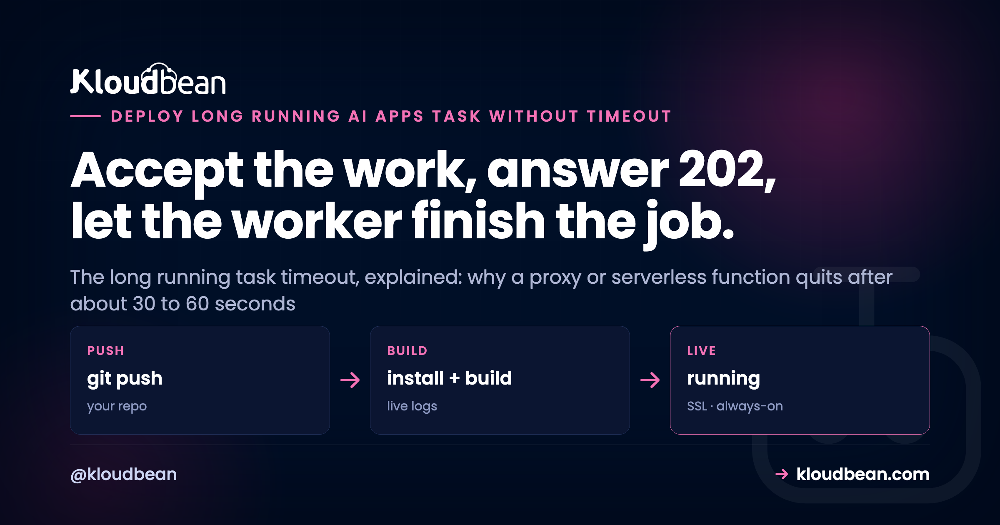

# How to Run a Long AI Task Without Hitting a Timeout

Your AI feature works on localhost. Then you ship it, a real request comes in, the model takes fifty seconds to answer, and the request dies with a 504. That's the long running task timeout in a nutshell: the work would have finished, but something sitting in front of your app quit waiting first. When an AI task times out this way, it's rarely the model's fault and rarely your code. It's where you're running the work, and what's between the browser and that work.

The instinct is to bump a timeout somewhere and move on. Don't, or at least don't stop there. The durable fix isn't a bigger number, it's a different shape: stop doing slow work inside the web request. Accept the request, hand the job to a background worker, and let the client find out when it's done. This page walks that pattern end to end, the 202 Accepted flow, real code you can paste, and the three ways a client collects a result that took a minute to make.

> **The short version:** A long request times out because a proxy, gateway, or serverless function in front of your app cuts the connection after a fixed wait, often around 30 to 60 seconds, while your model call or agent run is still going. Raising that limit just moves the ceiling. The real fix: return 202 Accepted with a job id right away, run the task on a background worker, and let the client poll a status endpoint, hold a stream, or wait for a webhook.

## Why your long running task times out

Picture the layers between a user and your slow code. The browser opens a connection to a reverse proxy or load balancer. That proxy passes the request to your app, which might be a serverless function or an always-on server. Each of those layers has its own patience, a request timeout, and it's usually shorter than you think. Proxies commonly default to around 30 or 60 seconds. Serverless functions often cap a single invocation somewhere in that range too. Whoever runs out of patience first kills the connection, and the user gets an error while your model call is still happily generating.

The status code names the layer that gave up. A 504 Gateway Timeout means an upstream proxy or gateway waited for your app and quit. A dropped connection or a 502 can mean a serverless function hit its execution ceiling mid-run. A client fetch that rejects with a timeout means the browser or your HTTP client gave up first. Same root cause every time: one request tried to stay open longer than one of the hops allows.

Worth working out which of those layers you can even see. On a managed platform the reverse proxy in front of your app is run for you, which is convenient right up to the moment you want to know its timeout. On Kloudbean it's managed, and that's the honest description: you don't tune it, and the fix below means you don't need to. If you're on a serverless platform, the ceiling isn't a setting at all, it's a hard product limit.

This shows up anywhere the work is genuinely slow. A long model generation that runs 30 to 120 seconds. An agent run that fires several tool calls in sequence, each adding latency, until the whole thing blows past the ceiling (an agent run timeout). A batch embedding job pushing thousands of chunks through an embeddings API (a batch embedding timeout). None of these are broken. They're just too long to live inside one HTTP request. Timeouts on long model calls are one of the classic ways [AI apps fail in production](https://www.kloudbean.com/blog/why-ai-apps-fail-in-production/), and this is the fix for that particular failure.

<!-- ADD IMAGE: a 504 Gateway Timeout in the browser network tab, next to a request that hung for about 30 seconds before failing -->

## Why raising the proxy timeout doesn't really fix it

The obvious move is to find the timeout and make it bigger. Set nginx `proxy_read_timeout` to 300 seconds, or raise the gateway limit, and the error vanishes in testing. Feels fixed. It isn't, not really.

Two problems. First, you've only moved the ceiling. A job that runs 60 seconds today can run 180 tomorrow when someone pastes a longer prompt or the provider is slow, and you're back to the same 504 with a bigger number in the config. You didn't remove the limit. You relocated it. Second, and worse, every one of those long requests pins a web worker for its entire duration. Your server has a finite pool of workers to handle incoming traffic. If each slow job holds one hostage for two or three minutes, a handful at once and there's nothing left for anyone else. Fast requests, health checks, logins, they all start queuing behind the slow ones.

So the anti-pattern, stated plainly: cranking the gateway timeout to 300 seconds and calling it done. It hides the error in a demo and falls apart the first time real traffic sends a few long jobs at once. And if your app runs on serverless, there's often a hard execution limit you can't raise past at all, which is its own reason to [move an AI app off serverless](https://www.kloudbean.com/blog/move-ai-app-off-serverless/) when it needs to do real work. An always-on server has no invocation ceiling to hit, which is why moving onto one (a managed app on Kloudbean, or any persistent process anywhere) removes the platform half of this problem outright. It does not remove the other half. Pinning web workers with slow requests is a self-inflicted wound on any server, however long it's allowed to run. Raising a timeout buys minutes. The pattern below removes the problem.

## The fix: accept the work, then finish it in the background

The pattern has a shape you'll recognize once you've seen it. Your API doesn't do the slow work while the client waits. It does the fast part, validates the input, creates a job record with an id, drops that job on a queue, and returns immediately. The status code for "immediately" is 202 Accepted, which means exactly this: I've taken your request, I haven't finished it, here's where to check.

A separate background worker picks the job off the queue and does the slow part, the model call, the agent run, the batch embedding, whatever it is. It runs off the request path, so no proxy is watching a clock. When it's done, the worker writes the result and marks the job finished. The client, holding that job id, comes back to collect. Nothing stays open for two minutes. No web worker is held hostage. The 30-second ceiling never comes into play, because no single request is ever slow.

This is the 202 Accepted pattern, and it's the standard answer to work that outlives a request. The diagram shows the two worlds side by side: the same task once inside the request where a proxy times out, and once accepted and pushed to a worker.

<!-- DIAGRAM (rendered as inline SVG in the .html): top row, a long task run inside the request where the proxy gives up at about 30 seconds and returns a 504 while the app keeps running (wasted); bottom row, the same task accepted with 202 plus a job id, enqueued, run by a worker off the request path, written to Postgres, and collected by the client polling the jobs endpoint. Same slow task, two shapes. -->


## Three ways the client gets its result

Once the work is off doing its thing, the client still needs to learn the outcome. There are three ways, and they fit different situations. Pick by how fast the result needs to land and how much infrastructure you want to run.

| Method | How it works | Best for | The cost |
| --- | --- | --- | --- |
| Polling | Client calls `GET /jobs/:id` every few seconds until status is done | Browser UIs, simple setups, most cases | A little extra traffic; the result lands one poll interval late |
| Streaming (SSE) | Client holds an open connection and the server pushes progress or the result | Live progress, token-by-token output | A held connection; needs proxy buffering turned off |
| Webhook / callback | Your service calls the client's URL when the job finishes | Server-to-server flows, other backends | The receiver needs a public endpoint and must handle retries |

For a browser waiting on a result, polling is the boring, correct default. The client kicks off the job, gets a job id, and asks a status endpoint every couple of seconds until the answer is ready. It's trivial to build, it survives a dropped connection (the next poll just tries again), and it holds nothing open. Webhooks shine when the caller is another server that would rather be told than keep asking. Streaming is its own thing, and it's worth being precise about when it's the right tool.

## The code: return 202 with a job id, then poll for status

Here's the whole pattern in two small pieces. The server exposes one endpoint that accepts work and hands back a job id, and one that reports a job's status. This example uses Express and a queue, but the shape is identical in FastAPI, Django, Rails, or anything else.

```js
// POST /generate -> validate, create a job, enqueue, answer 202 right away
app.post('/generate', async (req, res) => {
  const { prompt } = req.body;
  if (!prompt) return res.status(400).json({ error: 'prompt required' });

  const jobId = crypto.randomUUID();
  await db.query('insert into jobs (id, status) values ($1, $2)', [jobId, 'queued']);
  await queue.add('generate', { jobId, prompt });  // hand the slow work to a worker

  // 202 Accepted: taken, not finished. Tell the client where to look.
  res.status(202).location(`/jobs/${jobId}`).json({ id: jobId, status: 'queued' });
});

// GET /jobs/:id -> the client polls this until status is 'done'
app.get('/jobs/:id', async (req, res) => {
  const { rows } = await db.query('select status, result from jobs where id = $1', [req.params.id]);
  if (!rows.length) return res.status(404).json({ error: 'no such job' });
  res.json(rows[0]);  // { status: 'queued' | 'running' | 'done' | 'failed', result }
});
```

And the client side, kicking off the job and polling for the answer without holding one long request open:

```js
async function runLongTask(prompt) {
  // 1. Start the job. This returns in milliseconds, not minutes.
  const { id } = await fetch('/generate', {
    method: 'POST',
    headers: { 'content-type': 'application/json' },
    body: JSON.stringify({ prompt }),
  }).then(r => r.json());

  // 2. Poll the status endpoint until it's done. Give up eventually.
  for (let i = 0; i < 150; i++) {
    await new Promise(r => setTimeout(r, 2000));   // wait 2s between polls
    const job = await fetch(`/jobs/${id}`).then(r => r.json());
    if (job.status === 'done') return job.result;
    if (job.status === 'failed') throw new Error('job failed');
  }
  throw new Error('gave up waiting for the job');
}
```

That's the core of it. The POST returns in milliseconds. The worker takes as long as it takes. The client checks in every two seconds and shows a spinner or a progress note until the result is there. No layer in the middle ever waits long enough to time out, because nothing in the middle is waiting at all.

<!-- ADD IMAGE: a simple UI showing a progress spinner while the client polls, then the finished result appearing once the job status flips to done -->

## When streaming is the right answer instead

Polling isn't always the best experience. If the whole point is to show output as it's produced, a chat reply appearing token by token, then making the user wait for a job to finish and only then poll feels worse, not better. That's the streaming case, and it's genuinely different.

When you stream, the connection stays open on purpose and the server sends data continuously as it's generated. Because bytes keep flowing, the connection isn't idle, so the silent long wait that trips a blocked request doesn't bite the same way. The user sees progress right away. The catch is that streaming has its own production gotchas, chiefly a reverse proxy that buffers the response and delivers it in one lump, quietly breaking the stream. [LLM streaming in production](https://www.kloudbean.com/blog/llm-streaming-in-production/) covers those, and it's the right read if token-by-token output is your goal. A [hosted AI chatbot](https://www.kloudbean.com/blog/host-ai-chatbot-in-production/) leans on exactly this.

So draw the line clearly. Streaming solves the perceived wait for work that produces output incrementally. The job pattern solves the truly long task that has no partial output to show: a batch embedding run, a document index, a multi-step agent that only has an answer at the very end. Some apps use both. They stream the chat reply, but push a big re-index to a background job. They aren't competing. They solve different problems.

## The worker and queue behind it

The pattern leans on two pieces you might not have yet: a queue and a worker. The queue is a durable list of jobs waiting to run, usually backed by Redis. The worker is a separate long-running process that pulls jobs off the queue, one or a few at a time, and does the slow work. Keeping the worker separate from the web server is the whole point. Your web process stays free to answer requests fast while the worker grinds through the heavy stuff. The full shape of running an API, a worker, and a database together is in [how to run an AI app with an API, a worker, and a database](https://www.kloudbean.com/blog/run-ai-app-api-worker-database/).

In practice that means running two processes, not one, plus a Redis and a database. On Kloudbean the worker is a second always-on app beside your API, the queue is a managed Redis, and job state goes in a managed Postgres or MySQL, all from the same dashboard. Scheduled sweeps (reaping jobs stuck in `running`, retrying failures, pruning old rows) go in as cron jobs from the UI rather than a crontab you SSH in to edit. The reason to mention the plumbing at all: this pattern needs four pieces to exist at once, and a lot of "just deploy it" platforms give you one.

A queue buys you more than just moving work off the request path. You get retries when a job fails, control over how many jobs run at once (so ten users don't launch ten simultaneous GPU-heavy calls), and a record of what ran. In Node, the common tool is BullMQ on top of Redis; [background jobs in Node.js with BullMQ](https://www.kloudbean.com/blog/nodejs-background-jobs-bullmq/) covers the worker, retries, and concurrency in detail. Python has RQ and Celery in the same role. The job's state, queued, running, done, or failed, plus the result, lives in your database, which is what the status endpoint reads back. This whole setup, API plus worker plus queue plus store, is laid out in the [AI app reference architecture](https://www.kloudbean.com/blog/ai-app-reference-architecture/), and it's the natural next step after [the last mile of vibe coding](https://www.kloudbean.com/blog/last-mile-of-vibe-coding/) leaves you with a working prototype and a production gap.

<!-- ADD IMAGE: a queue dashboard showing jobs moving through queued, running, done, and failed states with counts -->

One opinion, from watching this play out more than once: if a task can plausibly run past about 30 seconds, build it as a background job from day one. Retrofitting the 202 pattern after you've already hit the timeout in production, with users watching, is more work and more stress than designing it that way up front. It's far easier to start with a job you don't strictly need than to bolt one on during an incident.

## Check your platform can hold this shape before you build it

Here's the part that catches people out after they've written the code. The 202 pattern is only about fifty lines, but it assumes four things exist at the same time, and half the friction in retrofitting it comes from discovering one of them doesn't. Run down the list against wherever you deploy today.

**A process that stays alive between requests.** The worker isn't triggered by a request, it sits there draining a queue. A platform that only runs code in response to an HTTP call, or that stops your process when traffic goes quiet, has nowhere for that to live. This is the one that sends people looking for a different host, and it's why an always-on server keeps coming up in this article rather than being saved for the end.

**A second process, separate from the web app.** Not the same process with a background thread. If your worker shares a process with the web server, a heavy job still competes with request handling for CPU and event-loop time, and a crash takes both down. Two deployables.

**A Redis you don't operate yourself.** The queue needs durable storage, and BullMQ, RQ and Celery all reach for Redis. Running your own is fine; it's just one more thing to patch, back up, and be woken by.

**Somewhere for job state that survives a restart.** Job status and results go in a real database. Local disk or in-memory state loses everything on a redeploy, which is the classic version of this bug: the queue survives, the answers don't.

If it's useful to know how those four map onto one place, that's roughly the whole architectural argument for Kloudbean here. The API and the worker are two always-on managed apps, the queue is a managed Redis, job state goes in a managed Postgres or MySQL, cron jobs come from the dashboard, and the reverse proxy in front is managed. Deploy both from Git, free SSL on the API.

Now the part no host fixes, ours included. Removing the platform timeout doesn't make the work faster. A model call that takes ninety seconds still takes ninety seconds, and the pattern just stops that being the user's problem. Your retry logic, your job reaping, your idempotency when a worker dies halfway are all yours to write. And on a standard plan you size the server and set worker concurrency yourself, since autoscaling is an Enterprise or custom capability, not something that happens quietly on your behalf. Honestly, sizing it yourself is fine at first. Watch the queue depth for a week and you'll know more about your concurrency than any autoscaler would have guessed.

<!-- ADD IMAGE: the Kloudbean dashboard showing an app, a background worker process, and a scheduled cron job side by side -->

## Run long jobs on a server that won't quit on them

**Run the slow work on an always-on server with a real background worker, a managed queue, and somewhere durable to keep job state.** Launch the server (no function timeout), add a background worker and cron jobs from the dashboard, back the queue with managed Redis, keep job state in managed Postgres, and deploy from Git with free SSL. One dashboard for the whole thing.

Start free at [kloudbean.com](https://www.kloudbean.com/); see plans on [pricing](https://www.kloudbean.com/pricing/).

Always-on server (no function timeout) · Background workers + cron · Managed Redis queue · Managed Postgres · Git deploy · Free SSL

## FAQ

**Why does my long AI request time out?**
Because a layer in front of your app gave up waiting. A reverse proxy, gateway, or serverless function each enforce a request timeout, often around 30 to 60 seconds, and if your model call or agent run takes longer, that layer cuts the connection first. The work might have finished fine, but the user already got an error. The fix is to stop running slow work inside the request.

**How do I run a task longer than 30 seconds?**
Don't run it inside the web request at all. Accept the request, create a job, put it on a queue, and return 202 Accepted with a job id right away. A background worker runs the slow task off the request path, and the client polls a status endpoint (or waits for a stream or webhook) until the result is ready. Nothing stays open long enough to time out.

**What is the 202 Accepted pattern?**
202 Accepted is the HTTP status for "I have taken your request but haven't finished it." In this pattern your API validates the input, enqueues the work, and returns 202 with a job id and a URL to check. A worker does the actual task in the background, and the client uses the job id to poll for the result. It's the standard way to handle work that outlives a single request.

**Should I increase my proxy timeout?**
It's a stopgap, not a fix. Raising the proxy or gateway timeout buys a little room, but it only moves the ceiling, and a longer job will hit it again. Worse, every long request pins a web worker for its whole duration, so a few of them at once can starve everyone else. Use the background job pattern instead and keep proxy timeouts sane.

**What causes a 504 Gateway Timeout on an AI request?**
A 504 means an upstream proxy or gateway waited for your app to respond and ran out of patience. On an AI request that usually means the model call or agent run took longer than the proxy's timeout. The status code points at the layer that quit, not at your code. Move the slow work to a background job and the request returns instantly.

**How does the client find out when a background job is done?**
Three ways. It can poll a status endpoint every few seconds until the job reports done, which is the simplest and works well in a browser. It can hold a streaming connection and receive progress or the result as it's produced. Or you can fire a webhook to a URL when the job finishes, which suits server-to-server flows. Polling is the sensible default for most UIs.

**Do I still need the job pattern if I stream tokens?**
Not for the streamed part. Streaming keeps the connection active and shows output as it's generated, so it sidesteps the silent-wait timeout for things like chat replies. But streaming only helps when there's incremental output to show. For a batch embedding run, a document index, or a multi-step agent that only has an answer at the end, the background job pattern is still the right tool. Plenty of apps use both.

**Where do I run the background worker and queue?**
On an always-on server, not a serverless function that can be cut off mid-run. You need a long-running worker process to drain the queue, a Redis instance to back the queue, and a database to hold job state. On Kloudbean you run the always-on server, add a worker and cron jobs from the dashboard, and attach a managed Redis and managed Postgres, all in one place.

**Can serverless functions run long AI tasks?**
Often not directly. Many serverless platforms cap a single invocation, sometimes around 30 to 60 seconds, sometimes a few minutes, and you can't raise it past the hard limit. That makes them a poor fit for a long model call or agent run held open inside one request. Either offload the work to a background worker on an always-on server, or move the app off serverless for that workload.

---

*Kloudbean · Accept the work, answer 202, let the worker finish the job.*
