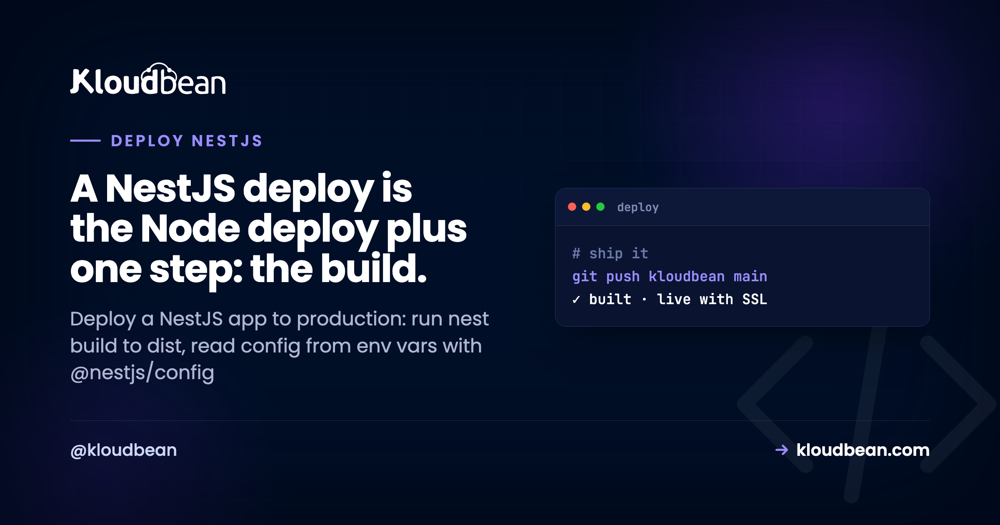

# How to Deploy a NestJS App to Production

You built an API with NestJS. It runs beautifully with `npm run start:dev`, hot-reloading on every save. Then you go to deploy a NestJS app to production and hit the question nobody's tutorial answered: what actually runs on the server? Not `nest start`. Not ts-node. A compiled JavaScript bundle in `dist/`, launched with `node dist/main.js`, kept alive by a process manager, sitting behind Nginx with SSL.

Good news up front. NestJS hosting isn't a special discipline. In production a Nest app is a well-structured Node app plus one compile step. If you can host a NestJS API, you already know most of it. This guide walks the whole path: the NestJS production build, reading config from environment variables, graceful shutdown hooks, running under PM2 behind a reverse proxy, then a Git deploy with a managed database wired in. Real commands, not hand-waving.

> **How do I deploy a NestJS app to production?** Run `nest build` to compile TypeScript into `dist/`, set `NODE_ENV=production`, and start the app with `node dist/main.js` (not `start:dev`). Read config through `@nestjs/config` from environment variables, call `app.enableShutdownHooks()` so redeploys close cleanly, and run the process under PM2 behind Nginx with SSL. On Kloudbean you connect a Git repo, set install/build/start commands, add env vars in the UI, and every push builds and ships with live logs.

## What actually changes when NestJS goes to production?

One thing. The build step. That's the whole difference between a plain Express app and a NestJS app at deploy time, and it's worth understanding before you touch a server.

In development you run `nest start --watch` (that's what `npm run start:dev` calls). Under the hood it uses ts-node to compile your TypeScript in memory and re-run it every time you save. Convenient for you. Wrong for production. ts-node recompiling on the fly is slower, heavier on memory, and depends on dev tooling you don't want on a live box.

Production flips it. You compile *once* with `nest build`, which writes plain JavaScript into a `dist/` folder, and then you run that with `node dist/main.js`. No TypeScript at runtime. No watcher. Just Node executing compiled code, exactly like any other Node service. Set `NODE_ENV=production` so your framework and libraries skip dev-only work.

> **Founder note.** People overthink NestJS deploys because the framework feels enterprise-y, with modules, decorators, and dependency injection everywhere. In production none of that matters. It compiles down to ordinary Node. So a NestJS deploy is the Node deploy you already know, with a `nest build` in front of it. Learn the Node half once and every Nest deploy after this is muscle memory.

*(Diagram: dev versus production for NestJS. In development, nest start --watch runs TypeScript through ts-node in memory on localhost:3000 and recompiles on save. In production, git push triggers nest build, which compiles once to dist/main.js, then node runs it under PM2, behind Nginx on port 443, served over HTTPS with free auto-renewing SSL. The only real difference between a Nest deploy and a plain Node deploy is the middle box: nest build, once, into dist/.)*

## The NestJS production build, step by step

Open the `package.json` that Nest generated for you. The two scripts that matter in production are already there:

```json
{
  "scripts": {
    "build": "nest build",
    "start:prod": "node dist/main.js"
  }
}
```

`npm run build` runs the Nest compiler and produces `dist/`. `npm run start:prod` runs the compiled output. That's your production start command. Never ship `start:dev` to a server. It runs the watcher, which is slower and expects dev dependencies you shouldn't be relying on in production.

Here's the sequence a deploy runs, and the order matters more than it looks:

```bash
# 1. install dependencies (keep devDependencies so the Nest CLI exists)
npm ci

# 2. compile TypeScript to dist/
npm run build

# 3. run the compiled app
node dist/main.js
```

> **The gotcha that trips up half of all first NestJS deploys.** The Nest CLI (`@nestjs/cli`) lives in `devDependencies`. If you optimize too early and run `npm ci --omit=dev` *before* building, the build fails with `sh: nest: not found` because the tool that compiles your app was never installed. Install everything, build, and only then prune dev deps if you want a leaner runtime. Build first. Prune later, or not at all.

<!-- ADD IMAGE: terminal running npm run build then node dist/main.js, showing the "Nest application successfully started" boot line -->

## Reading config from environment variables with @nestjs/config

Your database URL, JWT secret, third-party API keys, and the public app URL differ between your laptop and production. They belong in environment variables, read at runtime, never hard-coded and never committed to Git. NestJS has a first-party module for exactly this: `@nestjs/config`.

Register it once, globally, in your root module:

```ts
// app.module.ts
import { Module } from '@nestjs/common';
import { ConfigModule } from '@nestjs/config';

@Module({
  imports: [
    ConfigModule.forRoot({ isGlobal: true }),
  ],
})
export class AppModule {}
```

Then read values anywhere through `ConfigService`, with a typed getter:

```ts
constructor(private config: ConfigService) {}

const dbUrl = this.config.get<string>('DATABASE_URL');
```

In development, `ConfigModule` reads a local `.env` file. That file is for your machine only. It must be in `.gitignore`, because a secret in your repo is a secret in every clone, fork, and CI log the moment it leaks. In production you set the same keys as real environment variables on the server instead. Same code, different source. That's the whole point of doing config this way, and the subtle failures around it are common enough that we wrote a dedicated guide: [environment variables, done right](https://www.kloudbean.com/blog/environment-variables-done-right/).

One habit worth building early: validate your config at boot. Pass a schema to `ConfigModule.forRoot` so the app refuses to start when a required variable is missing, instead of crashing later with a confusing `undefined` deep in a service. A loud failure at startup beats a mystery at 2am.

## Graceful shutdown: turn on NestJS shutdown hooks

Every deploy replaces the running version. The platform stops the old process by sending it a `SIGTERM` signal, waits a moment, then starts the new one. If your app ignores that signal, it gets killed mid-request: in-flight responses drop, the database pool doesn't close cleanly, and a half-finished job stays half-finished.

Raw Node makes you wire this up with `process.on('SIGTERM', ...)`. NestJS gives you something better, because it ties shutdown into the module lifecycle. Call one method in `main.ts`:

```ts
// src/main.ts
import { NestFactory } from '@nestjs/core';
import { AppModule } from './app.module';

async function bootstrap() {
  const app = await NestFactory.create(AppModule);

  // listen for SIGTERM / SIGINT and run lifecycle hooks
  app.enableShutdownHooks();

  // read the assigned port; fall back to 3000 for local dev
  await app.listen(process.env.PORT ?? 3000);
}
bootstrap();
```

With hooks enabled, any provider that implements `OnApplicationShutdown` or `OnModuleDestroy` gets called on the way out. That's where you close what needs closing:

```ts
import { Injectable, OnApplicationShutdown } from '@nestjs/common';

@Injectable()
export class DbService implements OnApplicationShutdown {
  async onApplicationShutdown(signal: string) {
    // finish in-flight work, then close the connection pool
    await this.pool.end();
  }
}
```

Notice the other detail in that `main.ts`: `app.listen(process.env.PORT ?? 3000)`. Local code often hard-codes `3000`. In production the platform assigns the port, and if your app grabs `3000` anyway while the proxy forwards somewhere else, you get a 503 with clean-looking logs. Read the port from the environment. It's a one-line change that prevents a genuinely annoying class of "works locally, dead in prod" bugs.

## Running NestJS behind Nginx with PM2

Compiled code that runs once and exits is a script, not a service. Two pieces turn `node dist/main.js` into something that stays up and is reachable on the public internet: a process manager and a reverse proxy.

**PM2** is the process manager. It launches your app, watches it, and restarts it in about a second if it crashes from an unhandled exception or runs out of memory. It also brings the app back after a server reboot. Without a supervisor, one bad request at 3am takes your API down until a human notices. With PM2, it's back before anyone files a ticket.

**Nginx** is the reverse proxy. Your Nest app listens on an internal port like 3000. The web speaks HTTPS on 443. Nginx sits in front, terminates SSL, and forwards traffic to your app's port. It's also why reading `process.env.PORT` matters: the proxy needs to forward to the exact port your app listens on.

NestJS is stateless by default, which makes it a clean fit for PM2 cluster mode. Node runs your code on one thread, so a single process uses one CPU core. Cluster mode runs one copy per core behind the same port, and Kloudbean supports PM2 multi-process, so it's a config choice rather than a rewrite:

```bash
# run one instance of the compiled app per CPU core
pm2 start dist/main.js -i max --name my-nest-api
```

Start with a single instance. Turn on clustering when your metrics ask for it. And mind the one trap that bites people: the moment you run more than one instance, anything you kept in process memory (an in-memory cache, a local rate-limiter, a Map of sessions) stops being shared. Each worker has its own copy. Move that state into managed Redis and every instance sees the same thing. If you genuinely outgrow a single box, autoscaling and Kubernetes exist for enterprise setups, but the honest truth is most NestJS APIs never need them.

<!-- ADD IMAGE: pm2 list output showing the Nest app online with its restart count -->

## Deploy your NestJS app from Git

Concepts done. Here's the actual path on [Kloudbean](https://www.kloudbean.com/), where the process manager, reverse proxy, and SSL are already configured so you're only bringing the app.

Click **Add Server**, choose a cloud provider (there are seven: AWS, Amazon Lightsail, Google Cloud, Linode, Vultr, DigitalOcean, and UpCloud), pick **Node.js** as the stack, choose a location near your users, and size it. 2 GB is a comfortable start for a small API. A few minutes later the box is ready with Node, PM2, Nginx, a firewall, and SSL, none of which you configured by hand.

Next, add the application. If you didn't attach one while provisioning, open **Applications** and **Add Application**, then pick the Node stack. Running your Nest API next to a front end or a worker? Multiple apps per server is a first-class feature here, not a hack.


Now connect Git. In **Git Deployment**, link GitHub (OAuth or an SSH key), paste the repository URL, choose a branch, and clone. Then set the runtime configuration, which is where the build step from earlier becomes real fields:

- **App Directory:** the folder containing your `package.json`.
- **Port:** the port your app reads from `process.env.PORT`.
- **Node version:** match what you built on. Node 20+ is a safe default for current NestJS.
- **Install command:** `npm ci`
- **Build command:** `npm run build` (this runs `nest build` into `dist/`).
- **Start command:** `node dist/main.js` (or `npm run start:prod`).


Hit **Pull & Deploy**. The console pulls the code, runs `npm ci`, compiles with `nest build`, and starts `dist/main.js` under PM2, behind the proxy. The whole thing streams as **live build logs**, so you watch install, compile, and boot scroll past in real time. When you turn on automated deployment, every `git push` to your branch repeats this on its own. That's the CI/CD loop the big platforms sell, running on a server you own, and if you want just that piece we broke it down in [CI/CD auto-deploy from GitHub](https://www.kloudbean.com/blog/ci-cd-auto-deploy-from-github/).

<!-- ADD IMAGE: Build and Deployment History with a deploy open and live logs streaming the nest build step -->

## Connecting a managed database (TypeORM or Prisma)

Almost every NestJS API talks to a database, and the connection should come from an environment variable, not a hard-coded string. Both common data layers read one: `DATABASE_URL`.

Launch a managed engine from **Launch Database**. Kloudbean runs seven (PostgreSQL, MySQL, MariaDB, Redis, Memcached, Elasticsearch, and MongoDB), provisioned, backed up, and reachable over the local network. For most NestJS APIs that's managed PostgreSQL or MySQL, with Redis alongside for caching or sessions once you cluster. Take the credentials and set them under **Environment Variables** in the app, using the **Paste .env Content** tab to drop your whole file in at once.


On the code side, wiring is short. With **TypeORM** through `@nestjs/typeorm`:

```ts
TypeOrmModule.forRoot({
  type: 'postgres',
  url: process.env.DATABASE_URL,
  autoLoadEntities: true,
  synchronize: false, // never true in production
});
```

That `synchronize: false` is not a style preference. With `synchronize: true`, TypeORM alters your live schema to match your entities on every boot, and it will happily drop a column when you rename a property. It's fine in early dev. In production it's a data-loss incident waiting for a bad deploy. Use migrations instead, and run them as a step in your deploy:

```bash
# TypeORM: apply migrations (never auto-synchronize in prod)
npm run typeorm migration:run

# Prisma: apply migrations, then the app starts as normal
npx prisma migrate deploy
```

Prisma reads the same `DATABASE_URL` from the environment, so the pattern is identical: secret in env vars, migrations on deploy, app starts clean. If you're moving off a metered hosted database onto one that lives beside your app, the full walkthrough is in [add a managed database to your app](https://www.kloudbean.com/blog/add-managed-database-to-your-app/).

## Custom domain and free SSL

Point your domain at the server (an A record for the apex, a CNAME for a subdomain like `api.you.com`), add it in the app's domain settings, and install a free SSL certificate. It's issued through Let's Encrypt and auto-renews, so you're not diarizing a cert expiry. Nginx already terminates SSL on 443 and forwards to your Nest process, so once DNS resolves and the cert installs, your API is live over HTTPS. That's the last green box in the diagram.

## Where NestJS deploys actually go wrong

Most first deploys break, and for NestJS the failures are predictable. Here's where they cluster, so you can skip the debugging session.

- **`Error: Cannot find module '/.../dist/main.js'`** means the build didn't run, or ran in the wrong directory, so there's no compiled output to start. Confirm your build command is `npm run build` and your app directory points at the folder with `package.json`.
- **`sh: nest: not found`** is the devDependencies trap from earlier. The Nest CLI wasn't installed before the build. Install with dev deps, then build.
- **A 503 with no crash in the log** usually means the app is listening on the wrong port. Read `process.env.PORT` in `main.ts` instead of hard-coding 3000.
- **The app boots but every request 500s on the database** is nearly always a missing or wrong `DATABASE_URL`, or migrations that never ran. Check the env var, then your migration step.
- **Columns quietly disappearing** is `synchronize: true` doing its thing. Turn it off and move to migrations.

When something's down, read the log before you guess. In the Kloudbean console that's **Application Administration → Logs Viewer**, and the tab you want is **App Errors**. A Nest crash writes its stack trace there and usually names the exact provider or module that failed to resolve. If the site is returning a 503, that's your first stop, because a 503 means the application isn't running at all. Search the tab for `Nest can't resolve dependencies` or the module name and you'll land on it in seconds.

Two other tabs sit beside it. **App Info** is your app's informational output, so `Nest application successfully started` showing up there tells you the boot actually completed. **Web Requests Logs** is the web server's access log of every request served, which settles whether a request reached your process or died in front of it. Build and deploy output is separate: it streams live during the deploy and stays in **Build and Deployment History**, which is where `sh: nest: not found` shows up rather than in App Errors.

If you'd rather grep from a terminal, the same files are on disk:

```
/home/admin/hosted-sites/<app_system_user>/app-logs/app.info.log
/home/admin/hosted-sites/<app_system_user>/app-logs/app.error.log
```

The File Manager opens them too. Either way, fix the one line the trace points at and deploy again. Nine times out of ten a broken NestJS deploy is config, not code.

## What you own, and what's handled

Kloudbean runs NestJS on Linux managed cloud: the Node runtime, PM2, Nginx, SSL, and backups are provisioned and maintained on whichever of the seven clouds you choose. If you need Windows Server that is a Premium or Enterprise conversation, though .NET on Linux is standard. NestJS is a Node framework, so it's squarely in the sweet spot either way. "Managed" means the platform keeps the server and its stack healthy while you own the application: your modules, your data, your config (the port, the env vars, the build and start commands). Because it's a standard Linux box running standard compiled Node, you can move hosts whenever you like, with no per-app tax as you add more. Deploying a plain Express service instead of Nest? See [deploy an Express app](https://www.kloudbean.com/blog/deploy-express-app/). Want the production concerns for Node in general (crash-restart, cluster mode, SIGTERM) in more depth? That's [deploy a Node app to managed cloud](https://www.kloudbean.com/blog/deploy-node-app-to-managed-cloud/). And if you want the framework-agnostic mental model behind all of this, start at [how to deploy an app](https://www.kloudbean.com/blog/how-to-deploy-any-app/).

## Ship your NestJS API on a server you own

Connect a repo, set `npm run build` and `node dist/main.js`, add your env vars, and deploy. PM2, Nginx, and SSL are already wired. Coming from a per-service platform bill? Weigh it in [the Heroku alternative for modern apps](https://www.kloudbean.com/blog/heroku-alternative-for-modern-apps/). Start at [kloudbean.com](https://www.kloudbean.com/); sizes on [pricing](https://www.kloudbean.com/pricing/) from $8/mo, Enterprise custom.

Git deploy with live logs · PM2 process manager · Free auto-renewing SSL · Seven managed databases · Automatic backups · Free migration · Free trial

## FAQ

**How do I deploy a NestJS app to production?**
Compile it with `nest build` so plain JavaScript lands in `dist/`, set `NODE_ENV=production`, and start it with `node dist/main.js` under a process manager like PM2, behind Nginx with SSL. Read config from environment variables via `@nestjs/config` and connect a managed database over a `DATABASE_URL`. On Kloudbean you connect a Git repo, set the install, build, and start commands, add env vars, and deploy.

**What is the difference between nest start and node dist/main.js?**
`nest start` (and `start:dev`) is for development. It compiles TypeScript through ts-node and can watch for changes, which is slower and depends on dev tooling. `node dist/main.js` runs the already-compiled output from `nest build`, which is what you want in production: faster, lighter, and pure Node with no TypeScript at runtime.

**Do I need to run nest build before deploying?**
Yes. Your repository holds TypeScript, and Node doesn't run TypeScript directly in production. `nest build` compiles it into JavaScript in `dist/`, and that folder is what you start. On managed hosting you set `npm run build` as the build command so it runs automatically on every deploy.

**How do I read environment variables in NestJS in production?**
Use `@nestjs/config`. Register `ConfigModule.forRoot({ isGlobal: true })` in your root module, then read values through `ConfigService`. In development it loads a local `.env` file (kept out of Git), and in production you set the same keys as real environment variables on the server. The code doesn't change, only the source of the values.

**How do I enable graceful shutdown in NestJS?**
Call `app.enableShutdownHooks()` in `main.ts`. That wires `SIGTERM` and `SIGINT` into the Nest lifecycle, so any provider implementing `OnApplicationShutdown` or `OnModuleDestroy` runs on exit. Use it to finish in-flight requests and close your database pool cleanly, which makes redeploys invisible to users instead of dropping connections.

**Should I use PM2 to run NestJS in production?**
Yes. PM2 keeps the process alive, restarting it in about a second if it crashes and bringing it back after a reboot. It also runs cluster mode to use every CPU core. Kloudbean supports PM2 multi-process and configures it for you, so it's the default rather than something you install and babysit.

**How do I connect a managed database to NestJS with TypeORM or Prisma?**
Set a `DATABASE_URL` environment variable and read it in your config. TypeORM takes it as `url` in `TypeOrmModule.forRoot` with `synchronize: false`; Prisma reads it automatically. Run migrations as a deploy step (`migration:run` for TypeORM, `prisma migrate deploy` for Prisma). Launch the database as a managed engine so it's backed up and reachable over the local network.

**Why does my NestJS deploy fail with nest: not found?**
The Nest CLI is a devDependency, and it was missing when the build ran, usually because dev dependencies were skipped with something like `npm ci --omit=dev` before building. Install all dependencies first, run `npm run build`, and only prune dev deps afterward if you want a leaner runtime.

**Do I need Docker to deploy a NestJS app?**
No. A NestJS app compiles to ordinary Node, and a managed server runs `node dist/main.js` directly under a process manager. Docker is one way to package the build, useful when you're coordinating many services, but it isn't required to ship a single API. Learn the build-and-run flow first and reach for containers only when you actually need the isolation.

**Can I run NestJS across all CPU cores?**
Yes, with PM2 cluster mode (`pm2 start dist/main.js -i max`), which runs one instance per core behind the same port. NestJS is stateless by default, so it clusters cleanly. Just move any in-memory state (caches, rate-limiters, sessions) into Redis first, because it won't be shared across instances.

_By Kloudbean Platform Team · A NestJS deploy is the Node deploy plus one step: the build._
