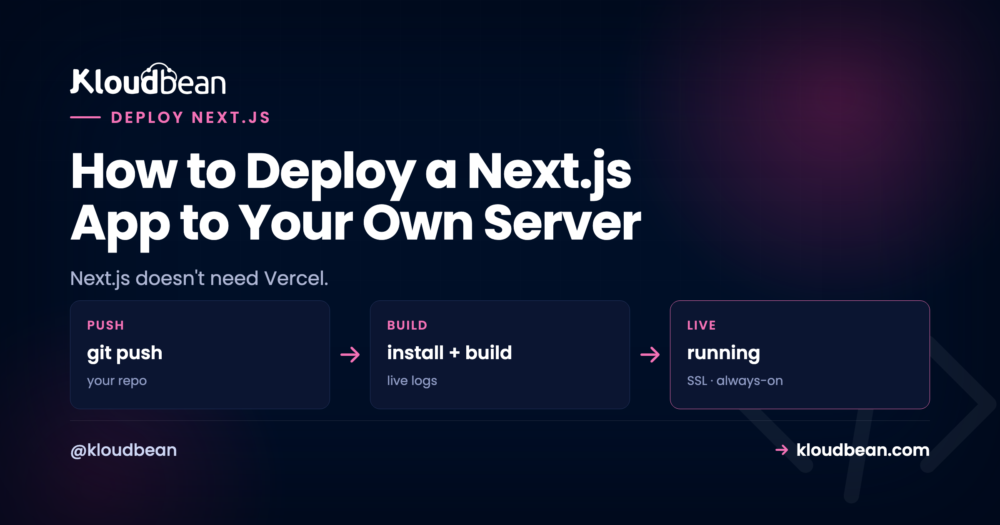

# How to Deploy a Next.js App to Your Own Server

You can deploy Next.js to your own server. Not a stripped-down version of it, the whole framework: SSR, API routes, ISR, image optimization, middleware. Next.js is open source and it runs as an ordinary Node app. The reason people don't realize this is that most tutorials skip the one thing that actually matters when you self-host, which is what your app *becomes* after you build it.

So let's start there, because it's the fact that changes everything else.

> **The short version.** A built Next.js app is a running Node process (`next build` then `next start`), not a static folder, unless you deliberately set `output: 'export'`. Deploy it like any Node app: launch a server, connect your repo, set Build to `next build` and Start to `next start`, listen on `process.env.PORT`. SSG, SSR, and ISR then all work, because each one is just a different thing that same process does.

## Is your Next.js app a folder of files, or a program?

This is the fork that decides your entire deploy, and it's the part the "drag your build folder to a host" advice gets wrong for Next.js.

By default, `next build` does not produce a static site. It produces a production server. When you run `next start`, you're launching a long-lived Node process that renders pages, runs your API routes, revalidates cached pages on a timer, and optimizes images on the fly. That process has to stay running for your app to work. It's a program, not a pile of HTML.

There's one exception, and it's opt-in. If you set `output: 'export'` in `next.config.js`, Next.js emits a folder of static HTML you can serve from anywhere, including our [free static hosting](https://www.kloudbean.com/blog/deploy-ai-built-app-to-production/). But the moment you do that, you give up everything that needs a server: no SSR, no API routes, no ISR, no on-the-fly image optimization. Most people who reach for static export don't actually want to lose those. My honest take: unless your app is genuinely a brochure site with zero dynamic behavior, skip `output: 'export'` and run the real server. You paid for Next.js's dynamic features by using Next.js. Keep them.

*(Diagram: one Node process, three rendering modes. SSG serves prebuilt HTML with no per-request work. SSR runs your code on every request and needs an always-on process. ISR serves cached HTML and rebuilds it in the background on a timer, needing a process plus a writable disk. All three sit on `next build` then `next start`, one process on a server you own. Static export skips the process and loses all three.)*

## What next start actually needs, by rendering mode

Once you see the app as a process, the features people worry about losing stop being mysterious. Each is just a demand on the server, and a normal Node server meets all of them. Here's the whole map.

| Feature | What Next.js does | What the server has to provide |
| --- | --- | --- |
| SSG | Renders pages to HTML during `next build` | Serve static HTML. The cheapest case. |
| SSR | Runs `getServerSideProps` / server components per request | A long-running Node process. This is the default. |
| ISR | Serves cached HTML, rebuilds after `revalidate` seconds | A process plus a persistent disk for the cache. |
| API routes | Runs your `app/api` or `pages/api` handlers | The same process. No separate functions service. |
| Image optimization | Resizes and reformats images on request | The process, plus `sharp` installed. |
| Middleware | Runs code before a request resolves | The process (Node runtime). |

### SSR and API routes: the default, and the easy case

If your app uses `getServerSideProps`, server components with dynamic data, or route handlers under `app/api`, you need a running process. That's exactly what `next start` gives you. Nothing special to configure. The API routes run in the same process as your pages, so there's no CORS to fight and no second service to deploy. This is the part that scares people off self-hosting, and it's genuinely the least work.

### ISR is actually better on a real server than people expect

Incremental Static Regeneration serves a cached page fast, then quietly rebuilds it in the background once your `revalidate` window passes. To do that it needs two things: a process that keeps running between requests, and a filesystem it can write the regenerated pages to. A real server has both, permanently. That's the whole point of owning the box.

On ephemeral platforms, where the filesystem is thrown away and functions spin up per request, ISR needs extra plumbing (a shared cache handler) to behave. On a persistent server it just works, the way the Next.js docs describe it. If ISR is core to your app, a server you own is the least surprising place to run it.

### Image optimization needs one dependency people forget

Next.js's `<Image>` component optimizes images on the fly using a library called `sharp`. In development Next.js is forgiving about it. In production, if `sharp` isn't installed, image optimization either falls back or errors, depending on your version. So install it as a real dependency:

```
npm install sharp
```

That's it. It builds during your normal install step and the `<Image>` component works on your server exactly as it does on Vercel. If you'd rather not optimize on the box at all, you can point Next.js at an external image loader, but for most apps, installing `sharp` is the simplest answer.

### Middleware runs in your process too

Next.js middleware (auth checks, redirects, rewrites in `middleware.ts`) runs as part of the app. When you self-host with `next start`, it executes on the Node runtime on your server. It works. The only nuance worth knowing is that some edge-specific APIs assume an edge runtime, but standard middleware logic runs fine.

<!-- ADD IMAGE: A terminal running next build then next start, showing the "ready on port 3000" line so readers see the process boot. -->

## Deploy your Next.js app to a server you own

The mechanics are short, because self-hosting Next.js is just deploying a Node app. There's no Nginx to hand-configure and no runtime to install. Here's the path through the [Kloudbean](https://www.kloudbean.com/) console.

Click **Add Server**, pick a **Cloud Provider** (AWS, Lightsail, GCP, Linode, Vultr, DigitalOcean, or UpCloud), choose **Node.js**, pick the datacenter nearest your users, and give the build room to breathe. Next.js builds like memory, so 2-4 GB is a comfortable start. **Launch Now** provisions it in a few minutes with Node, a web server, a process manager, firewall, and SSL already set up.


Open the app, go to **Application Administration → Deploy Code**, and you're on the Git Deployment screen where the whole deploy happens.


Connect GitHub over OAuth, paste your repository URL, pick the branch, and **Clone Repository**. Then the fields that matter:

- **App Directory:** the folder holding your `package.json`.
- **Port:** the assigned port. `next start` reads `process.env.PORT` for you, so you rarely touch your code here.
- **Node Version:** match what you build on locally. Node 20+ for a current Next.js.
- **Install / Build / Start:** `npm ci`, then `npm run build` (which runs `next build`), then `npm start` (which runs `next start`).

Hit **Pull & Deploy** and the build log streams live in the console. Got a database? Launch a managed one from **DBS → Launch Database** (Postgres, MySQL, MariaDB, MongoDB, Redis, or Elasticsearch), on the same box, backed up, reached over the local network. Run your migrations in the build step, for example `npx prisma migrate deploy`, so the schema exists before the app serves a request. More on that in [adding a managed database to your app](https://www.kloudbean.com/blog/add-managed-database-to-your-app/). If you're standing up a separate Node API alongside this too, [the Next.js, Node, and PostgreSQL production architecture](https://www.kloudbean.com/blog/nextjs-node-postgres-production-architecture/) lays out how those three pieces sit together.

### The one env var rule that's specific to Next.js

Under **Runtime Configuration → Environment Variables** there's a **Paste .env Content** tab. Drop your `.env` in, convert to key/value, and swap dev values for real ones. Here's the Next.js-specific catch: anything prefixed `NEXT_PUBLIC_` is baked into the client bundle when `next build` runs, and frozen there. It's public, so never put a secret behind that prefix. And if you add or change a `NEXT_PUBLIC_` value *after* a build, nothing changes until you rebuild. Set it first, then build. Unprefixed variables like `DATABASE_URL` are read live on the server, which is why they belong in the console and never in the repo. The full mental model is in [environment variables, done right](https://www.kloudbean.com/blog/environment-variables-done-right/).


Last, add your domain under **Domain Aliases**, point DNS at the server, install a free **Let's Encrypt** certificate, and turn on **automated deployment**. From then on, every push to your branch runs `next build` and ships, with the build log streaming as it goes. That's the same git-to-live loop the per-app platforms rent you, except it's [running on a server you own](https://www.kloudbean.com/blog/ci-cd-auto-deploy-from-github/).

## Where self-hosting Next.js actually goes wrong

The failures are boringly consistent, and none of them are about hosting being hard. Three cover almost everything we see.

**The Start command is still `next dev`.** This is the big one. Someone sets Start to `npm run dev` because that's the command they type all day. Dev mode isn't built for production: no optimized build, different behavior, and it falls over under load. Your Start command must run `next start`, and your Build must have run `next build` first. If a fresh deploy 503s, check this before anything else.

**Static export, then surprise.** Someone sets `output: 'export'` (maybe copied from a tutorial), then wonders why their API routes 404 and their dynamic pages are blank. Export throws away the server. If you use SSR, API routes, or ISR, don't export. Pick one model and mean it.

**NEXT_PUBLIC_ added too late.** The build baked in the old value (or an empty string), the browser calls the wrong URL, and the page looks broken while the server is perfectly healthy. Set public vars before the build, and redeploy if you change one.

> **Do you need a custom server?** Probably not. Wrapping Next.js in a custom Express server is a real option, but people mostly reach for it to add API routes, which Next.js already has. If you have a genuine reason (a legacy route, a websocket alongside your pages), it deploys fine: point Start at `node server.js` instead of `next start`, and make sure that server listens on `process.env.PORT`. Otherwise, keep it simple and use `next start`.

## When it 503s after deploying Next.js

A 503 means the process didn't come up. Read the app's own error log, which names the real reason:

```
/home/admin/hosted-sites/<app_system_user>/app-logs/app.error.log
```

Open it in the File Manager or over SSH. Nine times out of ten it's the `next dev` mixup above, a missing environment variable the app reads at startup, or a build that failed because the build tools live in `devDependencies` and something set `NODE_ENV=production` before install ran, so npm skipped them. There's also `sudo adm`, our deploy utility, which runs the whole build-and-ship over SSH in one command. The full walkthrough is in [fixing a 503 after deploying](https://www.kloudbean.com/blog/fix-503-after-deploying-your-app/).

<!-- ADD IMAGE: app.error.log open in the File Manager with the line that reveals a Start command stuck on next dev. -->

## The one honest limit: you're in a region, not on the edge

Everything the framework does works self-hosted. The single real difference from Vercel is geographic. Vercel spreads some execution across a global edge network. Your server sits in the region you picked. For most apps that's a non-issue, because a well-placed server is fast and your database is right next to it. If you genuinely serve a latency-critical audience on every continent, you'd either run in multiple regions or put **Cloudflare Enterprise edge caching** in front of the server (a paid add-on, free on Enterprise) so your app is cached at the edge worldwide while it runs on hardware you own.

Beyond that, the boundaries are the usual ones. Kloudbean runs Next.js as a Node app on Linux, not Windows or .NET. "Managed" means the server, stack, SSL, and backups are handled; your code and data stay yours, and you can move hosts whenever you like because underneath it's a normal Linux box. Building with v0 or another AI tool? The Next.js-flavored version of this is the [deploy a v0 app](https://www.kloudbean.com/blog/deploy-v0-app/) guide, and running more than one project on the same box is [hosting multiple apps on one server](https://www.kloudbean.com/blog/host-multiple-apps-one-server/).

Deploy your Next.js app at [kloudbean.com](https://www.kloudbean.com/) with a free trial and your first migration done for you. Weighing the move off Vercel? Read the [Vercel alternative guide](https://www.kloudbean.com/blog/vercel-alternative-for-full-stack-apps/). Server sizes are on [pricing](https://www.kloudbean.com/pricing/).

## FAQ

**Can I run Next.js without Vercel?**
Yes. Next.js is open source and runs as a standard Node app with `next build` and `next start`. Deploy it on a managed server straight from your GitHub repo. There's no proprietary adapter, and you get the full production server with every feature.

**Is a built Next.js app static files or a server?**
A server, by default. `next build` produces a production Node server that you launch with `next start`. It only becomes a static folder if you deliberately set `output: 'export'`, and that mode drops SSR, API routes, ISR, and on-the-fly image optimization.

**Do SSR, API routes, and ISR work when self-hosting Next.js?**
All of them. `next start` runs the real production server, so server-side rendering, `app/api` or `pages/api` routes, incremental static regeneration, image optimization, and middleware all run on your own server. ISR in particular works well because a real server has the persistent process and disk it needs.

**What Build and Start commands should I use?**
Build: `npm run build`, which runs `next build`. Start: `npm start`, which runs `next start`. Make sure the app listens on `process.env.PORT`, which the standard start script already does.

**Does Next.js image optimization work on my own server?**
Yes, once you install `sharp` as a dependency (`npm install sharp`). Next.js uses it to resize and reformat images in production. Without it, optimization may fall back or error depending on your version. Alternatively, configure an external image loader.

**What is standalone output and do I need it?**
Setting `output: 'standalone'` makes `next build` bundle only the files needed to run, including a minimal server, for a leaner deploy and a faster start. It's optional. A normal `next build` and `next start` works fine without it.

**Why does my Next.js app 503 after deploying?**
Usually the Start command is running `next dev` instead of `next start`, a required environment variable is missing at startup, or the build failed because build tools in `devDependencies` were skipped. Read `app.error.log`, fix the command or variable, and redeploy.

**Do I lose anything by not using Vercel?**
Functionally, no. The framework runs in full. The one difference is geographic: Vercel spreads some execution across a global edge network, while your server sits in one region you choose. For most apps a well-placed server is plenty, and you can add Cloudflare edge caching if you need global reach.
