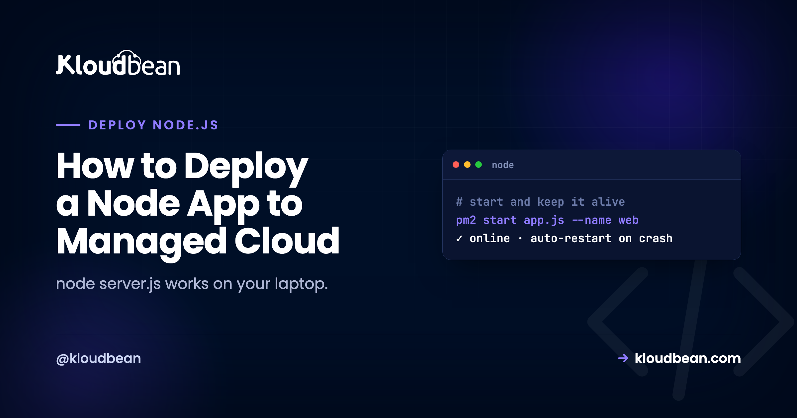

# How to Deploy a Node App to Managed Cloud

On your laptop, `node server.js` is the whole story. It runs, you hit it in the browser, and when it crashes you see the stack trace and press up-arrow-enter. You are the process manager. You are the log viewer. You are the thing that restarts it. To deploy a Node app to managed cloud is really to hand those three jobs to something that never sleeps.

Framework tutorials skip this. They teach you Express routes and stop at "it works locally." So this guide is about the other half, the production half: what actually keeps a Node process alive, answering, and using the machine you're paying for.

> **The short version.** Deploy a Node app to managed cloud and a process manager (PM2) turns `node server.js` into a service: it stays up, restarts on crash, and can run across every CPU core. Your app reads `process.env.PORT`, handles `SIGTERM` for clean restarts, and writes logs somewhere you can read them. On Kloudbean that layer is set up for you. You connect a repo, set your start command, and deploy.

## The gap between "node server.js" and a service

Here's the uncomfortable truth about a plain `node server.js` in production: the instant your app throws an unhandled exception, runs out of memory, or hits some once-a-week edge case, the process exits. And nothing brings it back. Your site is down until a human notices, SSHes in, and starts it again. That could be minutes. On a bad night it's hours.

That single failure mode is the most common reason a Node app is "down," and it has nothing to do with the server being slow or the code being bad. It's just that a bare process has no one watching it. A real service needs a supervisor: something that notices the crash and restarts the app in about a second, every time, without you. That supervisor is a process manager, and it's the first thing that separates a deploy from a demo.

*(Diagram: a process manager does two things your terminal won't. First, it keeps the app alive: start, running, crash from an exception or OOM, then auto-restart back to running in about a second. Second, it uses every core: Node runs on one thread, so cluster mode (PM2 -i max) runs one copy of the app per CPU core, and one box does more.)*

## What "managed cloud" adds on top of a bare server

Managed cloud sits between two things you know. On one side, a raw box from AWS or DigitalOcean where you install and babysit everything. On the other, a locked-down platform that trades control for convenience. Managed cloud is the middle: you run on a real cloud provider's infrastructure, but the operational layer (OS, Node runtime, web server, the process manager, firewall, SSL, backups) is provisioned and maintained for you. You own the server. You skip the part where you hand-configure it and then patch it forever.

For a Node app specifically, that means the survival machinery below is already in place when your code lands. You don't install PM2 or write an Nginx reverse proxy or set up a cert-renewal cron. You bring the app. Here's what the platform is handling, mapped against what you'd otherwise do by hand.

| Production need | On your laptop / a bare box | On managed cloud |
| --- | --- | --- |
| Restart after a crash | You notice and rerun `node server.js` | A process manager restarts it in ~1s |
| Use all CPU cores | One process, one core | Cluster mode runs a copy per core |
| Survive a redeploy cleanly | Ctrl-C, kill in-flight requests | `SIGTERM` for graceful shutdown |
| HTTPS | You buy and wire up a cert | Free Let's Encrypt, auto-renewed |
| Read the logs | Scroll your terminal | Written to a log file you can open |

## The four properties that make a Node app production-ready

Whatever your app is (an Express or Fastify or NestJS API, a websocket server, a Discord bot, a queue worker) the same four properties decide whether it survives contact with real traffic. Get these right and the deploy is almost boring.

### 1. It restarts itself when it crashes

Covered above, and it's number one for a reason. The anti-pattern we see most often is running `node server.js` straight, maybe inside `tmux` or `nohup` so it survives logout, with nothing set to restart it. That's a demo pretending to be a deploy. The first unhandled rejection takes the whole thing down and it stays down. A process manager (PM2 is the standard, and it's what Kloudbean configures) watches the process and restarts it immediately. You don't set it up. It's already there.

### 2. It reads the port from the environment

This one line is behind a huge share of failed first deploys. Local code says `app.listen(3000)` because 3000 was free on your machine. In production the platform assigns the port, and if your app ignores that and grabs 3000 anyway, the router in front of it connects to nothing. You get a 503, and the log looks fine because the app didn't crash. It's just listening in the wrong place.

```js
// works on your laptop, breaks in production
app.listen(3000);

// reads the assigned port, works anywhere
const port = process.env.PORT || 3000;
app.listen(port, () => console.log(`listening on ${port}`));
```

That `|| 3000` keeps your local workflow unchanged while letting production hand you the real port. It's the single most valuable two-line change in this whole article.

### 3. It shuts down gracefully

Every time you deploy, the platform stops the old version and starts the new one. It does that by sending your process a `SIGTERM` signal. If you ignore it, the process gets killed mid-flight: in-progress requests drop, database connections don't close cleanly, a half-written job is left half-written. Catch the signal and finish what you're doing first.

```js
const server = app.listen(process.env.PORT || 3000);

process.on("SIGTERM", () => {
  console.log("SIGTERM received, closing gracefully");
  server.close(() => process.exit(0));
});
```

Most small apps limp along without this, and then someone notices random errors during every deploy. It's ten lines to make deploys invisible to your users. Worth it the moment real people are on the app.

### 4. It uses more than one CPU core

Node runs your JavaScript on a single thread. One plain process uses one core, no matter how many the server has. For most apps that's genuinely fine, because the work is I/O-bound (waiting on the database or network), and one Node process handles a lot of that. But when you're CPU-bound or just want to use the whole box, you run several copies of the app behind the same port. That's cluster mode, and PM2 does it with a flag:

```
# run one instance per CPU core
pm2 start server.js -i max
```

Kloudbean supports PM2 multi-process, so this is a config choice, not a rewrite. Start with one instance. Turn on clustering when your metrics actually ask for it. One caveat that bites people: the moment you run more than one instance, in-memory state (a sessions object, a local rate-limiter, a cache that's just a Map) stops being shared. Each instance has its own copy, so a user's login works on one and fails on the next. Move that state into managed Redis and it's shared across every instance.

## Deploy your Node app to managed cloud

With the concepts clear, the actual deploy is short. Here's the path through the [Kloudbean](https://www.kloudbean.com/) console.

Click **Add Server**, pick a **Cloud Provider** (that's the cloud part: AWS, Lightsail, GCP, Linode, Vultr, DigitalOcean, or UpCloud), choose **Node.js**, pick the nearest datacenter, and size it. 2-4 GB is a comfortable start. **Launch Now**, and a few minutes later the box is ready with Node, the process manager, a web server, firewall, and SSL. You configured none of it by hand.


Open the app, go to **Application Administration → Deploy Code**, connect GitHub, paste the repository URL, pick the branch, and **Clone Repository**. Then set the runtime:

- **App Directory:** the folder with your `package.json`.
- **Port:** the assigned port, which your app reads from `process.env.PORT` (property 2 above).
- **Node Version:** match what you built on. Node 20+ is a safe default.
- **Install / Build / Start:** usually `npm ci`, an optional `npm run build`, then `npm start`. Start is whatever launches your app: your server's entry point, or your worker's if it isn't a web app.

Hit **Pull & Deploy** and the build log streams live. Your app comes up as a managed, always-on process under PM2.


Need a database? Launch a managed one from **DBS → Launch Database**. Kloudbean runs six engines (Postgres, MySQL, MariaDB, Redis, MongoDB, Elasticsearch), on the same box, backed up, reached over the local network. Set your connection string and other secrets under **Runtime Configuration → Environment Variables** using the **Paste .env Content** tab. A missing variable is the most common reason a Node app builds but won't start, so copy them all over. The whole picture of an app, its API, and its database sharing one server is in [host your app, API, and database on one server](https://www.kloudbean.com/blog/host-app-api-and-database-on-one-server/), and the env var details are in [environment variables, done right](https://www.kloudbean.com/blog/environment-variables-done-right/).

<!-- ADD IMAGE: Terminal running pm2 list, showing the app online with its restart count and a per-core cluster. -->

For a web-facing app, add your domain under **Domain Aliases**, point DNS at the server, install a free **Let's Encrypt** certificate, and turn on **automated deployment** so every push rebuilds and ships. A pure worker or bot with no web interface skips the domain and just runs as a process, but auto-deploy still applies.

## The apps that need a real server, not serverless

Plenty of Node apps aren't request-in, response-out. And those are exactly the ones an always-on process suits and serverless fights.

- **Real-time servers.** Websockets (chat, presence, collaborative editing) hold a connection open. A long-lived process keeps it open. Serverless functions, which spin up per request and vanish, don't.
- **Background workers and queues.** A queue consumer or job runner needs a continuous runtime to sit and process work. That's a process, running.
- **Scheduled tasks.** A cron entry on the server, no extra service to wire up.
- **Bots.** A Discord or Slack bot is a process that stays connected and reacts. Same shape.

If your Node app is anything more than a stateless API, owning a server beats stitching serverless pieces together. My opinion, stated plainly: for one Node app, you do not need Docker or Kubernetes. A Dockerfile and an orchestrator solve fleet-of-services problems, teams shipping in parallel, scheduling across many machines. A single app is a process. A managed server runs it directly, restarts it when it falls over, and stays out of your way. If you're one day running dozens of services that genuinely need orchestration, that's an enterprise conversation (Kloudbean does Kubernetes for those), not the default for shipping your API this week.

## When it 503s after deploying

A 503 means nothing is answering on the expected port. For a Node app the causes are short: the app isn't listening on `process.env.PORT`, a required environment variable is missing, the Start command doesn't actually launch the app, or a dependency is imported but missing from `package.json`. Read the app's error log:

```
/home/admin/hosted-sites/<app_system_user>/app-logs/app.error.log
```

A Node crash writes its stack trace there and usually names the exact line. A non-web worker won't serve HTTP at all, so you judge it by its logs and behavior, not a URL. Fix the specific thing and **Pull & Deploy** again. The full checklist is in [fixing a 503 after deploying your app](https://www.kloudbean.com/blog/fix-503-after-deploying-your-app/).

## What you own, and what you don't

Kloudbean runs Node on Linux managed cloud: provisioning, the runtime, the process manager, the web server, SSL, and backups handled, on whichever of the seven clouds you pick. It isn't for Windows or .NET workloads. "Managed" means the platform keeps the server and its stack healthy while you own the application, its data, and its config (the port, the env vars, the start command). Because it's a standard Linux box running standard code, you can move hosts whenever you want, with no per-app tax as you add more. Running a Next.js app instead? See [deploy Next.js to your own server](https://www.kloudbean.com/blog/deploy-nextjs-app-to-your-own-server/). A React front end with this API? That's [deploy a full-stack React app](https://www.kloudbean.com/blog/deploy-fullstack-react-app-to-production/). And more than one app on the same box is [hosting multiple apps on one server](https://www.kloudbean.com/blog/host-multiple-apps-one-server/).

Deploy your Node app at [kloudbean.com](https://www.kloudbean.com/) with a free trial and the first migration on us. New to deploying? Start with the [deploy an app to production](https://www.kloudbean.com/blog/deploy-ai-built-app-to-production/) walkthrough. Server sizes are on [pricing](https://www.kloudbean.com/pricing/).

## FAQ

**How do I deploy a Node.js app to the cloud?**
Push it to GitHub, launch a managed server on your chosen cloud provider, and deploy from the repo in Deploy Code: set your install, build, and start scripts, make the app listen on `process.env.PORT`, add a database and environment variables, and point a domain with SSL for web apps. The managed layer runs and supervises the server, and you own the app.

**What keeps my Node app running if it crashes?**
A process manager. On Kloudbean that's PM2, configured as part of the managed environment. It watches your process and restarts it in about a second if it exits, so a single crash doesn't become downtime until someone notices. You don't set it up yourself.

**Do I need Docker or Kubernetes to deploy one Node app?**
No. A single Node app is a process, and a managed server runs it directly and restarts it on crash. Docker and Kubernetes solve orchestration problems that appear when you run many services at scale. For shipping one app, you can skip them.

**How do I use all the CPU cores on my server?**
Run the app in cluster mode, which starts one instance per core behind the same port (`pm2 start server.js -i max`). Kloudbean supports PM2 multi-process. Start with a single instance and turn on clustering when your metrics call for it. Move any in-memory state into Redis first, since it won't be shared across instances.

**Do websockets and background jobs work on managed cloud?**
Yes. An always-on process holds persistent websocket connections and runs background jobs, queues, and scheduled tasks. Those are exactly the workloads serverless functions struggle with. On a server they're just features of a running app, with no extra infrastructure.

**Should I handle SIGTERM in my Node app?**
Yes, once real users are on it. On each deploy the platform sends `SIGTERM` to stop the old version. Listen for it, stop accepting new requests, finish in-flight ones, close database connections, then exit. It makes deploys invisible to users instead of dropping requests mid-flight.

**Why does my Node app 503 after deploying?**
Usually it isn't listening on `process.env.PORT`, an environment variable is missing, the Start command doesn't launch the app, or a dependency isn't in `package.json`. Read `app.error.log` for the stack trace, fix the specific issue, and redeploy.
