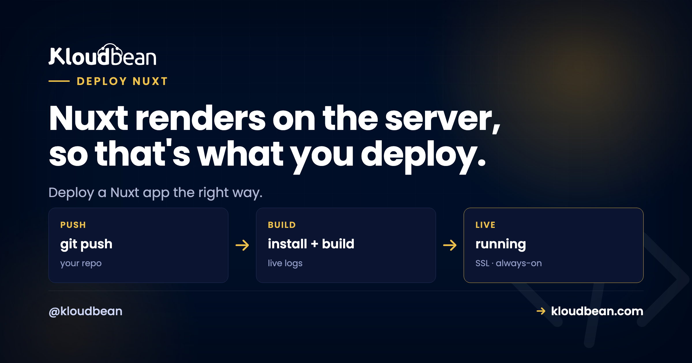

# How to Deploy a Nuxt App: Server or Static, Decide That First

You're ready to deploy a Nuxt app, and the advice online splits into two camps that flatly contradict each other. One says drop your files on a static host and you're done. The other says run a Node server. Both are right. They're just talking about different Nuxt apps.

Nuxt 3 has one setting that decides your whole deploy: whether it renders on the server or ships as prebuilt static files. Get that straight and hosting Nuxt takes minutes. Miss it and you'll fight blank pages, 404s on refresh, or a server bill for files that never needed a server. This guide walks both paths with real commands: how to host a Nuxt SSR app as a live Node process on your own server, and how to deploy Nuxt static output to a CDN.

> **The short answer:** To deploy a Nuxt 3 SSR app to production, run `nuxt build` (Nitro writes a self-contained server to `.output/`), then start it with `node .output/server/index.mjs` on a server, listening on the assigned `PORT`. A reverse proxy handles SSL, a process manager like PM2 keeps it alive, and your database connects over environment variables. If you ran `nuxt generate` instead, you have static files in `.output/public/`: serve those from a CDN, no server needed.

## First, the only question that matters: SSR or static?

Before you pick a host, answer one thing. Does your Nuxt app render pages on the server for every request, or did you prerender everything to HTML ahead of time? That single fork changes the build command, the output folder, what runs in production, and where it lives. So decide it before anything else. Honestly, most of the "I can't deploy my Nuxt app" threads are really "I didn't know which mode I was in."

There are three modes worth naming, though two of them deploy the same way:

| Mode | nuxt.config | Build command | Output | What runs in prod |
|---|---|---|---|---|
| **SSR / universal** | `ssr: true` (default) | `nuxt build` | `.output/server` | A Node process |
| **Static / prerendered** | any, plus generate | `nuxt generate` | `.output/public` | Nothing (files) |
| **SPA (client-only)** | `ssr: false` | `nuxt generate` | `.output/public` | Nothing (files) |

SSR is the default and the one people mean by "a Nuxt app." It renders each page on the server, sends real HTML, then hydrates in the browser. That needs a running process. The other two produce a folder of files, so they deploy like any static site. Here's the fork drawn out, because seeing it end to end is what makes the rest click.

```
One Nuxt app, one config flag, two deploys

                  SSR / UNIVERSAL (default)
                  nuxt build -> .output/server/index.mjs -> Node process (PM2, Nginx :443 to :3000, SSL)
  Your Nuxt 3 app
                  STATIC / PRERENDERED
                  nuxt generate -> .output/public/ -> Static host + CDN (no server, free SSL, visit analytics)
```

> **My honest advice:** pick the mode on purpose, don't inherit it by accident. If your app has logins, personalized pages, a dashboard, or data that changes per request, you want SSR and you'll run a server. If it's a marketing site, docs, or a blog where every page is the same for everyone, prerender it and skip the server entirely. Choosing later means changing your host, so choose first. This is the whole ballgame, and it's the part tutorials skip.

## What nuxt build actually produces (meet Nitro)

Nuxt 3 has a server engine underneath it called Nitro, and Nitro is the reason self-hosting Nuxt is pleasant. When you run `nuxt build` in the default SSR mode, Nitro compiles your app into a single self-contained folder:

```bash
npm run build        # runs nuxt build

# creates:
#   .output/server/index.mjs   the Node server entry point
#   .output/public/            static assets (client JS, CSS, images)
#   .output/nitro.json         build metadata
```

Two things about `.output` are genuinely nice. First, it's self-contained: Nitro bundles your server dependencies in, so you can run the server with plain Node and don't even need `node_modules` present in production. Second, the default target is the `node-server` preset, which is exactly what you want for a server you own. You can retarget Nitro at other platforms with `NITRO_PRESET`, but for a normal Node host, the default is correct. Leave it alone.

Not sure which mode your project is in right now? Build it and look at what appears:

```bash
npm run build         # SSR:    creates .output/server/index.mjs
npx nuxi generate     # static:  creates .output/public/ full of HTML
```

See `.output/server/index.mjs`? You've got an SSR app, and the next section is yours. See a `.output/public` stuffed with real `.html` files and no server entry? You prerendered, so skip down to the static section.

## Deploy a Nuxt SSR app on a server you own

An SSR Nuxt app is a Node process. That's the mental shift. It isn't a build folder you upload, it's a program that has to stay running, listening on a port, ready to render the next request. If you've read our [universal deploy model](https://www.kloudbean.com/blog/how-to-deploy-any-app/), this is the "run the artifact as a long-running process" move, and Nuxt fits it exactly. It's the same shape as [deploying a Next.js app to your own server](https://www.kloudbean.com/blog/deploy-nextjs-app-to-your-own-server/), since Nuxt is to Vue what Next is to React.

Locally you'd start the built server like this:

```bash
node .output/server/index.mjs
# Nitro reads NITRO_PORT or PORT, and NITRO_HOST or HOST
# defaults to http://localhost:3000
```

The one rule that trips people: bind to the assigned port, don't hard-code one. Nitro already reads `PORT` from the environment, so on a managed host you usually change nothing. Your `package.json` scripts stay boring, which is the goal:

```json
{
  "scripts": {
    "build": "nuxt build",
    "start": "node .output/server/index.mjs",
    "generate": "nuxt generate"
  }
}
```

In production you don't run `node` in a terminal and hope. A process manager (PM2 on Node hosts) supervises it, restarts it on a crash, and brings it back after a reboot. A reverse proxy sits in front on port 443, terminates SSL, and forwards to your app's port. On a managed server both of those are set up for you, so you connect a repo and set a few fields. Here's the flow on Kloudbean.

Add the app first. In **Applications, Add Application**, pick the Node.js stack. Nuxt runs as a standard Node app, so there's no special adapter to install and nothing exotic to configure. Give the build some headroom; Nuxt builds are memory-hungry, so 2 GB or more of RAM makes for a smoother first deploy.


Now connect Git. In **Code Delivery, Git Deployment**, link GitHub over OAuth, paste your repo URL, choose a branch, and clone. Then set the runtime fields: the app directory (where your `package.json` lives), the port, the Node version (20 or newer for current Nuxt), and your commands. Install with `npm ci`, build with `npm run build`, start with `npm start`. Hit **Pull & Deploy** and the build log streams live, so you watch clone, install, build, and boot go past in real time.


<!-- ADD IMAGE: the runtime config panel with App Directory, Port, Node version, and Install npm ci / Build npm run build / Start npm start filled in for Nuxt -->

Last, make it findable. Add your custom domain in the app's domain settings, point DNS at the server, and install a free auto-renewing SSL certificate. The full walkthrough lives in [custom domain and SSL for your app](https://www.kloudbean.com/blog/custom-domain-and-ssl-for-your-app/). Turn on automated deployment and every `git push` to your branch rebuilds and ships itself. That's the same Git-to-live loop the per-seat platforms rent you, running on hardware you control.

## runtimeConfig: how Nuxt does environment variables

This is where Nuxt genuinely differs from its cousins, and it's worth understanding because it removes a whole class of "I changed the env var and nothing happened" pain. Nuxt centralizes config in `runtimeConfig` inside `nuxt.config.ts`. Keys at the top level are server-only. Keys under `public` are exposed to the browser:

```ts
export default defineNuxtConfig({
  runtimeConfig: {
    apiSecret: '',              // server-only
    public: {
      apiBase: '/api'          // sent to the client too
    }
  }
})
```

You override these at runtime with environment variables using the `NUXT_` prefix. The key has to already exist in `runtimeConfig` for the override to apply, which is the one gotcha to remember:

```bash
NUXT_API_SECRET=super-secret-value
NUXT_PUBLIC_API_BASE=https://api.example.com
```

Then read it anywhere with `useRuntimeConfig()`:

```js
const config = useRuntimeConfig()
// server code:  config.apiSecret
// anywhere:     config.public.apiBase
```

Here's the payoff, and the part that surprises people coming from Vite or Next. In an **SSR** app, Nuxt resolves `runtimeConfig` on the server at startup and hands the public values to the browser at render time. So changing a `NUXT_PUBLIC_` value takes effect after an env update and a restart. No rebuild. Compare that to a Vite SPA, where [`VITE_` variables bake into the bundle at build time](https://www.kloudbean.com/blog/deploy-vue-app/), or Next.js, where `NEXT_PUBLIC_` does the same. Nuxt SSR reads config later, which is a small quality-of-life win you feel every time you flip a URL. One caveat: for a `nuxt generate` static build, those public values are inlined when you generate, so there you do regenerate to change them. Static is static.

In the dashboard, set these under **Runtime Configuration, Environment Variables**. There's a **Paste .env Content** tab so you can drop your whole file in and convert it to key/value. Secrets like `apiSecret` stay on the server and never touch your repo, which is the entire point.


<!-- ADD IMAGE: your NUXT_API_SECRET and NUXT_PUBLIC_API_BASE variables entered as key/value pairs in the dashboard before a deploy -->

If any of this feels fuzzy, the difference between build-time and runtime config is worth twenty minutes: [environment variables, done right](https://www.kloudbean.com/blog/environment-variables-done-right/) covers the whole model.

## Connecting a database or an API to your Nuxt server

SSR earns its keep the moment your pages need data. Nuxt gives you a full server layer through Nitro: any file under `server/api/` becomes a real backend endpoint running in the same process as your pages. No separate service, no CORS between your front end and your own API.

```ts
// server/api/users.get.ts
export default defineEventHandler(async () => {
  // reads DATABASE_URL from the environment
  const users = await db.query('SELECT id, name FROM users')
  return users
})
```

Whatever you reach for (Prisma, Drizzle, a plain `pg` client), the connection string lives in an env var, never in code. Put your data in a managed database beside the app so it survives redeploys and isn't sitting on the app server's disk. Kloudbean runs seven managed engines (PostgreSQL, MySQL, MariaDB, MongoDB, Redis, Memcached, and Elasticsearch), each provisioned with backups and reachable only from your app server's whitelisted IP, so the round trip from your Nuxt server to the database stays on the local network instead of the public internet. Feed its credentials into your environment variables and you're wired up. There's more on the pattern in [adding a managed database to your app](https://www.kloudbean.com/blog/add-managed-database-to-your-app/).

> **Run migrations in the build step, not by hand.** Add your migration command to the deploy, for example `npx prisma migrate deploy`, so the schema is in place before the app serves a request. A first deploy that boots against a database with no tables fails in a confusing way, and it's avoidable with one line.

## Deploy a static Nuxt site with nuxt generate

If your app is content that's the same for everyone, prerender it and skip the server. This is the cheaper, calmer path, and for a marketing site or docs it's the right call.

```bash
npx nuxi generate     # prerenders every route to .output/public/
# then publish .output/public/ to a static host or object storage + CDN
```

The output is plain HTML, CSS, and JavaScript. It needs no process to keep alive, no reverse proxy pointed at a port, nothing to restart at 3am. You publish the folder and a CDN serves it fast from close to each visitor. Kloudbean's free static site hosting fits this exactly: custom domains, free SSL, and built-in visit analytics, at no cost. And because every route is a real HTML file, you get the SEO of server-rendered pages without running a server.

When should you pick this over SSR? When your content doesn't change per user and doesn't need live data on load. Blogs, docs, landing pages, portfolios. The trade is that updating content means a rebuild and republish, which for a mostly-static site is a fine price. If your app is a mix, remember Nuxt can prerender some routes and render others on the server, but that hybrid setup wants a running server, so it lands back in the SSR path above.

<!-- ADD IMAGE: the .output/public/ folder after nuxt generate, showing the prerendered .html files -->

## Where Nuxt SSR deploys actually break

Most first deploys stumble, and the Nuxt-specific failures are predictable. Here's where to look before you start guessing.

**window is not defined.** This is the classic SSR error, and it catches everyone once. Your code touches a browser-only global (`window`, `document`, `localStorage`) during server render, where those don't exist, and the server throws `ReferenceError: window is not defined`. The fix is to run that code only on the client. Guard it, or move it into `onMounted`, or wrap the component in `<ClientOnly>`:

```js
if (import.meta.client) {
  // browser-only code runs here, never during SSR
  const w = window.innerWidth
}
```

**Hydration mismatch.** You'll see `Hydration completed but contains mismatches` in the console when the HTML the server rendered doesn't match what the client expects. Usual culprits: rendering `new Date()` or `Math.random()` that differ between server and client, or invalid HTML nesting like a block element inside a paragraph. It often looks fine but flickers or misbehaves. Render deterministic markup, and push time-sensitive or random bits to the client.

**A 503 right after deploy.** A 503 means the proxy is up but your process isn't answering. Nine times out of ten it's the start command running `nuxt dev` instead of the built server, a missing env var the app reads at startup, or the app not listening on the assigned port. There's one more that bites Node apps generally: if the build failed because your build tooling sits in `devDependencies` and something set `NODE_ENV=production` before install ran, npm skipped those packages and the build never happened. A 503 tells you the application isn't running, so read its errors first. In the console: **Application Administration → Logs Viewer**, then the **App Errors** tab. It almost always names the real cause.

The tabs matter here. **App Errors** holds your app's error log, which is where a `window is not defined` from server-side rendering turns up. **App Info** holds the informational log, so a successful boot line lands there. **Web Requests Logs** is the web server's access log of every request served, which is how you tell a request that never arrived from one that arrived and crashed. Search is built in, so paste the error string instead of scrolling. Build failures are a different place again: build output streams live during the deploy and stays in **Build and Deployment History**, which is where the skipped-devDependencies case is visible.

If you'd rather work in a terminal or the File Manager, the same files sit at `/home/admin/hosted-sites/<app_system_user>/app-logs`, named `app.info.log` and `app.error.log`.

<!-- ADD IMAGE: The Logs Viewer on the App Errors tab showing a ReferenceError: window is not defined line highlighted -->

## Known rough edges

Two things worth saying plainly. First, Kloudbean runs Nuxt as a **Node app on Linux**, which is exactly what Nuxt targets, so you're on the happy path. There's no Windows or .NET angle here, and you won't need one. Second, "managed" is a division of labor, not magic: the platform provisions the server, the Node runtime, the process manager, the proxy, SSL, and backups. You still own your code, your data, and your rendering decisions. That's the good split, and because underneath it's an ordinary Linux box, you can move hosts whenever you want.

The one real difference from an edge platform is geography. Your SSR server sits in the region you choose, not spread across a global edge. For most apps a well-placed server next to its database is plenty fast. If you serve a latency-sensitive audience worldwide, you can put **Cloudflare Enterprise edge caching** in front (a paid add-on, free on Enterprise) so responses cache at the edge while your app runs on hardware you own. Weighing the move off a serverless host? The [Vercel alternative for full-stack apps](https://www.kloudbean.com/blog/vercel-alternative-for-full-stack-apps/) lays out the trade honestly.

---

**Pick your Nuxt mode, then ship it.** Run a Nuxt SSR app as a live Node process, or host `nuxt generate` output as static files, both on Kloudbean, both in one dashboard with your databases and storage. Start at [kloudbean.com](https://www.kloudbean.com/) from $8/mo, or talk to us about Enterprise. Sizes on [pricing](https://www.kloudbean.com/pricing/).

Node process for SSR · Free static site hosting · Custom domain + SSL · Managed databases · Git auto-deploy with live logs · Free migration · Free trial

## FAQ

**How do I deploy a Nuxt 3 app to production?**
Decide the mode first. For SSR (the default), run `nuxt build`, which writes a self-contained server to `.output/`, then start it with `node .output/server/index.mjs` on a server, bound to the assigned port. A process manager keeps it alive and a reverse proxy adds SSL. For a static site, run `nuxt generate` and publish `.output/public/` to a CDN.

**Is a built Nuxt app static files or a server?**
It depends on the mode. In the default SSR mode, `nuxt build` produces a Node server you run as a long-lived process. Only `nuxt generate` (or setting `ssr: false`) produces static files. So a standard Nuxt app is a server, not a folder, unless you deliberately prerender it.

**What command starts a Nuxt SSR server in production?**
Run `node .output/server/index.mjs` after `nuxt build`. Nitro reads the port from `NITRO_PORT` or `PORT` and the host from `NITRO_HOST` or `HOST`, defaulting to port 3000. On a managed host you set the start command once and the platform supervises the process for you.

**What is the .output folder in Nuxt?**
It is what Nitro produces when you build. The file `.output/server/index.mjs` is the Node server entry point, and `.output/public/` holds static assets. The output is self-contained, meaning Nitro bundles server dependencies in, so you can run it with plain Node without installing production modules separately.

**How do environment variables work in Nuxt?**
Define keys in `runtimeConfig` in your Nuxt config, then override them at runtime with environment variables using the `NUXT_` prefix, such as `NUXT_PUBLIC_API_BASE`. Read them with `useRuntimeConfig()`. For an SSR app the values resolve on the server, so public values can change with a restart and no rebuild. The key must exist in runtimeConfig for the override to apply.

**Do I need to rebuild Nuxt to change an environment variable?**
For an SSR app, no. Nuxt resolves public runtime config on the server, so updating a `NUXT_PUBLIC_` value and restarting is enough. That differs from a Vite SPA or Next.js, where public variables bake into the bundle at build time. For a static `nuxt generate` build, the values are inlined at generate time, so there you regenerate.

**Why does my Nuxt app throw window is not defined?**
Because browser-only globals like `window` and `document` do not exist during server-side rendering. Move that code so it runs only on the client: guard it with `import.meta.client`, use the `onMounted` lifecycle hook, or wrap the component in `ClientOnly`. Then the server render skips it and the browser runs it.

**What causes a hydration mismatch in Nuxt?**
A hydration mismatch happens when the HTML the server rendered does not match what the client produces on first render. Common causes are non-deterministic values like `new Date()` or `Math.random()`, and invalid HTML nesting. Render deterministic markup and push time-based or random content to the client to avoid the warning.

**Should I use nuxt build or nuxt generate?**
Use `nuxt build` when pages depend on live data, logins, or per-request rendering, since that needs a running server. Use `nuxt generate` when content is the same for every visitor, like a blog, docs, or a landing page, because prerendered files are cheaper and simpler to host. Choose the mode before you choose a host, since it changes the whole deploy.

**Can I run a Nuxt app and its API on the same server?**
Yes. Nuxt includes a server layer through Nitro, so files under `server/api/` run in the same process as your pages, with no separate service and no CORS between them. Launch a managed database on the same server, connect over environment variables, and you have the front end, API, and data on one box.

---

*By Kloudbean Platform Team · Nuxt renders on the server, so that's what you deploy.*
