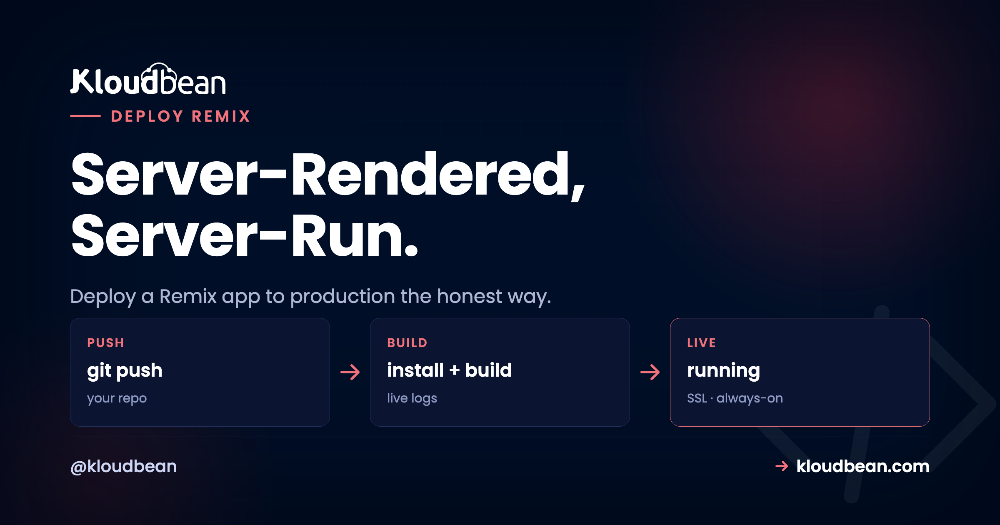

# How to Deploy a Remix App to Production, the Honest Way

*By Kloudbean Engineering · Server-Rendered, Server-Run.*



So you built something with Remix and now you want to deploy your Remix app to production. Quick gut check first. Your instinct might be to drop the built files on a static host, the way you would a plain React SPA. Don't. A Remix app isn't static. It renders on the server, runs your loaders on every request, and hands the browser real HTML with the data already baked in. To deploy a Remix app to production you need a running Node process, not a bucket of files.

That one fact fixes most of the "why is my Remix app blank in production" pain before it starts. This guide walks the whole path on a server you own: the build output, running it with `remix-serve` or your own Express server, wiring loaders and actions to a database, Remix environment variables, and the React Router v7 twist. Real commands, no hand-waving.

> **How do I deploy a Remix app to production?**
> Run `npm run build` (that runs `remix vite:build`), which writes a server handler to `build/server/index.js` and client assets to `build/client/`. Start it with `remix-serve ./build/server/index.js`, or run your own Express server, on a box with Node. It listens on `PORT`, sits behind a reverse proxy for SSL, and a process manager keeps it alive on crash or reboot. Your loaders and actions talk to a managed database over an environment variable. That's the whole shape.

## No, a Remix app is not static

The trap is simple. Remix is React, and React apps are famously "just files" you serve off a CDN, so a Remix app must be files too. It isn't.

A classic React SPA (Create React App, a plain Vite build) ships an HTML shell plus a JavaScript bundle. The browser downloads it, then fetches data from an API after load. The server only hands over files. Remix works the other way. When a request arrives, it runs the matching route's `loader` on the server, gets the data, renders your components to HTML with that data already in place, and sends a finished page. It hydrates in the browser and behaves like an SPA from there.

That server step is the whole difference. Code has to run, live, for every request, and a folder of files can't run a loader. So Remix hosting is Node hosting: a process that stays up on a port. It's the "run the artifact as a long-running process" move from our [mental model behind every deploy](https://www.kloudbean.com/blog/how-to-deploy-any-app/).

| | Static React SPA | Remix app |
| --- | --- | --- |
| **What ships to prod** | HTML shell + JS bundle (files) | A running Node server |
| **Where data is fetched** | In the browser, after load | In loaders, on the server, before HTML |
| **Needs a Node process?** | No, just serve the files | Yes, `remix-serve` or Express |
| **Can secrets stay hidden?** | Hard, most logic is client-side | Yes, loaders and actions run server-side |
| **First paint** | Blank, then a data fetch | Server-rendered HTML with data |
| **Host it as** | A static site | A Node app behind a proxy |

If your project is genuinely all static, you'd use a plain static build and skip this. You picked Remix, so you wanted the server render. Let's deploy the server.

<!-- SVG: one request to a Remix app. Browser sends GET /products to the Remix Node server; inside the server boundary, build/server/index.js receives it, the loader runs and queries a managed database over the private network, then React renders to HTML that already contains the data; the HTML plus data is sent back to the browser, which then hydrates. Navy #000f27 / purple #4F1AF3 / green #40b75f. -->

*One request, start to finish. The loader and the database call both happen inside the server boundary, before any HTML reaches the browser. That server is what you deploy.*

## Loaders and actions: the reason Remix needs a server

Two functions carry the whole framework, and both run on the server. Learn them and Remix deployment stops being mysterious.

A `loader` is server-side data fetching for a route. On a GET request, Remix calls the loader for every matched route, in parallel, before it renders, and you read the result with `useLoaderData()`. An `action` is the write side. When a form submits (POST, PUT, PATCH, DELETE), Remix runs the route's action on the server, then reruns the loaders so the page reflects the new state. No manual refetch, no client-side cache to babysit.

```tsx
// app/routes/products.tsx
import { json } from "@remix-run/node";
import { useLoaderData } from "@remix-run/react";
import { db } from "~/db.server";

export async function loader() {
  const products = await db.product.findMany();   // runs on the server
  return json({ products });
}

export async function action({ request }) {
  const form = await request.formData();
  await db.product.create({ data: { name: form.get("name") } });
  return json({ ok: true });
}

export default function Products() {
  const { products } = useLoaderData<typeof loader>();
  return <ul>{products.map((p) => <li key={p.id}>{p.name}</li>)}</ul>;
}
```

Look at where `db.product.findMany()` runs. On the server, inside the loader, every request. That code never ships to the browser, and it can't, because it needs a database connection the client should never see. That's the Remix SSR model in one screen, and why "just upload the files" fails. No file runs the query. A process does.

## What npm run build actually produces

Remix builds on Vite, so it's a Vite build under the hood. Run it and see what lands on disk:

```bash
npm run build          # runs: remix vite:build

# creates:
#   build/server/index.js   the server request handler (SSR + your loaders and actions)
#   build/client/           static client assets: JS, CSS, images
```

Two artifacts, two jobs. `build/client/` is the static stuff a browser downloads, served off disk or a CDN. `build/server/index.js` is the interesting half: the server module holding all your routes, loaders, and actions, ready to render. That file has to run in production. The client folder just rides along.

People trip here by uploading only `build/client/` and wondering why the app is blank or 404s on real routes. Nothing is running the loaders. You shipped the passengers and left the driver at home.

<!-- ADD IMAGE: The build folder after npm run build, with build/server/index.js sitting next to the build/client assets. -->

## Two ways to run it: remix-serve or your own Express server

Once you have a build, you need something to run `build/server/index.js` and listen on a port. There are two shapes, and both are fine.

### Option one: remix-serve

Remix ships a small production server called `remix-serve` (the `@remix-run/serve` package). It's the zero-config path. Point it at your server build and it runs:

```bash
remix-serve ./build/server/index.js
# a minimal Express-based server, reads PORT from the environment (default 3000)
```

Your `package.json` stays boring, which is the goal:

```json
{
  "scripts": {
    "build": "remix vite:build",
    "start": "remix-serve ./build/server/index.js"
  }
}
```

For most apps, `remix-serve` is all you need. Don't reach for a custom server without a reason.

### Option two: your own Express server

Need custom middleware, extra routes, a websocket, or tighter caching control? Swap in your own Express server. Remix gives you a request handler that plugs straight in:

```js
// server.js
import { createRequestHandler } from "@remix-run/express";
import express from "express";

const app = express();

// serve the built client assets
app.use(express.static("build/client", { immutable: true, maxAge: "1y" }));

// hand everything else to Remix
const build = await import("./build/server/index.js");
app.all("*", createRequestHandler({ build }));

app.listen(process.env.PORT || 3000, () => {
  console.log("Remix app listening");
});
```

Same server build, you're just wrapping it. The rule that bites people: read the port from `process.env.PORT`, never hard-code it. A managed host assigns the port and points its proxy there. Hard-code 3000 when the platform expects 8080 and the proxy can't find you. That's a 502 over a perfectly healthy process.

> **Founder take:** start with `remix-serve`. I've watched people write a custom Express server on day one because a tutorial did, then lose an afternoon to static-asset caching they never needed to touch. Add the custom server when you have a concrete reason, a webhook route or shared middleware. Not before.

## How do I deploy a Remix app to production on a server I own?

Here's the concrete path through the Kloudbean console. Remix runs as a standard Node app, so there's no special runtime to hunt for. You deploy it on the Node.js stack, like an Express or a [full-stack React app](https://www.kloudbean.com/blog/deploy-fullstack-react-app-to-production/).

### Add the app on the Node.js stack

In **Applications, Add Application**, pick the Node.js stack and a datacenter near your users. Remix builds are Vite builds, and Vite likes memory, so give the box headroom. 2 GB of RAM is a comfortable start. The platform sets up the Node runtime, a process manager, a reverse proxy, and a firewall so you're not wiring those by hand.


*Add Application: a Remix app is a Node app. Pick the Node.js stack and the platform provisions the process manager and proxy around it.*

### Connect Git and set the build

Deploys come from Git, so your repo is the source of truth, not a folder on your laptop. On the **Git Deployment** screen, connect GitHub over OAuth, paste the repo URL, pick a branch, and clone. Then fill the runtime fields:

- **App Directory:** the folder with your `package.json`.
- **Node Version:** match your local build, 20 or newer for a current Remix.
- **Port:** the port your app listens on, read from `PORT`.
- **Install / Build / Start:** `npm ci`, then `npm run build`, then `npm start` (which runs `remix-serve ./build/server/index.js`).


*Git Deployment: connect the repo, set Build to npm run build and Start to npm start, then Pull and Deploy. The build log streams live as it clones, installs, builds, and boots.*

Hit **Pull & Deploy** and the console streams every step, so a failure shows the exact line, not a spinner. Turn on automated deployment and each push to your branch rebuilds and ships itself, the Git-to-live loop the per-seat platforms rent you, on a server you control. The pattern is covered in [CI/CD auto-deploy from GitHub](https://www.kloudbean.com/blog/ci-cd-auto-deploy-from-github/).

<!-- ADD IMAGE: Live build logs streaming a Remix Vite build, line by line, during a deploy. -->

### The proxy and SSL you don't have to build

In production your Remix server listens on a port, and a reverse proxy sits in front on 443 to terminate SSL and forward traffic. On a managed server that proxy and a free auto-renewing certificate are handled, so you add your domain, point DNS, and you're on HTTPS. New to the proxy layer? [Nginx as a reverse proxy for Node](https://www.kloudbean.com/blog/nginx-reverse-proxy-for-node/) walks the whole thing. Keeping the process alive across crashes and reboots is a process manager's job, the [PM2 versus systemd](https://www.kloudbean.com/blog/pm2-vs-systemd/) question, and it's wired up for you.

## Wiring loaders and actions to a real database

Loaders and actions earn their keep the moment they talk to a database. Because that code runs on the server, the normal setup is a managed Postgres or MySQL plus an ORM like Prisma or Drizzle, with the connection string in an environment variable. Never in code, never in the client bundle.

Keep your database client in a server-only module. Remix treats any `*.server.ts` (or `.server.js`) file as server-only and keeps it out of the browser bundle:

```ts
// app/db.server.ts   (the .server suffix keeps this off the client)
import { PrismaClient } from "@prisma/client";

export const db = new PrismaClient();   // reads DATABASE_URL from the environment
```

Then any loader or action imports `db` and queries away, like the products example earlier. Launch a managed database, copy its connection string into `DATABASE_URL`, and reach it over the private network so the trip from your Remix server to the database stays off the public internet. Kloudbean runs seven managed engines (PostgreSQL, MySQL, MariaDB, MongoDB, Redis, Memcached, and Elasticsearch), each with automatic backups. The full pattern is in [adding a managed database to your app](https://www.kloudbean.com/blog/add-managed-database-to-your-app/), and the Prisma details are in [connecting Prisma to a managed database](https://www.kloudbean.com/blog/connect-prisma-to-a-managed-database/).

> **Run migrations in the deploy, not by hand.** Add your migration command to the build step, for example `npx prisma migrate deploy`, so the schema exists before the app serves a request. A first deploy against a database with no tables fails in a confusing way. A common mistake we see: skipping this, then chasing a loader error that's really a missing table.

## Remix environment variables and the server/client boundary

Remix keeps this refreshingly simple. In a loader or an action, you read `process.env`. It's plain Node on the server, so your `DATABASE_URL`, API secrets, and session keys are right there, and none of them touch the browser.

```ts
export async function loader() {
  const key = process.env.STRIPE_SECRET_KEY;   // server-only, never shipped
  // ...use it to talk to Stripe from the server
}
```

The one thing to understand is the boundary. Anything the browser needs, you expose deliberately, usually by returning it from your root loader onto `window.ENV`:

```tsx
// app/root.tsx
export async function loader() {
  return json({
    ENV: {
      STRIPE_PUBLIC_KEY: process.env.STRIPE_PUBLIC_KEY,   // safe, meant to be public
    },
  });
}
```

The split is worth saying out loud: secrets live in loaders and actions and stay on the server, public values get handed to the client on purpose. Nothing leaks by accident, because nothing crosses the boundary unless you send it. That beats frameworks that inline a prefixed variable into the client bundle at build time, where a mislabeled key is public forever. If build-time versus runtime is fuzzy, [environment variables, done right](https://www.kloudbean.com/blog/environment-variables-done-right/) covers it.

In the console, set these under **Environment Variables**. A **Paste .env Content** tab lets you drop your whole file in as key/value pairs. Set `DATABASE_URL` and your secrets, save, and they're on `process.env` at runtime, out of Git and out of the client bundle.


*Environment Variables: paste your .env, set DATABASE_URL and your secrets, save. Loaders and actions read them from process.env at runtime.*

## Wait, isn't Remix just React Router now?

Good question, and yes, mostly. In late 2024 the Remix team folded Remix v2's features into React Router v7, moving the bundler and server runtime into what they call React Router "framework mode." Remix had become such a thin layer over React Router that the split stopped making sense. So the loaders, actions, and server rendering you know all live in React Router v7 now.

What matters for deployment: the shape is the same. React Router v7 framework mode builds to a server plus client assets and runs as a Node process, just like Remix. The commands rename, they don't change meaning:

```bash
# React Router v7 framework mode, same idea, different names:
react-router build                            # -> build/server + build/client
react-router-serve ./build/server/index.js    # the production server
```

My honest read: starting fresh today, I'd reach for React Router v7 framework mode. Sitting on a Remix v2 app in production? There's no fire. It still builds and deploys exactly as described here, and everything in this guide applies to both. Frameworks move fast, so check the current React Router docs for exact package names when you upgrade. But the deploy target hasn't budged. It's still a Node server.

## Where Remix deploys actually break

First deploys stumble in predictable places. Knowing them turns a 30-minute stall into a 30-second fix.

**Deployed like a static site.** The number one Remix deploy mistake. Someone uploads `build/client/` to a static host and gets a blank page or 404s, because nothing runs the loaders. Remix needs the Node process from `build/server/index.js`. Run the server.

**Start command runs the dev server.** Setting Start to `npm run dev` out of habit runs the Vite dev server, which is for local reloading, not traffic. Start must be your production server, `remix-serve ./build/server/index.js` or your Express start, after Build has run.

**Server code leaked into a component.** Import your database client or a secret straight into a component instead of a loader, action, or `*.server` file, and Vite tries to bundle it for the browser. Best case, the build errors. Worst case, a key lands in the client bundle. Keep server-only code in loaders, actions, or `.server` modules.

**Hard-coded port.** The app listens on a fixed 3000 while the platform assigns a different port, so the proxy can't reach it and you get a 502 over a healthy process. Read `process.env.PORT`.

**Build tooling skipped.** Something sets `NODE_ENV=production` before install, npm skips `devDependencies` where Vite and the Remix plugin live, and the build dies with a missing-module error. Let install pull everything, then build. When a deploy 503s, read the app's error log first. It's almost always one of these, in plain text.

<!-- ADD IMAGE: The app error log with a build failure line highlighted, such as a missing module or a server import pulled into the client. -->

## The honest limits

Two things worth saying straight. First, this is a Linux Node deployment. Remix compiles to a standard Node server that runs great on a managed Linux box. It isn't a Windows or .NET target and was never meant to be, so you're on the happy path.

Second, your server lives in one region, not a global edge. Remix can target edge runtimes, but on a server you own it runs in the datacenter you picked. For most apps a well-placed server with its database beside it is faster than people expect, since you skip cold starts and the trip to a far-off database. If you serve a latency-critical audience worldwide, put Cloudflare in front (a paid add-on, free on Enterprise) so pages cache at the edge while your app runs on your hardware. "Managed" means the server, stack, SSL, backups, and patching are handled. Your code and data stay yours, on an ordinary Linux box you can move whenever you like.

---

### Build it. Push it. Watch the server boot.

Deploy your Remix app from Git onto a managed Node server you own, with the reverse proxy, SSL, and process manager already handled, and a managed database a click away. Start at [kloudbean.com](https://www.kloudbean.com/) from $8/mo, or talk to us about Enterprise. Sizes on [pricing](https://www.kloudbean.com/pricing/).

Node.js stack · Git deploy with live logs · Free auto-renewing SSL · Managed databases · Private networking · Automatic backups · Free migration · Free trial

## FAQ

### How do I deploy a Remix app to production?

Run `npm run build` to produce `build/server/index.js` and `build/client/`, then start the server with `remix-serve ./build/server/index.js` or your own Express server. Run it on a box with Node, listening on the assigned `PORT`, behind a reverse proxy for SSL, with a process manager to keep it alive. Connect a managed database over an environment variable and point a domain at it.

### Does a Remix app need a Node server?

Yes. Remix is a full-stack framework that server-renders, so its loaders and actions run on the server for every request. That requires a live Node process, not a folder of static files. The only time you'd skip the server is if you deliberately built a fully static or SPA-mode output, which most Remix apps are not.

### What does remix-serve do?

`remix-serve` is the small production server that ships with Remix, in the `@remix-run/serve` package. You run `remix-serve ./build/server/index.js` and it serves your built app, reading the port from the `PORT` environment variable and defaulting to 3000. It's the zero-config option, and most apps never need more than it.

### Remix vs Next.js for deployment, what's the difference?

Both are full-stack React frameworks that build to a Node server you can run on your own box, so the deploy shape is similar: build, then run a long-lived process behind a proxy. Remix leans on route loaders and actions for data, while Next.js uses Server Components and route handlers. Neither locks you in for self-hosting, and both run happily on a managed Node stack.

### How do loaders and actions work in production?

A loader runs on the server on GET requests to fetch data before the page renders, and you read it with `useLoaderData()`. An action runs on the server for form submissions and other writes, then Remix reruns the loaders so the page reflects the change. Both execute inside your running Node process, which is why the app can't be purely static.

### How do I connect a Remix app to a database?

Put your database client in a server-only module such as `db.server.ts`, read the connection string from an environment variable like `DATABASE_URL`, and import it into your loaders and actions. Use a managed Postgres or MySQL with an ORM like Prisma or Drizzle, and reach it over a private network. Run migrations in your deploy step so the schema exists before the first request.

### Is Remix the same as React Router now?

Effectively, yes. In late 2024 the Remix team merged Remix v2's features into React Router v7's framework mode, moving the bundler and server runtime there. Loaders, actions, and server rendering all carried over, and the deployment target is unchanged: a Node server built from your routes. New projects can start on React Router v7, while existing Remix v2 apps still build and deploy the same way.

### How do I set environment variables for Remix?

Read them with `process.env` inside loaders and actions, which run on the server, so secrets like `DATABASE_URL` stay off the client. To expose a value to the browser, return it from your root loader so it lands on `window.ENV`. Set the values in your host's environment variables panel and never commit them to Git.

### Why is my Remix app blank or 404ing in production?

The usual cause is deploying it like a static site: only the `build/client/` assets got uploaded and nothing is running `build/server/index.js`, so no loader ever runs. Make sure your production process starts the server build with `remix-serve` or your Express server. If it still fails, read the app's error log, since a missing env var or a skipped build is the next most common reason.

### What Node version and start command should I use for Remix?

Use Node 20 or newer to match a current Remix, and set your production Start command to run the built server, `remix-serve ./build/server/index.js` (usually wrapped as `npm start`). Do not use `npm run dev` in production, since that runs the Vite dev server, which is built for local reloading rather than real traffic.

---

*Kloudbean · A Remix app is a program that runs, not a folder you upload. Deploy it like one.*
