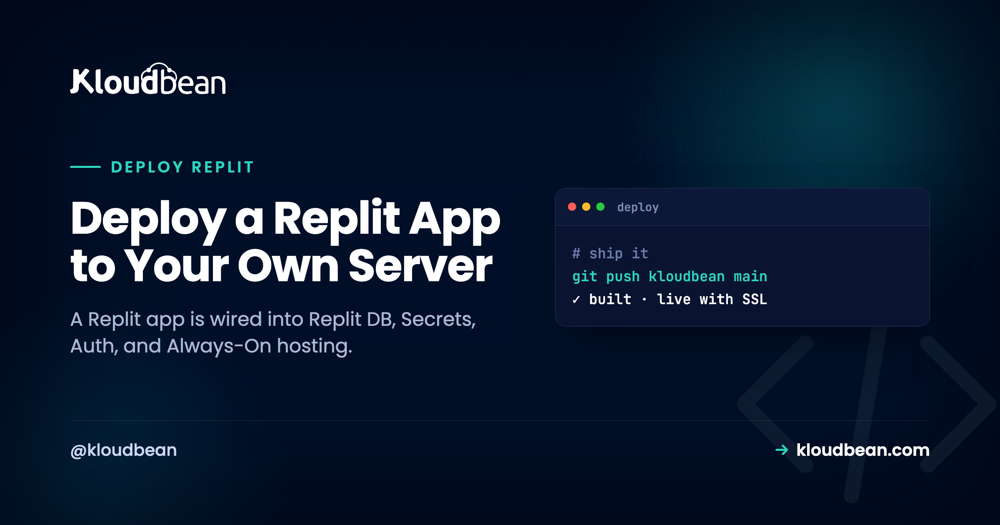

# Deploy a Replit App to Your Own Server: the Migration Map

Replit is a lovely place to build. One browser tab hands you an editor, a package manager, a shell, a database, and a Run button, with nothing to install. But that same convenience is what makes leaving trickier than it looks. Your app isn't only code. It's code wired into Replit's own database, its Secrets store, its Auth, and its always-on hosting.

So to deploy a Replit app on a server you own, you're not copying files across. You're running a small migration: unplugging each proprietary piece and plugging in a standard one. The good part is that the code itself is ordinary (Node, Python, whatever your Repl used), and every Replit-specific piece has a clean, well-trodden replacement. This guide is that map. What each Replit feature is, what it becomes on a normal server, and the steps to switch it over. Then the deploy, which is the same as shipping any app.

> **Short version:** Export your Repl to GitHub, then swap the proprietary pieces for standard ones: Replit DB becomes a managed Redis or Postgres, Secrets become environment variables, Replit Auth becomes your own auth, and the `.replit` / `replit.nix` config becomes a normal start command on a standard runtime. Launch a server, deploy from Git, and you're on infrastructure you own at a flat price.

## Why deploying a Replit app is really a migration

On Replit, a pile of managed services sit under your code, and your code calls them directly. The database is a built-in you reach through a URL the platform injects. Your secrets come from the Secrets pane as environment variables. Login can run through Replit accounts. The repl stays awake because of Always-On (or a Deployment). And two files, `.replit` and `replit.nix`, quietly describe how the whole thing runs and what's installed.

None of that exists on a plain Linux server, which is the point of owning one. So each convenience becomes a standard equivalent you control. The code is the easy 90%. The last 10%, the Replit-specific glue, is the actual job. Miss one piece and you get the classic half-migration: the app boots fine, then can't reach its data, because it's still looking for a database that only lived on Replit.

<!-- ADD IMAGE: original SVG migration map, Replit pieces (Replit DB, Secrets, Replit Auth, .replit/replit.nix, Always-On) on the left mapping to standard equivalents (managed Redis/Postgres, env vars, your own auth, start command + runtime, always-on process) on the right -->

## The pieces, side by side

Here's the same map with a bit more detail on what each thing actually is, so you can spot which rows even apply to your Repl. A static front end won't have most of these. A full app probably has several.

| Replit piece | What it is | On your server it becomes |
| --- | --- | --- |
| Replit DB | A proprietary key-value store, reached via `@replit/database` and a `REPLIT_DB_URL` the platform injects | A managed Redis (key-value) or Postgres, via your own connection string |
| Replit Secrets | A secrets pane whose values arrive as environment variables at run time | Environment variables you set in the console |
| Replit Auth | Sign-in using visitors' Replit accounts | Your own auth: a standard library or an identity provider |
| `.replit` | Defines the run command and entrypoint | Your Install / Build / Start commands |
| `replit.nix` | Declares the system packages and Nix environment | The managed runtime plus any extra system packages |
| Always-On / Deployments | Keeps the repl from sleeping when idle | An always-on process under a process manager, no toggle needed |

## Decouple each Replit piece

Work through the rows that apply. Most Repls need the first two. The rest depend on how deep you went.

### Replit DB becomes a managed database

This is the row people underestimate. Replit DB is a key-value store that only exists on Replit. Your code reaches it through `@replit/database` in Node (or `from replit import db` in Python), and the platform hands it a `REPLIT_DB_URL` behind the scenes. Take the app off Replit and that URL points at nothing.

Two clean targets. If you've been using it as plain key-value, a managed [Redis](https://www.kloudbean.com/blog/managed-redis-hosting/) is the natural home. If the data has real structure or relationships, move it into a managed [Postgres](https://www.kloudbean.com/blog/managed-postgresql-hosting/). The code change is small, it's swapping the client:

```
// Before: Replit DB (only works on Replit)
import Database from "@replit/database";
const db = new Database();          // uses REPLIT_DB_URL automatically
await db.set("user:42", { name: "Ada" });
const user = await db.get("user:42");

// After: managed Redis, your own REDIS_URL
import Redis from "ioredis";
const redis = new Redis(process.env.REDIS_URL);
await redis.set("user:42", JSON.stringify({ name: "Ada" }));
const user = JSON.parse(await redis.get("user:42"));
```

Don't leave the data behind. Before you switch the code, dump your existing keys from Replit while you still can, then load them into the new store:

```
// one-off export from Replit DB to a JSON file
import Database from "@replit/database";
import { writeFileSync } from "fs";
const db = new Database();
const keys = await db.list();
const dump = {};
for (const k of keys) dump[k] = await db.get(k);
writeFileSync("replit-db-dump.json", JSON.stringify(dump, null, 2));
```

The setup side is covered in [adding a managed database to your app](https://www.kloudbean.com/blog/add-managed-database-to-your-app/).

### Replit Secrets become environment variables

This one is a straight rename, which is a relief. The Secrets pane holds values that Replit injects as environment variables while your app runs, so in code you already read them with `process.env.SOME_KEY`. On a server, those same values live in the console as environment variables and reach your code the same way. Copy each secret across. The only ones you don't copy are the Replit built-ins like `REPLIT_DB_URL`; those get replaced by your own `DATABASE_URL` or `REDIS_URL` from the step above. If you want the full picture of runtime versus build-time variables, it's in [environment variables, done right](https://www.kloudbean.com/blog/environment-variables-done-right/).

<!-- ADD IMAGE: side by side, the Replit Secrets pane and the destination environment variables editor with the same keys in both -->

### Replit Auth becomes your own auth

Replit Auth lets people sign in with their Replit account. Handy while you live on the platform, and tied to it. Off Replit, you own login. Be honest with yourself about how much you leaned on it. If it was a light gate on an internal tool, swapping it is small. If it was your whole user system, budget real time for this row.

The replacement is a standard auth approach for your stack: a library like Passport, Lucia, or Auth.js for Node, Django's built-in auth or Authlib for Python, or a hosted identity provider if you'd rather not run it yourself. Whichever you pick, its config lands in your environment variables next to everything else. This is the one Replit-specific piece with no drop-in equivalent, so plan for it rather than discovering it on deploy day.

### .replit and replit.nix become a start command

`.replit` holds the run command and entrypoint. `replit.nix` declares the system packages through Nix. Neither file travels to another host, and neither needs to. Read what they say and translate. The `run` line becomes your Start command:

```
# .replit
run = "npm run start"
entrypoint = "index.js"
```

That maps to Install `npm ci`, Build `npm run build` (if you have one), and Start `npm start`, with the app listening on `process.env.PORT` instead of a fixed number. Anything `replit.nix` installed at the system level is either already part of the managed stack or a package you add to the server once. For most Node and Python apps, there's nothing exotic in there.

### Always-On becomes the default

On Replit, a free or starter repl sleeps when nobody's hitting it, and Always-On (or a Reserved VM Deployment) is what kept it up. On a server you own, staying up is simply how it works. The app runs under a process manager that keeps it alive and restarts it if it crashes, with no separate feature to buy. The thing you were paying extra for becomes the baseline.

## Step 1: Export your Repl to GitHub

Replit has Git built in. From the version control pane, connect your Repl to a new GitHub repository and push. That repo, not the Repl, becomes the source of truth your server deploys from. While you're in there, copy down everything in the Secrets pane, since you'll recreate those on the server in a minute.

## Step 2: Launch a server and deploy from Git

In the [Kloudbean](https://www.kloudbean.com/) console, click **Add Server**, pick a **Cloud Provider**, choose the stack that matches your Repl (Node.js, or a Python stack), pick the nearest datacenter, and give it 2–4 GB. **Launch Now** hands you a configured server in a few minutes, runtime and process manager and firewall and SSL included.


Open the app, go to **Application Administration → Deploy Code**, connect GitHub, paste your repository URL, choose the branch, and **Clone Repository**. Fill the runtime fields with the commands you translated from `.replit`: **App Directory**, **Port** (bind `process.env.PORT`), **runtime version**, and **Install / Build / Start**. Click **Pull & Deploy**.


## Step 3: Launch the database and set the variables

From **DBS → Launch Database**, spin up the managed Redis or Postgres you chose, then import your `replit-db-dump.json` (or your relational export) into it. In **Runtime Configuration → Environment Variables**, use the **Paste .env Content** tab to recreate your Secrets, then point `DATABASE_URL` or `REDIS_URL` at the new database.


Test on the temporary `*.kloudbeansite.com` URL, then add your custom domain under **Domain Aliases**, point DNS at the server, and install a free **Let's Encrypt** certificate. Turn on **automated deployment** so a push rebuilds and ships. That's the same instant loop Replit's Run button gave you, now on [a server you own](https://www.kloudbean.com/blog/ci-cd-auto-deploy-from-github/). And if your app, its API, and its database all belong together, they sit on [the one box](https://www.kloudbean.com/blog/host-app-api-and-database-on-one-server/) in one dashboard, instead of scattering into separate products the way they were on the platform.

<!-- ADD IMAGE: your former Repl running on its own domain with the SSL padlock, served from your own server -->

## If it won't come up

A **503** after a Replit move is almost always one of the rows you half-finished. In order of likelihood: a Secret that didn't get recreated as an environment variable, the app not binding `process.env.PORT` (Replit handled ports for you), or the database code still pointing at `REPLIT_DB_URL` instead of your new connection string. Read `app.error.log` at `/home/admin/hosted-sites/<app_system_user>/app-logs`, and the failure is usually named plainly. The deeper [503 playbook](https://www.kloudbean.com/blog/fix-503-after-deploying-your-app/) covers the rest.

## When staying on Replit is the right call

To be fair to Replit: if you're still prototyping, learning, or the app is small and its hosting suits you, there's no reason to move. The all-in-one experience is genuinely good for that. The migration pays off later, for two reasons. Cost gets predictable: instead of Autoscale usage billing or a per-Deployment Reserved VM, an owned server is a flat monthly price that several apps can share. And you gain control: the runtime, the process, the database, and the domain are all yours, on standard infrastructure you can move again whenever you want. You can even keep editing in Replit and just push to GitHub, letting your server rebuild. Replit stays the IDE; production lives on the box you own.

## The honest limits

Kloudbean runs Linux stacks: Node, Python, PHP, Ruby, and Java, with frameworks like React, Next.js, Vue, Django, and Laravel on top. That spans what most Repls are built in. It isn't for Windows/.NET/IIS. "Managed" means the server, stack, SSL, backups, and patching are handled; you own and maintain the application and its data. The tool-agnostic version of this walkthrough, covering Lovable, Bolt, Cursor, and v0 too, is the [deploy an AI-built app](https://www.kloudbean.com/blog/deploy-ai-built-app-to-production/) pillar.

**Keep Replit's speed. Own the server.** Migrate your Replit app to [kloudbean.com](https://www.kloudbean.com/), with a free trial and your first migration done for you. Plans on [pricing](https://www.kloudbean.com/pricing/).

## FAQ

**Can I move my Replit app to my own server?**
Yes. Push your Repl to GitHub with Replit's Git integration, then deploy from that repo on Kloudbean. The code is standard; the work is migrating the Replit-specific pieces (Replit DB, Secrets, Auth, and the .replit config) to their standard equivalents on the server.

**What happens to Replit DB when I move off Replit?**
Replit DB is a proprietary key-value store that only exists on Replit, so you migrate it. Launch a managed Redis (for plain key-value) or Postgres (for structured data), export your keys from Replit DB to a JSON file, import them into the new store, and swap the `@replit/database` client for a standard one.

**How do I move my Replit Secrets?**
They become environment variables. Everything in the Secrets pane already reaches your code as `process.env` values, so recreate each one under Runtime Configuration, Environment Variables. Skip the Replit built-ins like `REPLIT_DB_URL` and use your own database connection string instead.

**What about Replit Auth if I migrate?**
Replit Auth signs users in with their Replit accounts, which doesn't work off-platform, so you replace it with your own auth. That's a standard library for your stack (Passport, Lucia, or Auth.js for Node; Django auth or Authlib for Python) or a hosted identity provider. It's the one piece with no drop-in equivalent, so plan for it.

**Do .replit and replit.nix work on another host?**
No, they're Replit-specific. Read them and translate: the `run` line in `.replit` becomes your Start command, and anything `replit.nix` installed at the system level is either part of the managed stack or a package you add once. Then bind the app to `process.env.PORT`.

**Do I have to stop using Replit to do this?**
No. You can keep editing in Replit, push to GitHub, and let your server rebuild and deploy. Replit stays your IDE; the server hosts production. Nothing locks you into one workflow.

**Why move off Replit hosting at all?**
Ownership and predictable cost. A flat-price server you control instead of usage-based or per-Deployment billing, several apps on one box, and full control over the runtime and data. If you're still prototyping or the app is small, staying on Replit is perfectly reasonable.
