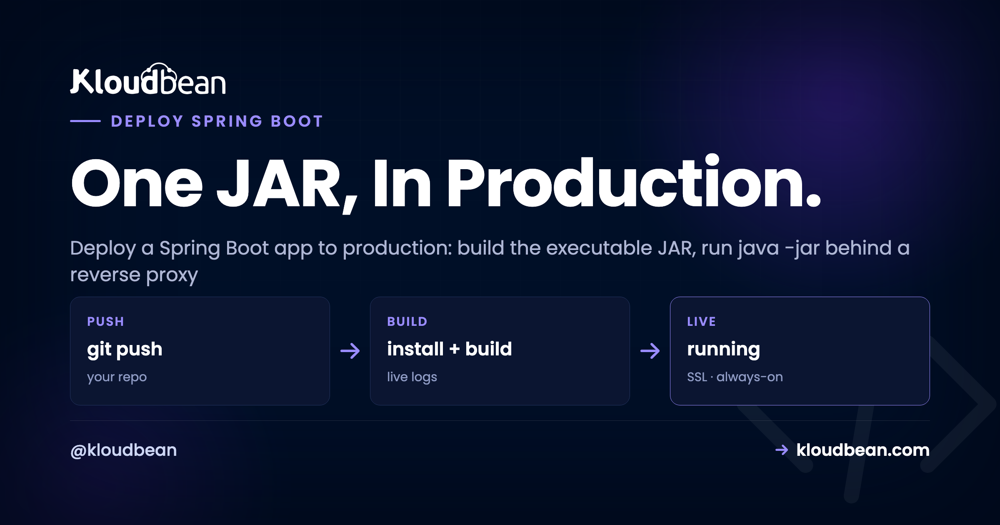

# How to Deploy a Spring Boot App to Production

**Deployment · Spring Boot**

By Kloudbean Engineering · One JAR, In Production.



You built a Spring Boot service. It runs locally with `./mvnw spring-boot:run`, the endpoints answer on `localhost:8080`, and everything's green. Then you go to deploy that Spring Boot app to production and the questions pile up. Where does the JAR run? What about the port, the database, the config, the memory? Good news: Spring Boot makes this simpler than most stacks. It packages your whole app, embedded web server and all, into one executable JAR. This is the honest guide to Spring Boot hosting: build the JAR, run it, and handle the five production details that matter.

> **How do I deploy a Spring Boot app to production?**
> Build an executable JAR with `./mvnw clean package` (or `./gradlew bootJar`), then run `java -jar app.jar` on any server that has a JVM. Spring Boot embeds Tomcat, so there's no separate app server to install. Externalize config through environment variables (`SPRING_DATASOURCE_URL`, `SPRING_PROFILES_ACTIVE=prod`), set a sane `-Xmx` so the JVM isn't OOM-killed, put it behind a reverse proxy for TLS, keep the process supervised so it restarts on crash and reboot, and point it at a managed database.

## What actually happens when you deploy a Spring Boot app

The mental model is the whole game. Spring Boot builds what people call a fat JAR (or uber JAR): one file that contains your compiled classes, every dependency, and an embedded web server, usually Tomcat. There's no WAR to drop into a servlet container you installed separately. The server is inside the JAR.

So the runtime story is short. Put a JVM on a machine, copy the JAR over, run `java -jar app.jar`. The embedded Tomcat starts, binds a port, and serves your endpoints. Your entry point is a plain `main` method, the one Spring Boot generated for you:

```java
@SpringBootApplication
public class Application {
  public static void main(String[] args) {
    SpringApplication.run(Application.class, args);
  }
}
```

A Spring Boot app is just a long-running Java process, and everything below is about running that one process well: config, a port, memory, staying alive, and a database.

<!-- Bespoke SVG diagram: Git source -> mvn/gradle build -> fat JAR (your code + embedded Tomcat + dependencies) -> JVM (java -jar, :8080, heap capped by -Xmx) behind a reverse proxy on :443 for TLS, talking down to a managed Postgres/MySQL over the local network via a HikariCP pool. -->

*Figure: The whole path: Git source, built by Maven or Gradle into a fat JAR with an embedded Tomcat, run as one JVM process behind a TLS proxy, talking to a managed database over the local network.*

> **Coming from WAR files and a standalone Tomcat?** That's the old model: build a WAR, install and tune a separate Tomcat, drop the WAR into `webapps/`, manage two lifecycles apart. Fat JARs collapse that into one artifact you own end to end. You can still build a WAR for a legacy container, but for a new service the executable JAR is the right default.

## Build the executable JAR (Maven or Gradle)

Both build tools produce the same kind of artifact, so use whichever your project already uses. The command differs, the result doesn't.

```bash
# Maven: build the executable JAR
./mvnw clean package
# -> target/myapp-1.0.0.jar

# Gradle: same idea, different task
./gradlew clean bootJar
# -> build/libs/myapp-1.0.0.jar
```

| Build tool | Build command | Output artifact |
| --- | --- | --- |
| **Maven** | `./mvnw clean package` | `target/myapp-1.0.0.jar` |
| **Gradle** | `./gradlew clean bootJar` | `build/libs/myapp-1.0.0.jar` |

Use the committed wrapper (`./mvnw` or `./gradlew`), not a globally installed Maven or Gradle. It pins the build-tool version, so CI matches your laptop and you dodge a whole genre of "works locally, breaks on the build server" tickets. Build in CI from Git, not by hand. More on that below.

<!-- ADD IMAGE: a terminal running the build to BUILD SUCCESS, with the target JAR path visible. -->

## Run it: java -jar and an embedded server

With the JAR built, running it is one line. People expect this part to be hard. It isn't:

```bash
# run the fat JAR on any machine with a JVM
java -jar target/myapp-1.0.0.jar

# with a heap cap and the prod profile active
java -Xmx512m -Dspring.profiles.active=prod -jar target/myapp-1.0.0.jar
```

The JVM boots, Spring wires up your beans, the embedded Tomcat starts, and you'll see the familiar "Tomcat started on port 8080" line. No `CATALINA_HOME`, no `server.xml`, no WAR to drop anywhere. One rule: match the Java version you built against. A JAR compiled for Java 17 needs a Java 17 (or newer) runtime, or it throws `UnsupportedClassVersionError` on startup.

<!-- ADD IMAGE: the startup logs showing the Spring banner and the embedded Tomcat binding its port. -->

## Externalize config: application.properties vs environment variables

This is the Spring-specific bit that trips people. Your `application.properties` or `application.yml` is fine for defaults: the values that are the same everywhere and aren't secret. Commit those.

Secrets and anything that changes per environment come from the environment, not the JAR. Bake a production password into `application.properties` and commit it, and you've published your credentials to everyone with repo access, and to Git history forever. It's the single most common Spring Boot production mistake, and it's completely avoidable.

Spring makes this easy through **relaxed binding**. Any property has an environment-variable form: uppercase it, turn dots into underscores, and the env var overrides the file. So you keep safe defaults in the JAR and inject the real values at runtime:

```yaml
# application.yml -> safe defaults, committed to git
server:
  port: 8080
spring:
  datasource:
    url: jdbc:postgresql://postgres-123456.kloudbeansite.com:5432/appdb
```

```bash
# production -> set in the dashboard, never committed
SPRING_PROFILES_ACTIVE=prod
SPRING_DATASOURCE_URL=jdbc:postgresql://10.0.0.5:5432/appdb
SPRING_DATASOURCE_USERNAME=appuser
SPRING_DATASOURCE_PASSWORD=change-me
```

The mapping people forget:

| Property (in the file) | Environment variable |
| --- | --- |
| `spring.datasource.url` | `SPRING_DATASOURCE_URL` |
| `spring.datasource.username` | `SPRING_DATASOURCE_USERNAME` |
| `spring.datasource.password` | `SPRING_DATASOURCE_PASSWORD` |
| `spring.profiles.active` | `SPRING_PROFILES_ACTIVE` |
| `server.port` | `SERVER_PORT` |

Profiles are the other half. Put production overrides in `application-prod.yml`, set `SPRING_PROFILES_ACTIVE=prod`, and Spring layers that file on top of the defaults. Forget to activate it and your app runs with dev settings in production, which is how a service ends up pointing at a laptop database on launch day. More on keeping secrets out of Git in [environment variables done right](https://www.kloudbean.com/blog/environment-variables-done-right/).

<!-- ADD IMAGE: the environment variables panel with the SPRING_ values entered, so secrets live outside the JAR. -->

## The port and the reverse proxy

Spring Boot listens on `server.port`, default 8080. In production your app doesn't face the internet directly. A reverse proxy sits in front, terminates TLS on 443, and forwards plain HTTP to your app's internal port. The proxy handles certificates and the public connection; your JVM just handles requests.

Two ways to set the port. Set `server.port` (or its `SERVER_PORT` env form) and point the proxy at that number. Or, if your platform hands you a `PORT` variable, bridge it, since Spring Boot doesn't read a bare `PORT` on its own:

```properties
# application.properties: use the platform's PORT if present, else 8080
server.port=${PORT:8080}
```

Get this wrong and the proxy talks to a port nothing is listening on, which shows up as a 502 or 503 while your app sits there healthy on the wrong number. If the reverse-proxy concept is fuzzy, we break it down in [reverse proxy explained](https://www.kloudbean.com/blog/reverse-proxy-explained/), and the hands-on config (written for Node, but the behavior is identical) is in [nginx reverse proxy for Node](https://www.kloudbean.com/blog/nginx-reverse-proxy-for-node/). On a managed server you don't hand-write any of this; the proxy and a free auto-renewing certificate come with the stack.

## JVM memory: set -Xmx before the OOM killer does

This one bites Java deploys specifically. The JVM sizes its heap from how much memory it thinks the machine has, and on a small server or container that guess goes wrong both ways. Too timid, and you paid for RAM the heap never touches. Too greedy, on older runtimes that ignored the container's memory limit, and the heap outgrows the box, so the Linux kernel kills the process. No stack trace, just a service that vanishes and restarts.

The fix is to stop guessing. Cap the heap:

```bash
# cap the max heap so the JVM stays inside the box
java -Xmx512m -jar app.jar
```

Treat `512m` as illustrative, not a recommendation; size it to your app and your box. The rule that keeps you safe: the heap is not the whole process. Metaspace, thread stacks, and buffers live outside `-Xmx`, so the real footprint is bigger than the heap. Leave headroom. On a 1 GB box, giving `-Xmx` the full gigabyte is how you get OOM-killed under load. Modern JVMs (Java 11 and up, and late Java 8 builds) are container-aware and respect a cgroup limit, but an explicit `-Xmx` removes the doubt. I'd rather read one number in a config than reason about defaults at 2am.

Watching real memory beats guessing. A managed server shows the JVM's actual usage, so you size the heap and the box against real numbers, not vibes.


*Server health: watch real RAM and CPU, then set a heap that fits the box instead of guessing.*

## Keep the process alive (systemd, or let the platform do it)

Run `java -jar app.jar` in an SSH session and it dies when that session closes. That's not a deploy, that's a demo. In production something has to own the process: start it on boot, restart it on crash, keep it running after you log out. On a plain Linux box that's **systemd**. A minimal unit:

```ini
# /etc/systemd/system/myapp.service
[Unit]
Description=My Spring Boot app
After=network.target

[Service]
User=appuser
EnvironmentFile=/opt/myapp/app.env
ExecStart=/usr/bin/java -Xmx512m -jar /opt/myapp/app.jar
Restart=always
RestartSec=5

[Install]
WantedBy=multi-user.target
```

`Restart=always` is the line that matters. It turns "crashed and down until someone noticed" into "crashed and back in five seconds." `EnvironmentFile` loads secrets from a file that never touches Git. If you're weighing supervisors, or came from Node and know PM2, the tradeoffs are in [PM2 vs systemd](https://www.kloudbean.com/blog/pm2-vs-systemd/). Short version for a JVM app: systemd is the natural fit, since you're supervising one long-lived process, not a fleet of Node workers.

On a managed platform you don't write the unit file. The platform runs your start command as a supervised service, brings it back after a crash, and restarts it after a reboot. Same guarantee, none of the wiring.

## Connect Spring Boot to a managed database

Almost every Spring Boot service is an API in front of a database. Spring Data JPA or plain JDBC talks to Postgres or MySQL, and Spring auto-configures the connection from the same `spring.datasource.*` properties you already saw. In production those come from the environment:

```bash
# these three env vars are all Spring needs to connect
SPRING_DATASOURCE_URL=jdbc:postgresql://10.0.0.5:5432/appdb
SPRING_DATASOURCE_USERNAME=appuser
SPRING_DATASOURCE_PASSWORD=change-me
```

Spring Boot ships with **HikariCP** as its default connection pool, and that default earns its keep. Opening a fresh database connection is slow. A pool keeps connections warm and hands them out: a request borrows one, runs its query, returns it. Without pooling, a traffic burst opens a socket per request and blows through the database's connection limit. You'll see `FATAL: too many connections` and a pile of failed requests. Cap the pool so your app can't ask for more than the database can give:

```properties
# HikariCP is the default pool; size it deliberately
spring.datasource.hikari.maximum-pool-size=10
```

Size it against your database, and remember the math changes when you run more than one instance: three app instances at a pool of 10 each is 30 connections, not 10. The why-and-how of pool sizing is in [database connection pooling](https://www.kloudbean.com/blog/database-connection-pooling/). For launching the database itself, wiring the connection string safely, and running migrations, follow [add a managed database to your app](https://www.kloudbean.com/blog/add-managed-database-to-your-app/).

Two rules that aren't optional. Lock the database to your app server's IP, not a public port, so only your app reaches it. And never hardcode credentials in `application.properties`; they belong in the environment, where you rotate a password without a code change.


*Launch Database: a managed Postgres or MySQL, provisioned and backed up, locked to your app server's IP. Feed its details into your SPRING_DATASOURCE_ variables.*

## Deploy a Spring Boot app on a managed server

Here's where it comes together. A managed server hands you the pieces already assembled: a JVM, a reverse proxy, free SSL, a firewall, and process supervision. Java is a first-class managed runtime on Kloudbean, alongside Node, Python, PHP, and Ruby, so you bring the repo and it brings the plumbing.

### Add the app and pick the runtime

Create a server, choose a cloud (Kloudbean runs seven: AWS, Amazon Lightsail, Google Cloud, DigitalOcean, Vultr, Akamai Linode, and UpCloud), pick a size, then add your application. A single JVM service is comfortable on a small box to start; resize later if the numbers say so.


*Add Application: your Spring Boot service gets its own space on the server, with its runtime and config kept separate.*

### Deploy from Git with live build logs

Deploys come from your repository, which is exactly right: the repo is the source of truth, not a JAR you scp'd once and forgot. Connect GitHub, pick a branch, and set the build and start commands:

```bash
# Build command
./mvnw clean package -DskipTests

# Start command
java -Xmx512m -jar target/myapp-1.0.0.jar
```

Trigger a deploy and the build log streams live, so you watch the dependencies download, the compile, and the JAR get built instead of guessing why it failed. Turn on automated deployment and every push to that branch builds and ships itself, with a recorded history of what went out. Same continuous-deploy loop the big platforms sell, on a server you own. Full setup in [CI/CD auto-deploy from GitHub](https://www.kloudbean.com/blog/ci-cd-auto-deploy-from-github/).


*Git Deployment: connect the repo, set the build and start commands and the port, then deploy and watch the build log stream.*

Set your environment variables in the console (the `SPRING_DATASOURCE_*` values, `SPRING_PROFILES_ACTIVE=prod`, and any keys), point a domain, and turn on the free auto-renewing certificate. The proxy is already terminating TLS, so your JVM never thinks about certificates.

<!-- ADD IMAGE: the deployment history showing a successful build and the commit that shipped. -->

## Where Spring Boot deploys usually go wrong

Most failed Java deploys aren't Java problems. They're config and memory problems. The list of suspects is short, so check these before you reread your service classes:

- **Secrets baked into the JAR.** A password in a committed `application.properties` is a leak and a rotation headache. Move it to an env var.
- **The prod profile never activated.** No `SPRING_PROFILES_ACTIVE=prod`, so the app runs dev config in production and connects to the wrong things.
- **Port mismatch.** The app listens on 8080 while the proxy forwards somewhere else, and you get a 502 from a perfectly healthy app.
- **No `-Xmx` on a small box.** The heap outgrows the machine and the kernel OOM-kills the process on the first real traffic.
- **Run in a shell, not supervised.** The JAR dies with the SSH session, or never comes back after a reboot.
- **A connection per request.** Bypassing the pool exhausts the database's connections under load.
- **Java version mismatch.** A JAR built for a newer Java throws `UnsupportedClassVersionError` on an older runtime.

Notice what's not on that list: your business logic. It's almost never the endpoints. So when a deploy breaks, resist the urge to reread controllers. Read the startup logs, find the one line that names the real cause, fix that, and ship again. Faster, and usually right.

---

**Your Spring Boot app, live on a server you own.**

Deploy the JAR from Git with live build logs, wire in a managed Postgres or MySQL, and get a reverse proxy with free auto-renewing SSL, no hand-rolled config. Start at [kloudbean.com](https://www.kloudbean.com/); sizes and plans (from $8/mo, Enterprise custom) are on [pricing](https://www.kloudbean.com/pricing/).

Managed Java runtime · Git deploy with live build logs · Managed PostgreSQL and MySQL · Reverse proxy and free SSL · Free migration · Free trial

## FAQ

### How do I deploy a Spring Boot app to production?
Build an executable JAR with `./mvnw clean package` or `./gradlew bootJar`, then run `java -jar app.jar` on any server with a JVM. Externalize config via environment variables, activate the prod profile, set a sane `-Xmx`, front it with a reverse proxy for TLS, and keep it supervised. On a managed platform you deploy from Git and the proxy, SSL, and supervision come with the stack.

### How do I run a Spring Boot JAR in production?
Run `java -jar app.jar`, but not in a terminal that closes. Wrap it in systemd with `Restart=always` so it survives crashes and reboots, or let a managed platform run your start command as a supervised service. Match the runtime to the Java version you built against.

### Do I need to install Tomcat separately for Spring Boot?
No. A Spring Boot fat JAR embeds Tomcat, so `java -jar app.jar` starts the server for you. Nothing separate to install or patch. You can still build a WAR for a legacy external container, but for a new service the embedded server is the right default.

### How do I set environment variables and profiles for Spring Boot?
Spring uses relaxed binding: uppercase a property and turn dots into underscores, so `spring.datasource.url` becomes `SPRING_DATASOURCE_URL`. Put per-environment overrides in `application-prod.yml` and set `SPRING_PROFILES_ACTIVE=prod` to activate them. Keep secrets in env vars, never in the JAR.

### How do I connect Spring Boot to a PostgreSQL or MySQL database?
Set `SPRING_DATASOURCE_URL`, `SPRING_DATASOURCE_USERNAME`, and `SPRING_DATASOURCE_PASSWORD` from the environment and Spring auto-configures the datasource, pooled by HikariCP. Lock the database to your app server's IP and never hardcode credentials. Launch a managed Postgres or MySQL and feed its details into those three variables.

### What -Xmx should I set for a Spring Boot app?
There's no universal number, so size it after watching real memory use. The point is to set it, so the heap can't outgrow a small box and get OOM-killed. And remember the heap isn't the whole process: metaspace, thread stacks, and buffers live outside `-Xmx`, so leave headroom.

### Should I run Spring Boot behind nginx or a reverse proxy?
Yes, in production. The proxy terminates TLS on 443 and forwards plain HTTP to your app's internal port, so the JVM never handles certificates. Make sure it forwards to the same port Spring Boot listens on. On a managed server the proxy and free SSL come with the stack.

### Maven or Gradle for building the Spring Boot JAR?
Either. Use whatever your project already uses, since both produce the same executable JAR. Maven builds it with `./mvnw clean package`, Gradle with `./gradlew bootJar`. Use the committed wrapper so the build version is pinned and CI matches your laptop.

### How do I keep a Spring Boot app running after it crashes or the server reboots?
Don't run it in a shell session. A systemd unit with `Restart=always` restarts it in seconds and starts it on boot, or a managed platform does the same by running your start command as a service. That's the difference between a service and a process someone babysits.

### Can I auto-deploy my Spring Boot app from GitHub?
Yes. Connect the repository, choose a branch, set the build and start commands, and turn on automated deployment. Each push then builds and ships with live build logs, and every deploy is recorded. Releasing a change becomes a plain git push.

---

By Kloudbean · Build the JAR once, run it anywhere a JVM lives, and own the box it runs on.
